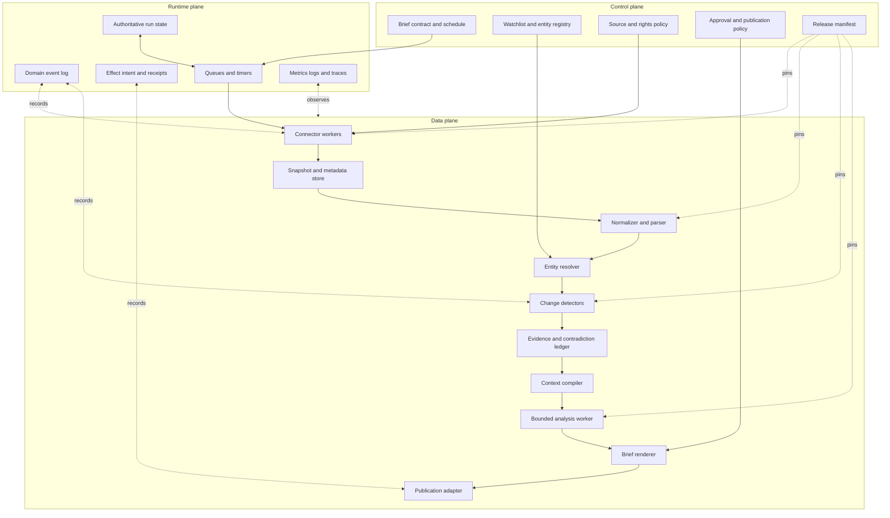
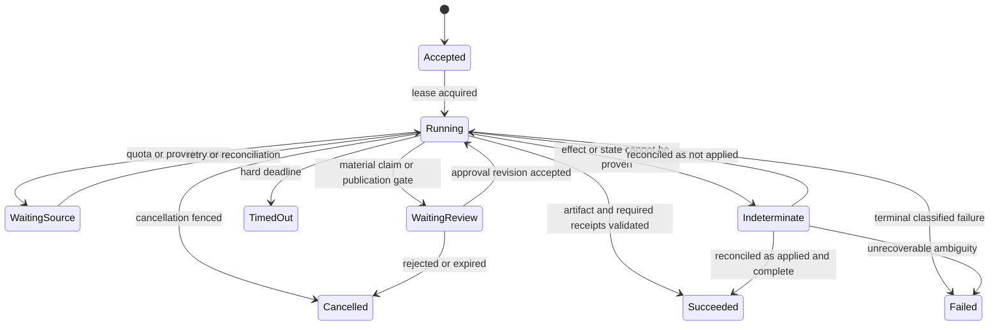

# Reference Architecture and Runtime

## Architectural decision

Build an application-owned monitoring pipeline with typed tools, authoritative state, deterministic policy gates, and a bounded model-assisted analysis step. The model does not own scheduling, collection permission, entity truth, effect authorization, or run completion.

Begin as a modular service plus worker rather than a fleet of microservices. Split deployment units only when source isolation, queue contention, failure domains, tenant boundaries, or scaling measurements justify it. A mature logical architecture can still run in one process during early stages.

## Logical components



### Control plane

The control plane contains versioned human and policy decisions:

- brief contracts and schedules;
- entity/watchlist definitions;
- source rights, credentials, rate, purpose, and retention policy;
- materiality and reviewer rules;
- audience and allowed-effect policy;
- budget and service-level profiles;
- release manifests and kill-switch state.

Changes to control-plane records are auditable effects. The analysis worker may propose a watchlist or source change, but cannot activate it.

### Data plane

The data plane performs collection and transformation. Its stages are explicit because each has different failure semantics:

1. **Collect:** retrieve through an approved adapter and capture transport/provider metadata.
2. **Snapshot:** retain the permitted representation, or retain minimal integrity and locator metadata if content retention is prohibited.
3. **Parse and normalize:** extract structured fields while preserving original values and versions.
4. **Resolve:** associate records with canonical entities or return an ambiguity set.
5. **Detect:** compare compatible versions and emit candidate change events.
6. **Validate evidence:** attach provenance, rights, source dependence, freshness, and contradiction state.
7. **Compile context:** select only the policy-compatible evidence needed for the brief question.
8. **Analyze:** classify materiality, explain differences, test hypotheses, and draft scenarios under a typed output contract.
9. **Render:** produce a stable, typed briefing projection.
10. **Publish:** create a controlled effect with approval, idempotency, receipt, and reconciliation.

### Runtime plane

The runtime plane preserves operational truth independently of model text. Follow the canonical [agent state and event contracts](../../runtime/agent-state-and-event-contracts.md): command, run state, domain event, effect, delivery projection, and telemetry are separate records.

## Component contracts

| Component | Typed input | Typed output | Must not do |
|---|---|---|---|
| Connector | source policy, endpoint, cursor/validator, request budget | retrieval receipt and representation reference | invent permission, follow arbitrary discovered links, or treat `200` as fresh truth |
| Parser | representation reference, source/schema version | source fields, spans, warnings, parser receipt | silently coerce units, dates, missing values, or changed layouts |
| Entity resolver | normalized record, registry snapshot | exact match, calibrated candidate set, or unresolved state | merge on name similarity alone |
| Change detector | compatible before/after versions, detector profile | typed delta, material candidate, detector receipt | compare incompatible definitions without flagging them |
| Evidence validator | delta, source policy, provenance, freshness | admissible evidence, quarantine, or review requirement | treat citation presence as claim support |
| Context compiler | brief contract, evidence graph, token budget | labeled context bundle and compaction receipt | include unapproved or unrelated corpus content |
| Analysis worker | immutable context bundle, tool catalog, budget | typed claims, hypotheses, scenarios, omissions, and completion proposal | change policy, publish, or report success without validation |
| Brief renderer | approved analysis revision, template | immutable brief revision and manifest | mutate underlying evidence or hide unresolved conflicts |
| Publisher | exact brief revision, audience policy, approval token | effect receipt or `outcome_unknown` | blindly retry an ambiguous effect |

## Authoritative run model

A useful state machine exposes waiting and indeterminate outcomes:



An ended model stream is merely an attempt event. Success requires:

- the expected change/evidence/brief artifacts exist and validate against their schemas;
- all required sources have a success, explicit stale exception, or visible partial-coverage state;
- material claims have the required reviewer disposition;
- required effects have definitive receipts;
- budgets, policy, and cancellation fences were respected.

## Command, event, and effect example

```json
{
  "command": {
    "command_id": "cmd-01K4...",
    "type": "GenerateBrief",
    "tenant_id": "tenant-42",
    "brief_contract_id": "ci-weekly-product-market-v3",
    "watchlist_version": "wl-2026-08-31-04",
    "deadline": "2026-08-31T01:00:00Z"
  },
  "run": {
    "run_id": "run-01K4...",
    "attempt_id": "attempt-03",
    "state": "WaitingReview",
    "state_version": 17,
    "lease_fence": 9,
    "release_manifest_id": "rel-2026-08-30-07"
  },
  "domain_event": {
    "event_id": "evt-01K4...",
    "type": "MaterialClaimProposed",
    "claim_id": "claim-184",
    "event_time": "2026-08-31T00:41:12Z",
    "recorded_time": "2026-08-31T00:41:13Z"
  },
  "effect_intent": {
    "effect_id": "eff-01K4...",
    "type": "PublishBrief",
    "idempotency_key": "brief-2026w35:rev-4:strategy-leadership:portal",
    "approval_id": "approval-77",
    "status": "not_started"
  }
}
```

Do not overload one identifier for these objects. Attempts may retry a run; events may be replayed; a publication effect may outlive the worker; traces may be sampled. Separate identities prevent false deduplication and make incident reconstruction possible.

## Tool surface

Expose narrow, typed tools instead of a generic browser, shell, database, or HTTP client in the normal analysis path.

### Observation tools

- `get_watchlist_snapshot(version)`
- `list_admissible_changes(brief_contract_id, cursor)`
- `get_evidence_bundle(change_id)`
- `get_entity_record(entity_id, version)`
- `get_market_series(series_id, vintage_or_snapshot)`
- `compare_source_versions(source_object_id, from_version, to_version)`
- `get_contradiction_set(claim_subject_id)`

### Proposal tools

- `propose_entity_match(record_id, candidate_id, rationale)`
- `propose_materiality(change_id, dimensions, evidence_ids)`
- `propose_claim(claim_type, text, evidence_ids, qualifiers)`
- `propose_scenario(name, assumptions, implications, triggers)`
- `propose_watchlist_change(target, purpose, sources)`

### Controlled effect tools

- `save_brief_draft(brief_contract_id, exact_revision)`
- `request_material_claim_review(claim_ids, reviewer_group)`
- `request_publication_approval(brief_revision_id, audience, channel)`
- `publish_approved_brief(brief_revision_id, approval_token, idempotency_key)`
- `revoke_brief_revision(publication_id, reason, approval_token)`

The model receives proposal tools by default. Effect tools are exposed only for the current state and scope, with deterministic authorization outside the model. See [tool design](../../tools/README.md) and [idempotency and side effects](../../reliability/idempotency-and-side-effects.md).

A production adapter also needs a tenant/purpose/audience-scoped capability manifest, provider-semantic mappings, lifecycle-rights decision, conformance report and expiry. The worked contract and representative provider differences are in [Provider Qualification and Worked Intelligence Lifecycle](10-provider-qualification-and-worked-intelligence-lifecycle.md).

## Runtime and language choice

Use the language the organization can operate safely. The design does not depend on a specific SDK.

| Choice | Best fit | Caution |
|---|---|---|
| Python | Existing data/NLP team; rich parsing, table, statistics, and evaluation ecosystem | Keep type/schema checks and asynchronous resource limits explicit. |
| TypeScript/Node.js | Integration-heavy service, shared web types, event-driven I/O | Isolate CPU-heavy parsing and preserve exact decimal/time semantics. |
| JVM or .NET | Enterprise operational standard, mature identity/observability/platform controls | Avoid introducing Python solely because the workload uses an LLM. |
| Go | High-concurrency connectors and simple operational footprint | Model/data tooling may need more custom integration. |
| Polyglot | A measured parser, sandbox, or platform constraint cannot be met cleanly in one runtime | Adds deployment, schema, debugging, and ownership cost; justify with evidence. |

Agent frameworks may simplify model/tool loops, but application code remains responsible for policy, state, effects, schemas, and release manifests. Pin framework and model behavior like any other dependency. Do not allow a framework's in-memory conversation object to become authoritative task state.

## Deployment shapes

### Early bounded deployment

- one API/control service;
- one scheduled worker process with bounded concurrency;
- relational database for control, state, events, and evidence metadata;
- object storage for permitted immutable representations;
- a queue or database-backed job table;
- one model provider adapter;
- internal review UI and draft-only output.

This is sufficient until load or failure evidence says otherwise.

### Reliable production deployment

- separate connector and analysis worker pools so hostile or slow source processing cannot starve reviews;
- durable timers/workflow state for long waits and human approvals;
- tenant- and source-scoped credentials;
- an isolated content parsing boundary with egress restrictions;
- a transactional outbox/inbox or equivalent for domain events;
- effect ledger and reconciliation workers;
- object-store retention/lifecycle enforcement;
- evaluation, canary, rollback, and kill-switch control plane.

### Large-scale deployment

- queue admission and per-tenant/source fairness;
- workload cells or partitions for tenant and regional isolation;
- connector-specific concurrency and rate policy;
- backpressure and freshness-aware load shedding;
- separate online serving, replay/evaluation, and reprocessing capacity;
- disaster recovery that restores policy, state, evidence, and effect ambiguity coherently.

Do not split these into services merely because the diagram contains boxes. A split is warranted when independent scaling, security, ownership, release cadence, or failure containment is demonstrated.

## Scheduler and reconciliation

Schedules are intent, not evidence that work happened. Generate a stable collection window and use idempotency keys such as:

```text
collection:{tenant}:{source}:{target}:{window_start}:{policy_version}
change:{target}:{before_version}:{after_version}:{detector_version}
brief:{contract}:{window_end}:{template_version}
delivery:{brief_revision}:{audience}:{channel}
```

Connector receipts record the final URL or provider object, status, validators, cursor, bytes, content hash, parser eligibility, rate-limit metadata, and rights-policy version. A periodic reconciliation job compares expected source windows with definitive receipts. It repairs missing work within budget, marks intentional skips, or escalates coverage gaps.

Webhook and feed signals are acceleration paths. The scheduled reconciliation remains the completeness path because deliveries can be duplicated, delayed, reordered, or missed.

## Release manifest

Every run pins behavior-bearing versions:

```yaml
release_manifest:
  manifest_id: rel-2026-08-30-07
  workflow: ci-runtime@4.2.1
  source_adapters:
    sec_submissions: 3.1.0
    company_site_html: 2.4.3
  parsers:
    filing_xbrl: 5.0.2
    webpage_semantic_regions: 1.8.0
  entity_registry_schema: 4
  normalizer: market-normalizer@2.7.1
  change_detectors: detector-pack@6.0.0
  source_policy_schema: 3
  evidence_schema: 5
  context_policy: ci-context@3.2.0
  prompt_bundle: ci-analysis@12
  model_adapter: provider-adapter@4.6.0
  model_snapshot: "configured-immutable-provider-id"
  tool_schema: ci-tools@7
  briefing_template: executive-brief@4
  evaluator_pack: ci-evals@9
```

Source schema, taxonomy, license, terms, and rate policy changes are also release-relevant even when application code did not change. An in-flight run should remain pinned unless a tested migration explicitly changes it.

## Completion protocol

The analysis worker returns a typed completion proposal:

```json
{
  "status": "needs_review",
  "brief_revision_id": "brief-2026w35-rev4",
  "coverage": {
    "required_sources": 18,
    "fresh_sources": 16,
    "stale_with_exception": 1,
    "failed": 1
  },
  "claims": {
    "material": 7,
    "supported": 6,
    "contradicted": 1,
    "awaiting_review": 2
  },
  "unresolved": ["gap-44", "conflict-12"],
  "budget_receipt_id": "budget-90",
  "next_required_action": "material_claim_review"
}
```

The application validates the artifact graph and chooses the next state. The worker cannot turn `needs_review` into `succeeded` through wording.

## When to use durable execution

Use an ordinary queue and transactional state for short, replayable runs. Adopt a durable workflow engine when at least one of these becomes material:

- runs wait hours or days for source windows or human decisions;
- exact timers, cancellation propagation, or compensation must survive process loss;
- many steps need deterministic retry and replay visibility;
- effect ambiguity and reconciliation are frequent;
- upgrades must preserve in-flight behavior across deployments.

Durable execution does not provide exactly-once external effects. Activities still require idempotency, receipts, and reconciliation. Follow the canonical [durable execution guide](../../runtime/durable-execution.md) and [execution boundaries](../../runtime/execution-boundaries.md).

## Sources and further reading

The architecture uses [CloudEvents](https://github.com/cloudevents/spec) as a useful interoperable event-envelope reference, not a processing guarantee; [W3C Trace Context](https://www.w3.org/TR/trace-context/) for correlation, not authorization; and the [OpenTelemetry specification](https://opentelemetry.io/docs/specs/otel/) for telemetry, not business truth. Research limitations and version notes are recorded in the [evidence packet](../../research/packets/competitive-market-intelligence-agent-blueprint.md).
