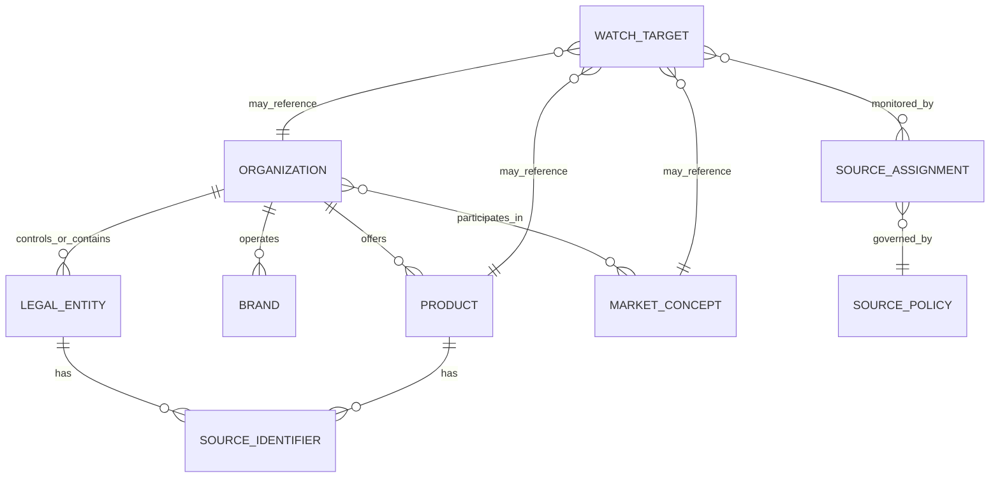
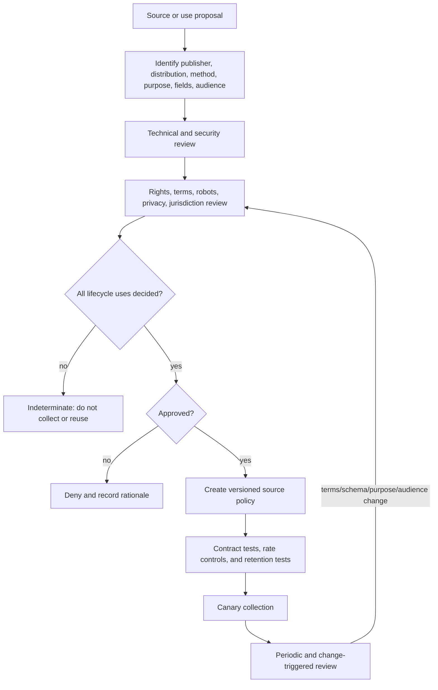

# Entities, Watchlists, Sources, and Rights

## Why identity and permission precede intelligence

A monitoring system can be factually accurate and still be operationally wrong because it attached a filing to the wrong subsidiary, compared unlike market definitions, retained content beyond permission, or redistributed a source that was only licensed for internal viewing. Entity identity and source-use policy therefore enter before retrieval and remain attached through analysis, evaluation, publication, and deletion.

Two principles govern this guide:

1. **Technical access is not an allowed-use decision.** Public visibility, an API response, a permissive robots record, or the absence of authentication does not by itself resolve contract, database, copyright, privacy, confidentiality, or jurisdictional obligations.
2. **A name is not an entity key.** Names, domains, brands, issuers, legal entities, products, and markets change at different times and must be modeled separately.

The system implements policy supplied by accountable owners. It does not provide legal advice or autonomously interpret disputed law.

## Entity model

Use a canonical entity graph with source-specific identifiers and valid time:



### Required identity fields

```yaml
entity:
  entity_id: ent-org-01K4...
  entity_type: organization
  canonical_name: Example Group
  status: active
  valid_from: "2024-01-01"
  valid_to: null
  parent_relationships:
    - parent_entity_id: ent-org-parent
      relationship: majority_controlled_by
      valid_from: "2025-05-14"
      valid_to: null
      evidence_ids: [ev-881]
  identifiers:
    - scheme: LEI
      value: 549300EXAMPLE000000
      issuer: GLEIF
      valid_from: "2024-01-01"
      status: verified
    - scheme: SEC_CIK
      value: "0000123456"
      issuer: SEC
      status: verified
  aliases:
    - value: Example Holdings plc
      kind: former_legal_name
      valid_to: "2025-05-13"
    - value: example.com
      kind: domain
      valid_from: "2020-02-01"
  jurisdiction: GB
  resolution_state: reviewed
  registry_version: er-2026-08-30-05
```

Registry identifiers improve precision but do not collapse the graph. A Legal Entity Identifier identifies a legal entity, not every brand, product, domain, or commercial group. A securities issuer identifier may represent one filing entity. Provider fuzzy-name search generates candidates; it is not a merge decision.

### Resolution outcomes

Every resolution returns one of four states:

| State | Meaning | Downstream behavior |
|---|---|---|
| `exact` | A verified identifier or deterministic mapping resolves the record. | Continue with mapping version and evidence. |
| `probable` | One candidate exceeds a calibrated threshold but lacks sufficient identity evidence. | Permit low-risk triage; material claims wait for review. |
| `ambiguous` | Multiple plausible candidates remain. | Preserve the set; do not aggregate or brief as a single entity. |
| `unresolved` | No suitable candidate exists. | Quarantine or create a reviewed entity proposal. |

Store features and candidate scores so the resolver can be evaluated. Do not expose an unexplained “confidence 0.92.” Useful features include exact registry IDs, domain control, jurisdiction, address, parent, valid time, source-assigned IDs, and name similarity. Calibration must be measured by source and entity type.

## Watchlist contract

A watchlist is a versioned business instruction, not a bag of search terms:

```yaml
watch_target:
  target_id: wt-product-133
  watchlist_version: wl-2026-08-31-04
  target_type: product
  entity_id: ent-product-133
  purpose: competitor_product_change
  owner_group: product-intelligence
  markets: [market-enterprise-search]
  geographies: [US, GB, DE]
  topics:
    include: [availability, packaging, pricing_model, integrations, security_claims]
    exclude: [job_candidates, employee_personal_life]
  source_assignments:
    - source_id: src-official-product-page
      cadence: PT6H
      required_for_brief: true
    - source_id: src-regulatory-filings
      cadence: PT1H
      required_for_brief: false
  materiality_profile_id: mp-enterprise-product-v2
  active_from: "2026-07-01T00:00:00Z"
  active_to: null
  approved_by: approval-241
```

### Watchlist change controls

- Adding an ordinary organization/product within an already approved purpose and source class can be a bounded reversible change after owner approval.
- Adding a named person, new jurisdiction, new source class, personal-data fields, broader crawling pattern, or external audience requires privacy/source governance review.
- Removing a target stops future collection and initiates the configured retention/deletion workflow; it does not silently erase audit records that must lawfully remain.
- Entity merges and splits are versioned and replayable. Historical runs keep the registry snapshot they used.
- The model may propose candidates based on evidence but never activates them.

## Source registry

Model policy at the distribution or endpoint level, not merely by publisher. A dataset's landing page, bulk file, API, third-party mirror, and individual embedded works can have different rights and freshness.

```yaml
source_policy:
  source_policy_id: sp-sec-submissions-v5
  source_id: src-sec-submissions
  publisher: U.S. Securities and Exchange Commission
  distribution:
    kind: official_api
    locator_template: "https://data.sec.gov/submissions/CIK{cik}.json"
  approved_purposes: [competitor_filing_monitoring]
  allowed_methods: [GET, conditional_get]
  credentials_ref: null
  access_controls:
    robots_policy: not_applicable_to_api
    authentication_bypass: prohibited
    captcha_bypass: prohibited
  rate_policy:
    policy_version: sec-fair-access-checked-2026-08-31
    configured_limit: "operator-defined below current provider maximum"
    retry_after_required: true
    declared_user_agent_ref: secret/sec-contact-header
  rights:
    status: approved
    license_uri: null
    terms_uri: "https://www.sec.gov/about/webmaster-frequently-asked-questions"
    allowed_transformations: [extract, normalize, compare, summarize]
    quotation: minimal_with_locator
    redistribution: internal_brief_only
    attribution: required
    evaluation_reuse: approved_for_internal_fixtures
  privacy:
    personal_data_expected: possible
    collection_minimization_profile: sec-business-relevance-v2
  retention:
    raw_representation: P2Y
    derived_evidence: P5Y
    policy_basis_ref: retention-decision-33
  jurisdiction_notes: [US]
  policy_owner: data-governance
  reviewed_at: "2026-08-31T00:00:00Z"
  next_review_at: "2026-11-30T00:00:00Z"
  kill_switch: source/sec-submissions
```

Provider limits and terms change. Store the checked date and policy version, configure a safer operational rate, honor server signals, and revalidate instead of embedding a limit forever in code.

### Lifecycle rights matrix

An approval must answer each phase independently:

| Phase | Questions |
|---|---|
| Discover | May the system index the locator or subscribe to the feed? May discovery results be stored? |
| Retrieve | Is automated access allowed by method, identity, rate, purpose, and jurisdiction? |
| Retain | May raw content, screenshots, fields, hashes, and personal data be stored, and for how long? |
| Transform | May content be parsed, embedded, translated, summarized, compared, or used to derive metrics? |
| Analyze | Is this intelligence purpose compatible with the approval and privacy basis? |
| Quote | How much may be reproduced, and what attribution or notice is required? |
| Distribute | Which internal/external audiences and channels are allowed? Do database or third-party rights apply? |
| Evaluate | May examples or snapshots be retained in model/evaluation datasets, and can a provider receive them? |
| Delete/revoke | What happens to raw content, derivatives, caches, indexes, briefs, and audit records when policy changes? |

Use deny-by-default when any required phase is `denied`, `expired`, or `indeterminate`. Quarantine existing evidence from new uses until resolved. Never ask the model to infer permission from page prose.

## Source hierarchy and adapter strategy

Prefer the most structured, authoritative, permitted representation that meets the purpose:

1. official bulk data or versioned API;
2. official filing/registry endpoint;
3. official feed or push subscription plus reconciliation;
4. official publisher page with stable semantic regions;
5. licensed aggregator with clear lineage and redistribution terms;
6. secondary reporting used as a lead and explicitly labeled;
7. search results used for discovery, never as final evidence without the underlying source.

Authority depends on the claim. A regulator is authoritative for its filing record, not necessarily for a company's current product packaging. A company page is primary evidence of what it publicly claims, not independent proof that the claim is true. Market statistics are meaningful only with their series definition, geography, units, vintage, and revision policy.

### Official-source examples and operational lessons

| Source | Useful properties | Design lesson |
|---|---|---|
| [SEC EDGAR APIs](https://www.sec.gov/search-filings/edgar-application-programming-interfaces) | Official submissions and XBRL company facts are available as JSON without per-user API keys. | Keep filing accession, CIK, form, fact taxonomy/unit/period, and source update time; follow current fair-access guidance. |
| [Companies House API](https://developer.company-information.service.gov.uk/get-started) | Public UK company data through authenticated API access. | Public data can still require credentials and enforced rate policy; `429` is backpressure, not a cue to rotate identities. |
| [GLEIF API](https://www.gleif.org/en/lei-data/gleif-api) and [Golden Copy files](https://www.gleif.org/en/lei-data/gleif-golden-copy/download-the-golden-copy) | Legal entity, relationship, fuzzy search, Golden Copy, and delta distributions. | Use the LEI as one identifier and retain Golden Copy/delta version; fuzzy results require resolution. |
| [ESMA ESEF](https://www.esma.europa.eu/issuer-disclosure/electronic-reporting) | Structured annual financial reports with an evolving taxonomy. | Pin taxonomy and filing package versions; do not assume a current taxonomy parses history identically. |
| [Eurostat web services](https://ec.europa.eu/eurostat/data/web-services) | Structured public statistics with documented update behavior. | Its services expose latest datasets and state that past versions are not available there; capture permitted vintages when revision history matters. |
| [Atom](https://www.rfc-editor.org/rfc/rfc4287.html) and [WebSub](https://www.w3.org/TR/websub/) | Stable feed identifiers and a push subscription protocol. | `updated` is publisher-significant, not a guarantee every material change is signaled; push deliveries still need deduplication and reconciliation. |

These are patterns, not a universal approved-source list. Each deployment performs its own source assessment.

For current examples spanning search, news, web capture, company/regulatory/financial/patent/social/market data and internal enterprise surfaces, plus a typed adapter-qualification contract, see [Provider Qualification and Worked Intelligence Lifecycle](10-provider-qualification-and-worked-intelligence-lifecycle.md).

## HTTP and snapshot behavior

Use HTTP validators when available:

- store `ETag`, `Last-Modified`, cache metadata, request time, response time, final locator, and status;
- send `If-None-Match` or `If-Modified-Since` on later collections;
- treat `304 Not Modified` as a transport result for that representation, not proof that every underlying business fact is unchanged;
- do not assume `Last-Modified` is the business effective date;
- account for content negotiation: media type, language, encoding, region, authentication state, and query parameters belong to representation identity;
- hash a canonical representation only after recording the original bytes and transformation version when retention is allowed.

[RFC 9110](https://www.rfc-editor.org/rfc/rfc9110.html) defines conditional request semantics. Hashing makes equality/difference repeatable; it does not establish materiality, authenticity, permission, or semantic equivalence.

## Robots, terms, and access controls

[RFC 9309](https://www.rfc-editor.org/rfc/rfc9309.html) standardizes the Robots Exclusion Protocol and explicitly does not make it an access-authorization mechanism. Operational policy should nevertheless honor the organization's approved robots interpretation and source terms. A permissive robots record is not a license. A restrictive record is not an invitation to find another host. Security controls, contract, privacy, copyright, database rights, and local law remain separate assessments.

Hard prohibitions for this blueprint:

- no circumventing login, paywall, CAPTCHA, IP restriction, rate limit, robots policy, or technical protection;
- no false identity, pretexting, covert contact, or misrepresentation;
- no use of compromised, leaked, confidential, or apparently misdirected information;
- no personal surveillance, private-life inference, protected-trait inference, or targeting of non-public individuals;
- no automated acceptance of new terms or expansion of purpose;
- no use of a consumer session or employee credentials outside their documented authorization.

These prohibitions are engineering controls, not a claim about a jurisdiction's legal outcome. For example, U.S. [17 U.S.C. § 1201](https://uscode.house.gov/view.xhtml?req=granuleid:USC-prelim-title17-section1201&num=0&edition=prelim) contains anti-circumvention rules and exceptions whose application is fact-specific. The system does not decide an exception applies; it routes the proposed method/use to accountable review and exposes no bypass capability.

Competitive-intelligence professional ethics reinforce lawful collection and truthful identity. They are useful operational norms, not substitutes for applicable law or counsel.

## Privacy and personal data

Public availability does not remove privacy obligations. For organization-centered intelligence:

- collect named-person facts only when necessary to the approved business question, such as an official role change;
- prefer role and organization identifiers over persistent personal profiles;
- exclude contact enrichment, private social activity, family details, sensitive traits, inferred health/politics/religion, and individual behavioral surveillance;
- record purpose, source, legal/policy basis, notice or exception handling where applicable, access, retention, correction, and deletion behavior;
- support jurisdiction-aware policy because commencement dates, exemptions, and data-subject duties change.

The EU GDPR's [Article 5 principles](https://eur-lex.europa.eu/eli/reg/2016/679/oj) include lawfulness, purpose limitation, minimization, accuracy, storage limitation, integrity, and accountability. India's [Digital Personal Data Protection Rules, 2025](https://www.meity.gov.in/documents/act-and-policies/digital-personal-data-protection-rules-2025-gDOxUjMtQWa) illustrate another operational challenge: provisions commence in phases. The deployment must verify which obligations are effective for its date and facts rather than copying a static checklist.

## License and database-rights details

Open-data branding can hide distribution-specific conditions or embedded third-party material. [DCAT 3](https://www.w3.org/TR/vocab-dcat-3/) usefully distinguishes a dataset from its distributions and represents license, rights, and access rights at appropriate levels. Eurostat's [copyright and reuse notice](https://ec.europa.eu/eurostat/help/copyright-notice), for example, includes attribution and exceptions for identified third-party works and specific datasets. ESMA publishes taxonomy packages with their own notices. GLEIF states that its own open data is available under [CC0](https://www.gleif.org/en/about/open-data/), but that does not grant rights to unrelated content linked from an entity record.

In the EU, the [Database Directive](https://eur-lex.europa.eu/eli/dir/1996/9/2019-06-06/eng/) is another reason not to equate public access with unrestricted extraction or redistribution. Legal outcomes are jurisdiction- and fact-specific. The system's response is conservative policy enforcement and traceability, not autonomous legal conclusion.

## Policy decision workflow



Change triggers include a redirect to a new publisher, authentication change, API version deprecation, terms/license update, new personal-data fields, new geography, new downstream audience, new model provider, or use in evaluation/training.

## Quality and review checklist

- [ ] Target identity is canonical, time-bounded, and distinct from aliases, products, and parents.
- [ ] Ambiguous entity records cannot produce material claims without review.
- [ ] Watchlist purpose, topics, geography, owner, source assignments, and materiality are versioned.
- [ ] Source policy is recorded at the actual distribution/endpoint used.
- [ ] Collection, retention, transformation, quotation, distribution, evaluation, and deletion are each decided.
- [ ] Provider rate, authentication, schema, license, and terms were checked on a recorded date.
- [ ] Connector cannot discover arbitrary new hosts or bypass restrictions.
- [ ] Personal-data collection is minimized and jurisdiction-aware.
- [ ] Source-policy revocation reaches snapshots, indexes, briefs, caches, and evaluation fixtures.
- [ ] A human owns unresolved rights and identity decisions.

## Related guides

- [Mission and requirements](01-mission-boundary-and-requirements.md)
- [Change detection, evidence, and provenance](04-change-detection-evidence-and-provenance.md)
- [Security, privacy, and governance](07-security-privacy-and-governance.md)
- [Evidence packet](../../research/packets/competitive-market-intelligence-agent-blueprint.md)
