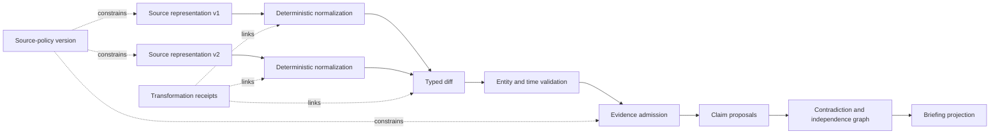

# Change Detection, Evidence, and Provenance

## The evidence pipeline

The core production artifact is not prose. It is a versioned evidence graph that explains what representation was collected, how it changed, which entity and time it concerns, what transformations occurred, which claims depend on it, and which uses remain allowed.



## Six distinct record types

| Record | Represents | Example | Authority |
|---|---|---|---|
| Representation | What an approved endpoint returned under a specific request context. | A filing JSON object, feed entry, page region, or statistics response. | Source plus retrieval receipt; may be untrusted or wrong. |
| Observation | A source-bound statement extracted from a representation. | “The product page displayed plan X at retrieval time.” | Evidence of what the source represented, not necessarily real-world truth. |
| Change | A versioned comparison between compatible observations/representations. | Price field changed from 10 USD/month to 12 USD/month. | Detector output with version and warnings. |
| Evidence | An admitted observation/change with provenance, identity, time, rights, and quality state. | Primary-source change with exact span and unambiguous product. | Evidence policy and reviewer disposition. |
| Claim/analysis | A factual assertion, calculation, or inference supported by evidence. | “Published list price increased 20%.” | Typed claim and support validation; material claims may require human approval. |
| Decision/effect | A human decision or an external/internal state change. | Adopt a response, publish revision 4, revoke revision 3. | Human/policy authority plus an effect receipt. |

Do not collapse these into “memory.” A representation can be retained while its earlier claim is superseded. An observation can faithfully describe a source that later issues a correction. A delivery trace can show a network call while the publication effect remains ambiguous.

## Representation and retrieval receipt

```json
{
  "representation_id": "rep-01K4...",
  "tenant_id": "tenant-42",
  "source_id": "src-official-product-page",
  "source_policy_version": "sp-product-site-v8",
  "request_identity": {
    "method": "GET",
    "canonical_locator": "https://vendor.example/products/x",
    "media_type": "text/html",
    "language": "en",
    "region": "US",
    "auth_scope": "public"
  },
  "retrieval": {
    "requested_at": "2026-08-30T12:00:00Z",
    "received_at": "2026-08-30T12:00:01Z",
    "status": 200,
    "etag": "W/\"a81...\"",
    "last_modified": "2026-08-30T10:00:00Z",
    "provider_cursor": null,
    "receipt_id": "retrieval-981"
  },
  "integrity": {
    "algorithm": "approved-sha-2-profile",
    "raw_digest": "...",
    "canonical_digest": "...",
    "canonicalizer_version": "html-region-v4"
  },
  "storage": {
    "raw_object_ref": "tenant-42/source-snapshots/rep-01K4...",
    "retention_until": "2028-08-30T00:00:00Z",
    "redistribution": "internal-derived-only"
  },
  "content_security": {
    "trust": "untrusted_source_content",
    "active_content_removed": true,
    "parser_sandbox_receipt": "sandbox-44"
  }
}
```

The digest profile should use a currently approved hash and a documented canonicalization. [RFC 8785](https://www.rfc-editor.org/rfc/rfc8785.html) is a useful canonical JSON reference when its data-model constraints fit; it is not a universal canonicalizer. [FIPS 180-4](https://csrc.nist.gov/pubs/fips/180-4/upd1/final) documents Secure Hash Standard algorithms, but the deployment must follow current organizational cryptographic policy because standards evolve.

## Layered change detection

No single detector is adequate. Route each source through the cheapest reliable layers:

| Layer | Technique | Good at | Common false result |
|---|---|---|---|
| Transport | ETag, `Last-Modified`, cursor, accession, provider revision | Avoiding redundant retrieval and identifying provider versions | Validator changes without business change; underlying change without a useful validator |
| Bytes | Raw digest | Exact representation equality | Ads, timestamps, tracking tokens, or serialization order create noise |
| Canonical structure | DOM regions, JSON canonicalization, table/XBRL cells | Stable field-level comparison | Parser/layout drift looks like deletion or movement |
| Typed data | Schema-aware field diff with unit/period/definition | Numerical and categorical changes | Comparing incompatible definitions or fiscal periods |
| Semantic | Bounded model/rule classifier over the diff and local context | Rewording, new claims, implication, materiality | Hallucinated change, missed negation, persuasive interpretation |
| Cross-source | Claim/entity/time graph comparison | Confirmation, contradiction, restatement, source dependence | Syndicated copies counted as independent |

The semantic step receives the before/after regions, typed diff, entity snapshot, source metadata, and explicit question. It does not receive an open browser or unrelated corpus. Its result is a proposal with evidence spans, not a rewritten snapshot.

## Change event schema

```json
{
  "change_id": "chg-01K4...",
  "target_id": "wt-product-133",
  "entity_id": "ent-product-133",
  "before_representation_id": "rep-before",
  "after_representation_id": "rep-after",
  "detector": {
    "name": "product-offer-detector",
    "version": "6.0.0"
  },
  "change_type": "field_value_changed",
  "path": "offers.enterprise.list_price",
  "before": {"value": "10.00", "currency": "USD", "period": "month"},
  "after": {"value": "12.00", "currency": "USD", "period": "month"},
  "time": {
    "source_published_at": null,
    "effective_at": null,
    "first_observed_at": "2026-08-30T12:00:01Z",
    "last_known_unchanged_at": "2026-08-30T06:00:01Z"
  },
  "compatibility": {
    "same_definition": true,
    "same_unit": true,
    "same_geography": true,
    "same_entity": true
  },
  "materiality_proposal": {
    "level": "medium",
    "dimensions": ["customer_impact", "strategic_relevance"],
    "model_calibration_profile": "mat-product-v3"
  },
  "deduplication_key": "target:before:after:detector-v6",
  "warnings": ["effective_date_not_published"],
  "status": "candidate"
}
```

Time ranges are honest here: the change occurred after the last known unchanged observation and no later than the first changed observation. The source's HTTP timestamp must not be substituted for an unknown business effective time.

Keep organization, product, market, watch, source, representation, change event, claim, scenario, briefing, release and effect identities distinct. [Provider Qualification and Worked Intelligence Lifecycle](10-provider-qualification-and-worked-intelligence-lifecycle.md#canonical-identities-and-time-semantics) provides the full identity chain, bitemporal rules and freshness states.

## Time, revisions, and vintages

Track these timestamps independently:

| Field | Meaning |
|---|---|
| `published_at` | When the publisher says this item or revision was published. |
| `effective_at` | When the represented business change takes effect, if explicitly known. |
| `valid_from` / `valid_to` | Domain valid time for an entity relationship, offer, or statistic. |
| `retrieved_at` | When the collector received the representation. |
| `observed_at` | When the system first/last established the observation. |
| `recorded_at` | When an internal record entered authoritative storage. |
| `superseded_at` | When a later internal record superseded it; not necessarily when reality changed. |

Statistics and filings can be revised. Preserve vintage or accession identifiers and the previous value when policy allows. If an API exposes only the latest version—as [Eurostat documents for its web services](https://ec.europa.eu/eurostat/data/web-services)—a permitted internal snapshot may be necessary to prove revision history. If retention is not allowed, report that historical comparison cannot be reproduced rather than inventing a vintage.

## Evidence admission

Before an observation can support a material claim, validate:

1. **Source policy:** collection, retention, transformation, quotation, audience, and evaluation use are allowed.
2. **Integrity:** representation and transformations have verifiable receipts.
3. **Identity:** entity resolution is exact or has the required review.
4. **Temporal fit:** the source and business times match the claim window.
5. **Definition fit:** units, period, geography, population, taxonomy, and calculation are compatible.
6. **Support:** the cited span entails the proposed factual language and includes material qualifiers.
7. **Freshness:** the source is within the configured freshness envelope, or the exception is visible.
8. **Independence:** likely syndication or shared origin is represented.
9. **Contradictions:** relevant counterevidence has been searched within the bounded evidence graph.
10. **Sensitivity:** secrets, personal data, prompt injection, active content, and audience limits have been handled.

An evidence validator returns `admitted`, `admitted_with_qualifier`, `requires_review`, or `quarantined`. It does not return a vague scalar quality score.

## Claim schema and support

```yaml
claim:
  claim_id: claim-184
  claim_type: derived_fact
  subject_entity_id: ent-product-133
  text: "The published US monthly list price increased by 20%."
  qualifiers:
    geography: US
    currency: USD
    price_kind: published_list_price
    effective_date: unknown
  evidence_ids: [ev-before-price, ev-after-price]
  calculation:
    expression: "(12.00 - 10.00) / 10.00"
    result: "0.20"
    implementation_version: decimal-relative-change-v2
  support_state: supported
  freshness_state: current
  contradiction_set_id: conflict-price-133
  materiality: medium
  required_review: analyst
  reviewer_disposition: pending
```

Claim types should include at least:

- `source_observation`: exactly what a source states/displays;
- `derived_fact`: deterministic calculation from admitted evidence;
- `analytical_inference`: contestable explanation or implication;
- `hypothesis`: plausible explanation needing further evidence;
- `scenario_condition`: conditional assumption, not a prediction;
- `forecast`: named probability for a resolvable event;
- `human_recommendation` and `human_decision`: supplied and signed by an accountable person, not generated as agent authority.

The renderer must visibly distinguish these types.

## Citation integrity

A useful citation carries:

- publisher, title/object identifier, stable locator, distribution and version;
- exact span, field path, table cell, XBRL concept/context/unit, or byte/region locator;
- source published/effective/retrieved times;
- entity mapping and source-policy version;
- transformation chain and digest;
- access date and audience/quotation constraint;
- support verdict and reviewer state.

Links alone are insufficient because pages change, locators break, and a source can be relevant without entailing the sentence. When retaining the source content is prohibited, record the permitted locator and minimum integrity/field metadata, disclose that reproducibility is limited, and avoid overstating support.

## Contradictions and supersession

First classify the relationship:

| Relationship | Meaning | Treatment |
|---|---|---|
| Direct contradiction | Claims about the same entity, definition, and valid time cannot both be true. | Preserve both, show source authority and review; do not auto-pick newest. |
| Temporal supersession | Both may be true at different valid times. | Build a timeline; do not label as conflict. |
| Correction/restatement | Publisher explicitly replaces an earlier representation. | Link replacement, keep revision history, assess already-published briefs. |
| Definition drift | Term, unit, geography, population, or taxonomy changed. | Block direct comparison until normalized or qualified. |
| Entity mismatch | Similar name or parent/product confusion. | Return to entity resolution and invalidate affected claims. |
| Source dependence | Multiple reports derive from one underlying announcement or dataset. | Cluster as one origin for confirmation counts. |
| Unresolved ambiguity | Missing information prevents classification. | Preserve uncertainty and request review or new evidence. |

```yaml
contradiction_set:
  contradiction_set_id: conflict-12
  subject: ent-product-133
  predicate: availability_in_DE
  valid_time: "2026-08-30"
  members:
    - claim_id: claim-official-page
      source_origin_cluster: vendor-owned
      stance: available
    - claim_id: claim-registry
      source_origin_cluster: regulator
      stance: not_registered
  classification: unresolved_definition_or_timing
  missing_evidence:
    - "Does registration precede commercial availability?"
    - "What is the product's effective launch date?"
  prohibited_resolution: last_write_wins
  reviewer_state: pending
```

## Source independence graph

Track origin rather than counting URLs. A press release copied by a wire service, news sites, and a vendor blog may form one origin cluster. Independence features include identical uncommon phrasing, identical mistakes, timestamps, explicit citations, canonical links, ownership, and shared data vintages. Model classification may propose dependence; deterministic exact/near-duplicate features and analyst review support high-impact decisions.

Report both `source_count` and `independent_origin_count` in material claim review.

## Prompt-injection-resistant parsing

Source text is data. The parser and context compiler:

- strip scripts, active content, hidden elements, and unsupported attachments in an isolated boundary;
- extract allowlisted regions/fields where possible;
- mark every fragment with source, trust, rights, and locator metadata;
- never concatenate source instructions into system or tool-authority messages;
- block discovered URLs, credentials, commands, and tool arguments from becoming executable without separate deterministic validation;
- detect instruction-like content for quarantine/telemetry, but do not rely on detection as the primary boundary;
- allow only typed observation/proposal tools during analysis.

The safest prompt is still insufficient if a model can call a generic browser, write arbitrary memory, or publish directly.

## Quality metrics

Measure by source class and materiality slice:

- snapshot completeness and integrity receipt coverage;
- parser field precision/recall and layout/schema-drift detection;
- entity exact/probable/ambiguous rates and calibrated match error;
- change-event precision, recall, and detection lag;
- duplicate-alert and source-dependence clustering error;
- numerical/unit/definition compatibility accuracy;
- citation locator validity and claim-entailment accuracy;
- contradiction recall and false contradiction rate;
- freshness and rights-valid evidence coverage;
- material claim abstention, reviewer acceptance, and correction rate.

Aggregate scores can hide a catastrophic entity or unit error. Release gates must inspect high-materiality slices separately.

## Failure recovery

| Failure | Safe behavior | Recovery |
|---|---|---|
| Provider quota/timeout | Mark source window delayed; do not infer no change. | Honor provider backoff, retry within deadline, reconcile later. |
| Parser/schema drift | Quarantine the new representation; preserve old/current state. | Update adapter, replay frozen before/after fixtures, canary. |
| Content disappears | Record deletion/absence separately from business withdrawal. | Confirm with other official representations and next scheduled observation. |
| Entity ambiguity | Block aggregation and material claim. | Analyst resolves or preserves multiple candidates. |
| Rights expire | Stop new retrieval and downstream reuse governed by the revoked policy. | Apply retention/deletion/brief revocation plan after accountable review. |
| Contradictory primary sources | Preserve both and downgrade/qualify analysis. | Seek definition/time clarification or reviewer disposition. |
| Hash mismatch/corruption | Quarantine object and derived evidence. | Recover from immutable replica if permitted; replay transformations. |
| Previously published claim corrected | Open impact incident and link affected briefs. | Correct/revoke revisions, notify approved audience, promote case into evals. |

## Sources and further reading

The evidence graph is influenced by the [W3C PROV overview](https://www.w3.org/TR/prov-overview/) and [PROV-O](https://www.w3.org/TR/prov-o/), while keeping application-specific support and rights semantics explicit. [W3C Data Quality Vocabulary](https://www.w3.org/TR/vocab-dqv/) is a non-normative vocabulary whose own guidance recognizes that quality is context-dependent; it can aid metadata interoperability but must not replace local admission rules. See the [evidence packet](../../research/packets/competitive-market-intelligence-agent-blueprint.md) for source-level caveats.

## Related guides

- [Entities, watchlists, sources, and rights](03-entities-watchlists-sources-and-rights.md)
- [Analysis, scenarios, and briefings](05-analysis-scenarios-and-briefings.md)
- [Reliability, observability, evaluation, and incidents](08-reliability-observability-evaluation-and-incidents.md)
- [Canonical state and event contracts](../../runtime/agent-state-and-event-contracts.md)
