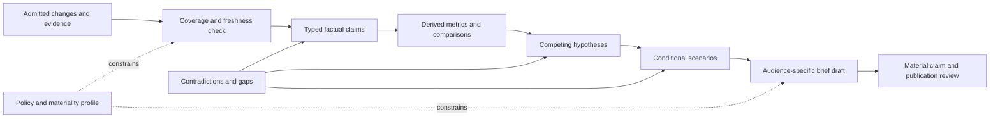
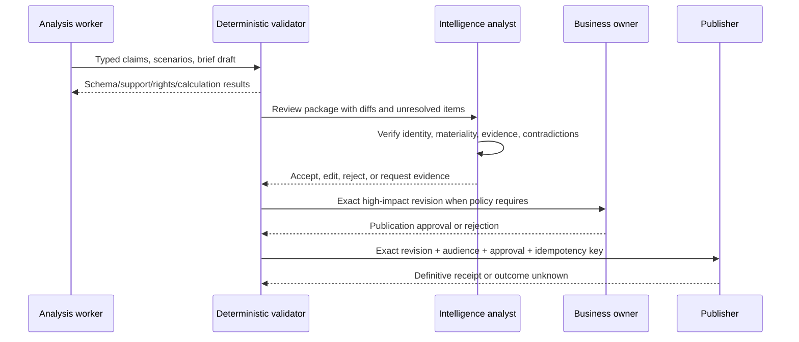

# Analysis, Scenarios, and Briefings

## Analysis is a typed transformation, not “insight generation”

The analytical step converts an admitted evidence graph into explicit claims, comparisons, hypotheses, conditional scenarios, and unanswered questions. It is bounded by the brief contract and cannot repair missing evidence through plausible prose.

The correct flow is:



At every step, the system can abstain, report partial coverage, or request review.

## Analytical contract

```yaml
analysis_request:
  analysis_id: analysis-2026w35-04
  brief_contract_id: ci-weekly-product-market-v3
  evidence_graph_version: eg-883
  evidence_cutoff: "2026-08-31T00:30:00Z"
  questions:
    - "Which approved product changes are material to enterprise buyers?"
    - "Which market assumptions should be re-examined?"
  comparison_baselines:
    - previous_brief_revision: brief-2026w34-rev3
    - market_series_vintages: [series-a@2026-08-30]
  required_outputs:
    - claims
    - rejected_hypotheses
    - contradictions
    - scenarios
    - monitoring_triggers
    - coverage_statement
  forbidden_outputs:
    - autonomous_strategy_decision
    - securities_recommendation
    - individual_profile
  model_tools: [get_evidence_bundle, get_contradiction_set, propose_claim, propose_scenario]
  budgets:
    evidence_items: 250
    context_tokens: 180000
    analysis_iterations: 8
```

The context compiler satisfies the contract with the smallest sufficient evidence set. If the available graph cannot answer a required question, the correct output is a gap, not a broader unapproved search.

## Epistemic labels

Every substantive statement has one label:

| Label | Test | Example rendering |
|---|---|---|
| Observation | Does it say what a named source represented at a named time? | **Observed:** The official US page displayed a monthly list price of USD 12 on 30 August. |
| Derived fact | Is it deterministically calculable from admitted evidence? | **Calculated:** This is 20% above the prior captured USD 10 list price. |
| Inference | Is it a contestable interpretation of evidence? | **Inference:** The change may indicate repositioning toward higher-value accounts. |
| Hypothesis | Is it one plausible explanation needing discriminating evidence? | **Hypothesis:** The change may reflect packaging rather than a broad price increase. |
| Scenario | Is it a conditional path under explicit assumptions? | **Scenario:** If the price persists across regions and current features remain bundled, buyer comparison may shift toward total-cost scrutiny. |
| Forecast | Is it a named probability for an operationally resolvable event? | **Forecast (analyst-owned):** 60% that the DE page shows the new price by 30 September. |
| Human recommendation | Did an accountable person add a proposed action? | **Recommendation — Strategy Lead:** Commission a packaging study. |
| Human decision | Is there a signed choice or commitment? | **Decision — Product Council:** Begin the approved study. |

The agent can draft observations through scenarios. It cannot present generated text as a human recommendation or decision. Forecasts are disabled unless the organization has defined resolvable events, named owners, outcome collection, and scoring.

## Evidence-to-claim gates

Material factual claims pass these gates before entering a brief:

1. the claim's subject, predicate, qualifiers, and valid time are structured;
2. evidence spans support the entire sentence, including numerical values and negation;
3. units, definitions, geography, and period are compatible;
4. entity identity is exact or reviewed;
5. freshness and required-source coverage meet the profile;
6. source independence and contradiction state are visible;
7. source policy permits the audience, quotation, and transformation;
8. deterministic calculations reproduce exactly;
9. high-materiality claims have the configured reviewer disposition;
10. the renderer has not changed the factual semantics.

“Cited” does not mean “supported.” A citation can be real but irrelevant, stale, too broad, or missing a qualifier. Evaluate entailment and locator integrity separately.

## Market comparison

Market metrics require a definition sheet:

```yaml
metric_definition:
  metric_id: market-enterprise-search-revenue
  label: Enterprise search software revenue
  definition_version: 4
  inclusion: [licensed_software, hosted_subscription]
  exclusion: [implementation_services, consumer_search_advertising]
  geography: EU27
  currency: EUR
  currency_basis: nominal
  time_basis: calendar_year
  source_series:
    - source_id: licensed-market-dataset
      series_id: EMS-REV-EU27
      vintage: "2026-08-28"
  transformations:
    - name: sum_components
      version: decimal-sum-v1
  limitations:
    - "Vendor category definitions are not directly comparable."
    - "The latest annual period is preliminary."
```

Never compare two values solely because their labels are similar. Require compatibility across population, inclusion/exclusion, geography, nominal/real currency, exchange rate, period/fiscal calendar, unit, seasonal adjustment, taxonomy, and vintage. When normalization is defensible, preserve the original values and transformation receipt. When it is not, present parallel measures.

## Hypothesis discipline

For a material change, generate a small set of competing explanations, not one narrative:

| Field | Purpose |
|---|---|
| Hypothesis | A falsifiable explanation of the observed change. |
| Supporting evidence | Admitted evidence that is more likely if the hypothesis is true. |
| Counterevidence | Evidence that weakens it. |
| Alternative explanation | A plausible competing account. |
| Discriminating signal | An observable future item that separates alternatives. |
| Missing source | The approved source or review needed to test it. |
| Disposition | Active, weakened, rejected, or unresolved—with actor and time. |

Do not instruct the model to “find the most likely explanation” unless the evidence and calibration justify probabilities. A useful analyst often preserves ambiguity longer than a language model prefers.

## Scenario design

Scenarios make conditional reasoning explicit. They are not literary predictions and are not automatically ordered by likelihood.

```yaml
scenario:
  scenario_id: scenario-packaging-expansion
  title: Packaging change expands beyond the initial region
  horizon: "through 2026-12-31"
  status: conditional_not_forecast
  assumptions:
    - id: a1
      statement: "The US page change reflects a durable packaging policy."
      support: [claim-184]
      uncertainty: high
    - id: a2
      statement: "Feature composition remains materially unchanged."
      support: [claim-201]
      uncertainty: medium
  causal_path:
    - "Durable US change"
    - "Parallel regional page changes"
    - "Buyer comparisons emphasize price and bundle composition"
  implications:
    - statement: "Existing win/loss assumptions may need revalidation."
      type: analytical_inference
      owner_for_decision: product-strategy
  confirming_triggers:
    - "Official DE or GB page shows the same packaging structure"
    - "Contract documentation reflects the new structure"
  invalidating_triggers:
    - "US page reverts and publisher identifies a display error"
  blind_spots:
    - "Negotiated prices are not observed"
  probability: null
```

### Scenario rules

- State the horizon and scope.
- Name assumptions and attach evidence or label them unsupported.
- Include at least one plausible alternative for high-impact issues.
- Identify confirming and invalidating observations.
- Keep implications separate from actions.
- Avoid labels such as “base case” if readers will interpret them as probability; use neutral names or supply an accountable, scored probability.
- Do not use precise numeric ranges when input uncertainty cannot support them.
- Preserve dependencies so one source assumption is not counted multiple times.

### When probability is appropriate

Use a probabilistic forecast only if:

- the event statement has a clear close time and resolution rule;
- outcomes will be captured without hindsight rewriting;
- the forecaster identity and information cutoff are stored;
- probability updates retain history and rationale;
- a proper score such as the Brier score is applied to compatible outcomes;
- calibration is reviewed across enough forecasts and relevant slices.

The original [Brier score paper](https://journals.ametsoc.org/doi/10.1175/1520-0493%281950%29078%3C0001%3AVOFEIT%3E2.0.CO%3B2) provides a proper score for probability forecasts. Research on geopolitical forecasting found associations between training, collaboration, frequent updating, and accuracy in that setting ([Mellers et al.](https://pubmed.ncbi.nlm.nih.gov/25581088/)). It does not prove that an LLM's uncalibrated market predictions are reliable. Treat transfer as a hypothesis to evaluate.

## Briefing schema

A production brief is a projection of typed records:

```yaml
brief_manifest:
  brief_id: brief-2026w35
  revision: 4
  contract_id: ci-weekly-product-market-v3
  evidence_cutoff: "2026-08-31T00:30:00Z"
  audience: strategy-leadership
  classification: internal-confidential
  coverage:
    targets_expected: 28
    targets_current: 26
    targets_partial: 1
    targets_failed: 1
    required_sources_current: 0.94
  sections:
    - executive_delta
    - material_changes
    - market_indicators
    - contradictions_and_unknowns
    - scenarios_and_triggers
    - coverage_and_methods
  claim_ids: [claim-184, claim-201]
  scenario_ids: [scenario-packaging-expansion]
  unresolved_ids: [conflict-12, gap-44]
  review:
    material_claim_approval: approval-77
    publication_approval: pending
  release_manifest_id: rel-2026-08-30-07
  content_digest: "..."
```

## Recommended briefing structure

### 1. Executive delta

Answer “what is different since the last approved brief?” in a few typed statements. Include only supported material changes and one visible coverage warning. Do not repeat a market overview every cycle.

### 2. Material changes

For each item show:

- entity and change window;
- observation and deterministic difference;
- source and independent-origin count;
- why it crossed the local materiality profile;
- analytical inference, visibly labeled;
- contradictions, stale sources, and missing evidence;
- stable claim/citation IDs.

### 3. Market evidence

Show series definition, vintage, revision, units, period, and transformation. Distinguish the latest release from change in the underlying period. State when no comparable measure exists.

### 4. Scenarios and triggers

Present neutral conditional paths and the observations that would confirm or invalidate them. Human owners can add decisions in a separate signed section.

### 5. Coverage and method

Report watchlist version, evidence cutoff, source freshness, failed/partial sources, materiality profile, detector/model/release versions, and known limitations. This section prevents an apparently comprehensive brief from hiding blind spots.

## Review workflow



Reviews bind the exact content digest, audience, channel, source-policy state, and expiry. A later edit invalidates the publication approval unless policy explicitly defines a safe class of non-semantic changes.

## Rendering controls

- Generate prose from structured claims rather than allowing prose to become the data model.
- Lock cited numbers, units, dates, entity names, and qualifiers to validated fields.
- Validate that every citation marker maps to the same claim and allowed audience after rendering.
- Prevent the executive summary from strengthening qualified language in detailed sections.
- Make uncertainty readable in text; do not rely only on traffic-light colors.
- Include “not observed” only when coverage is sufficient; otherwise use “not established from current coverage.”
- Mark source self-claims (“the vendor states”) separately from independently established facts.
- State the cutoff prominently so new information cannot be assumed included.

## Human feedback that improves the system

Capture structured dispositions:

| Feedback | Useful fields | Destination |
|---|---|---|
| Entity correction | proposed/correct entity, reason, source | resolver fixture and registry review |
| False/missed change | detector layer, source versions, expected delta | detector test corpus |
| Unsupported claim | claim span, cited evidence, missing qualifier | claim-support grader |
| Materiality edit | original/proposed label, dimension, business rationale | calibrated materiality dataset |
| Contradiction missed | conflicting claim/evidence and relationship type | contradiction suite |
| Scenario criticism | hidden assumption, implausible link, missing trigger | scenario rubric |
| Briefing edit | exact before/after span and reason | renderer/evaluator; not automatic memory |

Reviewer edits are not automatically ground truth. A second review or policy can determine which edits enter the curated evaluation corpus.

## Anti-patterns

- “Summarize everything about competitor X” without a purpose, time window, source policy, or materiality definition.
- Treating company marketing copy as independent verification.
- Combining unrelated measurements into a market-size estimate because they use similar words.
- Asking the model for “confidence” and displaying the number without calibration.
- Reporting a page disappearance as product withdrawal.
- Counting repeated articles as corroboration.
- Omitting stale or failed sources from an otherwise polished brief.
- Using scenario prose as a recommendation or forecast.
- Letting the executive summary introduce stronger claims than the evidence section.
- Sending the draft to a broad distribution list because previous editions were approved.

## Related guides

- [Change detection, evidence, and provenance](04-change-detection-evidence-and-provenance.md)
- [Provider qualification and worked intelligence lifecycle](10-provider-qualification-and-worked-intelligence-lifecycle.md)
- [State, context, memory, and orchestration](06-state-context-memory-and-orchestration.md)
- [Reliability, observability, evaluation, and incidents](08-reliability-observability-evaluation-and-incidents.md)
- [Evidence packet](../../research/packets/competitive-market-intelligence-agent-blueprint.md)
