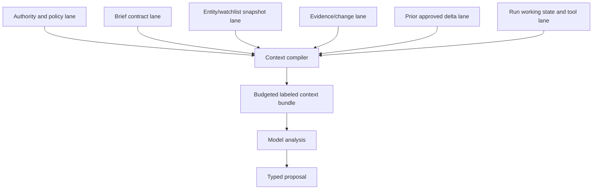

# State, Context, Memory, and Orchestration

## State is not a transcript

A recurring intelligence workload spans schedules, retries, source revisions, approvals, publication, and corrections. A chat transcript cannot represent this safely. Use authoritative typed state, compile minimal model context for each step, and treat free-form memory as optional and untrusted.

Follow the canonical [state and event contract](../../runtime/agent-state-and-event-contracts.md), [context engineering](../../context-memory/README.md), and [durable execution](../../runtime/durable-execution.md). This guide specializes them for watchlists, evidence, scenarios, and briefings.

## State inventory

| State | Examples | Store | Mutation authority |
|---|---|---|---|
| Control | brief contracts, source policies, watchlists, materiality, audience, release manifests | versioned relational/control store | accountable owner through validated effects |
| Run | state, attempt, step, lease fence, deadline, budget, cancellation, pinned versions | authoritative run store | runtime state machine |
| Domain | entity graph, representations, observations, changes, evidence, claims, contradictions, scenarios, brief revisions | relational graph/metadata plus permitted object storage | deterministic services and reviewed proposals |
| Effects | watchlist change, draft save, review request, publication, revocation; intent/receipt/reconciliation | effect ledger | policy executor, not model |
| Delivery projections | inbox entries, analyst queues, portal status, notification views | rebuildable projection store | projection consumer |
| Telemetry | metrics, logs, traces, sampled model/tool details | observability backend | instrumentation; never business authority |
| Evaluation | frozen permitted fixtures, expected labels, graders, run results | isolated eval store | reviewed curation and release pipeline |

Use immutable or append-oriented versions for source representations, evidence relationships, approvals, and published revisions. Correct through new records and explicit supersession rather than editing history invisibly.

## Memory policy

“Memory” often hides several incompatible needs. Decide each explicitly:

| Exact memory lifetime | Use | Reject | Retention, correction and deletion | Poisoning test |
|---|---|---|---|---|
| Turn/scratch memory | Current tool result, local comparison and typed-output repair inside one call | Secrets not needed for reasoning, unrelated sources, raw active content and any authority | Destroy at turn end; only validated typed proposals can leave it | Source instruction asks to change tools, policy, watchlist, memory or audience; no mutation occurs |
| Working/run memory | Open questions, selected evidence IDs, budgets, draft structure, contradictions and unresolved items | Authoritative policy/source truth or uncited free-form facts | Checkpoint typed fields for the run; correct by version, delete/quarantine with the run and source policy | Malicious source summary is replayed; compiler preserves it as untrusted evidence and cannot promote it |
| Session memory | Optional reviewer UI continuity for the same authenticated tenant/session | Cross-run intelligence facts, approvals, source grants, hidden reviewer profile | Short expiry and logout/revocation deletion; correction follows the underlying domain object | Copied session/token or changed tenant cannot retrieve or carry state |
| Durable workflow/task memory | Schedules, cursors/high-watermarks, checkpoints, waits, cancellation, retries, review and effect state | Transcript/provider conversation as the only checkpoint | Retain per workflow/audit policy; append corrections and propagate source deletion/hold decisions | Restart after hostile content and process loss reconstructs only typed authoritative state |
| Domain knowledge memory | Curated entity/watchlist/source/evidence/claim/contradiction/brief history | Unreviewed model “facts,” unrestricted raw corpora or rights-indeterminate content | Versioned valid/transaction time, owner, provenance, expiry, correction, supersession and deletion propagation | Poisoned entity alias or false claim cannot merge identity or become admitted evidence without controls |
| Long-term/preference memory | Explicit opted-in, versioned briefing template or subscription/display preference | Inferred politics, strategy, risk appetite, personal traits, source permissions or factual truth | Usually disabled; user/owner can inspect, correct, revoke and delete; short scoped retention | Source or model attempt to write a preference is denied; preference cannot alter evidence/materiality policy |
| Episodic/outcome memory | Reviewed, minimized failures/corrections promoted to approved fixtures, evals and runbooks | Raw production incidents/source content or automatic behavior updates | Retain only with rights/privacy approval, provenance and expiry; correction/deletion reaches eval copies | Contaminated or prohibited incident fails promotion and cannot enter retrieval/training |

These are exactly seven lifetimes. Retrieval indexes, caches, embeddings and provider threads are derived projections or transport state—not an eighth memory class. If a persistent fact is necessary, give it a domain schema, provenance, owner, expiry/review policy, and access rules. Do not solve domain modeling with a vector-memory feature.

## Context compilation

The analysis worker receives a new, immutable context bundle per analytical step:



### Lane 1: authority and policy

Include the current allowed/prohibited operations, review gates, audience, classification, source-use constraints relevant to the selected evidence, deadline, and budgets. Keep authority outside source text and give it precedence through application wiring, not merely prompt order.

### Lane 2: brief contract

Include the exact questions, entities/markets, time window, cutoff, materiality profile, output schema, and definition sheets. This prevents topic drift.

### Lane 3: entity/watchlist snapshot

Include only identities, aliases, relationships, valid time, ambiguity state, and source assignments necessary for the current evidence. Preserve stable IDs and registry version.

### Lane 4: evidence and changes

Include admitted evidence records, local spans/fields, typed diffs, source-origin clusters, time/definition metadata, contradictions, freshness, and rights labels. Source content remains delimited untrusted data.

### Lane 5: prior approved delta

Include previous approved claims/scenarios that are necessary to explain change since the last brief. Do not inject the entire history. Mark earlier information that has been superseded or whose rights changed.

### Lane 6: working state and tools

Include unresolved questions, iteration budget, completed proposal IDs, available typed tools, and exact completion schema. Do not include generic HTTP, shell, memory-write, or publication tools.

## Token budgeting and selection

Prioritize context in this order:

1. policy and output schema;
2. required primary evidence and contradictions for material claims;
3. entity, time, definition, and rights metadata;
4. recent material deltas and prior approved comparison point;
5. discriminating evidence for active hypotheses;
6. lower-materiality evidence and background.

Selection uses structured filters before semantic retrieval. Retrieve by tenant, brief contract, entity, valid/observed time, source-policy state, evidence admission, materiality, and claim relationship. Embedding similarity can rank within this bounded set; it cannot override access, rights, freshness, or entity filters.

When evidence exceeds budget:

- split analysis by independent entity/topic partitions;
- preserve a global contradiction/source-dependence index;
- summarize only after extracting stable claim, number, unit, date, qualifier, source, and locator IDs;
- require the final synthesis to cite partition artifacts rather than re-reading opaque summaries;
- report omitted coverage.

## Compaction contract

Compaction is a typed transformation with a receipt:

```yaml
schema_name: ci.compaction_continuity_receipt
schema_version: 1.0.0
receipt_version: 1
receipt_id: compact-71
input_bundle_id: context-882
run_id: run-01K4
state_version: 12
reason: context_budget
bindings:
  brief_contract_version: weekly-competitive-v8
  watchlist_version: wl-2026-08-31-04
  entity_registry_version: registry-143
  rights_and_source_policy_manifest: source-policy-61
  tool_catalog_release: ci-tools-9
  adapter_release_set: adapters-2026-08-31
  context_compiler_release: ci-context-6
  compactor_release: ci-compaction-4
  model_and_prompt_release: analysis-worker-12
source_event_high_watermarks:
  official_product_page: event-1902
  regulatory_filings: accession-window-2026-08-31T00:00:00Z
authority:
  review_assignment_id: review-group-8
  approval_ids: []
continuity:
  claim_ids: [claim-184]
  evidence_ids: [ev-81, ev-82]
  contradictions: [conflict-price-133]
  source_origin_clusters: [origin-91]
  freshness_and_coverage_states: [fresh_partial]
  unresolved_questions: [q1]
  limitations: [news-search-provider-cap-reached]
  pending_effect_ids: []
  unknown_effect_ids: []
  next_safe_action: validate_claim_proposals
  known_losses: []
omitted:
  - evidence_id: ev-low-119
    reason: lower_materiality_duplicate_origin
generated_summary_id: summary-44
integrity:
  invariants_hash: "sha256:..."
  pre_compaction_invariants_sha256: "sha256:..."
  post_compaction_invariants_sha256: "sha256:..."
  deterministic_field_check: passed
  citation_resolution: passed
  continuity_check: passed
```

Never compact away negation, qualifiers, source dependence, uncertainty, rights state, or the difference between an observation and inference. A model-generated summary is derived context and cannot replace the evidence graph.

On resume, verify the fenced run/state version, every rights/policy/tool/adapter/context/compactor/model binding, current brief/watch/entity state, each source-specific high-watermark, review ownership, contradictions, approvals, and every pending or unknown effect. `known_losses` must be empty and the pre/post invariant hashes must match before material claims, publication or correction. Rebuild from authoritative state if any binding changed; if source/effect truth cannot be reconstructed, block and escalate. A compaction receipt never carries publication authority or converts an observation, inference, approval, or provider outcome into authoritative truth.

## Working-state schema

```json
{
  "run_id": "run-01K4...",
  "step_id": "analysis-material-changes",
  "state_version": 12,
  "questions": [
    {"id": "q1", "text": "Is the price change regional?", "status": "unresolved"}
  ],
  "selected_evidence_ids": ["ev-81", "ev-82"],
  "proposed_claim_ids": ["claim-184"],
  "rejected_hypotheses": [
    {"id": "hyp-3", "reason": "contradicted_by_contract_document", "evidence_ids": ["ev-90"]}
  ],
  "coverage_gaps": ["gap-44"],
  "budgets": {
    "iterations_used": 4,
    "iterations_max": 8,
    "input_tokens_used": 92000,
    "wall_clock_remaining_seconds": 740
  },
  "next_allowed_actions": ["get_contradiction_set", "propose_scenario", "complete_analysis"]
}
```

Optimistic version checks or equivalent fencing prevent two workers from overwriting the same step. A resumed worker reads authoritative state and reconstructs context; it does not continue from an assumed provider conversation.

## Orchestration choice

### Fixed workflow first

Most of the pipeline is known in advance:

```text
schedule -> source policy -> collect -> snapshot -> parse -> resolve -> diff
         -> evidence admission -> context compile -> analyze -> validate
         -> review -> render -> publish/reconcile
```

Implement this as ordinary application workflow. Allow bounded model choice only within analysis, such as selecting which admitted evidence bundle or contradiction set to inspect next. A free-running research loop adds little to predictable connectors and makes completeness harder to prove.

### Durable workflow threshold

Introduce a durable workflow runtime when long review waits, source backoff, schedules, cancellation, process loss, or in-flight deployment changes make manual state management unreliable. Durable history is not domain truth and does not remove the need for external effect idempotency.

### Connector ecosystem threshold

Use a connector protocol or MCP-like boundary when many independently versioned sources need a consistent typed tool interface and isolation. Keep connector discovery allowlisted and centrally registered. The analysis worker must not install or activate connectors.

## Single agent versus multiple agents

Use one analytical agent by default. Scale deterministic source/parse/diff workers independently.

Multi-agent collaboration is justified only when evaluation demonstrates a material gain from separable roles, such as:

- evidence packs are too large for one bounded context but can be partitioned by independent entity/market;
- parallel analysis is required to meet a measured freshness objective;
- an intentionally independent challenge pass improves contradiction recall enough to justify its cost.

Even then, workers do not debate in free-form chat. They return the same typed claim/evidence/scenario schema, and a deterministic merger preserves conflicts.

| Risk | Required control |
|---|---|
| Duplicate collection or claims | Shared idempotency keys and canonical evidence IDs. |
| Conflicting conclusions | Preserve both; merger cannot choose by vote or verbosity. |
| Cross-partition context loss | Global entity, definition, contradiction, and source-origin indexes. |
| Authority escalation | Identical per-worker tool/policy boundaries; no agent delegates more authority than it holds. |
| Cost explosion | Global admission, concurrency, iteration, and token budgets. |
| Untraceable synthesis | Every final claim links to a worker artifact and original evidence. |

Avoid a “researcher agent, analyst agent, critic agent, writer agent” topology until controlled tests beat a simpler single-agent flow on support, contradiction recall, latency, reviewer time, and cost. More roles often create repeated context, correlated errors, and ambiguous ownership.

## Idempotency, effects, and recovery

### Idempotent domain work

- Collection key: tenant + source + target + collection window + source-policy version.
- Representation identity: request identity + provider version/validator + raw digest.
- Change key: target + before/after representation + detector version.
- Claim proposal key: analysis revision + canonical claim fingerprint + evidence set.
- Brief revision: brief ID + monotonic revision + content digest.
- Delivery effect: exact brief revision + audience + channel.

Domain deduplication and external-effect idempotency are different. The system can safely recompute a diff yet still duplicate an email if delivery has no stable provider key.

### Ambiguous publication

If a publication call times out after submission:

1. record `outcome_unknown` and stop blind retry;
2. query the destination using provider request ID or exact idempotency key;
3. if found, attach the receipt and continue;
4. if definitively absent, retry under the same key;
5. if still ambiguous at the deadline, require operator disposition and show the run as indeterminate/partial.

### Cancellation

Cancellation increments a fence, stops new collection/model/effect starts, and attempts to cancel safe in-flight work. Late results are retained as attempt evidence but cannot mutate the cancelled run. A publication already applied may require a separate approved revocation effect.

## Context and memory security

- Apply tenant and source-policy filters before retrieval and again before context serialization.
- Encrypt stores and use tenant/source-scoped credentials.
- Do not put secrets, personal data, source content, or business-sensitive claims in trace headers.
- Redact telemetry and control high-cardinality evidence/claim identifiers.
- Treat embeddings and semantic caches as derived sensitive data subject to the same rights and deletion rules as their sources.
- Key caches by tenant, policy, representation, model/embedding version, and transformation version.
- Disable provider-side retention/training where required by policy and verify the contractual/technical setting.
- Prevent source content from writing long-term memory or modifying tool catalogs.

## State migration and upgrades

A change to entity schema, source policy, parser, detector, context policy, prompt, model, tool schema, evaluator, or briefing template can alter behavior. For each upgrade:

1. replay representative frozen source sequences under old and new manifests;
2. compare entity mappings, changes, evidence admissions, claims, contradictions, and rendered briefs;
3. inspect high-materiality and rights-sensitive slices;
4. shadow the new manifest without effects;
5. canary a small watchlist/tenant group;
6. pin in-flight runs to the old manifest unless a tested migration is required;
7. retain rollback and compatible artifact readers;
8. record why each behavior difference is accepted.

Provider conversations, hidden model state, and non-versioned vector indexes make this impossible; do not rely on them.

## Related guides

- [Reference architecture and runtime](02-reference-architecture-and-runtime.md)
- [Security, privacy, and governance](07-security-privacy-and-governance.md)
- [Canonical context and memory](../../context-memory/README.md)
- [Canonical durable execution](../../runtime/durable-execution.md)
- [Canonical run controls](../../runtime/run-controls.md)
