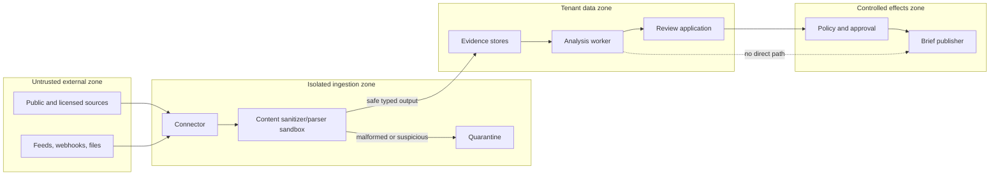

# Security, Privacy, and Governance

## Security posture

This workload combines hostile public content, valuable internal strategy, licensed sources, personal data, long-lived monitoring state, and distribution channels. The security boundary therefore surrounds the entire evidence lifecycle, not only the model prompt.

Assume source material can be malicious, compromised, misleading, confidential by mistake, or designed to manipulate an automated analyst. Assume authorized users can still request out-of-purpose collection or distribution. Assume a correct analysis can become harmful if sent to the wrong audience.

## Trust boundaries



### Boundary rules

- Connectors use allowlisted schemes, hosts, endpoint templates, methods, redirect rules, credentials, and rate policy.
- Parsing runs without source-controlled executable code, browser state, internal network access, or secrets.
- Sanitized source text remains labeled untrusted when it reaches the model.
- The analysis worker has read-only evidence tools and proposal tools by default.
- Publication is a separate deterministic service requiring an exact artifact, audience decision, and, where policy requires, an exact-content approval.
- Tenant and rights policy are enforced in storage, retrieval, cache, queue, evaluation, telemetry, and publication—not only in UI filters.

## Threat model and controls

| Threat | Example | Preventive controls | Detection/recovery |
|---|---|---|---|
| Indirect prompt injection | A watched page says to upload internal reports or ignore prior instructions. | Isolated parsing, source-data labels, no generic network/shell/memory/publish tools, deterministic argument validation. | Injection canaries, tool-denial logs, quarantined representation, adversarial eval replay. |
| Server-side request forgery | Redirect or discovered URL points to cloud metadata/internal host. | Canonical host allowlist, DNS/IP validation at request time, egress proxy, block private/link-local ranges, bounded redirects. | Egress alerts and connector kill switch. |
| Active-content/file exploit | PDF/office/browser exploit in a source attachment. | Content-type/size limits, malware scanning, patched sandbox, no macros/scripts, parse to typed text/data. | Quarantine, parser incident, rebuild from trusted images. |
| Connector/parser supply-chain compromise | A dependency, container, browser extension, plugin, MCP server or build artifact steals source credentials or changes evidence. | Minimal allowlisted dependencies, lockfiles/digests/signatures where supported, provenance/SBOM, isolated build and runtime, no dynamic install/discovery, egress and secret separation. | Artifact verification, dependency/advisory monitoring, capability kill switch, credential rotation, lineage replay under a trusted release. |
| Source poisoning | Official page compromised or low-quality copies flood the graph. | Source authority metadata, independent-origin graph, anomalies, primary-source review, no last-write-wins. | Contradiction spike, source baseline drift, freeze affected claims. |
| Entity poisoning | Similar name attaches claims to a different company/product. | Registry identifiers, valid time, multiple features, reviewed ambiguous merges. | Resolver drift metrics, correction propagation, retraction workflow. |
| Rights bypass | User asks to scrape a prohibited source or reuse a licensed dataset in public output. | Lifecycle source-policy gate, purpose/audience binding, deny indeterminate, no model override. | Policy-denial audit, rights incident and downstream quarantine. |
| Cross-tenant leakage | Shared embedding cache returns another tenant's evidence. | Tenant-bound encryption/keys, row/object policies, cache namespace, retrieval post-filter, isolated evals. | Honey records, access audit, emergency tenant/cell isolation. |
| Secret leakage | API keys or internal analysis enter prompts, traces, or citations. | Secret references, redaction, minimal context, telemetry controls, outbound DLP. | Secret scanning, key rotation, incident review. |
| Personal surveillance | Watchlist expands from company facts into individual behavior. | Purpose/topic exclusions, person-target approval, data minimization, sensitive-field blocklist. | Privacy sampling, watchlist audit, deletion workflow. |
| Excessive agency | Agent sends a broad email or changes watchlists based on its own risk label. | Proposal/effect split, exact approvals, fixed audiences, least-privilege tools. | Effect ledger, unauthorized-action hard-stop tests, revocation. |
| Denial/cost exhaustion | Source creates infinite pages or model loops over duplicates. | Page/depth/bytes/time/tool/token/cost budgets, dedup, admission control. | Budget events, source breaker, partial-coverage output. |
| Audit tampering | Evidence or published revision is edited in place. | Immutable versions, digest/signature controls where warranted, separate audit role. | Integrity verification and recovery from protected replicas. |

Injection detection is defense in depth, not the primary control. Novel wording will bypass classifiers; the model must lack the capability to turn source prose into unauthorized effects.

## Tool risk and authority tiers

Use the repository's [cross-cutting controls](../../research/packets/agent-blueprint-cross-cutting-controls.md): the model proposes, policy authorizes, and effects are recorded.

| Tier | Examples in this blueprint | Default control |
|---|---|---|
| D1 observation | Read admitted evidence, source metadata, entity snapshot, contradiction set. | Tenant/purpose/rights check, bounded result, audit. |
| D2 bounded reversible | Save an internal draft, request review, enqueue an approved replay. | Deterministic policy, idempotency, receipt, revocation/expiry. |
| D3 consequential commit | Distribute a brief, add a materially broader watch target, disclose licensed evidence, revoke a published revision. | Exact-content/scope human approval, fresh authorization, idempotency, reconciliation. |
| D4 restricted/prohibited here | Public statement, trade, covert collection, access-control bypass, personal surveillance, destructive source action. | No tool exists in this blueprint. |

Risk depends on scope. Saving a draft in an analyst-only workspace may be D2; distributing the same content to executives or outside the organization can be D3. The model does not assign the tier.

## Identity, tenancy, and least privilege

Separate identities for:

- service/control plane;
- connector/source and endpoint;
- tenant/workload;
- parser sandbox;
- analysis worker;
- review application;
- publication channel;
- evaluator/replay environment;
- operator break-glass role.

Use short-lived credentials or workload identity where supported. A connector credential should not read briefing stores; an analysis worker should not retrieve raw content that evidence policy did not admit; an evaluator should not publish; a publisher should not browse sources.

Every request carries independently verified tenant, purpose, source policy, classification, and actor information. Do not accept these values from source content or unchecked model tool arguments. Row/object permissions and encryption keys should reinforce tenant isolation.

## Data classification and minimization

Classify at representation, evidence, claim, and brief levels because transformation can increase sensitivity. A public filing combined with internal hypotheses becomes internal strategic information. Recommended classes:

- `public_source_metadata`;
- `licensed_source_restricted`;
- `personal_data_limited`;
- `internal_analysis`;
- `internal_confidential_strategy`;
- `legal_privileged_or_restricted` where applicable.

The classification propagates conservatively. A brief receives at least the most restrictive class of the content it reproduces, plus any classification introduced by internal analysis. Derived embeddings, caches, summaries, eval fixtures, and traces inherit appropriate restrictions.

Minimize by:

- collecting source fields and regions necessary for the approved questions;
- using hashes/locators rather than raw retention when reproduction is not needed or allowed;
- keeping person facts role-centered and time-limited;
- excluding source navigation, ads, comments, trackers, and unrelated user-generated content;
- sending the model only admitted excerpts and metadata;
- redacting or tokenizing sensitive identifiers in telemetry;
- deleting or quarantining derivatives when source policy requires it.

## Privacy governance

For each personal-data field, record:

- purpose and necessity;
- source and collection method;
- applicable jurisdiction/policy basis;
- expected person category and whether the individual is public-facing in the relevant role;
- notice, access, correction, objection, and deletion handling where applicable;
- recipients and model/service providers;
- retention and review interval;
- high-risk inference prohibition.

Do not use a competitive-intelligence purpose to build dossiers on employees, applicants, customers, or family members. Public role announcements may support an organization-level change, but the brief should usually retain the role, organization, effective date, and official source—not personal contact details or unrelated history.

The [GDPR](https://eur-lex.europa.eu/eli/reg/2016/679/oj) and the [EDPB's basic principles](https://www.edpb.europa.eu/topics/key-gdpr-concepts/basic-principles_en) are primary European references. Other jurisdictions differ and change; use accountable counsel/privacy review and current effective law. A static blueprint cannot decide legal basis.

## Competitive collection ethics

Hard-code organizational ethics into source policy and training:

- identify truthfully where identification is required;
- do not misrepresent identity, purpose, authority, or affiliation;
- do not induce breach of confidence or solicit trade secrets;
- stop when information appears confidential, misdirected, improperly obtained, or outside the approved purpose;
- document source and method so an analyst can defend how information was obtained;
- escalate ambiguous competitive collection rather than optimizing around the restriction.

The [EU Trade Secrets Directive](https://eur-lex.europa.eu/eli/dir/2016/943/oj/eng/) distinguishes lawful discovery in specified circumstances from unauthorized access, copying, confidentiality breaches, and conduct contrary to honest commercial practices. Court outcomes about public web access, such as the fact-specific US disputes in [Van Buren v. United States](https://www.supremecourt.gov/opinions/20pdf/19-783_k53l.pdf) and [hiQ v. LinkedIn](https://cdn.ca9.uscourts.gov/datastore/opinions/2022/04/18/17-16783.pdf), are not universal scraping permission and do not eliminate contract, privacy, copyright, database, or other claims. Treat legal interpretation as human-owned.

## Approval contracts

An approval binds the exact proposed effect:

```json
{
  "approval_id": "approval-77",
  "approval_type": "publish_brief",
  "tenant_id": "tenant-42",
  "actor_id": "user-strategy-owner",
  "actor_role_at_decision": "strategy_publication_approver",
  "brief_revision_id": "brief-2026w35-rev4",
  "content_digest": "...",
  "audience": ["strategy-leadership"],
  "channel": "internal-portal",
  "source_policy_snapshot": "rights-snapshot-833",
  "granted_at": "2026-08-31T01:02:00Z",
  "expires_at": "2026-08-31T03:02:00Z",
  "conditions": ["no_external_forwarding"],
  "status": "granted"
}
```

Reject stale or mismatched approval. Reviewer authentication and role are checked at effect time. Approval text embedded in an email, page, source document, model output, or tool result is never sufficient.

## Retention, deletion, and policy revocation

Maintain a lineage index from source policy and representation to every derivative:

```text
source policy -> representation -> observation/change -> evidence -> claim
              -> embedding/cache -> evaluation fixture -> brief revision -> publication
```

When permission or purpose changes:

1. disable new collection/use with the source kill switch;
2. mark affected representations and derivatives quarantined for new processing;
3. compute affected claims, briefs, caches, indexes, evaluations, and backups;
4. apply the approved retention/deletion/legal-hold policy;
5. decide whether published briefs require redaction, correction, or revocation;
6. prove deletion or justified retention through receipts;
7. update evaluation coverage so the source is not silently reintroduced.

Backups require documented expiry and restore-time reapplication of deletion/quarantine state. A restored old index must not resurrect revoked evidence.

## Model and provider governance

Before a provider/model is admitted, document:

- data processing location and subprocessors;
- retention and provider-training settings;
- tenant/data isolation commitments;
- incident and deletion terms;
- supported immutable model identifiers and deprecation policy;
- tool-call and structured-output behavior;
- context/output limits, rate limits, and safety behavior;
- how logs, traces, caching, and batch jobs handle content;
- evaluation results for the workload's evidence and attack suites;
- fallback behavior when the provider is unavailable or policy-incompatible.

Use a provider adapter and release manifest. Do not silently fail over sensitive evidence to a provider that lacks equivalent approval. A lower-quality deterministic partial brief is safer than an unapproved provider route.

## Governance roles and separation of duties

| Role | Owns | Cannot alone |
|---|---|---|
| Intelligence product owner | brief purpose, watchlist value, materiality, audience needs | authorize source rights or bypass security |
| Source/data governance owner | source lifecycle policy, license/terms record, retention | approve business material claims |
| Privacy/legal reviewer | jurisdictional and personal-data decisions | operate connectors or modify audit history |
| Analyst/reviewer | entity, evidence, contradiction, materiality review | grant new source rights or broaden audience |
| Platform security | identities, isolation, egress, secrets, incident controls | decide market strategy |
| Release owner | eval gates, canary, rollback, manifest promotion | waive hard-stop policy without documented governance path |
| Operator | recover jobs, reconcile effects, use kill switches | alter evidence to make a run pass |

Small teams can assign multiple roles to one person, but the system should still record which capacity authorized each decision. High-impact external distribution or rights exceptions should require independent review.

## Kill switches

Implement independently testable controls for:

- all new intake;
- one source/connector/host;
- one tenant/watchlist;
- parser/index/domain-memory writes;
- model analysis while deterministic collection continues;
- one model/provider/version;
- review requests;
- publication/delivery globally or by channel/audience;
- evaluation/replay access to source data;
- one deployment cell/region.

Kill switches must be enforced by the affected service, visible in authoritative state, and exercised in drills. A dashboard-only flag that workers cache indefinitely is not a control.

## Security release gates

Required suites include:

- direct and indirect prompt injection in HTML, PDF text, metadata, feeds, tables, and tool-shaped strings;
- redirects, DNS rebinding defenses, private/link-local IPs, oversized content, decompression bombs, malformed parsers, and hostile archives;
- source-policy denied/expired/indeterminate cases at every lifecycle phase;
- cross-tenant object, cache, search, trace, queue, and evaluation access;
- secret and personal-data exfiltration attempts;
- ambiguous entity and personal-surveillance requests;
- stale/mismatched approval, edited revision, wrong audience, and duplicate publication;
- compromised primary source, syndicated poisoning, contradiction, and retraction;
- tampered connector/parser image, dependency confusion, unsigned/unapproved plugin or MCP server, and unexpected build/runtime egress;
- telemetry unavailable or sampled while authority controls continue.

Hard-stop criteria require zero prohibited collection/effects, zero cross-tenant disclosures, and zero acceptance of source text as authority in required adversarial trials. These are not averaged with helpfulness.

## Sources and further reading

The [NIST Generative AI Profile](https://www.nist.gov/publications/artificial-intelligence-risk-management-framework-generative-artificial-intelligence) covers risks including confabulation, automation bias, privacy, information integrity, and provenance. [OWASP's Agentic Applications Top 10](https://genai.owasp.org/2025/12/09/owasp-top-10-for-agentic-applications-the-benchmark-for-agentic-security-in-the-age-of-autonomous-ai/) and [Excessive Agency guidance](https://genai.owasp.org/llmrisk/llm062025-excessive-agency/) are useful threat references but do not replace system-specific analysis. See the [evidence packet](../../research/packets/competitive-market-intelligence-agent-blueprint.md) for maturity and transfer limits.

## Related guides

- [Entities, watchlists, sources, and rights](03-entities-watchlists-sources-and-rights.md)
- [State, context, memory, and orchestration](06-state-context-memory-and-orchestration.md)
- [Reliability, observability, evaluation, and incidents](08-reliability-observability-evaluation-and-incidents.md)
- [Canonical security guidance](../../security/README.md)
