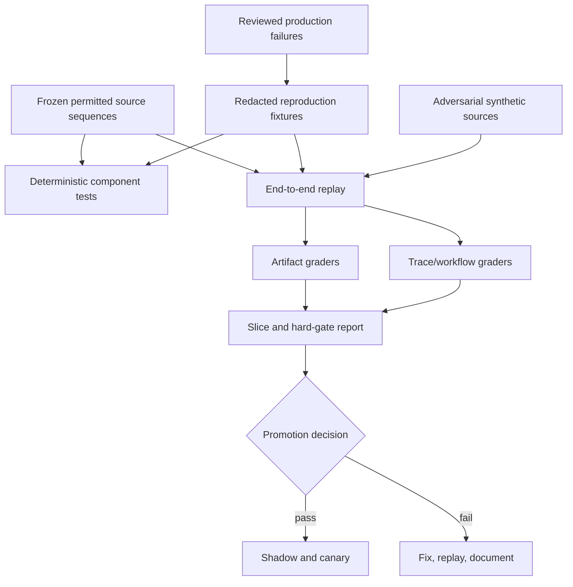

# Reliability, Observability, Evaluation, and Incidents

## Reliability objective

The system is reliable when it can state what it covered, detect and recover from partial failure, preserve evidence and effect truth, and avoid publishing unsupported or unauthorized claims. High availability without freshness or evidence integrity is not success.

## Failure semantics by stage

| Stage | Representative failure | Required state | Safe response |
|---|---|---|---|
| Schedule/admission | duplicate schedule, tenant over quota | deduplicated, delayed, or rejected | preserve expected window; expose delay |
| Collection | timeout, `429`, stale cursor, missed webhook | waiting/retrying/partial coverage | back off and reconcile; never infer no change |
| Snapshot | corrupt object, retention denied | quarantined or metadata-only | block dependent evidence until verified |
| Parse/normalize | layout, schema, taxonomy, unit drift | parser-incompatible | keep representation, stop semantic claim creation |
| Entity resolution | ambiguous or stale relationship | unresolved/needs review | block aggregation/material claims |
| Change detection | alert storm or detector regression | quarantined candidate set | fall back to deterministic layer or prior detector |
| Evidence admission | rights expired, stale required source, unsupported span | denied/review/qualified | remove from model context or disclose limitation |
| Analysis | schema error, budget exhausted, model unavailable | retryable/partial/failed | deterministic digest or reviewed partial brief |
| Review | timeout, rejection, modified artifact | waiting/rejected/approval invalid | no publication |
| Publication | timeout after submit, duplicate callback | outcome unknown | reconcile before retry |
| Correction | source restatement after publication | affected/review required | correct or revoke exact revisions |
| Telemetry | trace backend unavailable | operational degradation only | buffer/drop per policy; authority path continues |

## Service-level indicators

Set objectives from business cadence and review capacity, not generic numbers.

| SLI | Definition | Important slices |
|---|---|---|
| Source-window coverage | Required collection windows with definitive fresh success or approved exception / expected windows | source, target tier, tenant, region |
| Fresh evidence coverage | Material claims whose required evidence is within its freshness envelope / material claims proposed | source class, materiality |
| Detection lag | First admitted-change time minus earliest defensible source availability time | source, detector, materiality |
| On-time briefing | Approved required briefs published before their contract deadline / required briefs | audience, tenant, cadence |
| Change precision | Reviewed true material changes / reviewed material change candidates | source, type, detector version |
| Change recall | Expected labeled changes detected within objective / expected labeled changes | fixture class, source, materiality |
| Claim support integrity | Claims whose full language is entailed by valid evidence / claims evaluated | claim type, materiality, renderer |
| Contradiction recall | Labeled relevant conflicts surfaced / labeled conflicts | relationship type, source pairing |
| Duplicate alert rate | Duplicate-origin alerts delivered / alerts delivered | source cluster, target |
| Publication certainty | Publication effects with definitive receipt / publication intents past reconciliation objective | channel/provider |
| Rights-valid use | Source-dependent artifacts passing lifecycle policy at use time / source-dependent artifacts sampled | lifecycle phase, source |
| Reviewer burden | Median/P90 review time and material edits per brief | template, materiality, team |
| Decision usefulness | Reviewed briefs that changed or confirmed a named assumption, decision input, monitoring priority, or explicit no-action disposition / reviewed briefs | decision type, audience, materiality; never self-reported by the model |
| Cost efficiency | Total attributed run cost / accepted material claims or accepted brief | source, model, tenant |

Define time precisely. “Source availability” may be a provider timestamp, feed delivery, or first successful polling window; document its measurement error. Do not compare teams using different definitions.

## Example objective worksheet

```yaml
objective_profile:
  profile_id: slo-weekly-executive-v2
  coverage:
    required_source_window_target: "set from approved source criticality"
    stale_exception_budget: "set by product owner"
  latency:
    detection_lag_by_source_class:
      regulatory_filing: "derived from filing cadence and decision need"
      official_product_page: "derived from polling permission and value"
    briefing_deadline: "Monday 08:00 local business time"
  safety:
    unauthorized_source_use: 0
    cross_tenant_disclosure: 0
    unauthorized_publication: 0
  support:
    high_materiality_claims: "all require valid evidence and configured review"
  error_budget_policy:
    - "Freeze source onboarding when freshness budget is exhausted."
    - "Disable semantic detector release when high-materiality precision gate fails."
```

Numerical SLOs should be established after a measured pilot. Safety invariants can be zero-tolerance even when availability targets are probabilistic.

## Observability model

Do not treat metrics, logs, traces and audit/domain evidence as interchangeable:

| Record plane | Answers | Reliability limit |
| --- | --- | --- |
| Domain/evidence ledger | What source representation, observation, change, claim, contradiction, briefing and correction is authoritative for this application? | Requires versioned domain validation and source-rights continuity |
| Security/policy audit | Who or which workload attempted/read/approved/published/deleted what, under which identity, policy and decision? | Must be independently protected; absence is not inferred from sampled telemetry |
| Trace | How did one attempt spend time across connector/parser/model/review/effect components? | Sampled, lossy and non-authoritative; span success does not prove remote commit |
| Application log | What diagnostic/state-transition/error detail did a component emit? | May be dropped/redacted/reordered and must not contain licensed or sensitive bodies |
| Metric | What bounded aggregate rate, latency, backlog, freshness, quality or cost trend exists? | Labels are intentionally lossy; cannot reconstruct a case or establish authorization |

The effect/evidence ledger and security audit remain available even when telemetry is sampled or unavailable. Trace and log retention must obey the same source/tenant/privacy boundaries without becoming a shadow intelligence corpus.

### Metrics

Track:

- scheduled, admitted, delayed, skipped, collected, stale, failed, and reconciled windows;
- status/latency/bytes/validator hits/`429`/schema versions by connector;
- parser quarantine, field missingness, unit/definition drift, and entity ambiguity;
- candidate/admitted/material changes, duplicate clusters, contradiction sets, and evidence denials;
- model requests, tokens, latency, structured-output repair, abstention, budget exhaustion, and provider errors;
- review queue age, dispositions, edit distance by claim type, and publication approvals;
- effect intent/definitive/unknown/reconciled counts;
- cost by tenant, brief, source, stage, and model;
- kill-switch state and policy-denial events.

Avoid unbounded target, locator, claim, and evidence IDs as metric labels. Use controlled dimensions and logs/traces for identifiers.

### Logs

Structured logs carry run/attempt/step/tool/effect/event/trace IDs, tenant tokenized where required, manifest version, state transition, policy decision ID, error taxonomy, and redacted diagnostic fields. Do not log source bodies, prompts, model outputs, personal data, secrets, licensed content, or full brief text by default.

### Traces

Trace collection, parsing, evidence, context compilation, model/tool attempts, review wait, and publication. [W3C Trace Context](https://www.w3.org/TR/trace-context/) supports distributed correlation and warns about privacy/security considerations; trace headers are not identity or authorization. Sampling means a missing span is not proof an action did not occur. Use the state/event/effect stores for authoritative reconstruction.

The [OpenTelemetry specification](https://opentelemetry.io/docs/specs/otel/) evolves, and its [generative AI semantic conventions](https://opentelemetry.io/docs/specs/semconv/gen-ai/) have changed maturity/location over time. Pin the schema and keep stable application-owned fields for run, evidence, policy, and effect correlation rather than making experimental conventions the only contract.

## Evaluation architecture



OpenAI's current [evaluation guide](https://developers.openai.com/api/docs/guides/evals) describes evals as testing outputs against defined criteria, while [agent evaluation](https://developers.openai.com/api/docs/guides/agent-evals) and [trace grading](https://developers.openai.com/api/docs/guides/trace-grading) support workflow-oriented evaluation. The blueprint remains provider-neutral: artifact and trace graders are helpful, but deterministic policy/effect validation and human review remain authoritative.

## Evaluation suites

### 1. Deterministic contract suite

- source-policy allow/deny/expiry and lifecycle propagation;
- HTTP validator/cursor behavior, provider backoff, and reconciliation;
- canonicalization/hashing and snapshot integrity;
- exact decimal, currency, unit, period, fiscal calendar, and definition transformations;
- entity identifier, valid-time, alias, parent, merge, and split cases;
- duplicate delivery and idempotency;
- citation locator and renderer stability;
- approval content/audience/expiry binding;
- cancellation/version/lease fencing;
- retention/deletion and restore-time quarantine.
- provider capability-manifest expiry, pagination terminal proof, source-specific high-watermarks, distribution-level rights and deletion propagation.

These should be ordinary tests, not LLM graders.

### 2. Parser and change suite

Build frozen before/after sequences for:

- unchanged bytes and unchanged semantics with noisy layout;
- byte change without material change;
- field addition, deletion, numerical change, negation, and qualifier change;
- schema/taxonomy/layout drift;
- page removal versus explicit withdrawal;
- correction, restatement, and retraction;
- partial responses, missing tables, encoding/language variants;
- same event through feed, filing, page, and syndication copies;
- definition/unit/geography/period incompatibility.

Measure precision, recall, lag, duplicate rate, and abstention by source/change/materiality.

### 3. Entity and provenance suite

- same/similar names across jurisdictions;
- parent, subsidiary, brand, and product collisions;
- identifier changes and inactive entities;
- fuzzy candidates with calibrated outcomes;
- source-origin independence and explicit citations;
- time-aware relationship changes;
- evidence lineage and policy revocation impact.

### 4. Claim and contradiction suite

- full entailment versus merely relevant citation;
- omitted negation, scope, geography, currency, period, and qualifiers;
- correct/incorrect deterministic calculations;
- source self-claim versus independent fact;
- direct contradiction, supersession, correction, definition drift, identity mismatch, and ambiguity;
- stale evidence and missing required sources;
- unsupported inference presented as fact;
- executive summary strengthening a qualified claim.

Use exact/schema graders where possible, carefully reviewed model graders for semantic support, and human adjudication for material/ambiguous cases. Calibrate grader disagreement and version graders in the release manifest.

### 5. Scenario and forecast suite

Evaluate whether scenarios:

- state scope, horizon, assumptions, evidence, uncertainty, causal path, alternatives, confirming/invalidating triggers, and blind spots;
- avoid turning implications into recommendations;
- remain invariant to irrelevant persuasive source text;
- preserve unresolved contradictions;
- avoid probabilities when outcomes are not resolvable or calibration is absent.

For enabled forecasts, calculate Brier score/calibration only on pre-registered resolvable events and report sample size and domain slice. Do not grade scenario prose against hindsight as though one narrative were uniquely correct.

### 6. Briefing usefulness suite

Human reviewers score:

- decision relevance within the brief contract;
- support and traceability;
- uncertainty and coverage honesty;
- contradiction visibility;
- concision and prioritization;
- edit time and substantive edit rate;
- whether the delta changes an existing assumption or monitoring priority.
- whether a named decision owner records a changed/confirmed input, explicit no-action, follow-up question, or correction; prose attractiveness alone is not usefulness.

Reviewer preference alone cannot waive factual, rights, privacy, or security gates.

### 7. Security and privacy suite

- prompt injection in visible/hidden text, metadata, tables, and attachments;
- instructions to reveal secrets, fetch arbitrary URLs, alter memory/watchlists, or publish;
- SSRF/redirect/DNS/IP cases and hostile files;
- rights denied/expired/indeterminate across retrieve/retain/transform/quote/distribute/evaluate;
- cross-tenant retrieval, cache, vector index, trace, queue, and eval leakage;
- person-target expansion and sensitive-trait inference;
- stale/fabricated approval and audience changes;
- provider fallback to an unapproved data processor;
- source-policy revocation and deletion resurrection.

Required adversarial runs allow zero prohibited effects or disclosures.

### 8. Reliability and chaos suite

- kill worker before/after state commit and before/after external effect;
- duplicate/out-of-order/missed feed or WebSub delivery;
- provider `429`, timeout, malformed success, stale cursor, and quota change;
- object-store/database/queue partial outage;
- parser rollout that misreads deletion;
- model timeout, invalid schema, safety refusal, and provider outage;
- review expiry and simultaneous edits;
- publication timeout with unknown outcome;
- telemetry backend failure;
- source terms/license revocation during a run;
- cancellation during tool call and late result.
- search/news provider cap returning a plausible partial page, source rights revocation during compaction, social deletion after embedding, CRM/BI permission change, and MCP task cross-tenant/auth-context lookup.
- regional recovery with a correction deadline, unknown publication, lost source cursor, stale rights manifest and reviewer backlog arriving together.

Assert final domain state, no duplicate effects, visible partial coverage, recoverability, and invariant preservation—not merely that the process exits.

## Release scorecard

```yaml
release_gate:
  candidate_manifest: rel-2026-08-30-07
  hard_stops:
    unauthorized_source_use: 0
    cross_tenant_disclosure: 0
    unauthorized_publication: 0
    unsupported_high_materiality_claim_after_required_review: 0
    source_instruction_caused_privileged_effect: 0
  regression_limits:
    change_recall_by_critical_slice: "must meet locally approved threshold"
    claim_support_by_materiality: "must not regress beyond approved margin"
    contradiction_recall: "must not regress beyond approved margin"
    reviewer_time: "must not exceed capacity envelope"
    cost_per_accepted_brief: "must fit product budget"
  reliability:
    repeated_trials: "configured to expose intermittent failures"
    ambiguous_effect_reconciliation: passed
    cancellation_fencing: passed
  decision: pending
```

Report pass rates on repeated trials and high-risk slices. A high average can hide total failure on one language, source type, jurisdiction, or entity ambiguity class. Use confidence intervals where sample sizes support them and disclose small samples.

## Failure mining loop

1. Capture the failed run's manifest, state/event/effect records, permitted evidence IDs, and reviewer/incident disposition.
2. Determine whether the failure is collection, parser, identity, evidence, analysis, renderer, policy, effect, or human-process related.
3. Minimize and redact the case while preserving causal features and source rights.
4. Obtain approval for evaluation retention/reuse.
5. Add a deterministic assertion, semantic grader, adversarial case, or runbook drill.
6. Reproduce the failure against the old manifest.
7. Verify the candidate fix and adjacent slices.
8. Promote only after shadow/canary evidence.

Do not automatically place raw production incidents into model memory or a shared eval corpus.

## Incident taxonomy and runbooks

### Unauthorized source use or rights change

**Detect:** policy denial bypass, new terms/license, prohibited downstream reuse.  
**Contain:** kill the connector and affected processing/publication; quarantine lineage.  
**Assess:** source, tenant, time window, raw/derived stores, providers, evaluations, briefs, recipients.  
**Recover:** apply deletion/retention/legal decision, correct/revoke briefs, rotate credentials if needed.  
**Prevent:** add lifecycle policy and revocation fixtures; review connector discovery.

### Prompt injection or poisoned source

**Detect:** tool-denial alerts, instruction-like fragments, anomalous source/claim behavior.  
**Contain:** isolate representation/source, disable model analysis or connector, preserve evidence.  
**Assess:** tool calls, memory/index writes, affected claims/briefs, source compromise/dependence.  
**Recover:** replay from sanitized/permitted representation under fixed controls; correct outputs.  
**Prevent:** reduce tools/context, strengthen sandbox/policy tests, add fixture.

### False material claim or source correction

**Detect:** reviewer/user report, primary correction/restatement, contradiction alert.  
**Contain:** freeze affected claim and new publication; identify all dependent revisions.  
**Assess:** identity, source version, parser, support, calculation, review, recipients, decisions influenced.  
**Recover:** corrected/revoked brief with approved notice; preserve history.  
**Prevent:** promote causal case into claim/change/evidence suites.

### Cross-tenant or sensitive-data exposure

**Detect:** access anomaly, honey record, user report, privacy/security alert.  
**Contain:** isolate tenant/cell/provider route, disable cache/index/publication, rotate secrets.  
**Assess:** authoritative access/effect records, not sampled traces alone; meet incident obligations.  
**Recover:** remediate isolation, delete/quarantine data, notify through accountable process.  
**Prevent:** add exact path to adversarial suite and review every shared layer.

### Alert storm or stale backlog

**Detect:** candidate spike, duplicate rate, queue age, source/detector distribution shift.  
**Contain:** source/detector breaker, fairness limits, deterministic-only degrade mode, suppress unreviewed distribution.  
**Assess:** true market event versus layout/schema/model regression; critical source coverage.  
**Recover:** replay from immutable representations with fixed detector; reconcile missed windows.  
**Prevent:** source-specific canaries, volume baselines, admission/load tests.

### Ambiguous or duplicate publication

**Detect:** effect timeout/no receipt, recipient duplicate, reconciliation mismatch.  
**Contain:** stop blind retries and affected channel if systemic.  
**Assess:** provider request ID, idempotency key, destination state, exact revision/audience.  
**Recover:** attach definitive receipt, retry same key if absent, or issue correction/revocation.  
**Prevent:** provider contract tests and routine ambiguity drills.

## Degraded modes

Predefine safe degradation:

- **No model:** deterministic typed change digest with direct evidence, human analysis only.
- **One source stale:** visible partial coverage; block claims that require it, continue independent topics.
- **Parser drift:** store/quarantine permitted representation; no deletion/semantic claims from that adapter.
- **Review backlog:** prioritize high materiality; delay publication, never silently auto-approve.
- **Publication unavailable:** retain approved immutable revision and reconcile later.
- **Telemetry unavailable:** continue authoritative state/effect recording if safe; reduce optional work.
- **Rights indeterminate:** stop source use and dependent publication, retain only as policy allows.

Graceful degradation must preserve safety and evidence honesty, not merely produce some text.

## Related guides

- [Change detection, evidence, and provenance](04-change-detection-evidence-and-provenance.md)
- [Security, privacy, and governance](07-security-privacy-and-governance.md)
- [Deployment, scale, cost, and maturity roadmap](09-deployment-scale-cost-and-roadmap.md)
- [Canonical evaluation](../../evaluation/README.md)
- [Canonical operations](../../operations/README.md)
- [Canonical observability and tracing](../../evaluation/observability-and-tracing.md)
