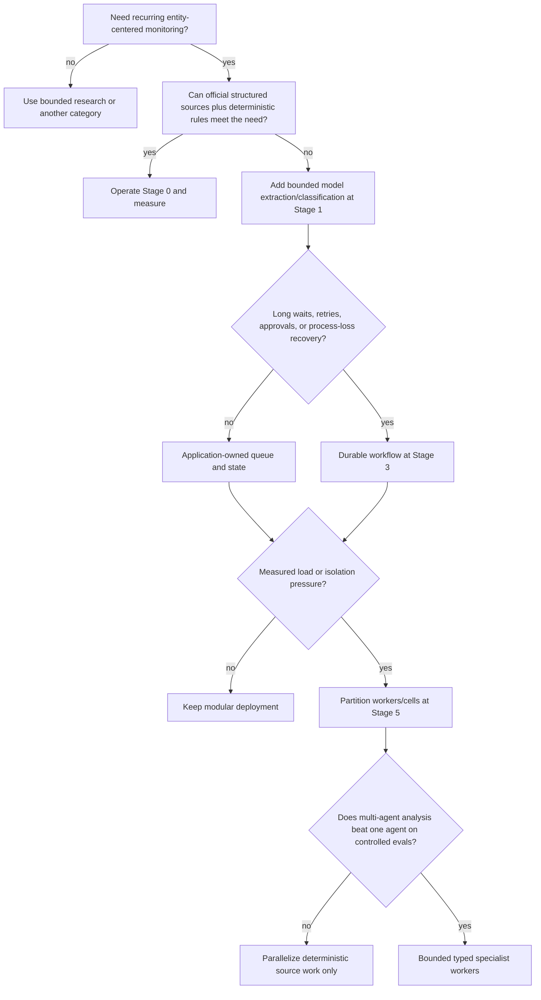

# Deployment, Scale, Cost, and Maturity Roadmap

## Roadmap principle

Each stage buys a specific capability and adds only the controls needed to make that capability safe. A team can stop at any stage that meets its real need. Progression is not a maturity contest, and a deterministic Stage 0 system may be the best production solution for a small stable watchlist.

The seven stages follow the repository's [agent blueprint expansion program](../../research/agent-blueprint-expansion-program.md). Exit gates are cumulative: passing a later feature demo does not waive an earlier rights, evidence, recovery, or evaluation gate.

## Decision tree



## Stage 0 — Qualify the need with a deterministic baseline

### Stage 0 goal

Prove that recurring monitoring creates value and establish source, identity, freshness, materiality, and review baselines before adding an agent.

### Stage 0 architecture and authority

Use a scheduled job, allowlisted connectors, a relational store, permitted snapshots/object storage, deterministic normalization/diffs, rule filters, a fixed Markdown template, and a human review queue. No model is required. Humans own watchlists, source policy, entity mappings, materiality rules, and distribution.

### Stage 0 inputs and outputs

**Inputs:** a small approved entity/product watchlist, official structured sources or stable pages, cadence, source policy, rules, and a named reviewer.  
**Outputs:** a candidate-change table with before/after values, direct source locators, retrieval times, coverage failures, and a draft digest.

### Stage 0 state, events, and effects

- Version watchlist/source policy and persist expected collection windows.
- Store retrieval receipts, representation hashes/versions, typed diffs, reviewer dispositions, and digest revisions.
- Emit events such as `CollectionWindowExpected`, `RepresentationRetrieved`, `ChangeCandidateDetected`, and `ReviewerDispositionRecorded`.
- Only allowed effects are save draft and request review. Publication remains manual outside the system or is an exact approved effect with a receipt.

### Stage 0 approvals

Source/purpose/retention approval precedes collection. Reviewers approve entity mapping and digest content. No model-generated approval exists.

### Stage 0 failures and recovery

- Retry provider failures within documented policy; expose stale coverage.
- Quarantine parse/layout changes.
- Deduplicate schedule and feed events.
- Reconcile expected collection windows against receipts.
- Preserve unknown publication outcomes if distribution is automated.

### Stage 0 evaluation

Create frozen before/after fixtures and measure source coverage, detection lag, rule precision/recall, duplicate alerts, reviewer time, accepted-change rate, and cost. Include rights and tenant tests from the start.

### Stage 0 exit gate

Proceed only if:

- the watchlist and source lifecycle are approved and operational;
- deterministic fixtures and failure states are reliable;
- the team can quantify important false positives, misses, and reviewer burden;
- representative failures show a specific need for semantic extraction, classification, comparison, or synthesis;
- the proposed model addition has a measurable success criterion.

If deterministic monitoring meets the objective, stop here and harden it rather than adding an agent.

## Stage 1 — First bounded model-assisted agent

### Stage 1 goal

Use a model for the smallest verified gap: extracting semantic changes, mapping source language to a typed taxonomy, explaining a diff, or drafting a brief from admitted evidence.

### Stage 1 architecture and authority

Retain the Stage 0 pipeline. Add a provider adapter, context compiler, typed observation/proposal tools, structured output, hard run/tool/token/time/cost budgets, and an application-owned completion validator. Use one analytical agent. The model cannot access arbitrary URLs, alter policy/watchlists, write durable memory, or publish.

### Stage 1 inputs and outputs

**Inputs:** typed diffs, limited before/after source spans, entity snapshot, evidence metadata, brief question, materiality profile, and tool/output schemas.  
**Outputs:** proposed change label/materiality dimensions, typed claims with evidence IDs, contradictions/gaps, and a draft section.

### Stage 1 state, events, and effects

- Record model attempt, context bundle/compaction receipt, prompt/tool/model versions, proposals, validator results, and budget use.
- Treat provider conversation/stream as non-authoritative.
- Application state moves to `WaitingReview`, `Partial`, `Failed`, or `Succeeded` only after artifact validation.
- Allowed effects remain save draft and request review, both idempotent.

### Stage 1 approvals

Humans still approve material claims and publication. Policy validates every tool argument and context item. Rights-indeterminate evidence is never sent to the model.

### Stage 1 failures and recovery

- Retry only transient model failures and invalid structured output within a small fixed limit.
- On budget exhaustion or provider outage, produce the deterministic digest or a visible partial artifact.
- Never retry an external effect through the model.
- Preserve both attempts and select one through deterministic validation/reviewer disposition.

### Stage 1 evaluation

Compare agent versus Stage 0 on the same frozen source sequences. Measure semantic-change recall/precision, full-claim support, materiality agreement by slice, abstention, contradiction visibility, reviewer time, latency, and total cost. Add prompt-injection and tool-escalation attacks.

### Stage 1 exit gate

- The model improves a named metric or reviewer workflow enough to justify cost/complexity.
- It never creates source permission, silently resolves entity ambiguity, or produces prohibited effects in required trials.
- Structured outputs, evidence links, budgets, retries, and fallback behavior are enforced in application code.
- Reviewers can inspect and correct typed proposals.

## Stage 2 — Evidence-grounded pilot in a real environment

### Stage 2 goal

Operate a bounded real watchlist with explicit evidence, context, approvals, online shadowing, and product metrics.

### Stage 2 architecture and authority

Deploy a control/API service, connector and analysis workers, relational state/evidence metadata, permitted immutable object storage, queue, review UI, policy engine, telemetry, and isolated evaluation environment. Source content parsing is sandboxed. Domain records and effects follow typed contracts.

### Stage 2 inputs and outputs

**Inputs:** versioned brief contracts, entity registry, source policies, source-class freshness rules, frozen and live representations, and reviewer queue.  
**Outputs:** evidence ledger, contradiction sets, analysis/scenario package, audience-specific draft, coverage statement, review record, and controlled publication receipt if enabled.

### Stage 2 state, events, and effects

- Separate command, authoritative run state, domain event, effect intent/receipt, delivery projection, and telemetry.
- Use lease/version fencing for workers.
- Maintain run-scoped working state and curated domain memory; disable free-form long-term memory.
- Idempotency keys cover collection, change, brief revision, review request, and delivery.

### Stage 2 approvals

- New source class/purpose/personal-data/jurisdiction/audience requires governance approval.
- Ambiguous entity merge and material claims require analyst review.
- Publication is exact-revision/audience/channel approval where the risk profile requires it.

### Stage 2 failures and recovery

- Reconciliation finds missed source windows and ambiguous effects.
- Kill switches exist for source, tenant, model, memory/index write, and publication.
- Quarantine propagates from representation to claims/briefs.
- Degraded modes include deterministic digest and draft-only operation.

### Stage 2 evaluation

Run offline replay plus shadow live runs. Measure operational source coverage/freshness, drift, review queue capacity, claim support, contradiction recall, edit/rejection reasons, cost per accepted brief, and security/policy hard gates. Collect curated failure fixtures with source-use approval.

### Stage 2 exit gate

- A named pilot population meets locally approved coverage, quality, reviewer-capacity, cost, privacy, and security objectives over representative source cycles.
- All partial/stale states are visible in artifacts.
- Operators have exercised source/model/publication kill switches and recovery.
- The team can reconstruct a run and correction from state, evidence, manifest, approvals, and receipts without relying on traces.

## Stage 3 — Durable state, recovery, and controlled effects

### Stage 3 goal

Survive process loss, long provider backoff, recurring schedules, human waits, cancellation, ambiguous publication, and in-flight upgrades without duplicate or invisible work.

### Stage 3 architecture and authority

Adopt a durable workflow runtime or an equivalently proven application-owned durable state machine. Add durable timers, workflow/version compatibility, transactional event outbox/inbox, effect ledger, reconciliation workers, cancellation/deadline propagation, and tested compaction/checkpoints. Keep domain evidence and authority outside workflow history.

### Stage 3 inputs and outputs

The same domain inputs/outputs as Stage 2, plus explicit retry policies, workflow version, migration policy, effect reconciliation contracts, retention workflows, and recovery objectives.

### Stage 3 state, events, and effects

- Pin in-flight runs to release/workflow manifests.
- Distinguish run, attempt, step, tool, effect, event, and trace IDs.
- Fence stale workers and late results.
- Persist effect intent before execution and definitive/unknown receipts afterward.
- Restore context from authoritative domain/working state, not provider sessions.

### Stage 3 approvals

Approval waits survive process loss and retain exact scope/content/expiry. Recovery or replay does not reuse expired approval. Operators may reconcile but cannot fabricate a business receipt.

### Stage 3 failures and recovery

- Test crash before/after every important state and effect boundary.
- Treat external “exactly once” as unavailable unless independently verified; use idempotency and reconciliation.
- Resume or compensate according to effect type.
- Disaster restore reapplies source revocations, deletions, tenant policy, and effect ambiguity.

### Stage 3 evaluation

Add repeated reliability trials: worker death, duplicate delivery, stale lease, queue/database/object-store partial failures, source-policy change mid-run, cancellation, ambiguous publish, and deployment during review wait. Measure recovery time, reconciliation backlog, duplicate effects, and invariant violations.

### Stage 3 exit gate

- Required workflows recover inside approved objectives without losing policy/evidence state.
- Replays and retries create no duplicate consequential effects.
- Cancellation and deadlines are fenced.
- In-flight upgrades, rollback, and restore are rehearsed.
- An indeterminate outcome is visible and operable rather than silently coerced to success/failure.

## Stage 4 — Governed production service

### Stage 4 goal

Provide a production service with accountable identity, tenancy, least privilege, SLOs, incident response, release governance, and rollback.

### Stage 4 architecture and authority

Separate source, parser, analysis, review, publication, evaluation, and operator identities. Enforce tenant boundaries and source rights in every store/cache/queue. Use secrets management, egress controls, encryption, audit protection, deployment manifests, policy-as-code where practical, dashboards, alerts, on-call runbooks, and backup/restore.

### Stage 4 inputs and outputs

Add service catalog/ownership, data inventory, threat model, privacy/rights assessments, SLO profiles, alert policies, capacity baseline, runbooks, audit/evidence retention, release and rollback plans. Outputs include operational scorecards, incident/correction records, and provenance-preserving published artifacts.

### Stage 4 state, events, and effects

- Control-plane changes are approved, versioned effects.
- Policy and kill-switch state is authoritative and propagates promptly.
- Telemetry correlates but does not authorize.
- Publication/revocation maintains immutable revision lineage.

### Stage 4 approvals

Define separation of duties for source rights, material claims, release promotion, and consequential distribution. Use fresh step-up approval for high-risk effects. Break-glass access is time-bound, logged, reviewed, and cannot erase evidence.

### Stage 4 failures and recovery

Operate runbooks for rights changes, injection/source poisoning, false material claims, cross-tenant exposure, alert storms, stale connectors, ambiguous publication, provider/model regression, and cost exhaustion. Drill kill switches, correction/revocation, key rotation, and rollback.

### Stage 4 evaluation

Required release suite includes offline replay, adversarial/security/privacy, reliability, online shadow, canary, and human usefulness/capacity results. Hard-stop failures cannot be waived by aggregate quality scores. Monitor post-release drift and compare to the pinned baseline.

### Stage 4 exit gate

- Service ownership, SLOs, on-call, dashboards, alerts, runbooks, backups, restore, rollback, and security/privacy reviews are active.
- Threat controls and hard-stop tests pass.
- Production incidents/corrections can be scoped through lineage.
- Release promotion and emergency disable paths have named accountable owners.

## Stage 5 — Scale, isolation, and cost control

### Stage 5 goal

Support larger tenant/watchlist/source populations while preserving fairness, freshness, rights, evidence quality, and failure containment.

### Stage 5 architecture and authority

Add admission control, per-tenant/source queues, priority/fairness scheduling, autoscaled connector/parser/analysis pools, workload cells or regional partitions, capacity models, and cost attribution. Keep the control/evidence contracts stable. Replicate or partition according to rights/residency and recovery requirements.

### Stage 5 inputs and outputs

Add tenant tiers, source criticality, concurrency/rate policies, capacity forecasts, regional/residency constraints, per-stage unit costs, and recovery/cell placement. Output includes per-tenant coverage/cost, saturation signals, fairness decisions, and degraded-mode receipts.

### Stage 5 state, events, and effects

- Admission records why work was accepted, delayed, downgraded, or rejected.
- Queue messages carry stable task IDs, tenant, source, deadline, priority, and pinned manifest—not raw unrestricted context.
- Cell routing and failover preserve tenant/policy constraints.
- Global evidence dedup is prohibited where it would cross rights/tenant boundaries; use policy-compatible origin fingerprints if allowed.

### Stage 5 approvals

Capacity degradation policy is preapproved. A system may delay low-tier refreshes or disable optional semantic analysis; it may not relax rights, tenant isolation, material-claim review, or publication approval to catch up.

### Stage 5 failures and recovery

- Backpressure at admission rather than unbounded queues.
- Circuit breakers by provider/source/adapter/model.
- Freshness-aware load shedding with visible coverage.
- Cell isolation and controlled failover.
- Capacity reserved for reconciliation, high-criticality sources, publication correction, and incident recovery.

### Stage 5 evaluation

Load-test realistic source cadence, representation sizes, duplication, bursty filings/releases, review backlog, provider quotas, and model latency. Measure tail detection lag, tenant fairness, backlog recovery, cell blast radius, cost, and degraded-mode correctness. Run disaster recovery with policy/effect state, not only data copies.

### Stage 5 exit gate

- Capacity headroom and autoscaling meet measured workload envelopes.
- One tenant/source/cell cannot starve or expose another.
- Degraded modes preserve invariants and state coverage honestly.
- Recovery meets local objectives and does not resurrect deleted/revoked evidence.
- Unit economics support the service's business value.

## Stage 6 — Continuous quality, drift, and upgrade management

### Stage 6 goal

Make quality improvement, source/model drift, deprecation, failure mining, and refresh an operating discipline rather than an occasional project.

### Stage 6 architecture and authority

Maintain versioned offline corpora, online shadow evaluation, drift monitors, reviewer-feedback curation, failure-mining workflow, promotion dashboard, model/provider/source-adapter registry, deprecation calendar, and reproducible replay environment. Use a champion/challenger release process without allowing challengers to perform production effects.

### Stage 6 inputs and outputs

Inputs include reviewed failures, source/schema/terms/taxonomy changes, new entity/market slices, provider/model notices, reviewer edits, incident findings, and benchmark research. Outputs include curated fixtures/graders, drift reports, accepted behavior-difference records, refresh PRs, release decisions, and retirement/migration plans.

### Stage 6 state, events, and effects

- Every fixture records provenance, rights to evaluation reuse, expected behavior, curator, and expiry/review date.
- Every release pins detector/parser/resolver/context/prompt/model/tool/evaluator/template versions.
- Online feedback does not mutate production behavior directly.
- Deprecation events create migration work with deadlines and compatible readers.

### Stage 6 approvals

Humans approve evaluation corpus inclusion, expected labels for ambiguous/material cases, release promotion, deprecation, and rights-sensitive reuse. Evaluators cannot waive source policy or authorize publishing.

### Stage 6 failures and recovery

- Detect grader drift and disagreement; retain prior evaluator versions.
- Roll back the full manifest, not only the model.
- Quarantine contaminated/leaked/unlicensed evaluation data.
- Re-run impact analysis when an entity correction or source-policy change alters historical fixtures.
- Maintain provider/source fallback that is preapproved and evaluated.

### Stage 6 evaluation

Track offline and online quality by source, language, entity type, geography, materiality, rights class, ambiguity, and failure mode. Repeated trials expose intermittent tool/agent failures. Compare reviewer edits, coverage, tail latency, cost, and incidents. Periodically reassess whether model-assisted steps still outperform the deterministic baseline.

### Stage 6 exit gate

Stage 6 is an operating condition, not a finished milestone:

- production failures routinely become approved reproducible tests;
- source/model/schema/terms drift has accountable detection and refresh;
- every release is replayed, shadowed, canaried, monitored, and rollback-ready;
- benchmark and grader limitations remain documented;
- the system can remove unnecessary agent behavior when a deterministic method becomes superior.

## Stage comparison

| Stage | New capability | New principal risk | Minimum proof |
|---|---|---|---|
| 0 | Deterministic recurring monitoring | Bad source/identity/rule assumptions | Frozen diffs, approved sources, measured reviewer value |
| 1 | Semantic extraction and synthesis | Fluent unsupported or injected output | Controlled comparison to baseline and zero prohibited effects |
| 2 | Real evidence-backed pilot | Partial coverage, operational policy drift | Live shadow, review capacity, lineage, kill switches |
| 3 | Durable waits/retries/effects | Replay and duplicate/unknown effects | Fault injection and reconciliation |
| 4 | Governed production | Tenant, privacy, security, incident blast radius | SLOs, on-call, hard gates, rollback/restore |
| 5 | Scale and isolation | Starvation, cost, shared-layer leakage | Load/fairness/cell/DR evidence |
| 6 | Continuous upgrades | Eval contamination and silent drift | Curated failure loop and manifest-level release discipline |

For a hands-on qualification path, run the [Stage 0–6 exercises](10-provider-qualification-and-worked-intelligence-lifecycle.md#stage-06-exercises-and-exit-evidence). A written architecture review is not exit evidence: each stage must leave replayable fixtures, receipts, measured slices and accountable decisions.

## Capacity model

Estimate each stage rather than sizing only model throughput:

```text
daily_collection_requests
  = sum(target_source_pairs * polls_per_day * expected_request_factor)

daily_changed_bytes
  = sum(representations * probability_of_change * average_changed_representation_bytes)

analysis_arrival_rate
  = admitted_change_rate + scheduled_brief_rate + replay_rate

review_demand_minutes
  = material_claims * median_claim_review_minutes
  + briefs * median_brief_review_minutes

end_to_end_freshness
  = collection_wait + queue_wait + parse + resolve + detect
  + evidence_wait + analysis + review_wait + publication

net_recovery_drain_rate
  = qualified_recovery_service_rate - new_critical_arrival_rate

recovery_clearance_time
  = durable_recovery_backlog / net_recovery_drain_rate
```

Request factor includes pagination, conditional hits, retries, and reconciliation. Build source-specific models because a bulk registry delta behaves differently from a page poll. Review is often the binding resource; scaling model calls can worsen backlog. Recovery has no finite clearance objective when net drain is zero or negative. Reserve provider quota and human correction/review capacity, protect required-source windows and unknown-effect reconciliation, and shed search/news backfill, model enrichment and low-materiality replay first.

## Cost model and optimization order

Account for:

- source licenses, API/search calls, proxy/network, and egress;
- connector/parser sandbox compute;
- object, database, index, backup, and telemetry storage;
- embeddings and model input/output/retry/evaluation tokens;
- workflow, queue, and observability services;
- analyst review, source governance, incident, correction, and maintenance time;
- replay, canary, and disaster-recovery capacity.

Optimize in this order:

1. remove low-value targets/sources and clarify materiality;
2. prefer bulk/delta/feed/conditional retrieval where permitted;
3. canonicalize and deterministically diff before model use;
4. deduplicate by source origin and reuse permitted representations/evidence within the same policy boundary;
5. analyze changed regions and material candidates, not whole sites;
6. use structured filters and compact evidence bundles;
7. route simple extraction/classification to the smallest model that passes the exact slice;
8. cap iterations and retries; fall back visibly;
9. cache only with tenant/rights/version-safe keys;
10. reduce expensive review through better evidence presentation, not weaker gates.

Track cost per accepted material change and per accepted brief, not only cost per model call. A cheap model that doubles false alerts is expensive.

## Rollout and rollback

### Rollout

1. Freeze permitted representative source sequences and current production manifest.
2. Run deterministic, semantic, security, reliability, and rights suites.
3. Produce an artifact-level old/new diff: entities, changes, claims, contradictions, scenarios, and briefs.
4. Have reviewers approve meaningful behavior changes.
5. Shadow live traffic with all effects disabled.
6. Canary one low-blast-radius watchlist/tenant/source slice.
7. Expand by explicit checkpoints while monitoring quality, review capacity, freshness, cost, and incidents.
8. Retain old artifact readers and rollback manifest through the compatibility window.

### Rollback

- Disable candidate admission/model/connector through scoped kill switches.
- Pin new runs to the prior manifest; decide whether in-flight runs finish pinned or are safely cancelled.
- Do not delete candidate artifacts needed for incident analysis.
- Reconcile any candidate effects before switching versions.
- Replay affected source windows under the prior manifest when safe and permitted.
- Correct/revoke published artifacts rather than overwriting history.

A source terms change may require forward shutdown rather than rollback to an older connector that is now prohibited.

## Disaster recovery

Recovery must restore a coherent set:

- control-plane policy/watchlist/manifest versions;
- authoritative run and workflow state;
- entity/evidence/claim/brief metadata;
- permitted representations or documented metadata-only limitations;
- effect intents, receipts, and unknown outcomes;
- deletion/quarantine/legal-hold state;
- credentials through a separate secure recovery path;
- evaluator/release records necessary to verify the restored version.

After restore:

1. fence old workers and rotate leases;
2. reapply source/tenant/publication kill switches and revoked policies;
3. validate store versions and integrity;
4. reconcile external effects before resuming publication;
5. reconcile expected source windows without creating a request storm;
6. test a read-only representative run;
7. resume by criticality and monitor backlog/freshness.

A restored cell remains collection- and publication-disabled until tenant/source routing, credentials, current rights policies, legal hold/deletion state, watch/entity releases, source high-watermarks, evidence integrity, review ownership and effect-ledger watermarks pass. Drill a combined event: an approaching regulatory cutoff, provider quota reduction, stale search index, rights revocation, source correction, unknown publication and reviewer backlog. A database restore without recovery-load and rights/effect continuity is not a DR test.

Define local RPO/RTO for control, evidence, and publication separately. Losing a regenerable delivery projection differs from losing the only effect receipt.

## Production readiness checklist

### Product and evidence

- [ ] Recurring watchlist use is demonstrably better than a bounded research workflow.
- [ ] The deterministic baseline and reason for model use are measured.
- [ ] Every material statement is typed and traceable to admitted evidence.
- [ ] Scenarios expose assumptions/triggers and do not masquerade as decisions.
- [ ] Coverage, freshness, contradictions, and gaps are visible.

### Source, privacy, and security

- [ ] Source lifecycle rights and personal-data decisions are current and versioned.
- [ ] Technical access cannot bypass source policy.
- [ ] Parser/content isolation and least-privilege tools are tested.
- [ ] Tenant, cache, index, trace, queue, eval, and publication boundaries pass attacks.
- [ ] No covert collection, access-control bypass, personal surveillance, trade, outreach, or strategy tool exists.

### Runtime and reliability

- [ ] State/events/effects/traces are separate and completion is validated.
- [ ] Budgets, cancellation, retries, idempotency, reconciliation, and indeterminate outcomes work.
- [ ] Source/model/parser/publication degraded modes are useful and honest.
- [ ] Restore and rollback preserve revocation, lineage, and effect truth.

### Evaluation and operations

- [ ] Frozen sequences and reviewed production failures cover important source/materiality slices.
- [ ] Hard-stop release gates pass with no prohibited effects or disclosures.
- [ ] SLOs, capacity, costs, on-call, runbooks, kill switches, and correction workflows are exercised.
- [ ] The full release manifest is pinned, shadowed, canaried, and rollback-ready.
- [ ] Source, standard, provider, and benchmark maturity drift has a refresh owner/date.

## Related guides

- [Reference architecture and runtime](02-reference-architecture-and-runtime.md)
- [Reliability, observability, evaluation, and incidents](08-reliability-observability-evaluation-and-incidents.md)
- [Evidence packet](../../research/packets/competitive-market-intelligence-agent-blueprint.md)
- [Canonical operations](../../operations/README.md)
- [Canonical durable execution](../../runtime/durable-execution.md)
