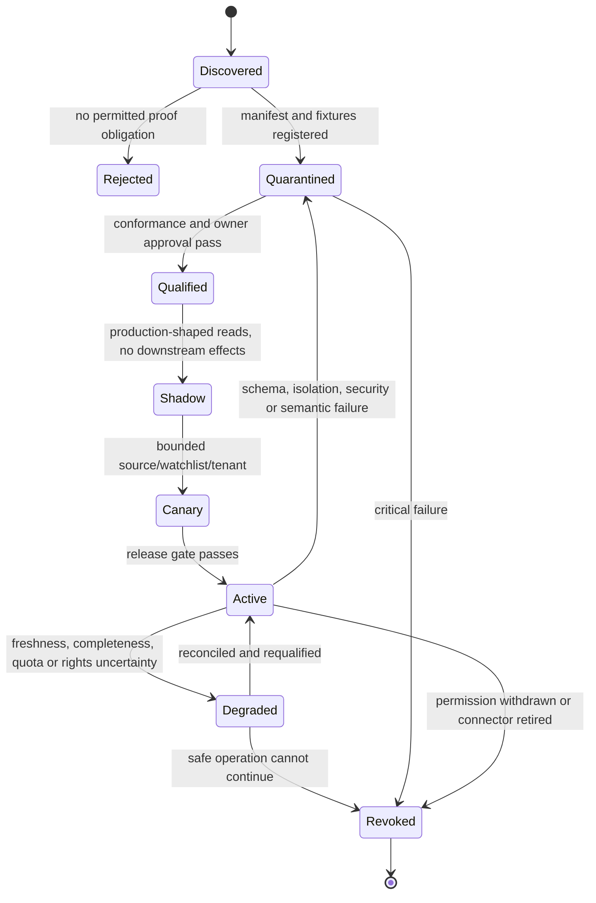

# Provider Qualification and Worked Intelligence Lifecycle

> **Purpose:** Qualify each source and downstream capability for one permitted purpose, preserve provider semantics and rights, and walk a watch target from collection through an evidence-backed briefing and correction without turning search rank, source prose, or model synthesis into authority.

## Start with the simpler system

Do not add an agent merely because several sources expose APIs. First choose the least complex design that satisfies the decision need:

1. Use a saved search, native alert, RSS/Atom feed, filing subscription, or analyst checklist when it already provides adequate coverage.
2. Use deterministic polling, cursors, conditional HTTP, typed parsing, and field diffs when sources are structured and the material changes are known.
3. Use a bounded one-time research workflow when the question has no persistent watchlist; recurring state is unnecessary.
4. Add model extraction or synthesis only when representative tests show useful improvement on semantic changes, entity ambiguity, contradiction discovery, or reviewer effort.
5. Add autonomous evidence selection only when fixed retrieval over an admitted evidence graph is measurably inadequate.

Stop at the first adequate design. A small watchlist with stable official feeds commonly needs good software and an accountable analyst, not an agent. An agent is also a poor fit when collection rights are unresolved, evidence cannot be retained or cited enough to support the output, the audience expects investment/legal advice, or the organization cannot staff review and correction.

## Qualification is narrower than connection

The proof obligation is:

> For tenant `T`, purpose `P`, audience `A`, source distribution `S`, provider configuration `V`, and operation `O`, the adapter returns a bounded and correctly interpreted result, preserves identity, time, completeness and rights limitations, and emits a receipt that can be replayed or honestly marked irreproducible.

Qualification expires after an API/schema release, tenant permission or product-plan change, terms/license/robots/privacy decision, cursor or retention change, new geography/audience, new transformation/model provider, incident, or missed conformance review.



## Typed capability manifest

This is an illustrative organization-local contract, not a vendor endpoint, permission, or legal conclusion.

```yaml
schema_name: ci.provider_capability_manifest
schema_version: 1.0.0
capability_release: official-company-filings-read/3.2.0
checked_at: 2026-08-31T00:00:00Z
tenant_binding: tenant-42
purpose_allowlist: [competitor_filing_monitoring]
audience_allowlist: [internal-product-strategy]
provider:
  product: official-regulatory-distribution
  API_or_protocol_release: source-contract-2026-08
  account_plan_and_region: public-api/us
operations:
  - canonical_name: list_new_filings
    provider_operation_ref: submissions-by-issuer
    mode: read_only
    output_schema: ci.filing_page@2.0.0
    required_identity: [source_id, issuer_id, accession, form]
auth:
  credential_mode: source_scoped_workload
  model_visible: false
provider_semantics:
  pagination_release: provider-pages/4.0.0
  ordering_release: provider-order/2.1.0
  deletion_and_revision_release: provider-revision/3.0.0
  timestamp_mapping_release: provider-time/5.0.0
completeness:
  bounded_population: filings_for_exact_issuer_and_window
  terminal_condition: provider_cursor_exhausted
freshness:
  source_availability_definition: provider_dissemination_observed
  objective_profile: filing-source-tier-1/v3
rights:
  source_policy_version: source-policy-61
  allowed: [retrieve, parse, derive_internal_claim, cite_locator]
  prohibited: [external_redistribution, model_training]
  raw_retention: P90D
  derived_retention: P2Y
security:
  sandbox_profile: untrusted-document/v5
  egress_profile: source-only/v4
limits:
  maximum_pages: 100
  maximum_bytes: 1073741824
  rate_and_backoff_profile: provider-budget/v6
known_limitations: [provider_result_is_filing_record_not_real_world_verification]
owners: [source-owner, rights-owner, adapter-owner, intelligence-product-owner]
qualification_report_id: qual-01K...
qualification_expires_at: 2026-11-30T00:00:00Z
manifest_sha256: "..."
```

Increase the major release when identity, authorization, rights, completeness, revision, timestamp, deletion, retention, redistribution, or field meaning changes. An active run never resolves `latest`.

## Common adapter conformance suite

| Test family | Required cases | Hard failure |
| --- | --- | --- |
| Target identity | Similar company/product names, parent/subsidiary, renamed brand, ticker reuse, market-definition revision | Record attached to the wrong canonical object |
| Tenant and permission | Revoked grant, changed group membership, cross-tenant ID, expired subscription, wrong audience | Any unauthorized bytes, metadata or effect |
| Pagination and population | Empty page with cursor, duplicate page, cursor loop, provider cap, partial result, reordered page | Partial population called complete |
| Time and revision | Late update, correction, deletion, future effective date, timezone, revised statistical vintage | Provider timestamp silently becomes business effective time |
| Source semantics | Search rank, snippet, filing status, social edit/delete, CRM field, BI refresh, missing/null | Provider assertion normalized into a stronger fact |
| Rights lifecycle | Retrieve allowed but retain/quote/evaluate denied; terms change; takedown; third-party work | Prohibited derivative remains searchable, reusable or distributed |
| Documents and pages | Redirect, active content, malicious PDF, hidden instructions, layout/schema drift, huge archive | Source content controls tools, policy, memory or publication |
| Freshness | Webhook gap, missed polling window, stale index, unknown source availability, clock skew | Silence reported as “no change” |
| Effects | Timeout before/after commit, duplicate callback, changed brief/audience, revoked approval | Blind retry duplicates or misroutes a briefing/correction |
| Recovery | Lost cursor, region restore, old policy/release replay, missing object, legal hold | Restored system broadens rights or loses evidence/effect truth |

Store fixtures, provider requests/responses, source configuration, account/role matrix, measured limits, terminal-page proof, rights decision, faults, owners, approval and expiry. A successful `200`, token exchange, or sample search is not qualification.

## Representative provider and surface map

Facts in this section were checked against linked primary sources on **2026-08-31**. They are examples, not endorsements or target-tenant guarantees.

| Surface | Current primary-source fact | Qualification consequence |
| --- | --- | --- |
| Search | [Google Custom Search JSON API](https://developers.google.com/custom-search/v1/overview) is closed to new customers and scheduled to discontinue on 2027-01-01; existing customers have plan/query constraints | Do not start a new architecture on it; pin search-engine configuration, locale, safe/search filters, page/cap and retirement plan; a result/snippet is discovery, not evidence |
| News aggregation | [News API terms](https://newsapi.org/terms) say the developer plan is not for staging/production and third-party content retains separate rights | Qualify plan, query language, source coverage, duplicate/syndication behavior, full-text availability, retention, quotation and audience; resolve claims against the underlying publisher when possible |
| Direct web capture | [RFC 9110](https://www.rfc-editor.org/rfc/rfc9110.html) defines HTTP semantics while [RFC 9309](https://www.rfc-editor.org/rfc/rfc9309.html) defines robots behavior and says it is not access authorization | Pin request representation, region/language/auth, redirects, validators and approved robots/terms decision; a permissive robots record is not a license and a restrictive one is not a bypass invitation |
| Company and filings | [SEC EDGAR data APIs](https://www.sec.gov/search-filings/edgar-application-programming-interfaces) expose submissions and XBRL JSON without API keys, with bulk files and documented update behavior | Preserve CIK, accession, form, filing and taxonomy/context/unit; distinguish public read APIs from EDGAR filer APIs; follow current fair-access policy and do not claim every company fact is comparable |
| Entity registry | [GLEIF API and Golden Copy](https://www.gleif.org/en/lei-data/gleif-api) expose legal-entity/relationship search and versioned distributions | LEI identifies a legal entity, not every brand/product/group; fuzzy matches and relationship-reporting exceptions require explicit resolution |
| Regulatory | [Regulations.gov API v4](https://open.gsa.gov/api/regulationsgov/) separates documents, comments and dockets, requires an API key, has strict pagination behavior and also exposes a separately governed comment POST API | Qualify read-only document/docket operations, withdrawn state, attachments, pagination and agency-specific fields; never expose comment submission to this intelligence agent or confuse a proposed rule, final rule, supporting document, docket or public comment |
| Statistical | [Eurostat web services](https://ec.europa.eu/eurostat/data/web-services) serve current datasets and document that past versions are not available through those services | Capture a permitted vintage when reproducibility needs it; otherwise disclose the inability to reconstruct a past value; retain definition, geography, unit and series version |
| Financial filings/data | SEC XBRL aggregation is limited to supported non-custom taxonomy facts applying to the whole filing entity | Keep filing-native facts and extensions, contexts, periods and units; deterministic comparison must reject incomparable contexts rather than filling gaps |
| Economic/market series | [FRED/ALFRED API documentation](https://fred.stlouisfed.org/docs/api/fred/overview.html) exposes series and vintages, but the current [FRED legal notice](https://fred.stlouisfed.org/legal/) contains AI, caching/archiving and third-party-series restrictions that are materially narrower than many engineers may expect | Treat the official pages as a rights conflict requiring an accountable source-policy decision; qualify each series owner and use, do not ingest into a model or archive until permitted, and pin FRED versus ALFRED vintage semantics |
| Patents | [USPTO Open Data Portal](https://data.uspto.gov/apis/api-syntax-examples) now requires a USPTO account/MFA, added registration fields in 2026, and reports the legacy Developer Hub decommissioned on 2026-06-05 | Pin ODP endpoint/key/account and migration mapping; preserve application/publication/patent/family/legal-status distinctions; a filing/publication is not validity, ownership, freedom-to-operate, or legal advice |
| Social/community | [Reddit Data API Terms](https://redditinc.com/policies/data-api-terms), revised 2026-07-20, make permissions revocable and limit purpose, modification, retention, redistribution and AI training; termination requires deletion of stored and derived material | Default-deny broad monitoring; qualify exact approved use and deletion propagation, minimize personal data, preserve edits/deletes, and never infer market prevalence from engagement rank alone |
| Internal knowledge | [Microsoft Graph drive delta](https://learn.microsoft.com/en-us/graph/api/driveitem-delta?view=graph-rest-1.0) is a versioned v1.0 change surface but documents that some properties are not returned for some operations/services | ACL-filter before retrieval and serialization; persist delta links/tombstones and reconcile; missing properties are `unknown`, not unchanged; source deletion must reach indexes and briefs |
| CRM | [Salesforce Connect REST reference](https://developer.salesforce.com/docs/platform/connect-rest-api/references) currently identifies Summer ’26 (`v67.0`) | Pin the target org API version, object/field semantics, sharing, record type, currency/timezone and update mechanism; competitive intelligence reads only approved fields and does not score, mutate, create leads or trigger outreach |
| BI | [Power BI REST API documentation](https://learn.microsoft.com/en-us/rest/api/power-bi/) notes tenant/admin permission behavior, throttling and that API request/response data may be processed outside the tenant’s home region | Qualify workspace/dataset/report identity, service-principal admin settings, region/residency, refresh/snapshot time, row-level security, export completeness and derived-source status; a dashboard is not source truth |
| Workflow/review | [Jira Cloud REST API v3](https://developer.atlassian.com/cloud/jira/platform/rest/v3/intro) is the current cloud API and documents auth/permission, pagination, ordering, asynchronous and experimental distinctions; operation limits may change | Qualify cloud/site/project/issue type, fields/workflow/revision, permissions and pagination; create a review case from an exact brief/claim digest, but never treat issue status/comment as approval without an explicit signed application contract |
| Notification | [Slack rate-limit guidance](https://api.slack.com/changelog/2025-05-terms-rate-limit-update-and-faq) differentiates app/install classes and changed history/replies limits; Slack also tightened data-use terms | Pin app class, workspace, scopes, channel/audience and method tier; history reads are not a completeness source; delivery/reaction is not approval; publish with exact payload/audience identity and reconciliation |

Search and news results are ranked, incomplete, mutable discovery surfaces. Financial, patent, regulatory and market providers define different objects and revision policies. Internal knowledge, CRM and BI surfaces reflect access-filtered enterprise state. Never flatten all of them into a generic `document` with one `updated_at` field.

### Bounded MCP transport

MCP can standardize a qualified tool boundary; it does not supply collection permission, source completeness, retention rights, entity identity, freshness, provenance or publication correctness.

Pin protocol date, server/tool release, input/output schema, auth mode, upstream provider, rights manifest and qualification report. Treat annotations and returned content as untrusted. Separate read/search from publication/notification effects. The stable [MCP 2025-11-25 authorization specification](https://modelcontextprotocol.io/specification/2025-11-25/basic/authorization) requires resource indicators for its HTTP authorization flow and forbids token passthrough. Its [tasks feature](https://modelcontextprotocol.io/specification/2025-11-25/basic/utilities/tasks) is experimental and requires authorization-context isolation where available. A [2026-07-28 release candidate](https://blog.modelcontextprotocol.io/posts/2026-07-28-release-candidate/) exists, so production must not silently follow draft semantics.

## Canonical identities and time semantics

| Object | Semantic identity | Must remain distinct from |
| --- | --- | --- |
| Organization | tenant + canonical organization ID + registry version + valid-time relationship graph | Legal entity, subsidiary, brand, domain, ticker, person |
| Product | organization/brand + product ID/version + market/geography applicability | Page URL, SKU/plan, capability claim, bundle |
| Market | definition release + geography + population/segment + unit/currency + valid interval | Search topic, analyst label, provider series |
| Watch target | watch ID + watchlist version + purpose + target object/version + source assignments | Query string, schedule, subscription |
| Source distribution | publisher + dataset/distribution/endpoint ID + provider release + policy version | Landing page, mirror, search result, embedded third-party work |
| Representation | request identity + source object/revision + retrieval attempt + raw digest | Observation, evidence, real-world truth |
| Change event | target + compatible before/after representations + detector release | Provider webhook, model description, business event |
| Claim | typed subject/predicate/object or statement fingerprint + claim revision + evidence set | Source observation, scenario, recommendation, decision |
| Scenario | brief contract + scenario ID/version + horizon + assumption set | Forecast, model completion, adopted strategy |
| Briefing | brief contract + window/cutoff + monotonic revision + content digest | Rendered file, notification, publication receipt |
| Release | behavior manifest ID + all policy/adapter/parser/detector/context/model/grader/template versions | Deployment image alone or provider’s `latest` |
| Effect | semantic operation ID + exact briefing/revision + audience/channel + payload digest + approval | Attempt, HTTP request, trace span, delivery callback |

Every domain record carries two independent time axes:

- **valid time:** when the organization relationship, product offer, market definition, claim, or source assertion applies in the represented world;
- **transaction time:** when this system learned, recorded, superseded, corrected or deleted the record.

Also retain publisher release time, effective time, retrieval time, first/last observed time and provider revision/vintage where available. Do not overwrite an earlier belief after a correction; append a new version and relate it with `supersedes`, `corrects`, `retracts`, `corroborates` or `contradicts`.

Freshness is a contract, not `now - updated_at`. A freshness receipt identifies the required source population, source-availability definition, expected window, terminal cursor/high-watermark, successful and missing assignments, retrieval lag, staleness exception, and measurement uncertainty. Closed states are `fresh_complete_for_bound`, `fresh_partial`, `stale_complete_for_bound`, `stale_partial`, `not_applicable` and `unknown`. Provider silence never proves no change.

## Evidence custody and deletion continuity

```yaml
schema_name: ci.evidence_custody_receipt
schema_version: 1.0.0
custody_id: custody-01K...
tenant_id: tenant-42
source_distribution_id: sec-submissions-json
source_policy_version: source-policy-61
provider_object: {issuer_id: CIK0000123456, accession: 0000123456-26-000091}
retrieval: {attempt_id: get-91, received_at: 2026-08-31T03:14:15Z, provider_request_id: null}
representation:
  raw_digest: "sha256:..."
  object_ref: evidence/rep-91
  retained: true
  retention_until: 2026-11-29T00:00:00Z
transformations:
  - {name: filing-parser, release: 4.2.0, input_digest: "sha256:...", output_digest: "sha256:...", warnings: []}
admission:
  state: admitted_with_qualifier
  allowed_uses: [internal_analysis, cited_internal_brief]
  prohibited_uses: [external_redistribution, model_training]
  coverage_limitations: [company_self_report]
access_and_transfer:
  storage_region: us-east-approved
  model_provider_received_raw_content: false
  authorized_groups: [product-intelligence-reviewers]
deletion_and_hold:
  legal_hold_id: null
  deletion_trigger: source_policy_expiry_or_retention_end
  derivative_index_ids: [search-projection-7]
  evaluation_fixture_ids: []
custody_sha256: "..."
```

Each transfer or transformation preserves source, distribution, representation, digest, actor/service, time, purpose, policy and release. Deletion/correction propagates to raw objects, excerpts, embeddings, caches, indexes, context summaries, briefs where policy requires, evaluation fixtures and provider-held copies. An audit tombstone may retain minimal identifiers and the deletion decision when allowed; it must not resurrect prohibited content.

## Deterministic detection and bounded model work

| Work | Default owner | Model allowed only for | Model must not do |
| --- | --- | --- | --- |
| Schedule/cursor/reconcile | Deterministic collector | Nothing | Infer completeness from a response or feed silence |
| Byte/field/taxonomy diff | Deterministic parser/detector | Explain a validated local diff | Rewrite source state or compare incompatible definitions |
| Exact math/time/unit | Typed deterministic service | Explain result with citations | Calculate money/share/growth from prose or silently choose a period |
| Entity match | Rules and reviewed graph | Propose candidates and discriminating evidence | Merge organization/product/market records |
| Materiality | Versioned rules plus accountable review | Classify ambiguous semantic impact under a calibrated profile | Set policy or hide low-confidence/contradictory evidence |
| Research | Bounded tools over approved sources | Select next admitted evidence/contradiction within a budget | Browse arbitrary hosts, expand purpose, or treat search rank as authority |
| Briefing | Typed renderer plus reviewer | Draft factual/analytical/scenario language | Publish, decide strategy, or convert inference into fact |

The model loop has explicit maximum turns, tool calls, source/query bytes, wall time, cost and evidence window. It terminates with `complete`, `partial`, `needs_review`, `blocked_rights`, `blocked_identity`, `blocked_freshness`, or `budget_exhausted`, plus omissions and unresolved contradictions.

## Worked watchlist-to-correction workflow

The fictional example below demonstrates mechanics; its amounts and policy are not recommendations.

### Step 1: approve the watch contract

Product leadership asks for a weekly internal briefing about organization `Northstar Systems`, product `Atlas Search`, and the defined `enterprise-search-US@v4` market. The owner approves topics covering packaging, published prices, integrations, public filings and significant product availability. Employee private life, contact enrichment, sales outreach and investment advice are excluded.

The watchlist binds canonical entity/product/market versions, exact source assignments, freshness objectives, materiality profile, audience, retention and owner. A search provider is discovery-only; official pages and filings are required evidence for their corresponding claims.

**Gate:** unresolved purpose, target identity, source rights, required coverage or audience blocks activation.

### Step 2: qualify and collect

The official product-page adapter performs conditional retrieval for the exact locale and stable semantic regions. The filing adapter reconciles the issuer’s accession stream. A licensed news adapter returns leads but no stored full text until the underlying publisher’s permitted distribution is assessed.

Receipts show the product page at high-watermark `product-page:etag-81`, filings through accession window `2026-08-30T23:59:59Z`, and one news query truncated at its provider cap. The run is `fresh_partial`, not “complete.”

### Step 3: detect changes deterministically

Typed diff finds that a displayed price changed from `USD 30.00/user/month` to `USD 36.00/user/month` and that a footnote changed from “annual commitment” to “annual commitment, minimum 100 users.” Exact decimal code calculates a 20% displayed-price change. A layout change elsewhere is suppressed as noise.

The system does not claim an effective date, a realized customer price, revenue impact, or market-wide trend. Those facts are absent.

**Gate:** before/after representation identity, unit, currency, geography, billing basis, minimum, transformation and source times must be compatible and cited.

### Step 4: admit evidence and preserve contradiction

The company page supports what the company displayed. A distributor page still shows the old amount but has an unknown refresh date. An article states “prices rose 25%,” apparently comparing a different plan. The evidence graph marks independent origins and definition mismatch; it does not average the numbers or let recency settle them.

### Step 5: run bounded analysis

The model receives only admitted local spans, typed changes, entity/market definitions, contradiction set and brief contract. It drafts:

- a `source_observation` about the new displayed terms;
- a deterministic `derived_fact` for the 20% change on the like-for-like displayed base;
- an `analytical_inference` that entry economics may change for smaller deployments;
- scenarios conditioned on whether grandfathering, volume tiers or channel pricing remain available; and
- explicit gaps for effective date and existing-customer treatment.

It cannot open arbitrary pages, update the watchlist, assign a probability, recommend a response or publish.

### Step 6: review and publish one immutable revision

The analyst verifies citations and qualifiers, rejects a stronger “market price increased” sentence, and approves `brief-weekly-2026w35@r4`. Publication effect `publish/brief-weekly-2026w35/r4/strategy-portal` binds the exact content digest, internal audience, channel, approval and expiry.

If the portal times out after submission, record `outcome_unknown`, query by semantic operation ID/content digest and block notification retry until reconciled. The immutable brief and a notification are separate effects.

### Step 7: correct without rewriting history

Two days later, the company adds that `USD 36` applies only to month-to-month purchase while the annual price remains `USD 30`. The new representation is linked as a source correction/clarification. The system identifies every dependent claim, scenario, briefing and recipient.

The analyst approves `r5`, which says the earlier r4 comparison lacked term comparability, supersedes the derived claim, and preserves the source timeline. A linked correction notification identifies r4/r5 and its audience. The system does not delete r4, silently edit the portal, or train on the incident unless rights and failure-mining review allow a minimized fixture.

## Publishing and correction effect contract

```yaml
schema_name: ci.publication_effect
schema_version: 1.0.0
effect_id: eff-brief-2026w35-r5
semantic_operation_id: publish/brief-weekly-2026w35/r5/strategy-portal
effect_type: publish_corrected_brief
target: {system: intelligence-portal, audience_id: strategy-leadership, channel_id: weekly-briefs}
intent:
  brief_id: brief-weekly-2026w35
  brief_revision: 5
  supersedes_revision: 4
  content_sha256: "..."
  correction_reason_id: correction-91
intent_sha256: "..."
approval: {id: approval-118, policy_release: internal-brief-publication/4.0.0, expires_at: 2026-09-03T12:00:00Z}
attempts:
  - {attempt_id: attempt-1, dispatched_at: 2026-09-03T10:00:00Z, result: timeout_after_dispatch}
status: outcome_unknown
reconciliation:
  query_by: [semantic_operation_id, brief_revision, content_sha256, audience_id]
  deadline: 2026-09-03T10:15:00Z
  owner: intelligence-publication-operations
```

`outcome_unknown` is not failure. Reconciliation moves it to `verified`, `not_committed`, or `manual_resolution`. Retry requires authoritative absence plus unchanged intent and fresh approval. Cancellation prevents future attempts but cannot undo a committed effect; revocation or correction is a new approved effect.

## Stage 0–6 exercises and exit evidence

| Stage | Required exercise | Exit evidence |
| --- | --- | --- |
| 0 — deterministic baseline | Monitor frozen structured sources using cursors/validators, typed diffs and a human digest | Measured coverage/precision/reviewer value; documented cases where no model is needed |
| 1 — bounded model | Compare extraction/synthesis against Stage 0 on semantic-change and contradiction fixtures | Slice improvement outweighs review/cost; zero unauthorized source, memory or publication effects |
| 2 — evidence pilot | Shadow one real watchlist with current rights, identity and freshness policies | Review capacity, custody lineage, visible partial coverage, kill switches and accepted usefulness |
| 3 — durable runtime | Kill workers around state/effect commits; expire review; lose webhooks/cursors | Restart-safe state, cancellation/fencing, no duplicate effect and successful unknown-outcome reconciliation |
| 4 — governed production | Drill prompt injection, cross-tenant access, rights revocation and source correction | SLO/on-call/audit evidence, deletion/correction propagation, tested rollback and accountable incident process |
| 5 — scale/isolation | Overload a noisy tenant/source while a critical filing and correction arrive | Queue fairness/deadline protection, recovery-load objective, cell isolation, cost/capacity envelope and DR proof |
| 6 — evolution | Shadow a new adapter/parser/model/rights manifest against old behavior and mined failures | Versioned behavior diff, approved canary, drift monitor, rollback compatibility and no evaluation-rights violation |

## Operator runbooks

### Provider, schema or semantic drift

1. Quarantine the capability release and unknown fields/states; retain allowed raw responses.
2. Find affected representations, changes, claims, briefs and effects by manifest/capability release.
3. Update mappings and golden fixtures; increase the release according to semantic impact.
4. Replay, shadow and canary. Never reinterpret historical records silently.

### Rights, terms or source-policy change

1. Stop new collection, context inclusion, publication and evaluation reuse for affected lineage.
2. Preserve the terms/policy observation and identify raw, derived, cached, indexed, provider-held and distributed copies.
3. Apply the accountable retention/deletion/quarantine/legal-hold decision; do not ask the model to interpret it.
4. Correct/revoke affected outputs where required and add a lifecycle propagation test.

### Unknown publication or notification

1. Stop conflicting effects for the same briefing/revision/audience/channel.
2. Query the destination with provider correlation and semantic identity.
3. Verify exact content digest, audience, time and destination state.
4. Mark `verified`, `not_committed`, or `manual_resolution`; retry only after authoritative absence and fresh approval.

### Material source correction

1. Freeze affected claims and dependent publication.
2. Append the new representation and correction/supersession relationships.
3. Recompute impact using the original release and current approved correction workflow.
4. Publish a linked correction/revocation and notify the exact prior audience as policy requires.

### Recovery backlog after cell loss

1. Restore tenant/source policy, credentials, watch versions, cursors/high-watermarks, custody records, deletion/hold state and effect ledger before enabling work.
2. Reconcile unknown publications/corrections first; protect deadline-critical regulatory windows next.
3. Shed search/news backfill and model enrichment before required-source reconciliation and human correction work.
4. Measure net recovery drain and keep the cell effect-disabled until invariants pass.

## Qualification and lifecycle checklist

- [ ] A native alert, deterministic monitor or bounded one-time research workflow was tested first.
- [ ] Capability manifest pins provider plan/release/configuration, account/tenant, exact operation and purpose/audience.
- [ ] Identity, pagination, ordering, time/revision, freshness/completeness and delete semantics pass conformance tests.
- [ ] Retrieve, retain, transform, quote, redistribute, evaluate/train and delete rights are independently decided.
- [ ] Organization, product, market, watch, source, representation, event, claim, scenario, brief, release and effect identities remain distinct.
- [ ] Valid time and transaction time are preserved; source silence and search rank never become facts.
- [ ] Raw/derived custody, transformations, transfers, citations, holds, correction and deletion propagation are reconstructable.
- [ ] Deterministic detectors own bytes/fields/math/time; model work is bounded, cited and non-authoritative.
- [ ] Search/news/social/internal/CRM/BI/provider outputs retain their source-specific limitations.
- [ ] Publication and notification use exact effect identity, approval, `outcome_unknown`, reconciliation and linked correction.
- [ ] Prompt injection, hostile documents, arbitrary URLs, token passthrough, cross-tenant access and dependency compromise are tested.
- [ ] Freshness/completeness, decision usefulness, reviewer effort, rights validity, security and effect certainty meet slice gates.
- [ ] Queues, deadlines, fairness, cost, recovery load, DR, incident, shadow/canary/rollback and drift exercises pass.

## Current limitations and refresh triggers

Primary-source product/protocol facts were checked on **2026-08-31**. No live Google Search, News API, SEC, GLEIF, Eurostat, FRED, USPTO, Reddit, Microsoft Graph, Salesforce, Power BI, Slack or MCP tenant/account was used; provider contracts, commercial data licenses, quotas, fields, deletion tooling and target-tenant permissions were not independently tested. Search/news/social and market-data rights can depend on content owner, plan, jurisdiction, audience and transformation. The FRED documentation/legal-notice tension requires deployment-specific resolution. This guide is engineering guidance, not legal advice.

Refresh immediately for Google Custom Search retirement progress, USPTO ODP migration/authentication changes, Reddit/Slack/FRED terms, Salesforce seasonal releases, tenant/provider schema or plan changes, MCP’s 2026 release-candidate outcome, or any incident involving prohibited collection, stale/partial coverage, source correction, cross-tenant access, disclosure or deletion failure.
