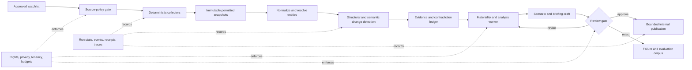

# Competitive and Market Intelligence Agent Blueprint

> Status: Pass 2 research-backed production blueprint  
> Last researched: 2026-08-31  
> Scope: entity/watchlist state, permitted public-source monitoring, evidence-backed change detection, market analysis, conditional scenarios, and executive briefing

A competitive and market intelligence agent converts permitted public information into a reviewable stream of material changes and decision-ready briefs. Its hard problem is not summarization. It is preserving identity, time, provenance, source rights, uncertainty, and contradictions while sources change independently and an organization expects both freshness and restraint.

This blueprint starts with a deterministic monitoring baseline and develops it through seven maturity stages. It deliberately keeps strategy, material claim approval, source-rights judgments, and consequential distribution under human or deterministic policy authority. The model may classify, compare, explain, and draft; it never decides what the organization should do or grants itself permission to collect data.

## The product in one sentence

Given an approved watchlist and source policy, detect relevant changes, preserve the evidence and its usage constraints, explain what changed and why it may matter, and produce an auditable briefing whose facts, inferences, scenarios, and unresolved conflicts are visibly separated.

## Reference flow

The snapshot store is not permission to retain or redistribute everything fetched. Retention, transformation, quotation, audience, and evaluation reuse remain constrained by the source-policy record. When retention is not permitted, store the minimum lawful metadata and derived evidence necessary for the approved purpose.

## Blueprint map

| Guide | Question answered |
|---|---|
| [Mission, boundary, and requirements](01-mission-boundary-and-requirements.md) | What is the agent for, what is explicitly outside it, and what must be true before collection starts? |
| [Reference architecture and runtime](02-reference-architecture-and-runtime.md) | What components, contracts, authority boundaries, and deployment shapes implement it? |
| [Entities, watchlists, sources, and rights](03-entities-watchlists-sources-and-rights.md) | How are organizations and products identified, and how is permitted use evaluated at every lifecycle stage? |
| [Change detection, evidence, and provenance](04-change-detection-evidence-and-provenance.md) | How are snapshots, changes, citations, duplicates, time, and contradictions represented? |
| [Analysis, scenarios, and briefings](05-analysis-scenarios-and-briefings.md) | How does the system distinguish facts from inference and make uncertainty useful without pretending to decide strategy? |
| [State, context, memory, and orchestration](06-state-context-memory-and-orchestration.md) | What state is authoritative, what context reaches the model, and when are durable workflows or multiple workers justified? |
| [Security, privacy, and governance](07-security-privacy-and-governance.md) | How are prompt injection, source abuse, personal-data risk, cross-tenant exposure, and excessive agency contained? |
| [Reliability, observability, evaluation, and incidents](08-reliability-observability-evaluation-and-incidents.md) | What is measured, tested, released, and operated when sources or models fail? |
| [Deployment, scale, cost, and maturity roadmap](09-deployment-scale-cost-and-roadmap.md) | How does the design grow from a no-agent baseline to a governed production service without premature complexity? |
| [Provider qualification and worked intelligence lifecycle](10-provider-qualification-and-worked-intelligence-lifecycle.md) | How are real provider capabilities qualified, and how does one watch move through evidence, publication, and correction? |

The companion [evidence packet](../../research/packets/competitive-market-intelligence-agent-blueprint.md) records source quality, contested claims, maturity drift, benchmark limits, and promotion decisions. Canonical cross-cutting contracts remain authoritative: [state and events](../../runtime/agent-state-and-event-contracts.md), [durable execution](../../runtime/durable-execution.md), [tool design](../../tools/README.md), [context and memory](../../context-memory/README.md), [security](../../security/README.md), [reliability](../../reliability/README.md), [evaluation](../../evaluation/README.md), and [operations](../../operations/README.md).

## Workload boundary

This category owns recurring, entity-centered intelligence from approved public sources:

- legal entities, brands, products, markets, topics, and source watchlists;
- permitted filings, registries, official releases, feeds, statistics, public product pages, and other policy-approved sources;
- byte, structure, data, and meaning-level change detection;
- entity resolution, temporal normalization, units, definitions, evidence lineage, source independence, and contradiction handling;
- materiality triage, market evidence, scenario comparison, freshness, and executive briefing;
- an evidence ledger and controlled internal publication lifecycle.

It does not own:

- a question-bounded investigation with no persistent watchlist; that belongs to the [deep research agent](../deep-research-agent/README.md);
- CRM state, lead scoring, outreach, account planning, or commercial execution; that belongs to the [sales and revenue operations agent](../sales-revenue-operations-agent/README.md);
- unrestricted internal enterprise search; that belongs to the [enterprise knowledge agent](../enterprise-knowledge-agent/README.md);
- portfolio management, securities recommendations, trading, legal opinions, covert collection, paywall or access-control bypass, impersonation, pretexting, or personal surveillance;
- strategy decisions, public statements, or irreversible external actions.

A team may compose these categories, but composition does not transfer authority. For example, a competitive-intelligence brief may be an input to account planning, but it cannot silently mutate CRM fields or trigger outreach.

## Authority model

| Concern | Model may | Deterministic control or human owns |
|---|---|---|
| Source access | propose a relevant approved connector | credentials, terms, robots policy, license, purpose, rate limits, jurisdiction, retention, and allow/deny decision |
| Entity identity | suggest candidate matches with reasons | canonical merge, split, and ambiguous-identity disposition |
| Change detection | label and explain a deterministic diff | snapshot integrity, deduplication, timestamps, materiality thresholds, and detector version |
| Evidence | extract a claim and supporting span | citation existence, source rights, independence, freshness, calculation checks, and evidence retention |
| Analysis | compare hypotheses and draft implications | material factual approval and strategic interpretation |
| Scenario | enumerate conditional outcomes and triggers | adopted probability, resource commitment, forecast ownership, and decision |
| Distribution | draft for a named audience | audience policy, exact content approval when required, delivery, revocation, and reconciliation |

“Model confidence” is never treated as authorization or factual reliability. Where the system displays confidence, it must say what is being estimated—such as entity-match probability, classifier calibration, or forecast probability—and show how that estimate was validated.

## Non-agent baseline

Before introducing an agent loop, implement the smallest system that can prove demand:

1. A reviewer maintains a short approved watchlist and source registry.
2. Scheduled jobs fetch official APIs, feeds, or allowlisted pages with conditional requests.
3. The system stores permitted snapshots or snapshot hashes, computes deterministic diffs, and deduplicates them.
4. Rules select changes using source type, fields, keywords, numerical thresholds, and freshness.
5. A template produces a weekly digest with direct links and an explicit “not reviewed” state.
6. A human validates entity identity, materiality, source use, and distribution.

This baseline is often enough for narrow, stable sources. Add model-assisted extraction only when representative evaluation shows a meaningful improvement in recall, normalization, semantic comparison, or reviewer time. Add autonomous tool selection only when source diversity makes a fixed flow measurably inadequate.

## Production invariants

1. **No access without a source-policy decision.** Technical reachability is not permission.
2. **No claim without an evidence path.** Every material factual sentence resolves to retained evidence or an allowed source locator plus integrity metadata.
3. **No silent conflict resolution.** Contradiction, supersession, definition drift, source duplication, and identity ambiguity are different states.
4. **No last-write-wins truth.** Recency is one factor, not an authority rule.
5. **No strategy by implication.** Briefings separate observed facts, derived metrics, analytical inferences, conditional scenarios, and human decisions.
6. **No stream-completion success.** Completion requires the domain artifact and required effect receipts, not merely an ended model response.
7. **No hidden writes.** Watchlist, memory, publication, and notification effects have policy checks, idempotency keys, and receipts.
8. **No unrestricted corpus in context.** Context is compiled from minimal, labeled, policy-compatible evidence.
9. **No cross-tenant reuse by convenience.** Snapshots, indexes, caches, traces, and evaluations preserve tenant and rights boundaries.
10. **No release by average score alone.** Rights bypass, cross-tenant exposure, fabricated support, and unauthorized publication are hard-stop failures.

## Definition of a useful brief

A brief is useful only if a reviewer can answer, without reconstructing the run:

- Which entities, markets, time window, and questions were in scope?
- What materially changed, according to which sources and versions?
- Which statements are observations, calculations, inferences, scenarios, or decisions?
- Are sources independent, current enough, permitted for this use, and internally consistent?
- What is missing, disputed, ambiguous, stale, or outside coverage?
- Which assumptions produce each scenario, and which future signals would strengthen or invalidate it?
- Who reviewed the material claims and publication, and what exact revision was delivered?

If any of these cannot be recovered from the artifact and its ledger, the run is incomplete even when the prose reads well.

## Recommended implementation stance

- Use the organization's existing production language unless a verified parser or analytics need justifies another runtime.
- Keep orchestration, state, and policy in application-owned code. Agent frameworks are optional implementation helpers, not authorities.
- Prefer deterministic adapters, parsers, entity keys, hashes, calculators, and templates around a bounded analysis worker.
- Adopt a durable workflow runtime when schedules, human waits, retries, cancellation, or effect ambiguity must survive process loss.
- Keep one analytical agent by default. Scale independent collection and parsing workers before introducing collaborating agents.
- Store raw source content only when policy permits and the operational value exceeds the legal, privacy, and security burden.
- Pin every behavior-bearing component in a release manifest and replay frozen, permitted fixtures before upgrades.

## Reading path

For a first implementation, read guides 01 through 05, implement Stage 0 and Stage 1 from guide 09, then use guides 06 through 08 as the production gates. Before connecting a real provider or enabling publication, complete guide 10's qualification and worked-lifecycle exercises. For an existing system, start with the invariants above and the maturity-stage exit criteria; missing evidence, rights, recovery, or evaluation contracts are higher priority than adding new analysis features.
