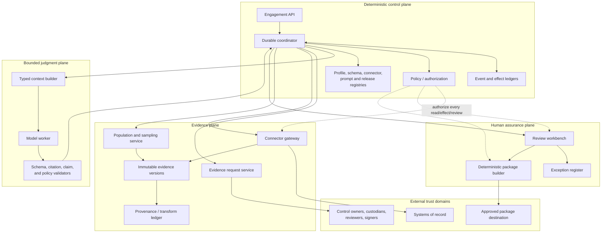

# Reference Architecture, Runtime, and Authority

> **Purpose:** Put durable workflow, evidence identity, authorization, review, and effects outside the model while preserving a narrow place for semantic judgment.

## Architecture decision

Use a conventional application with a durable engagement coordinator and a stateless, bounded model worker. Do not give a free-running agent direct database, vault, identity, or connector credentials. The coordinator invokes typed capabilities through policy-enforced gateways and records every accepted proposal, decision, transition, and effect.



## Component ownership

| Component | Owns | Must not own |
| --- | --- | --- |
| Engagement API | authenticated commands, optimistic version, request identity | state transition by itself |
| Durable coordinator | lifecycle, timers, assignments, retries, cancellation, transition invariants | evidence bytes, professional conclusion |
| Policy service | subject/tenant/purpose/resource/effect authorization and SoD | model-generated permissions |
| Release/profile registries | immutable version identity and compatibility | silent “latest” resolution for active work |
| Context builder | minimal typed projection for one task | authoritative state or unrestricted retrieval |
| Model worker | extraction, comparison, classification, question/narrative drafts | state transitions, credentials, sampling, effects, final conclusions |
| Validator | schema, citation existence, allowed claim types, budgets | semantic acceptance of audit evidence |
| Request service | request state, correspondence templates, due dates, reminders | evidence acceptance or control conclusion |
| Connector gateway | approved reads, source receipts, watermarks, pagination, rate limits | interpreting a source label as compliance |
| Evidence vault | immutable raw/derived versions, digests, encryption, retention state | declaring authenticity beyond recorded checks |
| Provenance ledger | acquisition and transformation lineage | replacing raw evidence with a summary |
| Sampling service | frozen population snapshot and approved deterministic selection | choosing risk/materiality/method/sample size |
| Review workbench | decision surface and authorized reviewer actions | bypassing independence conflicts |
| Exception register | durable exception/remediation/retest lifecycle | silently editing an accepted workpaper |
| Package builder | deterministic selection, rendering, index, manifest, signing request | attestation, report opinion, or evidence invention |
| Effect ledger | semantic operation identity, attempts, receipts, unknown/reconciled state | assuming timeout means failure |

## Runtime rule: model output is a proposal

The worker returns a discriminated union; it does not call tools directly and does not emit arbitrary workflow commands.

```json
{
  "proposal_id": "prop_01K...",
  "engagement_id": "eng_fy26_soc2",
  "task_id": "task_toe_cc6_1_004",
  "state_version": 83,
  "proposal_type": "candidate_observation",
  "release_manifest_id": "rel_2026_08_31_4",
  "profile_ref": {
    "profile_id": "profile_soc2_org_v7",
    "digest": "sha256:..."
  },
  "inputs": [
    {"artifact_id": "ev_01K...", "version": 1, "digest": "sha256:..."},
    {"artifact_id": "ev_01M...", "version": 3, "digest": "sha256:..."}
  ],
  "claims": [
    {
      "claim": "The approval occurred after the change was merged.",
      "claim_type": "source_observation",
      "citations": [
        {"artifact_id": "ev_01K...", "locator": "json:/merged_at"},
        {"artifact_id": "ev_01M...", "locator": "json:/approval/submitted_at"}
      ]
    }
  ],
  "conflicts": [],
  "missing": ["approved timing tolerance"],
  "uncertainty": "cannot_determine_deviation_without_procedure_parameter",
  "recommended_next_action": "request_reviewer_interpretation",
  "generated_at": "2026-08-31T09:15:00Z"
}
```

Validation checks IDs, versions, digests, citation locators, profile pin, current state version, claim vocabulary, data-class rules, and output size. It does **not** turn a well-formed proposal into an accepted finding. Only an authorized decision does that.

## Command, state, event, decision, and effect contracts

Follow the repository’s [agent state and event contracts](../../runtime/agent-state-and-event-contracts.md): these records answer different questions.

```yaml
command:
  command_id: cmd_01K...
  kind: request_evidence
  actor: human:tester_8
  expected_state_version: 83
  payload_ref: blob://commands/sha256/...

domain_event:
  event_id: evt_01K...
  kind: evidence_request_authorized
  aggregate_id: eng_fy26_soc2
  aggregate_version: 84
  occurred_at: 2026-08-31T09:18:00Z
  caused_by: cmd_01K...
  policy_decision_id: pdp_994

effect_intent:
  operation_id: op_evidence_request_er_007_create_v1
  effect_type: evidence_request.create
  target_ref: servicenow:requester_group/audit-evidence
  payload_digest: sha256:...
  authorization_ref: authz_331
  approval_ref: null

effect_receipt:
  attempt_id: att_01K...
  operation_id: op_evidence_request_er_007_create_v1
  status: committed
  downstream_id: sn_req_004921
  downstream_version: "7"
  observed_at: 2026-08-31T09:18:03Z
  response_digest: sha256:...

decision:
  decision_id: dec_01K...
  decision_type: evidence_acceptance
  actor: human:reviewer_12
  input_manifest_digest: sha256:...
  disposition: request_more_evidence
  rationale_ref: workpaper://wp_004/review/2
```

Never infer the domain event from a log line, or the effect receipt from an HTTP status alone.

## Trust boundaries

### 1. User and reviewer boundary

Authenticate real people with the organization’s identity provider, phishing-resistant MFA where required, session expiry, reauthentication for package freeze/delivery, and group/role claims that the policy service verifies. Do not trust UI-hidden buttons as authorization.

### 2. Workload identity boundary

Give the coordinator, connector gateway, package builder, and model worker different workload identities. The model worker needs no standing downstream credential. Connector credentials are short-lived, tenant and source scoped, and issued only after policy checks.

### 3. Evidence boundary

Treat files, tickets, logs, screenshots, repository text, cloud metadata, and evidence-request responses as untrusted data. They cannot change instructions, add tools, expand scope, or authorize effects. Content-type validation, malware isolation, size limits, decompression limits, and active-content removal occur before indexing or rendering.

### 4. Model-provider boundary

Send the minimum approved projection, not raw vault access. Pin provider endpoint/region, retention and training settings, encryption requirements, model/version policy, and incident contacts. Redact or tokenize identifiers where the task permits.

### 5. Package boundary

Package publication crosses from internal preparation to a relying party or external assurance process. It requires exact-manifest approval, commit-time authorization, destination allowlisting, integrity verification, and receipt reconciliation.

## Typed input lanes

One model call receives explicit lanes, each with an origin and trust label:

```yaml
task:
  task_id: task_toe_cc6_1_004
  permitted_output: candidate_observation
authority:
  tenant_id: tenant_acme
  engagement_id: eng_fy26_soc2
  allowed_control_ids: [CC6.1-org-01]
  prohibited_claims: [compliant, effective, certified, no_exception]
profile:
  id: profile_soc2_org_v7
  digest: sha256:...
  approved_excerpt_refs: [profile://.../control/CC6.1-org-01]
procedure:
  id: proc_toe_access_v4
  approved_parameters_ref: plan://ap_17
state:
  version: 83
  request_status: received
evidence:
  - artifact: ev_01K...@1
    trust: source_api_snapshot
    completeness: complete_for_query_not_population
review_history:
  - decision_ref: dec_01J...
    instruction: "Distinguish approval timing from approver authorization."
output_schema: candidate_observation.v3
```

The context builder resolves references under the invoking identity and records the resulting input manifest. It cannot insert an item from another tenant, profile version, engagement, or purpose.

## Effects and commit protocol

An effect moves through `proposed → authorized → reserved → dispatched → committed | rejected | unknown → reconciled`. Changed intent creates a new semantic `operation_id`; retrying the same intent reuses it.

Before dispatch, the gateway revalidates:

- tenant, engagement, actor/workload identity, and current state version;
- allowed effect type, destination, data classes, and payload digest;
- approval identity, independence, scope, expiry, and exact manifest if required;
- release/connector compatibility and current incident-mode policy;
- idempotency reservation and per-tenant/effect budgets.

After a timeout or lost worker, state becomes `effect_unknown`. Reconciliation queries the downstream source with the operation ID or a stable correlation key. The system never blindly retries an effect whose commit outcome is unknown.

## Durable versus ephemeral execution

Durable orchestration is required because requests, evidence arrival, reviewer work, legal holds, and exceptions may span months. Persist state before acknowledging commands. Reconstruct timers, open work, and context from durable records after worker loss. Do not persist a suspended model process as the source of truth.

Use synchronous execution only for bounded reads or validations that are safe to retry. Use durable activities for connector pagination, file processing, population freezing, package rendering, delivery, and reconciliation. Each activity has a deadline, heartbeat where appropriate, retry policy, and terminal `unknown` or operator-attention outcome.

See [durable execution](../../runtime/durable-execution.md), [run controls](../../runtime/run-controls.md), and [idempotency and side effects](../../reliability/idempotency-and-side-effects.md).

## Model and runtime selection

Select the smallest approved model that meets the measured task threshold. Route by task and data class:

| Task | Preferred implementation | Fallback |
| --- | --- | --- |
| Field extraction from stable JSON/CSV | Parser/schema mapping | Human correction queue |
| OCR layout extraction | Approved document/OCR service | Manual upload/indexing |
| Control-mapping proposal | Higher-reasoning model with narrow licensed context | Profile steward mapping UI |
| Evidence comparison and contradiction search | Bounded model over approved evidence set | Reviewer comparison workbench |
| Request/narrative draft | Smaller model with template and claim validator | Deterministic template |
| Sample selection, state transition, authorization, package manifest | Deterministic code | No model fallback needed |

The runtime must continue to receive evidence, preserve deadlines, accept human actions, reconcile effects, and build deterministic views while the model is unavailable. Degrade model tasks to queued/manual, not to silent acceptance.

## Deployment choices

| Pattern | Appropriate when | Required caveat |
| --- | --- | --- |
| Shared control plane with tenant-isolated stores/keys/indexes | Moderate-risk tenants with common residency | Policy, encryption, cache, queue, logging, and retrieval isolation are tested continuously |
| Cell per risk/residency group | Data residency, blast-radius, or availability requires stronger isolation | Registry compatibility and fleet upgrades become explicit operational work |
| Dedicated tenant deployment | Contractual or high-sensitivity requirement justifies cost | Still enforce internal role/identity separation; deployment isolation is not independence |
| On-prem/private model path | Source or licensed content cannot leave a boundary | Verify model/runtime capabilities and update process; do not assume local equals secure |

## Stage 1: offline replay and shadow architecture

### Authority

C0 read/index and C1 proposal only, on synthetic or explicitly approved historical projections. No production request, reminder, collection, package, or delivery effect.

### Architecture

Implement the components above at the minimum useful scale: durable state/event store, version registries, context builder, model worker, validators, evidence vault/provenance, mock/read-only connectors, review workbench, policy enforcement, and separate telemetry.

### Inputs and outputs

Inputs are frozen historical/synthetic engagement manifests and labeled reviewer decisions. Outputs are typed proposals, validation results, replayable transitions, reviewer actions in a sandbox, lineage manifests, and evaluation records. Generated results are clearly marked `shadow` and cannot enter a live package.

### State, events, and effects

Use the production schemas and lifecycle, but set `execution_mode = shadow`. Effect intents are recorded as `would_dispatch`; the gateway has no production route or credential. Replays use a new run ID and preserve original input versions.

### Approvals

Data use, profile/licensing, evaluation set, reviewer participation, and promotion thresholds require owner approval. Reviewers label without seeing model output on a blinded subset to establish a defensible baseline.

### Recovery

Restore state from events, rebuild context from references, retry pure activities, quarantine malformed evidence, and prove that worker loss or model timeout creates no external effect. Test deletion of non-held shadow data at retention expiry.

### Evaluation

- schema-validity and citation-resolution rate;
- mapping precision/coverage by relationship type;
- unsupported-claim, contradiction, and abstention behavior;
- lineage field completeness and transform reproducibility;
- illegal transition, authorization, SoD, and cross-tenant tests;
- context-compaction continuity and evidence-label preservation;
- reviewer agreement, override reasons, time, and cognitive load;
- model-free fallback and deterministic replay.

### Measurable exit gate

Stage 1 passes only when:

1. 100% of hard-control tests pass: tenant isolation, authorization, SoD, profile pinning, evidence-version pinning, prohibited claims, and no-effect shadowing;
2. every accepted proposal citation resolves to the exact artifact version and locator used at inference time;
3. every replay produces the same deterministic states, samples, manifests, and `would_dispatch` identities from the same inputs;
4. task-quality, abstention, reviewer-time, and cost thresholds approved at Stage 0 are met on representative slices, not only an aggregate;
5. recovery from injected worker, queue, connector, and model failures loses no authoritative event; and
6. reviewers confirm that the workbench supports an independent decision without relying on the transcript.

Model quality thresholds are engagement-specific; hard-control thresholds are not averaged away.

## Architecture review checklist

- [ ] The model has no direct state-store, vault, identity-provider, or downstream credential.
- [ ] Every state mutation enters through a typed command and deterministic invariant check.
- [ ] Evidence bytes and provenance cannot be overwritten by a newer collection.
- [ ] Proposal acceptance is a separate authorized decision with its own actor and timestamp.
- [ ] Side effects have semantic identities, exact payload digests, receipts, unknown state, and reconciliation.
- [ ] Trace sampling or deletion cannot change state or remove audit evidence.
- [ ] Active engagements pin the full release and profile manifest.
- [ ] A kill switch blocks new effects without depending on the model path.
- [ ] Manual collection, review, and packaging continue during model/provider outage.
