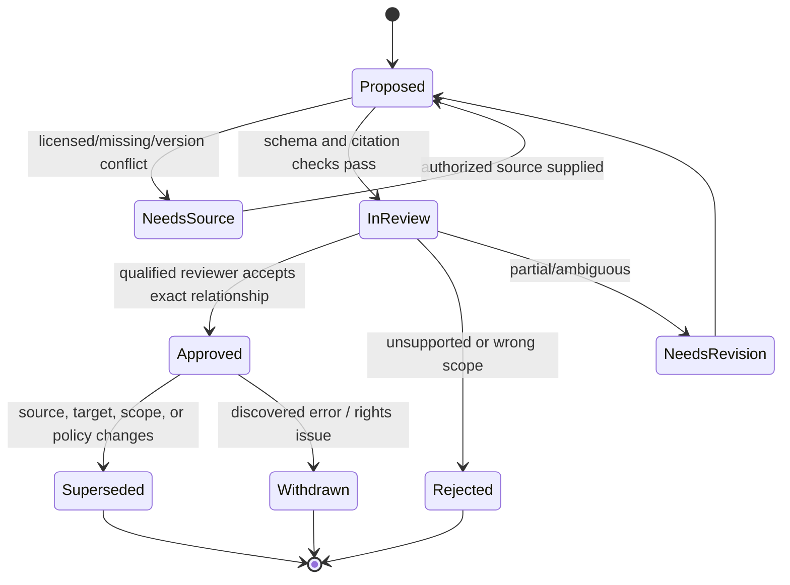

# Control Profiles, Mappings, and Change Governance

> **Purpose:** Represent authoritative criteria, organization-specific controls, assessment procedures, and cross-framework relationships without converting text similarity into legal equivalence.

## Four different objects

Do not call all of these “controls.”

| Object | Meaning | Owner |
| --- | --- | --- |
| **Source criterion** | A versioned requirement, principle, criterion, or control statement from an authoritative/licensed source | Source publisher; local profile steward records use and applicability |
| **Organization control** | The organization’s actual preventive/detective/corrective activity, owner, system, frequency, and evidence expectations | Control owner and governance process |
| **Assessment objective/procedure** | What an approved assessor will examine, interview, test, or reperform for the engagement | Engagement lead / qualified professional |
| **Mapping assertion** | A scoped relationship between two versioned objects with rationale, confidence, provenance, and approval | Profile steward / independent mapping reviewer |

A single organization control may address parts of several criteria. Several controls may jointly address one criterion. A mapping does not prove implementation, operation, sufficiency, compliance, or audit acceptance.

## Profile structure

A runtime profile is an immutable bundle created from authorized source material and organizational decisions:

```yaml
profile_id: profile_fedramp_rev5_org_v12
version: 12.0.0
status: approved
jurisdiction_and_use: "FedRAMP Rev. 5 package preparation for named service"
effective_from: 2026-07-01
effective_to: null
source_baselines:
  - publisher: NIST
    publication: SP-800-53-rev5-update1
    source_version: "Release 5.2.0"
    acquired_at: 2026-08-27T14:00:00Z
    rights: public-domain-US-government-work
  - publisher: FedRAMP
    publication: rev5-baseline
    consumer_format_version: OSCAL-1.2.2
organization_controls_digest: sha256:...
assessment_procedures_digest: sha256:...
mappings_digest: sha256:...
applicability_decisions_digest: sha256:...
approved_by:
  - human:profile_steward_42
  - human:assurance_lead_17
bundle_digest: sha256:...
```

Pin the consumer’s supported format, not only the upstream latest version. For example, upstream [OSCAL 1.2.3](https://github.com/usnistgov/OSCAL/releases/tag/v1.2.3) was released on 2026-08-07, while a consuming program may still publish examples or schemas for an earlier compatible version. Upgrade through compatibility tests rather than silently resolving `latest`.

## Mapping vocabulary

The [OSCAL control mapping model](https://pages.nist.gov/OSCAL/learn/concepts/layer/control/mapping/) supports explicit set relationships such as equivalent/equal, subset, superset, intersects, and no relationship. Use a similarly precise local vocabulary:

| Relationship | Safe interpretation | Unsafe inference |
| --- | --- | --- |
| `equal` | Approved scopes and semantics match under the named profile/version | The implementations or audit results are interchangeable |
| `subset_of` | All mapped source elements are contained in the target scope | Target evidence automatically satisfies source testing |
| `superset_of` | Source scope contains the target scope plus more | The target covers the additional elements |
| `intersects` | Some elements overlap and the overlap is named | Broad “mapped” or “covered” status |
| `no_relationship` | Reviewer found no useful scoped relationship | The domains can never relate in another profile |
| `undetermined` | Evidence, licensed text, scope, or expertise is insufficient | False or not applicable |

Avoid a boolean `mapped` field. It hides direction, partial coverage, conditions, exclusions, and uncertainty.

## Implementable mapping record

```json
{
  "$schema": "urn:example:compliance-audit:control-mapping:v2",
  "mapping_id": "map_01K9...",
  "source": {
    "object_id": "nist:sp800-53r5:AC-2",
    "version": "5.2.0",
    "parts": ["a", "b", "c"]
  },
  "target": {
    "object_id": "org:iam:lifecycle-control-04",
    "version": "7",
    "parts": ["joiner", "mover", "leaver"]
  },
  "relationship": "intersects",
  "direction": "source_to_target",
  "covered_elements": [
    {"source": "a", "target": "joiner", "condition": "workforce identities only"},
    {"source": "c", "target": "leaver", "condition": "HR-triggered termination"}
  ],
  "excluded_elements": [
    {"source": "b", "reason": "privileged service identities use separate control"}
  ],
  "rationale": "The organization control automates workforce provisioning and removal but excludes service identities.",
  "source_refs": ["profile://profile_nist_org_v12/source/AC-2"],
  "confidence": "medium",
  "status": "approved",
  "proposed_by": "model-proposal:prop_01K...",
  "reviewed_by": "human:profile_steward_42",
  "review_decision_id": "dec_map_188",
  "valid_from": "2026-07-01",
  "valid_to": null,
  "supersedes": "map_01H...",
  "created_at": "2026-06-18T10:20:00Z",
  "record_digest": "sha256:..."
}
```

The model may fill a candidate record only from version-pinned, authorized source excerpts. A human reviewer must be able to see both scoped objects, omitted portions, relationship direction, evidence, and rationale.

## Mapping workflow



An approved mapping is immutable. Correction creates a new version linked by `supersedes`; it does not rewrite the record used by an active engagement.

## Automated proposal, deterministic validation, human approval

### The model may

- retrieve likely candidate relationships from an approved profile index;
- compare specifically authorized source and target text;
- enumerate matched, omitted, conditional, and conflicting elements;
- propose the narrowest relationship type;
- draft plain-language rationale and unresolved questions;
- abstain when source access, scope, version, or expertise is missing.

### Deterministic validators must

- resolve all object IDs, versions, and part identifiers;
- ensure source content rights permit the requested use;
- reject cross-profile or cross-jurisdiction joins not allowed by policy;
- require a relationship direction and explicit exclusions for partial mappings;
- forbid cycles or incompatible active ranges where the profile disallows them;
- verify reviewer authority, independence rule, signature, and effective dates;
- calculate the mapping/bundle digest and compatibility status.

### Humans must

- determine applicability and intended use;
- decide whether specialized legal, audit, security, privacy, or industry expertise is needed;
- approve/reject the relationship and limitations;
- decide whether an engagement may rely on the map and which procedures remain necessary;
- sign profile release and change impact.

## Change governance

Trigger a profile review when any of these change:

- source publication, erratum, release, interpretation, effective date, or withdrawal;
- organization control objective, owner, system, population, frequency, automation, or evidence source;
- assessment methodology, risk rating, sample policy, materiality, assurance type, or intended users;
- connector semantics, field availability, retention, or identity model;
- applicable law, contract, regulator guidance, or licensed-content rights;
- a production exception exposes a wrong or incomplete mapping.

Use this change sequence:

1. ingest metadata and content through an authorized source process;
2. create a candidate profile version without changing active engagements;
3. calculate a semantic and structural diff;
4. route changed objects and affected mappings to named reviewers;
5. assess engagement impact: no impact, prospective only, re-test, re-open, or consult;
6. run schema, mapping, connector, evaluation, package, and migration tests;
7. approve and sign the new profile;
8. assign an effective date and compatible runtime range;
9. migrate only eligible engagements through an explicit decision;
10. preserve old versions for reconstruction and apply retention/legal-hold policy.

## Change-impact record

```yaml
change_id: pc_2026_08_27_nist_5_2
candidate_profile: profile_nist_org_v13
base_profile: profile_nist_org_v12
source_change:
  publication: NIST-SP-800-53A-r5
  old_release: "5.1.1"
  new_release: "5.2.0"
  authoritative_notice: https://csrc.nist.gov/pubs/sp/800/53/a/r5/final
affected:
  source_objects: [AC-02_ODP, CA-02]
  mappings: [map_01K9, map_01KA]
  procedures: [proc_toe_access_v4]
engagement_decisions:
  - engagement_id: eng_fy26_soc2
    disposition: keep_pinned
    rationale: "No approved mid-engagement migration; reassess at next period."
reviewers: [human:profile_steward_42, human:assurance_lead_17]
evaluation_run: eval_profile_v13_20260828
approval_status: approved_prospective
```

## Copyright and licensed material

Public availability does not imply unrestricted model use. Store source rights and allowed operations with each object. Some standards are licensed or copyrighted; an organization may be allowed to read them but not reproduce them, index them in a third-party service, or use them to train/evaluate a model.

For example, the official [ISO 19011:2026 page](https://www.iso.org/standard/19011) identifies the current edition and states usage restrictions. Use licensed content only under verified terms. Prefer stable IDs and human-authored organization overlays in model context; keep restricted full text out of prompts, embeddings, logs, evaluation corpora, and packages unless the rights owner and organizational policy permit it.

The agent must respond `source_unavailable_or_unlicensed`, not reconstruct a clause from memory.

## Current versus proposed material

Record maturity explicitly:

| Status | Runtime use |
| --- | --- |
| Final/effective authoritative publication | Eligible for a profile after applicability and rights review |
| Final but future-effective | Candidate/prospective profile; not silently active early |
| Exposure draft, RFC, pilot, preview, or proposed rule | Research and impact planning only unless an accountable owner explicitly creates a non-authoritative experimental profile |
| Withdrawn/superseded | Historical reconstruction only unless an engagement was validly pinned to it |

As of the research date, the IAASB’s revisions to ISA 330, ISA 500, and ISA 520 are [exposure drafts issued in August 2026](https://www.iaasb.org/publications/proposed-revisions-audit-evidence-risk-response-isa-330-isa-500-isa-520), not current effective requirements. FedRAMP RFCs likewise remain proposals until the program adopts them. The profile registry must not turn “newer” into “effective.”

## OSCAL use without overclaiming

OSCAL can provide machine-readable catalogs, profiles, implementation descriptions, assessment plans/results, plans of action and milestones, and mappings. See the [OSCAL model layers](https://pages.nist.gov/OSCAL/learn/concepts/layer/) and [assessment layer](https://pages.nist.gov/OSCAL/learn/concepts/layer/assessment/).

Use it when a producer and consumer agree on the model/version and validation rules. Do not assume:

- schema-valid content is substantively correct;
- a crosswalk proves equivalent assurance;
- a control implementation component proves operation;
- a result imported from another tool is independently accepted evidence;
- the latest OSCAL version is supported by the target program;
- all licensed frameworks can be lawfully converted or redistributed.

[NISTIR 8477](https://www.nist.gov/publications/mapping-relationships-between-documentary-standards-regulations-frameworks-and) and [NIST SP 1347](https://csrc.nist.gov/pubs/sp/1347/final) provide current context for documentary mappings and informative references. Treat informative relationships as navigation and analysis aids, not automatic equivalence or inheritance of conclusions.

## Mapping evaluation

Build a gold set with qualified reviewers and measure by relationship type and control family:

- candidate retrieval recall;
- approved mapping precision;
- element-level coverage and exclusion accuracy;
- direction and relationship-type accuracy;
- citation/version resolution;
- false-equality and unsupported-applicability rates;
- abstention when source/rights/scope is insufficient;
- reviewer disagreement, correction category, and time;
- drift detection after a source or organization-control change.

Any false `equal`, wrong version, wrong jurisdiction, or rights-policy bypass is a hard failure for promotion even if aggregate semantic similarity is high.

## Profile-release checklist

- [ ] Every source object has publisher, stable ID, version, effective dates, retrieval record, rights class, and digest.
- [ ] Every organization control has an owner, scope, systems, population, frequency, dependencies, and evidence expectations.
- [ ] Every mapping has direction, relationship, elements, conditions, exclusions, rationale, reviewer, and validity range.
- [ ] Applicability decisions identify the accountable human and supporting authority.
- [ ] Procedures are versioned independently from criteria and mappings.
- [ ] Consumer schema compatibility is tested; `latest` is not used at runtime.
- [ ] Licensed text is excluded from unapproved prompts, indexes, logs, corpora, and output.
- [ ] The diff, affected-engagement decision, evaluation results, approvals, and bundle digest are preserved.

## Anti-patterns

| Anti-pattern | Failure | Correction |
| --- | --- | --- |
| One universal normalized control ID | Erases source meaning, versions, jurisdiction, and relationship direction | Preserve source identities; map explicit versioned objects |
| Embedding similarity above a threshold means “covered” | Lexical overlap is not legal, control, or assurance equivalence | Produce element-level proposal and require qualified approval |
| Update active engagements to the newest profile | Makes historical decisions irreconstructible and can change scope midstream | Pin profile; migrate via explicit impact decision |
| Store only the final approved map | Hides rejected proposals, reviewer rationale, and changed sources | Preserve immutable lifecycle and decision records |
| Put entire licensed standards in prompts | May violate rights and increases leakage/context risk | Rights-aware retrieval of minimum authorized excerpts |
| Treat an RFC/exposure draft as current | Applies unapproved obligations or schemas | Track maturity/effective date and use a prospective profile |
