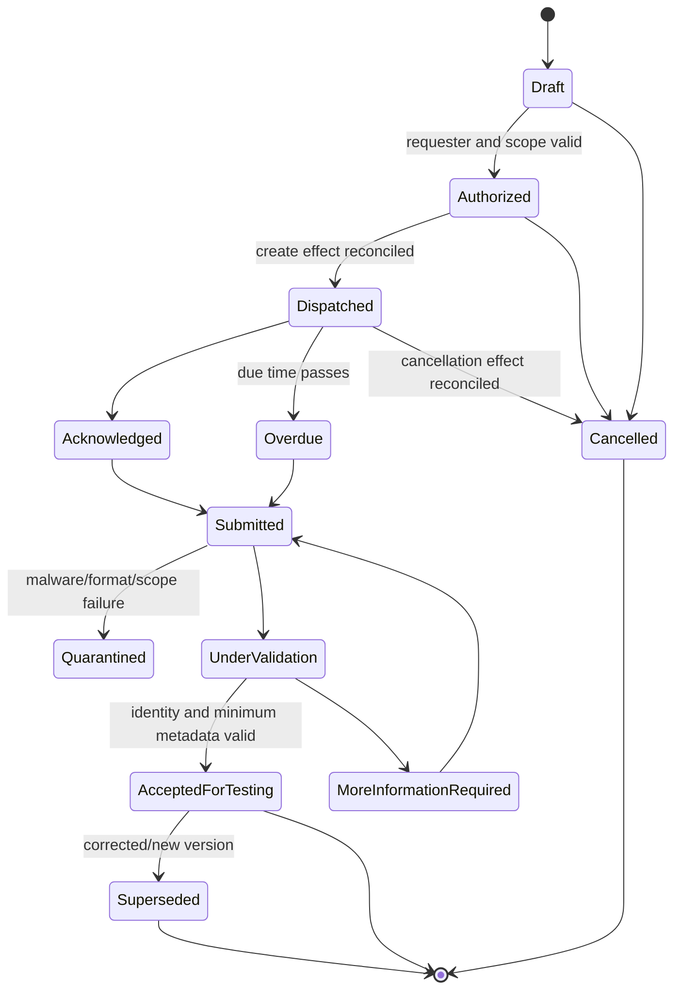

# Evidence Requests, Connectors, and Immutable Lineage

> **Purpose:** Obtain the right evidence through the least-authoritative channel, preserve every version and transformation, and make incompleteness or ambiguity visible instead of fabricating certainty.

## Evidence is a versioned claim about a source

An artifact becomes usable audit-support material only when the system can answer:

1. **What** exact bytes or structured records were observed?
2. **Where** did they come from, and what stable source identity/version did the source expose?
3. **Who or what** retrieved or submitted them under which delegated authority?
4. **When** were the source observation, acquisition, and storage performed, and against which clock?
5. **How** was the query scoped, paginated, filtered, transformed, and validated?
6. **What is not known** about completeness, authenticity, freshness, population coverage, or contradictory evidence?
7. **Which later observations and decisions** used this exact artifact version?

Do not mutate a file when a newer version arrives. Create a new evidence version and a relationship such as `supersedes`, `corrects`, `duplicates`, `corroborates`, or `contradicts`.

## Evidence request contract

```json
{
  "request_id": "er_01K...",
  "tenant_id": "tenant_acme",
  "engagement_id": "eng_fy26_soc2",
  "control_ids": ["CC6.1-org-01"],
  "procedure_ids": ["proc_toe_access_v4"],
  "purpose": "Obtain approved and completed access reviews for sampled populations",
  "requested_items": [
    {
      "item_id": "eri_01",
      "description": "Export from the approved access-review system",
      "period": {"from": "2026-01-01", "to": "2026-06-30"},
      "required_source_type": "source_system_export",
      "acceptable_formats": ["application/json", "text/csv"],
      "prohibited_fields": ["password_hash", "authentication_secret"],
      "completeness_question": "Does the export include every review closed in the period?"
    }
  ],
  "assignee": "human:evidence_custodian_19",
  "requested_by": "human:tester_8",
  "reviewer": "human:reviewer_12",
  "confidentiality": "restricted-assurance",
  "due_at": "2026-09-15T17:00:00Z",
  "escalation_policy_id": "evidence_due_v3",
  "scope_digest": "sha256:...",
  "status": "authorized",
  "created_at": "2026-08-31T11:00:00Z"
}
```

The request states the purpose and acceptable source, not a desired conclusion. Avoid requests such as “provide proof this control passed.”

## Request lifecycle



`AcceptedForTesting` means the item is addressable and safe to review. It does not mean relevant, reliable, sufficient, or supportive of a conclusion.

## Prefer source-system collection

Use this preference order, subject to the approved procedure:

1. authenticated read from the system of record with a recorded query and source receipt;
2. source-generated signed/versioned export with authenticated acquisition;
3. corroborated evidence from an independent source;
4. manually exported file with submitter attestation and completeness questions;
5. screenshot, narrative, or interview record when the procedure permits and limitations are explicit.

Manual evidence is not automatically invalid, and API evidence is not automatically reliable. Source expertise, controls over the information, query correctness, period, completeness, and contradictions still require evaluation. [PCAOB AS 1105](https://pcaobus.org/oversight/standards/auditing-standards/details/AS1105) is financial-audit-specific but usefully illustrates that sufficiency and appropriateness include quantity, relevance, and reliability, and that both corroborating and contradicting evidence matter.

## Connector capability classes

| Class | Examples | Default authority | Required controls |
| --- | --- | --- | --- |
| Source snapshot | Cloud configuration, IAM policy, repository setting | Read-only | Stable resource ID, query/pagination record, source timestamp/version, completeness test |
| Event/history stream | Audit log, change history, authentication event | Read-only and cursor based | Retention window, ordering semantics, watermark, late events, duplicate handling |
| Evidence-management system | ServiceNow request/evidence object, GRC platform | Read plus allowlisted request effects | State mapping, attachment versions, requester/assignee identity, confidentiality, webhook reconciliation |
| Ticket/work system | Jira issue/change/approval | Read; optional scoped request/comment effect | Workflow/version semantics, webhook expiry, user identity mapping, attachment lineage |
| File repository | Approved object/document store | Read; package write only in later stage | Version ID, content digest, share/ACL snapshot, legal-hold behavior |
| Human submission | Secure upload/interview record | Quarantined intake | Strong authentication, malware handling, source representation, independent acceptance |

Do not use browser automation for a source that offers a supported API/export. If a legacy UI is unavoidable, isolate the browser worker, record screenshots/DOM/export receipts, make it read-only where possible, and treat layout drift as a connector failure—not a reason for the model to improvise.

## Connector contract

Every adapter implements a typed, versioned contract compatible with [tool contracts](../../tools/tool-contracts.md):

```yaml
connector_id: github-enterprise-audit-v3
connector_version: 3.4.1
operation: query_audit_events
mode: read_only
input:
  tenant_binding: tenant_acme
  organization_id: org_1882
  period: {from: 2026-08-01T00:00:00Z, to: 2026-09-01T00:00:00Z}
  fields: [actor, action, created_at, repo, operation_type]
  page_size: 100
  cursor: null
  expected_scope_digest: sha256:...
output:
  records_ref: vault://ev_01K.../v1
  record_count: 8471
  first_source_time: 2026-08-01T00:00:07Z
  last_source_time: 2026-08-31T23:59:55Z
  next_cursor: null
  pagination_complete: true
  truncation: false
  source_receipt_ref: receipt://src_01K...
  schema_version: github-audit-event.2026-02
errors:
  retryable: [rate_limited, source_unavailable]
  terminal: [scope_denied, resource_not_found, schema_incompatible]
  indeterminate: [timeout_after_export_started]
```

The connector gateway enforces timeouts, bounded pages/bytes, rate limits, retries, circuit breaking, allowlisted resources/fields, and a maximum result policy. It records partial results separately and never labels a truncated result complete.

The contract is deployable only with a pinned adapter manifest and approved conformance report. Follow [Integration qualification and audit-package walkthroughs](11-integration-qualification-and-audit-package-walkthroughs.md) for source-family tests and the typed `compliance.evidence_acquisition_receipt`, whose freshness, completeness, limitation, retention, hold, and deletion states travel with every accepted artifact.

## Current connector realities to design for

Capabilities and limits change. Verify them at implementation and on every adapter upgrade.

| Source | Research-date behavior that affects evidence design | Production response |
| --- | --- | --- |
| [AWS Audit Manager evidence](https://docs.aws.amazon.com/audit-manager/latest/userguide/concepts.html) | Automated and manual evidence can coexist; automated evidence may reflect full or partial compliance and is not automatically a conclusion | Preserve evidence type/source and AWS assessment context; do not translate status into reviewer acceptance |
| [AWS evidence collection](https://docs.aws.amazon.com/audit-manager/latest/userguide/how-evidence-is-collected.html) | Snapshots, compliance checks, and user activity have different semantics; results can be inconclusive | Map native type/status without flattening; capture collection definition and account/region |
| [AWS evidence review](https://docs.aws.amazon.com/audit-manager/latest/userguide/review-evidence.html) | Automated evidence availability can lag, documented as up to 24 hours | Define a freshness window and delayed-evidence state rather than asserting absence |
| [Azure Policy compliance states](https://learn.microsoft.com/en-us/azure/governance/policy/concepts/compliance-states) | Native states include compliant, non-compliant, error, conflicting, exempt, and unknown, with aggregation semantics | Store raw/aggregated level and evaluation time; treat the label as source evidence, not an audit conclusion |
| [Azure Policy Insights API](https://learn.microsoft.com/en-us/rest/api/policyinsights/policy-states) | Query/version semantics are API specific | Pin API version, query, scope, pagination, and response schema |
| [Google Cloud Asset history](https://docs.cloud.google.com/asset-inventory/docs/get-asset-history) | Documented asset history is limited to 35 days and has resource-scope limitations | Export promptly to the evidence boundary, test requested resource support, and record retention gaps |
| [GitHub organization audit log](https://docs.github.com/en/organizations/keeping-your-organization-secure/managing-security-settings-for-your-organization/reviewing-the-audit-log-for-your-organization) | Documented organization audit-log retention is 180 days; export has bounded size/time; streaming may reduce polling | Persist watermarks, collect before expiry, reconcile stream and periodic query, record export truncation |
| [Okta System Log API](https://developer.okta.com/docs/reference/system-log-query/) | Near-real-time, read-only data can be returned out of published order; documented retention is 90 days; cursor links should drive polling | Use source cursors, overlap windows, deduplicate stable event IDs, and delay completeness until watermark policy passes |
| [ServiceNow evidence requests](https://www.servicenow.com/docs/r/governance-risk-compliance/audit-management/request-evidence.html) | Native requester, assignee, due date, state, confidentiality, and evidence attachment semantics exist | Map without losing native IDs/versions; reconcile state/attachments rather than duplicating a second truth |
| [Jira REST v3 webhooks](https://developer.atlassian.com/cloud/jira/platform/rest/v3/api-group-webhooks/) | Dynamic webhook lifecycle/expiry must be managed | Treat webhooks as hints; renew and reconcile with authoritative polling |

These are adapter assumptions, not timeless guarantees. Put each in an executable compatibility test and a refresh watchlist.

## Evidence artifact manifest

```json
{
  "artifact_id": "ev_01K...",
  "version": 1,
  "tenant_id": "tenant_acme",
  "engagement_id": "eng_fy26_soc2",
  "request_item_id": "eri_01",
  "artifact_role": "raw_source_evidence",
  "media_type": "application/json",
  "byte_length": 481993,
  "content_digest": {"algorithm": "sha-256", "value": "..."},
  "source": {
    "system": "okta-system-log",
    "tenant_resource_id": "org_00ab",
    "native_ids": ["uuid-first", "uuid-last"],
    "native_version_or_etag": null,
    "source_observed_from": "2026-08-01T00:00:00Z",
    "source_observed_to": "2026-08-31T23:59:59Z",
    "source_clock": "provider-created-timestamp"
  },
  "acquisition": {
    "receipt_id": "ear_01K...",
    "receipt_schema": "compliance.evidence_acquisition_receipt@1.0.0",
    "method": "api_query",
    "connector": "okta-system-log-v2@2.7.0",
    "principal": "workload:collector-cell-in-2",
    "delegation_ref": "grant_118",
    "query_digest": "sha256:...",
    "started_at": "2026-09-01T00:10:00Z",
    "completed_at": "2026-09-01T00:12:33Z",
    "source_receipt_digest": "sha256:..."
  },
  "completeness": {
    "pagination_complete": true,
    "truncated": false,
    "late_event_watermark_passed": true,
    "population_claim": "complete_for_approved_query_and_available_retention_window",
    "limitations": []
  },
  "security": {
    "classification": "restricted-assurance",
    "residency": "in-central",
    "encryption_key_ref": "tenant-key:acme-v4",
    "malware_scan_ref": null
  },
  "retention": {
    "policy_id": "retain_audit_7y_v3",
    "delete_not_before": "2033-12-31T00:00:00Z",
    "legal_hold_ids": []
  },
  "stored_at": "2026-09-01T00:12:34Z",
  "manifest_digest": "sha256:..."
}
```

Hash a deterministic byte representation. For canonical JSON, define and test a canonicalization rule such as [RFC 8785](https://www.rfc-editor.org/rfc/rfc8785) rather than hashing whichever serialization a library happens to emit.

## Transformation lineage

Raw evidence remains immutable and separately addressable. Every OCR, archive extraction, normalization, redaction, join, query result, rendering, or model-derived summary creates a new artifact and an activity record.

```yaml
activity_id: tr_01K...
activity_type: normalize_identity_events
implementation: transform/identity-events@4.2.0
runtime_digest: sha256:container...
inputs:
  - artifact: ev_01K...@1
    digest: sha256:raw...
parameters_digest: sha256:params...
outputs:
  - artifact: ev_01L...@1
    digest: sha256:normalized...
started_at: 2026-09-01T00:13:00Z
completed_at: 2026-09-01T00:13:41Z
record_counts:
  input: 28102
  output: 28097
rejected_records_ref: vault://ev_reject_01@1
losses:
  - count: 5
    reason: invalid_source_timestamp
performed_by: workload:transformer-cell-in-2
release_manifest_id: rel_2026_08_31_4
```

This aligns with the entity/activity/agent concepts in [W3C PROV](https://www.w3.org/TR/prov-overview/) while keeping the local schema implementable. See also [tool results, artifacts, and provenance](../../tools/tool-results-artifacts-and-provenance.md).

## Integrity is not truth

Object-lock/WORM storage can prevent or constrain later deletion and modification. [AWS S3 Object Lock](https://docs.aws.amazon.com/AmazonS3/latest/userguide/object-lock.html), [Azure immutable blob storage](https://learn.microsoft.com/en-us/azure/storage/blobs/immutable-storage-overview), and [Google Cloud Storage Object Retention Lock](https://docs.cloud.google.com/storage/docs/object-lock) have different modes, permissions, and retention semantics. Select and test them under organizational policy.

They can show that stored bytes have not changed under the enforced mechanism. They do **not** prove:

- the source record was authentic or complete;
- the connector queried the right population or period;
- a privileged source administrator did not alter data before collection;
- the control operated as described;
- the evidence is relevant or sufficient;
- the organization is compliant.

For selected high-value manifests, a trusted timestamp such as [RFC 3161](https://www.rfc-editor.org/info/rfc3161/) can provide time-stamping evidence. Long-retention environments may consider renewal/evidence-record patterns such as [RFC 4998](https://www.rfc-editor.org/info/rfc4998/). These add operational complexity and do not replace source/reviewer evaluation. [NISTIR 8387](https://www.nist.gov/publications/digital-evidence-preservation-considerations-evidence-handlers) offers useful preservation considerations, but forensic/legal evidence rules are jurisdiction-specific and are not identical to audit evidence requirements.

## Idempotency and reconciliation

Use stable semantic IDs:

| Operation | Semantic identity | Verification source |
| --- | --- | --- |
| Create request | `request_id + create + request_version` | Downstream request ID/state plus payload digest |
| Send reminder | `request_id + due_epoch + reminder_policy_step` | Downstream message/event ID |
| Collect query page | `collection_id + query_digest + page_cursor` | Source receipt and artifact digest |
| Finalize collection | `collection_id + terminal_watermark` | Page ledger, counts, gaps, source status |
| Freeze evidence version | `artifact_id + version + content_digest` | Vault/object version and manifest digest |
| Cancel request | `request_id + cancel + request_version` | Downstream terminal state |

Retries reuse the semantic ID. An updated request or changed query produces a new ID and links to the predecessor. If a downstream response is lost, mark `unknown`, reconcile, and only retry after the authoritative source shows no commit or provides an idempotent create contract.

## Stage 2: evidence-request MVP

### Authority

C2 for a small allowlist of reversible request/reminder/cancel effects and read-only collection from named resources. All evidence acceptance and every sensitive request remain human decisions. No sample execution or package publication.

### Architecture

Add production request state, effect gateway/ledger, one or two hardened connectors, quarantine, immutable evidence versions, provenance, review intake, reconciliation workers, rate limits, and an out-of-band effect stop.

### Inputs and outputs

Inputs are approved requests, source grants, queries, source records, and authenticated submissions. Outputs are reconciled request states, raw evidence manifests, source receipts, completeness/limitation records, quarantined items, and candidate classifications.

### State, events, and effects

Use the request lifecycle above. Important events include `request_authorized`, `request_dispatched`, `submission_received`, `artifact_quarantined`, `source_collection_partial`, `evidence_version_registered`, `more_information_requested`, and `request_cancelled`. Allowed effects are explicit per deployment; package and conclusion effects remain denied.

### Approvals

The requester must be authorized for the control and data class. Source owners approve connector scopes. A person other than the submitter accepts evidence where independence policy requires it. Privacy/security approves sensitive fields and model paths. Bulk or external requests require elevated approval.

### Recovery

Reconcile lost create responses, resume pagination from recorded cursors, overlap event windows and deduplicate, quarantine schema drift, preserve partial results with limitations, revoke compromised grants, and route manual collection when retention or API gaps cannot be repaired.

### Evaluation

- request deduplication and exact-target rate;
- on-time/overdue state accuracy and reconciliation lag;
- artifact identity, digest, manifest, and source-receipt completeness;
- pagination/truncation/retention-gap detection;
- malicious file, oversized archive, prompt injection, and cross-tenant rejection;
- connector schema/rate-limit/outage/late-event recovery;
- reviewer acceptance/rejection reasons and unnecessary request burden;
- cost per accepted evidence item and manual fallback rate.

### Measurable exit gate

Stage 2 passes only when:

1. every dispatched effect has one semantic operation ID and reaches `committed`, `rejected`, or explicitly reconciled `unknown` within the approved bound;
2. 100% of artifacts used downstream resolve to an immutable version, digest, tenant/engagement, acquisition identity, source/query record, completeness status, classification, and retention policy;
3. fault tests produce no duplicate request, silent truncated collection, cross-tenant artifact, or lost evidence version;
4. source-retention, pagination, late-event, and schema-drift scenarios route to explicit limitation or manual recovery states;
5. Stage 0 business, reviewer-load, privacy, and cost thresholds remain satisfied in live limited use; and
6. the team completes a credential-revocation, connector-outage, and request-reconciliation drill.

## Collection review checklist

- [ ] Source identity, period, resource scope, query, fields, pagination, timestamps, and adapter version are recorded.
- [ ] Completeness states distinguish full-for-query, partial, truncated, retention-limited, late, conflicting, and unknown.
- [ ] Native “compliant” or “passed” labels remain attributed source fields, not agent conclusions.
- [ ] Raw bytes are immutable; derived artifacts link inputs, parameters, implementation, losses, and outputs.
- [ ] Submitter identity is not treated as independent evidence acceptance.
- [ ] Every effect is idempotent or has an explicit unknown-state reconciliation path.
- [ ] Legal hold can prevent deletion without granting broad read access.
- [ ] Evidence that arrives after package freeze creates a controlled reopen/supplement decision, not an in-place edit.
