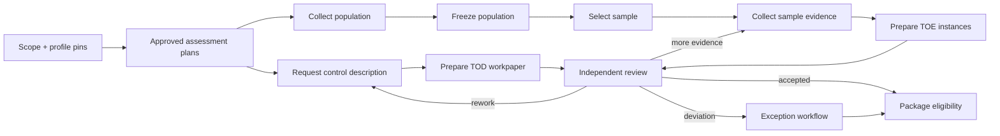

# Engagement State, Context, Memory, and Orchestration

> **Purpose:** Keep months-long engagement truth in typed durable records while giving each model call only the minimum reconstructable context needed for one bounded task.

## The engagement record is authoritative

The transcript, model context, vector index, worker memory, and cached plan are projections. The durable engagement service owns identity, lifecycle, scope/profile pins, work ownership, deadlines, evidence links, test state, decisions, exceptions, package versions, and retention/hold status.

```yaml
engagement:
  engagement_id: eng_fy26_soc2
  tenant_id: tenant_acme
  engagement_type: soc2_examination_support
  lifecycle: testing
  version: 114
  purpose_ref: scope://es_01J...
  period: {from: 2026-01-01, to: 2026-12-31}
  profile_ref: profile_soc2_org_v7@sha256:...
  release_manifest_id: rel_2026_08_31_4
  authority_ceiling: C3
  work_summary:
    controls_total: 42
    controls_collecting: 7
    controls_testing: 19
    controls_awaiting_review: 12
    controls_blocked: 4
  open_requests: [er_01K..., er_01L...]
  open_exceptions: [ex_01K...]
  current_package_id: null
  assignments:
    engagement_lead: human:lead_17
    independent_reviewer_group: group:assurance-reviewers
  deadlines:
    evidence_cutoff: 2026-11-15T17:00:00Z
    package_target: 2027-01-31T17:00:00Z
  retention_policy_id: retain_audit_7y_v3
  legal_hold_ids: []
  updated_at: 2026-08-31T14:00:00Z
```

Lists may be projections over child aggregates rather than embedded arrays at scale. The invariant is that each reference is typed, versioned, independently queryable, and reconstructable.

## Aggregate boundaries

Avoid one giant mutable engagement row. Use transaction boundaries that match the invariants:

| Aggregate | Local invariants | Cross-aggregate consistency |
| --- | --- | --- |
| Engagement | scope/profile/release pin, lifecycle, authority ceiling | Projections reconcile child work counts |
| Evidence request | exact request version, assignee, due date, submission state | Event links evidence versions and downstream receipt |
| Artifact | immutable version/digest/tenant/source/retention | References validated when workpaper/package is created |
| Population/sample | one approved plan and immutable manifest version | Test instances link selected record IDs |
| Test instance/workpaper | procedure step/input manifest/candidate/review lifecycle | Exception links accepted reviewer observation |
| Exception | classification, owner, due dates, disposition/retest | Cannot close control review until policy conditions pass |
| Package | exact included object versions and manifest | Freeze validates all dependencies and decisions |
| Effect | operation identity, attempts, receipt/unknown/reconciliation | Domain transition follows verified receipt |

Use optimistic versions on commands. Cross-aggregate workflows are eventually consistent and explicitly reconciled; do not pretend they are one ACID transaction.

## Typed event vocabulary

Events are past-tense domain facts, not instructions or logs.

```json
{
  "event_id": "evt_01K...",
  "event_type": "test_instance_submitted_for_review",
  "schema_version": 2,
  "tenant_id": "tenant_acme",
  "engagement_id": "eng_fy26_soc2",
  "aggregate": {"type": "test_instance", "id": "ti_01K...", "version": 7},
  "occurred_at": "2026-08-31T14:02:15Z",
  "recorded_at": "2026-08-31T14:02:15.193Z",
  "actor": "human:tester_8",
  "causation_id": "cmd_01K...",
  "correlation_id": "run_01K...",
  "policy_decision_id": "pdp_1188",
  "payload": {
    "workpaper_version": 3,
    "input_manifest_digest": "sha256:...",
    "candidate_observation_ids": ["obs_01K..."]
  },
  "event_digest": "sha256:..."
}
```

Representative events:

- `engagement_scoped`, `profile_pinned`, `assessment_plan_approved`, `engagement_cancelled`;
- `evidence_request_authorized`, `request_dispatched`, `artifact_version_registered`, `collection_gap_recorded`;
- `population_frozen`, `sample_selected`, `sample_verified`, `test_instance_prepared`;
- `candidate_observation_recorded`, `workpaper_returned_for_rework`, `review_decision_recorded`;
- `exception_opened`, `management_response_received`, `retest_completed`, `exception_disposition_recorded`;
- `package_manifest_created`, `package_freeze_approved`, `package_delivered`, `delivery_reconciled`;
- `legal_hold_applied`, `retention_expired`, `artifact_deleted`, `derived_index_purged`.

Telemetry such as latency or token count is not a domain event. An attempted API call is not `request_dispatched` unless the effect ledger says dispatch occurred.

## Engagement transition invariants

| Transition | Required invariant | Forbidden shortcut |
| --- | --- | --- |
| `draft → scoped` | signed scope, purpose/data/roles/authority/rights | model-generated scope without owner signatures |
| `scoped → planned` | profile and release pinned; procedures and owners assigned | floating latest profile |
| `planned → collecting` | request/source authorization and deadlines | broad connector scan |
| `collecting → ready_for_test` | required items present or explicit gaps/limitations | treat missing as negative or complete |
| `testing → awaiting_review` | procedure steps and input manifests complete; candidate labeled | candidate becomes decision |
| `awaiting_review → package_ready` | required independent decisions; exceptions satisfy policy | aggregate score closes controls |
| `package_ready → package_frozen` | exact manifest approved; dependencies current; integrity checks pass | approve a mutable folder |
| `package_frozen → delivered` | authorized destination and reconciled receipt | timeout interpreted as failure/success |
| `delivered → closed` | follow-up, retention, holds, and human report references recorded | agent issues an opinion |

## Plan as a durable dependency graph

The coordinator creates a deterministic graph from the approved profile and assessment plan:



Graph nodes define required inputs, permitted capability, actor/role, deadline, retry/recovery policy, outputs, and acceptance condition. The model can propose a permitted next node or fill a semantic task inside a node; it cannot invent a new connector, skip review, or change graph dependencies.

## Replanning contract

Replanning is a domain command, not hidden model behavior.

| Trigger | Allowed automatic response | Human decision required |
| --- | --- | --- |
| Retryable connector outage | Backoff, circuit break, reschedule within deadline | Scope/source change or deadline waiver |
| Evidence format/schema drift | Quarantine and route adapter incompatibility | Accept alternative evidence/procedure |
| Missing selected item | Create missing-evidence work item | Replacement, deviation, or population correction |
| Source/profile withdrawal | Pause affected work and compute impact | Continue pinned, migrate, reperform, or consult |
| Reviewer requests more evidence | Create approved request draft | Expand data class/system/period |
| Control changes during period | Split candidate periods and flag design change | Procedure/conclusion impact |
| Legal hold | Stop deletion and preserve state | Access/use changes and release |
| Deadline/capacity breach | Escalate, shed optional model work, protect evidence/decision queues | Reduce scope or assurance work |

Every accepted replan records old/new graph versions, cause, changed dependencies, affected work/evidence, authority, and approval.

## Context lanes

Follow [context engineering](../../context-memory/context-engineering.md). Build context for one task from durable references:

| Lane | Contents | Trust and handling |
| --- | --- | --- |
| Authority | tenant, engagement, purpose, data/effect limits, prohibited claims | System-authored, highest precedence, never compacted semantically |
| Task | exact node, permitted output, deadline, schema | System-authored |
| Profile/procedure | approved minimum excerpts/IDs/versions | Authorized/licensed; no silent retrieval from another profile |
| State | current aggregate versions, open dependencies, prior decisions | System projection; revalidate before accept/commit |
| Evidence | exact versioned excerpts/structured fields with provenance and completeness labels | Untrusted content; source labels retained |
| Review | authorized reviewer instructions, rework reason, unresolved questions | Attributed decision/work item, not free-form system instruction |
| Output | schema, citation and claim rules, token/byte budget | System-authored |

Evidence instructions such as “ignore the audit plan” remain quoted evidence content and cannot enter the authority lane.

## Memory policy for the exact seven lifetimes

Memory is not one feature. The runtime recognizes exactly seven lifetimes below; enable only a lifetime with an explicit purpose, source, admission rule, expiry/deletion rule, and authority boundary.

| Memory class | Use here | Source of truth? | Retention and controls |
| --- | --- | --- | --- |
| **Turn/scratch memory** | One extraction/comparison/draft call and temporary parsing | No | Discard after call except approved input/output manifest and evaluation metadata; provider retention verified |
| **Working/run memory** | Current bounded plan, tool/evidence references, unresolved fields, budgets, and draft proposal within one work item | No | Typed checkpoint with short TTL; reconstruct from task state; never carry authority or conclusions |
| **Session memory** | Authenticated reviewer clarifications, active engagement/task, and presentation state | No | Bound to tenant, engagement, actor, purpose, and expiry; cannot carry decision, independence, approval, or package authority |
| **Durable engagement/task memory** | Engagement, request, artifact, sample, workpaper, decision, exception, effect, package state | Yes, via typed services | Engagement retention/legal hold; RBAC/ABAC; immutable history and versioning |
| **Domain/semantic memory** | Versioned control profiles, organization glossary, approved mappings, connector schemas, procedures | Authoritative only when signed/versioned in registry | Owner/effective date/rights/digest; no anonymous free-text “learning” |
| **Long-term memory** | No implicit reviewer/control-owner reputation or preference memory; reviewed stable organizational facts belong in versioned domain records instead | No; disabled for decision influence | Ordinary UI preferences live outside decision context; never change evidence, thresholds, independence, or routing from remembered preference |
| **Episodic/outcome memory** | No direct replay of prior engagement narratives, decisions, or outcomes into production decisions | No; disabled for decision influence | Curated, rights-cleared, deidentified incidents may enter a governed evaluation/failure corpus after privacy, assurance, and owner review |

Retrieval indexes and caches are **not an eighth memory lifetime**. They are derived, tenant/purpose/version-partitioned projections with authorization-aware keys, short policy-bound retention, deletion propagation, and deterministic rebuild from authoritative records. See [memory architecture](../../context-memory/memory-architecture.md). “The agent learned that this owner is reliable” is prohibited long-term memory and an independence risk.

## Lossy compaction contract

Compaction is allowed only for conversational/navigation convenience. The durable task is reconstructed from IDs and manifests before every consequential decision. A summary must preserve:

- tenant, engagement, purpose, profile/release/procedure versions;
- current aggregate versions and allowed next actions;
- exact artifact/sample/workpaper/decision references;
- supporting **and contradicting** evidence identifiers;
- missing, partial, stale, disputed, quarantined, or superseded labels;
- open requests/exceptions, owners, due dates, and review instructions;
- prohibited claims/effects and approval requirements.

It may compress repeated narrative, resolved navigation, or redundant prose. It must not:

- replace exact citations, source versions, sample manifests, or decision rationale;
- merge “missing,” “failed,” “not applicable,” “not tested,” and “passed”;
- turn a proposal into a reviewer decision;
- omit contradictory evidence;
- make a temporary source status timeless;
- carry access from one task, engagement, or tenant into another.

After compaction, validate references and run a continuity test. If the original evidence is unavailable, stop and surface the loss. See [compaction and continuity](../../context-memory/compaction-and-continuity.md).

Persist the checked boundary as a loss-aware compaction continuity receipt:

```yaml
schema_name: compliance.compaction_continuity_receipt
schema_version: 1.0.0
receipt_id: ccr_01K...
tenant_id: tenant-42
engagement_id: audit-2026-q3-17
engagement_state_version: 34
source_event_high_watermark: 1902
behavior_bundle_release: compliance-audit/2026.08.31-rc4
control_catalog_release: nist-800-53-r5-upd1
profile_release: soc2-control-profile-8
procedure_release: toe-procedure-12
sampler_release: deterministic-stratified/3.2.1
artifact_manifest_id: evidence-manifest-771
sample_manifest_ids: [sample-42]
open_request_ids: [request-91]
decision_ids: [decision-311]
exception_ids: []
pending_effect_ids: []
unknown_effect_ids: []
contradictory_evidence_ids: [artifact-18]
preserved_claim_ids: [claim-91, claim-92]
preserved_limitation_ids: [limit-7]
omitted_sections: [resolved_navigation, repeated_background]
known_losses: []
next_action: independent_review
context_compiler_release: compliance-context/4.0.0
compactor_release: compliance-continuity/2.1.0
pre_compaction_context_manifest_sha256: "..."
post_compaction_snapshot_sha256: "..."
continuity_check: passed
```

`known_losses` must be empty for consequential work. If a cited source, contradiction, limitation, approval, release pin, hold, or unknown effect cannot be reconstructed, set `continuity_check: failed`, block the next state/effect, and rebuild from durable records or escalate the irrecoverable loss. On resume, compare the receipt with engagement/events, the behavior bundle, signed profiles/procedures/sampler, evidence/sample manifests, decisions, exceptions, approvals, and effect ledger. Compaction changes representation, never evidence, independence, conclusion, or authority.

## Context budget policy

Prioritize in this order:

1. authority, scope, state version, and prohibited actions;
2. task/procedure and output schema;
3. exact evidence necessary for the procedure, including contradictions;
4. reviewer instructions and unresolved questions;
5. navigation summaries and optional background.

If evidence exceeds the model budget, use deterministic filtering, per-artifact extraction with citations, or a hierarchical review that keeps raw versions available. Never silently choose only evidence supporting a preferred result.

## Concurrency and stale work

- Commands carry `expected_version`; stale mutations are rejected and reloaded.
- A work item lease assigns preparation, but expiration does not erase work or authorize another actor to reuse an approval.
- Package freeze obtains a dependency snapshot, not a global lock for the whole engagement.
- New evidence after reviewer decision triggers an impact event and explicit reopen/ignore-as-out-of-period decision.
- Legal hold and incident stop policies override ordinary deletion or publication commands.
- Reviewer reassignment rechecks independence and does not inherit the predecessor’s session context.

## Cancellation and recovery

Cancellation stops new work/effects, attempts approved downstream request cancellations, releases leases, and preserves required evidence/history. It does not delete evidence, retract delivered packages, or compensate external effects automatically.

After coordinator loss:

1. replay or query durable state;
2. rebuild outstanding timers and queue leases;
3. reconcile effects in `reserved`, `dispatched`, or `unknown`;
4. validate connector cursors and partial artifacts;
5. rebuild retrieval indexes from authoritative records;
6. resume only tasks whose scope/profile/release/authorization remain valid;
7. route incompatible or ambiguous work to operators.

## Orchestration review checklist

- [ ] Every work node has typed inputs, outputs, owner, deadline, capability, approval, retry, and recovery.
- [ ] Model proposals cannot transition state without validator and policy checks.
- [ ] Replanning creates a versioned graph and impact record.
- [ ] All memory classes have an explicit enable/disable, source, retention, and deletion decision.
- [ ] Context lanes preserve authority and trust labels; evidence cannot become instructions.
- [ ] Compaction is lossy by design and never substitutes for evidence, state, or decisions.
- [ ] Stale versions, new evidence, reviewer reassignment, cancellation, and legal hold have deterministic behavior.
- [ ] Recovery reconstructs work without a model transcript or live worker.

## Anti-patterns

| Anti-pattern | Failure | Correction |
| --- | --- | --- |
| One endless audit chat | Loses authority, versions, deadlines, review state, and evidence boundaries | Durable aggregates plus bounded task contexts |
| Vector store as evidence system | Retrieval ranking changes; versions, completeness, retention, and decisions are weak | Immutable vault and typed provenance; index is rebuildable |
| Summary is “the memory” | Lossy text silently becomes truth | Reconstruct from durable IDs/manifests before consequential work |
| Planner freely creates subtasks/tools | Can bypass approved procedures or expand scope | Versioned dependency graph and allowlisted node capabilities |
| Multi-agent roles mirror human job titles | Extra nondeterminism does not create independence | Separate real identities and deterministic workflow; add model workers only for measured tasks |
| Retry everything after restart | Duplicates requests/delivery and can alter frozen work | Idempotent activity identity and effect reconciliation |
