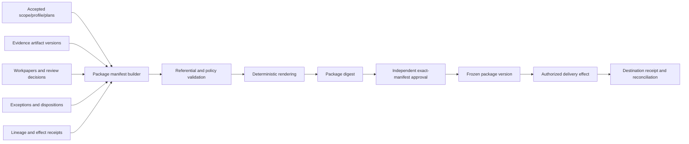

# Reviewer Independence, Exceptions, and Audit Packages

> **Purpose:** Give qualified reviewers a defensible decision surface, enforce real segregation of duties, preserve exception history, and produce a reproducible package without letting the agent attest to its own work.

## Independence is a policy over real actors

Different assurance regimes define independence and objectivity differently. The [IIA Global Internal Audit Standards](https://www.theiia.org/en/standards/), [GAO Yellow Book](https://www.gao.gov/yellowbook), [PCAOB independence rules](https://pcaobus.org/oversight/standards/ethics-independence-rules), and professional ethics codes are not interchangeable. Configure the applicable policy with qualified owners.

The platform must still enforce the mechanics:

- link workload and delegated identities to real people/organizations;
- record control design/implementation/operation involvement;
- prevent proposer, preparer, submitter, control operator, or conflicted reviewer combinations when policy forbids them;
- enforce review levels, group membership, cooling-off or rotation requirements where applicable;
- recheck conflicts at assignment, decision, package freeze, and delivery;
- make conflict override impossible unless the applicable policy defines an authorized, recorded resolution path.

Creating `agent-preparer` and `agent-reviewer` service accounts does not create independence if one person, prompt, model run, or operator controls both decisions.

## Segregation-of-duties record

```yaml
independence_check_id: ic_01K...
policy_id: assurance_sod_v5
engagement_id: eng_fy26_soc2
action: review_workpaper
subject: human:reviewer_12
object: workpaper:wp_004@3
related_actors:
  control_owner: human:owner_09
  evidence_submitters: [human:custodian_19]
  preparer: human:tester_8
  model_proposal: prop_01K...
relationships_evaluated:
  - same_person
  - manager_subordinate
  - control_implementation_participation
  - control_operation_participation
  - prior_preparation
  - prohibited_financial_or_business_relationship
result: allow
policy_version: 5.2.0
evaluated_at: 2026-08-31T15:00:00Z
evidence_refs: [iam://group-membership/..., governance://conflicts/...]
decision_digest: sha256:...
```

The check records what the system evaluated, not a universal legal determination of independence. Undetectable relationships remain a human disclosure and governance responsibility.

## Review workbench

Do not present a transcript dump. For one decision, show:

1. control objective, risk, scope, period, profile/procedure versions;
2. approved population/sample and relevant limitations;
3. procedure steps and exact evidence versions;
4. source facts with locators and source reliability/completeness metadata;
5. supporting, contradicting, missing, superseded, and quarantined items;
6. candidate observation and uncertainty, clearly attributed to preparer/model;
7. prior reviewer comments and changed inputs since the last review;
8. allowed decisions and their exact workflow consequences;
9. independence/authentication status and required consultation/escalation;
10. a place for reviewer rationale that is preserved with the decision.

Allowed actions are typed, for example:

- `accept_evidence_for_procedure`
- `reject_evidence_wrong_source`
- `request_more_evidence`
- `return_workpaper_for_rework`
- `accept_observation_as_deviation`
- `accept_observation_as_no_deviation`
- `cannot_conclude_escalate`
- `open_exception`
- `approve_exact_package_manifest`

Avoid one ambiguous green “Approve” button.

## Review decision contract

```json
{
  "decision_id": "dec_01K...",
  "decision_type": "workpaper_review",
  "tenant_id": "tenant_acme",
  "engagement_id": "eng_fy26_soc2",
  "subject": {"type": "workpaper", "id": "wp_004", "version": 3},
  "input_manifest_digest": "sha256:...",
  "disposition": "request_more_evidence",
  "reason_codes": ["historical_authorization_missing"],
  "rationale": "Current role membership does not establish the approver's authority at the approval time.",
  "requested_actions": [
    {"type": "evidence_request_draft", "required_fact": "approver authorization effective 2026-04-02"}
  ],
  "reviewer": "human:reviewer_12",
  "independence_check_id": "ic_01K...",
  "authenticated_at": "2026-08-31T15:00:00Z",
  "decided_at": "2026-08-31T15:07:43Z",
  "policy_version": "assurance_sod_v5.2.0",
  "decision_digest": "sha256:..."
}
```

A later input change makes this decision stale or triggers an impact review; it does not silently update the decision’s basis.

## Approval is not authorization

Reviewer approval answers a domain question about one exact input manifest. Commit-time authorization independently verifies whether the actor/workload may perform the requested transition or effect now. Package delivery rechecks destination, classification, residency, retention/hold state, approval scope/expiry, release status, and incident-mode policy.

Never pass an approval token directly to an adapter as a bearer credential.

## Exception lifecycle

An exception is durable domain work, not a paragraph in a report.

```mermaid
stateDiagram-v2
    [*] --> Candidate
    Candidate --> Open: authorized reviewer accepts observation
    Candidate --> Rejected: unsupported / not a deviation
    Open --> AwaitingManagementResponse
    AwaitingManagementResponse --> ResponseReceived
    ResponseReceived --> UnderDisposition
    UnderDisposition --> RemediationPlanned
    UnderDisposition --> RiskAccepted: authorized human decision
    UnderDisposition --> NotApplicable: authorized scope decision
    UnderDisposition --> Escalated
    RemediationPlanned --> AwaitingRetest
    AwaitingRetest --> RetestInProgress
    RetestInProgress --> ClosedRemediated: reviewer accepts retest
    RetestInProgress --> Open: remediation ineffective / incomplete
    RiskAccepted --> ClosedWithAcceptance: acceptance conditions met
    NotApplicable --> ClosedNotApplicable
    Escalated --> UnderDisposition
    Rejected --> [*]
    ClosedRemediated --> [*]
    ClosedWithAcceptance --> [*]
    ClosedNotApplicable --> [*]
```



The agent can route, remind, summarize, and prepare retest work. It cannot implement remediation, accept risk, decide materiality/severity, waive a control, or close a reviewer-owned exception.

## Exception record

```yaml
exception_id: ex_01K...
engagement_id: eng_fy26_soc2
control_id: CC6.1-org-01
source_observation_id: obs_01K...
affected:
  period: {from: 2026-04-02, to: 2026-04-02}
  sample_items: [change_001042]
  systems: [github-enterprise]
classification:
  candidate_type: approval_timing
  severity: pending_human_determination
  pervasiveness: unknown
supporting_evidence: [ev_change_42@1, ev_approval_42@1]
contradicting_evidence: []
missing: [historical_approver_authority]
status: awaiting_management_response
owner: human:control_owner_09
review_owner: human:reviewer_12
due_at: 2026-09-15T17:00:00Z
management_response_ref: null
remediation_ref: null
retest_plan_ref: null
disposition_decision_ref: null
history_digest: sha256:...
```

Keep management’s response, remediation evidence, reviewer disposition, and retest conclusion separate. A promised remediation is not completed remediation; completed remediation is not proof of effectiveness; a risk acceptance is not “passed.”

## Exception deadlines and escalation

Timers survive worker loss and have clear semantics:

| Timer | Owner on breach | Permitted automatic action | Forbidden action |
| --- | --- | --- | --- |
| Evidence response due | Evidence custodian manager / engagement lead | Send approved reminder, escalate queue | Mark evidence absent as a deviation automatically |
| Management response due | Control owner governance lead | Notify/escalate | Draft a representation as if management made it |
| Remediation target | Control owner/risk owner | Requeue status request | Change accepted risk or close exception |
| Retest due | Independent tester/reviewer | Escalate reviewer capacity | Reuse old evidence as new test result |
| Package cutoff | Engagement lead/signing process | Mark package risk/blocker | Drop open exception silently |

## Package architecture

A package is a deterministic, immutable set of references and rendered views. It should be reconstructable without model calls.



The model may draft narrative blocks before review. Accepted narrative is stored as a versioned record with citations and reviewer decision. Rendering never asks a model to regenerate text.

## Package manifest

```json
{
  "package_id": "pkg_01K...",
  "version": 1,
  "engagement_id": "eng_fy26_soc2",
  "purpose": "review_package",
  "status": "candidate",
  "scope_ref": "scope://es_01J...@sha256:...",
  "control_catalog_release": "source-catalog@5.2.0",
  "profile_ref": "profile_soc2_org_v7@sha256:...",
  "mapping_release": "access-crosswalk@7.1.0",
  "procedure_release": "quarterly-access-review-toe@12.0.0",
  "sampler_release": "deterministic-stratified@3.2.1",
  "behavior_bundle": "compliance-audit/2026.08.31-rc4",
  "release_manifest_id": "rel_2026_08_31_4",
  "contents": [
    {"role": "assessment_plan", "ref": "plan://ap_01K...", "digest": "sha256:..."},
    {"role": "sample_manifest", "ref": "sample://sm_01K...", "digest": "sha256:..."},
    {"role": "workpaper", "ref": "workpaper://wp_004@3", "digest": "sha256:..."},
    {"role": "evidence", "ref": "vault://ev_change_42@1", "digest": "sha256:..."},
    {"role": "review_decision", "ref": "decision://dec_01K...", "digest": "sha256:..."},
    {"role": "exception", "ref": "exception://ex_01K...@5", "digest": "sha256:..."}
  ],
  "open_items": [
    {"type": "missing_evidence", "ref": "work://wi_188", "package_treatment": "explicit_limitation"}
  ],
  "exclusions": [
    {"ref": "vault://ev_raw_sensitive_8@1", "reason": "not necessary for intended recipient", "represented_by": "redacted://ev_red_8@1"}
  ],
  "render_profile": "audit-package-html-pdf@6.0.0",
  "manifest_digest": "sha256:...",
  "rendered_artifact_digest": "sha256:...",
  "freeze_approval_ref": null,
  "created_at": "2027-01-15T10:00:00Z"
}
```

Package validation checks every reference/version/digest, tenant/purpose, open-item treatment, classification/recipient rules, stale decisions, profile/release compatibility, and required review. A folder listing is not a manifest.

For concrete privileged-access and CI/CD change-approval package paths—including acquisition receipts, population freeze, sampling, corrections, unknown delivery, and lifecycle—follow [Integration qualification and audit-package walkthroughs](11-integration-qualification-and-audit-package-walkthroughs.md).

## Package states

`draft → candidate → validation_failed | review_ready → approved_for_freeze → frozen → delivery_authorized → delivered | delivery_unknown → reconciled → superseded | archived`

- A validation failure creates a new candidate after correction.
- Freeze seals the manifest and rendered artifacts; any change creates a new package version.
- Delivery timeout becomes `delivery_unknown`, not another blind upload.
- New relevant evidence after freeze triggers `package_impact_detected`; an authorized human decides reopen, supplement, out-of-period treatment, or no impact.
- A package can reference a later human-issued report/attestation, but the agent package is not that report unless an authorized professional process explicitly adopts and signs it.

## Safe conclusion language

Use attributed, scoped states:

| Safe record | Unsafe agent claim |
| --- | --- |
| “Source system returned `Compliant` at 2026-08-31; reviewer disposition pending.” | “The organization is compliant.” |
| “25 items were selected under plan `ap_01K`; one candidate deviation awaits review.” | “The control is 96% effective.” |
| “Reviewer `human:reviewer_12` accepted workpaper version 3 under decision `dec_01K`.” | “The AI verified the control.” |
| “Package version 1 contains the listed artifacts and unresolved limitation.” | “The audit is complete with no exceptions.” |
| “Management recorded risk acceptance `dec_risk_8` through 2027-03-31.” | “The exception passed.” |

Claim validators should block unqualified `compliant`, `certified`, `effective`, `complete`, `no exceptions`, and similar terms from model-authored output unless the text is an attributed quotation or approved human conclusion with exact scope.

## Documentation quality

[PCAOB AS 1215](https://pcaobus.org/oversight/standards/auditing-standards/details/AS1215) is specific to PCAOB audits, but its emphasis on purpose, source, conclusion, performer/reviewer, dates, and reconstruction by an experienced auditor provides a useful quality lens. Configure actual workpaper requirements from the governing methodology.

For every package object, preserve:

- purpose and procedure;
- source and exact artifact versions;
- preparer/model proposal identity and time;
- reviewer identity, decision, rationale, and time;
- unresolved contradictions and limitations;
- changes after review and impact disposition;
- package/delivery receipts and retention/hold status.

## Stage 4: independent review, exceptions, and package freeze

### Authority

C3 collection/test-plan execution continues. The system may create candidate packages and, after dual control, freeze an internal package version. External C4 delivery remains disabled. Models remain proposal-only.

### Architecture

Add real-person/organization SoD policy, independence checks, review workbench, exception service, stale-decision detection, deterministic package builder/renderer, manifest validation, freeze approval, and frozen-package storage.

### Inputs and outputs

Inputs are candidate workpapers, evidence manifests, contradictions, reviewer identities/conflict records, exceptions, management responses, retest results, and package policy. Outputs are signed review decisions, durable exception states, candidate/frozen package manifests, validation reports, and explicit open-item treatments.

### State, events, and effects

Use the review, exception, and package states above. Freeze is an internal controlled effect on immutable storage with semantic operation identity. No external delivery effect exists in the deployment allowlist.

### Approvals

Reviewer decisions require current independence authorization and exact input manifest. Exception disposition follows the configured role policy. Package freeze requires the named preparation/review hierarchy and reauthentication; the preparer/model cannot approve. Professional conclusion/attestation remains outside the agent.

### Recovery

Reject stale approvals, re-open work affected by new/withdrawn evidence, preserve old decisions, rebuild package bytes deterministically, reconcile freeze storage, supersede rather than overwrite, and block package readiness when required reviewers or exception treatments are unavailable.

### Evaluation

- SoD/conflict detection and bypass resistance;
- reviewer decision accuracy/agreement, time, override/rework, and rubber-stamp indicators;
- exception state/deadline/disposition correctness;
- package referential integrity, deterministic rendering, classification minimization, and open-item disclosure;
- stale input, late evidence, changed profile, withdrawn mapping, duplicate freeze, renderer failure, and storage timeout;
- prohibited claims and attribution accuracy;
- ability of an independent reviewer to reconstruct work without transcript or preparer explanation.

### Measurable exit gate

Stage 4 passes only when:

1. zero test paths allow the same prohibited real actor or conflicted relationship to prepare and independently approve;
2. 100% of review decisions bind exact object versions, input manifests, policy versions, independence checks, actors, times, and rationales where required;
3. every exception transition has an authorized actor and no promise, risk acceptance, or remediation artifact silently becomes closure/effectiveness;
4. repeated builds from the same manifest produce identical package digests, and every included reference resolves and passes tenant/classification/retention checks;
5. new evidence, stale approval, missing reviewer, duplicate freeze, renderer crash, and immutable-store timeout recover without overwrite or unsupported conclusion; and
6. an accountable independent reviewer signs that the package surface is usable and that model contributions remain visibly distinguishable from human decisions.

## Reviewer and package checklist

- [ ] Real-person and organizational conflicts are checked at assignment and decision time.
- [ ] The UI shows facts, evidence versions, contradictions, missing items, limitations, and exact consequences.
- [ ] Candidate, reviewer decision, management response, remediation, retest, risk acceptance, and final conclusion are separate records.
- [ ] No generic approval can authorize a later changed manifest.
- [ ] Every package is deterministic, versioned, digest-addressed, and reconstructable without a model.
- [ ] Redacted/derived evidence never hides the retained raw lineage from appropriately authorized reviewers.
- [ ] New evidence and profile/release changes trigger impact handling.
- [ ] Package delivery and professional attestation remain separately authorized processes.

## Anti-patterns

| Anti-pattern | Failure | Correction |
| --- | --- | --- |
| LLM reviews another LLM’s conclusion | Correlated generation is not independent professional review | Qualified human decision; models may provide diverse analysis only as proposals |
| “Human approved” without input manifest | Approval can be reused after evidence changes | Bind decision to exact versions/digest and recheck staleness |
| Close exception when remediation ticket closes | Ticket state does not prove implementation or effectiveness | Separate remediation, evidence, retest, and reviewer closure |
| Package is a mutable shared folder | Contents can drift after approval | Exact manifest, deterministic render, immutable version, new version for changes |
| Omit unresolved items to make a clean report | Creates unsupported completeness/no-exception implication | Explicit open-item treatment and human conclusion authority |
| Reviewer sees only AI summary | Hides contradictory/source-quality information and encourages automation bias | Evidence-centered decision surface with direct version access |
