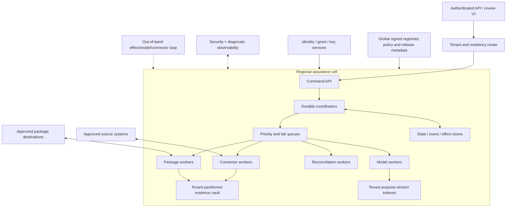

# Deployment, Scale, Cost, Incidents, and Staged Evolution

> **Purpose:** Promote one bounded capability at a time, pin the complete decision system, protect review and reconciliation capacity, and operate every stage with measurable recovery and rollback evidence.

## Operating principle

Maturity expands the number of proven profiles, connectors, tenants, and bounded effects. It does **not** turn the system into an autonomous compliance authority. The ceiling remains human-owned applicability, professional judgment, independence, exception disposition, attestation, and report issuance.

## Release unit

Deploy and evaluate a release manifest, not “the model.”

```yaml
release_manifest_id: rel_2026_08_31_4
behavior_bundle: compliance-audit/2026.08.31-rc4
application: compliance-audit-service@4.8.0
control_catalog_release: nist-800-53-r5-upd1
control_profile_release: internal-access-review@12.0.0
mapping_release: access-crosswalk@7.1.0
procedure_release: quarterly-access-review-toe@12.0.0
sampler_release: deterministic-stratified@3.2.1
workflow_definitions:
  engagement: engagement-flow@6.1.0
  evidence_request: evidence-request-flow@3.4.0
  exception: exception-flow@2.2.0
schemas:
  command_event_effect: 5.0.0
  evidence_manifest: 3.2.0
  workpaper: 4.1.0
  package_manifest: 2.0.0
policy_bundle: assurance-policy@8.4.0
connector_compatibility:
  okta-system-log-v2: [2.7.0]
  github-audit-v3: [3.4.1]
transforms:
  identity-events: 4.2.0
sampling_algorithms:
  deterministic-random-without-replacement: 2.1.0
models:
  mapping: {provider: approved-provider-2, model: reasoner-r7, prompt: map-v9}
  evidence: {provider: approved-provider-2, model: extract-s4, prompt: evidence-v12}
renderers:
  audit-package-html-pdf: 6.0.0
evaluation_suite: eval-compliance-audit@10.3.0
build_provenance: provenance://build/rel_2026_08_31_4
approved_by: [human:platform_owner_5, human:assurance_risk_3]
```

Active engagements pin this manifest plus their control profile. A runtime may support several pinned manifests during a safe migration period.

## Deployment topology



Keep evidence bytes, tenant keys, indexes, and most operational state inside the approved cell/region. Global services distribute signed metadata and policy, not unrestricted evidence.

## Stage contract overview

Each stage below is a promotion gate. If a previous-stage invariant regresses, reduce authority or roll back even when the new feature itself works.

## Stage 0 — Qualify and govern

| Contract | Requirement |
| --- | --- |
| **Authority** | No production data, model call on engagement evidence, connector credential, or operational effect. |
| **Architecture** | Draft system-of-record boundaries, trust/data flows, source/licensing registry, role/SoD matrix, manual baseline and fallback. |
| **Inputs/outputs** | Inputs: candidate process, standards, systems, data, risks, costs. Outputs: signed scope, profile plan, authority/effect matrix, privacy/security assessment, metrics, no-go conditions. |
| **State/events/effects** | Governance states only: `candidate`, `qualifying`, `approved_for_offline_replay`, `rejected`, `deferred`. No external operational effects. |
| **Approvals** | Engagement/process, qualified profile, data, privacy/security, independence, platform, and rights/procurement owners. |
| **Recovery** | Revoke test grants, quarantine/delete unauthorized test data, preserve governance decisions, correct scope. |
| **Evaluation** | Baseline fit/cost; threat model; data/rights/role completeness; manual failure walkthroughs. |
| **Exit gate** | 100% in-scope IDs/data/effects/roles have owner/policy; every source has version/rights/refresh metadata; zero unowned critical boundary question; baseline and thresholds approved. |

Detailed design: [Workload fit, scope, and accountability](01-workload-fit-scope-and-accountability.md).

## Stage 1 — Offline replay and shadow

| Contract | Requirement |
| --- | --- |
| **Authority** | C0/C1 on synthetic or explicitly approved historical projections; production effect routes/credentials absent. |
| **Architecture** | Durable state/events, version registries, context builder, bounded model worker, validators, vault/provenance, policy, sandbox workbench, separate telemetry. |
| **Inputs/outputs** | Frozen labeled engagements produce typed proposals, replay transitions, lineage manifests, sandbox reviews, and `would_dispatch` records. |
| **State/events/effects** | Production schemas with `execution_mode=shadow`; all effects terminal as `would_dispatch`, never routed. |
| **Approvals** | Historical-data use, source rights, evaluation corpus, blinded reviewers, thresholds, and promotion owner. |
| **Recovery** | Replay events, rebuild context/indexes, quarantine malformed data, delete expired non-held shadow copies, prove no effect. |
| **Evaluation** | Mapping/extraction/citation/abstention, hard controls, reviewer burden, context continuity, deterministic replay, security and failure injection. |
| **Exit gate** | All hard controls pass; every accepted citation resolves; deterministic outputs replay; approved quality/cost/reviewer thresholds pass by slice; recovery loses no authoritative record. |

Detailed design: [Reference architecture, runtime, and authority](02-reference-architecture-runtime-and-authority.md).

## Stage 2 — Evidence-request MVP

| Contract | Requirement |
| --- | --- |
| **Authority** | C2 for allowlisted reversible requests/reminders/cancellation and read-only named-source collection; human accepts evidence. |
| **Architecture** | Production request service, effect ledger/gateway, hardened connectors, quarantine, immutable versions, provenance, intake review, reconciliation, kill switch. |
| **Inputs/outputs** | Approved requests/source grants/query contracts and submissions produce reconciled states, raw manifests, receipts, limitations, quarantines, and candidate classifications. |
| **State/events/effects** | Request lifecycle and collection/artifact events; only explicitly allowed request/read effects. Sampling/package effects denied. |
| **Approvals** | Requester scope/data class; source owner grant; privacy/security sensitive path; independent acceptance per policy; elevated bulk/external request. |
| **Recovery** | Reconcile unknown creates, resume cursors, overlap/dedupe events, preserve partial results, quarantine schema drift, revoke grants, manual collection. |
| **Evaluation** | Exact target/dedupe, lineage/completeness, connector drift/outage/order/retention, injection/malware/isolation, reviewer/custodian burden and cost. |
| **Exit gate** | Every effect has semantic ID and verified terminal state; all downstream-used artifacts have complete required manifests; no duplicate/silent truncation/cross-tenant/lost-version fault; drills pass. |

Detailed design: [Evidence requests, connectors, and immutable lineage](04-evidence-requests-connectors-and-lineage.md).

## Stage 3 — Approved sampling and TOD/TOE support

| Contract | Requirement |
| --- | --- |
| **Authority** | C3 for exact approved plan digests: freeze population, deterministic selection, approved reads, candidate workpapers. No method/sample-size/replacement/conclusion authority. |
| **Architecture** | Population registry, deterministic sampler, plan signature verification, workpaper/test service, contradiction index, review surface. |
| **Inputs/outputs** | Approved procedures/populations/parameters/evidence produce frozen population/sample manifests, test steps, cited facts, gaps/conflicts, candidate observations. |
| **State/events/effects** | Versioned population/sample/test states; no new external effect beyond evidence reads/requests. |
| **Approvals** | Qualified person approves population, method, size, strata, seed, replacement, steps and deviations; independent review as policy requires. |
| **Recovery** | Rebuild from manifests, resume without reselection, retain unavailable items, invalidate affected work after withdrawn input, route ambiguity. |
| **Evaluation** | Population reconciliation, sample reproducibility, no silent replacement, fact/citation/temporal and contradiction quality, reviewer workload, source/model outages. |
| **Exit gate** | Identical input reproduces identical ordered sample; every item’s disposition traceable; every workpaper resolves exact inputs; zero forbidden method/replacement/conclusion path; fault drills pass. |

Detailed design: [Sampling, test design, and control assessment](05-sampling-test-design-and-control-assessment.md).

## Stage 4 — Independent review and package freeze

| Contract | Requirement |
| --- | --- |
| **Authority** | C3 plus dual-controlled internal package freeze. C4 external delivery disabled; model remains proposal-only. |
| **Architecture** | Real-actor SoD/independence, review workbench, exception service, stale-decision detection, deterministic package builder/renderer, immutable freeze. |
| **Inputs/outputs** | Candidate work/evidence/conflicts/management responses/retests produce decisions, exceptions, validation reports, and exact candidate/frozen packages. |
| **State/events/effects** | Review/exception/package states; freeze is a controlled internal effect; external destination absent from allowlist. |
| **Approvals** | Current independent reviewer binds exact input; exception roles follow policy; freeze requires named hierarchy and reauthentication. |
| **Recovery** | Reject stale approval, reopen affected work, supersede not overwrite, deterministic rebuild, reconcile freeze unknown, block missing review. |
| **Evaluation** | SoD bypass, rubber-stamp signals, exception correctness, referential integrity/render repeatability, classification/open-item treatment, late evidence/profile drift. |
| **Exit gate** | No prohibited self-review; all decisions bind exact manifests/policy/conflict check; exception transitions authorized; identical builds match digests; failure/reopen drills pass. |

Detailed design: [Reviewer independence, exceptions, and audit packages](07-review-independence-exceptions-and-audit-packages.md).

## Stage 5 — Bounded package delivery

### Stage 5 authority

C4 only for an exact frozen package version, exact approved destination, named recipient class, delivery window, and effect budget. The package approval does not authorize a changed version or recipient. The system still cannot issue an attestation or audit opinion.

### Stage 5 architecture

Add a separately identified delivery worker, destination registry, reauthentication/dual-control service, DLP/classification gate, operation reservation, receipt/reconciliation adapter, canary policy, delivery kill switch, and post-delivery access/revocation monitoring where the destination supports it.

### Stage 5 inputs and outputs

Inputs: frozen manifest/digest, exact freeze approval, destination/recipient record, disclosure policy, current auth/independence/incident state. Outputs: authorized effect envelope, attempt records, destination receipt/version, reconciled `delivered` state, or explicit rejection/unknown/incident.

### Stage 5 state, events, and effects

Package moves `frozen → delivery_authorized → dispatching → delivered | delivery_unknown | delivery_rejected → reconciled`. The only new effect is `package.deliver` for allowlisted adapters. A retraction, corrected delivery, access revocation, or supplement is a distinct authorized effect linked to the original; it never erases history.

### Stage 5 approvals

Two-person or applicable engagement-policy approval binds package ID/version/digest, destination, recipient, purpose, classification, expiry, and delivery method. Commit-time policy verifies current session/MFA, scope, hold/use restrictions, incident mode, recipient allowlist, and effect budget. Qualified professionals separately own any report/attestation transmitted with or derived from the package.

### Stage 5 recovery

After timeout, query the destination by operation/correlation key or immutable object version before retry. On wrong recipient, content, or access: stop delivery, revoke access if possible, preserve incident evidence, notify accountable roles, determine recall/correction externally, and create a new package/effect if authorized. Roll back application release without deleting the delivered record.

### Stage 5 evaluation

- exact manifest/destination/recipient/classification binding;
- duplicate dispatch, timeout-before/after-commit, partial upload, corrupt checksum, wrong endpoint, expired approval, revoked actor, hold/use restriction, and destination outage;
- DLP and package minimization;
- reconciliation time and manual intervention;
- canary recipient workflow and external accessibility verification;
- package delivery cost, operator burden, and incident response drill.

### Stage 5 measurable exit gate

Stage 5 passes only when:

1. 100% of canary deliveries bind the exact approved package digest and allowlisted destination/recipient and verify destination checksum/version where supported;
2. fault injection creates no duplicate semantic delivery and every ambiguous commit reaches a reconciled or operator-owned terminal state within the approved objective;
3. wrong-destination, stale/expired approval, changed manifest, policy revocation, legal-hold/use restriction, and kill-switch tests prevent dispatch;
4. an end-to-end mistaken-disclosure drill proves containment, access revocation where supported, evidence preservation, notification ownership, and correction workflow;
5. service SLOs, manual capacity, cost, and rollback gates pass for the bounded canary period; and
6. assurance leadership confirms that delivery automation does not issue or imply an agent-owned conclusion.

## Stage 6 — Multi-tenant scale and governed continuous evolution

### Stage 6 authority

No new conclusion authority. Scale retains C0–C4 per tenant/engagement/profile/effect. High-risk profiles or tenants can remain at lower stages. Continuous collection is authorized as named queries/checkpoints, not as a continuous compliance opinion.

### Stage 6 architecture

Add regional/risk cells, signed global registries, tenant/residency router, separate tenant keys/indexes/quotas, fair priority queues, autoscaling with hard caps, connector fleet lifecycle, capacity forecasting, continuous checkpoint service, multi-version runtime support, fleet canary/rollback, and disaster recovery.

### Stage 6 inputs and outputs

Inputs include many signed scopes/profiles/releases, per-tenant data/authority policies, source streams, engagement deadlines, and capacity budgets. Outputs remain the same typed evidence, decisions, effects, and packages plus fleet compatibility, fairness, drift, cost, capacity, and recovery records.

### Stage 6 state, events, and effects

No generic fleet-wide mutation. Tenant envelopes and aggregate versions remain mandatory. Add cell/profile/connector compatibility and migration events. Bulk effects decompose into item-level semantic operations with per-tenant budgets and a resumable campaign manifest.

### Stage 6 approvals

Each tenant/profile/effect retains its qualified owners. Fleet upgrades require platform, security/privacy, and assurance-risk approval. Cross-region movement, dedicated-tenancy changes, new providers/models/connectors, continuous evidence, and authority changes receive explicit impact review. No global admin UI may bypass engagement policy.

### Stage 6 recovery

Isolate a cell/tenant/connector/profile, shed optional model work, preserve reconciliation/security/review queues, route manual work, restore from tested backups, replay signed registry state, roll back compatible releases, and migrate only eligible engagements. Disaster recovery preserves region, keys, holds, versions, identities, and effect unknown states.

### Stage 6 evaluation

- cross-tenant/cell/region isolation under mixed batches, caches, queues, indexes, backups, and support access;
- weighted fairness, noisy-neighbor, burst, deadline, review-capacity, source-rate, and cost-cap tests;
- fleet profile/connector/model drift and multi-version compatibility;
- continuous-evidence late/schema/gap/change-point behavior;
- region/cell loss, restore, registry outage, key issue, provider outage, and fleet rollback;
- quality/cost/SLO slices per tenant/profile/connector/release, not aggregate only.

### Stage 6 measurable exit gate

Stage 6 passes only when:

1. active adversarial isolation tests show no cross-tenant data, context, cache, queue, index, key, backup, telemetry, or package exposure;
2. load tests sustain the approved peak/burst while reserved security/reconciliation/reviewer capacity meets its SLO and no tenant exceeds its configured fairness/error budget;
3. every active engagement resolves a compatible pinned profile/release/connector path, and an incompatible upgrade is blocked before work/effect;
4. cell-loss and restore drills meet approved recovery point/time objectives without losing committed domain/effect records or violating residency/hold;
5. fleet canary/rollback and continuous-evidence gap/change-point drills pass across representative risk tiers; and
6. per-tenant unit economics and manual-review capacity remain within approved budgets without lowering hard controls or hiding backlog.

### Stage 6 behavior-release and learning loop

Treat changes to models, prompts, control profiles, mappings, procedures, samplers, context builders, compactors, memory admission, connectors, canonicalization, policy, graders, workflow/state schemas, and package renderers as versioned behavior releases. Raw reviewer feedback, prior conclusions, exception outcomes, and production traces never write policy or memory automatically.

1. classify reviewed corrections, appeals, incidents, missed contradictions, source drift, connector/schema changes, and reviewer burden by failure class;
2. preserve a minimized, rights-cleared reproducer with exact tenant/profile/release labels or an approved de-identified equivalent;
3. add the case to the relevant offline, privacy, independence, security, continuity, and failure-injection suites;
4. compare the candidate behavior bundle with the pinned production baseline, including review minutes, contradiction recall, unsupported-claim rate, sampling integrity, lineage, latency, cost, and rare high-consequence slices;
5. run shadow and limited tenant/profile/task/effect canaries with named assurance, security/privacy, operations, and platform owners;
6. promote only after gates pass, record the full release lineage, and preserve an executable compatible rollback or forward-recovery path; and
7. monitor drift and regressions online, then automatically disable the affected behavior route—not controls—when a hard invariant fails.

Evolution never expands conclusion or effect authority implicitly. A new jurisdiction, control profile, evidence class, external destination, continuous-evidence use, lower review threshold, or stronger claim returns to the appropriate earlier stage and qualified approval process.

## Queue and backpressure design

Use separate workload classes because they have different consequence and resource behavior:

| Queue/class | Priority posture | Backpressure response |
| --- | --- | --- |
| Security containment / credential revocation | Reserved highest capacity | Never blocked behind model/document work; alert if saturated |
| Effect reconciliation / unknown delivery | Reserved high capacity | Stop admitting related effects before reconciliation starves |
| Human review / exception deadlines | Deadline and risk aware | Escalate capacity; shed/reduce draft work; never auto-approve |
| Evidence collection near source-retention cutoff | Deadline/source-window aware | Reserve connector quota, escalate manual export, record gap |
| Normal requests/collection | Weighted fair by tenant/engagement | Delay with visible ETA; respect source rate limit |
| Transform/OCR/model preparation | Bounded, cancellable | Defer, use smaller approved route, or manual fallback |
| Evaluation/backfill/reindex | Opportunistic | Pause first during pressure; never compete with recovery |
| Package build/delivery | Deadline/risk with separate effect budget | Queue exact manifest; do not rebuild or redeliver speculatively |

Apply admission control before accepting work that cannot meet source-retention, engagement, reviewer, or budget constraints. Bounded queues are safer than unlimited backlog. See [queues, scheduling, and backpressure](../../operations/queues-scheduling-and-backpressure.md).

## Multi-tenant fairness

- Weighted fair scheduling with per-tenant concurrency, byte, call, token, and effect limits.
- Separate source rate budgets so one tenant cannot exhaust a shared SaaS quota.
- Aging/deadline promotion bounded by risk policy; no starvation of small tenants.
- Batch only items with identical tenant, purpose, data class, provider route, profile/release compatibility, and authorization context.
- Per-tenant circuit breakers and kill switches; a connector/source outage should not halt unrelated cells.
- Reserve operator/reviewer capacity for high-consequence unknowns and exceptions.
- Expose accepted queue time and expected completion; never silently miss an evidence retention window.

## Capacity planning

Model each bottleneck separately:

| Resource | Demand driver | Capacity evidence |
| --- | --- | --- |
| Connector calls | records/pages, source rate limit, overlap/reconciliation, retries | calls/page bytes per accepted artifact, peak retention-window demand |
| Object/vault | raw/derived bytes, versions, package copies, retention | bytes per engagement/profile and restore/delete throughput |
| OCR/transform | pages/files/archives/schema complexity | service time and failure distribution by format/size |
| Model | tokens, evidence comparisons, retries, task route | input/output tokens and latency per accepted proposal by task |
| Reviewer | workpapers/exceptions, evidence complexity, rework, independence availability | minutes per decision and concurrent qualified reviewers |
| Package/render | objects/pages/redactions/recipient variants | build time, memory, digest/validation time |
| Reconciliation | effect/source event volume and ambiguous outcomes | unknown arrival rate and time-to-terminal |

Reviewer and source-system capacity often dominate before model inference. Include leave, deadline clustering, independence constraints, and incident/manual fallback in the forecast.

## Recovery-load and disaster-recovery drills

Recovery capacity is different from steady-state capacity. After an outage, the system must reconcile unknown effects, rebuild projections, recollect before source-retention windows close, restore legal-hold enforcement, and drain review/exception backlogs while new deadlines continue to arrive.

For each queue, estimate:

```text
net_recovery_drain_rate = recovery_service_rate - new_arrival_rate
recovery_clearance_time = durable_backlog / net_recovery_drain_rate
```

If `net_recovery_drain_rate <= 0`, the recovery plan is not viable. Admission control must reduce optional arrivals or qualified manual/technical capacity must increase. Model-worker autoscaling cannot repair a saturated source quota or independent-review queue.

Reserve and drill capacity for, in order:

1. security containment, credential/key recovery, tenant isolation, and hold enforcement;
2. unknown effect/delivery reconciliation and destination verification;
3. expiring source windows, evidence gaps, and committed acquisition receipts;
4. reviewer decisions, exceptions, and package deadlines requiring qualified independent people;
5. ordinary collection and model drafting; and
6. evaluation backfills, reindexing, and optional enrichment.

A regional/cell restore passes only when:

- engagement/event/effect ledgers reach signed high-watermarks or the RPO breach is explicit;
- tenant/residency routing, keys, grants, independence policy, retention, and legal holds are active before reads/effects;
- frozen packages and evidence versions resolve to the same digests and storage-version identities;
- `reserved`, `dispatched`, and `unknown` effects are reconciled before dispatch resumes;
- pinned behavior/profile/procedure/sampler/adapter releases remain executable or work is held for approved migration;
- queues remain tenant-fair while protected work meets recovery objectives; and
- a qualified owner decides any required evidence recollection, workpaper re-performance, package supplement, or report correction.

Test restore under representative production volume, unavailable source endpoints, expiring source retention, reviewer absence, partial key recovery, stale workers, and a simultaneous legal hold. A backup restore without this recovery load is not a DR test.

## Cost model

Track direct and hidden costs:

```text
cost_per_accepted_evidence =
  connector + transfer + storage + transform + model + reviewer + reconciliation + allocated_platform

cost_per_reviewed_control =
  accepted_evidence + rejected/rework + sampling + reviewer + exception + allocated_package

cost_per_delivered_package =
  all_control_work + rendering + delivery + retention + incident/quality allocation
```

Report alongside quality and cycle time:

- duplicate/unused evidence request cost;
- rejected/quarantined artifact and rework cost;
- model proposal acceptance and reviewer minutes saved/added;
- retention/storage/index and egress by data class;
- connector vendor/API and source-owner burden;
- exception aging and delayed package opportunity cost;
- cost of manual fallback and incidents.

Optimize safely by deterministic parsing first, minimal fields, source-side filters with completeness tests, artifact deduplication by authorized scope, caching pure results with exact version keys, smaller approved models for simple drafts, async batching within tenant/purpose boundaries, and avoiding re-render/recollection. Never reduce contradiction retrieval, reviewer independence, lineage, reconciliation, or security to save tokens.

## Upgrade and migration policy

| Change | Default treatment | Required evidence |
| --- | --- | --- |
| Prompt/model/provider | Shadow on pinned inputs; no active-case silent switch | Task slices, prohibited claims, review burden, data route, latency/cost, rollback |
| Control profile/mapping/procedure | New immutable version; explicit engagement impact decision | Source/maturity/rights diff, qualified approval, affected work/retest analysis |
| Connector/API/schema | Compatibility contract and canary; preserve raw old versions | Pagination/count/enum/time/rate/retention tests and replay |
| Transform/canonicalization/sampler | Treat as evidence/sample semantic change | Golden bytes/manifests, reproducibility, migration/no-migration decision |
| Workflow/state schema | Expand/contract compatibility and durable migration | Event replay, in-flight timers/effects/unknowns, rollback/forward recovery |
| Policy/identity/SoD | Deny-safe canary and active-assignment impact | Authorization/conflict suite and emergency-access review |
| Renderer/package schema | Candidate rebuild and exact diff; no frozen overwrite | Referential/classification/content diff and deterministic digest |
| Observability/eval | Must not alter execution state | load/privacy/drop tests and continuity of hard-control alerts |

Do not roll back by rewriting evidence or events. Application rollback must remain compatible with current schemas and in-flight state; otherwise forward-fix through a versioned migration. See [deployment, release, and incident response](../../operations/deployment-release-and-incident-response.md).

## Rollout sequence

1. Build signed artifacts and release manifest; verify supply-chain provenance.
2. Run schema/component/workflow/security/failure suites.
3. Replay representative pinned engagements.
4. Shadow proposals/effects against current operations.
5. Deploy dark with effects disabled and verify cell/telemetry/authorization.
6. Canary one tenant/profile/task/effect class with manual review and tight budgets.
7. Expand tenant/profile/effect independently, watching error budget, review capacity, source limits, and cost.
8. Promote only through named go/no-go authority.
9. Preserve prior compatible release and tested rollback/forward-recovery path.
10. Complete post-release review and add discovered failures to evaluation.

## Incident runbooks

| Incident | Immediate containment | Recovery and business/audit correction | Accountable owners |
| --- | --- | --- | --- |
| Wrong/cross-tenant evidence access | Stop tenant/cell reads/model/index/export; revoke grants; preserve security evidence | Identify artifacts/prompts/traces/packages/recipients; purge unauthorized copies where lawful; reperform affected work; notifications | Security incident commander, privacy/legal, tenant/engagement owner |
| Suspected evidence tampering | Quarantine versions; stop dependent package/effect; apply restricted hold | Verify source/access/digests; collect independent source; invalidate/reopen work; qualified impact decision | Security, evidence custodian, independent reviewer, engagement lead |
| Connector completeness/schema defect | Disable connector version; stop affected population/package progression | Preserve raw/partial data; correct adapter; recollect/reconcile; impact and retest affected work | Connector owner, source owner, engagement lead |
| Wrong profile/mapping/procedure | Freeze affected tasks/packages; stop conclusions/delivery | Version correction; compute affected engagements/work; qualified rescope/reperform/supplement decision | Profile steward, assurance lead, platform owner |
| Sample/population defect | Lock affected testing/package; preserve manifests | Correct population/plan via authorized new version; reselect/retest as methodology requires; disclose impact | Qualified tester/reviewer, engagement lead |
| Independence breach | Block decisions/freeze/delivery; preserve identity/conflict evidence | Reassign qualified reviewer; invalidate/review affected decisions; determine consultation/report impact | Assurance independence owner, engagement/signing lead |
| Unsupported model claim accepted | Stop affected model route/output class and package progression | Find dependent work/packages, human reassess, correct/supplement as authorized; regression suite | Model/platform owner, independent reviewer, assurance risk |
| Duplicate/wrong request or delivery | Kill effect class; revoke destination access where possible; reconcile | Determine exact downstream state; cancel/recall/correct through authorized effects; stakeholder notification | Effect/platform owner, engagement lead, security/privacy if disclosure |
| Retention/legal-hold error | Stop deletion lifecycle; preserve remaining copies and logs | Restore if authorized/possible; verify derived/backups; legal/privacy impact and corrective control | Records/legal/privacy owner, platform owner |
| Model/provider outage | Disable route, preserve queues, use manual/deterministic path | Capacity recovery, backlog risk prioritization, safe canary re-enable | Platform/SRE, engagement operations |
| Reviewer backlog/SLO breach | Pause low-priority drafting/collection; protect deadlines and source windows | Add qualified capacity, reschedule transparently, rescope only by human decision | Engagement/assurance operations owner |
| Cost or retry storm | Admission control/circuit breaker; stop optional jobs | Identify source/task/tenant, correct retry/idempotency, replay bounded work | SRE/FinOps/connector owner |

Runbooks distinguish technical restoration from business/audit correction. Restoring a database does not decide whether a workpaper, package, or issued report must be re-opened or corrected. Use [deployment, release, and incident response](../../operations/deployment-release-and-incident-response.md).

## Observability and SLO operations

Dashboards should show:

- engagement/control/request/test/review/exception/package counts and ages;
- source freshness, cursor/watermark, retention-window risk, rate limits, schema compatibility;
- artifact/provenance completeness and integrity failures;
- effect/delivery attempts, unknowns, reconciliation time, duplicates prevented;
- reviewer capacity, decision/rework/override rates, independence denials, rubber-stamp indicators;
- model task quality proxies, abstention/rejection/citation/claim failures by version/slice;
- queue admission/depth/age, cell saturation, manual fallback capacity, SLO/error budgets;
- tenant/profile/release drift and cost per accepted evidence/control/package.

Keep domain audit records and diagnostic telemetry separate as defined in [Reliability, observability, evaluation, and failure injection](09-reliability-observability-evaluation-and-failure-injection.md).

## Operational ownership

| Concern | Primary owner | Required backup/consultation |
| --- | --- | --- |
| Engagement deadline/scope | Engagement lead | Qualified assurance/signing role |
| Profile/mapping/procedure | Profile steward | Legal/regulatory/technical specialists as applicable |
| Source/connector completeness | Connector and source owner | Evidence custodian, reviewer |
| Reviewer/exception capacity and independence | Assurance operations/independence owner | Engagement lead, HR/governance as applicable |
| Runtime/state/effects/reconciliation | Platform/SRE | Connector/package owners |
| Security/privacy/retention/hold | Security, privacy, records/legal owners | Tenant/data/engagement owners |
| Release/promotion/rollback | Platform owner plus assurance-risk approver | Security/privacy, operations, profile owners |
| Cost/value | Product/FinOps/process owner | Reviewer and source-owner representatives |
| Attestation/report | Qualified authorized professional/organization | Never the agent/platform owner |

## Go-live checklist

- [ ] Stage-specific authority allowlist is enforced and higher-stage effects are technically absent or denied.
- [ ] Release, profile, mapping, procedure, connector, model/prompt, policy, sampler, schema, transform, renderer, and evaluation versions are pinned.
- [ ] Hard controls and representative task/trajectory/security/failure suites pass.
- [ ] Queue admission, fair scheduling, source-rate, reviewer, reconciliation, and manual-fallback capacity meet approved loads.
- [ ] SLOs/error budgets, alerts, runbooks, on-call and accountable business/assurance owners are active.
- [ ] Kill switches, credential revocation, backup/restore, rollback/forward recovery, unknown-effect reconciliation, and mistaken-disclosure drills pass.
- [ ] Cost per accepted evidence/control/package is within the approved value case without weakening safeguards.
- [ ] Canary scope, stop criteria, rollback target, and go/no-go authority are recorded.
- [ ] Stage 6 tenants/profiles retain independent maturity/authority; fleet scale does not grant implicit promotion.

## Anti-patterns

| Anti-pattern | Failure | Correction |
| --- | --- | --- |
| Big-bang launch across frameworks | Source rights, procedures, connectors, reviewers, and failure modes differ | One profile/connector/effect at a time |
| “Latest” model/profile/connector in active work | Makes decisions irreproducible and can change semantics mid-engagement | Complete release/profile pins and explicit migration |
| Autoscale model workers only | Reviewer, source, vault, renderer, or reconciliation becomes hidden bottleneck | Capacity plan every resource and admission limit |
| Unlimited queue preserves work | Dead work exceeds source/deadline/reviewer capacity and raises cost | Bounded admission, visible deferral, risk/deadline/fair scheduling |
| Retry delivery on timeout | Can duplicate confidential disclosure | `unknown` plus destination reconciliation |
| Global admin bypass | Defeats tenant/purpose/independence controls | Emergency access policy, dual control, logging, time bound, review |
| Rollback rewrites records | Destroys reconstruction and can corrupt in-flight effects | Compatible code rollback or versioned forward migration |
| Scale means broader autonomy | Operational maturity does not create professional authority | Keep C0–C4 bounded; human conclusion remains fixed boundary |
