# Integration Qualification and Audit-Package Walkthroughs

> **Purpose:** Turn a named API, export, portal, warehouse, or protocol into a qualified evidence capability, then show how exact source records become independently reviewed, reproducible packages without transferring control-operation or assurance authority to the agent.

## Start with a proof obligation, not a vendor logo

A connector is production-ready only for a named claim under a pinned configuration. “Connected to GitHub,” “uses WORM storage,” or “supports OSCAL” says almost nothing about evidence quality.

Before integration work, write one sentence:

> For tenant `T`, period `P`, and procedure `R`, this capability can acquire fields `F` from resources `S` with the stated identity, time, population, freshness, completeness, retention, and authorization limits.

If a supported export and a short deterministic checklist satisfy the proof obligation, do not add an agent or MCP server. Prefer, in order:

1. an authenticated read-only API or source-generated export;
2. a narrow organization-owned adapter with typed receipts;
3. an evidence portal for authenticated manual submissions;
4. isolated browser automation only for a source with no supported API/export; and
5. MCP only when an already-governed MCP capability is narrower and easier to qualify than a direct adapter.

The model never decides that an adapter is qualified. Connector, source, security/privacy, records, and assurance owners approve the exact capability.

## Keep neighboring authorities separate

| Category | Owns | This blueprint may consume | This blueprint must not do |
| --- | --- | --- | --- |
| [Regulatory Intelligence](../regulatory-intelligence-agent/README.md) | Monitor official publications, effective dates, applicability questions, and approved change briefs | A version-pinned, approved requirement/profile change input | Infer legal applicability, silently activate a new obligation, or advise a regulator |
| [Identity and Access Governance](../identity-access-governance-agent/README.md) | Resolve authoritative identity/access facts and execute approved grants/revocations through IAM/IGA/PAM controls | Read-only access snapshots, review decisions, and reconciled effect receipts | Grant, revoke, certify, or remediate access; let an assessed operator approve its own evidence |
| Control and service operators | Design, configure, run, monitor, and remediate the control | Source facts, approved explanations, and remediation evidence | Change the control it is independently evaluating |
| Compliance audit and control evidence | Request, acquire, preserve, sample, test-support, review, and package evidence | Pinned authoritative outputs from the categories above | Inherit their conclusion or effect authority |

A request to “fix the failed access review” leaves this category. It opens a separately authorized operator workflow, whose resulting facts return later as remediation and retest evidence.

## Qualification lifecycle

```mermaid
stateDiagram-v2
    [*] --> Discovered
    Discovered --> Rejected: no valid proof obligation / unsafe authority
    Discovered --> Quarantined: manifest and test fixture registered
    Quarantined --> Qualified: contract and failure suite approved
    Qualified --> Shadow: production-shaped reads; no downstream use
    Shadow --> Canary: bounded tenant / resource / procedure
    Canary --> Active: promotion evidence approved
    Active --> Degraded: freshness / completeness / availability impaired
    Active --> Quarantined: schema, auth, isolation, or integrity failure
    Degraded --> Active: reconciled and requalified
    Degraded --> Revoked: limit cannot be repaired
    Quarantined --> Revoked: security or semantic failure
    Active --> Revoked: retired or permission removed
    Revoked --> [*]
```



Qualification expires. Re-run it after an API/schema/auth change, source configuration change, connector release, new evidence class, new tenant risk tier, changed query, or incident.

## Adapter manifest and release identity

Use immutable, semantically versioned manifests. A patch may fix code without changing normalized meaning; a minor version may add an optional field; a major version changes query, identity, completeness, ordering, canonicalization, or effect semantics. When uncertain, treat the change as semantic. The manifest below is an illustrative organization-local contract, not a claim about current vendor permission names or API limits.

```yaml
schema_name: compliance.adapter_manifest
schema_version: 1.0.0
adapter_release: github-org-audit/4.2.0
source_product: github-cloud
source_api_or_export: org-audit-log-rest
source_contract_checked_at: 2026-08-31
tenant_binding: required
resource_binding: [enterprise_id, organization_id]
capabilities:
  - name: read_audit_events
    mode: read_only
    fields: [event_id, action, actor_id, created_at, resource_ids, payload]
    maximum_period_days: 30
    maximum_pages: 500
    effect_class: none
auth:
  grant_type: installation_token
  required_source_permissions_ref: source-grant-policy/github-org-audit/v3
  credential_audience: github-api
time_semantics:
  source_timestamp: created_at
  observed_at: gateway_clock
  timezone: UTC
pagination:
  strategy: cursor
  stable_order: source_documented
  overlap: PT10M
  dedupe_key: source_event_id
completeness_tests: [all_pages_terminal, no_cursor_loop, count_reconciled]
known_limits: [source_retention_applies, late_events_possible]
data_classes: [identity_metadata, security_event]
retention_profile_allowlist: [audit-evidence-7y]
owner_ids: [connector-team, source-owner]
qualification_report_id: aq_01K...
manifest_sha256: "..."
```

The runtime pins `adapter_release` and the complete qualification report. It never resolves `latest` during an engagement.

## Common conformance suite

Every adapter must pass the same behavioral contract even when vendors expose different APIs.

| Test family | Required cases | Hard failure |
| --- | --- | --- |
| Identity and scope | Wrong tenant/account/project, renamed resource, deleted/recreated resource, ambiguous display name | Data registered without stable tenant/resource binding |
| Authorization | Missing scope, expired/revoked grant, overbroad grant, commit-time recheck | Adapter proceeds on denial or silently broadens scope |
| Time | UTC/local conversion, DST, inclusive/exclusive boundaries, delayed/retroactive events, clock skew | Period membership cannot be reproduced |
| Pagination and volume | Empty page with cursor, duplicate page, cursor loop, truncation, byte/page cap, retry after partial page | Partial data labelled complete |
| Ordering and updates | Late/out-of-order events, update/delete, reused IDs, source correction | Old and new facts collapse into one mutable record |
| Schema | Missing optional/required field, unknown enum, type widening, old/new payload | Unknown semantics normalized as a known status |
| Freshness | Source lag, collection lag, stale cache, unavailable watermark | Stale evidence accepted without explicit limit |
| Completeness | Independent count, boundary probes, event/export comparison, source-retention cutoff | Completeness claimed without a defined population/query |
| Security | Injection text, malicious file/archive, SSRF URL, secret, cross-tenant cache, log leakage | Evidence controls the agent or reaches an unauthorized route |
| Effects | Lost response after commit, duplicate request, cancellation race, webhook loss | Blind retry can duplicate request, disclosure, or package |
| Lifecycle | Retention expiry, legal hold, deletion, source correction, backup restore | Hold/deletion semantics are untestable or inconsistent |
| Recovery | Worker loss, cursor loss, regional restore, old adapter replay | Recovered output differs without a versioned correction |

Store fixtures, expected canonical bytes, source stubs, error cases, rate-limit behavior, and approval evidence in the qualification report. A live “smoke test passed” is not conformance.

## Source-family qualification map

### GRC platforms and control libraries

Use a control library to exchange publisher identity, source version, stable identifiers, parameters, tailoring, and explicit mapping relationships—not to create a universal control truth.

| Representative capability | Qualify | Do not infer |
| --- | --- | --- |
| [NIST OSCAL](https://pages.nist.gov/OSCAL/learn/concepts/layer/) catalog/profile/assessment artifacts | Exact OSCAL release, producer/consumer support, schema plus semantic rules, profile-resolution output, extensions, import/export loss | Schema validity means correct applicability, mapping, evidence, or assessment result |
| [OSCAL control mappings](https://pages.nist.gov/OSCAL/learn/concepts/layer/control/mapping/) | Source/target versions, relationship direction, elements, conditions, exclusions, reviewer approval | Similar control text is equivalent or transferable |
| [AWS Audit Manager evidence](https://docs.aws.amazon.com/audit-manager/latest/userguide/how-evidence-is-collected.html) | Automated/manual source, assessment/control/source identity, collection frequency, `inconclusive` handling, evidence lag and export fields | Native assessment status is an independent compliance conclusion |
| [ServiceNow evidence requests](https://www.servicenow.com/docs/r/governance-risk-compliance/audit-management/request-evidence.html) | Instance/release, request/workflow states, owner identity, due/reminder semantics, confidentiality, attachment versions and storage links | Closed request means evidence is sufficient or accepted |

As checked on 2026-08-31, OSCAL profile resolution remains a version-sensitive interoperability process, and NIST’s mapping model represents structured relationships rather than boolean equivalence. AWS documents multiple evidence source types and possible collection/review delay. Recheck these facts before each adapter release.

### Cloud, IAM, source control, CI/CD, and tickets

| Source | Representative evidence | Qualification focus |
| --- | --- | --- |
| AWS/Azure/GCP | resource configuration, policy evaluation, asset history, activity logs | Account/project/subscription binding; native state vocabulary; evaluation/event lag; retention; region; pagination; exemptions/unknowns |
| Okta/Entra/IGA/PAM | users, groups, grants, access reviews, privileged sessions, system events | Stable subject/resource identity; effective dates; nested/effective access; event retention; deactivation; service-account behavior |
| GitHub/GitLab/source host | commits, branch rules, pull requests, reviews, audit events | Organization/repository ID; actor mapping; force-push/deletion; retention; pagination/order; bot actions; enterprise versus org visibility |
| CI/CD orchestrator | pipeline definition, immutable run/job/step, approvals, artifacts, deployment evidence | Definition digest; rerun identity; environment; artifact provenance; approver authority at event time; retention; manual override |
| Jira/ServiceNow/change system | change/ticket fields, approvals, transitions, attachments | Workflow/configuration version; history versus current snapshot; actor identity; webhook expiry/loss; field permissions; reopened/cancelled semantics |

Native “compliant,” “successful,” “approved,” or “closed” is preserved as `source_assertion` with source, version, scope, and time. It is never normalized into the audit reviewer’s decision.

### HR, payroll, and finance sources

These sources are highly customized and sensitive. Default to source-owned minimized views rather than broad HR/ERP access.

| Proof obligation | Minimum source facts | Qualification questions |
| --- | --- | --- |
| Leaver access timeliness | Stable worker ID, employment status/effective time, authoritative source event, IAM disable time | Retroactive corrections? future-dated events? rehire identity? timezone? contingent worker source? |
| Access-review population | Worker identity, manager/control owner at cutoff, employment/leave status | Effective-dated hierarchy? multiple assignments? missing manager? restricted worker class? |
| Journal approval | Transaction/line ID, creation/posting, amounts, submitter, approver, approval time/state | Does history include create/delete? line changes? override/batch/system actor? approval authority at event time? |
| Vendor/master-data change | Stable record/field, old/new value, actor/role/interface/time | Unsupported record/field? masked values? custom configuration? deletion trail? integration actor attribution? |

[Oracle NetSuite System Notes](https://docs.oracle.com/en/cloud/saas/netsuite/ns-online-help/article_160225379741.html) and System Notes v2 have different scope. The [line-level audit trail](https://docs.oracle.com/en/cloud/saas/netsuite/ns-online-help/section_N557476.html) documents that it tracks updates, not line creation or deletion, and configuration can suppress creation notes. Therefore, “queried system notes” is not a completeness claim. HRIS APIs similarly require deployed-role, effective-date, worker-type, field-security, and correction tests; public API names are insufficient.

### Audit request portals and manual submissions

An evidence portal should create an authenticated acquisition path, not a drag-and-drop truth machine.

Require:

- request ID/version, tenant, submitter real-person/workload binding, source owner, requested period and fields;
- upload session, original filename/MIME/size/digest, client and server observation time, malware/archive result;
- submitter statement distinguishing source-generated export from prepared spreadsheet or screenshot;
- completeness questions and explicit `unknown` answers;
- attachment versioning, confidentiality, access list, due/reminder history, withdrawal/correction links;
- quarantine before parsing/indexing/model use; and
- reviewer acceptance separate from successful upload or request closure.

Do not use email attachment arrival as authenticated source identity. Do not overwrite a submission when its owner corrects it.

### Object storage and WORM controls

WORM is useful for preservation, but its guarantee is narrow and product/configuration specific.

| Store | Current documented behavior to qualify | Audit design consequence |
| --- | --- | --- |
| [Amazon S3 Object Lock](https://docs.aws.amazon.com/AmazonS3/latest/userguide/object-lock.html) | Versioning required; retention/holds protect a named version; governance can be bypassed with permission; compliance is stronger; new versions/delete markers remain possible | Pin bucket, key, version ID, mode, retain-until, hold state and permission snapshot; never trust “current object” alone |
| [Azure immutable blob storage](https://learn.microsoft.com/en-us/azure/storage/blobs/immutable-storage-overview) | Time-based retention and legal holds have container/version-level configuration dependencies | Test the exact account/container/versioning policy and delete/overwrite path |
| [Google Cloud Object Retention Lock](https://docs.cloud.google.com/storage/docs/object-lock) | Locked retention has irreversible constraints | Separate qualification environment; dual-control policy activation; rehearse lifecycle before lock |

A digest proves byte equality, not source truth, completeness, correct time, legal admissibility, or reviewer sufficiency. Legal hold blocks deletion but must not grant read access. A deletion planner enumerates raw, derived, index, cache, export, replica, and backup copies, then records `deleted`, `held`, `expired_unrecoverable`, or `pending_backup_expiry` per object version.

### E-signature and attestation systems

Keep four objects distinct: document bytes, signer authentication/e-sign provider receipt, signed agreement state, and the audit reviewer’s use of the attestation.

Qualify agreement/document/signer IDs, provider account, authentication method as attributed metadata, event time, completed/cancelled/replaced state, audit trail, downloaded bytes/digest, webhook verification, authoritative poll, retention, and correction process. As checked on 2026-08-31, [Adobe Acrobat Sign documents](https://helpx.adobe.com/au/sign/developer/webhook/overview.html) a 10 MB webhook payload limit and field trimming; therefore a webhook is a wake-up hint and receipt, not the complete signed artifact. Poll the exact agreement/document version after the event.

The agent may route an approved attestation request and preserve the response. It cannot decide that an e-signature satisfies a particular law, independence rule, management-representation requirement, or assurance conclusion.

### Data warehouses and evidence lakes

A warehouse is often a derived aggregation point, not the original system of record. Preserve upstream source and transformation receipts.

| Representative source | Current limitation to encode | Required adapter behavior |
| --- | --- | --- |
| [BigQuery audit logs](https://cloud.google.com/bigquery/docs/reference/auditlogs) | Multiple message generations; 100 KB log-entry limit; logs may contain sensitive SQL/schema/resource data | Detect truncation/version, minimize extracts, qualify event coverage, combine only with approved complementary sources |
| [BigQuery time travel](https://cloud.google.com/bigquery/docs/time-travel) | Configurable two-to-seven-day window; default seven days | Treat as short recovery, not long-term evidence archive; capture cutoff/window in receipt |
| [Snowflake ACCESS_HISTORY](https://docs.snowflake.com/en/sql-reference/account-usage/access_history) | Up to 180-minute latency; documented query/statement and sharing limitations | Delay completeness decision, record edition/view/latency, test covered statement types and provider/consumer visibility |

Also pin catalog/database/schema/table/view IDs, query text or approved query ID, engine/timezone, isolation/snapshot semantics, row count, boundary probes, query plan/job ID, output digest, access policy, and upstream load watermark. A materialized audit table needs its own load/transform lineage and late-data policy.

### MCP only when it improves the boundary

MCP can standardize tool discovery/invocation; it does not standardize audit evidence semantics, connector qualification, source authority, tenant isolation, completeness, or side-effect reconciliation.

Use MCP only if all are true:

- the server is organization-approved and narrower than giving the model a general API credential;
- the exact server, protocol date, tool name/schema, annotations, transport, auth, upstream source, and release are pinned;
- the client wraps results in the same acquisition receipt and evidence gateway used by direct adapters;
- tool annotations and returned content remain untrusted data;
- read tools are separated from request/export/delivery effects;
- OAuth audience/resource binding, least privilege, secret handling, and no token passthrough are verified; and
- task identity, authorization binding, TTL, cancellation, result retrieval, and cross-tenant isolation are tested when tasks are enabled.

As checked on 2026-08-31, the [MCP 2025-11-25 authorization specification](https://modelcontextprotocol.io/specification/2025-11-25/basic/authorization) requires resource indicators when HTTP authorization is used, and official guidance forbids token passthrough. [MCP tasks](https://modelcontextprotocol.io/specification/2025-11-25/basic/utilities/tasks) are experimental and require authorization-context binding where available; an unauthenticated server should not expose task listing. Pinning and refresh tests are mandatory because the protocol evolves.

## Evidence acquisition receipt

One receipt records what the adapter actually observed. It does not claim the source was complete or the evidence sufficient.

```yaml
schema_name: compliance.evidence_acquisition_receipt
schema_version: 1.0.0
receipt_id: ear_01K...
tenant_id: tenant-42
engagement_id: audit-2026-q3-17
request_id: er_019
attempt_id: attempt_01K...
adapter_release: github-org-audit/4.2.0
qualification_report_id: aq_01K...
source:
  system: github-cloud
  account_id: enterprise-91
  resource_ids: [org-441]
  query_id: query-approved-access-reviews/v3
  query_digest: "sha256:..."
  period: {from: 2026-04-01T00:00:00Z, to_exclusive: 2026-07-01T00:00:00Z}
observation:
  source_watermark: 2026-07-01T00:15:00Z
  collected_from: 2026-08-31T02:10:00Z
  collected_to: 2026-08-31T02:11:42Z
  pages: 19
  records_observed: 1842
  raw_manifest_id: rawm_77
  canonical_artifact_id: ev_811
  raw_sha256: "..."
  canonical_sha256: "..."
freshness:
  state: within_procedure_bound
  age_seconds: 5280
  approved_bound_seconds: 86400
completeness:
  state: full_for_query_not_source_universe
  pagination_terminal: true
  independent_count: {value: 1842, method: source_summary_endpoint}
  known_gaps: [source_retention_before_2026-01-01]
lifecycle:
  retention_profile: audit-evidence-7y/v2
  retain_until: 2033-09-01T00:00:00Z
  legal_hold: {state: none, checked_at: 2026-08-31T02:12:00Z}
  deletion_state: not_due
limitations: [late_events_possible]
result: registered_with_limitations
receipt_sha256: "..."
```

Use closed vocabularies:

- freshness: `within_procedure_bound`, `late_source`, `late_collection`, `stale`, `not_applicable`, `unknown`;
- completeness: `full_for_query`, `full_for_query_not_source_universe`, `partial`, `truncated`, `retention_limited`, `schema_limited`, `conflicting`, `unknown`;
- deletion: `not_due`, `scheduled`, `blocked_by_hold`, `deleted`, `pending_replica_or_backup`, `expired_unrecoverable`, `failed_unknown`;
- hold: `none`, `requested`, `active`, `release_requested`, `released`, `conflict_unknown`.

Only an authorized procedure/reviewer decides whether a receipt’s limits permit testing.

## Typed campaign, job, attempt, evidence, decision, and effect chain

Do not overload a single `status` record.

| Contract | Identity | Purpose | Terminal examples |
| --- | --- | --- | --- |
| Campaign/engagement | tenant + engagement + scope/profile releases | Binds period, controls, roles, deadlines, policies | closed, cancelled |
| Collection/test job | procedure + source/query/population + planned input manifest | Defines repeatable work | completed, limited, failed, cancelled |
| Attempt | job + attempt number + worker/release | Records one execution and failure facts | succeeded, failed, timed_out, cancelled |
| Evidence version | source identity + acquisition receipt + raw/canonical digests | Preserves exact observation | registered, quarantined, superseded, deleted/held |
| Observation/workpaper | procedure + sample item + exact evidence manifest | Source-linked candidate finding | awaiting_review, rework, accepted |
| Human decision | decision ID/version + actor + policy/SoD + exact input manifest | Records accountable disposition | accepted, rejected, cannot_conclude |
| Effect intent | semantic operation ID + exact target/payload | Requests external mutation | reserved, dispatched, committed, rejected, unknown |
| Package | package version + exact dependency manifest | Deterministic delivery unit | frozen, delivered, delivery_unknown, superseded |

An attempt timeout is not a job failure. An effect timeout is `unknown`, not `failed`. A new source correction creates a new evidence version and impact decision; it never rewrites an accepted workpaper.

## Pin the complete assurance behavior bundle

Every result and package records these independent releases:

```yaml
behavior_bundle: compliance-audit/2026.08.31-rc4
control_catalog_release: nist-800-53-r5-upd1
control_profile_release: internal-access-review/12.0.0
mapping_release: access-crosswalk/7.1.0
procedure_release: quarterly-access-review-toe/12.0.0
sampler_release: deterministic-stratified/3.2.1
connector_releases:
  iga: iga-export/4.0.2
  hris: hris-worker-snapshot/2.5.0
transform_release: evidence-canonicalizer/6.1.3
workflow_release: compliance-engagement/5.0.0
policy_release: assurance-sod/5.2.0
context_compiler_release: compliance-context/4.0.0
compactor_release: compliance-continuity/2.1.0
model_prompt_release: workpaper-draft/model-x/prompt-17
renderer_release: package-renderer/3.1.0
evaluation_suite_release: compliance-evals/9.0.0
```

Control/profile/procedure/sampler releases cannot be hidden inside one application version. Changing any item produces an impact assessment and candidate bundle; active engagements remain pinned until an authorized migrate/reperform/no-impact decision.

## Walkthrough: quarterly privileged-access review

### 1. Gate the engagement

- Pin tenant, period, in-scope applications, approved profile/procedure/sampler, reviewer independence policy, source grants, retention, and prohibited claims.
- Stop if HR/IGA identity cannot be joined by stable authoritative IDs or if the responsible reviewer is also the access operator/preparer under the applicable SoD policy.

### 2. Freeze the population

- Acquire the IGA review/export and effective-dated HR worker/manager snapshots through qualified read adapters.
- Preserve both acquisition receipts, queries, watermarks, counts, raw versions, join logic, unmatched records, late-event bound, and population digest.
- Reconcile independent source counts. `1842 returned` is not “all privileged access” until the approved universe and exclusions are defined.
- An authorized tester approves population version `pop_7`; later HR corrections create `pop_8` and an impact decision, not mutation.

### 3. Select and collect

- The deterministic sampler executes the approved method and emits item IDs, strata, seed derivation, exclusions, replacements policy, and manifest digest.
- For each selected item, collect the access-review decision, entitlement, reviewer identity/authority at the review time, timestamps, and exceptions.
- Missing evidence stays attached to the selected item. The agent cannot silently select a convenient replacement.

### 4. Prepare and review

- Deterministic checks establish exact matches, period membership, approval ordering, and cited fields.
- The model may draft an observation and surface contradictions. It cannot convert `missing` into `passed` or decide effectiveness.
- An independent real person sees raw/canonical evidence, receipts, completeness/freshness, procedure, contradictions, and preparer identity. The decision binds the exact input manifest and SoD result.

### 5. Handle exceptions and corrections

- A missing authorized reviewer may become an accepted deviation only through human decision.
- IAM operators remediate through a separate authorized category. The ticket closure returns as remediation evidence; a new retest and reviewer decision determine outcome.
- New relevant evidence after decision triggers `decision_input_changed`; after freeze it triggers `package_impact_detected`.

### 6. Build, freeze, and deliver

- The package builder resolves the profile, population/sample manifests, evidence versions/receipts, workpapers, human decisions, open-item treatment, exceptions, renderer, classification, and release bundle.
- A preparer cannot approve their own package. Freeze and external delivery require separate authorized actors if policy demands dual control.
- Delivery timeout becomes `delivery_unknown`. Reconcile destination object/version/digest before any retry.
- Retention and legal-hold state apply to every raw, derived, package, export, replica, and backup object—not merely the folder.

## Walkthrough: production-change approval across CI/CD and tickets

1. **Scope:** Pin repositories, pipeline/environment IDs, ticket workflow version, approval policy at event time, deployment period, and exclusions.
2. **Acquire:** Collect immutable pipeline/run/job/artifact facts, source commit/review facts, deployment receipt, and ticket history. A webhook wakes collection; authoritative queries establish state.
3. **Correlate:** Join stable change, commit, artifact, run, environment, deployment, ticket, and actor IDs. Fuzzy title matching remains `candidate_link` and cannot pass a test.
4. **Test:** Deterministic checks verify approval preceded protected deployment, approved actor was authorized at that time, artifact digest matches, and emergency route followed its own procedure.
5. **Limit:** If ticket history shows current “Approved” but cannot reconstruct the historic approver/transition, record `history_insufficient`; do not infer from present state.
6. **Review:** The model may explain the timeline and contradiction. A reviewer decides whether evidence supports the approved procedure and how exceptions are classified.
7. **Package:** Freeze exact histories, receipts, joins, tests, decisions, limitations, and open-item treatment. Never rerender a frozen package under a new model/renderer.

## Decision gates and exercises

| Gate | Exercise | Pass evidence |
| --- | --- | --- |
| Build versus no agent | Run one period with deterministic export/checklist | Measured semantic burden justifies bounded model assistance |
| Adapter qualification | Execute the common suite plus source-specific faults | Signed report, golden fixtures, limits and expiry date |
| Shadow | Compare acquired records/limits with source-owner baseline | No silent loss; discrepancy reason codes and reviewer burden acceptable |
| C2 effects | Drop response after downstream request creation | One semantic request and reconciled terminal receipt |
| Sampling | Rebuild from population/plan/sampler manifest | Byte-identical sample or explicit version incompatibility |
| Independent review | Attempt preparer alias, shared service account, stale decision reuse | All denied with policy and identity evidence |
| Freeze/delivery | Crash renderer, storage write, and delivery response | One valid frozen version and one reconciled destination object |
| Lifecycle | Race hold against deletion and restore a backup | Hold wins; every copy reaches an explicit lifecycle state |
| DR | Lose a regional cell while source windows and review deadlines approach | No committed state loss; bounded backlog drains before deadlines |

## Operator runbooks

### Completeness or freshness cannot be established

1. Stop affected population/test/package progression.
2. Preserve partial raw bytes, page/cursor ledger, query, source status, and receipt with `unknown` or specific limit.
3. Reconcile using independent counts, overlap queries, source export, or source-owner evidence.
4. Do not widen the query or use alternate data without approval and a new job version.
5. Route unrecoverable gaps to the qualified reviewer for scope/procedure/limitation decision.

### Adapter schema or semantics drift

1. Quarantine the adapter release and deny normalization of unknown fields/enums.
2. Preserve raw responses and identify affected tenants, periods, artifacts, workpapers, decisions, and packages.
3. Update fixtures/manifest, qualify a new release, replay affected work, and record exact diffs.
4. Shadow/canary before reactivation; do not silently reinterpret old raw evidence.

### Unknown external outcome

1. Stop related effect class when duplication or disclosure is consequential.
2. Query the destination by semantic operation ID and target; compare identity, payload/version, digest, actor, and time.
3. Mark `committed`, `rejected`, or remain `unknown` with escalation. Retry only after an authoritative absence or idempotent source response.
4. If the wrong object/recipient was reached, invoke incident containment plus business/audit correction.

### Late evidence after package freeze

1. Preserve the frozen package; never edit in place.
2. Record `package_impact_detected` with the new evidence version and affected dependencies.
3. An authorized independent reviewer chooses no impact, reopen/reperform, supplement/correct, or out-of-period treatment.
4. Build and approve a new package/supplement version and reconcile delivery if required.

## Qualification and package checklist

- [ ] One narrow proof obligation names tenant, period, procedure, resources, fields, and limits.
- [ ] Direct API/export was preferred; any MCP use has a documented boundary advantage.
- [ ] Adapter manifest, qualification report, fixtures, expiry, owner, and release are pinned.
- [ ] Acquisition receipts represent identity, time, raw/canonical digests, freshness, completeness, limitations, retention, hold, and deletion state.
- [ ] Control catalog, profile, mapping, procedure, sampler, connector, transform, workflow, policy, context, model/prompt, renderer, and evaluation releases are independent pins.
- [ ] Source assertions never become audit conclusions through normalization.
- [ ] Campaign/job/attempt/evidence/observation/decision/effect/package identities remain distinct.
- [ ] Reviewer independence and SoD use authenticated real-person/organizational relationships and exact input manifests.
- [ ] All effects have semantic identity, timeout/cancellation rules, `unknown`, and authoritative reconciliation.
- [ ] Package assembly is deterministic, independently reviewed, immutable by version, and recoverable without model memory.
- [ ] Deletion/hold covers raw, derived, index, cache, package, export, replica, and backup copies.
- [ ] Failure, recovery-load, regional restore, behavior-release rollback, drift, and controlled failure-mining tests pass.

## Current-source limitations and refresh triggers

The product facts above were checked against primary vendor/protocol documentation on 2026-08-31. They are representative, not a compatibility guarantee. Requalify when a vendor release, API version, edition, tenant configuration, auth model, retention window, webhook behavior, warehouse view, object-lock mode, MCP specification date, task/auth behavior, or provider term changes. The examples were not validated against live customer tenants; deployed adapters require source-owner testing and qualified assurance review.
