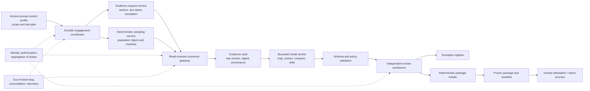
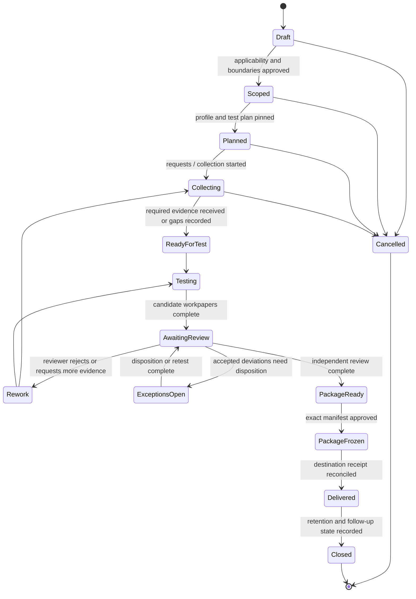

# Production Compliance Audit and Control Evidence Agent Blueprint

> **Research date:** 2026-08-31  
> **Status:** Pass 2 production design reference; validate every control profile, evidence procedure, connector qualification, retention rule, independence requirement, and conclusion with the accountable organization and qualified assurance professionals  
> **Scope:** Control mapping, evidence-request orchestration, population and sample handling, immutable evidence lineage, test-of-design and test-of-operating-effectiveness support, exception state, reviewer independence, and reproducible audit-package generation

## Bottom line

The safest useful compliance audit agent is a **durable evidence and assessment workflow with a bounded model worker**, not an autonomous auditor.

The system can coordinate requests, collect source records, preserve lineage, apply an approved sample plan, assemble test workpapers, surface contradictory evidence, and build a deterministic package. It cannot decide which laws apply, implement the controls it evaluates, approve its own evidence, grant access, claim that an organization is compliant, or sign an audit opinion. Accountable people retain scoping, professional judgment, exception disposition, independence determinations, management representations, attestations, and report issuance.

## Non-negotiable boundary

### The blueprint owns

- versioned control-profile and mapping records after an accountable owner approves them;
- evidence requests, assignments, reminders, escalations, cancellation, and receipt tracking;
- reproducible population snapshots and execution of a human-approved sampling method;
- immutable evidence versions, provenance, transformations, completeness metadata, and access records;
- structured assistance for tests of design (TOD) and tests of operating effectiveness (TOE);
- observation, contradiction, exception, remediation-follow-up, and reviewer states;
- segregation-of-duties enforcement for proposal, preparation, review, and approval;
- deterministic workpaper indexes, evidence manifests, and audit-package generation;
- reconciliation, operational telemetry, evaluation, release controls, and incident response.

### The blueprint does not own

- interpretation of law or a determination that an obligation applies;
- design, implementation, configuration, or operation of the assessed control;
- issuance of credentials or expansion of its own access;
- sample-size policy, risk appetite, materiality, or assurance methodology without approval;
- evidence approval by the same identity that prepared or submitted it;
- resolution of independence threats or conflicts of interest;
- management representations, audit opinions, certifications, attestations, or regulator communications;
- unsupported claims such as “compliant,” “effective,” “complete,” or “no exceptions.”

The product may record an authorized human conclusion. It must not manufacture one.

## Category handoff boundaries

This category tests and packages approved control evidence. It does not absorb the authority of upstream intelligence or control-operation systems.

| Neighbor | Neighbor owns | Permitted handoff into compliance audit | Fixed boundary |
| --- | --- | --- | --- |
| [Regulatory Intelligence](../regulatory-intelligence-agent/README.md) | Monitoring official publications, effective dates, applicability questions, and approved change briefs | A version-pinned, owner-approved requirement/profile change input | This agent does not interpret law, determine applicability, or silently activate a new obligation |
| [Identity and Access Governance](../identity-access-governance-agent/README.md) | Authoritative identity/access facts and approved IAM/IGA/PAM grant or revoke workflows | Read-only snapshots, review decisions, and reconciled effect receipts | This agent does not grant, revoke, certify, or remediate access |
| Assessed control/service operators | Control design, configuration, operation, monitoring, and remediation | Source facts, owner explanations, and remediation evidence | A control operator cannot use the agent to approve its own evidence where independence/SoD forbids it |

When a test finds a control failure, the compliance workflow records and routes the observation. Remediation happens in a separately authorized operator workflow; its closure is evidence, not proof of operating effectiveness.

## Five records that must never collapse into one

| Record | What it says | Authoritative owner | Model authority |
| --- | --- | --- | --- |
| **Evidence** | What source data was retrieved or submitted, when, how, by whom, and with what integrity/completeness limitations | Evidence vault plus source receipt | Extract or summarize; never alter the raw version |
| **Observation** | What a procedure found, including supporting and contradicting evidence | Test-workpaper service | Draft a source-linked candidate |
| **Decision** | Whether a reviewer accepted evidence, classified a deviation, disposed an exception, or approved a package | Authorized human plus decision service | Recommend only |
| **Side effect** | What request, reminder, assignment, export, freeze, or publication was attempted and verified | Effect ledger plus downstream receipt | Propose an allowed effect intent |
| **Telemetry** | How the system behaved: latency, tokens, errors, traces, queue age | Observability platform | No execution authority; sampling must not affect evidence |

A chat transcript is none of these. A trace is not an audit trail. A stored file is not sufficient lineage. An “immutable” file is not proof that its source was truthful or complete.

## Authority levels

Grant authority by **tenant × engagement × profile × connector × effect class**, never by deployment name alone.

| Level | Permitted capability | Default posture |
| --- | --- | --- |
| **C0 — Read and index** | Read approved projections; inventory controls and available evidence; no assessment proposal | Safe first integration after privacy and access review |
| **C1 — Propose** | Draft mappings, requests, observations, workpapers, and package narratives with citations | Default useful production authority |
| **C2 — Orchestrate reversible work** | Create or update evidence requests, reminders, assignments, and draft packages through allowlisted effects | Only after idempotency, authorization, and reconciliation gates pass |
| **C3 — Execute approved collection/test plans** | Run approved queries, freeze populations, select samples deterministically, and collect allowed evidence | Mature connectors and explicit human-approved scope/methodology required |
| **C4 — Deliver a frozen package** | Publish one exact reviewed package to an approved destination | Dual control, commit-time authorization, manifest verification, and recovery drill required |
| **C5 — Autonomous assurance conclusion** | Decide compliance/effectiveness or issue an attestation | Prohibited by this blueprint |

A deployment may be C3 for an AWS configuration snapshot, C2 for reminders, C1 for a sensitive HR control, and C0 for a licensed standard. Authority is not a scalar property of “the agent.”

## Deterministic ownership and bounded model judgment

| Concern | Deterministic or human owner | Permitted model contribution |
| --- | --- | --- |
| Applicability and engagement scope | Qualified profile owner and engagement lead | Identify unresolved questions and cite candidate sources |
| Control and requirement text | Licensed/versioned profile registry | Retrieve only authorized excerpts; never invent missing clauses |
| Mapping relationship | Approved mapping record | Propose relationship, rationale, confidence, and conflicts |
| Evidence identity and integrity | Connector, vault, and provenance service | Classify content after identity is established |
| Population definition | Approved test plan and query contract | Draft a query for human validation |
| Sample size and method | Qualified tester/reviewer | Explain an approved method; never choose the assurance threshold |
| Sample selection | Deterministic sampler | None after plan approval |
| TOD/TOE observation | Workpaper service and independent reviewer | Draft source-linked observations and identify contradictions |
| Exception disposition | Authorized reviewer/control owner according to policy | Summarize impact and propose next steps |
| Independence | Identity/policy service plus assurance leadership | Surface possible conflicts; never waive them |
| Package contents | Deterministic builder from accepted records | Draft narrative that remains visibly unapproved |
| Attestation or audit opinion | Qualified human/signing organization | None |

## Authoritative lifecycle

`ReadyForTest` does not imply sufficiency. `PackageReady` does not imply control effectiveness. `Delivered` does not imply an audit opinion. Each is a workflow fact with explicit acceptance criteria.

## Guide map

| Guide | Production decision it supports |
| --- | --- |
| [Workload fit, scope, and accountability](01-workload-fit-scope-and-accountability.md) | Whether the workload belongs here, what authority is permitted, and who remains accountable |
| [Reference architecture, runtime, and authority](02-reference-architecture-runtime-and-authority.md) | How to isolate durable control, nondeterministic judgment, evidence, review, and effects |
| [Control profiles, mappings, and change governance](03-control-profiles-mapping-and-change-governance.md) | How to pin requirements, represent many-to-many mappings, and prevent false equivalence |
| [Evidence requests, connectors, and immutable lineage](04-evidence-requests-connectors-and-lineage.md) | How to collect source records safely and prove identity, provenance, completeness limits, and transformations |
| [Sampling, test design, and control assessment](05-sampling-test-design-and-control-assessment.md) | How approved TOD/TOE procedures become reproducible samples and reviewable workpapers |
| [Engagement state, context, memory, and orchestration](06-engagement-state-context-memory-and-orchestration.md) | How long-running state, typed events, context reconstruction, and replanning survive model and worker loss |
| [Reviewer independence, exceptions, and audit packages](07-review-independence-exceptions-and-audit-packages.md) | How independent review, exception disposition, package freeze, and human attestation remain distinct |
| [Security, privacy, retention, and tenant isolation](08-security-privacy-retention-and-tenant-isolation.md) | How identities, untrusted evidence, data minimization, legal holds, encryption, and isolation are enforced |
| [Reliability, observability, evaluation, and failure injection](09-reliability-observability-evaluation-and-failure-injection.md) | How to measure mapping, lineage, workflow, effect, review, and package integrity before promotion |
| [Deployment, scale, cost, incidents, and staged evolution](10-deployment-scale-cost-incidents-and-evolution.md) | How stages 0–6 change authority, architecture, gates, operations, and recovery |
| [Integration qualification and audit-package walkthroughs](11-integration-qualification-and-audit-package-walkthroughs.md) | How named GRC, cloud, IAM, CI/CD, ticket, HR/finance, portal, storage, e-signature, warehouse, and optional MCP capabilities become qualified evidence paths and complete packages |

The [research packet](../../research/packets/compliance-audit-agent-blueprint.md) records the dated standards baseline, source evidence, design tensions, maturity labels, jurisdiction limits, and refresh triggers.

## Minimal production slice

Start with one internal control family, one tenant, one approved control profile, and one or two read-only connectors. Ship only:

- a signed engagement scope and immutable profile pin;
- deterministic evidence-request state with owners and deadlines;
- raw evidence versions plus complete provenance manifests;
- one approved population query and deterministic sample manifest;
- C1 model assistance for extraction and workpaper drafting;
- an independent review queue with explicit accept/reject/request-more-evidence actions;
- a package preview, not external publication;
- replay, duplicate-delivery, retention, access, and prompt-injection tests;
- manual fallback for collection, testing, and package assembly.

Do not begin with a cross-framework “universal compliance” map, broad write access, autonomous sample design, or externally issued conclusions.

## Zero-to-production stages

The detailed gate contract is in [Deployment, scale, cost, incidents, and staged evolution](10-deployment-scale-cost-incidents-and-evolution.md).

| Stage | Authority ceiling | Operational objective | Exit signal |
| --- | --- | --- | --- |
| **0 — Qualify and govern** | No runtime/model access | Prove fit, boundary, owners, profile rights, privacy, independence, and baseline economics | Signed scope and control matrix; no unresolved critical owner or data-class gap |
| **1 — Offline replay and shadow** | C0/C1 on synthetic or approved historical projections | Validate schemas, mappings, lineage, context reconstruction, and reviewer workflow without effects | All hard control tests pass; quality and review burden meet approved thresholds |
| **2 — Evidence-request MVP** | C2 for allowlisted reversible requests; read-only collection | Operate one profile and connector set with human acceptance of every item | Requests reconcile; no cross-tenant or untracked evidence; recovery drill passes |
| **3 — Approved sampling and TOD/TOE support** | C3 for approved plan execution | Freeze populations, select samples, assemble candidate workpapers, and surface contradictions | Sampling is byte-reproducible; reviewers can reconstruct every conclusion input |
| **4 — Independent review and package freeze** | C3 plus dual-controlled package freeze; C4 disabled | Run exceptions, independent review, and deterministic package previews | No proposer/self-review path; manifest integrity and re-open/re-freeze flows pass |
| **5 — Bounded package delivery** | C4 for exact approved destinations | Deliver frozen packages, reconcile receipts, and operate under SLOs/backpressure | Canary and incident drills pass; delivery is idempotent and recoverable |
| **6 — Multi-tenant and multi-profile scale** | Same bounded effects; no broader conclusion authority | Add cells, profiles, regions, connectors, continuous evidence, and governed upgrades | Isolation, fairness, capacity, profile-drift, and fleet rollback evidence pass |

Stage numbers are maturity gates, not deadlines. A higher stage does not expand the agent into legal interpretation or attestation.

## Promotion evidence

Every promotion decision should contain:

1. the exact release manifest: application, workflow, schema, profile, mapping, connector, prompt, model, policy, and evaluation-set versions;
2. offline and shadow results split by control type, connector, evidence format, tenant risk class, and material failure mode;
3. reviewer workload, disagreement, overrides, and abstention behavior;
4. lineage completeness, sample reproducibility, effect reconciliation, and package referential-integrity results;
5. security, privacy, independence, retention, legal-hold, and tenant-isolation approvals;
6. failure-injection and restore/reconciliation drill evidence;
7. a rollback target, an out-of-band effect stop, and an accountable go/no-go owner.

Accuracy alone is not a promotion criterion.

## Canonical repository dependencies

This guide is the workload-specific layer. It links rather than redefines the repository’s canonical contracts:

- [Execution boundaries](../../runtime/execution-boundaries.md), [agent state and event contracts](../../runtime/agent-state-and-event-contracts.md), [durable execution](../../runtime/durable-execution.md), and [run controls](../../runtime/run-controls.md)
- [Tool contracts](../../tools/tool-contracts.md), [tool results, artifacts, and provenance](../../tools/tool-results-artifacts-and-provenance.md), and [tool registries, versioning, and lifecycle](../../tools/tool-registries-versioning-and-lifecycle.md)
- [Context engineering](../../context-memory/context-engineering.md), [memory architecture](../../context-memory/memory-architecture.md), and [compaction and continuity](../../context-memory/compaction-and-continuity.md)
- [Planning and replanning](../../orchestration/planning-and-replanning.md)
- [Agent threat model](../../security/agent-threat-model.md), [prompt injection and untrusted data](../../security/prompt-injection-and-untrusted-data.md), and [permissions, sandboxing, and secrets](../../security/permissions-sandboxing-and-secrets.md)
- [Failure taxonomy](../../reliability/failure-taxonomy.md) and [idempotency and side effects](../../reliability/idempotency-and-side-effects.md)
- [Evaluation-driven development](../../evaluation/evaluation-driven-development.md), [trajectory and reliability evaluation](../../evaluation/trajectory-and-reliability-evaluation.md), and [observability and tracing](../../evaluation/observability-and-tracing.md)
- [Queues, scheduling, and backpressure](../../operations/queues-scheduling-and-backpressure.md), [scaling and SLOs](../../operations/scaling-capacity-and-slos.md), [model routing, cost, and latency](../../operations/model-routing-cost-and-latency.md), and [deployment, release, and incident response](../../operations/deployment-release-and-incident-response.md)

## Selected current primary sources

- [NIST SP 800-53A Revision 5](https://csrc.nist.gov/pubs/sp/800/53/a/r5/final) for customizable assessment procedures and examine/interview/test methods
- [PCAOB AS 2201](https://pcaobus.org/oversight/standards/auditing-standards/details/AS2201) for financial-reporting-specific design and operating-effectiveness concepts
- [PCAOB AS 1105](https://pcaobus.org/oversight/standards/auditing-standards/details/AS1105) for sufficiency, appropriateness, reliability, and contradictory evidence
- [GAO Green Book](https://www.gao.gov/greenbook), [FISCAM](https://www.gao.gov/products/gao-24-107026), and [Yellow Book](https://www.gao.gov/yellowbook) for U.S. public-sector internal control, information-system control assessment, and independence context
- [IIA Global Internal Audit Standards](https://www.theiia.org/en/standards/) for internal-audit independence and objectivity context
- [OSCAL 1.2.3 release](https://github.com/usnistgov/OSCAL/releases/tag/v1.2.3) and [control mapping model](https://pages.nist.gov/OSCAL/learn/concepts/layer/control/mapping/) for versioned machine-readable control artifacts
- [W3C PROV overview](https://www.w3.org/TR/prov-overview/), [RFC 3161](https://www.rfc-editor.org/info/rfc3161), and [RFC 4998](https://www.rfc-editor.org/info/rfc4998) for provenance and optional long-term integrity patterns

These sources inform the architecture; they do not make this blueprint an authoritative interpretation of any audit standard or law.
