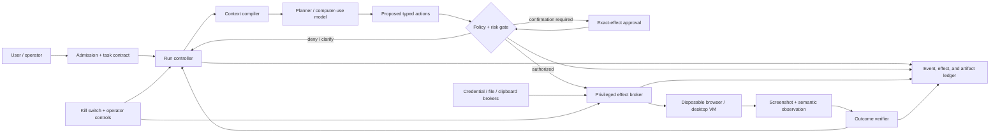
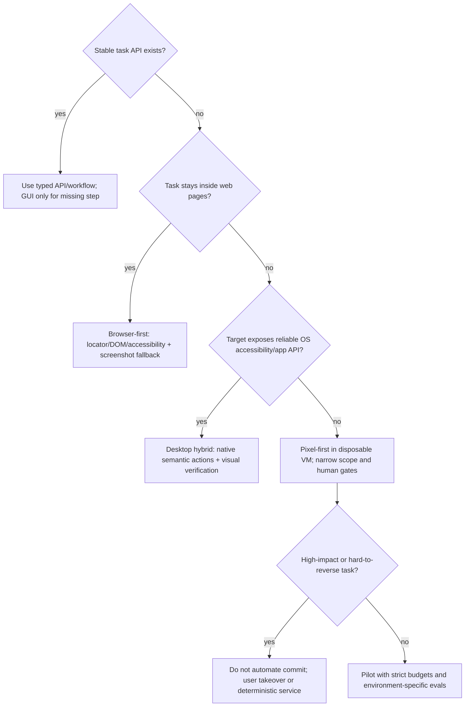

# Computer-Use Agent Blueprint

> **Status:** Production reference blueprint; not a safety certification  
> **Last researched:** 2026-08-31  
> **Scope:** Agents that perceive and control a browser, mobile emulator, or general desktop through screenshots, accessibility/DOM state, and keyboard/pointer actions  
> **Evidence:** [Computer-use agent research packet](../../research/packets/computer-use-agent-blueprint.md)

A computer-use agent is a privileged remote operator driven by a probabilistic policy. Design it as a security-sensitive control system, not as a chatbot with a `click` tool.

The recommended production shape is **hybrid and application-governed**:

- use a browser protocol, DOM, accessibility tree, or application API for reliable semantic reads and narrow actions;
- use screenshots for visual grounding, custom/canvas UI, and post-action verification;
- treat every model action as an untrusted proposal;
- let a deterministic policy and effect broker decide what may execute;
- run the UI in a disposable, least-privileged environment;
- stop at an exact-effect confirmation gate before consequential commits;
- preserve evidence sufficient to explain the run without retaining secrets indefinitely.

Provider-native computer tools make action formatting and model interaction easier. They do not own your authorization, isolation, credential boundary, effect idempotency, incident response, or product acceptance criteria.

## Purpose and non-goals

This blueprint is for teams building agents that must interact with software lacking a complete task API, including desktop applications, virtualized legacy systems, and visually rendered web applications.

It is not:

- permission to run an agent on a user's everyday workstation;
- a claim that screen pixels are the best integration for every application;
- a recipe for unsupervised financial, medical, legal, identity, or security decisions;
- a substitute for a stable API, workflow engine, RPA rule, or ordinary test automation;
- a promise that a recorded GUI trajectory can be replayed deterministically;
- a claim that a model-side safety classifier is an authorization control.

If the task can be expressed as a deterministic API call with a typed contract and verifiable postcondition, prefer that API. Use GUI control for the irreducibly visual or otherwise inaccessible parts.

## Browser automation is not general computer control

The distinction changes the threat model, state model, and correct runtime.

| Boundary | Browser automation | General GUI / computer control |
|---|---|---|
| Primary semantic surface | DOM, accessibility tree, WebDriver/CDP events, URL/origin | OS accessibility tree, window manager, pixels, app-specific APIs |
| Input target | Element, frame, page, browser context | Foreground window, screen coordinates, OS input queue, accessibility element |
| Isolation unit | Fresh browser context/profile, often inside a container or VM | Dedicated OS account or, preferably, disposable VM with its own desktop session |
| Credential exposure | Cookies, storage, autofill, downloads, browser profile | Browser data plus files, clipboard, keychain/vault, other apps, notifications, devices |
| Focus hazards | Frames, dialogs, tabs, popups | All browser hazards plus window focus, multi-monitor coordinates, secure desktop, global shortcuts |
| Strongest normal action | Locator/role action with auto-wait and element checks | Native accessibility pattern or verified foreground input; raw coordinates are fallback |
| Appropriate benchmark family | WebArena, VisualWebArena, WorkArena | OSWorld, WindowsAgentArena, AndroidWorld, application-specific task suites |

[W3C WebDriver](https://www.w3.org/TR/webdriver/) defines browser introspection and control, while browser-native frameworks can auto-wait for element actionability and isolate cookie/storage state. Desktop control crosses application and operating-system boundaries and can reach anything visible or focusable in the session. Anthropic now documents browser use as the closer fit for webpage-only tasks and computer use for full desktop interaction; OpenAI likewise distinguishes browser/DOM harnesses from VM-backed computer control ([Anthropic](https://platform.claude.com/docs/en/agents-and-tools/tool-use/computer-use-tool), [OpenAI](https://developers.openai.com/api/docs/guides/tools-computer-use)).

## Product requirements before model selection

Write these as testable contracts before choosing a model or framework.

| Requirement | Minimum production definition |
|---|---|
| Objective | Accepted task, excluded actions, authoritative success evidence, and terminal deadline |
| Environment | OS/app/image versions, locale, display topology, account, network policy, and reset procedure |
| Authority | Principal, tenant, allowed apps/resources/actions, data classes, expiry, and confirmation obligations |
| Observation | Screenshot and semantic-state contract, coordinate space, freshness/version, and redaction policy |
| Action | Typed proposal, target binding, preconditions, timeout, cancellation, risk class, and receipt |
| Consequential effect | Preview, exact-effect digest, approver, commit-time revalidation, effect ID, and reconciliation |
| Reliability | Turn/action/time/cost budgets, stuck thresholds, recovery ladder, and honest partial/unknown states |
| Privacy | Data sent to the model, artifact retention, redaction, encryption, regional controls, and deletion |
| Operability | Trace/event schema, screenshot evidence, VM health, queue SLO, cleanup, kill switch, and incident runbook |
| Evaluation | Grounding, task, policy, recovery, latency, cost, and severe-failure gates across repeated trials |

Do not adopt computer use merely because a benchmark score is attractive. A release is acceptable only when it passes your environment-specific tasks and adversarial controls at the authority level you will grant.

## Reference architecture

### Trust boundaries

1. **Reasoning plane:** the model sees only the minimum observation and cannot directly invoke OS APIs, read a secret store, or mutate authoritative state.
2. **Control plane:** the run controller owns state transitions, budgets, policy versions, confirmation waits, cancellation, and stale-result rejection.
3. **Effect plane:** a narrow broker performs allowed UI/input/file/network actions and records receipts. It has no model autonomy.
4. **Environment plane:** a dedicated browser profile or desktop VM contains applications, untrusted content, and per-run state.
5. **Evidence plane:** append-only events and encrypted artifacts support diagnosis and evaluation; they are not placed wholesale back into model context.

## Non-negotiable invariants

1. **Pixels and on-screen text are observations, never authority.** Only authenticated direct user input, product policy, and trusted application state can authorize an effect.
2. **One controller owns one interactive desktop session at a time.** Multiple writers create focus races and invalid observations.
3. **Every action binds to an observation version and target context.** Reject it if the active app, window, URL/origin, display geometry, or relevant UI state changed.
4. **Raw OS-wide input requires foreground verification.** If focus cannot be proven, fail closed instead of typing or clicking elsewhere.
5. **Secrets do not enter screenshots, prompts, clipboard, or action logs by default.** A broker performs scoped fill/sign operations using opaque references.
6. **Consequential actions are prepared, reviewed, and committed separately.** Revalidate identity, target, content, and policy immediately before commit.
7. **Unknown effect outcome is a distinct state.** Reconcile by stable effect identity before any retry.
8. **A stuck detector can stop or escalate, never invent success.** Budget exhaustion is a bounded failure.
9. **Reset is destructive and explicit.** Quarantine evidence first when a run is suspicious; then destroy the environment and revoke credentials.
10. **Audit replay means reconstruction, not guaranteed re-execution.** Live GUIs, clocks, networks, and external effects are nondeterministic.

## Guide map

1. [Architecture and runtime selection](architecture-and-runtime-selection.md) — architecture variants, browser/desktop boundaries, language and model choices, deployment shapes, and ownership guarantees.
2. [Perception, grounding, and application state](perception-grounding-and-application-state.md) — screenshots, accessibility trees, coordinate systems, target identity, visual privacy, and outcome verification.
3. [Actions, policy, and irreversible effects](actions-policy-and-irreversible-effects.md) — tool contracts, focus safety, batches, confirmations, idempotency, and ambiguous outcomes.
4. [Isolation, permissions, credentials, and data boundaries](isolation-permissions-credentials-and-data-boundaries.md) — threat model, virtual desktops, OS permissions, files, clipboard, browser profiles, secrets, and egress.
5. [State, context, planning, stuck detection, and recovery](state-context-planning-stuck-detection-and-recovery.md) — durable run state, compact context, milestones, loop detection, crash recovery, and human takeover.
6. [Observability, audit replay, and evaluation](observability-audit-replay-and-evaluation.md) — evidence contracts, privacy-safe traces, visual/task/safety evals, benchmarks, and release gates.
7. [Performance, cost, scaling, and operations](performance-cost-scaling-and-operations.md) — latency budgets, screenshot cost, VM pools, queues, deployment, cleanup, incident response, and capacity.
8. [Implementation roadmap, acceptance tests, and alternatives](implementation-roadmap-acceptance-tests-and-alternatives.md) — Stage 0–6 build, realistic exercises, exit evidence, failure injection, go-live checklist, and custom/framework/hybrid decisions.

## Architecture selection shortcut

## Current baseline and volatility

As of 2026-08-31:

- OpenAI documents the GA `computer` tool, custom harnesses, and code-execution harnesses, and marks `computer-use-preview` as the older migration path ([guide](https://developers.openai.com/api/docs/guides/tools-computer-use)).
- Anthropic documents `computer_toolset_20260801` for full desktop use and a separate browser-use tool for page-only tasks; earlier dated computer tools remain available for some models/platforms ([guide](https://platform.claude.com/docs/en/agents-and-tools/tool-use/computer-use-tool)).
- Google documents computer-use environments for browser, mobile, and desktop, configurable confirmation policies, and opt-in screenshot prompt-injection detection for supported Gemini versions ([guide](https://ai.google.dev/gemini-api/docs/computer-use)).
- OSWorld 2.0 requires version-aligned code, task files, assets, and mocked sites; its currently documented release is `v2026.06.24` ([repository](https://github.com/xlang-ai/OSWorld-V2)).

These are version observations, not endorsements. Re-evaluate this blueprint when:

- a provider changes its action schema, safety response, image processing, retention, or model compatibility;
- an OS changes screen-capture, accessibility, input-injection, virtualization, or credential permissions;
- a browser changes profile/debugging security or automation semantics;
- a benchmark refreshes tasks, graders, assets, or contamination controls;
- a new prompt-injection result invalidates an assumed defense;
- your application, locale, resolution, authentication, or risk tier changes.

Review provider-specific facts at least quarterly and before every model/tool migration. Review security controls after every relevant incident or permission expansion.

## Strong starting sources

- [OpenAI computer use guide](https://developers.openai.com/api/docs/guides/tools-computer-use)
- [Anthropic computer use documentation](https://platform.claude.com/docs/en/agents-and-tools/tool-use/computer-use-tool)
- [Anthropic computer/browser-use best practices](https://claude.com/blog/best-practices-for-computer-and-browser-use-with-claude)
- [Google Gemini computer use documentation](https://ai.google.dev/gemini-api/docs/computer-use)
- [W3C WebDriver](https://www.w3.org/TR/webdriver/) and [WebDriver BiDi](https://www.w3.org/TR/webdriver-bidi/)
- [OSWorld](https://github.com/xlang-ai/OSWorld), [OSWorld 2.0](https://github.com/xlang-ai/OSWorld-V2), and [WindowsAgentArena](https://github.com/microsoft/WindowsAgentArena)
- [WASP prompt-injection benchmark](https://arxiv.org/abs/2504.18575) and [VPI-Bench](https://openreview.net/pdf?id=UMauKu2azg)

The complete source ledger, contradictions, and refresh notes are in the [research packet](../../research/packets/computer-use-agent-blueprint.md).
