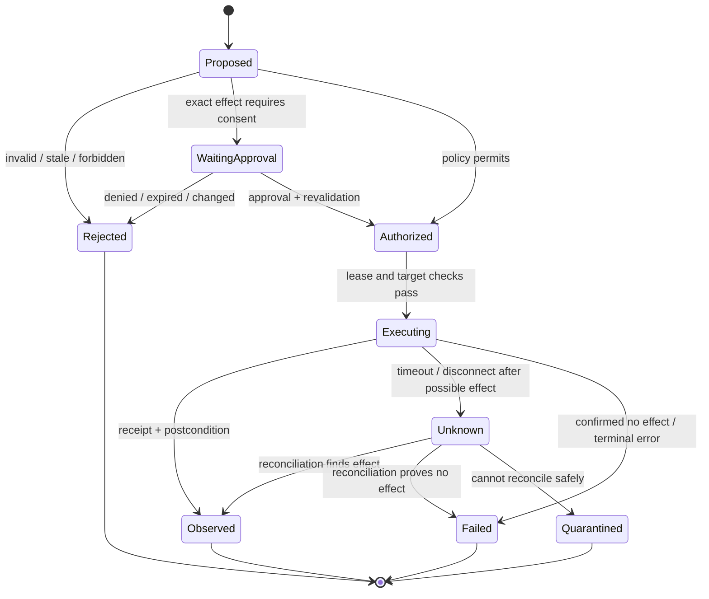

# Actions, Policy, and Irreversible Effects

> **Last researched:** 2026-08-31  
> **Purpose:** Define UI tools and effect controls that remain safe under model error, prompt injection, retries, focus changes, and ambiguous outcomes.

The model proposes intent. A trusted application converts that proposal into a narrow, authorized, observable action. Never let a provider tool call become an uninspected direct dispatch to mouse, keyboard, shell, or application API.

## Action lifecycle



The controller—not the model—owns these transitions.

## Tool design principles

1. Use semantic, target-bound operations before global input.
2. Make reads, reversible writes, and irreversible effects visibly different in the schema.
3. Require the observation and environment identity on every action.
4. Declare preconditions, expected change, timeout, and retry class.
5. Use opaque references for credentials and sensitive text.
6. Return structured receipts, not only `OK`.
7. Fail unknown action names and additional fields closed.
8. Do not expose arbitrary shell, Python, JavaScript, AppleScript, or PowerShell as the normal GUI action space.

## Recommended action surface

| Tool | Semantics | Default risk |
|---|---|---|
| `observe` | Capture target window/screen plus semantic state | Read; sensitive by content |
| `inspect_target` | Resolve role/name/state/bounds without acting | Read |
| `focus_window` | Bring one allowed window to foreground and verify | Reversible control-plane change |
| `invoke_element` | Invoke an accessibility/DOM/app action by stable target | Depends on element/effect |
| `click_point` | Click native point inside verified target window | Higher uncertainty |
| `type_text` | Type non-secret text into verified field | Data transmission risk |
| `fill_secret` | Broker fills an approved field using opaque secret reference | Sensitive; usually user/policy gate |
| `scroll` | Scroll target container/window by bounded amount | Reversible |
| `keypress` | Allowlisted key or chord in verified window | Context-dependent; global chords denied |
| `wait_for` | Wait for typed condition with deadline | Read/control |
| `prepare_effect` | Produce target/content/diff/digest without commit | Reversible preparation |
| `commit_effect` | Execute one previously approved effect digest | Irreversible/high impact |
| `yield_to_user` | Suspend with reason and takeover instructions | Safe terminal/wait action |

Provider action schemas can map into this internal surface. Keep the provider call ID for correlation, but generate application-owned action and effect IDs.

## Example proposal contract

```json
{
  "schema_version": "cua.action-proposal/v2",
  "action_id": "act_01J...",
  "run_id": "run_01J...",
  "observation_id": "obs_01J...",
  "environment_id": "env_f42...",
  "kind": "invoke_element",
  "tool_contract_version": "windows-uia-actions/1.8.2",
  "target": {
    "target_id": "target_142",
    "app_id": "com.example.mail",
    "window_id": "compose_7",
    "role": "Button",
    "name": "Send"
  },
  "preconditions": [
    "active_window == target.window_id",
    "target.enabled == true",
    "draft.version == 19"
  ],
  "expected_change": {
    "kind": "business_record",
    "predicate": "message.delivery_state in ['accepted','sent']"
  },
  "risk": "external_communication",
  "timeout_ms": 8000,
  "retry_class": "reconcile_only"
}
```

Do not trust model-declared `risk` or `retry_class`. The policy engine derives them from the canonical target, operation, data class, and environment.

Keep the action and its possible external effect distinct. The action is “invoke this current UI target”; the effect is “create this domain mutation once.” A typed effect record should include `effect_id`, operation, principal/tenant/account, canonical resource and destination, material content/diff, source versions, idempotency/reconciliation key, prepare/approval/commit states, downstream receipt, and `not_started | committing | observed | confirmed_absent | unknown | quarantined` outcome. An action may fail while the effect succeeds, and a UI success signal may appear while the effect fails.

## Policy evaluation

Represent authority as a decision over a concrete tuple:

```text
(principal, tenant, workload, environment, app, resource, operation,
 data_class, destination, task_id, policy_version, time, obligations)
```

### Decision order

1. authenticate user, workload, executor, and environment;
2. canonicalize app/resource/target and destination;
3. validate schema and observation freshness;
4. enforce app, origin, path, action, data, and network allowlists;
5. classify effect and aggregate capability combinations;
6. compute confirmation or takeover obligation;
7. authorize a short-lived single-use action capability;
8. revalidate immediately before dispatch;
9. record decision and execution receipt separately.

Prompt text is not a policy language. A system instruction can guide behavior, but the executor must enforce the decision.

## Action danger tiers and gates

Assign danger deterministically from the canonical operation, target, data, destination, reversibility, and current authority. The same gesture can have different danger: clicking a local tab is not clicking “Send,” even if both use `invoke_element`.

| Tier | Classes and examples | Default gate |
|---|---|---|
| D0 — observe | Public/test read, inspect non-sensitive state | Pre-authorize within narrow task scope; still redact and log |
| D1 — sensitive read/navigation | Email, internal document, customer record, opening an allowed destination | Purpose-bound read; data/egress policy; no external write |
| D2 — reversible preparation | Edit a draft, fill a form without submit, create an isolated temp file | Preview, bounded rollback, and postcondition; no blanket future approval |
| D3 — external representation | Send email/chat, post, submit a business form, export data | Prepare → exact readback → one-use confirmation → revalidate → commit → reconcile |
| D4 — destructive or authority-changing | Delete, revoke/share, install, permission/security/account change | Deny by default; if product-authorized, strong isolation, exact-effect confirmation, often dual control/takeover |
| D5 — financial, legal, identity, credential, or safety barrier | Purchase/transfer, sign/accept terms, password/passkey/MFA, CAPTCHA, bypass browser/OS warning | Deterministic specialized workflow or user takeover; generic autonomous commit prohibited |
| D6 — code/extension execution | Run a download, macro, terminal/console command, extension, or installer | Deny in the normal action surface; separate isolated code/review workflow if explicitly required |

Aggregate capabilities when classifying. A D1 read plus unrestricted clipboard/network can become D3 data exfiltration; repeated D2 drafts can consume storage or create operational harm; a “reversible” delete is D4 if restore identity and retention are not proven.

OpenAI's current computer-use guidance calls for action-time confirmation before deletion, permission changes, sending/posting, financial actions, software execution, and security settings; it requires takeover for password change completion and bypassing browser safety barriers. Google documents similar confirmation categories, including legal terms, communications, sensitive data, account login, and browser data. These provider policies are useful baselines, but your application must enforce its own stricter contract ([OpenAI](https://developers.openai.com/api/docs/guides/tools-computer-use), [Google](https://ai.google.dev/gemini-api/docs/computer-use)).

## Prepare, approve, commit

For any consequential effect, separate preparation from commit.

```mermaid
sequenceDiagram
    participant M as Model
    participant C as Controller
    participant A as Application / UI
    participant U as User / approver
    participant L as Effect ledger

    M->>C: prepare send action
    C->>A: Populate draft; do not submit
    A-->>C: Canonical recipient, body, attachments, version
    C->>L: Store proposal + digest + expiry
    C-->>U: Review exact effect and risk
    U->>C: Approve digest
    C->>A: Re-read target and draft version
    C->>C: Recompute digest + policy
    alt unchanged and authorized
        C->>L: Mark committing with effect_id
        C->>A: Commit once
        A-->>C: Receipt / resulting state
        C->>L: Store observed result
    else changed / expired
        C-->>U: Approval invalid; request new review
    end
```

### Effect digest

Hash a canonical representation of all material facts:

- principal and tenant;
- operation and canonical target;
- recipients/destination/account;
- normalized content or diff and attachments;
- amount/currency or other consequential parameters;
- data classifications crossing a boundary;
- source record versions;
- environment and app/account identity;
- policy version, expiry, and allowed use count.

Do not approve “click Send.” Approve “send this exact message, from this account, to these recipients, with these attachments.”

### Confirmation UX

Show:

- what will happen and what will leave the environment;
- account/resource and destination;
- a reviewable diff or exact content;
- whether it is reversible and how;
- any uncertainty or validation gap;
- expiry and one-use semantics;
- clear approve, reject, edit, and takeover controls.

Require a deterministic readback immediately before approval and again before commit. Readback means re-reading the application's canonical account, destination, material fields/diff, attachments, amount or scope, and source versions—not asking the model to repeat its intent. Show what the readback could not verify. An approval is invalid if the second readback changes the effect digest or if the target cannot be read authoritatively.

Do not ask at task start for blanket permission covering future regenerated actions. Anthropic, OpenAI, and Google all recommend pausing immediately before the risky action after safe preparation ([Anthropic](https://claude.com/blog/best-practices-for-computer-and-browser-use-with-claude), [OpenAI](https://developers.openai.com/api/docs/guides/tools-computer-use), [Google](https://ai.google.dev/gemini-api/docs/computer-use)).

## Input execution safety

### Foreground-bound pointer/keyboard input

For global input:

1. resolve intended process/window;
2. bring it to foreground through a scoped operation;
3. verify foreground identity and bounds;
4. verify the target or point lies within those bounds;
5. acquire the session input lease;
6. inject the smallest action;
7. release modifiers/buttons on every exit path;
8. capture a receipt and post-action state;
9. fail if focus changed at any point.

Windows `SendInput` serializes injected input but is subject to UIPI and sends to the system input stream, which makes focus verification essential ([Microsoft documentation](https://learn.microsoft.com/en-us/windows/win32/api/winuser/nf-winuser-sendinput)). Linux `uinput` creates virtual input devices whose events reach user-space and kernel consumers; access to `/dev/uinput` is therefore a privileged capability, not a harmless library call ([kernel documentation](https://kernel.org/doc/html/latest/input/uinput.html)).

### Keys and shortcuts

- allowlist ordinary editing/navigation keys by app and state;
- deny secure attention, lock, system settings, task manager, terminal launch, global app switching, and browser developer-console shortcuts by default;
- normalize modifier state before and after the action;
- never paste secret text through the system clipboard;
- treat keyboard shortcuts as application-dependent effects, not universal semantics.

### Text entry

Typing is data transmission as soon as sensitive data enters an application field, even before form submission. Bind text to:

- intended field identity and current value/version;
- data classification and approved source;
- allowed destination/application/account;
- maximum length and format;
- whether the action replaces or appends;
- redacted receipt (hash/length/class, not plaintext).

## Batch actions

Provider tools may return multiple actions per model turn. Execute sequentially and stop after the first failure because later actions assume earlier success. Anthropic explicitly documents this behavior; OpenAI's GA computer loop likewise returns ordered action arrays ([Anthropic](https://platform.claude.com/docs/en/agents-and-tools/tool-use/computer-use-tool), [OpenAI](https://developers.openai.com/api/docs/guides/tools-computer-use)).

### Safe batching rule

A batch may contain actions only while all of these remain true:

- same environment, app/window, origin, and observation lineage;
- same or lower risk tier;
- no action changes authority, identity, destination, or material content;
- no action requires a postcondition before the next action is safe;
- no confirmation or takeover boundary is crossed;
- all actions can be stopped cleanly after a failure.

End a batch with an observation. Split `fill fields → click Send` before the click. Split `open downloaded file → run installer` before execution. Latency optimization does not justify crossing a policy barrier.

## Idempotency and ambiguous outcomes

UI actions are usually not idempotent. Double-clicking, pressing Enter twice, re-submitting, or retrying a drag can create duplicate or destructive effects.

### Retry classes

| Class | Example | Retry rule |
|---|---|---|
| Safe repeat | `observe`, read semantic state | Bounded retry with deadline |
| Conditionally repeatable | Focus window, set field to exact value | Re-read state; retry only if postcondition absent |
| Non-repeatable | Send, submit, purchase, delete, permission change | Never blind retry; reconcile by stable effect identity |
| Unknown | Timeout after click/submit | Freeze related actions; query authoritative state or quarantine |

Where possible, create a downstream idempotency key before entering the UI flow or include an operation reference in the prepared business record. If the application exposes a transaction/history view, reconcile there. A visual “success” toast is supporting evidence, not enough for high-impact effects.

See the repository's [idempotency and side-effects guide](../../reliability/idempotency-and-side-effects.md) for the broader effect protocol.

## Cancellation and takeover

Define cancellation semantics precisely:

- stop scheduling new actions;
- revoke the executor's current action capability;
- request cooperative cancellation of model and tool calls;
- release pressed keys/buttons and input lease;
- invalidate queued action proposals and approvals;
- allow an already committed external effect to finish, then reconcile;
- preserve a terminal `canceled`, `cancel_pending_effect`, or `effect_unknown` state.

Human takeover must first quiesce the agent. Do not allow the user and agent to share mouse/keyboard control simultaneously. After takeover, invalidate every observation and require an explicit handback with a fresh environment snapshot.

## Action receipt

```yaml
action_id: act_01J...
provider_call_id: call_8a...
policy_decision_id: dec_17...
capability_id: cap_22...
observation_id: obs_91
target_before:
  app_id: com.example.mail
  window_id: compose_7
  target_id: send_button
started_at: 2026-08-31T10:15:22.900Z
finished_at: 2026-08-31T10:15:23.184Z
executor:
  version: windows-executor/1.8.2
  transport: uia_invoke
result: observed
post_observation_id: obs_92
postcondition:
  evaluator: mail-state-v3
  verdict: passed
sensitive_arguments:
  redaction: hash_length_and_class
```

Receipts prove what the executor attempted and observed. They do not prove user intent unless linked to a valid task/approval record.

## Failure matrix

| Failure | Response |
|---|---|
| Model emits unknown/malformed action | Reject; count schema failure; do not coerce |
| Observation is stale | Return typed stale error and re-observe |
| Focus cannot be proven | Execute nothing; suspend after bounded recovery |
| First action in batch fails | Mark remaining actions not executed |
| Policy/classifier conflict | Apply stricter decision; log contradiction |
| Approval digest changed | Invalidate approval and preview again |
| User denies | Persist denial; do not prompt repeatedly or route around it |
| Timeout after potentially effectful click | Mark outcome unknown and reconcile |
| Cancellation during input | Release keys/buttons, stop capability, capture state |
| Executor loses connection | Revoke lease; prevent another writer until environment ownership is reconciled |
| Commit click acknowledged but readback/receipt missing | Mark effect `unknown`; freeze related actions and reconcile by domain identity |
| Model claims success without postcondition | Continue verification or fail honestly |

## Acceptance checklist

- [ ] Provider action schemas map to a stricter internal contract.
- [ ] The policy engine derives risk and retry class from canonical state.
- [ ] Global input is focus-verified, lease-guarded, and bounded to one target window.
- [ ] Secret fill uses opaque references and never clipboard/model text.
- [ ] Batches stop at first failure and never cross confirmation or verification barriers.
- [ ] Consequential effects use prepare/digest/approve/revalidate/commit/reconcile.
- [ ] Danger tier is derived from canonical effect and aggregate capabilities, not tool name or model label.
- [ ] Approval and commit use deterministic readback of the exact effect.
- [ ] Unknown outcomes cannot be blindly retried.
- [ ] Cancellation, denial, and takeover invalidate stale proposals and approvals.
- [ ] Every action produces a privacy-safe receipt and post-action observation.

Next: [Isolation, permissions, credentials, and data boundaries](isolation-permissions-credentials-and-data-boundaries.md).
