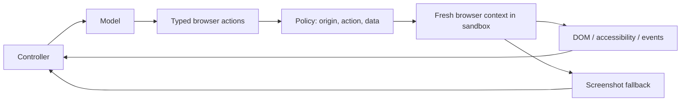
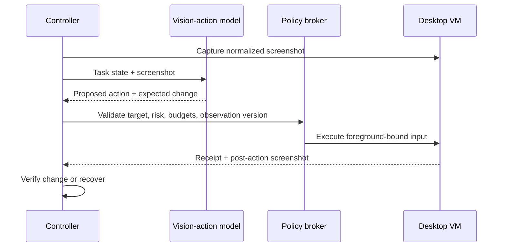
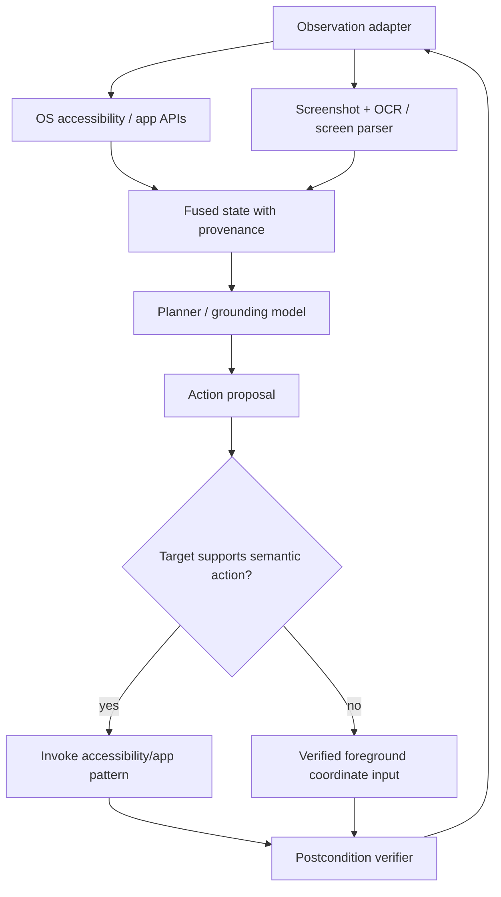

# Architecture and Runtime Selection

> **Last researched:** 2026-08-31  
> **Read after:** [Computer-Use Agent Blueprint](README.md)  
> **Purpose:** Choose the smallest architecture, language mix, model strategy, and deployment boundary that can satisfy the task and risk contract.

The best production computer-use architecture is usually not a pure end-to-end pixel loop. It is a deterministic controller around a hybrid perception/action adapter, with GUI control reserved for steps that lack a better contract.

## Start with the task surface

Classify every step in the proposed workflow, not only the task as a whole.

| Step surface | Preferred mechanism | Why | GUI fallback condition |
|---|---|---|---|
| Stable service operation | Typed API or domain tool | Explicit schema, identity, error, idempotency, and audit semantics | API omits required operation |
| Browser DOM | Playwright/WebDriver locator or browser tool | Element identity, auto-wait, origin/URL state, faster observations | Canvas, remote desktop, anti-automation-compatible user flow, or missing semantic state |
| Native app with automation API | COM/UNO/Apple Events/app SDK | Application-owned semantics and postconditions | Operation absent or visually defined |
| Native app with accessibility support | UI Automation, AX, AT-SPI | Roles, names, states, patterns, and targeted actions | Custom-drawn or incomplete accessibility surface |
| Arbitrary rendered UI | Screenshot grounding plus bounded input | Universal enough for legacy/custom surfaces | No reliable target or verification evidence: stop |
| Consequential commit | Deterministic effect service or user takeover | Exact identity, authorization, and reconciliation | Do not fall back to an unverified coordinate click |

Playwright's locators re-resolve elements and auto-wait for visibility, stability, event reception, and enabled state ([locators](https://playwright.dev/docs/locators), [actionability](https://playwright.dev/docs/actionability)). OS accessibility frameworks expose controls through trees and patterns ([Windows UI Automation](https://learn.microsoft.com/en-us/windows/win32/winauto/uiauto-uiautomationoverview), [AT-SPI](https://gnome.pages.gitlab.gnome.org/at-spi2-core/devel-docs/index.html)). These are stronger normal controls than raw coordinates, but custom widgets and canvas surfaces can still be opaque.

## Deterministic versus model-owned decisions

Put each decision on the deterministic side unless it genuinely requires interpretation under ambiguity.

| Decision | Default owner | Why the boundary matters |
|---|---|---|
| Authenticate principal, tenant, workload, and executor | Identity/control plane | A model statement is not identity proof |
| Canonicalize account, document, origin, destination, and effect | Domain adapter | Stable identity is required for authorization, approval, and reconciliation |
| Choose among visually plausible targets or interpret free-form intent | Model, inside a bounded milestone | This is where probabilistic perception/planning adds value |
| Validate schemas, supported action kinds, state versions, and budgets | Controller | Rejection must be complete, reproducible, and fail closed |
| Classify danger and enforce policy/consent | Policy engine | Visible text and model labels are untrusted inputs |
| Execute input or an application/API operation | Narrow executor/effect broker | Execution is privileged and needs fencing and receipts |
| Decide whether a consequential effect committed | Domain verifier/reconciler | UI appearance and model prose are insufficient |
| Detect exact/cyclic repetition and enforce stop limits | Controller | The stop rule must still work when the model is compromised or confused |

A model may propose a target, risk explanation, recovery, or success hypothesis. The corresponding deterministic component either resolves and validates it or returns a typed uncertainty. Do not ask the model to decide whether its own proposal is authorized, whether an approval still matches, or whether an ambiguous submit is safe to retry.

## Architecture variants

### Variant A: browser-semantic agent

Use for tasks confined to web pages.



Strengths:

- semantic targets and event-driven waits;
- cheap textual observations for many steps;
- fresh contexts isolate cookies and local storage between runs;
- deterministic URL/origin and download interception;
- straightforward application-state validators.

Limits:

- a browser context is test-state isolation, not an OS security boundary;
- remote-debugging access can expose profile state, so use a dedicated profile—Chrome now requires a non-default user-data directory for remote debugging in current releases ([Chrome security change](https://developer.chrome.com/blog/remote-debugging-port));
- cross-origin frames, downloads, extensions, browser chrome, native dialogs, and credential UI may leave the DOM surface;
- page content remains adversarial even when represented as structured text.

### Variant B: pixel-first desktop agent

Use only when the environment is narrow, disposable, and visually verifiable.



Strengths: broad compatibility and a representation close to what a person sees.

Limits: coordinate error, focus races, high image cost, weak element identity, ambiguous outcomes, and exposure to every visible instruction. Anthropic explicitly documents coordinate hallucination, latency, and lower reliability across niche or multiple applications; OpenAI and Google both require the application to execute actions and recommend isolated environments and human control for risky work ([Anthropic limitations](https://platform.claude.com/docs/en/agents-and-tools/tool-use/computer-use-tool), [OpenAI](https://developers.openai.com/api/docs/guides/tools-computer-use), [Google](https://ai.google.dev/gemini-api/docs/computer-use)).

### Variant C: semantic-plus-visual desktop agent — recommended

Combine OS/application semantics with pixels, while keeping one authoritative executor.



This is the default for serious desktop deployments because semantics provide identity and efficient state while screenshots reveal visual state, custom controls, occlusion, and whether an action actually changed the UI. OSWorld supports screenshot, accessibility-tree, and terminal observations; Microsoft tooling similarly combines UI Automation with visual parsing where required ([OSWorld paper](https://arxiv.org/abs/2404.07972), [OmniParser](https://github.com/microsoft/OmniParser)).

Fusion must retain provenance. Never present OCR text or a detector's inferred label as if it came from a trusted accessibility property.

### Variant D: deterministic workflow with visual exception handler

Use for repeatable business processes. Code owns the step graph; the model handles classification, layout drift, or a bounded visual branch.

This variant normally has the best reliability-to-complexity ratio. It limits model choice to places where variation is valuable and keeps commits in deterministic services. It is preferable to a general desktop agent when the workflow is known.

### Variant E: user-assist overlay

The agent highlights a target, explains the next step, or prepares content; the user performs the action. Use when the application cannot provide a safe automation boundary, the task is high impact, or policy requires human presence. It retains accessibility benefits without granting input authority.

## Recommended component boundaries

| Component | Owns | Must not own |
|---|---|---|
| Admission service | Identity, objective, environment, risk tier, budgets | UI execution |
| Run controller | State machine, leases, deadlines, cancellation, stale-result rejection | Long-lived OS credentials |
| Context compiler | Minimal trusted instructions, current observation, milestone summary | Authorization decisions |
| Model adapter | Provider request/response translation, usage, compatibility | Direct effect execution |
| Policy engine | Resource/action/data rules and confirmation obligations | Natural-language interpretation as its only input |
| UI executor | Screenshot, accessibility queries, typed input, receipts | Deciding whether an action is allowed |
| Credential broker | Short-lived fill/sign capability, token revocation | Returning raw secrets to model or clipboard |
| Outcome verifier | Authoritative postcondition checks and confidence | Declaring success from model prose alone |
| Evidence store | Events, redacted artifacts, retention and access control | Acting as model memory by default |

Keep the privileged guest executor small. The controller may be a conventional service; the guest agent should expose a narrow, versioned local RPC surface rather than a shell.

## Language selection

One language need not serve every boundary.

| Choice | Best fit | Strengths | Production cautions |
|---|---|---|---|
| TypeScript/Node.js | Browser-first controller, Playwright, operator UI | First-class browser ecosystem, shared types with web UI, strong async I/O | CPU-heavy vision work should be external; contain generated JavaScript |
| Python | Research/eval harnesses, model adapters, OSWorld-style environments, vision/OCR | Broad AI and automation ecosystem, rapid experiments | Do not turn arbitrary Python execution into the default action space; validate runtime types |
| C#/.NET | Windows UI Automation executor and Windows service | Native UIA/COM access, strong Windows deployment tooling | Windows-specific; integrity/session behavior needs explicit tests |
| Swift/Objective-C | macOS accessibility, ScreenCaptureKit/Core Graphics, Virtualization | Native permission and VM APIs | TCC/accessibility permissions are broad and interactive; keep them off the user's main session |
| Rust or Go | Narrow cross-platform broker, proxy, supervisor | Small deployable, predictable resource use, good concurrency | Native GUI bindings vary; additional language is justified only at a real privilege/performance boundary |

### Practical default

- Browser-first product: TypeScript controller and Playwright executor in a hardened browser runtime.
- Cross-platform research or early product: Python controller plus per-OS native executor adapters.
- Windows-only production desktop automation: service/controller in the team's normal backend language, C# guest executor for UIA/input, and Python only for offline evaluation or vision services.
- macOS-only product: Swift executor inside a dedicated VM or account; controller language remains independent.

Do not add a native helper merely to look hardened. Add it when it materially reduces the privileged interface, improves platform correctness, or isolates unsafe model-generated code.

## Model selection and routing

Select a model as part of a versioned agent release, not from a generic leaderboard.

### Required model/harness evaluation dimensions

- screenshot grounding at your native resolutions, scaling, themes, locales, and DPI;
- structured action/schema adherence and unknown-action behavior;
- task completion and repeated-run consistency;
- instruction hierarchy and prompt-injection resistance;
- ability to stop, ask, and hand control back;
- expected-change prediction and post-action correction;
- input/output/image token use, time to first action, and per-step latency;
- provider retention, region, safety responses, and tool version compatibility.

### Routing policy

| Work | Suggested model class | Gate |
|---|---|---|
| Simple visible navigation in a known app | Lower-latency computer-use-capable model | Only after per-app task/grounding gate passes |
| Ambiguous multi-app planning or recovery | Stronger planner/vision model | Budgeted escalation; do not increase authority |
| Target grounding on dense screen | Specialized grounding/parser or high-resolution vision | Cross-check target bounds and state before action |
| Progress/stuck classification | Small deterministic or vision classifier | Cannot authorize actions or success alone |
| Consequential outcome verification | Deterministic application state first; independent model second if needed | Model judge is advisory unless validated for the exact task |

Start with one capable model and deterministic verifiers. Split planner, grounder, and verifier only after traces show a distinct failure class and controlled evaluation shows that the split improves severe-failure rate, not just average score. Multiple models add cost, latency, version combinations, and correlated failure modes.

## Runtime and deployment shapes

| Shape | Use | Avoid when |
|---|---|---|
| Local browser context | Trusted development and deterministic test sites | Authenticated sensitive browsing or hostile content |
| Browser container | Browser-only service with controlled mounts/egress | Host profile, arbitrary downloads, native apps, or high-value credentials are reachable |
| Dedicated desktop account/session | Low-risk internal assistive workflow | Strong adversary, multi-tenant service, or user's personal session shares clipboard/files/credentials |
| Disposable full VM | General desktop, hostile content, multi-tenant or high-impact environments | OS/app cannot be licensed/virtualized or startup cost violates SLO |
| Managed remote desktop pool | Enterprise desktop apps and centralized controls | Tenant isolation, image hygiene, and session ownership cannot be proven |
| User's active workstation | Highlight/read-only assistance with explicit user presence | Autonomous input or access to ambient personal/corporate state |

Containers are packaging and process boundaries around a shared kernel. They can be adequate for a tightly scoped browser prototype; a full desktop agent that processes untrusted content and can launch applications should normally get a VM or equivalent kernel boundary. Provider examples often use containers for accessibility, not as proof of hostile multi-tenant isolation—Anthropic labels its X11/VNC container reference as deliberately minimal and weakly separated ([quickstart](https://github.com/anthropics/anthropic-quickstarts/tree/main/computer-use-demo)).

## Domain identity and version semantics

Do not use a window title, accessible name, file path string, or screenshot region as the sole identity of a resource. Define canonical domain identities before action schemas:

```yaml
resource_ref:
  tenant_id: tenant_8c
  app_id: com.example.mail
  account_id: support@example.com
  resource_kind: draft_message
  resource_id: draft_731
  resource_version: 19
ui_binding:
  environment_id: env_f42
  desktop_session_id: desk_18
  process_start_id: proc_4812_20260831T1012Z
  window_id: hwnd_0x000A13F2
  observation_id: obs_91
  semantic_revision: 44
```

Identity fields answer **which thing**; version fields answer **which observed state of that thing**. IDs may be stable only within a process, browser context, desktop session, or application release, so declare their scope. A process restart invalidates process-local accessibility nodes; navigation invalidates frame/DOM references; an RDP reconnect may preserve the OS session while changing display geometry; a document save may preserve identity while changing its version.

Rules:

- canonicalize account, tenant, destination, path, URL/origin, and business resource outside the model;
- link UI targets to canonical resources when the application exposes that relationship;
- use compare-and-set or equivalent version checks for mutable state;
- treat missing version semantics as uncertainty, not as version `0` or “latest”;
- never reuse an approval, observation, target, or capability across a changed identity/version scope;
- put schema, adapter, policy, model, prompt/context compiler, OS image, app, locale, display, and verifier versions in one release manifest.

## Adapter qualification, not cross-platform normalization

Native automation surfaces are not interchangeable. Qualify the exact adapter, OS/app build, session type, and operation—not an abstract “desktop” capability.

| Surface | Useful contract | Material limitation to test before adoption |
|---|---|---|
| Windows UI Automation (UIA) | Element properties, patterns, events, and bounds | Coverage depends on each application's provider; runtime elements can be recreated; integrity/UIPI and secure-desktop boundaries still apply |
| Appium Windows driver / WinAppDriver protocol | WebDriver-style Windows UI tests over UIA | Microsoft says the original WinAppDriver is no longer actively developed and recommends Appium's Windows driver for current Windows app testing; do not infer agent safety, focus fencing, or effect semantics ([Microsoft testing guidance](https://learn.microsoft.com/en-us/windows/apps/develop/testing/)) |
| Microsoft `winapp ui` | UIA inspection/invoke plus screenshot and guarded input verbs | Public Preview; input-injecting verbs require an unlocked interactive desktop and foreground target, while framework-specific controls still need fallbacks ([status](https://github.com/microsoft/winappCli), [UI automation](https://learn.microsoft.com/en-us/windows/apps/dev-tools/winapp-cli/ui-automation)) |
| macOS Accessibility (AX) / Automation | Accessibility elements/actions and app-specific Apple Events | Separate broad TCC grants; app sandbox forbids arbitrary Apple Events and assistive accessibility use, so a signed dedicated executor and explicit deployment/consent plan are required ([App Sandbox limits](https://developer.apple.com/documentation/security/protecting-user-data-with-app-sandbox)) |
| Linux AT-SPI | Accessible-object roles, state, actions, and events | Desktop/app coverage varies; X11 access is ambient, while Wayland capture/input commonly goes through compositor-specific portals and user-granted sessions |
| XDG RemoteDesktop + ScreenCast portals | Consent-mediated PipeWire capture and keyboard/pointer/touch sessions | Backend/compositor support varies; restore tokens are single-use and revocable; stream node IDs can be reused, so newer serial/mapping identity should be preferred ([RemoteDesktop v2](https://flatpak.github.io/xdg-desktop-portal/docs/doc-org.freedesktop.portal.RemoteDesktop.html), [ScreenCast v6](https://flatpak.github.io/xdg-desktop-portal/docs/doc-org.freedesktop.portal.ScreenCast.html)) |
| Playwright | Locators, actionability, browser events, permissions, downloads, and fresh contexts | Context isolation covers browser state, not host security. CDP attach is Chromium-only and explicitly lower fidelity than Playwright protocol; default user profiles are unsupported for automation ([BrowserType](https://playwright.dev/docs/api/class-browsertype)) |
| RDP/VDI session | Centralized interactive desktop and enterprise controls | Disconnect can preserve processes while reconnect redraws at a new resolution; client redirection, session ownership, focus, latency, licensing, and pool hygiene require platform-specific tests ([Microsoft RDS behavior](https://learn.microsoft.com/en-us/troubleshoot/windows-server/remote/terminal-server-startup-connection-application)) |
| OCR / screen parser | Text, boxes, and inferred interactable regions when semantics are absent | Confidence is not identity. GUI fonts, tiny text, icons, locale, theme, overlays, and adversarial pixels require per-slice evaluation; cloud OCR also creates a data/region/quota boundary |
| Secrets/artifact/observability adapters | Leased secrets, immutable/versioned evidence, correlated telemetry | A vault cannot verify UI destination, object lock does not redact artifacts, and telemetry conventions do not define CUA policy; qualify identity, deletion, revocation, residency, and outage behavior independently |
| Container, user-space kernel, VM, or managed sandbox | Isolation and lifecycle primitive | Product names are not security levels. Record guest/host kernels, devices, mounts, egress, control sockets, tenant allocation, cleanup proof, escape patching, and recovery behavior |

For every adapter, keep a qualification record with owner, artifact/version digest, supported operations/apps/OS/session modes, permissions, identity/freshness semantics, timeout/cancellation behavior, error mapping, security boundary, data path/retention, concurrency limits, known unsupported cases, conformance/failure-injection results, rollback version, and review/expiry date. A green record for Windows 11 UIA in one app does not qualify macOS AX, a different Windows integrity level, Citrix/RemoteApp, or even the next app release.

## Framework convenience versus application guarantees

| Capability | A framework/provider may provide | Application still owns |
|---|---|---|
| Action schema | Click/type/scroll/wait tool definitions | Allowed targets, focus check, freshness, coordinate transform, risk class |
| Loop | Tool-call repetition and max turns | Total deadline, all budgets, cancellation barrier, stuck detection, terminal verification |
| Safety signal | Confirmation request or injection classifier | Policy decision, exact-effect approval, fail-closed behavior, incident handling |
| Screenshot handling | Image encoding/detail and model coordinate convention | Capture permission, redaction, geometry, retention, sensitive-window exclusion |
| Session state | Conversation IDs or history | Durable run/effect state, leases, recovery, tenant isolation |
| Batch actions | Lower round-trip latency | Sequential execution, first-failure stop, no batch across confirmation/verification boundary |
| Tracing | Model/tool spans | Action receipts, screenshot evidence, privacy controls, effect reconciliation |
| Evaluation | Generic benchmark results | Environment-specific acceptance, severe-failure gates, release decision |

The provider loop is an adapter inside your controller. Never make provider message history the only source of run truth.

## Selected reference architecture

For a new production build, use:

1. deterministic task admission and risk classification;
2. a controller with explicit state, action, effect, and approval records;
3. a hybrid observation adapter (semantic tree/API plus screenshot);
4. one model behind a versioned adapter;
5. a deterministic policy engine before every action;
6. a minimal per-OS executor in a disposable environment;
7. opaque credential, file, clipboard, and network brokers;
8. post-action and terminal verifiers using authoritative state;
9. privacy-tiered event/artifact storage;
10. application-specific regression and failure-injection suites.

This is a custom control plane with replaceable framework/provider adapters. It is intentionally less general than a universal desktop-agent platform; that restriction is a production feature.

## Architecture review checklist

- [ ] Each step uses the strongest available semantic contract before pixels.
- [ ] Browser-only tasks cannot escape into the host desktop.
- [ ] Desktop tasks run outside the user's everyday interactive session.
- [ ] One controller owns focus and input for the session.
- [ ] The model cannot reach raw OS, shell, credential, clipboard, or network capabilities directly.
- [ ] Provider or framework state is not the system of record.
- [ ] Language boundaries correspond to real platform or privilege boundaries.
- [ ] Model routing changes latency/cost/capability, never authorization.
- [ ] Consequential commits have a deterministic service or user-takeover path.
- [ ] Every claimed guarantee names the component that enforces it.

Next: [Perception, grounding, and application state](perception-grounding-and-application-state.md).
