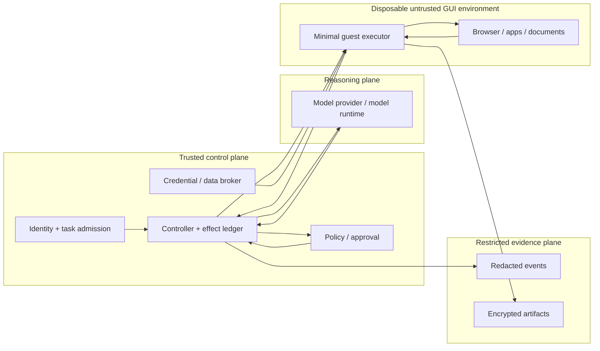
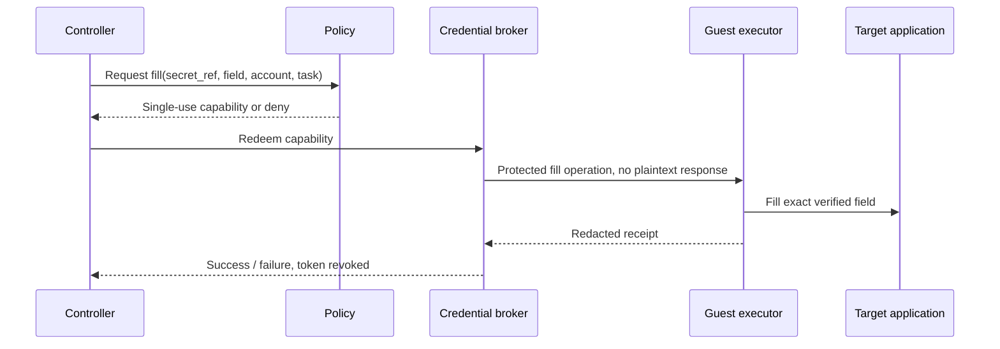

# Isolation, Permissions, Credentials, and Data Boundaries

> **Last researched:** 2026-08-31  
> **Purpose:** Contain a computer-use agent even when the model, page, document, application, or dependency behaves adversarially.

Computer use combines two dangerous properties: it reads attacker-controlled interfaces and it can act with the user's ambient authority. Prompt-injection resistance is not enough. Reduce the information and authority present in the environment so a successful hijack still has little to steal or change.

## Threat model

### Assets

- user and tenant data visible in applications, files, notifications, clipboard, and screenshots;
- browser cookies, local/session storage, autofill, saved passwords, passkeys, and extensions;
- OS keychain/vault, SSH/GPG agents, cloud credentials, API keys, and device identity;
- corporate network, metadata services, localhost services, mounted drives, printers, camera, and microphone;
- the user's reputation, money, legal consent, account authority, and external communications;
- audit artifacts and model transcripts, which may reproduce sensitive screen content;
- the host, hypervisor, orchestration control plane, base images, and guest-agent update channel.

### Adversaries and failure sources

- malicious webpage, email, chat, document, image, QR code, or UI text containing direct/visual prompt injection;
- compromised or malicious application, browser extension, download, macro, dependency, model/tool server, or guest image;
- legitimate but misleading interface, dark pattern, stale session, wrong account, or deceptive dialog;
- model error, hallucinated coordinate, instruction-hierarchy failure, or over-persistent plan;
- cross-tenant environment reuse, stale credentials, operator error, and observability leakage;
- concurrent process or human changing focus/state;
- attacker probing exposed VNC/RDP/CDP/guest-agent endpoints.

### Security objective

The system should remain safe under the assumption that **any content shown to the model can control the model**. Model training and classifiers lower likelihood; deterministic isolation, least privilege, authorization, and confirmation cap impact.

WASP and VPI-Bench demonstrate that realistic visual/web prompt injections can redirect browser/computer agents, including advanced models and instruction-hierarchy defenses ([WASP](https://arxiv.org/abs/2504.18575), [VPI-Bench](https://openreview.net/pdf?id=UMauKu2azg)). Treat current defenses as probabilistic detection, not proof that on-screen instructions are safe.

## Trust-zone architecture



The guest must not initiate arbitrary calls into the trusted control plane. Use mutually authenticated, narrow RPC; bind every request to run/environment/capability identity; and reject replayed or expired capabilities.

## Choose the isolation boundary

| Boundary | Appropriate use | What it isolates | Important gaps |
|---|---|---|---|
| Fresh browser context | Test reproducibility and per-run browser state | Cookies/storage/cache within browser process | Same browser/OS process, host files/devices/network; not hostile-code isolation |
| Dedicated browser profile + container | Browser-only low/medium-risk workflow | Profile and process namespaces; controlled mounts/egress | Shared kernel; browser/daemon sockets and host mounts can collapse boundary |
| Dedicated OS account/session | Trusted internal application workflow | User files/process/session to a degree | Same kernel/device; admin/host services; clipboard/session bridging; weak multi-tenancy |
| Hardened container/user-space kernel | Browser or Linux GUI service at scale | Stronger process/syscall isolation than ordinary container | GUI/device compatibility and still not a full independent OS |
| Full VM / equivalent kernel boundary | General desktop, hostile content, tenant isolation | Guest kernel, disk, account, desktop, apps | Hypervisor/device surface; shared folders/clipboard/network can re-open host boundary |
| Separate host/project/account | High-value or regulated boundary | Host/control-plane and cloud/account reach | Cost and operational complexity |

Provider docs broadly recommend a dedicated VM or container with minimal privilege ([Anthropic](https://platform.claude.com/docs/en/agents-and-tools/tool-use/computer-use-tool), [OpenAI](https://developers.openai.com/api/docs/guides/tools-computer-use)). Interpret the “or” through your threat model. Anthropic's own X11/VNC container demo warns that components are weakly separated and is intentionally minimal ([quickstart](https://github.com/anthropics/anthropic-quickstarts/tree/main/computer-use-demo)).

### Recommended default

- Browser-only, trusted domains, no downloads/code: isolated browser context inside a hardened service/container, with dedicated profile and egress policy.
- Arbitrary internet, downloads, native dialogs, or sensitive authenticated state: disposable VM.
- General desktop or multiple apps: disposable full VM with one tenant/run, no host desktop bridging.
- High-value credential or irreversible effect: keep the credential/effect outside the guest and broker a one-use operation; often require user takeover.

## Virtual desktop hardening

### Base image

- minimal patched OS and required apps only;
- signed, versioned, vulnerability-scanned image and guest executor;
- no developer tools, package managers, compilers, shells, office macros, browser extensions, or remote admin agents unless the task explicitly needs them;
- deterministic locale, timezone, font set, DPI, display resolution, theme, and accessibility settings;
- no default credentials, cached tokens, user history, recent files, or shared enterprise device identity;
- EDR/telemetry compatible with the isolation and privacy model;
- verified clean snapshot after provisioning, not after user login.

### Devices and host bridges

Deny by default:

- shared clipboard and drag/drop;
- host folders and drives;
- host browser profile;
- camera, microphone, USB, Bluetooth, printer, smart card, and GPU passthrough;
- SSH agent, keychain/vault sockets, Docker/container daemon, Wayland/X sockets from the host;
- localhost/host-gateway and cloud metadata endpoints;
- hypervisor management sockets and guest-control APIs.

Enable only the precise bridge required, with directionality and size/type limits. Windows Sandbox, for example, enables networking and clipboard redirection by default; Microsoft warns that networking can expose the internal network and writable mapped folders persist effects to the host. A secure computer-use deployment must override those defaults ([configuration documentation](https://learn.microsoft.com/en-us/windows/security/application-security/application-isolation/windows-sandbox/windows-sandbox-configure-using-wsb-file)).

Illustrative Windows Sandbox test configuration:

```xml
<Configuration>
  <Networking>Disable</Networking>
  <ClipboardRedirection>Disable</ClipboardRedirection>
  <PrinterRedirection>Disable</PrinterRedirection>
  <AudioInput>Disable</AudioInput>
  <VideoInput>Disable</VideoInput>
  <vGPU>Disable</vGPU>
  <ProtectedClient>Enable</ProtectedClient>
  <MappedFolders>
    <MappedFolder>
      <HostFolder>C:\cua\readonly-input</HostFolder>
      <SandboxFolder>C:\task-input</SandboxFolder>
      <ReadOnly>true</ReadOnly>
    </MappedFolder>
  </MappedFolders>
</Configuration>
```

This is an example for a controlled test host, not a universal production platform. Validate supported settings and operational behavior on the exact Windows version. Full VMs or remote desktop pools often provide better lifecycle control for services.

Apple's Virtualization framework supports macOS and Linux VMs with explicit storage, network, graphics, keyboard/pointer, shared-directory, and clipboard devices. Adding a device is adding authority; omit host-sharing devices by default ([Apple Virtualization](https://developer.apple.com/documentation/virtualization)).

### Lifecycle

1. allocate from a known-clean, immutable version;
2. assign one tenant/run and an exclusive desktop lease;
3. inject only task-scoped data and short-lived capabilities;
4. execute with network and resource budgets;
5. export explicitly approved artifacts through a quarantine/scanner;
6. revoke capabilities and remove network access;
7. preserve incident evidence if triggered;
8. destroy disk/memory/session; never “clean up” and reuse as equivalent to reset.

## OS permission boundary

| Platform | Observation/control permissions | Design consequence |
|---|---|---|
| Windows | UI Automation, interactive desktop, integrity/UIPI, screen capture, input injection | Run executor at the minimum matching integrity; deny elevated apps and secure desktop; verify foreground |
| macOS | Accessibility trust, screen recording/capture, event posting/listening, Automation/Apple Events | TCC grants are broad and user-visible; give them to a dedicated signed guest component, not a general agent host |
| Linux/X11 | X server access often permits broad observation/input; AT-SPI over D-Bus; `/dev/uinput` creates virtual devices | Isolate display and D-Bus; never mount host X/Wayland or input device sockets into untrusted guest |
| Browser | WebDriver/CDP endpoint, browser permissions, profile storage | Bind control port locally/mTLS, use dedicated profile, reset permissions, intercept downloads/navigation |

Windows UIA is designed for accessibility and automation, while raw `SendInput` is OS-wide and subject to integrity restrictions ([UIA](https://learn.microsoft.com/en-us/windows/win32/winauto/uiauto-usefortesting), [SendInput](https://learn.microsoft.com/en-us/windows/win32/api/winuser/nf-winuser-sendinput)). macOS exposes explicit checks for trusted accessibility clients and screen-capture access ([AX trust](https://developer.apple.com/documentation/applicationservices/1459186-axisprocesstrustedwithoptions), [screen capture](https://developer.apple.com/documentation/coregraphics/cgpreflightscreencaptureaccess%28%29)). Linux `uinput` should be considered privileged device access ([kernel docs](https://kernel.org/doc/html/latest/input/uinput.html)).

Do not solve a permission error by running the whole controller as administrator/root.

## Browser profile and authenticated state

Never attach an agent to the user's default browser profile. It may expose every logged-in origin, history, autofill, extensions, bookmarks, downloads, and saved credential flow.

Use:

- a new profile/context per run or purpose-bound persistent profile per account;
- a separate browser binary/channel for automation where supported;
- no extensions except reviewed mandatory ones;
- origin/action allowlists and navigation interception;
- download disabled or quarantined;
- browser permissions reset and denied by default;
- bounded cookies/storage import through an authenticated broker;
- no remote-debug endpoint on an external interface;
- profile encryption keys scoped to the environment.

Chrome changed remote-debugging behavior from version 136 to require a non-default user-data directory when debugging, specifically to reduce cookie/credential extraction abuse ([Chrome for Developers](https://developer.chrome.com/blog/remote-debugging-port)). Treat a CDP port as privileged profile access.

## Credential boundary

### Never give the model raw credentials

Do not place passwords, tokens, recovery codes, private keys, or one-time codes in:

- prompts or conversation history;
- system/environment variables visible to guest processes;
- clipboard;
- files in the desktop;
- screenshots or OCR;
- tool arguments/results and traces;
- reusable browser profiles.

OS vault protection is not enough once an agent can drive the authenticated UI. Windows Credential Guard protects selected domain credential material using virtualization-based security but does not protect every credential or prevent abuse of an already authenticated application ([Microsoft](https://learn.microsoft.com/en-us/windows/security/identity-protection/credential-guard/how-it-works)). Apple Keychain is encrypted credential storage, but a broad authorized client or UI session can still use accessible items ([Apple Keychain](https://developer.apple.com/documentation/security/keychain-services)).

### Opaque fill/sign broker



Prefer delegated short-lived tokens and application APIs over UI password entry. For MFA, passkeys, CAPTCHA, password changes, or safety warnings, use user takeover. Do not screenshot a one-time code so the model can type it.

## Files, downloads, and uploads

Separate:

- read-only task inputs;
- writable scratch space;
- executable locations;
- approved output staging;
- evidence artifacts unavailable to the guest.

Rules:

- canonicalize paths and resolve symlinks/junctions before authorization;
- deny host home, cloud sync, source workspaces, credential stores, startup folders, hooks, and sockets;
- content-sniff and malware-scan downloads in quarantine;
- prevent execution bits/macros/shortcuts by default;
- export only declared files through a broker with type/size/hash/DLP checks;
- never let a website choose an unrestricted download path;
- never expose a host/workspace file picker to the guest. Import an approved immutable file through a broker, bind its source classification and hash to the task, and mount/stage only that object;
- intercept upload/file-chooser requests and authorize the exact target app/origin/account, destination field/purpose, file hash/type/size/class, and expiry before releasing a one-use guest path or handle;
- re-read the selected filename/hash and destination immediately before upload/submit; invalidate approval if the application substitutes, transforms, or adds files;
- scan/DLP-check both ingress and egress, but do not treat a clean malware result as permission to disclose the file;
- use stable operation IDs for file replacement/move/delete;
- snapshot/backup before destructive file changes, without treating backup as authorization.

## Clipboard

The clipboard is a cross-application, cross-trust data bus. It can contain passwords, identifiers, rich HTML, files, or malicious commands. The W3C Clipboard specification treats clipboard APIs as powerful features and documents phishing, self-XSS, hidden-data, local-file, and privacy risks ([specification](https://www.w3.org/TR/clipboard-apis/)).

Default policy:

- disable host↔guest clipboard redirection;
- give the agent no general clipboard-read tool;
- use direct field fill or scoped `copy_from_target`/`paste_to_target` operations;
- bind source app/field, destination app/field, MIME type, byte limit, data class, and expiry;
- strip active/rich formats unless explicitly needed;
- never route credentials through clipboard;
- clear guest clipboard after the scoped operation and log only a hash/class/size.

## Network and egress

Domain allowlists are necessary but insufficient. Bind egress policy to:

- destination after DNS and redirects, scheme, port, method, path/API operation;
- tenant/account identity and credential audience;
- request content/data classification and byte limits;
- response type/size and download handling;
- localhost, RFC1918/private networks, metadata endpoints, DNS rebinding, and proxy bypass;
- WebSocket/WebRTC/QUIC and alternate protocol paths;
- total requests, bytes, concurrency, and duration.

For browser tasks, enforce policy at both the browser/navigation layer and network proxy. A page can submit data without visibly navigating. For desktop apps, route all guest egress through an authenticated proxy; deny direct network interfaces when possible.

## Prompt-injection controls

Use defense in depth:

1. label screen/page/document content as untrusted in context;
2. use provider classifiers where available and log their version/decision;
3. separate trusted task intent from observed content;
4. limit apps, origins, actions, sensitive data, and egress;
5. block on-screen instructions from creating authority;
6. require exact-effect confirmation for external impact;
7. use an independent policy engine and commit-time revalidation;
8. detect unexpected navigation, new destinations, secret requests, and scope expansion;
9. stop and quarantine on suspected injection rather than asking the compromised loop to self-repair;
10. continuously test with visual, OCR, accessibility-tree, document, and cross-origin injections.

Anthropic says its official tool runs prompt-injection classifiers automatically for supported current tool versions, while Google documents prompt-injection detection as opt-in for supported Gemini computer-use models. This disagreement is a provider/version fact, not a design choice; query capabilities and never assume protection from tool naming alone ([Anthropic](https://claude.com/blog/best-practices-for-computer-and-browser-use-with-claude), [Google](https://ai.google.dev/gemini-api/docs/computer-use)).

## Supply-chain and update controls

A disposable guest is rebuilt frequently, so a compromised image, executor, browser extension, OCR model, automation driver, or updater compromises every run.

- pin the base image, OS packages, browser, applications, automation adapter, model/weights, redactor/OCR/parser, and policy bundle by immutable digest;
- generate and retain an SBOM/provenance record; verify signatures and publisher identity before promotion;
- prohibit package managers, self-update, extension installation, macros, unsigned plugins, and downloaded executables in the run environment unless the task is a separately isolated software-analysis workflow;
- mirror reviewed dependencies and model weights; scan both code and serialized model artifacts; record every component's license and deployment restriction;
- separate build, signing, image registry, rollout, and runtime identities; a guest must not possess image-publish or policy-update credentials;
- authenticate guest-executor updates and control-plane RPC; rotate keys and reject downgrade/replay;
- stage OS/app/browser/driver updates through component tests, adversarial/failure injection, shadow, canary, and full-bundle rollback;
- drain and destroy environments on a vulnerable or revoked digest; do not “patch in place” and return them to a clean pool;
- treat hosted OCR/vision, secrets, artifact, remote-desktop, and telemetry services as data-processing dependencies with explicit region, retention, outage, quota, tenant-isolation, and deletion tests.

Microsoft OmniParser illustrates why the artifact matters: the repository and individual model components have different licenses, including an AGPL-licensed detector checkpoint and MIT-licensed caption checkpoints; an organization must review the exact deployed weights rather than relying on the repository label ([repository](https://github.com/microsoft/OmniParser)). A “latest” dependency or model alias is not a releasable production identity.

## Incident response

Trigger on suspected injection, unexpected origin/app, secret exposure, policy bypass attempt, unapproved external effect, executor compromise, or cross-tenant artifact.

1. stop scheduling and revoke action/credential/network capabilities;
2. quiesce input; do not continue model conversation in the same environment;
3. isolate the VM/network and mark external effects unknown until reconciled;
4. preserve access-controlled screenshots, events, process/network state, and image/version metadata;
5. revoke downstream sessions/tokens and rotate exposed secrets;
6. reconcile sends, writes, deletes, purchases, and permission changes;
7. destroy the guest after evidence capture;
8. promote the incident into a regression and threat test;
9. review whether retained traces/artifacts also contain compromised or sensitive content.

For a supply-chain incident, additionally freeze the implicated release manifest, revoke signing/deployment credentials if exposure is possible, enumerate runs by digest, quarantine warm/persisted environments, and decide whether downstream effects need reconciliation or users need notification.

## Security acceptance checklist

- [ ] The environment is disposable and single-tenant/run at the chosen risk tier.
- [ ] Clipboard, shared folders, devices, default profile, metadata, and host sockets are denied by default.
- [ ] General desktop work does not run on the user's active session.
- [ ] The executor uses minimum OS permissions; controller/model are not elevated.
- [ ] Credentials are opaque, short-lived, audience-bound, and never model-visible.
- [ ] Downloads and file export pass through quarantine and DLP/type checks.
- [ ] Browser and network layers both enforce origin/destination/data policy.
- [ ] Prompt injection is assumed possible even with classifiers.
- [ ] Images, adapters, dependencies, parsers/models, and policy bundles are signed/digest-pinned with provenance and rollback.
- [ ] Runtime guests cannot self-update or publish trusted images/policies.
- [ ] High-impact actions have deterministic confirmation/takeover gates.
- [ ] A tested kill switch revokes input, credentials, and network access.
- [ ] Cross-tenant reuse and cleanup are proven by destruction, not best-effort deletion.

Next: [State, context, planning, stuck detection, and recovery](state-context-planning-stuck-detection-and-recovery.md).
