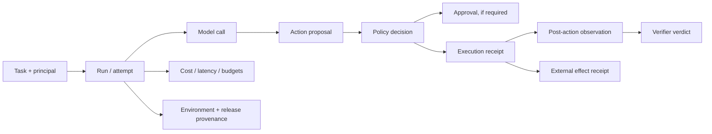
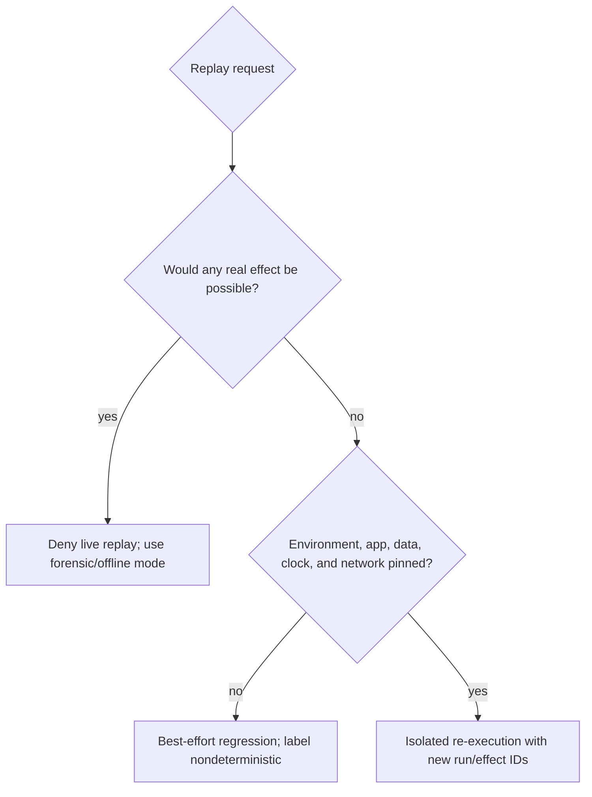

# Observability, Audit Replay, and Evaluation

> **Last researched:** 2026-08-31  
> **Purpose:** Make every run explainable, privacy-aware, reproducible enough to diagnose, and measurable across perception, task, safety, recovery, and operations.

A screen recording alone is not an audit trail, and a final screenshot is not proof of success. Correlate task intent, model proposals, policy decisions, input execution, UI observations, authoritative state, approvals, and external-effect receipts.

## Evidence model



Each node has its own immutable ID and links to the same run, attempt, environment, and trace. Keep events append-only; corrections append a superseding event rather than rewriting history.

## Event contract

Minimum fields:

```yaml
event_id: evt_01J...
event_type: cua.action.observed
event_version: 1
occurred_at: 2026-08-31T10:15:23.184Z
recorded_at: 2026-08-31T10:15:23.210Z
trace_id: 4bf92f3577b34da6a3ce929d0e0e4736
run_id: run_01J...
attempt: 2
lease_generation: 5
tenant_id: tenant_8c...
principal_id: user_2a...
environment_id: env_f42...
agent_release: cua-agent/0.9.0
controller_version: controller/1.12.3
executor_version: windows-executor/1.8.2
model_route:
  provider: example
  requested_model: visual-agent-v4
  response_model: visual-agent-v4-20260820
policy_version: cua-policy/7
action_id: act_01J...
observation_before: obs_91
observation_after: obs_92
result: observed
artifacts:
  - id: art_77
    role: post_action_crop
    sha256: "..."
    sensitivity: confidential
```

Use W3C Trace Context to propagate trace identity across controller, provider adapter, policy, executor, and verifier ([specification](https://www.w3.org/TR/trace-context/)). OpenTelemetry has evolving GenAI attributes for model, agent, tool, usage, and content, but warns that prompts, tool arguments, and results can be sensitive; pin a semantic-convention version and add CUA-specific events rather than placing screenshots or full content in span attributes ([OpenTelemetry](https://opentelemetry.io/docs/specs/semconv/registry/attributes/gen-ai/)).

## Separate metrics, traces, logs, audit, and SLOs

These records correlate but are not substitutes.

| Signal | Question answered | Shape and retention | Must not become |
|---|---|---|---|
| Metrics | Is the fleet healthy and within capacity/error/cost bounds? | Aggregated counters, gauges, histograms; low-cardinality labels; operational retention | Per-run evidence or a high-cardinality dump of user/resource IDs |
| Traces | Where did one request/run spend time and cross service boundaries? | Sampled spans with trace/run/action correlation and minimal attributes | Screenshot/prompt store or authoritative audit ledger |
| Diagnostic logs | Why did a component fail locally? | Structured, severity-controlled, sampled/rate-limited events | Secret-bearing printf stream or reconstructed user content by default |
| Security/business audit | Who/what observed, authorized, approved, attempted, committed, reconciled, exported, or deleted? | Append-only/tamper-evident typed events and selected evidence under policy retention | Sampled-away telemetry or mutable application log |
| SLOs and error budgets | Is delivered service meeting an explicit reliability objective? | Derived objectives over well-defined eligible events and windows | Dashboard threshold with no denominator, exclusions, or owner |

Define cardinality and content rules before instrumentation. Put `run_id`/`action_id` in traces/logs/audit for joins, but avoid them as unbounded metric labels. Audit must remain available when trace sampling drops a run. Local hard safety budgets and cancellation fencing must continue if metrics/exporters are unavailable. OpenTelemetry's general semantic conventions were observed at 1.44.0 on 2026-08-31, while GenAI attributes had moved to a separate repository and older registry entries were marked moved/deprecated; pin the emitted schema and translate at the telemetry boundary rather than binding durable audit records to unstable names ([semantic conventions](https://opentelemetry.io/docs/specs/semconv/)).

## What to record

### Always

- authenticated task contract, principal/tenant, risk tier, and environment scope;
- release versions: prompt/policy/context compiler/model route/tool schema/executor/base image/app;
- state transitions, leases, budgets, cancellation, takeover, and recovery;
- model request/response identifiers, usage, latency, and structured proposals;
- policy decisions and rule/obligation identifiers;
- approval digest/decision/actor/expiry, without secrets;
- executor transport, verified target, timing, and typed result;
- pre/post observation IDs, fingerprints, geometry, app/window/origin;
- verifier identity, evidence, verdict, and confidence/limitations;
- effect identity, downstream receipt, and reconciliation state;
- cleanup/destruction and capability revocation.

### Sample or retain only when justified

- full screenshots and video;
- raw semantic/accessibility trees;
- prompts, page text, OCR, and model outputs;
- typed text, clipboard content, files, and downloaded artifacts;
- debug dumps, crash state, and process/network captures.

### Never in ordinary logs

- passwords, passkeys, private keys, session cookies, OAuth tokens, one-time codes;
- unredacted authorization headers or secret-bearing URLs;
- secret-field pixels or keystrokes;
- model hidden reasoning/chain-of-thought;
- unrelated applications or tenants captured from a shared desktop.

## Artifact handling

| Artifact | Storage | Access | Retention |
|---|---|---|---|
| Redacted action crop | Encrypted object store | Run owner, support by role | Short, policy-based |
| Full screenshot | Incident/eval escrow only | Restricted security/eval role | Shortest justified period |
| Semantic tree | Encrypted; field-level redaction | Engineering/support | Short; delete with run |
| Effect receipt | Durable ledger | Audit/operations | Business/compliance period |
| Model payload | Provider plus optional application copy | Restricted; region/contract aware | Endpoint and application policy |
| Evaluation video | Synthetic/test data only by default | Eval team | Dataset version lifetime |

Hash artifacts for integrity, but remember that hashes of low-entropy secrets can be brute-forced. Redact or tokenize first, salt keyed fingerprints where correlation is needed, and keep encryption keys/tenant boundaries separate.

## Audit replay has three meanings

### 1. Forensic reconstruction — required

Render a timeline of the original run from immutable events and artifacts:

- trusted task and direct user changes;
- screen/semantic observations shown to the model;
- proposed versus executed actions;
- policy/approval outcomes;
- expected versus observed UI change;
- effect reconciliation and final evidence;
- latency/cost/budget and recovery annotations.

This replay must never execute actions.

### 2. Offline decision replay — useful

Feed recorded, redacted observations to a new agent release and compare proposed actions without connecting an executor. It helps detect policy/schema/grounding regressions, but cannot reveal how the new action would have changed the environment.

### 3. Environment re-execution — dangerous and nondeterministic

Recreate a pinned VM/app/data snapshot and run the actions or agent again. This is valid only in a synthetic environment with external effects stubbed or isolated. Live websites, time, network, authentication, randomness, and server state prevent exact replay.



Never reuse original idempotency keys, approvals, credentials, or effect capabilities in a replay.

## Evaluation stack

Evaluate components and the whole system.

### Baselines before agent claims

Compare the same task fixtures and authoritative graders against:

1. no automation / human completion, including time and error distribution;
2. stable API or deterministic workflow;
3. traditional RPA/test script with selectors;
4. browser-semantic or native-accessibility automation without model planning;
5. user-assist/prepare-only mode;
6. the proposed model loop.

An agent is justified only if it improves the target product outcome after safety, human-review time, failure recovery, latency, and full cost are included. Report abstention/takeover as an intentional outcome, not silently as task failure or success. If the deterministic baseline covers most steps, keep it and use the model only for the measured exception class.

| Layer | Example metrics | Failure question |
|---|---|---|
| Capture/geometry | Correct screen/window, redaction recall, transform error | Did the model see the right safe pixels? |
| Perception/grounding | Target-in-box/click accuracy by size/theme/DPI/app | Can it locate the intended element? |
| Action contract | Schema validity, stale-target rejection, focus safety | Did the harness execute only a valid target-bound proposal? |
| Planning/progress | Milestone completion, replan quality, stuck-detection precision/recall | Does it make verifiable progress and stop looping? |
| Task outcome | Authoritative final-state success, partial completion | Did the intended task actually finish? |
| Policy/safety | Unauthorized attempt/execution, confirmation correctness, secret exposure | Did it remain within delegated authority? |
| Recovery | Correct handling of timeout/crash/stale UI/unknown effect | Does it recover without duplicate harm? |
| Human interaction | Clarification/takeover appropriateness, approval comprehension | Did it ask at the right time with the right preview? |
| Operations | Queue/start/action/total latency, VM health, cleanup, orphan rate | Can it run reliably at expected load? |
| Economics | Input/output/image tokens, model calls, VM seconds, cost/success | Is successful work affordable and capacity-safe? |

## Visual grounding evaluations

Test:

- text, icon, unlabeled, tiny, dense, disabled, moving, partially occluded, and duplicate controls;
- normal/high DPI, multiple resolutions/aspect ratios, scaling, rotation, and multi-monitor layouts;
- light/dark/high-contrast themes and supported locales/fonts;
- native, Electron, Java, browser, canvas, remote desktop, and custom-drawn apps;
- semantic-only, screenshot-only, and fused observations;
- visual versus accessibility disagreement;
- permission/system dialogs and protected surfaces;
- stale observation after layout/focus change.

ScreenSpot provides cross-platform GUI grounding tasks; ScreenSpot-Pro targets high-resolution professional interfaces. They measure an important capability but not multi-step task safety, effect correctness, or recovery ([ScreenSpot/SeeClick](https://github.com/njucckevin/SeeClick), [ScreenSpot-Pro](https://arxiv.org/abs/2504.07981)).

## End-to-end task evaluations

Build an internal suite from real supported workflows with synthetic accounts and deterministic validators. Each case should define:

- clean environment fixture and version;
- user task, exclusions, identity, and authority;
- allowed and forbidden applications/origins/actions;
- initial and target authoritative state;
- acceptable partial orders, not only one golden trajectory;
- confirmation/takeover requirements;
- failure injections and expected recovery;
- maximum turns/actions/time/cost;
- terminal and severe-failure criteria.

Stratify cases by app and version, OS/session/adapter, semantic coverage, target size/density, locale/input method, theme/accessibility profile, resolution/DPI/display topology, account/tenant, data class, action danger tier, task length, model route, and clean/recovery path. Predeclare the material slices and minimum sample size; do not discover a weak subgroup and then hide it inside the overall mean.

### External benchmarks

| Benchmark | Useful for | Do not infer |
|---|---|---|
| [OSWorld / OSWorld-Verified](https://github.com/xlang-ai/OSWorld) | Cross-app desktop tasks and state-based evaluation | Your app/account/policy reliability |
| [OSWorld 2.0](https://github.com/xlang-ai/OSWorld-V2) | Long-horizon dynamic, cross-source, and streaming desktop workflows | Comparability if release components are mixed |
| [WindowsAgentArena](https://github.com/microsoft/WindowsAgentArena) | Reproducible Windows tasks and scalable evaluation | macOS/Linux/browser-only performance |
| [AndroidWorld](https://github.com/google-research/android_world) | Dynamically parameterized mobile-app tasks | Desktop behavior or sensitive production safety |
| [WebArena](https://github.com/web-arena-x/webarena) / [VisualWebArena](https://arxiv.org/abs/2401.13649) | Reproducible functional web tasks | General OS control or live-web robustness |
| [WorkArena](https://github.com/ServiceNow/WorkArena) | Enterprise-style browser knowledge work | Other enterprise apps or tenant policies |
| [WASP](https://arxiv.org/abs/2504.18575) / [VPI-Bench](https://openreview.net/pdf?id=UMauKu2azg) | Visual/web prompt-injection resilience | Complete coverage of future injection techniques |

Pin code, task/data/assets, grader, VM image, model, prompt, harness, and provider settings. OSWorld 2.0 explicitly warns not to mix release components. Benchmark scores are properties of the entire scaffold and version set, not a model alone.

## Outcome and trajectory grading

Grade final state first, then policy-relevant trajectory invariants.

### Outcome

- application/business record equals target state;
- required output artifact exists and passes content/schema checks;
- no duplicate/unexpected effects;
- account/tenant and destination are correct;
- reported uncertainty matches unresolved state.

### Trajectory invariants

- observed/verified correct account and target before mutation;
- no forbidden app/origin/secret access or data movement;
- action bound to fresh observation;
- approval followed final preview and preceded exact commit;
- commit cardinality at most one per effect identity;
- unknown outcome reconciled before any retry;
- no action after cancellation/denial/lease loss;
- budgets and recovery limits respected;
- no model or UI content treated as authorization.

Avoid hidden-chain-of-thought grading. Judge observable proposals, actions, state, evidence, and outcomes. See [trajectory and reliability evaluation](../../evaluation/trajectory-and-reliability-evaluation.md).

## Repeated reliability and severe failures

Run repeated trials across seeds/provider variability and environment perturbations. Report:

- task pass numerator/denominator and confidence interval;
- `pass^k` or empirical all-pass groups for consistency;
- severe-failure count and upper confidence bound, even when zero observed;
- policy-compliant success, not success with violations;
- per-app/locale/resolution/theme/risk slice and worst material slice;
- p50/p95/p99 total and per-step latency;
- cost distribution and cost per compliant success;
- action/model/recovery counts and stuck/takeover rate.

A high average score cannot offset one unauthorized send, credential exposure, wrong-tenant action, or effect duplication. Use hard zero-tolerance release gates for defined catastrophic outcomes.

## Failure-injection matrix

| Injection | Expected invariant |
|---|---|
| Window loses focus just before typing | No input; typed focus error; fresh observation required |
| DPI/resolution changes between observation/action | Target invalidated; no click |
| Accessibility node recreated | Stale target rejected; re-resolved by semantic/visual evidence |
| Delayed modal appears over target | Occlusion detected or postcondition fails; no repeated blind click |
| Visual prompt injection in webpage/image | No authority expansion; risky action blocked/confirmed; incident signal recorded |
| Accessibility text contains injection not visible in pixels | Same treatment as untrusted content |
| Secret canary appears in notification/terminal | Outgoing screenshot blocked/redacted; no prompt/log exposure |
| Executor times out after submit | Effect becomes unknown; no retry until reconciliation |
| Controller crashes before receipt persistence | Resume reconciles executor/effect by stable IDs |
| User cancels during a model/tool call | Late result cannot execute under new lease generation |
| User takes over and changes state | Old targets/approvals invalidated before handback |
| Network redirects to unapproved origin | Navigation/egress denied and surfaced |
| VM cleanup fails | Environment quarantined; not returned to pool |
| Artifact store unavailable | High-risk run pauses/fails according to evidence policy; does not silently lose audit trail |
| OCR/parser returns a confident attacker-selected label | Provenance retained; identity/policy does not trust inferred label; risky target stops |
| RDP reconnect changes resolution while process/session persists | Display generation changes; every coordinate/approval binding is invalidated |
| Consent/privacy dialog or CAPTCHA appears | No synthetic acceptance/bypass; user takeover or supported terminal state |
| Compaction repeated through multiple crashes | High-watermarks, approvals, `UNKNOWN` effects, next safe action, and invariants hash remain intact |

## Release gates

Define numbers per product and risk class. A minimum qualitative gate is:

- zero known catastrophic policy violations in targeted adversarial suite;
- all focus, stale-target, cancellation, approval, and unknown-effect invariants pass deterministically;
- environment destruction and credential revocation verified;
- grounding and task success meet per-app thresholds at supported display/locale settings;
- repeated-run consistency and takeover rate meet product expectations;
- p95 latency/cost fit declared SLO and budget;
- new release is no worse on any safety-critical slice;
- replay artifacts can reconstruct sampled failures without exposing prohibited data;
- rollback to prior agent/base-image/policy release is tested.

## Operational dashboards and alerts

Track:

- admitted/running/waiting/recovering/quarantined runs;
- VM allocation/start/reset/destroy success and age;
- action latency, screenshot latency/bytes, model latency/tokens, queue delay;
- stale/focus/schema/policy/confirmation/stuck errors by release;
- unknown effects, duplicate-effect preventions, and reconciliation age;
- cancellation-to-quiescence and orphan executor sessions;
- screenshot redaction/DLP blocks and prompt-injection signals;
- task/policy success by app/version/model/resolution;
- cost per compliant success and runaway-budget stops;
- artifact ingestion failures and retention/deletion compliance.

Alert immediately on unauthorized execution, wrong tenant/account, secret exposure, unapproved destination, effect unknown beyond SLO, post-cancel action, cross-run environment state, or failed environment destruction.

## Acceptance checklist

- [ ] Event schema correlates task, model, policy, approval, execution, observation, verifier, and effect.
- [ ] Content-bearing telemetry is opt-in, redacted, encrypted, and retention-controlled.
- [ ] Audit replay is non-executing and distinct from offline/live re-execution.
- [ ] External benchmarks are pinned and supplemented by application-specific tasks.
- [ ] Evaluations grade authoritative outcomes and safety invariants across repeated trials.
- [ ] Failure injection covers focus, stale UI, injection, secrets, crashes, cancellation, and cleanup.
- [ ] Severe failures have hard release gates, not averaged weights.
- [ ] Dashboards expose stuck, unknown-effect, cleanup, and cost health.

Next: [Performance, cost, scaling, and operations](performance-cost-scaling-and-operations.md).
