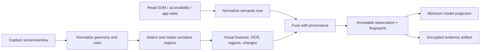

# Perception, Grounding, and Application State

> **Last researched:** 2026-08-31  
> **Purpose:** Build a trustworthy observation and target-selection layer across pixels, accessibility trees, browser semantics, and application APIs.

Computer-use failures often begin before the click: the controller captured the wrong display, the model used a scaled coordinate against a native screen, the active window changed, an accessibility node was stale, or sensitive content entered the screenshot. Treat perception as a versioned sensor pipeline, not an image upload helper.

## Observation contract

Every model-visible observation should have one immutable envelope:

```json
{
  "observation_id": "obs_01J...",
  "captured_at": "2026-08-31T10:15:22.418Z",
  "environment_id": "env_7f2...",
  "desktop_session_id": "desk_18...",
  "environment_generation": 12,
  "os_build": "windows-11-24h2/26100.4946",
  "locale": "en-US",
  "keyboard_layout": "00000409",
  "theme": "light",
  "accessibility_profile": {"text_scale": 1.0, "high_contrast": false, "zoom": 1.0},
  "active_app": {"id": "com.example.editor", "pid": 4812},
  "active_window": {"id": "win_93...", "title_hash": "sha256:...", "focus_generation": 38},
  "display": {
    "id": "display-0",
    "topology_generation": 7,
    "native_width": 2560,
    "native_height": 1440,
    "image_width": 1600,
    "image_height": 900,
    "device_pixel_ratio": 2.0,
    "rotation": 0
  },
  "screenshot": {"artifact_id": "art_...", "capture_sequence": 3881, "redaction_version": "redact-v4"},
  "semantic_state": {"artifact_id": "art_...", "source": "windows-uia", "source_version": "uia-adapter/1.8.2", "revision": 91},
  "url_origin": null,
  "ui_fingerprint": "sha256:...",
  "sensitive_regions": [{"class": "secret-field", "bounds": [912, 448, 1180, 492]}]
}
```

The model may receive a compact projection of this envelope. The controller retains the full record and requires the `observation_id` on every proposal.

## The perception pipeline



Order matters. Redact before provider transmission and before producing thumbnails or OCR that could reproduce a secret. Preserve an encrypted, access-controlled original only when incident or compliance requirements justify it.

## Observation sources

| Source | Strong at | Weak at | Trust treatment |
|---|---|---|---|
| Browser DOM/accessibility | Element roles, labels, state, frame, URL/origin, target actions | Canvas, CSS visual relationships, browser chrome, inaccessible widgets | Structured but still attacker-controlled content |
| OS accessibility tree | Native roles, names, bounds, states, actions, focus | Custom-drawn UI, games, remote desktops, incomplete providers | App-provided data; not authority |
| App API | Document/business state and deterministic operations | May omit visible transient UI | Prefer for verification; authorize separately |
| Screenshot | Layout, occlusion, canvas, custom UI, visual postconditions | Exact identity, off-screen state, secrets, small targets | Untrusted pixels with broad data exposure |
| OCR/screen parser | Text/icons missing from semantic tree | False labels, duplicate regions, latency, adversarial text | Derived inference with confidence and provenance |
| Window manager/process state | Active app/window, bounds, lifecycle | In-app control semantics | Trusted local sensor if brokered and authenticated |

Windows UI Automation providers expose controls as elements with properties and patterns, but custom controls may require their own providers and otherwise remain opaque ([provider overview](https://learn.microsoft.com/en-us/windows/win32/winauto/uiauto-providersoverview)). GNOME AT-SPI provides analogous accessible objects on Linux ([AT-SPI interfaces](https://gnome.pages.gitlab.gnome.org/at-spi2-core/devel-docs/doc-org.a11y.atspi.Accessible.html)). OmniParser demonstrates that visual detection/captioning can recover interactable regions from screenshots, but its model-derived labels remain uncertain and its component licenses must be reviewed ([repository](https://github.com/microsoft/OmniParser)).

## Prefer a hybrid, provenance-preserving representation

Do not flatten all sources into one unlabeled list. A fused target should show where each claim came from:

```yaml
target_id: target_142
bounds_image: [1062, 781, 1197, 827]
semantic:
  source: windows-uia
  runtime_id: [42, 9012, 7]
  role: Button
  name: Submit
  enabled: true
visual:
  source: screenshot+ocr-v3
  text: Submit
  confidence: 0.97
  unobscured_probability: 0.99
provenance:
  observation_id: obs_01J...
  active_window_id: win_93...
  display_transform_id: transform_21
```

If semantic and visual evidence disagree, do not silently choose one. Refresh, zoom/crop, ask for clarification, or use a safe exploratory read. For a consequential target, disagreement is a stop condition.

Use fusion to create a *candidate*, never to erase uncertainty:

| Evidence combination | Safe interpretation | Allowed next step |
|---|---|---|
| App/API state, semantic target, and current pixels agree | Strong target binding for the observed version | Re-resolve, authorize, then use the strongest semantic action |
| Semantic target exists but pixels show occlusion or different label/state | Target may be real but unsafe to operate | Refresh or remove occlusion; no risky action |
| Pixels/OCR find a control absent from semantics | Visual-only candidate | Zoom/crop and bounded coordinate action only if risk policy permits |
| Semantic/OCR labels agree but authoritative resource/account differs | Wrong domain target | Stop; identity wins over appearance |
| Screenshot is current but tree revision is old, or vice versa | Mixed-time observation | Reject the fused observation and recapture both sources |
| Remote display mapping cannot bind stream to input region | Coordinate identity unknown | No absolute input; reconnect/reselect and recalibrate |

## Coordinate systems are a contract

Track at least:

- physical/native display pixels;
- logical OS points or DPI-scaled coordinates;
- captured-image pixels;
- window-relative coordinates;
- element bounding boxes;
- model-normalized coordinates, if a provider uses them;
- browser CSS pixels and device pixel ratio.

### Safe transform

```text
native_x = round((image_x / image_width)  * native_width)
native_y = round((image_y / image_height) * native_height)
```

That formula is valid only when the screenshot is an aspect-preserving representation of the same display rectangle, with no crop, padding, rotation, or window offset. In production, store an explicit affine transform and its inverse, then test known calibration points.

```python
@dataclass(frozen=True)
class DisplayTransform:
    observation_id: str
    source_rect: tuple[int, int, int, int]  # native x, y, width, height
    image_size: tuple[int, int]

    def image_to_native(self, x: int, y: int) -> tuple[int, int]:
        sx, sy, sw, sh = self.source_rect
        iw, ih = self.image_size
        if not (0 <= x < iw and 0 <= y < ih):
            raise ValueError("coordinate outside observed image")
        return (sx + round(x * sw / iw), sy + round(y * sh / ih))
```

Provider recommendations differ because image processing differs. Current OpenAI guidance prefers original detail and reports good results around 1440×900 or 1600×900 when downscaling; Anthropic documentation recommends preserving aspect ratio, mapping coordinates, using zoom/crops for small targets, and gives 1280×720 as a troubleshooting baseline ([OpenAI](https://developers.openai.com/api/docs/guides/tools-computer-use), [Anthropic](https://platform.claude.com/docs/en/agents-and-tools/tool-use/computer-use-tool)). Treat resolution as a provider/model/application evaluation variable, not a universal constant.

### Coordinate acceptance checks

Before execution:

1. observation is not expired;
2. active desktop, display topology, scale, and rotation match;
3. target native point lies inside the intended active window;
4. the target bounds still resolve for semantic targets;
5. a fresh thumbnail/crop is visually compatible for risky coordinate targets;
6. no protected region or global OS surface intersects the point;
7. the action's expected target size exceeds the configured minimum, or the model has used zoom.

## Target identity and stale state

Coordinates are locations, not identities. A target reference should bind:

- environment and desktop session;
- observation and semantic-tree revision;
- application/process and window;
- browser origin, frame, and page where relevant;
- element/runtime ID or selector if available;
- role, accessible name, enabled/visible state;
- bounds and visual fingerprint;
- expected current value/version;
- expiry.

Re-resolve immediately before execution. Playwright locators do this naturally for browser elements; Windows UIA runtime IDs and accessibility objects can still become invalid when controls are recreated. For raw coordinates, take a fresh crop and reject material change.

```mermaid
sequenceDiagram
    participant M as Model
    participant C as Controller
    participant O as Observation adapter
    participant E as Executor

    M-->>C: click(target_142, observation=obs_91)
    C->>O: Re-resolve target_142
    O-->>C: active window changed / target revision stale
    C-->>M: stale_observation; no action executed
    C->>O: Capture obs_92
    O-->>C: refreshed state
```

Never convert a stale-target error into an automatic click at the old coordinates.

### Stale-screen detection

Do not define freshness as `now - captured_at < N` alone. A recently returned frame can still be buffered, duplicated, captured from the wrong window, or older than a tree/event stream. Require a monotonic capture sequence from the guest, controller receive time, environment/lease generation, display topology generation, active-window focus generation, and source-specific revision. Before input:

1. challenge the guest with a capture request ID and reject a response from an earlier request or lease generation;
2. compare screenshot hash, semantic revision, active-window/focus generation, and any app/business version with the proposal's observation;
3. require both visual and semantic sources to fall inside the configured skew bound when they are fused;
4. detect repeated identical frames while app/window events or known animation/progress say the surface changed;
5. after reconnect, resume, monitor hotplug, locale/input-method change, accessibility-setting change, or user takeover, invalidate all observations regardless of wall-clock age;
6. for risky coordinate actions, take a fresh target crop and require compatible bounds/appearance immediately before dispatch.

A stale detector returns a typed reason such as `capture_replayed`, `source_skew`, `focus_changed`, `display_changed`, or `target_recreated`. It never silently refreshes and executes the old proposal.

## Focus, occlusion, and desktop state

The observation layer must distinguish:

- active versus intended window;
- visible versus minimized/covered;
- unlocked interactive desktop versus lock/secure desktop;
- modal dialog versus underlying window;
- transient popup, notification, tooltip, and permission prompt;
- remote desktop disconnect or resolution renegotiation;
- multi-monitor add/remove/reorder;
- locale, keyboard layout/input method, theme, text scale, contrast, magnifier, or accessibility overlay change;
- local/remote human activity and whether the product is in attended, shared-control, or unattended mode;
- animation/loading versus stable state.

Windows `SendInput` injects into the system input stream and is constrained by User Interface Privilege Isolation; Microsoft notes that failure caused by UIPI is not cleanly identified by the return value ([SendInput](https://learn.microsoft.com/en-us/windows/win32/api/winuser/nf-winuser-sendinput)). A production executor must check the foreground target before OS-wide input and verify afterward. Similar broad accessibility and screen-capture permissions exist on macOS—the process must be trusted as an accessibility client, and screen capture has separate consent APIs ([Accessibility trust](https://developer.apple.com/documentation/applicationservices/1459186-axisprocesstrustedwithoptions), [screen capture preflight](https://developer.apple.com/documentation/coregraphics/cgpreflightscreencaptureaccess%28%29)).

### Stable-state detection

Do not use a fixed sleep as the only wait policy. Combine:

- semantic events or locator actionability when available;
- document/network/app-specific completion signals;
- repeated UI fingerprint stability over a bounded interval;
- spinner/progress state detection;
- target enabled/visible checks;
- maximum wait deadline and cancellation.

Some UIs update continuously—clocks, ads, cursors, videos, progress animations. Mask known dynamic regions before perceptual hashing and use semantic state for progress.

Human presence is a state input, not implicit permission. In attended mode, a controller must distinguish presence from consent: a moving pointer, open remote session, or visible operator does not approve an effect. In unattended mode, unexpected local/remote input is focus theft and should quiesce the agent. In shared-review mode, the agent may prepare or highlight but must surrender the input lease before the human interacts. Authentication, system consent, safety interstitials, CAPTCHAs, secure-desktop prompts, and OS privacy pickers require an explicit product decision—normally user takeover, never a best-guess click.

## Screenshot and visual-data privacy

A full desktop screenshot can contain messages, account names, one-time codes, API keys, health or financial records, other tenants' data, and notification previews. Apply data minimization before capture where possible and before model transmission always.

### Capture policy

| Tier | Capture | Retention |
|---|---|---|
| Public/test | Full target window or screen | Short-lived debug artifacts allowed |
| Internal | Target window only; redact notifications and non-task apps | Encrypted, access-controlled, sampled |
| Confidential | Tight crop/semantic state; deterministic sensitive-field masking | No raw screenshots by default; incident escrow only |
| Secret/authentication | Do not expose to model; user takeover or opaque broker fill | Never log secret pixels or typed values |

The model provider's data handling is a separate boundary. OpenAI documents that image/file inputs, including computer-use screenshots, are processed under endpoint-specific data controls; Anthropic notes that client-side screenshots/actions live in the developer environment while API request retention remains governed by API policy ([OpenAI data controls](https://platform.openai.com/docs/models/default-usage-policies-by-endpoint), [Anthropic data retention note](https://platform.claude.com/docs/en/agents-and-tools/tool-use/computer-use-tool)). Verify the current policy, region, and contract for the exact endpoint.

### Redaction limitations

- OCR misses secrets in images, custom fonts, video, and partially obscured text.
- Masking only password fields misses tokens in terminals, logs, QR codes, and notifications.
- A black overlay must be applied to the pixel buffer before encoding, not merely drawn in the operator UI.
- Semantic-tree pruning does not redact the screenshot.
- Diff images can reconstruct changed sensitive values.

For high-risk workflows, prevent the sensitive application or field from appearing in the agent desktop rather than relying on redaction.

## Progressive perception

Use the cheapest sufficient observation:

1. current app/window/origin and compact semantic state;
2. target-window screenshot at evaluated resolution;
3. region crop or zoom for small/ambiguous target;
4. OCR/screen parser for semantic gaps;
5. full desktop only when cross-application spatial context is required.

This reduces cost and data exposure. It also avoids accumulating dozens of redundant images. Anthropic reports roughly 1,000–1,800 tokens per screenshot in its current computer-use guidance and recommends pruning/summarizing image history ([best practices](https://claude.com/blog/best-practices-for-computer-and-browser-use-with-claude)); exact tokenization is provider/model-specific.

## Post-action observation and verification

Every action declares an expected observation change:

```yaml
expected_change:
  kind: element_state
  target_id: target_142
  predicate: enabled == false && adjacent_status == "Submitted"
  timeout_ms: 8000
  fallback_visual_region: [980, 720, 1390, 880]
```

Verification order:

1. authoritative application/business state;
2. semantic UI state and event;
3. visual change in a bounded region;
4. independent model judgment only if deterministic evidence is unavailable.

A visual change proves that pixels changed, not that the intended business effect occurred. A button disappearing may mean success, validation error, navigation, or crash.

## Failure matrix

| Failure | Detection | Safe response |
|---|---|---|
| Coordinate offset | Calibration clicks drift consistently; DPI mismatch | Recompute transform; quarantine resolution/model combination |
| Wrong window | Active window ID differs at revalidation | Execute nothing; refresh observation |
| Occluded target | Hit-test/visual crop differs; semantic target not clickable | Bring intended window forward through a scoped action, then re-observe |
| Tiny/ambiguous target | Bounds under minimum size; multiple matching targets | Zoom/crop or ask; no best-guess click for risky action |
| Stale semantic node | Re-resolution fails or revision changed | Return typed stale error and replan |
| Secure/locked desktop | No interactive desktop/capture failure | Suspend and require trusted takeover; do not retry input |
| Perpetual animation | Raw hash changes but semantic state is stable | Mask dynamic region; use app-specific completion signal |
| Screenshot redaction failure | DLP/test canary appears in outgoing buffer | Block provider call, alert, and destroy/quarantine artifacts by policy |
| Semantic/visual disagreement | Role/state/bounds conflict | Refresh, alternate sensor, or stop |
| Multi-monitor topology change | Display inventory or transform version changes | Invalidate all target references and re-observe |
| Buffered/stuck remote frame | Same capture sequence/hash while event/app version advances | Fence input, reconnect capture channel, and recalibrate |
| Locale/input method changes | Locale/layout generation differs; typed output/readback mismatch | Invalidate plan/targets; restore supported profile or take over |

## Acceptance checklist

- [ ] Observation IDs, timestamps, geometry, active target, and fingerprints are immutable.
- [ ] All coordinate transforms have calibration and DPI/rotation/multi-monitor tests.
- [ ] Every action binds to one observation and is revalidated before execution.
- [ ] Semantic and visual claims retain source and confidence.
- [ ] Full-screen capture is justified; target-window/crop is the default.
- [ ] Redaction happens before encoding/transmission and is tested with secret canaries.
- [ ] Secure desktop, focus failure, resolution change, and stale node fail closed.
- [ ] Buffered/replayed frames and cross-source revision skew fail closed.
- [ ] Locale, input method, accessibility profile, and human-presence mode are observed and versioned.
- [ ] Postconditions use authoritative state where possible.
- [ ] Provider resolution/detail settings are versioned and benchmarked per application.

Next: [Actions, policy, and irreversible effects](actions-policy-and-irreversible-effects.md).
