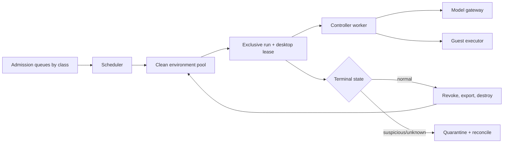
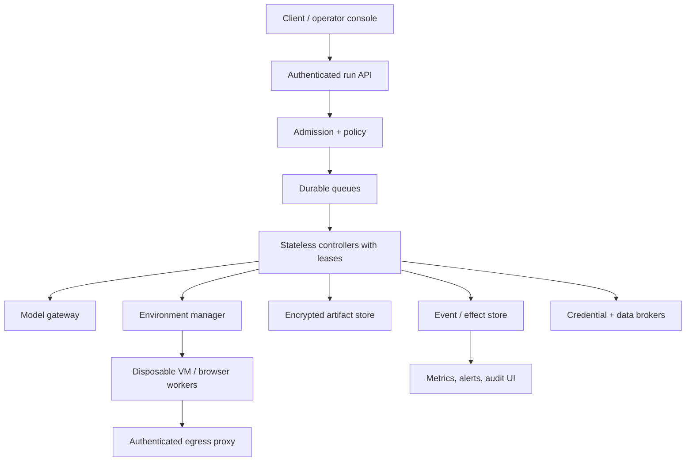

# Performance, Cost, Scaling, and Operations

> **Last researched:** 2026-08-31  
> **Purpose:** Meet latency and cost targets while preserving verification, isolation, and safe recovery.

Computer-use latency compounds sequentially: capture, encode, upload, model inference, policy, input, UI stabilization, verification, and sometimes approval all sit on the critical path. Optimize the number and quality of round trips before reaching for more parallelism.

## Latency model

For a run with `n` action cycles:

```text
T_run ≈ T_admission + T_environment_start
      + Σ₁ⁿ (T_capture + T_redact + T_encode + T_model
             + T_policy + T_execute + T_stabilize + T_verify)
      + T_approval_wait + T_recovery + T_cleanup
```

Measure each term independently. “Model latency” often hides upload and queue time; “tool latency” often hides fixed sleeps and application stabilization.

### SLO decomposition

| SLO | Measures | Example failure |
|---|---|---|
| Admission | Request to accepted/rejected | Queue accepts work that cannot meet deadline |
| Environment ready | Accepted to clean interactive session | Cold image/app startup dominates |
| First useful action | Ready to first verified progress | Agent spends turns describing screen |
| Action cycle | Observation to verified result | Oversized screenshots and fixed waits |
| Approval responsiveness | Risk gate to user notification | VM sits privileged and idle unnoticed |
| Terminal completion | Accepted to verified final/partial state | Long-tail loops/recovery |
| Cancellation | Cancel accepted to executor quiescent | Late input after user cancel |
| Cleanup | Terminal to credentials revoked and VM destroyed | State leaks into pool |

Set separate targets by workload class. An interactive assistant and a background test runner should not share queue priority or timeout assumptions.

OSWorld-Human found that model planning/reflection dominates much CUA latency and that later steps can become substantially slower in longer tasks, so report latency by step index and trajectory length rather than only averages ([paper](https://openreview.net/pdf?id=sV3n6mYy7J)).

## Cost model

```text
C_run = C_text_input + C_image_input + C_model_output
      + C_model_tool_overhead + C_compute_perception
      + C_vm_time + C_storage + C_network
      + C_human_review + C_recovery + C_failed_runs
```

The useful business metric is:

```text
cost_per_compliant_success = total_cost / verified_policy_compliant_successes
```

Cheap failed or unsafe runs are not efficient.

Record actual provider usage rather than estimating only from image dimensions. Image tokenization and caching differ by provider/model/detail. Anthropic currently documents screenshot-heavy contexts as a major cost/latency driver and reports approximate per-image token ranges in its best-practices guide; OpenAI documents that original-resolution inputs preserve detail but larger images use more tokens ([Anthropic](https://claude.com/blog/best-practices-for-computer-and-browser-use-with-claude), [OpenAI](https://developers.openai.com/api/docs/guides/tools-computer-use)).

## Optimization order

### 1. Remove GUI steps

- query application/business state through an API;
- use a semantic locator or accessibility action instead of visual search;
- set a field directly through a supported app API;
- start from a task-specific known state;
- stop once authoritative completion evidence passes.

Eliminating a loop is safer and faster than making the loop cheaper.

### 2. Reduce observation volume

- capture the target window/region, not the whole desktop;
- send semantic diffs and only the current required screenshot;
- use progressive zoom/crop for small targets;
- prune old images from model context while retaining evidence references;
- mask stable/dynamic irrelevant regions;
- encode once and avoid base64 copies through internal pipelines;
- use provider-supported caching only for stable, non-sensitive prefixes.

Do not use a low-resolution image that makes grounding unreliable. Find the lowest-cost resolution that passes the application-specific grounding and task gate.

### 3. Make waits event-driven

Prefer:

- DOM/load/application events;
- accessibility property/state changes;
- authoritative record/version change;
- bounded UI stability windows;
- provider background-job completion.

Avoid unconditional multi-second sleeps after every action. Keep a short bounded wait only when the target exposes no signal, and include it in the application adapter rather than model reasoning.

### 4. Batch only safe mechanical sequences

Ordered action batches can remove model round trips, but every batch increases the amount of UI change that occurs without model observation. Batch `focus field → type non-sensitive text → screenshot` when the target is stable. Do not batch across navigation uncertainty, a consequential commit, a secret fill, or a required postcondition.

### 5. Route models by evaluated task difficulty

- use a lower-latency model for known mechanical steps only after it passes the same safety/grounding gate;
- escalate to a stronger model for ambiguous planning or recovery;
- keep policy/authority unchanged across routes;
- cap escalations and record actual response model;
- avoid per-step routing chatter that costs more than it saves.

### 6. Prewarm safely

Prewarm immutable OS/app images and unauthenticated clean sessions. Do not keep broad authenticated sessions, decrypted credentials, user files, or tenant data in a warm pool. Inject task scope after exclusive lease assignment.

## Capacity and concurrency

One interactive desktop has one input owner. Scale by adding isolated sessions, not by running multiple controllers against one screen.

### Simple capacity estimate

```text
required_active_slots ≈ arrival_rate_per_second × average_slot_occupancy_seconds
```

Add headroom for tail latency, restarts, quarantines, and maintenance. Use measured occupancy from environment allocation through verified cleanup—not only active model time.

### Workload classes

| Class | Pool | Priority | Idle/wait policy |
|---|---|---|---|
| Interactive low-risk | Warm browser/VM pool | Reserved capacity | Short waits; offer async continuation |
| Background deterministic | Batch pool | Bounded queue | Release/recreate environment across long external waits when safe |
| Approval waiting | Suspended/quarantined pool | No active input worker | Revoke unnecessary credentials/network; expire proposal |
| Evaluation | Isolated test pool | Preemptible | Synthetic accounts; reproducibility over latency |
| Security incident | Quarantine | Highest operator visibility | No reuse; evidence retention |

Do not let approval waits consume scarce interactive workers indefinitely. The environment may need to persist for review, but the controller/worker should release compute where the platform allows, and all short-lived capabilities should expire.

### Recovery load is capacity, not an exception

Budget capacity for the work failures create:

```text
effective_slot_seconds_per_admission
  = normal_slot_seconds
  + p_restart × restart_slot_seconds
  + p_fresh_environment × rebuild_slot_seconds
  + p_reconcile × reconciliation_slot_seconds
  + p_quarantine × quarantine_capacity_charge
```

Load tests must include correlated events: provider slowdown that lengthens every lease, bad app release causing crash/restart storms, RDP reconnect waves, artifact-store degradation, mass approval timeout, base-image drain, and a security kill switch. Verify admission backpressure, reconciliation queues, quarantine space, evidence ingestion, credential revocation, and cleanup workers—not only successful steady-state desktops. Reserve capacity for cancellation/kill, reconciliation, and cleanup so overload cannot strand privileged sessions or unknown effects.

## Pool and lease design



Lease fields:

- environment/session ID and tenant/run;
- lease generation and owner worker;
- issued/renewed/expires timestamps;
- image/app/profile version;
- input ownership state;
- credential/network capability IDs;
- cleanup and quarantine status.

Never return an environment to the clean pool after merely logging out or clearing browser storage. Destroy and reconstruct from a trusted snapshot/image.

## Backpressure and admission control

Reject, defer, or degrade before the system is overloaded.

Admission considers:

- requested task/risk/environment and supported app versions;
- deadline versus queue plus p95 execution estimate;
- per-tenant concurrency and spend;
- model/provider/VM capacity;
- availability of required human approval channel;
- artifact/effect-ledger health;
- incident/kill-switch state.

Safe degradation options:

- read-only or prepare-only mode;
- browser-semantic mode without visual fallback for supported tasks;
- asynchronous completion with explicit job identity;
- user-assist/highlight mode;
- refusal when a required isolation or audit dependency is unavailable.

Never degrade by disabling policy checks, confirmation, redaction, effect reconciliation, or environment isolation.

## Deployment topology



### Network zones

- public/client edge cannot address guest executors directly;
- controller reaches model gateway and authenticated environment manager;
- guest reaches only egress proxy and a narrow control callback;
- model provider never reaches the guest directly unless a separately assessed managed-runtime design requires it;
- artifact URLs are short-lived, audience-bound, and unavailable to guest/model unless selected;
- management plane and tenant traffic use separate identity and policy.

### Availability stance

Computer-use runs are stateful, but controllers should be replaceable. Persist state before acknowledging consequential transitions. A controller crash must not transfer input ownership until lease expiry/reconciliation. Model/provider failover can change behavior; treat it as a new route covered by evaluation, not transparent networking failover.

### Disaster recovery and regional failure

Define recovery objectives separately:

| Plane | Durable minimum | Recovery rule |
|---|---|---|
| Control/state | Task/run versions, lease generation, cancellation/takeover, compaction receipt | Recover controllers only after fencing prior writers and verifying ledger high-watermarks |
| Effect/audit | Action/effect/approval events, idempotency/reconciliation identities, audit integrity | Zero acknowledged-effect loss target; no commit service without authoritative ledger quorum/availability |
| Artifact | Policy-required evidence, hashes, encryption-key references, deletion state | Replicate only where residency permits; missing required evidence pauses high-risk work |
| Environment | Immutable image/config and disposable guest | Rebuild from pinned image; do not depend on live VM snapshot as the only recovery copy |
| Secrets/capabilities | Broker configuration and revocation authority, not plaintext in task state | Reissue least privilege after recovery; never replicate live one-use capabilities as reusable credentials |

Exercise zone/region loss with real fencing. A recovered controller must not assume the old desktop is dead merely because its network path disappeared. Mark the environment isolated, revoke input/network/credential capabilities through an independent path where possible, reconcile external effects, then allocate a fresh environment. Define RPO/RTO for read-only, preparation, and effectful runs separately; it is safer to terminate an uncertain effectful run than to meet an aggressive RTO by replaying it.

## Release and versioning

Version together:

- agent prompt and context compiler;
- provider/model/tool schema and image/detail settings;
- policy and risk classifier;
- controller state/event schema;
- guest executor and OS automation APIs;
- base image, OS, apps, browser, fonts, locale, DPI;
- redaction/OCR/screen parser;
- task adapters, verifiers, and benchmark fixtures.

### Rollout

1. offline decision replay against prior traces;
2. component and failure-injection suites;
3. end-to-end synthetic environment regression;
4. shadow/read-only or prepare-only production slice;
5. canary by app/risk/tenant with strict kill thresholds;
6. gradual expansion while comparing severe failures, success, latency, and cost;
7. rollback release and destroy incompatible environments on regression.

Do not mix a new model with an old coordinate/image configuration because the API accepts it. Re-run supported resolution and application slices.

## Health checks

### Environment readiness

- expected OS/app/browser versions and patch digest;
- one display with expected geometry/scale/theme/locale;
- interactive desktop unlocked inside the guest;
- no unexpected windows/processes/extensions;
- clean profile/files/clipboard and no tenant residue canaries;
- guest executor identity and action contract version;
- egress policy active; metadata/private network unreachable;
- capture/redaction and semantic-state probes pass;
- input test works only inside disposable calibration app;
- artifact/effect stores reachable from controller.

### Continuous run health

- heartbeat is not enough; verify desktop lease, capture freshness, active app, executor queue depth, and capability expiry;
- flag model/action latency growth by step index;
- detect focus oscillation, repeated state/action cycles, and artifact backlogs;
- stop on clock skew that invalidates approvals/capabilities;
- fence a worker immediately after lease renewal failure.

## Cleanup and data lifecycle

Terminal cleanup order:

1. stop new model/action scheduling;
2. reconcile in-flight/unknown effects;
3. revoke credentials, network, and input capability;
4. export only declared output/evidence artifacts;
5. clear/destroy guest clipboard and volatile keys;
6. terminate guest and cryptographically discard ephemeral disk key or destroy instance;
7. verify environment no longer exists and ports/leases are closed;
8. apply retention/deletion policies to model payloads, screenshots, events, and business receipts;
9. notify user with verified final/partial/unknown state.

Deletion jobs themselves need metrics, retries, and dead-letter handling. A “run completed” status should not imply privacy cleanup completed unless recorded separately.

## Incident and kill-switch operations

Support kill switches by:

- tenant, user, app, origin/domain, action/risk class;
- model/provider/tool version;
- executor/base image/OS/browser version;
- entire service.

A kill switch must prevent new admission, revoke active capabilities, stop scheduling, fence executors, and preserve/reconcile in-flight effects. Test it under load and during approval, action execution, and controller failover.

### Minimum operator runbooks

Every runbook names trigger/alert, scope query, immediate containment, authoritative checks, user communication, recovery decision, evidence/retention, and exit owner. Operators should act through typed controls; they should not improvise clicks inside the affected guest.

| Runbook | Immediate action | Required exit evidence |
|---|---|---|
| Focus theft / unexpected human input | Quiesce executor, release keys/buttons, revoke lease, capture current identity/state | Fresh observation after explicit handback; old observations/approvals invalidated |
| Screen frozen, stale, or remote session disconnected | Fence input; compare capture sequence, event/app version, and session/display generations; reconnect only through environment manager | New session/capture identity, recalibrated display transform, clean focus/input probe |
| App/executor/controller crash | Stop related scheduling, acquire new lease generation, load compaction receipt, reject late results | High-watermarks/digests verified; in-flight actions reconciled; next safe action revalidated |
| `UNKNOWN` consequential effect | Freeze same-resource and dependent actions; query authoritative history/state by effect/idempotency identity | `observed` or `confirmed_absent` receipt, or quarantine plus accountable owner/deadline |
| Prompt injection / secret exposure | Revoke input, egress, and credentials; isolate guest; preserve restricted evidence; rotate exposed material | Effect reconciliation, affected-run/digest inventory, regression case, security closure |
| Cross-tenant residue or failed cleanup | Remove environment from pool; halt affected image/pool admission; enumerate potentially exposed runs | Destruction proof, residue canaries pass on rebuilt pool, privacy/security review |
| Bad model/tool/image/app release | Trip scoped kill switch; stop new admission; drain/quarantine incompatible environments; roll back full bundle | Prior bundle passes smoke/failure gates; no mixed-version sessions; incident/eval update |
| Artifact/effect store outage | Stop effectful work; retain only bounded encrypted data permitted by policy; maintain cancellation locally | Store consistency restored, buffer drained, audit joins complete, no lost acknowledged effect |

## Operational failure matrix

| Failure | Response |
|---|---|
| Model provider slow/unavailable | Respect deadline; route only to pre-evaluated fallback or fail/defer |
| VM pool exhausted | Backpressure; do not attach to shared/user desktop |
| Artifact store unavailable | Pause high-risk runs if evidence is mandatory; bounded buffer without sensitive spill |
| Effect ledger unavailable | Stop effectful actions; reads may continue by declared policy |
| Egress proxy unavailable | Fail closed; do not permit direct guest networking |
| Lease store partition | Fence input; one generation wins; quarantine ambiguous executor |
| Base image vulnerability | Drain/kill affected version; no reuse; rebuild and requalify |
| Cleanup fails | Quarantine environment and alert; never return to pool |
| Cost spike / loop | Enforce local hard budgets independent of telemetry pipeline |
| Approval channel down | Suspend/expire proposal; never auto-approve |

## Acceptance checklist

- [ ] Latency is decomposed per cycle and by step index, with p95/p99 tails.
- [ ] Cost per compliant success includes VM, human, recovery, and failed runs.
- [ ] Optimization removes steps/bytes/waits before weakening resolution or verification.
- [ ] Each desktop has one exclusive controller/input lease.
- [ ] Admission enforces deadline, capacity, tenant, risk, and dependency health.
- [ ] Capacity/load tests include restart storms, reconciliation, quarantine, cleanup, and kill-switch demand.
- [ ] Warm pools contain no tenant data, decrypted credentials, or authenticated broad profiles.
- [ ] Release versions include model, policy, executor, image, app, and perception settings.
- [ ] Cleanup destroys environments and revokes capabilities with observable completion.
- [ ] Failover routes are pre-evaluated; safety dependencies fail closed.
- [ ] DR fencing, ledger/artifact recovery, and fresh-environment rebuild have exercised RPO/RTO by risk class.
- [ ] Kill switches are scoped, fast, and tested with in-flight effects.

Next: [Implementation roadmap, acceptance tests, and alternatives](implementation-roadmap-acceptance-tests-and-alternatives.md).
