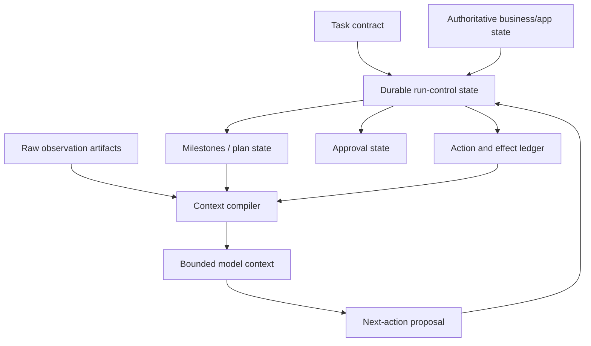
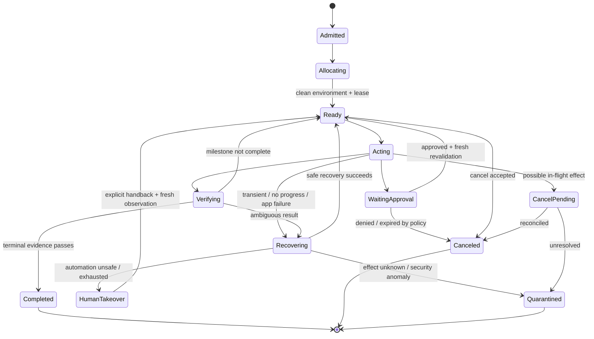

# State, Context, Planning, Stuck Detection, and Recovery

> **Last researched:** 2026-08-31  
> **Purpose:** Keep long GUI runs bounded, resumable, and honest without confusing model history with durable system state.

A desktop changes underneath the agent: windows move, sessions expire, dialogs appear, applications crash, and remote content mutates. Reliable control requires explicit state, milestone-based planning, evidence after every meaningful action, and a recovery ladder that stops before repeated actions create harm.

## Separate the state layers



| State | Purpose | Source of truth | Model visibility |
|---|---|---|---|
| Task contract | Objective, exclusions, success evidence, authority, deadline | Admission record | Compact, immutable projection |
| Run control | Status, attempt, budgets, lease, cancellation, pending calls | Controller store | Only relevant limits/status |
| Milestones | Completed/active/blocked logical steps and evidence | Controller/verifier | Current plan summary |
| Observation | Screenshot, semantic tree, active app/window, geometry | Observation artifacts | Current plus selected recent evidence |
| Action/effect | Proposals, decisions, receipts, unknown outcomes | Append-only ledger | Compact recent outcomes |
| Approval | Exact effect digest, decision, expiry, use count | Approval service | Pending decision status only |
| Business/app state | Actual external records/documents | Target system | Fresh reads or references |
| Conversation | User messages and model outputs | Session log | Selected by context compiler |

Provider conversation state can help continue inference. It is not enough to recover an environment, decide whether an effect committed, or know whether an approval is still valid.

### Typed runtime contracts

Keep the runtime joinable through stable IDs and versions rather than reconstructed prose.

| Contract | Required typed content | Invariant |
|---|---|---|
| State | Run status/version, lease generation, budgets, cancellation/takeover, active milestone, ledger high-watermarks | Transition uses compare-and-set from an allowed prior state |
| Event | Event ID/type/schema version, occurred/recorded time, actor, run/attempt/lease, causal/correlation IDs, payload/artifact refs | Append-only; correction supersedes rather than mutates |
| Plan | Plan/version, ordered or dependency-linked milestones, preconditions, allowed surfaces, completion evidence, recovery/stop rules | Model may propose; controller validates and advances |
| Tool/action | Schema/tool version, observation/target/environment binding, preconditions, timeout, retry class, expected change | Unknown fields/kinds fail closed; policy derives risk |
| Effect | Effect ID/idempotency key, canonical resource/destination/content, source versions, approval/commit/reconciliation state | `unknown` is preserved until authoritative reconciliation |

Schema migration is application code. Store the writer version, upcast old records through tested deterministic migrations, reject unknown future major versions, and never let context compaction rewrite the underlying event/effect history.

## Run state machine



Persist every transition with expected prior state/version. One worker/controller owns the desktop lease; late model or executor results from an earlier attempt are ignored.

## Plan at milestone granularity

A useful plan describes state transitions and evidence, not a brittle list of coordinates.

```yaml
milestone_id: compose_reviewed_draft
goal: Prepare the message without sending it
preconditions:
  - authenticated_account == "support@example.com"
  - ticket.version == 73
allowed_apps: [ticketing, mail]
completion_evidence:
  - draft.recipient == ticket.requester_email
  - draft.subject_hash == expected_subject_hash
  - draft.body_policy_check == passed
forbidden_effects:
  - send_message
recovery:
  max_safe_attempts: 2
  user_takeover_if: recipient_or_account_ambiguous
```

The controller verifies milestone completion and advances the plan. The model may suggest revisions, but it cannot mark a milestone complete from prose.

### Planning rules

- keep known control flow in code;
- allow the model to select among safe alternatives inside a milestone;
- replan after unexpected state, not after every successful mechanical action;
- require explicit preconditions and success evidence for each high-value milestone;
- invalidate downstream milestones when their source state changes;
- cap plan depth and number of replans;
- never let a replan expand apps, accounts, data, or authority without readmission.

## Context compilation

The model needs the current task and screen, not the entire forensic record.

### Recommended context order

1. immutable trusted system policy and action contract version;
2. task objective, non-goals, principal, allowed apps/actions, deadline, and risk tier;
3. current milestone, success evidence, and prohibited effects;
4. current active app/window/origin and observation;
5. concise recent actions with expected versus observed outcomes;
6. unresolved errors, unknown effects, and remaining budgets;
7. selected application hints or successful example only when version-compatible.

Keep untrusted on-screen text clearly attributed to the observation. Never merge it into system or user instructions.

### Screenshot history policy

- always keep the current observation;
- keep pre/post images for the latest materially relevant action;
- retain older screenshots in the evidence store, replacing model-context copies with short event summaries;
- keep a crop rather than full screen when only one region matters;
- do not summarize away an unresolved approval, warning, target identity, or effect-unknown state;
- version the compiler and record exactly which artifacts entered each model call.

Anthropic's current guidance notes that screenshots can fill context rapidly and recommends a rolling buffer, cache-aware pruning, and summary when pruning is insufficient ([best practices](https://claude.com/blog/best-practices-for-computer-and-browser-use-with-claude)). These are optimization techniques; application-owned state must survive independently of model context.

## Context compaction and the seven memory lifetimes

The runtime has exactly these seven memory lifetimes. “Memory” is not one database or a permission to retain everything; each lifetime has a distinct purpose, rejection rule, retention/deletion rule, and test.

| Lifetime | Use | Reject | Retention / deletion | Required test |
|---|---|---|---|---|
| **Turn/scratch** | Current model call: trusted task/milestone projection, fresh observation, recent receipts, unresolved hazards, and remaining budgets | Raw secrets; unrelated windows/history; authority inferred from visible text; stale targets | Process/request lifetime only; discard after response except the versioned input manifest and permitted evidence refs | Secret/unrelated-data canaries never enter payload; identical inputs/compiler version reproduce the manifest |
| **Working/run** | Typed per-run candidates, plan progress, selected observation IDs, errors, rejected routes, loop fingerprints, and recovery counters | Approvals, canonical identity, authoritative outcome, or free-form model conclusion as truth | Until terminal cleanup plus short debugging window; compact by superseding projection, not deleting source ledger | Controller crash rebuilds the same safe run projection; stale/late result cannot change it |
| **Session** | User-facing conversation continuity, clarification, takeover/handback messages, and provider conversation optimization | Sole copy of task/effect state; blanket consent; provider thread as recovery checkpoint | Product conversation policy; detachable and deletable without corrupting durable run/effect state | Delete/provider-loss test still resumes or closes the task honestly from durable state |
| **Durable workflow/task** | Authoritative task, identity/authority, state transitions, plans/milestones, approvals, actions/effects, reconciliation, evidence refs, terminal/cleanup state | Pixels/model prose as authority; mutable records without schema/version; hidden provider state | Workflow/business/compliance retention by record class; cryptographic deletion or tombstone where required; effects/audit may outlive screen artifacts | Failover at every transition preserves at-most-one commit, cancellation fences, unknown effects, and audit joins |
| **Domain knowledge** | Reviewed app maps, deterministic adapters/skills, schemas, policy, recovery playbooks, and version-compatible UI hints | Unreviewed production text/screenshot, guessed selector, tenant data, or incident-specific workaround promoted automatically | Release-controlled until superseded; deprecate with compatibility window and rollback artifact | Old/new app, locale, accessibility, and adapter conformance; incompatible release is rejected, not guessed through |
| **Long-term/preference** | Explicit inspectable user/org preferences such as supported locale or notification style | Anything that widens apps/actions/data/egress, bypasses confirmation, stores secrets, or derives sensitive traits without purpose/consent | Off by default; purpose-scoped TTL, edit/export/delete path, and provenance when enabled | Preference poisoning, deletion, tenant isolation, conflict-with-policy, and “cannot authorize” tests |
| **Episodic/outcome** | Curated reviewed incidents, UI drift, corrections, successful/failed outcomes, and trajectories as eval/training candidates | Automatic self-learning; raw tenant screens; model rationale/conclusion; outcome without authoritative label and license/consent | Dataset-specific provenance, consent, license, minimization, TTL, and removal propagation | Membership/deletion traceability, contamination/leakage checks, label audit, holdout isolation, and regression value |

### Restart-safe compaction receipt

Compaction writes a typed receipt into **Durable workflow/task** state. It summarizes context while proving exactly which durable sources were covered; it never replaces those sources.

```yaml
receipt_version: cua.compaction-receipt/v2
receipt_id: cmp_01J...
run_id: run_01J...
attempt: 2
lease_generation: 5
created_at: 2026-08-31T10:19:00Z
source_high_watermarks:
  event_ledger: {partition: run_01J, sequence: 884, event_id: evt_884}
  action_ledger: {sequence: 57, action_id: act_57}
  effect_ledger: {sequence: 3, effect_id: eff_3}
  approval_ledger: {sequence: 2, approval_id: apr_2}
  observation_streams:
    screenshot: {capture_sequence: 3881, observation_id: obs_92}
    windows_uia: {revision: 91, artifact_id: art_tree_91}
    domain_mail: {resource_id: draft_731, version: 19}
versions:
  agent_release: cua-support-draft/0.9.0
  state_schema: cua.run-state/v3
  event_schema: cua.events/v2
  plan: support-reply/v6
  tool_contract: cua-actions/v2
  policy: cua-policy/v7
  context_compiler: cua-context/v4
  model_route: primary-cua/v5
  executor: windows-uia-executor/1.8.2
  environment_image: windows-cua/2026.08.20
identity:
  tenant_id: tenant_8c
  principal_id: user_2a
  account_id: support@example.com
  environment_id: env_f42
  desktop_session_id: desk_18
  active_app_id: com.example.mail
  active_window_id: compose_7
plan_state:
  completed_milestones: [open_ticket, prepare_reply]
  active_milestone: verify_draft
  completion_evidence_ids: [ver_31]
approvals:
  pending: [{approval_id: apr_2, effect_digest: sha256:..., expires_at: 2026-08-31T10:24:00Z}]
effects:
  pending: [{effect_id: eff_3, state: prepared}]
  unknown: []
hazards: [awaiting_exact_effect_approval]
budgets_remaining: {turns: 8, actions: 14, elapsed_seconds: 290, usd: 1.10}
next_safe_action:
  kind: wait_for_approval
  preconditions: [lease_valid, draft_version_19, no_unknown_effects]
  forbidden_until_resolved: [commit_effect, reprepare_draft]
omitted_classes: [older_screenshots, resolved_transient_errors]
evidence_refs: [obs_92, art_redacted_92, ver_31]
invariants_hash: sha256:canonical(task_authority+identity+versions+approvals+effects+budgets+stop_rules)
receipt_digest: sha256:canonical_entire_receipt
```

On resume, read ledgers through every recorded high-watermark, then consume later events; verify referenced artifacts and both digests; re-read current environment/domain state; and recompute the invariants hash before using `next_safe_action`. Missing sources, a hash mismatch, a future/unsupported schema, an expired approval, or any pending/`UNKNOWN` effect forces reconciliation or quarantine. Repeated-compaction tests must prove that recipients, amounts, account/tenant, data boundaries, source versions, exact-effect previews, approvals, pending/`UNKNOWN` effects, takeover/cancellation state, next safe action, and stop conditions cannot disappear or weaken.

## Progress and stuck-state detection

An agent is stuck when actions consume budget without advancing verifiable task state. A repeated screenshot alone is insufficient: typing into a field may not change much, and a clock or animation may change forever.

### Progress signals

Score change across several independent dimensions:

- milestone/subgoal completion evidence;
- active app/window/origin transition expected by the plan;
- semantic tree/value/state change in the target region;
- visual difference outside masked dynamic regions;
- application/business record version change;
- reduction in unresolved required fields/errors;
- new authoritative information obtained;
- recovery action that restores a known baseline.

### Stuck signals

- same normalized action signature repeated against equivalent UI state;
- `A → B → A` or longer state/action cycle;
- consecutive observations with no meaningful progress;
- repeated click near the same target with unchanged postcondition;
- repeated scroll direction with same visible content;
- repeated parse/schema/tool errors;
- focus flapping between apps/windows;
- growing reasoning/tool latency without new evidence;
- repeated model claim of completion rejected by verifier;
- waiting past app-specific deadline with no event/progress.

### Fingerprints

Use a composite fingerprint:

```text
fingerprint = H(
  active_app_id,
  active_window_id,
  url_origin_or_document_id,
  normalized_semantic_tree_digest,
  masked_region_perceptual_hash,
  key_application_state_versions,
  modal_dialog_signature
)
```

Normalize transient values such as timestamps, cursor blink, progress animation, and rotating ads. Store both exact cryptographic hashes for artifact integrity and perceptual/semantic hashes for similarity.

### Example detector

```python
def classify_progress(history, current, thresholds):
    if current.security_anomaly:
        return "quarantine"
    if current.effect_outcome == "unknown":
        return "reconcile"
    if current.milestone_advanced:
        return "progress"

    equivalent_state = current.fingerprint.similar_to(history[-1].fingerprint)
    repeated_action = current.action.signature in {
        step.action.signature for step in history[-thresholds.action_window:]
    }
    cycle = detect_state_action_cycle(history + [current], max_period=4)

    if cycle or (equivalent_state and repeated_action):
        return "stuck"
    if consecutive_no_progress(history, current) >= thresholds.no_progress_steps:
        return "stuck"
    return "uncertain"
```

This detector must be deterministic and observable. Tune thresholds by application/risk tier; do not hide them in a prompt.

UI-TARS describes reflection and milestone recognition as useful GUI-agent reasoning patterns, while newer evidence-first reflection research suggests that explicitly comparing action-induced visual differences can improve outcome verification. The latter is recent and should be treated as emerging evidence, not a control guarantee ([UI-TARS](https://arxiv.org/abs/2501.12326), [Evidence-First Reflection](https://arxiv.org/abs/2608.24015)).

## Recovery ladder

Recovery should become more conservative as uncertainty or impact grows.

| Level | Trigger | Action |
|---|---|---|
| 0 Verify | Normal action | Re-read target/application state; compare expected change |
| 1 Refresh | Stale/noisy observation | Wait bounded stabilization, recapture, re-resolve target |
| 2 Alternate safe method | Control-specific failure | Use keyboard instead of pointer, semantic invoke instead of coordinate, or app API instead of GUI |
| 3 Local reset | Reversible UI confusion | Dismiss known safe popup, return to known screen, reopen document read-only |
| 4 Replan | Assumption invalid | Re-read authoritative state and produce a bounded milestone plan |
| 5 Restart app/session | Confirmed no external effect; app crashed | Restart app or restore clean checkpoint; invalidate all observations |
| 6 Fresh environment | Guest contamination or unrecoverable state | Allocate clean VM and reconstruct only verified task state |
| 7 Human takeover | Ambiguity, authentication, inaccessible control, or policy gate | Quiesce agent, show state/evidence, invalidate observations on handback |
| 8 Quarantine | Injection, secret exposure, unknown high-impact effect | Revoke capabilities, preserve evidence, reconcile externally, incident response |

### Recovery constraints

- never restart/reset while an external effect may have committed;
- never repeat an irreversible action as a “different method”;
- cap attempts per level and total recovery time/cost;
- each recovery action needs its own policy and receipt;
- a fresh environment requires re-establishing authentication and mutable state through approved mechanisms;
- do not copy the whole compromised transcript or workspace into the new environment;
- report partial work and uncertainty when safe recovery is exhausted.

## Crash and disconnect recovery

### What to checkpoint

At safe boundaries persist:

- task contract and release versions;
- run state/attempt/lease generation;
- active milestone and verified completed milestones;
- last observation references and environment snapshot/image version;
- action/policy/approval/effect ledger positions;
- pending provider/tool call IDs and whether execution began;
- all unknown effects and required reconciliation;
- remaining budgets and deadline;
- user takeover/cancellation state.

The compaction receipt above is the minimum restart projection. A checkpoint that cannot name its event and source high-watermarks is a cache, not a safe recovery point.

### Resume protocol

1. acquire a new lease with incremented generation;
2. reject all late results from prior generation;
3. verify or allocate the environment and its image/app versions;
4. inspect active app/window/account/document and authoritative external state;
5. reconcile actions that began without observed completion;
6. verify receipt/event/artifact digests and recompute the invariants hash from durable state;
7. expire approvals whose state, target, content, principal, environment, or policy changed;
8. compile fresh context from durable state and current observation;
9. execute only the recorded `next_safe_action` if its preconditions still hold; otherwise transition to reconcile, takeover, or quarantine;
10. resume at a verified milestone boundary.

Checkpointing a conversation does not restore the desktop. Snapshotting a VM does not roll back email, purchases, shared files, or server state. External effects still need stable identities and reconciliation.

## Human takeover protocol

```mermaid
sequenceDiagram
    participant C as Controller
    participant E as Executor
    participant U as User

    C->>E: Stop new input; release keys/buttons; revoke lease
    E-->>C: Quiescent receipt + current screenshot
    C-->>U: Reason, exact state, risks, and takeover controls
    U->>E: Direct interaction
    U->>C: Hand back / finish / cancel
    C->>E: Capture fresh full observation
    C->>C: Invalidate old targets, plan assumptions, and approvals
    C-->>U: Resume only after revalidation
```

If the user continues in the same desktop, mark their actions as a separate actor in the audit trail. Do not record secret keystrokes or authentication screens.

## Budget system

Independent limits should include:

- model turns and total provider requests;
- UI actions, observations, and high-resolution zooms;
- repeated-equivalent actions and recovery attempts;
- elapsed run and per-milestone time;
- input/output/image tokens and monetary cost;
- downloads/network bytes and requests;
- application restarts and fresh environments;
- approval wait and environment idle time;
- unknown effects (normally maximum zero unresolved before unrelated work continues).

Crossing a budget moves the run to a bounded failure, takeover, or quarantine state. It never implies success.

## Failure matrix

| Failure | Unsafe reaction | Correct reaction |
|---|---|---|
| Same click has no effect | Click repeatedly/faster | Re-observe target, detect stale/occluded/disabled state, alternate once safely |
| Model says task is done | Trust final text | Run terminal verifier against authoritative state |
| App crashes after submit | Restart and submit again | Mark possible effect unknown; reconcile before restart/retry |
| Session expires | Paste stored password into login | Suspend for brokered re-auth or user takeover |
| Popup appears | Close any dialog | Classify dialog; only dismiss known reversible UI after policy check |
| Context fills | Drop arbitrary old turns | Preserve durable state; compile milestone/event summary and referenced evidence |
| VM dies | Replay actions from start | Restore verified state; reconcile effects; resume at milestone boundary |
| User grabs mouse | Fight for focus | Quiesce agent, transfer ownership, invalidate observations |
| Injection suspected | Ask the same model whether it is safe | Revoke capabilities, quarantine, and use trusted incident path |

## Acceptance checklist

- [ ] Durable run, milestone, action/effect, approval, and business state are separate.
- [ ] Model context is a reproducible projection with a compiler version and artifact references.
- [ ] Exactly seven memory lifetimes have explicit use, rejection, retention/deletion, and tests.
- [ ] Compaction receipts carry source high-watermarks, release versions, approvals, pending/`UNKNOWN` effects, next safe action, and invariants hash.
- [ ] Plans use verifiable milestones and cannot expand authority.
- [ ] Stuck detection combines action, semantic, visual, and business-state progress.
- [ ] Recovery has explicit levels, budgets, and stop conditions.
- [ ] No retry/reset occurs while an effect is unknown.
- [ ] Crash resume increments lease generation and rejects stale results.
- [ ] Approval validity is rechecked after waits/restarts/state changes.
- [ ] Human takeover quiesces the agent and invalidates old observations on handback.
- [ ] Budget exhaustion produces an honest terminal/escalation state.

Next: [Observability, audit replay, and evaluation](observability-audit-replay-and-evaluation.md).
