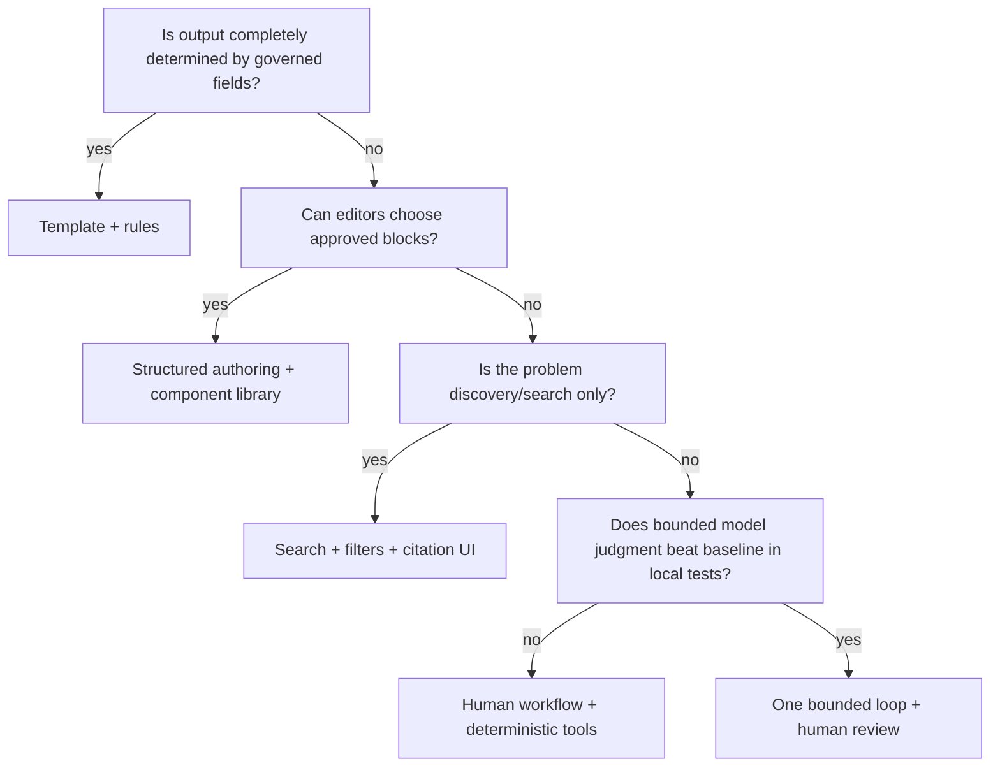

# Mission, Boundaries, Workload Fit, and Authority for Content Editorial Agents

## Mission contract

The product is a **reviewable editorial workbench**, not a text generator. Its mission is to reduce research, structuring, drafting, and revision effort while preserving who asked for the work, which evidence supports it, which rights and policies constrain it, what changed, who accepted it, what was released, and how later corrections propagated.

Write the mission as a falsifiable contract:

> For approved content types and channels, produce claim-linked structured revisions and review packages that meet local quality gates, never exceed delegated authority, and leave every external effect reconcilable and correctable.

Reject goals such as “publish more,” “write in our voice,” or “fully automate content.” They omit quality, authority, evidence, rights, and failure recovery.

## Workload inventory before architecture

Inventory real work for four to eight weeks. Sample normal items and near misses, not only exemplary output.

| Dimension | Questions | Evidence to collect |
|---|---|---|
| Content type | Article, product narrative, help, release note, policy, social adaptation? | Counts, schemas, lengths, revision depth |
| Assignment | Who owns purpose, audience, deadlines, and claims? | Briefs, ticket fields, missing-field rate |
| Evidence | Which sources are authoritative? How often do they change? | Source lists, stale claims, citation defects |
| Rights | Which assets/excerpts/licenses/consents are used? | Clearance records, missing attribution, expiries |
| Review | Which roles actually block release? | Review paths, rework reasons, approval latency |
| Effect | Which systems schedule/publish/correct? | APIs, manual steps, duplicate/partial failures |
| Risk | What harm follows an error? | Incident history, regulated claims, visibility |
| Economics | Where is human time spent? | Active minutes, queue wait, tooling cost |

Separate active effort from queue delay. An assistant that saves ten minutes but creates an extra legal review is not an improvement.

## No-agent alternatives

Use the lowest-capability solution that meets the requirement.



| Alternative | Strong fit | Failure avoided |
|---|---|---|
| Field-to-template generation | Product specs, disclosures, standard notices | Hallucinated facts and stylistic drift |
| Snippet/component library | Repeated help steps, approved legal text | Accidental paraphrase of controlled language |
| Rules and linters | Terminology, forbidden claims, metadata, links | Model variability and needless cost |
| Search and source cards | Editors need discovery, not prose | Claim synthesis risk |
| Workflow/forms | Review routing, due dates, approvals | Chat-state ambiguity |
| Batch transforms | Metadata normalization and known format conversion | Unnecessary agent loop |

### Model admission gate

Admit a model only if all are true:

- the task needs bounded judgment rather than fixed transformation;
- authoritative inputs can be identified and access-controlled;
- output can be typed, validated, and reviewed before effect;
- local evaluation shows measurable value over the deterministic/manual baseline;
- failure can be detected, stopped, corrected, and audited;
- the model is not being asked to own a decision reserved to people or policy.

## Risk-tier content classes

Create local classes; do not use one workflow for everything.

| Tier | Examples | Minimum controls | Default autonomy |
|---:|---|---|---|
| 0 | Internal brainstorm, non-authoritative outline | Tenant boundary, retention, no external effect | Model proposals allowed |
| 1 | Low-risk help copy, event recap from approved facts | Claims/links, editorial review, sandbox render | Draft and revise |
| 2 | Public product narrative, comparison page, release notes | PIM locks, rights, brand, accessibility, subject review | Draft only; no publish |
| 3 | Health, finance, legal, safety, employment, election, children, material corporate claims | Specialist policy, two-person review where required, counsel/authority, strict evidence | Template or advisory only |
| 4 | Protected sources, unresolved rights, crisis statements, retraction decision | Specialist system and accountable leadership | Agent stops |

Visibility, audience vulnerability, reversibility, regulatory exposure, claim novelty, and asset rights all affect tier. “Short social post” can be higher risk than a long internal article.

## Authority matrix

Capabilities and accountability must be explicit.

| Action | Agent may | Deterministic policy/executor may | Accountable human owns |
|---|---:|---:|---:|
| Read approved sources | Yes, least privilege | Enforce source/tenant policy | Approve source classes |
| Propose a claim | Yes | Validate schema/locator | Accept material claim |
| Draft or patch content | Yes | Store immutable revision | Accept wording |
| Flag rights risk | Yes | Apply mechanical rules | Clear use or reject |
| Generate alt-text candidate | Yes | Run checks | Confirm equivalence/context |
| Apply approved template | No judgment needed | Yes | Approve template/version |
| Approve legal/brand exception | No | Record only | Named legal/brand owner |
| Declare accessibility conformance | No | Record evidence only | Authorized accessibility owner |
| Schedule/publish/correct | No direct capability | Yes, after valid approval | Authorized publisher |
| Delete/retract | No | Execute approved effect | Named authority |

Never encode “human in the loop” as a generic checkbox. Name the role, required evidence, decision vocabulary, scope, expiry, and substitution/escalation route.

## Assignment admission

The gateway rejects or returns incomplete assignments before model invocation.

```json
{
  "assignment_id": "asn_01J...",
  "version": 3,
  "tenant_id": "tenant_acme",
  "title": "Battery care help article",
  "purpose": "Reduce avoidable support contacts",
  "accountable_owner": "usr_support_editor_42",
  "content_type": "help_article",
  "audience": {"role": "device_owner", "assumed_skill": "novice"},
  "channels": ["help_web"],
  "jurisdictions": ["US", "EU"],
  "brand_policy": "brand-core@2026.08",
  "style_policy": "help-style@4.2",
  "accessibility_policy": "help-web@2026.2",
  "disclosure_policy": "ai-content@2026-08-02",
  "allowed_claim_classes": ["approved_product_fact", "procedure"],
  "prohibited_claim_classes": ["warranty_interpretation", "safety_exception"],
  "source_collections": ["kb_release_9_4", "product_manuals_current"],
  "due_at": "2026-09-05T12:00:00Z",
  "risk_tier": 2,
  "authority": {"draft": true, "publish": false},
  "digest": "sha256:..."
}
```

Admission checks:

1. authenticate the requester and resolve tenant/role;
2. verify accountable owner and content type;
3. resolve current policy/schema versions;
4. validate sources and destination allowlists;
5. compute risk and required reviewers;
6. set cost, tool, time, and iteration budgets;
7. freeze an immutable assignment version and digest.

Changes create a new assignment version. They do not mutate the authority underneath an in-flight approval.

## Stop rules are product behavior

The loop stops when any configured condition is met:

| Stop condition | Terminal state | Required output |
|---|---|---|
| Task satisfied within evidence bar | `revision_proposed` | Revision, claim coverage, limitations |
| Required fact missing or contradictory | `needs_subject_owner` | Narrow question and affected claims |
| Rights/consent/trademark unclear | `needs_rights_review` | Proposed use and evidence packet |
| Legal/regulated interpretation needed | `needs_legal_review` | Facts, wording, jurisdiction, uncertainty |
| Source asks the agent to change behavior | `security_review` | Artifact reference and safe diagnostic |
| Policy/assignment/version changed | `stale_context` | Continuity receipt and rebase requirement |
| Budget exhausted or repeated no-progress | `budget_exhausted` | Best artifacts, unresolved items, usage |
| External effect ambiguous | `effect_unknown` | Intent, request, provider evidence, next observation |
| Cancellation requested | `canceling` | Work stopped; outstanding effects enumerated |

### No-progress detection

Stop after two consecutive iterations that add no accepted claim, resolve no finding, reduce no uncertainty, and produce no meaningful patch. Do not “try harder” indefinitely. Ask a targeted question or route to the named reviewer.

## Accountability and segregation of duties

For higher-risk releases, the requester, drafter, reviewer, and publisher should be distinct roles where policy requires it. The system enforces role constraints deterministically.

Examples:

- the model can never satisfy a required human approval;
- an editor cannot approve a rights clearance unless assigned the rights role;
- a publisher cannot reuse approval from a different render digest;
- an emergency override requires a named break-glass role, reason, expiry, and after-action review;
- service accounts act as executors and are never displayed as decision makers.

## Requirements that expose hidden complexity

Before implementation, answer:

- Is the authoritative source a document, a field, an API, a policy decision, or a human statement?
- What happens when a product fact changes after approval but before schedule time?
- Which transformations count as derivative use under the organization's rights policy?
- Can an asset be approved for web but not social, paid media, email, or syndication?
- Which version is visible to reviewers versus the public?
- Does a provider's “success” mean queued or live?
- How will a correction reach caches, feeds, social copies, email archives, search metadata, and downstream syndication?
- What must be retained internally after public withdrawal, and under which legal hold/records policy?

If these answers are unavailable, the project is in requirements discovery, not implementation.

## Measurable acceptance gate

Do not proceed beyond an offline prototype until:

- 100% of sampled assignments have an accountable owner and resolvable policy bundle;
- prohibited actions are absent from the model tool catalog;
- at least 95% of material claims in a representative sample are correctly detected and ledgered, with 100% of quotes/numbers receiving locators or explicit failure;
- unsafe rights “clear” decisions are zero in the adversarial gate set;
- all risk-tier 2+ items route the configured reviewer roles;
- cancellations and assignment changes stop new model/tool work within the target control latency;
- baseline and assisted reviewer time, defect rate, and cost are reported together.

## Anti-patterns

| Anti-pattern | Why it fails | Replacement |
|---|---|---|
| “The model is the author” | Hides assignment, evidence, human contribution, and accountability | Attribute every revision activity and name the accountable owner |
| One workflow for all content | Ignores harm, rights, review, and reversibility differences | Risk- and content-type policy packs |
| Prompt contains the policy | Policy can be omitted, attacked, or changed without audit | Deterministic policy service plus versioned context projection |
| Human approval at the end | Reviewers face a large opaque artifact | Claim, patch, and finding-level evidence throughout |
| Agent can publish for convenience | Converts a prose failure into an external incident | Separate deterministic executor and publisher role |
| More agents equal more quality | Duplicates context and correlated errors | One loop; parallelize deterministic checks or independent evidence only |

## Design exercise

Choose one existing content type and produce:

1. a deterministic/manual baseline map;
2. a risk tier and named authority matrix;
3. an assignment schema with five reject conditions;
4. model/no-model boundaries for each step;
5. three stop conditions and their review packages;
6. a measurable gate for proceeding to a sandbox draft.

If the team cannot agree on publication authority or the source of truth, stop the architecture exercise and resolve governance first.
