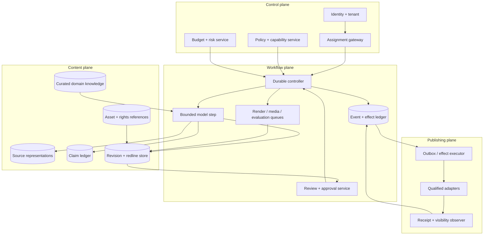
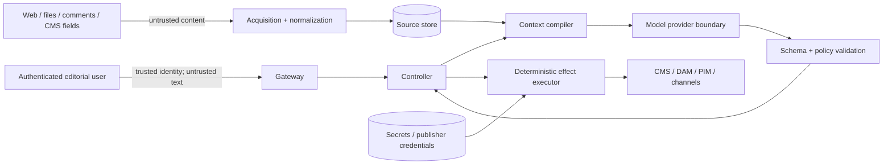

# Reference Architecture, Runtime, and Planes for Content Editorial Agents

## Architecture decision

The practical default is a modular monolith backed by a relational database, governed object storage, a queue, and isolated render/media workers. Add a durable workflow engine when reviews, schedules, retries, or corrections outlive one process. Keep one bounded model loop inside that boundary.

Do not begin with an event mesh, knowledge graph, vector database, multi-agent organization, or separate service per reviewer. Introduce a component only when a measured workload or control requires it.

## Pre-coding toolkit and artifact layout

Before selecting a framework, finish the workload inventory, risk/authority matrix, data classification, integration qualification plan, baseline metrics, and Stage 0/1 exit criteria. Then choose the smallest local toolkit that can prove the contracts:

- one application/runtime and one test runner;
- a relational database with migrations for durable domain state and an outbox;
- versioned, encrypted object storage for large immutable sources, renders, and media;
- a local queue or durable-workflow test runtime only when timers/recovery are in the evaluated path;
- JSON Schema or an equivalent typed validator, a deterministic renderer, accessibility/link/style checks, and content/asset digest utilities;
- fake adapters plus provider sandbox contract tests;
- trace/log/metric export with sensitive-body capture disabled by default.

A planning layout can remain one repository and one deployable unit:

```text
editorial-agent/
  contracts/       assignment, source, claim, revision, review, effect schemas
  policies/        authority, risk, brand, rights, accessibility, retention bundles
  workflow/        transition guards, bounded step runner, timers, reconciliation
  adapters/        CMS, DAM, PIM, storage, search, email, social capability boundaries
  renderers/       channel renderers and deterministic preview fixtures
  prompts/         versioned step prompts; no policy or credentials hidden here
  evaluations/     frozen corpus, adversarial cases, graders, release thresholds
  migrations/      durable-state and event/effect-ledger migrations
  operations/      dashboards, alerts, runbooks, behavior-bundle manifests
```

This is a logical layout, not a mandate to create every directory on day one. Start with the contracts, policy, offline evaluation, and fake adapter needed for Stage 1; add workflow, live adapters, and operations artifacts only as later-stage gates require them.

## Runtime selection matrix

| Shape | Use when | Reject when |
|---|---|---|
| Template/rules workflow | Output follows approved fields and blocks | Meaningful synthesis or revision judgment is required |
| Process-local bounded loop | Offline/sandbox prototype; short run; no external effects | Human waits, schedules, crash recovery, or reconciliation matter |
| Modular monolith + job queue | Most first production deployments | Multiple regions or regulatory isolation require separate cells |
| Durable workflow + bounded loop **recommended at Stage 3+** | Multi-day review, timers, retries, cancellation, effects | Team cannot operate the runtime or workload stays short/read-only |
| Multi-agent graph | Independent, permission-isolated research branches demonstrably improve outcomes | Agents share one evidence pool, create correlated drafts, or need ambiguous merging |

Python is a practical choice for content/media/evaluation workers; TypeScript is strong for control-plane and CMS integration work; Go or Rust suit high-throughput gateways. The best language is the one the team can secure, instrument, deploy, and support. Use typed messages at language boundaries.

## Four-plane architecture



The plane split is logical. A first deployment can run it in one codebase and database while using separate schemas, credentials, capabilities, and worker pools.

## Component map

| Component | Authoritative responsibility | Must not delegate to model output |
|---|---|---|
| Identity/tenant gateway | actor, tenant, role, region, session, service principal | access from a name in content |
| Assignment gateway | immutable brief/version, owner, policy bundle, risk, budgets | purpose or publish authority |
| Policy service | tool/field/channel permissions, review matrix, disclosure and retention rules | legal/brand/accessibility decision |
| Source service | approved acquisition, representation digest, locator, freshness, rights-to-process | citation existence or trust |
| Claim ledger | atomic proposition, support/contradiction/limits, review status | truth from model confidence |
| Revision store | structured immutable content, schema, parent, author/activity, digest | CMS draft as complete lineage |
| Asset/rights service | asset identity, rendition, provenance, proposed use, evidence, decision | clearance from metadata |
| Context compiler | least-privilege projection and token allocation | arbitrary vector-store results |
| Bounded loop | choose an approved read/analysis action and propose output | durable state or effect execution |
| Validators/renderers | schema, links, terminology, SEO, accessibility signals, channel render | final conformance or editorial judgment |
| Review/approval service | findings, decisions, role checks, digest binding, invalidation | generic “looks good” chat |
| Durable controller | state, events, leases, timers, cancellation, retry, compensation | transcript reconstruction |
| Effect executor | outbox, precondition, idempotency, credentials, receipts | model-authored destination/credential |
| Reconciler | observe provider and public state, classify outcome/drift | assume success from 2xx alone |
| Audit/export service | append-only evidence view, access logs, deletion/legal-hold projections | raw telemetry as audit trail |

## Trust boundaries



Trust identity assertions from the identity provider after validation. Treat all natural language—including “system-like” text retrieved from trusted business systems—as untrusted content. Only the controller and policy service create capabilities.

## Identity contracts

Use stable, non-semantic IDs. Keep mutable labels separately.

| Identity | Required uniqueness/scope | Example |
|---|---|---|
| `tenant_id` | Global internal | `tenant_acme` |
| `actor_id` | Tenant + identity provider | `idp:00u...` |
| `assignment_id` | Tenant | `asn_01J...` |
| `content_id` | Tenant, stable across revisions | `cnt_01J...` |
| `revision_id` | Tenant, immutable | `rev_01J...` |
| `claim_id` | Tenant/content lineage | `clm_01J...` |
| `source_representation_id` | Tenant + acquired bytes/representation | `src_01J...` |
| `asset_id` | Tenant, stable despite provider rename | `ast_01J...` |
| `release_id` | Tenant, one coordinated release lineage | `rel_01J...` |
| `effect_id` | Tenant, one intended external operation | `eff_01J...` |
| `provider_object_ref` | Adapter + tenant/account + remote ID | `contentful:space/env/entry` |

Never use URL, title, slug, SKU, filename, email, or CMS path as the sole durable identity.

## State model and projections

Persist an append-only domain event and transactionally update a current-state projection. Do not event-source every byte if the team cannot operate it; immutable revisions and an append-only event/effect ledger provide the required evidence with less complexity.

```json
{
  "event_id": "evt_01J...",
  "event_type": "editorial.approval.recorded.v1",
  "occurred_at": "2026-09-03T10:15:23.181Z",
  "recorded_at": "2026-09-03T10:15:23.420Z",
  "tenant_id": "tenant_acme",
  "assignment_id": "asn_01J...",
  "content_id": "cnt_01J...",
  "revision_id": "rev_01J...",
  "actor": {"type": "human", "id": "idp:00u...", "role": "accessibility_reviewer"},
  "correlation_id": "run_01J...",
  "causation_id": "evt_01H...",
  "policy_bundle": "sha256:...",
  "payload": {"approval_id": "apr_01J...", "scope": ["help_web"], "decision": "approved"},
  "schema_version": 1
}
```

Event rules:

- `event_id` is unique and consumers deduplicate it;
- `occurred_at` and `recorded_at` remain separate;
- payloads are versioned and backward-readable;
- actor type distinguishes human, service, and model activity;
- model activity never appears as an approval actor;
- content bodies live in governed stores; events contain references/digests unless policy permits otherwise.

## Command, event, and effect separation

| Object | Says | Example |
|---|---|---|
| Command | What an authorized actor requests | `SubmitRevisionForReview` |
| Decision | Whether policy/state permits it | allowed with reviewers A/B |
| Domain event | What durable internal transition occurred | `RevisionSubmitted` |
| Effect intent | What external change is intended | publish CMS entry digest X |
| Provider receipt | What provider reported | request accepted, remote ID Y |
| Observation | What independent read/public probe found | revision X visible at URL Z |

Never emit `Published` when the controller only created a request. Use `PublishIntentCreated`, `ProviderAccepted`, and `ReleaseObserved` as distinct events.

## Data placement

| Store | Data | Access pattern |
|---|---|---|
| Relational database | assignments, claims, revisions metadata, findings, approvals, workflow state, effects | transactional and auditable |
| Object storage | source snapshots, media originals, renditions, large renders, review packages | immutable/versioned, digest-addressed |
| Search index | approved tenant-scoped source projections | rebuildable; never sole authority |
| Optional vector index | embeddings over approved projections | tenant/policy filtered before retrieval; rebuildable |
| Secret manager | adapter and publisher credentials | executor identity only |
| Telemetry backend | redacted traces/logs/metrics | shorter retention, separate access |

Search and vector indexes are projections. Deletion, correction, permission, or policy changes must invalidate and rebuild them from authoritative state.

## Synchronous and asynchronous boundaries

Keep these synchronous when possible:

- assignment admission and policy check;
- small read-only model steps;
- schema and deterministic validation;
- approval recording;
- effect-intent creation.

Use queues/workflows for:

- web/source acquisition, virus scanning, and large imports;
- image/video render and media transforms;
- full-site render/link/accessibility suites;
- batch evaluation and similarity scans;
- scheduled publication, downstream observation, and reconciliation;
- correction propagation and archive export.

Every queued job has tenant, priority, deadline, input digest, policy version, idempotency key, attempt, timeout, cancellation token, and output locator.

## Planning contract

A plan is a typed proposal, not executable prose.

```json
{
  "plan_id": "plan_01J...",
  "assignment_version": 3,
  "goal": "propose_first_revision",
  "steps": [
    {"id": "s1", "action": "retrieve", "collection": "product_manuals_current", "query": "battery storage temperature", "max_results": 5},
    {"id": "s2", "action": "propose_claims", "depends_on": ["s1"], "max_claims": 8},
    {"id": "s3", "action": "propose_revision", "depends_on": ["s2"], "schema": "help_article@3"}
  ],
  "budgets": {"model_turns": 6, "tool_calls": 12, "elapsed_seconds": 180},
  "stop_on": ["material_conflict", "rights_unknown", "budget_exhausted", "assignment_changed"]
}
```

The controller validates actions, collections, dependencies, and budgets. The model cannot add `publish`, expand source scope, or remove stop rules.

## Failure containment

Use bulkheads:

- separate interactive, render/media, evaluation, and effect queues;
- separate draft and publisher credentials;
- tenant and region partitions at database, object, search, queue, cache, and telemetry layers;
- circuit breakers for providers and destinations;
- per-assignment and per-tenant budgets;
- a global kill switch for model steps and a separate switch for effects;
- degraded modes: templates/read-only editing remain available when the model provider is down.

## Deployment topology progression

```text
Stage 1: one process + local frozen corpus + no external writes
Stage 2: one service + relational DB + object store + sandbox adapters
Stage 3: controller + queue/workflow + isolated workers + effect outbox
Stage 4: tenant/region cells + HA stores + dedicated reconcilers + on-call
Stage 5+: add capacity and isolation only where measurements require it
```

## Architecture review gates

- Every authoritative object has a stable ID, version, digest, tenant, and retention class.
- Control, content, workflow, and publishing capabilities can be tested independently.
- A model/provider outage cannot prevent correction of already released content.
- A database restart during publication resumes without duplicate effect.
- Search/vector deletion lag is observable and bounded.
- A stale write is rejected in every adapter qualification suite.
- An effect can be reconstructed from intent, approval, payload digest, provider receipt, and observation without raw prompts.
- The system can disable all model calls while retaining manual/template workflows.

## Architecture anti-patterns

| Anti-pattern | Failure | Correction |
|---|---|---|
| CMS is the only database | Loses claims, cross-channel lineage, approvals, and unknown effects | Internal control/ledger with CMS as a destination/system of record for its fields |
| Vector store as knowledge truth | Stale/unauthorized chunks survive correction/deletion | Rebuildable projection with authoritative source IDs and policy filters |
| Model produces workflow JSON and system executes it | Prose-to-authority escalation | Validate against finite commands and policy |
| One broad API token | Draft compromise becomes publish/delete compromise | Separate scoped identities and executor boundary |
| Microservices before workload evidence | Operational complexity hides domain correctness | Modular monolith with explicit internal boundaries |
| Global shared worker pool | Render/eval spikes starve corrections and effects | Priority queues and workload bulkheads |
