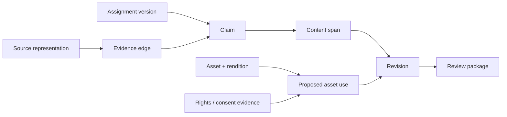

# Assignments, Sources, Claims, Rights, and Assets for Content Editorial Agents

## Evidence spine

The content plane should answer five questions for every consequential sentence or asset use:

1. Which assignment authorized this work?
2. Which exact source representation supports the narrow claim?
3. What transformations occurred between source and prose/media rendition?
4. What rights, consent, brand, privacy, and accessibility constraints apply to the proposed use?
5. Which accountable reviewer accepted the resulting wording and use?

Do not store these answers only in comments or prompts. Model them as linked objects.



## Source admission

A source registry is not a trust list with one score. Record the source, acquired representation, and allowed use separately.

```json
{
  "source_representation_id": "src_01J...",
  "tenant_id": "tenant_acme",
  "source_identity": {
    "type": "pim_product",
    "canonical_ref": "akeneo:product:uuid:9d2f...",
    "publisher": "product-data-team"
  },
  "acquired_at": "2026-09-01T08:30:00Z",
  "effective_at": "2026-08-29T00:00:00Z",
  "representation": {
    "media_type": "application/json",
    "object_uri": "obj://tenant-acme/sources/src_01J...",
    "sha256": "...",
    "provider_version": "etag:abc123"
  },
  "acquisition": {"adapter": "akeneo@1.8.2", "operation": "GET product UUID"},
  "authority": {"classes": ["approved_product_fact"], "fields": ["name", "dimensions", "materials"]},
  "rights_to_process": {"basis_ref": "internal-product-data-policy@5", "expires_at": null},
  "trust_labels": ["authoritative_for_listed_fields", "untrusted_instruction"],
  "freshness": {"revalidate_after": "2026-09-02T08:30:00Z"},
  "supersedes": null
}
```

### Trust is claim-specific

An official product record may be authoritative for dimensions and still say nothing about customer preference. A vendor blog may be direct evidence of the vendor's announcement but weak evidence of comparative performance. A brand guide is authoritative for terminology but not for law.

Use an authority tuple:

`(source_representation, claim_class, fields/scope, valid_time, jurisdiction, tenant)`

Never turn a domain reputation score into permission to assert any claim.

## Research acquisition rules

- Acquire only from assignment-allowed collections or through an explicit scope-change review.
- Preserve the representation used: bytes or normalized snapshot, digest, headers/version, acquisition time, and adapter/version.
- Treat web pages, documents, metadata, comments, and tool output as untrusted instructions.
- Record access and usage constraints; public availability is not unrestricted reuse.
- Distinguish event time, effective time, publication time, acquisition time, and expiry.
- Revalidate volatile sources before final review and again before scheduled publication when policy requires it.
- Never fabricate a source representation or locator from a model citation.

## Claim ledger

A claim is a narrow proposition that can be supported, contradicted, qualified, or left unresolved. Do not use a paragraph as one claim.

```json
{
  "claim_id": "clm_01J...",
  "content_id": "cnt_01J...",
  "assignment_version": 3,
  "proposition": "The device can be stored between -20 °C and 45 °C when powered off.",
  "claim_class": "approved_product_fact",
  "materiality": "high",
  "scope": {"product_version": "9.4", "mode": "powered_off"},
  "status": "supported",
  "support_edges": ["edge_01J..."],
  "contradiction_edges": [],
  "limitations": ["Does not describe operating temperature."],
  "review": {"state": "accepted", "reviewer_role": "product_data_owner"},
  "freshness": {"checked_at": "2026-09-01T08:31:00Z", "valid_until": "2026-10-01T00:00:00Z"}
}
```

### Evidence edge

```json
{
  "edge_id": "edge_01J...",
  "claim_id": "clm_01J...",
  "source_representation_id": "src_manual_9_4",
  "relation": "supports",
  "directness": "direct",
  "locator": {
    "type": "json_pointer",
    "value": "/storage/powered_off/temperature_c"
  },
  "excerpt": "-20 to 45",
  "excerpt_rights": "internal_review_only",
  "extraction": {"type": "deterministic", "tool": "json-pointer@1.0"},
  "meaning_check": "human_verified",
  "notes": "Units normalized from two numeric fields."
}
```

For web/text sources, combine a representation digest with fragment/text-quote/position selectors as appropriate. Position-only locators are brittle. Excerpts must be limited according to rights policy.

## Claim states

| State | Meaning | Publication treatment |
|---|---|---|
| `candidate` | Model or human proposed; not evaluated | Never presented as fact |
| `supported` | Meets configured evidence bar | Eligible after required review |
| `qualified` | Support exists but scope/uncertainty must remain visible | Wording must preserve qualifier |
| `contradicted` | Material conflicting evidence exists | Stop or explicitly present conflict under policy |
| `unsupported` | No adequate evidence | Remove or escalate |
| `stale` | Source/effective state changed or TTL expired | Revalidate before approval/release |
| `editorial_only` | Opinion, tone, framing, or call to action | Must not masquerade as sourced fact |
| `prohibited` | Policy forbids assertion | Block revision/release |

Model confidence is not a claim state and is not a substitute for evidence.

## Research-to-claim handoff

The research phase produces a typed package, not a prose briefing:

```json
{
  "research_package_id": "rsp_01J...",
  "assignment_digest": "sha256:...",
  "source_representation_ids": ["src_..."],
  "claims": ["clm_..."],
  "coverage": {
    "required_questions": 7,
    "answered": 5,
    "unresolved": ["battery-disposal-jurisdiction", "warranty-effect"]
  },
  "conflicts": ["cf_..."],
  "rights_flags": ["external_diagram_license_unknown"],
  "freshness_cutoff": "2026-09-01T08:31:00Z",
  "limitations": ["No approved answer for storage outside specified range."],
  "digest": "sha256:..."
}
```

The draft loop receives only accepted/qualified claims and explicitly marked gaps. It cannot silently upgrade candidates.

## Numbers, quotes, names, comparisons, and regulated facts

Apply stricter validators:

| Claim type | Required controls |
|---|---|
| Quote | Exact source locator, representation digest, permitted excerpt, speaker identity, human comparison to source |
| Number | Value, unit, precision, time basis, denominator, aggregation, source field/table locator |
| Date/time | Time zone, precision, effective/event/publication distinction |
| Person/organization | Stable entity reference or explicit ambiguity; privacy/publicity review where relevant |
| Comparison/superlative | Comparison set, metric, method, date, source independence, legal/brand review |
| Product fact | PIM/ERP/regulatory authority, product/version/channel/locale scope, locked-field enforcement |
| Legal/health/finance/safety claim | Approved template/policy and specialist acceptance; model cannot resolve interpretation |

## Asset identity and renditions

Do not bind a content revision to `hero-final-v7.jpg` or a mutable public URL.

```json
{
  "asset_id": "ast_01J...",
  "provider_refs": [{"adapter": "cloudinary", "asset_id": "62c2...", "public_id": "campaign/hero"}],
  "original": {"sha256": "...", "media_type": "image/tiff", "object_uri": "obj://..."},
  "provenance": {"c2pa_status": "present_valid", "manifest_ref": "obj://..."},
  "metadata_snapshot": {"iptc_version": "2025.1", "object_uri": "obj://..."},
  "renditions": [{
    "rendition_id": "rnd_web_1600",
    "sha256": "...",
    "transformation": "crop=16:9;width=1600;format=avif",
    "tool_version": "renderer@4.3",
    "alt_text_status": "human_approved"
  }]
}
```

C2PA validation is a provenance signal. IPTC/EXIF fields are evidence. Neither establishes depicted truth, consent, or rights.

## Proposed asset use and rights evidence

Rights attach to a use, not merely an asset.

```json
{
  "asset_use_id": "ause_01J...",
  "asset_id": "ast_01J...",
  "rendition_id": "rnd_web_1600",
  "content_revision_id": "rev_01J...",
  "use": {
    "channels": ["help_web"],
    "territories": ["US", "EU"],
    "audience": "public",
    "purpose": "instructional",
    "transformations": ["crop", "resize", "format_conversion"],
    "valid_from": "2026-09-05T00:00:00Z",
    "valid_until": "2027-09-05T00:00:00Z"
  },
  "evidence_refs": ["lic_01J...", "release_01J..."],
  "required_duties": ["credit_creator", "link_license", "indicate_changes"],
  "automated_assessment": "requires_human_clearance",
  "clearance": {"status": "approved", "decision_id": "rdec_01J...", "approver_role": "rights_manager"}
}
```

### Rights evidence types

- license agreement and amendment;
- Creative Commons/public license version and source;
- employee/contractor assignment;
- model/property release or consent record;
- stock-agency receipt and permitted-use terms;
- public-domain determination and jurisdiction basis;
- trademark/brand permission;
- contract or platform terms;
- exception/limitation analysis recorded by authorized counsel.

Absence of a restriction is not permission. A rights policy expression such as ODRL can help evaluate known terms but cannot prove ownership or legal effect.

## Attribution contract

Generate attribution deterministically from the approved rights decision:

```json
{
  "attribution_id": "attr_01J...",
  "asset_use_id": "ause_01J...",
  "creator_display": "Sam Lee",
  "copyright_notice": "© 2026 Sam Lee",
  "source_url": "https://example.test/original",
  "license": {"name": "CC BY 4.0", "url": "https://creativecommons.org/licenses/by/4.0/"},
  "change_notice": "Cropped and color-adjusted",
  "placement": "adjacent_caption_or_credits_page",
  "digest": "sha256:..."
}
```

The model may draft a display string but cannot omit required duties or invent a creator.

## AI-generation provenance

For materially generated or manipulated content, record:

- provider, model/build, generation time, and behavior bundle;
- input artifact references and whether the provider retained/trained on them under the contract;
- model output digest and every substantive human selection, arrangement, rewrite, or edit;
- synthetic-media/provenance marking status and validation;
- disclosure policy evaluation by jurisdiction, content purpose, review, and channel;
- accountable reviewer and final author/editor attribution policy.

Do not infer copyrightability or disclosure solely from percentage-edited scores. Those are not reliable legal tests.

## Worked mini-example: product description

**Assignment:** Draft two narrative fields for a travel charger; no new safety or compatibility claims.

1. Acquire product UUID record and approved compatibility matrix from PIM.
2. Create claims for weight, ports, input voltage, and listed compatible devices.
3. Lock all governed fields; the model receives read-only facts and allowed narrative schema.
4. Acquire the approved product image rendition and asset-use decision.
5. Propose headline and benefit paragraph. A phrase such as “works everywhere” is classified as an unsupported universal claim and blocked.
6. Product-data owner accepts fact-to-prose mapping; rights reviewer accepts image use; brand reviewer accepts wording.
7. Submit narrative fields as a PIM proposal with the current provider version. A conflict produces a rebase, not overwrite.

## Poisoning and correction controls

Before admitting a source or domain-memory item:

- verify tenant, origin, schema, permissions, and expected content type;
- scan files and strip active content in an isolated transform path;
- label instruction-like text and never execute it;
- check unexpected authority expansion, rare identifiers, and cross-tenant links;
- record reviewer, version, and expiry for curated knowledge;
- support quarantine, supersession, deletion, and dependent-claim invalidation.

When a source is corrected or removed, find every dependent claim, revision, release, render, memory item, and downstream destination. Create review/correction cases; never only update the search index.

## Evidence gates

- 100% of material claims have accepted locators or explicit unresolved/prohibited states.
- 100% of quotes, numbers, named comparisons, and governed product facts use strict validators.
- 100% of public asset uses bind to a rendition and use-scoped rights decision.
- Zero `rights_cleared` decisions are created from metadata/C2PA/model output alone.
- Source correction invalidation reaches dependent claims within the defined SLO.
- Retrieval authorization tests show zero cross-tenant and zero out-of-assignment results.
- Stale sources block final approval according to claim class policy.

## Anti-patterns

| Anti-pattern | Failure | Replacement |
|---|---|---|
| Citation list after drafting | Sources do not map to claims | Atomic claims and locator edges before/through drafting |
| “Official source” trust score | Overgeneralizes authority | Claim-class/field/time-scoped authority tuple |
| Asset URL in content | Mutable bytes and lost rights lineage | Stable asset/rendition IDs plus digest |
| `license = CC` | Loses version, duties, source, and changes | Exact license/evidence and use-specific duties |
| C2PA valid = true | Confuses signed provenance with truth/permission | Separate provenance, contextual verification, and clearance |
| Model fills missing product fact | Invents governed data | Stop and ask product-data owner |
| Correct source in vector DB only | Released and reviewed claims remain stale | Dependency invalidation and correction workflow |
