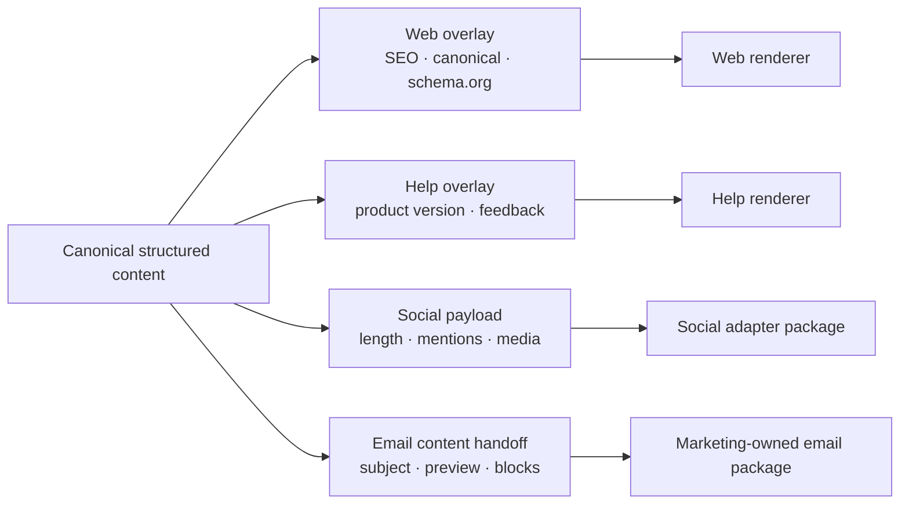

# Structured Content, Revisions, Redlines, and Review for Content Editorial Agents

## Content is a typed object

Keep meaning separate from channel rendering. An article, product narrative, and help procedure need different schemas; all should preserve stable block/span identities so claims, comments, and accessibility findings survive editing.

```json
{
  "$schema": "https://json-schema.org/draft/2020-12/schema",
  "$id": "https://schemas.example.test/content/help-article/3",
  "type": "object",
  "required": ["title", "summary", "prerequisites", "steps", "related_links"],
  "properties": {
    "title": {"type": "string", "minLength": 8, "maxLength": 90},
    "summary": {"$ref": "urn:example:rich-text-block"},
    "prerequisites": {"type": "array", "items": {"$ref": "urn:example:claim-linked-block"}},
    "steps": {
      "type": "array",
      "minItems": 1,
      "items": {
        "type": "object",
        "required": ["block_id", "instruction", "expected_result"],
        "properties": {
          "block_id": {"type": "string"},
          "instruction": {"$ref": "urn:example:claim-linked-block"},
          "expected_result": {"$ref": "urn:example:claim-linked-block"},
          "warning_ref": {"type": ["string", "null"]}
        },
        "additionalProperties": false
      }
    },
    "related_links": {"type": "array", "items": {"$ref": "urn:example:approved-link"}}
  },
  "additionalProperties": false
}
```

Pin the schema identifier and validator implementation. JSON Schema `format` behavior varies; use explicit semantic validators for URLs, dates, language tags, product IDs, and destination-specific rules.

## Channel-neutral core and channel overlays



Do not force every channel into a lowest-common-denominator document. Preserve the canonical facts and intent, then create explicit channel adaptations with their own claim coverage, rights, accessibility, and approvals.

## Revision contract

Every accepted model or human edit creates a new immutable revision.

```json
{
  "revision_id": "rev_01J...",
  "content_id": "cnt_01J...",
  "parent_revision_id": "rev_01H...",
  "assignment_version": 3,
  "schema_id": "help-article@3",
  "language": "en-US",
  "channel_scope": ["help_web"],
  "content_object_uri": "obj://tenant/revisions/rev_01J....json",
  "content_sha256": "...",
  "claim_coverage_sha256": "...",
  "asset_use_ids": ["ause_01J..."],
  "created_by": {"type": "model_activity", "activity_id": "act_01J..."},
  "created_at": "2026-09-02T09:14:00Z",
  "reason": "Address product-owner and accessibility findings",
  "status": "proposed"
}
```

`created_by` records who or what produced the revision. It does not confer approval or authorship policy. Preserve the human contribution and review activities needed by organizational and jurisdiction policy.

## Redline contract

Store both a machine patch and a deterministic human-readable view. JSON Patch is useful for structured fields but not sufficient to explain a rich-text semantic change.

```json
{
  "redline_id": "rdl_01J...",
  "from_revision_id": "rev_01H...",
  "to_revision_id": "rev_01J...",
  "patch": [
    {"op": "test", "path": "/steps/1/block_id", "value": "step_charge"},
    {"op": "replace", "path": "/steps/1/instruction/text", "value": "Disconnect the charger before cleaning it."}
  ],
  "semantic_changes": [{
    "block_id": "step_charge",
    "type": "safety_wording_changed",
    "claim_ids_added": ["clm_disconnect_before_cleaning"],
    "claim_ids_removed": [],
    "review_invalidations": ["editorial", "subject", "accessibility"],
    "summary": "Made the disconnect prerequisite explicit."
  }],
  "digest": "sha256:..."
}
```

Patch safety:

- test stable block identities before edit;
- reject application to a different base digest;
- validate the result against the schema;
- recompute claim/asset links and required reviews;
- preserve rejected alternatives as review events, not hidden branches;
- never use a word-level diff alone to decide materiality.

## Draft state versus provider state

Maintain an internal revision even when a CMS also stores drafts/revisions.

| Coordinate | Purpose |
|---|---|
| Internal `revision_id` | Cross-provider immutable editorial lineage |
| CMS object ID | Remote identity |
| CMS version/ETag | Lost-update protection |
| CMS perspective/status | Draft/published/release view |
| Render digest | Exact representation reviewed for one channel |
| Release generation | Group of outward effects and correction lineage |

When importing a human CMS edit, snapshot it as a new internal revision with provider identity/version and actor evidence. Do not overwrite the internal “latest” based on last-write-wins.

## Review finding model

Comments are evidence-bearing workflow objects.

```json
{
  "finding_id": "fnd_01J...",
  "revision_id": "rev_01J...",
  "review_type": "accessibility",
  "severity": "blocker",
  "category": "image_equivalence",
  "target": {"type": "asset_use", "id": "ause_01J...", "rendition_id": "rnd_web_1600"},
  "rule_ref": "help-web@2026.2:non-text-content",
  "evidence": {"tool_result_ref": "eval_01J...", "human_note": "Alt text omits the port orientation needed for the step."},
  "state": "open",
  "opened_by": {"type": "human", "id": "idp:..."},
  "resolution": null
}
```

Finding lifecycle: `open → acknowledged → proposed_fix → verified → closed`, with `accepted_risk` available only to an authorized role and reason. Closing a finding requires evidence against a named revision/render; editing nearby text does not auto-close it.

## Review matrix

Derive required reviews from content type, claims, assets, channel, audience, jurisdiction, and risk.

| Trigger | Required review | Reviewer decides |
|---|---|---|
| Every public revision | Editorial | clarity, coherence, accurate representation of accepted claims |
| Governed product/procedure facts | Subject/product owner | factual mapping, scope, version |
| Legal, comparative, regulated, sensitive claim | Legal/policy | permitted wording and disclosure within jurisdiction |
| External/third-party/people asset | Rights/privacy | proposed use, license, consent, attribution |
| Public brand channel | Brand | terminology, voice, prohibited/required expression |
| Web/media | Accessibility | meaningful structure/equivalence and policy evidence |
| Search-discoverable page | SEO/web owner | canonical, metadata, structured-data consistency |
| Social/email adaptation | Channel owner; marketing for campaigns | channel constraints and authorized handoff |

The agent can prepare the evidence and propose fixes. It cannot satisfy a required review.

## Approval contract

An approval is a signed decision over an exact scope and digest.

```json
{
  "approval_id": "apr_01J...",
  "tenant_id": "tenant_acme",
  "assignment_id": "asn_01J...",
  "revision_id": "rev_01J...",
  "render": {"channel": "help_web", "digest": "sha256:...", "renderer": "help-web@7.2"},
  "review_type": "editorial",
  "decision": "approved",
  "scope": {"destinations": ["help.example.test"], "jurisdictions": ["US", "EU"]},
  "approver": {"id": "idp:...", "role": "senior_support_editor"},
  "policy_bundle": "sha256:...",
  "open_findings": [],
  "conditions": ["Publish with AI-assistance disclosure metadata from policy decision aid_01J..."],
  "approved_at": "2026-09-03T12:00:00Z",
  "expires_at": "2026-09-10T12:00:00Z",
  "invalidation_rules": ["content_changed", "material_source_changed", "asset_use_changed", "policy_changed", "destination_changed"]
}
```

### Approval invariants

- The approver is authenticated and holds the required role at decision time.
- The review UI displays the exact render and material evidence, not a mutable “latest” link.
- Conditional approvals have machine-checkable conditions; prose-only conditions cannot authorize an effect.
- A new revision invalidates only reviews whose scope/materiality rules are affected, but the reasoning is recorded.
- Approval expiry is checked when the effect starts, not only when it is scheduled.
- An approval cannot be copied across tenants, content IDs, channels, or jurisdictions.
- Break-glass approval is separately authorized, short-lived, and reviewed afterward.

## Materiality and review invalidation

Compute candidate materiality deterministically and allow an authorized reviewer to raise it. Never let a model lower materiality.

| Change | Default invalidations |
|---|---|
| Whitespace/punctuation with identical render semantics | None or editorial spot-check |
| Heading hierarchy, link target, alt text | Accessibility and editorial |
| Material claim wording, number, quote, name, date | Editorial, subject, and applicable legal |
| Product/version scope | Subject/product, editorial, channel |
| Asset/rendition/transformation/attribution | Rights, accessibility, brand, editorial |
| Canonical URL/structured data/indexing directive | SEO/web and editorial if visible meaning differs |
| Disclosure label | Legal/policy, editorial, channel |
| Schedule/destination | Publisher/channel; content reviews may remain if render unchanged |
| Source correction affecting claim | All reviews depending on that claim |

## Rendering and preview

A preview is produced by the same renderer/version/configuration class used in release, inside a safe environment. It includes:

- resolved structured content and assets;
- page title, descriptions, canonical, robots, sitemap eligibility, and structured data;
- links, redirects, embed behavior, and responsive variants;
- accessibility tree/signals where available;
- disclosure and attribution placement;
- content/security sanitization results;
- render digest and dependency manifest.

A screenshot alone is not a sufficient review artifact because it omits semantics, responsive states, media alternatives, metadata, and interactive behavior.

## SEO and structured-data review

Treat search settings as metadata submitted to another system.

Checks include:

- visible title/author/date/product/procedure facts agree with structured data;
- canonical URL is absolute, self-consistent, allowed, and not contradicted by sitemap/redirects;
- robots/noindex choices align with release intent;
- `lastmod` reflects a significant content change, not a cosmetic build;
- schema vocabulary and search-engine supported profile are pinned;
- no hidden/unsupported claims exist only in structured data;
- staging/preview URLs are not indexable.

Passing these checks does not guarantee indexing, canonical choice, or rich results. Observe external state later.

## Accessibility review package

Provide the reviewer:

- semantic heading/landmark/list/table structure;
- images with purpose, surrounding context, alt candidate, and human status;
- audio/video captions, transcript, audio-description policy, and player behavior;
- link text in context;
- reading order and keyboard/focus behavior for embedded interactions;
- language of page and parts;
- automated rule results with tool/version and false-positive disposition;
- responsive render variants and complete-process scope;
- known limitations and third-party content.

Automated checks can block known failures. They cannot declare WCAG or legal conformance.

## Worked mini-example: article revision

An article revision changes “reduced setup time by 40%” to “reduced median setup time from 25 to 15 minutes in the April internal pilot.” The redline adds denominator/method/time scope and links the sentence to a reviewed dataset claim. Because the claim remains comparative and may be used publicly, editorial and legal approvals are invalidated. The hero image is unchanged, so rights approval remains valid. A new web render changes description metadata, so SEO review is also required.

This is safer than invalidating every review or, worse, keeping all approvals.

## Review-quality metrics

- findings per 1,000 words and per item, by category/severity;
- model suggestion acceptance rate, but never as the sole quality metric;
- false-positive burden of style/brand/accessibility tools;
- reviewer active minutes and queue wait separately;
- reopened finding rate;
- approval invalidation precision/recall in a seeded change suite;
- defects escaped after approval, mapped to the missing/failed review control;
- render mismatch rate between reviewed and released digest.

## Anti-patterns

| Anti-pattern | Failure | Replacement |
|---|---|---|
| Rich-text blob | Claims, reuse, validation, and safe diffs become fragile | Typed content and stable block IDs |
| Edit “latest” in place | Destroys review and authorship lineage | Immutable revisions and explicit parents |
| Approval on a mutable preview URL | Reviewer and executor may see different content | Digest-bound render artifact |
| Global approval status | Hides review type, channel, jurisdiction, scope, and expiry | Independent typed approvals |
| Model labels change “non-material” | Lets generator preserve stale approval | Deterministic floor; reviewer may raise materiality |
| Automated accessibility pass | Misstates conformance | Tool findings plus accountable human review |
| SEO score drives factual wording | Optimizes proxy over truth | Claims first; metadata reflects visible content |
