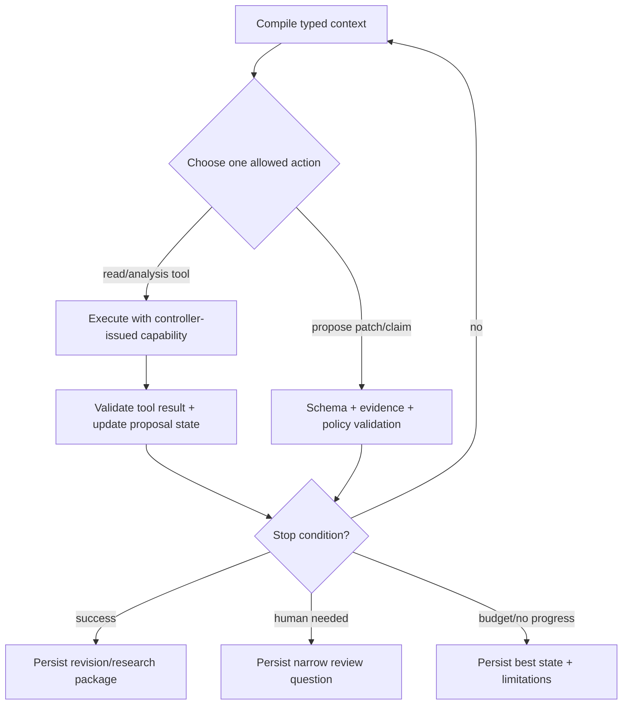

# State, Planning, Context, Memory, and Compaction for Content Editorial Agents

## Durable truth versus model context

The runtime has three distinct representations:

| Representation | Purpose | Authority |
|---|---|---|
| Durable workflow/domain state | Resume, audit, approvals, effects, corrections | Authoritative after validated transitions |
| Compiled model context | One bounded reasoning step | Read-only projection; never authoritative |
| Continuity receipt | Reconstruct the next safe projection after pause/compaction | Pointer-rich checkpoint; not a content database |

Never ask the model to remember what the system can load. Never treat a summary as permission.

## Workflow aggregate

```json
{
  "workflow_id": "wf_01J...",
  "tenant_id": "tenant_acme",
  "assignment": {"id": "asn_01J...", "version": 3, "digest": "sha256:..."},
  "content_id": "cnt_01J...",
  "state": "drafting",
  "current_revision_id": "rev_01H...",
  "plan_id": "plan_01J...",
  "open_claims": ["clm_..."],
  "open_findings": [],
  "required_reviews": ["editorial", "subject", "rights", "accessibility"],
  "approvals": [],
  "pending_effects": [],
  "budgets": {"model_turns_remaining": 4, "tool_calls_remaining": 7, "cost_remaining_usd": 1.80},
  "lease": {"owner": "worker-17", "expires_at": "2026-09-02T09:20:00Z"},
  "cancel": {"requested": false},
  "version": 18,
  "updated_at": "2026-09-02T09:18:12Z"
}
```

Use compare-and-set on aggregate version or a transactional lock. Leases protect workers, not business truth; an expired worker must not continue with a cached capability.

## State transition guard

```text
transition(command):
  authenticate(actor)
  load aggregate with version
  check tenant, role, policy bundle, and cancellation
  validate command schema and preconditions
  make deterministic decision
  append domain event and update projection atomically
  enqueue any follow-up with the committed event ID
```

Model output can populate a proposal command only after schema and policy validation. The controller decides whether it becomes a transition.

## Bounded planning

Plans use a finite action vocabulary:

- `retrieve_source`
- `inspect_claim`
- `propose_claim`
- `propose_outline`
- `propose_patch`
- `respond_to_finding`
- `request_human_input`
- `stop`

No `publish`, `delete`, `send`, `change_policy`, `add_destination`, or `read_secret` action exists in the model catalog.

### Plan validation

Validate:

- goal is permitted by assignment state;
- every source collection and tool is allowed;
- claim/content scope matches assignment and tenant;
- dependencies form a small acyclic graph;
- each step has input/output schema, timeout, and budget;
- required deterministic validators follow model steps;
- stop conditions cover sensitive ambiguity, staleness, cancellation, budget, and no-progress.

Replanning cannot expand scope. A missing capability becomes a human request.

## Model loop



Every iteration records action, input object references/digests, tool/model/provider/build, policy decision, output reference, budget delta, and stop evaluation. Raw prompt/completion storage is disabled by default.

## Context compiler

The compiler creates a least-privilege, typed envelope.

```json
{
  "context_id": "ctx_01J...",
  "purpose": "propose_help_article_patch",
  "assignment": {"id": "asn_...", "version": 3, "digest": "sha256:...", "projection": "drafting_fields_only"},
  "current_revision": {"id": "rev_...", "digest": "sha256:..."},
  "accepted_claims": [{"id": "clm_...", "proposition": "...", "locator_refs": ["edge_..."]}],
  "open_findings": [{"id": "fnd_...", "category": "...", "target": "block_..."}],
  "assets": [{"asset_use_id": "ause_...", "allowed_description": "Front view of charger", "rights_status": "approved_for_help_web"}],
  "policies": {"style": "help-style@4.2", "forbidden_claims": ["..."]},
  "trust_labels": {"source_text": "untrusted_instruction", "policy_projection": "trusted_control"},
  "omissions": ["publisher_credentials", "other_tenant_data", "raw_license_contract"],
  "budgets": {"max_output_tokens": 2500, "tool_calls": 3},
  "digest": "sha256:..."
}
```

The model sees rights conclusions and permitted-use facts, not necessarily full contracts or personal consent records. It sees source excerpts needed for claims, not entire licensed works by default.

## Context budget

Allocate by type rather than filling the window opportunistically.

| Context segment | Default share | Compaction rule |
|---|---:|---|
| Control: assignment, scope, stop rules | 15% | Never prose-compress authority; retain typed fields/digests |
| Current task/revision/finding | 25% | Preserve exact target blocks and version |
| Accepted claims and locators | 30% | Drop low-materiality claims first; keep IDs/pointers |
| Source excerpts/tool results | 20% | Extract only required spans; keep provenance/trust labels |
| Style/examples | 5% | Retrieve relevant rules, not entire style guide |
| Reserve/output | 5%+ | Hard reserve; stop if insufficient |

These are starting values, not universal constants. Measure truncation, omission errors, and cost by content type.

## Seven explicit memory lifetimes

### Turn/scratch memory

Use for parsing the current request, intermediate candidate phrases, and temporary comparisons. It has no authority, is not searched later, and is discarded at turn end unless a typed artifact is admitted.

Controls: process memory isolation, no cross-tenant reuse, no automatic telemetry bodies, cancellation cleanup.

### Working/run memory

Use for the active plan, retrieved excerpts, tool results, candidate claims, and unresolved questions. It is bounded by run and assignment.

Controls: provenance on every item, trust labels, token/tool/cost budgets, short TTL after completion, quarantine of injection indicators, no publication approval.

### Session memory

Use for navigation continuity and non-authoritative conversation preferences during one authenticated session.

Controls: session/tenant scope, expiry, user-visible reset, no silent admission of facts/rights/policies, no session privilege after role change.

### Durable workflow/task memory

Use for assignment, state, claims, revisions, findings, approvals, effects, deadlines, cancellations, and corrections.

Controls: typed schema, transactional transitions, append-only history, retention/legal holds, correction rather than mutation, audited access, deterministic deletion workflow.

### Domain knowledge memory

Use for approved style rules, templates, taxonomies, product vocabularies, policy summaries, and examples.

Controls: curator/owner, source and rights, tenant/domain scope, version/effective date/expiry, signature or review evidence, supersession, dependent-context invalidation, poisoning tests.

### Long-term/preference memory

Use only for explicit low-risk user/team preferences such as preferred review view or approved tone variant.

Controls: consent/notice, owner and tenant, precedence below current policy/assignment, expiry, access and correction/deletion, no sensitive inference, no conversion of repeated model output into preference.

### Episodic/outcome memory

Use for released outcomes, review overrides, incidents, correction cases, and evaluation/failure examples.

Controls: minimization/de-identification, rights to reuse, exclusion of protected/unpublished material unless explicitly governed, fixed evaluation split, poisoning/outlier review, retention, correction and deletion propagation.

## Common memory envelope

```json
{
  "memory_id": "mem_01J...",
  "lifetime": "domain_knowledge",
  "tenant_id": "tenant_acme",
  "subject_scope": "help_style",
  "value_ref": "obj://tenant/knowledge/help-style-4.2.json",
  "value_digest": "sha256:...",
  "provenance": {"source_ids": ["src_policy_..."], "curator": "idp:..."},
  "rights": {"process_basis": "internal_policy", "reuse_scope": ["tenant_acme"]},
  "sensitivity": "internal",
  "trust": "curated_control_input",
  "effective_from": "2026-08-01T00:00:00Z",
  "expires_at": "2027-02-01T00:00:00Z",
  "retention_class": "policy_history_7y",
  "correction": {"supersedes": "mem_01H...", "status": "current"},
  "deletion": {"status": "active", "hold_ids": []},
  "poisoning_review": {"status": "passed", "suite": "knowledge-admission@6"}
}
```

## Admission rules

Do not automatically remember:

- model-generated claims or summaries;
- reviewer comments outside their decision scope;
- source text containing instruction-like content;
- personal or confidential details not necessary for the memory purpose;
- licensed excerpts beyond allowed processing/reuse;
- transient provider errors as permanent knowledge;
- a correction case as a reusable style example without de-identification and review.

Admission is a deterministic command with schema, rights, provenance, owner, retention, and poisoning checks. The model may propose admission; it cannot execute it.

## Loss-aware compaction

Compaction must preserve state needed to prevent unsafe action. A prose summary alone is insufficient.

```json
{
  "receipt_version": 1,
  "continuity_receipt_id": "cr_01J...",
  "workflow_id": "wf_01J...",
  "checkpoint_event_id": "evt_01J...",
  "source_event_high_watermark": {"workflow": 881, "publishing": "provider-event-72"},
  "assignment": {"id": "asn_...", "version": 3, "digest": "sha256:..."},
  "current_revision": {"id": "rev_...", "digest": "sha256:..."},
  "state": "in_review",
  "accepted_claim_ids": ["clm_1", "clm_2"],
  "unresolved": [
    {"type": "rights", "id": "ause_...", "severity": "blocker"},
    {"type": "claim", "id": "clm_7", "state": "contradicted"}
  ],
  "open_findings": ["fnd_..."],
  "approvals": [{"id": "apr_...", "status": "valid", "scope_digest": "sha256:..."}],
  "invalidated_approvals": ["apr_old_..."],
  "effects": [{"id": "eff_...", "state": "effect_unknown", "must_reconcile": true}],
  "pending_effect_ids": ["eff_..."],
  "unknown_effect_ids": ["eff_..."],
  "active_clocks": [{"clock_id": "review_deadline", "due_at": "2026-08-31T14:00:00Z", "owner": "accountable_editor"}],
  "cancel": {"requested": false},
  "budgets_remaining": {"model_turns": 2, "tool_calls": 4, "cost_usd": 0.90},
  "version_pins": {"behavior": "content-agent/2026.08.31.2", "policy_bundle": "sha256:...", "tool_registry": "content-tools/7", "context_compiler": "content-context/3"},
  "omitted_item_refs": [
    {"type": "low_materiality_source_excerpt", "count": 14, "recoverable_from": "rsp_01J..."}
  ],
  "resume_preconditions": ["reconcile eff_... before external write", "reload role and policy"],
  "next_safe_action": "reconcile_eff_before_external_write",
  "invariant_hash": "sha256:...",
  "receipt_digest": "sha256:..."
}
```

### Mandatory preservation set

Never omit:

- tenant, assignment identity/version/digest, accountable owner, risk tier;
- current content/revision/render identities and schema;
- material accepted, contradicted, unsupported, or stale claims;
- open rights/privacy/legal/brand/accessibility blockers;
- approvals, scope, expiry, and invalidations;
- pending, canceling, partially completed, or unknown effects;
- current policy/behavior bundle and remaining budgets;
- cancellation state and resume preconditions.

If these do not fit, checkpoint pointers to durable state and start a fresh context. Do not compress authority until it fits.

## Continuity validation

On resume:

1. authenticate actor/worker and reload tenant role;
2. verify receipt digest and checkpoint event;
3. reload authoritative state and compare versions;
4. invalidate receipt if assignment, policy, revision, approval, source, or effect state changed;
5. reconcile unknown effects before planning writes;
6. compile a new context from durable records;
7. record the resume event and reason.

The receipt is never used to bypass a database read.

## Concurrency, cancellation, and human edits

- One workflow lease controls model planning for a content item, but humans may still edit through explicit branches.
- A human edit creates a revision and emits an invalidation event. Active runs stop at the next tool/model boundary.
- Cancellation is checked before model calls, tool calls, queue dequeue, adapter execution, and retry.
- Once an external effect crosses the provider commit point, cancellation becomes “stop further effects and reconcile,” not a promise to undo it.
- Parallel research branches may produce candidate claim packages but never mutate one draft concurrently.

## Memory and context metrics

- tokens by context segment and task type;
- required-field omission and stale-context incident rate;
- retrieval authorization/filter failure rate;
- memory admission rejection reasons;
- correction/deletion propagation lag by store/index/cache;
- compaction rate, continuity validation failure, and resume recovery time;
- repeated/no-progress loop rate;
- context cost per approved revision;
- poisoned-memory test escape rate.

## Anti-patterns

| Anti-pattern | Failure | Replacement |
|---|---|---|
| Chat transcript is state | Cannot safely resume, audit, cancel, or reconcile | Typed durable aggregate and events |
| One memory bucket | Preferences, evidence, policy, and outcomes contaminate each other | Seven lifetimes with separate admission/retention |
| Summary overwrites records | Loses qualifiers, approvals, and unknown effects | Pointer-rich continuity receipt |
| Retrieve top-k then filter | Unauthorized content already reached the model | Authorize/filter before retrieval and projection |
| Remember every correction | Creates sensitive, skewed, and poisoned outcome memory | Curated/de-identified episodic admission |
| Unlimited revise loop | Spends cost and amplifies drift | Iteration, progress, time, and cost stops |
| Resume from cached capability | Role/policy may have changed | Re-authenticate and recompile context |
