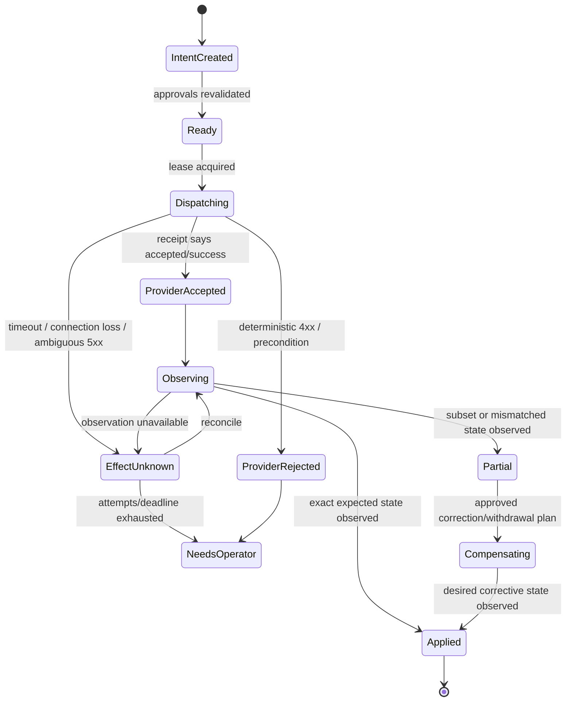

# Integrations, Approvals, Effects, Publishing, and Corrections for Content Editorial Agents

## Adapter principle

An adapter is a semantic boundary, not a thin HTTP client. It converts a provider's exact identity, version, status, limit, permission, and failure behavior into the editorial domain without claiming stronger guarantees than the provider offers.

Pin and record:

- provider product/region/account and API version/date;
- client/SDK and adapter version;
- feature/plan entitlement and deprecation status;
- scopes/service principal and destination allowlist;
- rate, concurrency, payload, batch, schedule, media, and retention limits;
- precondition, idempotency, request-ID, webhook, cancellation, correction, and read-after-write semantics;
- test evidence from the actual tenant or an equivalent sandbox.

## Representative adapter catalog

| Adapter class | Representative systems | Read contract | Write/effect risk to qualify |
|---|---|---|---|
| CMS | Contentful, Sanity, WordPress, AEM structured content | draft/published/release perspectives; schema; version token | lost updates, reference publication, schedule limits, plugin/plan differences |
| DAM/media | AEM Assets, Cloudinary, governed object storage | stable asset ID, bytes/rendition digest, metadata, version | overwrite/metadata loss, derived assets, CDN invalidation, deletion/restore |
| PIM | Akeneo or organization PIM | stable product UUID, channel/locale values, draft/proposal | governed-field overwrite, product-version drift, batch/rate behavior |
| Object/network storage | S3-compatible/GCS/Azure, SMB/NFS file share, or equivalent | immutable object version or file identity, checksum, region, retention/hold | overwrite/delete, atomic rename and locking, path traversal, change-notification gaps, encryption, replication, legal hold, shared credentials, presigned URL leakage |
| Search/retrieval | Enterprise search, web search, search index, vector index | source ID/version/permission/freshness/locator | authorization-before-retrieval, stale projection, deletion propagation |
| SEO/web | Renderer, sitemap/Search Console, canonical/robots/structured-data validators | rendered page and metadata | submitted is not indexed; canonical is not guaranteed; cache/redirect drift |
| Accessibility | axe/ACT-based automation, validators, browser/AT review harness | rule/tool/version, DOM/render scope | false pass, incomplete process, third-party and responsive gaps |
| Rights/provenance | DAM rights fields, ODRL/RightsML policy, IPTC, C2PA validator | assertion/evidence/issuer/validation | metadata is not clearance; transformation/channel/territory constraints |
| Model/provider | Hosted or self-hosted text/multimodal model | model/build, region, retention/training contract, structured output | provider drift, content leakage, refusal/format variance, outage/rate limits |
| Social | LinkedIn Posts and approved platform APIs | author/page role, post/processing state | dated API sunsets, media processing, visibility defaults, correction/delete limits |
| Email | Mailchimp campaign handoff, SendGrid transactional handoff | draft/campaign/message state | recipients/consent owned elsewhere, asynchronous send, cancellation limits |

Marketing owns audiences, consent eligibility, campaign delivery, experiments, and outcomes. The editorial system may produce and approve a content payload; it must not silently become the campaign system.

## Qualification harness

Run contract tests against a sandbox and, where safe, a private production test destination.

### Read tests

- resolve stable identity after rename/move/slug change;
- distinguish draft, published, scheduled, archived, deleted, and release versions;
- fetch exact provider version and representation digest;
- verify tenant/account/region and permissions;
- paginate without gaps/duplicates under concurrent change;
- detect schema and unknown fields without breaking forward compatibility;
- prove authorization filtering occurs before model exposure.

### Write tests

- create/update draft with a stable client operation ID;
- reject stale version/ETag and preserve concurrent human edit;
- repeat same request and characterize deduplication;
- retry after validation failure, 429, 5xx, and connection drop;
- inject timeout immediately before and after provider commit;
- capture provider request/object/version IDs;
- cancel before, during, and after queue/processing states;
- reconcile with an independent GET/webhook/public observation;
- correct, unpublish, delete/tombstone, and restore where supported;
- observe references/assets, caches, feeds, and public URLs.

### Webhook tests

- valid/invalid signature and key rotation;
- replayed, duplicated, missing, delayed, and out-of-order event;
- schema/version evolution and unknown event types;
- tenant/account binding;
- event-before-read-consistency race;
- dead-letter replay with deduplication;
- payload minimization and regional storage.

## Capability contract

The controller issues a short-lived, operation-specific capability after policy and approval checks.

```json
{
  "capability_id": "cap_01J...",
  "principal": "svc_editorial_publisher",
  "tenant_id": "tenant_acme",
  "adapter": "contentful-prod-eu@2.4.1",
  "operation": "publish_revision",
  "resource": "contentful:space123:master:entry789",
  "allowed_revision_digest": "sha256:...",
  "approval_set_digest": "sha256:...",
  "not_before": "2026-09-05T09:59:30Z",
  "expires_at": "2026-09-05T10:05:00Z",
  "max_calls": 1
}
```

Capabilities never contain broad credentials and cannot be extended by the model.

## Approval set before effect

The controller builds an approval set from independent decisions.

```json
{
  "approval_set_id": "aps_01J...",
  "revision_id": "rev_01J...",
  "render_digest": "sha256:...",
  "destination_set": ["help_prod_eu", "help_prod_us"],
  "required": ["editorial", "subject", "rights", "accessibility", "publisher"],
  "approval_ids": ["apr_ed_...", "apr_subj_...", "apr_rights_...", "apr_a11y_...", "apr_pub_..."],
  "policy_bundle": "sha256:...",
  "valid": true,
  "checked_at": "2026-09-05T09:59:45Z",
  "digest": "sha256:..."
}
```

Recheck at effect start:

- actor/publisher role remains valid;
- assignment, revision, render, claims, assets, policy, destinations, and schedule have not materially changed;
- required approvals are present, unexpired, unrevoked, and condition-complete;
- no blocker finding or correction hold is open;
- destination adapter is healthy and qualified version is active;
- cancellation is not requested.

## Effect intent

Persist the intent and outbox row in the same transaction as the internal state transition.

```json
{
  "effect_id": "eff_01J...",
  "effect_type": "publish",
  "tenant_id": "tenant_acme",
  "release_id": "rel_01J...",
  "destination": "help_prod_eu",
  "provider_object_ref": "contentful:space123:master:entry789",
  "expected_provider_version": 17,
  "payload_ref": "obj://tenant/effects/eff_01J....json",
  "payload_digest": "sha256:...",
  "render_digest": "sha256:...",
  "approval_set_id": "aps_01J...",
  "operation_key": "tenant_acme:help_prod_eu:rel_01J:publish:1",
  "state": "intent_created",
  "attempt": 0,
  "created_at": "2026-09-05T09:59:50Z"
}
```

The operation key identifies one semantic effect. It is reused only for a retry of the identical payload/destination/effect. A correction or changed revision gets a new effect and key.

## Effect state machine



Do not map all HTTP 2xx responses to `Applied`. Contentful/Sanity releases, DAM media processing, social uploads, email sends, and search indexing can remain asynchronous.

## Idempotency and retry contract

Classify operations:

| Class | Example | Retry rule |
|---|---|---|
| Pure read | GET revision | Retry bounded with timeout/backoff |
| Naturally idempotent | PUT desired draft at stable ID with precondition | Retry same payload/key if provider semantics prove safe |
| Provider-keyed idempotent | POST with documented operation key | Retry inside provider retention/scope, same payload |
| Reconcilable non-idempotent | Publish/create post without key but with readable stable identity | On ambiguity, read/reconcile before retry |
| Irreversible/broadcast | Email send, public post, retraction | Human approval; no blind retry; destination-specific reconciliation |

Retry only transient, classified failures. Respect `Retry-After`, use capped exponential backoff with jitter, attempt/deadline budgets, and circuit breakers. Validation, authorization, policy, version conflict, and rights failures are not retryable.

Provider idempotency semantics differ. A generic `Idempotency-Key` header does nothing unless the provider documents it. The internal effect ledger is still required even when a provider supports keys.

## Unknown outcome reconciliation

When dispatch outcome is ambiguous:

1. stop retries and mark `effect_unknown`;
2. retain request timestamp, operation key, payload digest, remote request ID/connection evidence;
3. query by provider object ID, release ID, client metadata, or destination-specific search;
4. compare exact revision/render/payload digest where provider metadata permits;
5. use authenticated webhook as corroboration, not the sole truth if it can be delayed/duplicated;
6. probe the public/delivery surface when appropriate;
7. classify `applied_equivalent`, `not_applied`, `partial_or_mismatched`, or `inconclusive`;
8. retry only `not_applied` when provider and policy say it is safe;
9. route partial/inconclusive high-risk outcomes to an operator.

Record the observation method and evidence. “Could not find it” is not always proof of non-publication because of indexing/caching/eventual consistency.

## Scheduling contract

```json
{
  "schedule_id": "sch_01J...",
  "release_id": "rel_01J...",
  "target_window": {"not_before": "2026-09-05T10:00:00Z", "not_after": "2026-09-05T10:05:00Z", "timezone": "Asia/Kolkata"},
  "destination_effect_ids": ["eff_eu", "eff_us"],
  "approval_set_digest": "sha256:...",
  "revalidate": ["assignment", "revision", "claims", "assets", "policy", "approvals", "adapter_health"],
  "cancel_deadline": "2026-09-05T09:59:30Z",
  "state": "scheduled"
}
```

Use IANA time-zone names plus UTC instants. Define whether daylight-saving changes preserve wall time or instant. State a visibility window; cross-provider atomicity is rarely available.

### Scheduling failures

- provider schedule exists but local acknowledgement failed;
- local schedule exists but provider call failed;
- content changes while provider schedule points to an older remote draft;
- provider validates at execution time and rejects then;
- a grouped release publishes in batches;
- two releases scheduled together execute in an unspecified order;
- cancellation races provider commit;
- time-zone or clock assumptions differ.

Reconciliation jobs must scan scheduled state before and after due time.

## Cancellation contract

Cancellation is a request with state:

| Effect state | Cancellation behavior |
|---|---|
| Before intent | Stop workflow; no effect |
| Intent/ready | Mark canceled transactionally; dispatcher skips |
| Dispatching | Signal adapter; outcome is `cancel_pending` until reconciled |
| Provider queued/scheduled | Call documented cancel/unschedule once; observe provider state |
| Applied/visible | Cannot pretend cancellation; create withdrawal/correction effect under authority |
| Unknown | Reconcile first; stop all further dependent effects |

Return `canceled` only after no effect occurred or provider cancellation is observed. Otherwise return `cancel_requested`, `cancel_partial`, or `too_late`.

## Publication and external observation

A release is complete only when required destinations satisfy their defined success criteria.

| Destination | Minimum observation |
|---|---|
| CMS/web | remote version and public URL render digest/semantic checksum; canonical/robots expected |
| DAM/CDN | approved rendition reachable with expected version; old rendition state known |
| PIM | proposal/current value equals intended narrative fields; governed fields unchanged |
| Social | provider post ID, processing state complete, author/visibility/media/text correct |
| Email campaign handoff | approved content exists in marketing-owned campaign; send remains marketing authority |
| Search/SEO | sitemap/submission receipt and later crawl/index observation; no promise of indexing |

## Corrections, withdrawals, retractions, and archive

Use precise terms configured by policy:

| Transition | Typical meaning |
|---|---|
| Update | New information without correcting a material error |
| Correction | A released claim/content element was wrong and is fixed visibly |
| Withdrawal/unpublish | Public availability is removed or blocked |
| Retraction | The organization formally withdraws reliability or publication, with reason/notice policy |
| Replacement | A new item supersedes another while retaining lineage |
| Archive | Item is retained for record/reference under defined visibility and retention |

### Correction case

```json
{
  "correction_id": "cor_01J...",
  "release_id": "rel_01J...",
  "trigger": {"type": "source_corrected", "source_id": "src_01J..."},
  "severity": "material",
  "affected_claim_ids": ["clm_..."],
  "affected_revision_spans": ["span_..."],
  "destinations": [
    {"id": "help_web", "released_effect": "eff_...", "status": "pending"},
    {"id": "linkedin", "released_effect": "eff_...", "status": "pending"}
  ],
  "preserve_original": true,
  "required_reviews": ["editorial", "subject", "legal", "publisher"],
  "state": "impact_assessment"
}
```

Correction workflow:

1. freeze further propagation and mark affected claims under review;
2. reconstruct exact released revisions, sources, approvals, and destinations;
3. assess harm, urgency, and legal/records constraints;
4. propose corrected claims/revision and visible notice/tombstone as policy requires;
5. obtain independent approvals bound to corrective render/effects;
6. execute per destination with stable keys;
7. purge/invalidate caches and update metadata/feeds/sitemaps where applicable;
8. observe every destination and record acknowledged/unresolved propagation;
9. invalidate outcome memory/evaluation examples derived from the error;
10. close only when the required propagation set is complete or explicitly waived by authority.

Do not “fix history” by deleting internal source, revision, approval, or effect records. Apply retention, legal hold, access, and public-display rules separately.

## Adapter scorecard and release gate

| Dimension | Required evidence | Gate |
|---|---|---|
| Identity/version | rename/move and stale-write test | no lost update |
| Effect semantics | timeout-before/after-commit tests | all outcomes classified/reconcilable |
| Cancellation | state-race suite | no false canceled result |
| Correction | edit/withdraw/tombstone/restore matrix | operator playbook exists for gaps |
| Security | least scopes, secret rotation, webhook validation | no model/broad credential access |
| Tenancy/region | actual account/endpoint/storage mapping | matches policy |
| Limits | load/rate/payload/schedule tests | backpressure configured |
| Lifecycle | API/version/deprecation owner and alert | sunset budget exceeds migration lead time |
| Observability | request IDs, metrics, audit references | effect reconstructable |

## Anti-patterns

| Anti-pattern | Failure | Replacement |
|---|---|---|
| Thin CRUD wrapper | Provider semantics leak into unsafe generic calls | Domain adapter and conformance suite |
| Retry every timeout | Duplicate public effect | Unknown state and reconciliation |
| 2xx = published | Queued/partial/processing state is ignored | Provider receipt plus external observation |
| Generic idempotency header | Unsupported header gives false confidence | Verified provider semantics plus internal ledger |
| Cancel local row | Remote schedule may still fire | Provider cancellation and observation |
| Correct CMS only | Social, CDN, feeds, search, and memory remain wrong | Destination impact set and tracked propagation |
| Use marketing API from editorial loop | Expands scope to recipients/outcomes | Approved content handoff to marketing-owned execution |
