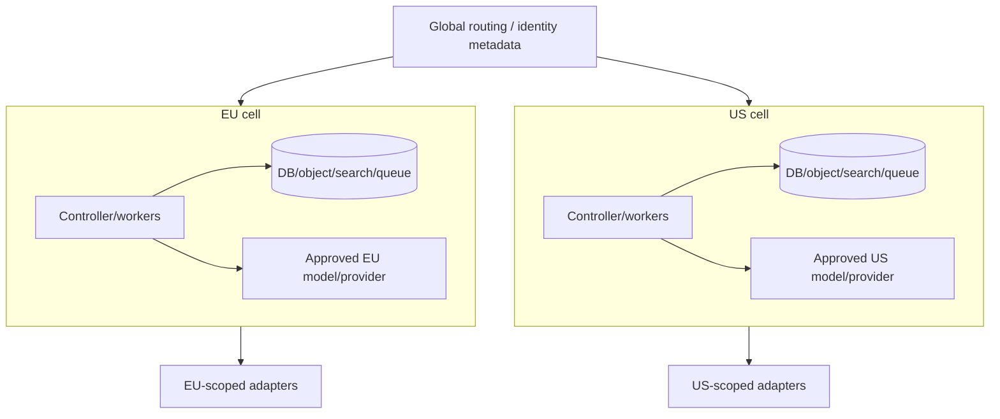
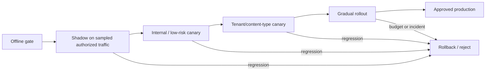

# Deployment, Scaling, Cost, Incidents, and Evolution for Content Editorial Agents

## Production objective

Operate the system so that research and rendering load cannot delay an urgent correction, a provider outage cannot create duplicate publication, and a model change cannot silently alter claims, brand, rights routing, or approval behavior.

Production readiness is primarily a workflow/effect discipline, not a model-serving exercise.

## Workload classes and bulkheads

| Queue | Work | Priority | Characteristic |
|---|---|---:|---|
| `correction_effect` | correct, withdraw, retract, purge/invalidate | P0 | low volume, strict start SLO |
| `publication_effect` | schedule, publish, observe, reconcile | P1 | deadline-sensitive, side effects |
| `interactive_editorial` | research, draft, revise, validate | P2 | user latency and budgets |
| `render_accessibility` | browser renders, link/schema/accessibility checks | P3 | CPU/memory/browser intensive |
| `media_transform` | image/video/audio derivatives, scan | P3 | bursty CPU/GPU/IO |
| `evaluation_shadow` | offline replay, shadow comparison | P4 | deferrable batch |
| `maintenance` | reindex, retention, drift scans | P5 | deferrable and rate-limited |

Reserve capacity for P0/P1 and use separate worker pools/circuit breakers. Do not let a launch-day render burst starve the effect observer that determines whether the launch succeeded.

## Backpressure

Apply at every boundary:

- assignment admission returns estimated delay or accepts a queued job; it does not spawn unbounded tasks;
- per-tenant and global concurrency limits protect fairness;
- queue maximum age and deadlines trigger degrade/escalate, not silent completion;
- model/tool/provider rate limiters use token buckets and `Retry-After` where available;
- render/media jobs are bounded by bytes, pages, pixels, duration, frames, memory, CPU/GPU time, and output count;
- retries consume a separate budget and do not overtake fresh high-priority work;
- overload switches to templates, cached approved sources, manual drafting, or read-only mode according to content class.

### Admission decision

```text
if P0 correction: reserve worker or page operator
else if tenant quota exceeded: queue with visible ETA or reject 429
else if provider circuit open: choose approved fallback/degraded mode
else if deadline < predicted completion: escalate before doing work
else admit with fixed budget and priority
```

## Capacity model

Model each stage independently.

```text
arrival_rate_i     = assignments or jobs / second
service_time_i     = p50/p95 active seconds per job
concurrency_i      ≈ arrival_rate_i × service_time_i × burst/headroom factor
queue_wait_budget  = deadline - downstream service/review/effect budget
```

Measure by content type, size, provider, region, and risk tier. Average token count does not predict media or browser capacity.

Track:

- assignments/hour and burst factor;
- source fetches, bytes, parse time, cache hit;
- model input/output/cached tokens and latency;
- render pages/variants/browser seconds;
- image pixels/video minutes/audio minutes and derivative count;
- evaluation cases and grader/reviewer time;
- scheduled effects/minute per adapter limit;
- observation/reconciliation reads per effect;
- correction fan-out destinations;
- recovery replay volume after outage.

## Cost model

```text
cost_per_released_item =
  model + retrieval + storage + search + render/media + validation
  + provider/API + observability + human_review + expected_incident_cost
```

Allocate shared costs consistently. Report cost per **approved and released** item and per correction-free 30-day outcome, not cost per generated draft.

### Cost controls

- run deterministic rules before model calls;
- retrieve narrow evidence spans and reuse verified source projections;
- use small/fast models only after slice-specific quality gates;
- cache by tenant, source/version, policy, and behavior digest; never across permissions;
- cap candidates, revisions, render variants, and media transforms;
- skip unchanged validators using dependency digests while retaining risk-based full runs;
- batch offline evaluation and maintenance;
- expose budget exhaustion as a safe terminal state;
- attribute unexpected spend to content type, tenant, behavior, provider, and retry class.

Never save cost by dropping required evidence, rights, accessibility, review, observation, or correction work.

## Regional and tenant topology



Keep content, backups, search, embeddings, queue payloads, model calls, telemetry, and diagnostic captures in the required cell. Global routing should hold minimal metadata. Cross-region failover is a data transfer and policy decision, not an automatic availability feature.

For high-risk tenants, use tenant-dedicated keys, indexes, buckets, queues, model projects, or complete cells as required by threat and contract.

## Availability and degraded modes

| Failure | Safe degraded mode |
|---|---|
| Model provider unavailable | templates/manual structured authoring; no new model drafts |
| Search/vector unavailable | direct approved-source browsing; no unsupported claims |
| DAM unavailable | existing digest-pinned rendition only if rights/expiry valid; otherwise hold |
| CMS management API unavailable | preserve approved release; do not claim published |
| Render workers saturated | block approval of new render; prioritize corrections |
| Review service unavailable | no approval; save immutable revision and queue |
| Telemetry backend unavailable | bounded local buffering without raw content; domain/audit transaction continues |
| One region unavailable | keep affected tenant/cell held or use approved regional failover plan |

Manual publication during outage requires a documented break-glass path and later receipt import/reconciliation. It does not bypass editorial/legal/rights/accessibility authority.

## High availability and disaster recovery

Define RTO/RPO by data class:

| Data | Typical requirement |
|---|---|
| Assignment/claim/revision/approval/effect ledger | low RPO; transactionally replicated/backed up |
| Source and media originals | durable versioned object storage; digest-verified restore |
| Search/vector/cache | rebuildable; higher RPO acceptable if source state remains |
| Telemetry | loss may be acceptable within policy; never substitute for audit |
| Secrets/keys | replicated by secret-management design; rotation/revocation plan |

### Recovery invariants

- restore does not resurrect deleted/held data without policy reconciliation;
- effect outbox and provider observations are replayed idempotently;
- unknown effects are reconciled before dispatch resumes;
- scheduled releases are revalidated against current time, policy, revision, and approvals;
- object digests verify restored sources/renders/assets;
- indexes rebuild with current permission, deletion, and correction state;
- continuity receipts become invalid if restored aggregate versions differ;
- capacity supports the recovery backlog plus live P0/P1 demand.

## Recovery-load testing

Test more than backup restoration:

1. stop workers during a burst with effects in every state;
2. allow provider-side schedules/webhooks to continue;
3. restore controller/database/queue from the declared recovery point;
4. reconcile provider/public state before replay;
5. process correction and publication priorities ahead of batch work;
6. rebuild search/vector/cache under live traffic;
7. measure duplicate effects, lost approvals/events, queue age, RTO/RPO, and capacity saturation;
8. verify deletion/legal-hold and region constraints after restore.

An HA architecture that has never handled its recovery load is unverified.

## Deployment and behavior bundle

Ship one immutable bundle manifest:

```json
{
  "bundle_id": "content-agent@2026.09.1",
  "runtime": "controller@8.4.0",
  "model_routes": {"draft": "provider:model-build", "classification": "provider:model-build"},
  "instructions": "sha256:...",
  "tools": "tool-registry@12.1",
  "schemas": ["claim@2", "help-article@3", "effect@1"],
  "policies": ["brand-core@2026.08", "rights@7", "ai-content@2026-08-02"],
  "retrieval": "retrieval-policy@6",
  "compaction": "continuity@3",
  "renderers": ["help-web@7.2"],
  "adapters": ["contentful-eu@2.4.1", "cloudinary@3.3"],
  "eval_report": "eval://content-agent/2026.09.1",
  "artifact_digest": "sha256:..."
}
```

Prompt, schema, tool, policy, model, renderer, and adapter changes can interact. Roll back the bundle or a tested compatible subset; do not assume switching only the model restores previous behavior.

## Shadow, canary, promotion, and rollback



Shadow output must not publish, enter reviewer queues as if real, or contaminate memory. Its source content use still requires authorization and retention controls.

Canary slices by content type, risk, language, brand, tenant, source class, model route, and adapter. Monitor quality and safety, not just latency/error rate.

### Automatic rollback or kill criteria

- material unsupported claim or invented quote/number in canary;
- unsafe rights-clearance or wrong legal/disclosure route;
- cross-tenant retrieval or content telemetry leak;
- stale approval accepted or approved/released digest mismatch;
- duplicate/unknown effect beyond threshold;
- accessibility blocker regression;
- reviewer override/rework or correction rate breaches budget;
- provider/adapter version behaves outside qualification;
- cost or latency exceeds guardrail without quality gain.

Keep the effect kill switch independent from model rollback.

## Drift detection

### Source drift

Monitor source schema, authority, availability, freshness, content distribution, permissions, and correction rate. Re-run dependent claim tests when authoritative sources change.

### Style and policy drift

Monitor policy version/effective dates, rule firing, reviewer overrides, controlled-language changes, and brand-owner decisions. Do not learn preferences from overrides until curated.

### Model/provider drift

Monitor model/build IDs, refusal/format/tool-call/latency/token/safety behavior, provider retention/region/subprocessor changes, and output evaluation slices. If the provider changes an unpinned model, treat it as a new bundle candidate.

### Adapter drift

Monitor API version sunsets, scopes, rate limits, deprecations, response schema, scheduling/correction semantics, regions, and webhook keys. Maintain migration lead-time SLOs.

## Incident severity

| Severity | Example |
|---:|---|
| SEV-0 | Cross-tenant/public secret exposure; mass unauthorized publication; inability to stop harmful distribution |
| SEV-1 | Material erroneous/unlicensed/private/inaccessible high-impact publication; publisher credential compromise |
| SEV-2 | Partial/duplicate release, unknown effect beyond SLO, missed correction destination, significant brand error |
| SEV-3 | Draft-only quality regression, delayed low-risk render/review, non-sensitive telemetry gap |

Severity depends on audience, harm, visibility, reversibility, and jurisdiction—not word count.

## Erroneous-publication runbook

### Detect and contain

1. Open incident and name incident commander, editorial authority, technical lead, communications, legal/rights/privacy/accessibility owners as needed.
2. Stop affected schedules/effect queues and revoke compromised capabilities/credentials; do not stop unrelated correction capacity.
3. Preserve assignment, source, claim, revision, render, approval, effect, provider, public-observation, and audit evidence.
4. Identify every destination, derivative, cache, feed, social/email handoff, search surface, syndication, and memory/evaluation projection.
5. If outcome is unknown, reconcile before repeating or deleting blindly.

### Assess and decide

6. Classify affected claims/assets/people, harm, urgency, jurisdiction, records/legal-hold duties, and public notice needs.
7. An accountable editor and required specialist decide update, correction, withdrawal, retraction, replacement, or no public change.
8. Build a corrective revision and destination plan with exact digests and approvals.

### Execute and verify

9. Dispatch corrective effects through the same intent/idempotency/reconciliation path, with P0 priority.
10. Invalidate/purge controlled caches, update metadata/canonical/sitemap/feeds as applicable, and notify downstream owners.
11. Observe each destination and record acknowledged, failed, unavailable, or waived status.
12. Correct/delete/quarantine dependent knowledge, memory, evaluation examples, indexes, and analytics labels.

### Recover and learn

13. Restore normal effects only after the incident authority clears the affected boundary.
14. Produce a blameless timeline connecting control failure to outcome.
15. Add authorized synthetic/regression cases, update bundle/policy/adapter, and exercise rollback.
16. Track corrective actions to owners and deadlines; do not close solely because the web page changed.

## Additional runbooks

### Provider degradation

- open circuit; stop unbounded retries;
- preserve queue deadlines and show degraded mode;
- route only through prequalified fallback for the same data/region/risk class;
- compare quality before releasing fallback output;
- reconcile in-flight effects when provider returns.

### Rights or consent expiry

- hold future schedules and affected new uses;
- identify released items and policy-required action;
- select an approved replacement or seek renewed clearance;
- obtain new rights/accessibility/editorial approvals;
- propagate and observe replacements; retain internal lineage.

### Search/source correction

- quarantine stale representation from new retrieval;
- invalidate dependent claims/reviews/releases/memory;
- prioritize public impact assessment;
- rebuild index after authoritative correction;
- record which outcomes were re-evaluated.

## Operations gates

- P0/P1 capacity remains available during peak render/media/evaluation load.
- Queue-age and deadline prediction prevent work that cannot finish safely.
- Recovery-load test meets RTO/RPO with zero duplicate effects.
- Region/tenant restore preserves deletion, hold, and isolation.
- Model outage leaves manual/template correction workflow operational.
- Bundle manifest, offline report, shadow/canary evidence, rollback, and kill switches are verified.
- Source/style/model/provider/adapter drift has named owners and alert thresholds.
- Erroneous-publication drill reaches every test destination and memory/index projection.

## Anti-patterns

| Anti-pattern | Failure | Replacement |
|---|---|---|
| Autoscale one shared queue | Low-priority jobs starve corrections/effects | Priority bulkheads and reserved capacity |
| Cost per token as economics | Ignores review, effects, and incidents | Cost per governed released outcome |
| Active-active across regions by default | Violates residency and complicates effect ordering | Policy-approved cells and explicit failover |
| Backup equals DR | Restore replay can duplicate effects and resurrect deletions | Recovery reconciliation and load testing |
| Model fallback on any outage | Different data/quality behavior is untested | Prequalified risk/region-equivalent route or manual mode |
| Prompt-only versioning | Cannot reproduce behavior | Complete behavior bundle |
| Global rollout after offline test | Local slices/provider effects remain untested | Shadow and content/tenant canaries |
| Delete bad page, close incident | Downstream copies and causal controls remain | Full corrective propagation and learning |
