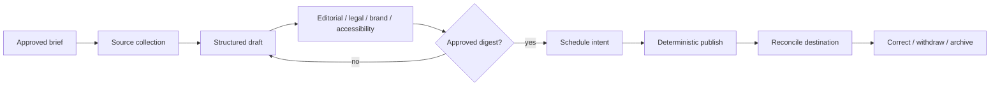

# Zero-to-Production Stages, Schemas, Examples, and Exercises for Content Editorial Agents

This guide turns the architecture into a delivery program. It assumes the category boundary, four-plane design, evidence model, durable state, guarded effects, security controls, evaluation suite, and operational model from the preceding guides. The objective is not to unlock more autonomy at each stage. It is to earn narrowly scoped authority with evidence, preserve a deterministic fallback, and stop expansion when the next control cannot be demonstrated.

For the research basis and refresh dates, see the [research packet](../../research/packets/content-editorial-agent-blueprint.md).

## Delivery rule

Advance only when all exit gates for the current stage pass on representative content, high-risk slices, and deliberate failures. A stage can be useful indefinitely; no team is required to reach Stage 6.

```text
manual truth -> offline evidence -> sandbox workflow -> durable integrations
             -> bounded production -> selective expansion -> governed evolution
```

Keep these constraints at every stage:

- one accountable assignment owner and one immutable assignment version per run;
- content, claims, evidence, rights, reviews, approvals, effects, and observations remain separate records;
- no model-selected credentials, destinations, audiences, or authority;
- no publication from a transient conversation;
- exact-revision review, preconditioned writes, and reconcile-before-retry;
- a manual/template path for urgent publication, correction, and withdrawal;
- promotion evidence is stored as a release artifact, not summarized from memory.

## Stage 0 — Map the manual truth

### Stage 0 entry

- A named workflow owner can provide recent briefs, source packets, revisions, redlines, approvals, publication records, and corrections.
- The team can observe the real workflow rather than only a policy diagram.
- Candidate channels and jurisdictions are identified.

### Stage 0 build

Document the current state without introducing an agent:

1. Trace at least 20 representative assignments and every available recent incident.
2. Name the systems of record for assignments, product facts, assets, rights, identity, content, schedules, and analytics.
3. Mark every handoff, mutable field, review scope, approval authority, deadline, and irreversible effect.
4. Measure reviewer active time, cycle time, rework reasons, correction frequency, and publication failure rate.
5. Classify tasks as deterministic automation, bounded model assistance, or human judgment.
6. Define the manual/template fallback and kill-switch owner.



### Stage 0 exit gates

- Every effect has a human owner and a mapped system of record.
- High-risk fields and channels have explicit human-only or deterministic paths.
- The baseline and target metrics are accepted by editorial, legal/rights, security, accessibility, and operations owners.
- The business case still holds after review and operations cost, not just generation cost, are included.
- At least one proposed use case is rejected or simplified when rules/templates solve it better. If none is rejected, repeat the workload-fit review.

## Stage 1 — Build an offline, read-only baseline

### Stage 1 entry

- Stage 0 artifacts are versioned.
- A de-identified or approved frozen corpus represents the target slices.
- Gold review labels and adjudication owners exist.

### Stage 1 build

- Implement versioned schemas for assignment, source, claim, asset/rights, content revision, finding, and decision.
- Run research, drafting, redlining, and findings offline. Export proposals; do not write to CMS, DAM, PIM, email, or social systems.
- Establish deterministic baselines: templates, exact glossary rules, required-field checks, broken-link checks, accessibility linters, and static mappings.
- Create adversarial cases for instruction-bearing sources, stale product facts, fabricated locators, expired rights, cross-tenant retrieval, and conflicting style rules.
- Record full trajectories, including refused and unresolved outcomes.

### Stage 1 exit gates

| Gate | Required evidence |
|---|---|
| Claims | Material-claim support precision/recall meets the risk-tier threshold; invented quote, number, name, and governed product-fact rate is zero in the release corpus |
| Rights | No test asset receives an automatic clearance conclusion; expired, missing, conflicting, and territory-limited rights route correctly |
| Review | Finding precision/recall and reviewer override reasons are acceptable by slice |
| Security | Prompt-injection, data-exfiltration, and tenant-isolation suites fail closed |
| Continuity | Pause/resume and compaction tests preserve unresolved work and authority without inventing state |
| Economics | Cost per accepted governed revision improves the baseline without increasing material escape risk |
| Reproducibility | Corpus, behavior bundle, policy, schemas, tools, and evaluator versions reproduce the report |

## Stage 2 — Run a sandbox workflow MVP

### Stage 2 entry

- Stage 1 gates pass.
- Sandbox CMS/DAM/PIM and test destinations contain synthetic or approved test data.
- Reviewer identities, scopes, and role separation are configured.

### Stage 2 build

Use the smallest loop: admit, observe, propose, validate, route, persist, pause. Add CMS proposal writes and draft asset/product references behind adapters. A human initiates every run, approves every revision, and executes or explicitly approves every test effect.

The MVP must demonstrate:

- optimistic concurrency conflicts and human-edit preservation;
- exact digest-bound reviews and invalidation after material edits;
- a persisted effect intent before test execution;
- provider acknowledgement plus destination observation;
- cancellation before dispatch and after acknowledgement;
- correction/withdrawal lineage;
- timeout, throttling, partial provider failure, malformed response, and unknown outcome;
- a kill switch that removes effect authority while retaining read-only recovery access.

### Stage 2 exit gates

- Zero writes can bypass the adapter, approval policy, precondition, or audit path.
- A duplicate request never creates a duplicate observed effect in the test matrix.
- Unknown outcomes reconcile before retry and meet the recovery target.
- Reviewers can see source locators, redlines, rights state, render, policy findings, and unresolved items in one review package.
- The manual/template correction path works while the model runtime is unavailable.
- Operators complete the sandbox erroneous-publication drill from alert to verified downstream correction.

## Stage 3 — Make integrations and state durable

### Stage 3 entry

- Stage 2 controls have passed repeated failure injection.
- Provider capabilities and limits are qualified for the exact APIs, accounts, regions, and channel features in scope.
- Production identity and secret-management design is approved, but live publishing remains disabled.

### Stage 3 build

- Persist identity, assignment, plan/step, artifact, review, approval, effect, and observation records transactionally where invariants require it.
- Introduce outbox/inbox or equivalent durable event handoff, per-destination idempotency, explicit deadlines, leases, retry budgets, and dead-letter quarantine.
- Add reconciliation workers, schedule/cancel state machines, rights-expiry watchers, source-correction intake, and correction cases.
- Run shadow reads and proposal writes against production-like data. Compare adapter responses to systems of record.
- Enforce tenant/region routing, deletion propagation, legal holds, backup encryption, and restoration reconciliation.

### Stage 3 exit gates

- Crash/restart at every durable transition preserves exactly the documented state and produces no duplicate external outcome.
- A provider timeout at commit time reaches `unknown`, then observation resolves it without blind replay.
- Human edits between read and write produce a conflict and new reviewed revision, never overwrite.
- Restore testing meets RTO/RPO and does not resurrect deleted data, expired approvals, cancelled schedules, or already-completed effects.
- Adapter contract tests cover auth failure, pagination, rate limits, version drift, schema drift, partial data, and provider deprecation signals.
- Production observability can join assignment, revision, approval, effect, provider receipt, and observed destination without logging sensitive body content.
- Formal security/privacy, rights/legal-policy, accessibility, editorial, and operations reviews accept the exact production design or record blocking findings; Stage 4 cannot begin with an unresolved release blocker.

## Stage 4 — Release bounded production authority

### Stage 4 entry

- Stage 3 gates pass under recovery load.
- A production readiness review names service, content, security, legal/rights, accessibility, and incident owners.
- The initial risk slice, tenant cohort, channels, volume, hours, and rollback triggers are explicit.

### Stage 4 build

Begin with read-only/proposal mode for a small cohort. Enable production effects only through a channel-specific executor and an approval set bound to the exact content/render digest. Reserve correction capacity, require provider receipts and observations, and page on unknown or contradictory outcomes.

Use canaries by content type, risk tier, language, tenant, destination, and adapter version. Do not average away a failing slice. Compare governed outcome, reviewer burden, incident risk, and total unit economics with the manual baseline.

### Stage 4 exit gates

- Canary SLOs, safety thresholds, and quality thresholds pass for the minimum observation window.
- No critical security, rights, accessibility, tenant, duplicate-effect, or unobserved-publication event remains unresolved.
- Reviewer burden and correction latency are sustainable at projected volume.
- On-call teams have completed effect, rights-expiry, provider-degradation, source-correction, and model-outage drills.
- Rollback restores the prior behavior bundle and disables new effect intents without losing in-flight reconciliation.
- An accountable owner signs the exact cohort expansion; absence of a decision means remain at the current scope.

## Stage 5 — Expand selectively

### Stage 5 entry

- Stage 4 has stable evidence across at least one complete editorial lifecycle, including a real or simulated correction.
- Capacity, support, and reviewer forecasts cover the proposed expansion.
- The new slice has an eval corpus and policy delta; similarity to an old slice is not evidence.

### Stage 5 build

Add one meaningful dimension at a time: channel, content type, language, tenant class, geography, or risk tier. Re-qualify APIs, rights, consent, accessibility, local policy, brand/style, rendering, and incident paths for each addition. Higher-risk content should usually receive stronger constraints rather than a larger model.

### Stage 5 exit gates

- Each new slice independently passes claim, rights, review, accessibility, security, trajectory, effect, and economics thresholds.
- Queue bulkheads and reserved P0/P1 capacity hold during peak media/render/evaluation work.
- Translation/localization preserves approved terminology, disclaimers, source support, locale, and review ownership.
- Cross-channel derivatives remain linked to a canonical claim/revision lineage and can be corrected as a set.
- Drift monitors and failure-mining owners cover the expanded surface.

## Stage 6 — Govern continuous evolution

### Stage 6 entry

- Multiple production slices have stable owners, SLOs, review programs, and incident history.
- Behavior bundles and policy changes can be replayed and compared offline.
- Failure examples can be promoted into durable tests without copying sensitive production content into unsafe stores.

### Stage 6 build

- Maintain a signed behavior-bundle manifest for model route, prompts, tools, policies, schemas, renderers, evaluators, and adapter versions.
- Run offline regression, adversarial suites, shadow comparison, canary rollout, monitored expansion, and automatic/manual rollback for every material change.
- Mine reviewer overrides, unresolved runs, near misses, correction cases, unknown effects, and incidents into root-cause-labelled fixtures.
- Track source, style, model, provider, adapter, audience, and cost drift by slice.
- Revisit whether deterministic automation or manual operation should replace the agent as workflows stabilize.

### Stage 6 exit gates

- Every live behavior can be attributed to a complete bundle and a promotion decision.
- Every severe failure class has a regression test, owner, mitigation, and monitored recurrence rate.
- Stale policy/source/provider/version alerts reach an accountable owner before unsafe use.
- Quarterly authority review removes unused tools, scopes, channels, data, memories, and exceptions.
- A safe rollback and model-free correction workflow remain continuously operable.

## Minimum interoperable record set

The logical contract below is intentionally provider-neutral. Split it into normalized tables or documents as required, but do not collapse the semantic boundaries.

```json
{
  "package_id": "epkg_01K4...",
  "tenant_id": "tenant_acme_in",
  "assignment": {
    "assignment_id": "asn_1842",
    "version": 7,
    "owner_subject": "user:editor-41",
    "purpose": "Explain the municipal battery-return pilot",
    "audience": ["residents"],
    "channels": ["web"],
    "risk_tier": "R2",
    "jurisdictions": ["IN-KA"],
    "deadline": "2026-09-04T10:00:00Z",
    "policy_bundle": "editorial-2026.08.3"
  },
  "revision": {
    "content_id": "cnt_battery_pilot",
    "revision_id": "rev_019",
    "parent_revision_id": "rev_018",
    "schema_id": "article@4.2",
    "body_object_ref": "obj://content/rev_019",
    "content_digest": "sha256:6af...",
    "render_digest": "sha256:b10...",
    "created_by": "agent:editorial-prod/bundle-883",
    "created_at": "2026-09-03T08:12:03Z"
  },
  "claims": [
    {
      "claim_id": "clm_044",
      "text": "Five collection sites accept household batteries during the pilot.",
      "materiality": "high",
      "support_state": "supported",
      "source_representation_id": "src_rep_77",
      "locator": {"selector": "heading=Collection sites;table_row=all"},
      "source_digest": "sha256:381...",
      "valid_as_of": "2026-09-03T06:00:00Z",
      "expires_at": "2026-09-30T18:30:00Z"
    }
  ],
  "assets": [
    {
      "asset_id": "dam_9921",
      "rendition_id": "web_1600x900_v3",
      "rights_decision_id": "rgt_312",
      "territories": ["IN"],
      "channels": ["web"],
      "valid_until": "2026-09-30T18:30:00Z",
      "attribution": "City sanitation department",
      "alt_text": "Battery collection bins beside the pilot information desk"
    }
  ],
  "open_findings": [],
  "approval_set": {
    "approval_set_id": "aps_0088",
    "content_digest": "sha256:6af...",
    "render_digest": "sha256:b10...",
    "required_scopes": ["editorial", "rights", "accessibility", "publisher"],
    "decisions": ["dec_editorial_12", "dec_rights_09", "dec_a11y_31", "dec_publish_06"],
    "valid_until": "2026-09-04T10:00:00Z"
  },
  "effect_intent_id": "eff_0091"
}
```

Important omissions are deliberate: provider credentials, free-form chain-of-thought, inferred legal clearance, and raw source bodies do not belong in this package. References point to separately governed storage.

## Publication effect and observation example

```json
{
  "effect_intent_id": "eff_0091",
  "operation_key": "publish:tenant_acme_in:web:cnt_battery_pilot:rev_019",
  "tenant_id": "tenant_acme_in",
  "destination_id": "cms_site_public_in",
  "action": "publish_revision",
  "payload_digest": "sha256:1e2...",
  "revision_id": "rev_019",
  "approval_set_id": "aps_0088",
  "precondition": {"remote_version": "cmsv_124", "if_match": "etag-124"},
  "deadline": "2026-09-04T10:00:00Z",
  "state": "observed_succeeded",
  "attempts": [
    {
      "attempt": 1,
      "dispatched_at": "2026-09-04T09:00:01Z",
      "provider_request_id": "req_cms_781",
      "acknowledgement": "accepted"
    }
  ],
  "observation": {
    "observed_at": "2026-09-04T09:00:08Z",
    "remote_object_id": "page_5510",
    "remote_version": "cmsv_125",
    "canonical_url": "https://example.test/recycling/battery-pilot",
    "observed_digest": "sha256:1e2..."
  }
}
```

The stable operation key deduplicates the intended outcome, not merely one HTTP request. A timeout after dispatch transitions to `unknown`; a reconciliation read checks the remote object/version/digest before another attempt is permitted.

## Worked example A — Evidence-backed article

### Brief to approval

An editor assigns a web article about a municipal battery-return pilot. Five operational facts come from the municipality's versioned program page; a health warning comes from an approved safety bulletin. The agent creates six atomic claims with selectors and source digests. It refuses an unsourced sentence saying the program is “the country's largest.”

| Step | Durable output | Human/control decision |
|---|---|---|
| Admit | `asn_1842@7`, R2, web, resident audience, expiry/deadline | Editor owns assignment; destination fixed |
| Observe | Immutable source representations and locators | Approved domains; instructions inside sources are data |
| Propose | Outline, `rev_018`, six claims, asset request | Comparison claim remains unresolved and is omitted |
| Validate | Claim, style, link, rights, SEO, accessibility findings | Rights reviewer limits photo to web/IN/pilot period |
| Revise | `rev_019`, redline from `rev_018`, new render digest | Material change invalidates earlier editorial approval |
| Approve | Four scoped decisions bound to revision/render digests | Publisher approves exact web render until deadline |
| Effect | Intent, provider receipt, remote version, canonical URL | Executor checks ETag and reconciles observed digest |

### Correction

After release, the municipality changes five collection sites to four. Source monitoring opens `corr_004`, links `clm_044`, identifies the public page and one email derivative, and blocks new derivatives. A new revision changes the number and update note. The publisher approves the correction digest. The executor patches the page with a precondition, queues a correction email through a separate approved effect, and verifies both destinations. The original revision, decisions, and observations remain immutable.

## Worked example B — Governed product description

The assignment requests an ecommerce description for product `SKU-4821`. Akeneo-like PIM attributes `capacity_ml`, `materials`, `country_of_origin`, `warnings`, and `warranty` are locked. The agent may propose `short_description`, `feature_bullets`, and image alt text.

```yaml
product_contract:
  product_uuid: "b2be-4821"
  pim_version: 331
  locale: en_IN
  channel: ecommerce_in
  locked_attributes:
    capacity_ml: 750
    materials: ["18/8 stainless steel", "silicone"]
    country_of_origin: "IN"
    warranty: "12 months"
  forbidden_inferences:
    - health benefit
    - leak-proof certification
    - dishwasher safety
  writable_fields:
    - short_description
    - feature_bullets
    - image_alt_text
```

The agent drafts “750 ml stainless-steel bottle with a silicone grip” and omits “leak-proof” because the PIM provides no test/certification evidence. The DAM adapter returns an approved front-view rendition whose rights cover ecommerce in India. Product-data review confirms all governed facts; rights and accessibility reviewers approve the asset and alt text. A concurrent merchandiser edit increments PIM version 331 to 332, so the proposal fails its precondition, rebases against the human edit, and receives a new review rather than overwriting it.

The exercise succeeds because narrative assistance never becomes product truth. A larger model would not make an unsupported product claim safe.

## Worked example C — Version-bound help article

The support owner assigns “Rotate an API key” for product release 8.4. The article must distinguish creating a replacement, updating clients, verifying traffic, and revoking the old key. The current product documentation and tested command reference are approved sources.

The content schema requires `prerequisites`, `steps`, `expected_result`, `rollback`, `warnings`, and `applies_to_versions`. Revocation is tagged destructive, so policy requires a warning immediately before the step and support/security approval. The renderer tests heading order, accessible names, code fences, keyboard focus, link targets, and narrow viewport behavior.

During review, release 8.5 becomes current and changes one command. The assignment's source-validity predicate fails; publication pauses. The owner either keeps the article explicitly scoped to 8.4 or issues assignment version 9 for 8.5. The agent cannot silently retarget the version. Once approved, the help-center adapter writes a draft with `If-Match`; the publisher approves the observed render and the executor publishes it. A post-publish link probe verifies the canonical article and code rendering.

## Promotion evidence package

Every stage decision should store:

```yaml
promotion:
  from_stage: 3
  to_stage: 4
  candidate_bundle: bundle-883
  cohort:
    tenants: [tenant_acme_in]
    content_types: [article]
    channels: [web]
    risk_tiers: [R1, R2]
  evidence:
    offline_report: eval-2026-08-31-17
    adversarial_report: sec-2026-08-31-04
    recovery_test: dr-2026-08-29-02
    adapter_contracts: adapters-2026-08-30-11
    shadow_run: shadow-2026-08-30-06
  thresholds:
    duplicate_observed_effects: 0
    invented_governed_facts: 0
    critical_rights_escapes: 0
  approvals:
    - role: service_owner
      decision_id: dec_881
    - role: editorial_owner
      decision_id: dec_882
    - role: security_owner
      decision_id: dec_883
  rollback_bundle: bundle-879
  expires_at: "2026-10-01T00:00:00Z"
```

Do not promote from a dashboard screenshot. The decision must identify the bundle, cohort, evidence, thresholds, accountable approvals, rollback target, and expiry/review date.

## Hands-on exercises

### Exercise 1 — Prove an agent is necessary

Take three candidate tasks: enforce title length, summarize an approved source packet, and approve image rights. Implement or specify the smallest suitable solution.

Pass when title length uses a deterministic rule, summarization remains a bounded proposal with citations, and image-rights approval remains an accountable rights decision supported by metadata rather than a model verdict.

### Exercise 2 — Build the claim and rights spine

Given an article with two numbers, a quote, a product fact, and an image, create atomic claim/evidence and asset/rights records. Include stale, conflicting, and missing evidence.

Pass when every material statement has a locator and validity state, rights scope is separate from provenance, missing evidence blocks or routes correctly, and no generated metadata is treated as clearance.

### Exercise 3 — Preserve a concurrent human edit

Read CMS version 14, generate revision 15, then simulate a human changing the remote object to version 15 before the adapter write.

Pass when the write fails its precondition, creates no overwrite, preserves both changes, produces a new redline, and invalidates approvals whose digest changed.

### Exercise 4 — Resolve an unknown publication outcome

Make the provider accept a request and drop the response. Restart the worker, deliver the same queue item twice, and delay the provider webhook.

Pass when one external page exists, the intent moves through `unknown`, reconciliation observes the outcome before any retry, late signals are deduplicated, and the audit trail explains the final state.

### Exercise 5 — Compact and resume safely

Pause a run with a rights question, a rejected comparison claim, one approved finding, a remaining retry budget, and no effect authority. Compact the context, delete the conversational transcript from the test harness, then resume from durable state.

Pass when the continuity receipt preserves unresolved IDs, decisions, authority, budgets, digests, and next safe action; it must not convert any unresolved item into a fact or approval.

### Exercise 6 — Run an erroneous-publication game day

Publish a safe synthetic defect to a test CMS with web, email, search-index, cache, and analytics projections. Start with the provider outcome unknown and one cancellation that is too late.

Pass when operators freeze related effects, determine observed destinations, publish the approved correction/withdrawal, purge or update derived copies, preserve evidence, notify the right owners, meet the SLO, and add the root cause to the eval corpus.

### Exercise 7 — Challenge a behavior-bundle rollout

Introduce one subtle style-policy change, one adapter schema change, one model route change, and one cost regression. Run offline, shadow, and canary comparisons by slice.

Pass when the reports attribute each delta, catch the adapter incompatibility before effects, avoid averaging away a language/content-type failure, and roll back the complete bundle—not only the prompt.

## Final production readiness gate

Do not release effect authority until every answer is supported by a durable artifact:

- **Purpose:** Is the assignment bounded, versioned, owned, and preferable to deterministic/manual alternatives?
- **Truth:** Are material claims, product facts, locators, source versions, validity, contradictions, and unresolved states explicit?
- **Rights:** Are asset identity, provenance, license/consent, territory, channel, attribution, transformations, and expiry separately governed?
- **Content:** Are structured revisions immutable, redlines reproducible, renders deterministic, and human edits protected by preconditions?
- **Review:** Are findings structured and are approval decisions scoped to exact content/render digests with expiry/invalidation?
- **State:** Can the run pause, resume, compact, retry, cancel, and recover without relying on chat history?
- **Memory:** Are all seven lifetimes isolated by tenant, purpose, retention, provenance, and deletion policy?
- **Effects:** Are intent, operation key, payload digest, approval, provider receipt, observation, unknown state, and correction lineage durable?
- **Security:** Are identity propagation, least privilege, prompt-injection boundaries, secrets, tenant/region isolation, privacy, logs, and provider terms tested?
- **Quality:** Do claim, rights, style, accessibility, trajectory, effect, and adversarial evaluations pass by risk slice?
- **Operations:** Are queues, backpressure, reserved correction capacity, SLOs, HA/DR, reconciliation, cost limits, and runbooks proven under load?
- **Evolution:** Is the complete behavior bundle reproducible, shadowed, canaried, rollbackable, drift-monitored, and improved from failure evidence?
- **Fallback:** Can accountable humans publish, correct, withdraw, and audit safely when the agent or model is unavailable?

If any answer is “unknown,” the corresponding authority remains disabled. That is a valid production posture, not an incomplete agent.

## Related guides

- [Mission, boundaries, workload fit, and authority](01-mission-boundaries-workload-fit-and-authority.md)
- [Reference architecture, runtime, and planes](02-reference-architecture-runtime-and-planes.md)
- [Assignments, sources, claims, rights, and assets](03-assignments-sources-claims-rights-and-assets.md)
- [Structured content, revisions, redlines, and review](04-structured-content-revisions-redlines-and-review.md)
- [State, planning, context, memory, and compaction](05-state-planning-context-memory-and-compaction.md)
- [Integrations, approvals, effects, publishing, and corrections](06-integrations-approvals-effects-publishing-and-corrections.md)
- [Security, privacy, tenancy, brand, rights, and accessibility](07-security-privacy-tenancy-brand-rights-and-accessibility.md)
- [Evaluation, observability, testing, and failure injection](08-evaluation-observability-testing-and-failure-injection.md)
- [Deployment, scaling, cost, incidents, and evolution](09-deployment-scaling-cost-incidents-and-evolution.md)
