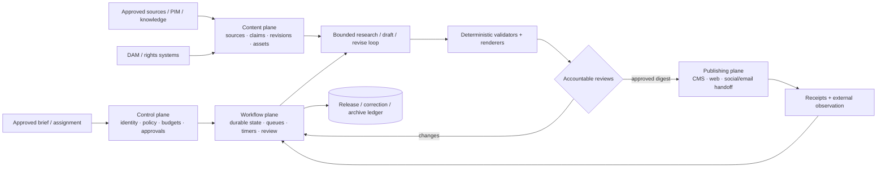
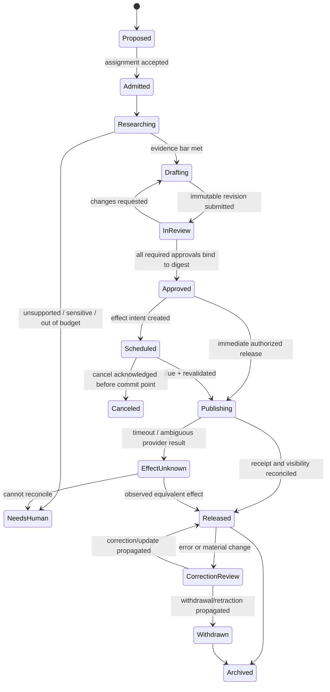

# Content Production and Editorial Operations Agent Blueprint

> **Status:** Research-backed 0→100 production blueprint
>
> **Research baseline:** 2026-08-31
>
> **Maturity:** Advisory architecture; publication, legal, rights, brand, and accessibility decisions require accountable owners
>
> **Evidence:** [Content and editorial agent research packet](../../research/packets/content-editorial-agent-blueprint.md)

This blueprint describes a bounded assistant that helps an editorial team turn an approved assignment into traceable, reviewable, channel-ready content. It preserves research-to-claim evidence, rights and asset context, structured content and redlines, review decisions, release receipts, and correction history. It is not an autonomous author of record, rights clearancer, lawyer, brand authority, accessibility certifier, or publisher.

The recommended production shape is a **deterministic editorial workflow with one bounded research/draft/revise loop**:

- deterministic services own assignment admission, schemas, identity, durable state, policy, rights evidence, approvals, schedules, effects, receipts, corrections, and audit;
- one model-directed loop may retrieve from approved sources, propose claim-linked outlines or patches, and revise against typed feedback within fixed budgets;
- render, link, schema, SEO, accessibility, similarity, and policy checks run as versioned tools with explicit limitations;
- accountable editors, subject-matter owners, legal/rights/brand/accessibility reviewers, and publishers retain their authorities.

The system of record is the **assignment–claim–revision–release ledger**, not a chat transcript, vector store, prompt, or CMS draft alone.

## What this category owns

| Owned object or transition | Meaning |
|---|---|
| Assignment truth | Purpose, accountable owner, audience, channel, brand/style, claims, deadlines, disclosure, risk, and authority constraints |
| Research-to-claim handoff | Source representation, locator, narrow claim, support/contradiction/limitation, freshness, and reviewer state |
| Draft lineage | Immutable structured revisions, authorship/tool provenance, redlines, comments, and accepted/rejected changes |
| Asset use | Stable asset and rendition references, rights evidence, transformations, attribution, consent/release references, and accessibility metadata |
| Review workflow | Editorial, subject, legal, rights, brand, accessibility, SEO, and product-data findings and approvals |
| Release handoff | Approved render digest, destinations, schedule intent, deterministic effect, provider receipt, observation, and reconciliation |
| Corrective history | Update, correction, withdrawal, retraction, tombstone, replacement, downstream acknowledgement, and archive lineage |

## Boundaries with adjacent categories

| Adjacent category | It owns | This category receives or returns |
|---|---|---|
| Marketing operations | Campaign objectives, populations, consent/eligibility, experiments, spend, delivery strategy, and outcomes | Receives approved assignment/channel contract; returns approved content payload and provenance |
| Investigative journalism | Protected sources, public-interest verification, hostile evidence acquisition, fairness, and newsroom publication judgment | Receives a claim/evidence package explicitly cleared for editorial use; never accesses protected-source identity |
| Localization | Translation, terminology, locale QA, and multilingual release parity | Sends frozen source revision and receives locale revision/status; does not declare parity itself |
| Document intelligence | OCR, layout, tables, handwriting, classification, and extraction | Receives extracted artifacts with confidence and lineage; owns downstream claims and edits |
| Product/data governance | Governed product facts, taxonomies, identifiers, safety/regulatory fields | Reads approved facts; returns narrative-field proposals and inconsistency findings |

Final legal claims, rights clearance, policy exceptions, brand exceptions, accessibility conformance, and publication authority remain accountable-human or deterministic-policy owned.

## Use an agent only when it earns its risk

Start with the simplest adequate system.

| Workload | Preferred implementation |
|---|---|
| Known fields, fixed phrasing, controlled product facts | Template plus deterministic rules |
| Standard article assembled from approved blocks | Structured content form and renderer |
| Proofing against explicit style rules | Linters and rule engine |
| Metadata normalization, link checks, schedules | Deterministic workflow |
| Source selection across an approved corpus, claim-linked synthesis, bounded revision | One tool-using model loop |
| Open-ended investigation, final legal review, rights clearance, brand exception, publication | Human specialist workflow, not autonomous agent work |

Do not add a model because a CMS exposes an AI button. Require a baseline study showing material improvement in reviewer time, coverage, or quality without unacceptable claim, rights, privacy, or effect risk.

## Reference architecture and four planes



| Plane | Owns | Forbidden shortcut |
|---|---|---|
| Control | identity, tenant, assignment, policy bundle, budgets, risk, approvals, capabilities | retrieved text granting authority |
| Content | sources, claims, revisions, assets, locators, rights evidence, renders | model summaries replacing source records |
| Workflow | state machine, events, leases, timers, cancellation, reconciliation, review routing | transcript as durable state |
| Publishing | destination adapters, operation keys, provider receipts, visibility observations, corrections | model holding broad live credentials |

## End-to-end lifecycle



`Approved` never means “published.” `Provider accepted` never means “visible.” `Canceled locally` never means “canceled remotely.” Each transition has a typed receipt.

## Learning path

| Order | Guide | Outcome |
|---:|---|---|
| 1 | [Mission, boundaries, workload fit, and authority](01-mission-boundaries-workload-fit-and-authority.md) | Qualify the work, choose no-agent alternatives, assign accountable authority, and set stop rules |
| 2 | [Reference architecture, runtime, and planes](02-reference-architecture-runtime-and-planes.md) | Select the smallest runtime and place control/content/workflow/publishing responsibilities |
| 3 | [Assignments, sources, claims, rights, and assets](03-assignments-sources-claims-rights-and-assets.md) | Build the evidence and rights spine without overclaiming provenance or clearance |
| 4 | [Structured content, revisions, redlines, and review](04-structured-content-revisions-redlines-and-review.md) | Preserve channel-neutral content, draft lineage, findings, and digest-bound approvals |
| 5 | [State, planning, context, memory, and compaction](05-state-planning-context-memory-and-compaction.md) | Run the bounded loop with seven memory lifetimes and safe continuity |
| 6 | [Integrations, approvals, effects, publishing, and corrections](06-integrations-approvals-effects-publishing-and-corrections.md) | Qualify adapters and implement exact schedule/effect/reconciliation/correction contracts |
| 7 | [Security, privacy, tenancy, brand, rights, and accessibility](07-security-privacy-tenancy-brand-rights-and-accessibility.md) | Enforce trust boundaries, data governance, and accountable policy decisions |
| 8 | [Evaluation, observability, testing, and failure injection](08-evaluation-observability-testing-and-failure-injection.md) | Measure claims, rights, style, accessibility, trajectories, and external outcomes |
| 9 | [Deployment, scaling, cost, incidents, and evolution](09-deployment-scaling-cost-incidents-and-evolution.md) | Operate queues, regions, HA/DR, incidents, behavior bundles, and controlled rollouts |
| 10 | [Zero-to-production stages, schemas, examples, and exercises](10-zero-to-production-stages-schemas-examples-and-exercises.md) | Deliver Stages 0–6 with measurable gates and practice the complete workflow |

## Non-negotiable invariants

1. Every run binds to a tenant, assignment version, policy bundle, schema, and accountable owner.
2. Claims, source representations, draft prose, style findings, and legal/editorial conclusions are separate objects.
3. Quotes, numbers, dates, names, regulated facts, product facts, and comparisons require locator-backed evidence or an explicit unresolved state.
4. A provenance credential, embedded metadata field, license label, similarity score, or model judgment never grants rights clearance.
5. Each content revision is immutable; a redline is a patch between named revisions, never an invisible mutation.
6. Review findings and approvals bind to a content/render digest, scope, channel, policy version, approver identity, and expiry/invalidation rules.
7. The model has no unmediated live-publish, delete, retraction, bulk-send, audience, or credential-management capability.
8. Untrusted source/CMS/DAM/PIM text remains data and cannot change policy, tools, destination, or authority.
9. Writes use preconditions; conflicts rebase through review rather than overwriting human changes.
10. Every external effect has a persisted intent, stable operation key, payload digest, approval reference, provider receipt, and observation state.
11. Unknown effect outcome is a first-class state. It is reconciled before any retry.
12. Corrections, withdrawals, and retractions preserve the original lineage and track every required downstream destination.
13. Raw prompts, unpublished content, licensed text, personal data, and secrets are excluded from default telemetry.
14. Behavior changes ship as versioned bundles with evaluation evidence, canaries, kill switches, and rollback.

## The smallest bounded loop

```text
INPUT: assignment_version, current_revision?, approved_sources, budgets

1. Compile least-privilege context from authoritative records.
2. Choose one action from {retrieve, propose_claims, propose_outline, propose_patch, stop}.
3. Execute only an allowlisted read/analysis tool.
4. Validate schema, locators, claim support, rights flags, and budget.
5. Persist proposals and evidence; never mutate the approved revision in place.
6. Stop on success, budget exhaustion, conflict, sensitive ambiguity, or escalation rule.
7. Submit an immutable revision or review question to an accountable person.
```

Recommended initial budgets: at most 8 model turns, 20 retrieval calls, 1 full draft, 3 revision patches, and no publication call. Tune only from evaluation and production traces.

## Mandatory stop and escalation rules

Stop model-directed work and route to the named owner when:

- assignment purpose, audience, authority, jurisdiction, channel, or disclosure policy is missing or contradictory;
- a material claim lacks adequate evidence, sources disagree, a quote/number cannot be located, or an official fact appears stale;
- the request asks for legal/medical/financial/product-safety conclusions outside an approved policy/template;
- copyright, license, model release, consent, privacy, trademark, confidential information, or AI-disclosure status is unclear;
- a protected source, public-interest investigation, or multilingual parity issue enters scope;
- a prompt-injection indicator, credential request, data exfiltration attempt, or cross-tenant reference appears;
- a human changes the assignment, revision, schedule, policy, or destination while the run is active;
- an approval is missing, expired, scoped to another digest/channel, or invalidated;
- a publish/cancel/delete/correction result is unknown or downstream state diverges;
- an already released item may cause material harm or contains a material error.

## Stage 0–6 at a glance

| Stage | Capability | Publication authority | Exit signal |
|---:|---|---|---|
| 0 | Manual/template baseline and risk inventory | Human only | Baseline quality, time, failure, and cost measured |
| 1 | Offline read-only research/outline assistant on frozen corpus | None | Claim/citation and injection gates pass |
| 2 | Sandbox structured drafts, redlines, assets, and human review | Sandbox draft only | Reviewer-time gain without unsafe quality loss |
| 3 | Durable workflow, full memory contracts, adapters, approvals, reconciliation | Non-production or shadow effects | Crash/retry/cancel/unknown-outcome tests pass |
| 4 | Tenant production for bounded low-risk content | Deterministic executor after human approval | SLOs, audits, incident drills, and rollback proven |
| 5 | More channels/types via evidence-backed policy | Risk-tiered, still accountable | Each expansion passes local eval and adapter gates |
| 6 | Governed optimization and controlled failure mining | Unchanged authority boundary | Bundle canaries, drift controls, and rollback remain healthy |

Full entry/exit gates are in [the staged delivery guide](10-zero-to-production-stages-schemas-examples-and-exercises.md).

## Representative workflows

### Evidence-backed article

An editor admits a brief, the loop searches an approved corpus, creates atomic claims with locators, proposes an outline and structured revision, and routes legal/brand/accessibility review. A deterministic renderer creates the web representation. The publisher approves that digest; the executor publishes with a version precondition and reconciles the canonical URL. A later factual error creates a correction case linked to affected claims and destinations.

### Product description

The adapter reads a product UUID and channel-scoped facts from the PIM. Governed attributes are locked. The assistant proposes only allowed narrative fields and alt text for an approved asset rendition. Product-data, rights, brand, and accessibility checks run before a draft is returned to the PIM proposal workflow. The assistant never invents specifications, price, safety claims, or warranty terms.

### Help-center article

The assignment binds to a released product version and support policy. The loop builds steps from approved documentation, labels prerequisites and destructive operations, and records every command/example source. Render tests verify links, headings, code blocks, and accessible names. Publication is blocked if the product version changed or the support owner has not approved the exact revision.

Worked schemas and traces appear in [guide 10](10-zero-to-production-stages-schemas-examples-and-exercises.md).

## Success metrics

Optimize for governed outcomes, not words generated:

- material-claim support precision and recall;
- citation/locator correctness and stale-source rate;
- invented quote/number/name/product-fact rate;
- unsafe rights-clearance false-positive rate;
- style/brand finding precision and reviewer override rate;
- accessibility defect escape rate by severity;
- reviewer active minutes and time-to-approved revision;
- approval invalidation correctness;
- duplicate/unknown publication effects and reconciliation time;
- correction propagation completion and time;
- cost per approved and released item, not per model call.

## Quick production checklist

- [ ] A deterministic/template baseline is measured and insufficient.
- [ ] Assignment, schema, policy, claims, revision, approval, and release contracts are versioned.
- [ ] Publication credentials are outside the model boundary.
- [ ] All seven memory lifetimes have provenance, rights, retention, correction, deletion, and poisoning controls.
- [ ] Compaction emits and validates a typed continuity receipt.
- [ ] CMS/DAM/PIM/search/accessibility/rights/model/social/email adapters are qualified against real tenant semantics.
- [ ] Precondition conflict, timeout-after-commit, duplicate webhook, cancellation race, partial release, and correction propagation are tested.
- [ ] Claim, rights, brand/style, accessibility, security, trajectory, and render evaluations have measurable gates.
- [ ] Traces, metrics, audit evidence, SLOs, on-call ownership, erroneous-publication runbook, HA/DR, and recovery-load tests exist.
- [ ] Behavior bundles can shadow, canary, roll back, and detect source/style/provider drift.
