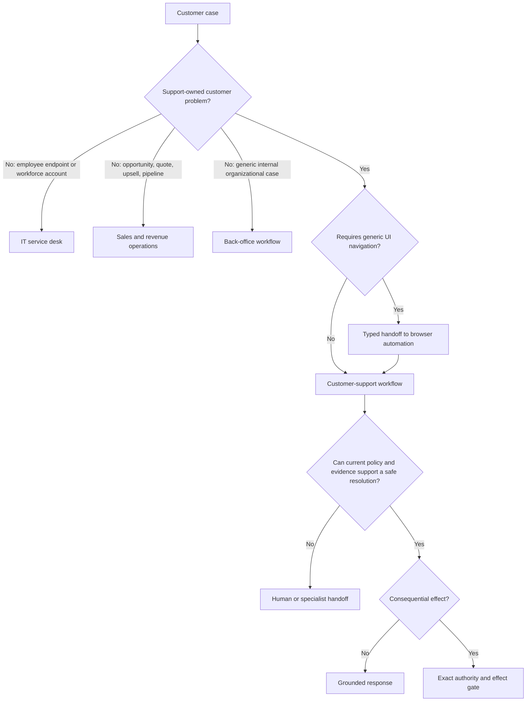

# Scope, Workload Fit, and Authority

**Status:** Research-backed Pass-1 draft  
**Research current through:** 2026-08-31  
**Prerequisite:** [Blueprint overview](README.md)

The first design question is not which model to use. It is whether the workload contains bounded ambiguity that benefits from model-directed reasoning and whether the surrounding application can contain that reasoning. Customer support is a family of workloads with different identity, evidence, latency, and effect risks. Treating all tickets as one autonomous task creates unsafe authority and weak evaluation.

## Workload decomposition

Decompose the queue before selecting autonomy:

| Workload | Ambiguity | Effect risk | Recommended starting implementation |
|---|---:|---:|---|
| Order, refund, or shipment status | Low | Low disclosure risk after identity | Deterministic lookup and template |
| Known incident communication | Low | Low to medium | Status-rule matcher and approved notice |
| FAQ or policy explanation | Medium | Low if public, higher if account-specific | Access-filtered retrieval plus cited draft |
| Product troubleshooting | Medium to high | Low until configuration or account effects | Bounded diagnostic agent with safe step catalog |
| Policy exception request | High | High | Agent prepares evidence and proposal; human decides |
| Policy-qualified refund or credit | Medium | High | Deterministic eligibility and exact effect gate; model explains |
| Subscription or order cancellation | Medium | High and sometimes irreversible | Deterministic preview, customer confirmation, authority gate, provider verification |
| Fraud, abuse, safety, legal threat, or regulated complaint | High | Very high | Immediate specialist route with minimum safe acknowledgment |
| Bulk incident compensation | Low reasoning, massive blast radius | Critical | Dedicated batch workflow with executive/risk controls; not this agent |

The model is appropriate for interpreting the customer's description, deciding which safe question to ask next, assembling evidence, and expressing the resolution. Eligibility formulas, monetary arithmetic, refund caps, effective dates, identity strength, customer ownership, queue priority, and commit authorization belong in deterministic services.

## Deterministic baseline

Build the best non-agent path first:

1. authenticate the customer or provide only public information;
2. classify with rules or a conventional classifier when the taxonomy is stable;
3. offer fixed self-service flows and approved macros;
4. query exact provider state for status questions;
5. compute policy eligibility and SLA deadlines deterministically;
6. route exceptions to a human queue.

Measure containment, verified resolution, repeat contact, error rate, latency, and cost. Add the agent only to slices where adaptive evidence gathering or explanation improves outcomes without weakening controls. Do not claim success because the agent answers more tickets; compare verified postconditions and downstream contacts.

## Capability boundary



The support case remains owned by this workflow when a typed downstream capability performs a bounded sub-operation. For example, browser automation may read a legacy return status, but it does not decide refund eligibility; a back-office system may fulfill a replacement, but it does not own the customer conversation or close the support case.

## Authority classes

Use the repository-wide D0–D4 model and declare every tool operation, not merely every tool, because one provider connector may expose both reads and irreversible writes.

| Class | Definition in this blueprint | Examples | Enforcement |
|---|---|---|---|
| D0 | No production customer data or effects | Synthetic case generation, fixture replay, offline grading | Isolated credentials and data |
| D1 | Authorized read of production state | Read case, account tier, order, invoice, article, incident, effect status | Tenant-bound broker, field filtering, access audit |
| D2 | Bounded reversible preparation | Draft reply, add internal note, propose route, create effect preview, request information | Typed schema, budgets, case version check, audit |
| D3 | Consequential disclosure, communication, commitment, or state change | Refund, credit, cancellation, entitlement change, address/order change, binding exception promise | Exact authorization digest, current policy/state, stable intent, receipt, reconciliation |
| D4 | Authority or system-control mutation | Change policy/caps, grant scopes, bulk effects, disable audit, approve own exception | Proposal-only workflow or prohibition |

A normal customer message can be D2 when it contains no sensitive disclosure or binding commitment and follows approved channel policy. It becomes D3 when it reveals protected account facts, commits the organization, changes customer behavior materially, or is sent at scale. Classify by consequence, not by API verb.

## Separate identity, intent, eligibility, and authority

Four facts are often incorrectly collapsed:

| Question | Authoritative owner | Example failure if confused |
|---|---|---|
| Who is participating? | Identity and channel-binding service | Email possession is accepted as sufficient proof for a high-value refund |
| What does the customer want? | Case record plus explicit confirmation | Sentiment is interpreted as a cancellation request |
| Is the request eligible? | Versioned deterministic policy decision | A model paraphrase invents an exception |
| Who may commit it? | Organizational authority service | Customer confirmation is treated as internal approval |

For each D3 operation, record all four independently. Re-authentication or step-up may be required when the action's risk exceeds the original session strength. An authenticated customer still may not own the referenced order or tenant. A policy-qualified action still may exceed the agent's financial or geographic grant.

## Authority grant contract

```yaml
authority_grant:
  grant_id: "grant_..."
  tenant_id: "tenant_..."
  actor_type: "support_workflow"
  effect_type: "refund"
  allowed_provider_account: "acct_..."
  max_amount_minor: 5000
  currency: "USD"
  allowed_reason_codes: ["duplicate_charge", "service_failure"]
  required_identity_level: "step_up_1"
  required_customer_confirmation: true
  policy_version: "refund-policy-2026-08-15"
  valid_from: "2026-08-15T00:00:00Z"
  expires_at: "2026-09-15T00:00:00Z"
  max_effects_per_case: 1
  approver_rule: "deterministic_pre_authorization"
```

This is illustrative, not a universal schema or recommended threshold. Production grants should be derived from the organization's policy and risk analysis. The commit gate must compare the grant to the exact effect and current case, customer, tenant, provider, currency, amount, reason, policy, and time.

## Decision table for requested actions

| Condition | Answer only | Ask customer | Human route | Effect gate |
|---|---:|---:|---:|---:|
| Public question; no account fact needed | Yes | Optional clarification | No | No |
| Account-specific request; identity insufficient | No protected disclosure | Yes, through approved step-up | If step-up unavailable | No |
| Evidence missing or materially conflicting | No definitive claim | Ask for safe evidence if appropriate | Yes when deadline or risk requires | No |
| Safe troubleshooting catalog has a next step | Explain step | Yes | On stop condition or exhausted budget | Only if step changes account state |
| Eligible D3 action within deterministic grant | Preview | Obtain exact confirmation if required | Not necessarily | Yes |
| Action exceeds grant or requests exception | Explain review process without promising outcome | Clarify exact request | Yes | No until separate approval |
| Provider result is unknown after commit attempt | Report that verification is in progress | Avoid asking customer to retry | Escalate by age/risk | Reconcile existing intent; never create a new one blindly |
| Fraud, safety, legal, or regulated marker | Minimum safe acknowledgment | Do not investigate beyond approved intake | Specialist immediately | Freeze ordinary effects unless specialist authorizes |

## Safe troubleshooting envelope

A diagnostic step catalog must state:

- the product, version, platform, and preconditions it applies to;
- evidence required before suggesting it;
- customer-visible impact and reversibility;
- data-loss, safety, security, accessibility, and billing risks;
- whether it changes account or device state;
- confirmation or authorization required;
- success observation, timeout, and rollback or recovery;
- stop conditions and escalation destination;
- content owner, review date, and source version.

Do not let the model improvise commands, tell a customer to disable security controls, request secrets, erase data without an approved backup/recovery path, or repeat a failed step without new evidence. Consumer-facing product troubleshooting belongs here; remote administration of employee endpoints belongs to the IT service desk.

## Non-goals and prohibited patterns

- A universal support bot with access to every customer and business system.
- A model-as-policy-engine that calculates eligibility or invents exceptions.
- Retrieval over an unversioned corpus with no access filter or effective date.
- Free-form provider calls, raw credentials in model context, or direct write-capable generic MCP access.
- Treating customer frustration or sentiment as proof, priority entitlement, fraud evidence, or consent.
- Closing cases because the model said “resolved” without provider and delivery postconditions.
- Training or persistent memory directly from raw tickets without purpose, consent, review, retention, and deletion controls.
- Using deflection, automation rate, average handle time, or CSAT as the sole optimization target.
- Hiding an uncertain financial effect by retrying with a new idempotency key.
- Multi-agent role simulation merely to mimic a support organization.

## Failure modes at the boundary

| Failure | Detection | Safe response |
|---|---|---|
| Employee case enters customer queue | Identity realm, tenant type, endpoint/tool request | Route to IT service desk with minimal approved context |
| Sales request disguised as support | Opportunity, quote, expansion, or procurement intent | Route to sales; do not mutate CRM opportunities |
| Campaign or bulk promotion enters support | Audience, campaign, acquisition, attribution, or many-recipient intent | Route to marketing operations; do not export cases/contacts or send promotional messages |
| Generic internal fulfillment expands recursively | Case task graph leaves customer-resolution contract | Typed back-office handoff; retain only support outcome tracking |
| Legacy UI becomes the workflow | Tool trace contains unconstrained navigation or credential prompts | Stop and replace with browser-owned typed adapter or human process |
| Model promises an exception | Response-claim checker finds no policy/approval evidence | Block message, explain review, route for approval |
| Sentiment drives an entitlement | Policy decision input includes sentiment score | Reject decision and record control violation |

## Stage 0 exit gate

Before any production tool use:

- [ ] Queues are decomposed by ambiguity, identity, evidence, effect, and regulatory risk.
- [ ] The deterministic baseline and escalation path are measured.
- [ ] Ownership exclusions are reflected in routing rules and tool availability.
- [ ] D0–D4 classifications exist at operation level.
- [ ] Identity, intent, eligibility, and organizational authority are separate records.
- [ ] Every supported troubleshooting step has a reviewed safety envelope.
- [ ] Every unsupported or high-risk case has a warm-handoff destination.
- [ ] Success means verified customer outcome, not response generation or deflection alone.

## Related guides

- [Reference architecture, runtime, and integrations](02-reference-architecture-runtime-and-integrations.md)
- [Actions, approvals, effects, and reconciliation](05-actions-approvals-effects-and-reconciliation.md)
- [Security, privacy, tenancy, and abuse resistance](07-security-privacy-tenancy-and-abuse-resistance.md)
- [Execution boundaries](../../runtime/execution-boundaries.md)
- [Tool contracts](../../tools/tool-contracts.md)
