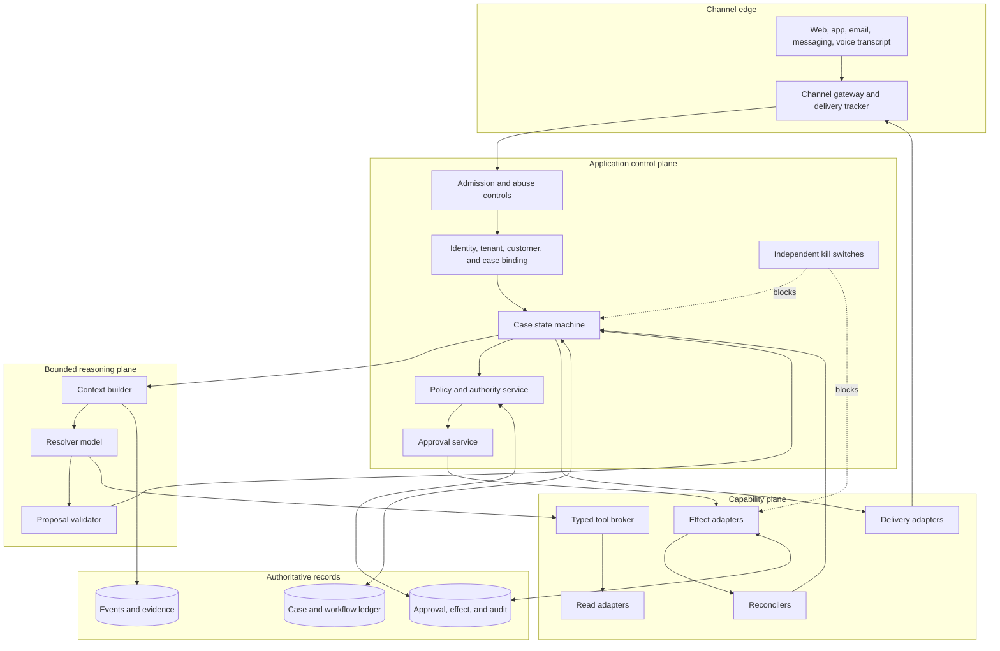
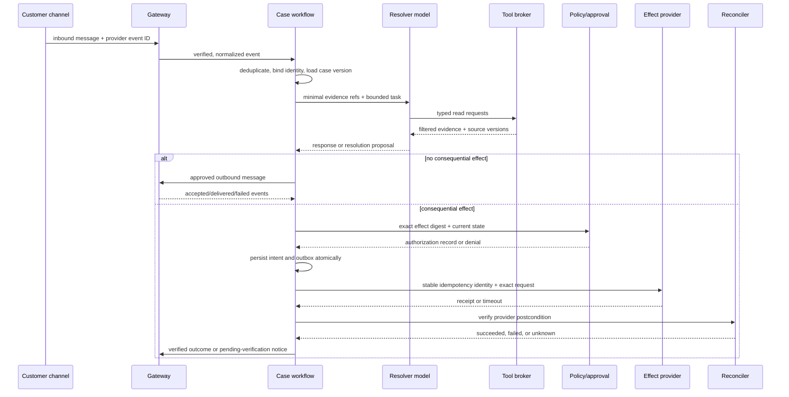

# Reference Architecture, Runtime, and Integrations

**Status:** Research-backed Pass-1 draft  
**Research current through:** 2026-08-31  
**Prerequisites:** [Blueprint overview](README.md), [scope and authority](01-scope-workload-fit-and-authority.md)

The recommended architecture is hybrid: a deterministic application state machine controls the case, while one bounded resolver model chooses among read tools, safe diagnostic steps, and structured proposals. This is simpler to reason about than a team of simulated agents and safer than exposing external systems directly to a model loop.

## Selected architecture



### Why one resolver

Start with one resolver because support subproblems share the same case, evidence, and authority boundary. Adding separate “triage,” “policy,” “sentiment,” and “refund” agents creates extra prompts, handoffs, state copies, approval surfaces, and traces without granting real organizational authority. Add a specialist model only after evaluations show a material capability or isolation benefit that a typed tool or deterministic service cannot provide. If added, the application remains the orchestrator and passes a bounded handoff schema; specialists never delegate D3 authority to one another.

### Framework choice

| Option | Use when | Avoid when |
|---|---|---|
| Custom state machine plus model API | The workflow and effect semantics are straightforward; tight audit and minimal dependencies matter | The team would recreate complex durable timers, signals, and replay poorly |
| Agent SDK inside the case workflow | Typed tools, resumable approval mechanisms, traces, or standardized model-loop controls reduce implementation effort | SDK state or guardrails would be mistaken for identity, policy, durable business state, or effect authorization |
| Durable workflow engine plus model SDK | Cases wait hours or days for customers, callbacks, approvals, and provider completion; crash recovery and versioning justify it | The first release is read-only, short-lived, and a database/queue/state machine is sufficient |

The selected design is hybrid, not framework-dependent. A model provider's conversation state, compaction, approval node, tracing, or MCP integration can implement a piece of the system, but the application keeps authoritative case, policy, identity, approval, and effect records. Choose and pin candidate model snapshots through evaluation; do not encode the blueprint around a mutable “latest” alias.

## Runtime and language selection

Use the language already operated by the service team unless a required provider SDK or workflow runtime makes another choice materially safer. The runtime must support:

- strict request and response schema validation;
- cancellation, deadlines, connection pools, and bounded concurrency;
- transactional writes or an outbox for case/effect events;
- cryptographic webhook verification using the provider's maintained library where possible;
- provider SDK version pinning and repeatable builds;
- OpenTelemetry-compatible structured telemetry with content capture off by default;
- worker health, graceful drain, retry scheduling, and queue backpressure;
- deterministic money, time-zone, business-calendar, locale, and Unicode handling.

Do not introduce a second language only to call a model. See [choosing an agent runtime language](../../languages/choosing-an-agent-runtime-language.md) for the repository-wide decision process.

## Request lifecycle



Every arrow crossing a service boundary has a timeout, retry owner, correlation key, privacy classification, and recovery path. The model call can be replayed to produce a proposal; the effect commit cannot be recreated from model text.

## Component responsibilities

| Component | Owns | Must not own |
|---|---|---|
| Channel gateway | Signature validation, event deduplication, normalization, delivery state, channel policy | Customer identity proof by itself |
| Identity binder | Session assurance, customer/account/tenant ownership, step-up result | Case eligibility or organizational approval |
| Case workflow | Valid transitions, deadlines, budgets, waits, cancellation, handoff, closure | Free-form interpretation of customer language |
| Context builder | Minimum evidence selection, access filtering, version/freshness labels, token budget | Authoritative state mutation |
| Resolver model | Intent hypotheses, next safe question, evidence requests, diagnosis proposal, grounded response draft | Identity, policy, authority, monetary calculation, effect commit |
| Tool broker | Schema validation, tenant binding, field filtering, deadlines, rate limits, operation registry | Broad provider credentials in the model process |
| Policy service | Versioned deterministic eligibility and required controls | Natural-language exception invention |
| Approval service | Exact approver/grant decision and expiry | Provider outcome verification |
| Effect worker | Commit of one exact authorized intent | Replanning, changing amounts, or approval substitution |
| Reconciler | Read-after-write/provider event verification and unknown-outcome aging | Starting a different effect to “fix” uncertainty |
| Audit plane | Unsampled identity, policy, approval, effect, and state-transition evidence | Raw full prompts by default |

## Typed connector contract

Each operation is separately registered and versioned.

```yaml
connector_operation:
  name: "billing.refund.create"
  version: "2026-08-01"
  authority_class: "D3"
  provider_api_version: "pinned-provider-version"
  identity_inputs: ["tenant_id", "customer_id", "provider_account_id"]
  request_schema: "refund_create_v3"
  response_schema: "refund_receipt_v2"
  credential_scope: "refund:create on one provider account"
  timeout_ms: 8000
  retry_policy: "reconcile_before_retry"
  idempotency:
    key_field: "effect_intent_id"
    provider_support: "verified during connector certification"
  concurrency_control: "current provider object version or explicit precondition"
  webhook:
    signature_verifier: "provider-maintained implementation"
    duplicate_and_reorder_tolerant: true
  reconciliation:
    lookup: "billing.refund.get"
    terminal_states: ["succeeded", "failed", "canceled"]
    unknown_age_route: "payments-operations"
  privacy:
    allowed_fields: ["amount_minor", "currency", "reason_code", "receipt_id", "status"]
    prohibited_from_model: ["payment_credential", "full_card_number", "provider_secret"]
```

The example fields are a checklist, not claims that every provider implements the same semantics. Certification must document whether idempotency covers validation failures, how long keys remain valid, which response wins, whether asynchronous jobs are returned, how state is fetched, and what cancel or compensation means.

## Integration map

| Integration | Minimum operations | Important boundary or failure mode |
|---|---|---|
| Support platform | Read/create/update case, comments, audits, assignee, tags, SLA events | Use optimistic concurrency; platform callbacks may duplicate, lag, or reorder |
| Customer and identity | Bind session, fetch permitted profile, verify account ownership, request step-up | Channel address and case history are not authenticators |
| Policy service | Evaluate exact facts against a version; return decision and obligations | Retrieval is not policy execution; retain historical version |
| Knowledge platform | Permission-filtered search and fetch with locale/version/effective date | Draft, stale, inaccessible, or contradictory articles cannot silently win |
| Product telemetry/status | Fetch tenant-safe health, known incident, feature/config state | Do not expose other tenants or raw internal telemetry |
| Commerce/order | Read order/fulfillment; create bounded replacement or return request | Inventory and merchandising remain another domain; async jobs need reconciliation |
| Billing/subscription | Read invoice/subscription; refund/credit/cancel through dedicated adapters | Provider-specific proration, pending, failure, and irreversibility semantics |
| Communications | Send message, record provider message ID, consume delivery events | “Accepted” or “sent” does not universally mean delivered or read |
| Human workforce | Queue, skills, availability, handoff, response, ownership | Preserve one case identity and avoid concurrent conflicting actions |
| Observability and audit | Metrics, traces, control records, privacy-safe evidence refs | Trace context is correlation, not identity; content off by default |

This map is a design inventory, not connector certification. Each row expands into separate read, write, event, delivery and reconciliation capabilities with their own principal, fields, API/schema version, quota and outage behavior. Follow [integration qualification and provider semantics](09-integration-qualification-and-provider-semantics.md) before enabling a real tenant.

Use this authority order when a support case spans systems:

| Question | Owning truth |
|---|---|
| Who is authenticated and which account/object may they use? | Identity/customer-account service and current assurance binding |
| What is the case state and who owns the next action? | Support platform plus explicit workflow projection/version mapping |
| What policy applies and what is allowed? | Versioned deterministic policy decision and its source facts |
| Is the product/tenant affected? | Tenant-safe product telemetry or incident scope; public status is supporting evidence |
| What happened to an order, shipment, subscription or payment? | Current provider object and related async-job/event state |
| Did an outbound notice reach the channel? | Channel provider's highest observable delivery state |
| Did a refund/cancel/credit/entitlement effect occur? | Exact provider postcondition plus reconciliation record |

Preserve conflicts instead of picking the newest timestamp. Different systems use different clocks and meanings; a later ticket comment cannot overturn a provider refund object, and a public status-page “resolved” label cannot prove the bound tenant recovered.

## API, browser, and MCP choices

Prefer stable provider APIs and signed event callbacks. When a provider has only a UI, define a typed support operation and delegate its implementation to the browser-automation capability. That adapter receives an exact operation and constrained account, returns structured observations and evidence, and cannot decide policy or case outcome.

MCP can standardize discovery and invocation, especially for read-only private knowledge or local tools. Treat server metadata and tool annotations as hints, not authorization. Put an application broker in front of all servers, pin the allowed server/operation versions, filter results, and require the same tenant, policy, approval, receipt, and reconciliation controls. Do not expose broad write-capable third-party MCP servers directly to the resolver for D3 actions.

## Context and model-call contract

```json
{
  "task": "diagnose_or_propose_resolution",
  "case_ref": {"id": "case_123", "version": 17},
  "identity": {"tenant_id": "t_1", "customer_id": "c_9", "assurance": "authenticated"},
  "channel": {"type": "messaging", "locale": "en-IN", "delivery_constraints": ["no_sensitive_attachment"]},
  "evidence_refs": [
    {"id": "ev_policy_4", "kind": "policy", "version": "2026-08-15", "effective_at": "2026-08-31T09:00:00Z"}
  ],
  "working_state": {"goal": "resolve duplicate charge", "open_questions": ["which charge"]},
  "allowed_operations": ["case.read", "billing.charge.list", "knowledge.search", "resolution.propose"],
  "budgets": {"max_model_turns": 6, "max_tool_calls": 10, "deadline_ms": 25000},
  "stops": ["identity_conflict", "policy_conflict", "unsupported_domain", "authority_required"]
}
```

The contract carries references rather than whole histories when possible. Provider-managed conversation history is an optimization; retention and billing semantics vary, and it is not the case ledger. Model outputs must validate against a discriminated schema such as `ask_question`, `send_grounded_reply`, `propose_route`, `propose_effect`, or `stop`.

## Operational failure boundaries

| Boundary | Failure | Owner | Safe behavior |
|---|---|---|---|
| Channel → gateway | Invalid signature or replay | Gateway | Reject/quarantine; no case mutation |
| Gateway → workflow | Duplicate event | Workflow | Deduplicate by provider and normalized event IDs |
| Workflow → model | Timeout or invalid output | Workflow | Retry only within budget or use deterministic fallback/handoff |
| Model → tool | Unauthorized field or operation | Broker | Deny, audit, and continue only if safe |
| Broker → provider read | Rate limit or stale response | Connector | Honor backoff; label freshness; route if deadline at risk |
| Workflow → effect | Crash around commit | Effect ledger/reconciler | Recover existing intent; never infer non-application from timeout |
| Workflow → channel | Acceptance without delivery | Delivery tracker | Keep case in verification/wait state; alternate channel only under policy |

## Stage 1–2 architecture exit gate

- [ ] The deterministic case workflow, model boundary, and external connectors have named owners.
- [ ] Model output is structured, schema-validated, and cannot commit effects.
- [ ] Tool operations are versioned, tenant-bound, least-privileged, timed out, and authority-classified.
- [ ] Read and write credentials are separated; D3 uses dedicated adapters.
- [ ] Case, workflow, provider, and delivery truth are distinguished.
- [ ] The first release has one resolver and a hard model/tool/time/cost budget.
- [ ] Provider-specific idempotency, webhook, async-job, and reconciliation semantics are certified.
- [ ] Helpdesk, identity, knowledge/status, channel/voice, commerce/shipment, and billing capabilities are separately declared, tested, dated, and expiring.
- [ ] API-first and browser/MCP boundaries preserve support ownership without importing generic automation.
- [ ] The runtime can drain, cancel, backpressure, audit, and recover.

## Related guides

- [Authenticated intake, case state, and channel continuity](03-authenticated-intake-case-state-and-channel-continuity.md)
- [Grounded resolution, context, memory, and planning](04-grounded-resolution-context-memory-and-planning.md)
- [Actions, approvals, effects, and reconciliation](05-actions-approvals-effects-and-reconciliation.md)
- [Durable execution](../../runtime/durable-execution.md)
- [Model Context Protocol](../../protocols/model-context-protocol.md)
- [Tool registries, versioning, and lifecycle](../../tools/tool-registries-versioning-and-lifecycle.md)
