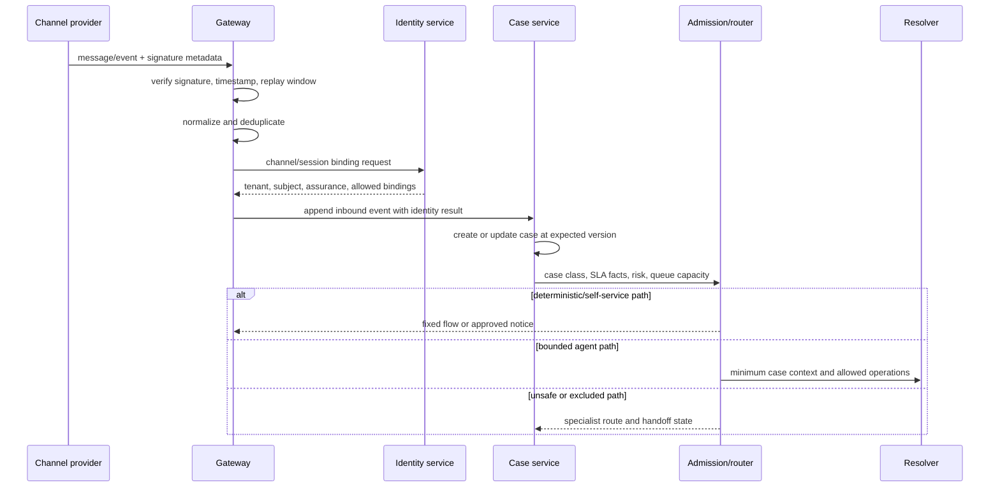
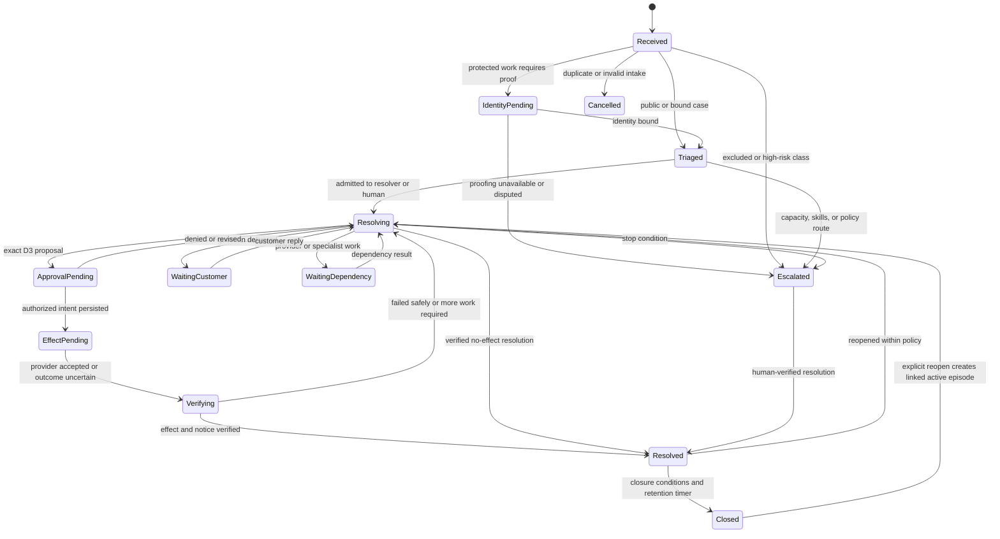

# Authenticated Intake, Case State, and Channel Continuity

**Status:** Research-backed Pass-1 draft  
**Research current through:** 2026-08-31  
**Prerequisite:** [Reference architecture, runtime, and integrations](02-reference-architecture-runtime-and-integrations.md)

A support conversation is not a customer identity, a message sequence is not a case ledger, and a provider webhook is not exactly-once truth. The intake layer must establish what it knows about the participant, bind authorized objects, normalize channel events, and make every transition concurrency-safe before a model sees account-specific evidence.

## Identity model

Keep these identifiers distinct:

- `tenant_id`: the organization or data boundary under which policy, credentials, and records are selected;
- `customer_id`: the person or legal customer represented by the identity system;
- `account_id`: the product, household, workspace, or commercial account under support;
- `subject_id`: the authenticated identity-session subject;
- `channel_address_id`: email address, phone number, device, social handle, or messaging participant;
- `case_id`: the support record;
- `conversation_id`: one channel thread or interaction associated with a case;
- `provider_object_id`: order, subscription, invoice, shipment, entitlement, or refund under discussion.

Do not derive one identifier from another without a versioned, audited binding. An address may be shared, forwarded, recycled, compromised, or changed. A customer may legitimately manage several accounts; an account may have several authorized users.

## Assurance and disclosure matrix

Exact assurance names and actions are organization-specific, but the control shape should be explicit:

| Session state | Permitted response | Prohibited response | Next step |
|---|---|---|---|
| Anonymous | Public product information, general troubleshooting with no account inference | Confirming whether an account/order exists; protected case detail | Offer sign-in or approved proofing route |
| Channel-bound, not authenticated | Acknowledge receipt and repeat customer-provided facts cautiously | Treat sender address/caller ID as account ownership | Link to authenticated session or human proofing |
| Authenticated customer | Account facts within current grant and field policy | Facts from an unbound account, tenant, or another person | Bind each referenced object |
| Authenticated with step-up | Exact high-risk disclosure/action permitted by policy | Actions outside ownership or organizational authority | Re-check freshness at effect commit |
| Recovery or identity dispute | Minimum process guidance | Revealing account facts that help an attacker; ordinary effects | Identity specialist flow; freeze risky operations |

NIST's digital identity guidance treats authentication, account recovery, and session management as distinct controls and highlights social-engineering risk in customer-service interactions. Use the organization's identity service for proofing and recovery; the support model must not invent knowledge-based authentication questions or decide that conversational familiarity proves identity.

## Intake pipeline



Verify channel signatures against the raw request body and provider-prescribed algorithm before parsing or mutation. Enforce a replay window where the provider protocol supports it. Store a digest or secure evidence reference, not an unnecessary duplicate of sensitive raw payloads.

## Authoritative case model

The support platform should remain the business system of record for case ownership, public comments, and the canonical customer-service lifecycle when it can express the required states. A local workflow record adds execution state, approvals, timers, budgets, effects, and reconciliation. Define the mapping rather than letting two systems silently compete.

```yaml
case_record:
  case_id: "case_..."
  tenant_id: "tenant_..."
  customer_binding:
    customer_id: "customer_..."
    account_ids: ["account_..."]
    subject_id: "subject_..."
    assurance: "authenticated"
    verified_at: "2026-08-31T10:00:00Z"
    expires_at: "2026-08-31T10:30:00Z"
  state: "resolving"
  state_reason: "awaiting_charge_evidence"
  version: 18
  owner: {"type": "agent_workflow", "id": "support_resolver_v4"}
  queue: "billing-support"
  priority: "high"
  sla:
    policy_version: "sla-2026-07"
    first_response_due_at: "2026-08-31T10:10:00Z"
    next_action_due_at: "2026-08-31T10:20:00Z"
    resolution_target_at: "2026-09-01T10:00:00Z"
  conversations: ["conv_web_1", "conv_email_2"]
  active_effect_ids: ["effect_7"]
  policy_snapshot_refs: ["evidence_policy_9"]
  created_at: "2026-08-31T09:55:00Z"
  updated_at: "2026-08-31T10:03:00Z"
```

Do not place the whole transcript, model summary, or provider secrets in this row. Store immutable event/evidence references and derive views.

## Customer, product, and provider truth

Bind what the case is *about* as deliberately as who opened it:

```yaml
case_subject_binding:
  case_id: "case_123"
  tenant_id: "tenant_1"
  customer_id: "customer_9"
  account_id: "account_5"
  product_instance_id: "workspace_44"
  product: "mobile-app"
  product_version: "8.14.2"
  platform: "android-16"
  provider_objects:
    order_id: null
    subscription_id: "sub_55"
    invoice_ids: ["inv_77"]
  binding_evidence_refs: ["identity://binding_8", "provider://subscription/sub_55/v31"]
  verified_at: "2026-08-31T10:01:00Z"
  fresh_until: "2026-08-31T10:06:00Z"
```

The customer statement establishes reported intent and symptoms. The identity/account service establishes authorized ownership. Product configuration/telemetry establishes the observed instance/version. Commerce, carrier, subscription and billing providers establish their own current object states. Policy establishes what can be disclosed or changed. The support case records the service lifecycle. Keep these sources separate and retain conflicts.

Examples:

- “I was charged twice” opens a duplicate-charge hypothesis; it does not establish two settled charges.
- A tracking page saying “delivered” is a carrier/platform observation, not proof the authenticated customer received the package.
- A transcript saying “cancel today” is customer-intent evidence only after participant binding; it is not provider cancellation state.
- A support comment saying “refund complete” cannot override a provider refund that remains pending or failed.
- A public incident can explain symptoms but must be checked against affected product, region, tenant and time before claiming applicability.

Rebind and refresh whenever the customer changes the object, a session assurance expires, a product/version changes, a provider revision advances or a human corrects the case subject. Never carry one customer's provider object into another case through semantic similarity.

## Case state machine



Transitions are commands checked against current version, ownership, identity, active effects, delivery state, approvals, and deadlines. A model can propose `waiting_customer` or `escalated`; the workflow decides. “Solved” and “closed” meanings vary by support platform, so maintain a versioned mapping and test provider changes.

## Event envelope

```json
{
  "event_id": "evt_01K...",
  "schema_version": 3,
  "event_type": "customer.message.received",
  "tenant_id": "tenant_1",
  "case_id": "case_123",
  "conversation_id": "conv_sms_9",
  "customer_id": "customer_4",
  "producer": "twilio-gateway-v5",
  "source_event_id": "provider_event_77",
  "source_object_version": "42",
  "case_expected_version": 17,
  "occurred_at": "2026-08-31T09:59:55Z",
  "ingested_at": "2026-08-31T10:00:01Z",
  "idempotency_key": "twilio:provider_event_77",
  "trace_id": "trace-correlation-only",
  "classification": ["customer_content", "restricted"],
  "payload_ref": "evidence://message/sha256/..."
}
```

Rules:

- `event_id` is generated once and stable across retries; `source_event_id` deduplicates provider delivery.
- Consumers persist their processed event/result atomically where possible and remain safe on replay.
- `occurred_at` describes the provider observation; `ingested_at` supports lag and ordering analysis.
- Event time does not establish case version order. Apply state-changing events through explicit version and transition rules.
- A trace ID correlates diagnostics but grants no access and must not contain personal data.
- Schema evolution is backward-compatible during a defined migration window; unknown event types quarantine rather than mutate state.

## Optimistic concurrency and ownership

At least four actors may race: the customer on another channel, a human agent, the model workflow, and a provider callback. Use conditional writes (`expected_case_version`) and an explicit ownership lease or assignment model. On conflict:

1. reject the stale transition;
2. reload authoritative case, approval, effect, and provider state;
3. recompute the next safe action;
4. suppress any draft based on stale evidence;
5. route if concurrent ownership cannot be resolved safely.

Do not solve concurrency with “last write wins.” A late bot draft must not overwrite a human's resolution, and a human retry must not duplicate a refund already committed by a worker.

## Channel continuity

One case can have several conversations. Preserve channel provenance and do not assume the customer sees every channel.

```yaml
conversation_binding:
  conversation_id: "conv_..."
  case_id: "case_..."
  channel: "whatsapp"
  provider_thread_id: "provider_..."
  channel_address_id: "address_..."
  identity_binding_id: "binding_..."
  locale: "en-IN"
  accessibility_needs_ref: "preference://..."
  consent_scope: ["service_messages"]
  started_at: "2026-08-31T09:55:00Z"
  last_inbound_at: "2026-08-31T10:00:00Z"
  last_delivery_state: "delivered"
  last_delivery_evidence_ref: "delivery://..."
```

When switching channel:

- re-evaluate identity and consent for the destination;
- explain continuity without exposing protected details before binding;
- carry the case ID and evidence references, not an uncontrolled full transcript;
- preserve which message was accepted, sent, delivered, failed, or read only when the provider supports that state;
- prevent two active workflows from issuing conflicting replies or effects;
- record the customer's preferred accessible channel only with appropriate purpose and retention.

Provider status names are not universal. Some messaging providers distinguish queued, sent, delivered, undelivered, and failed; others only acknowledge acceptance. A support-platform comment may be persisted even when downstream email or messaging delivery fails. Close on the postconditions your service actually observes.

### Voice and recording continuity

A voice case has separate identifiers and states for call, participant, recording and transcript. Bind each to the case without treating any as identity proof:

```yaml
voice_binding:
  case_id: "case_123"
  conversation_id: "conv_voice_4"
  provider_call_id: "call_77"
  participant_binding_refs: ["identity://customer_9", "workforce://agent_4"]
  call_state: "completed"
  recording_policy_decision_ref: "recording-policy://decision_12"
  recording_state: "processing"
  recording_provider_id: "recording_8"
  transcript_state: "not_available"
  customer_identity_assurance: "channel_bound_only"
  case_event_watermark: 311
```

Call completion does not imply recording availability, transcript availability, transcript accuracy, case resolution or customer-notice delivery. Provider callbacks may arrive separately and out of order. Reconcile call/recording/transcript objects using their native IDs; record participant/channel and consent/notice evidence; preserve late corrections/deletion events; and rebuild context when the artifact changes.

If recording consent is denied or withdrawn, continue through an approved unrecorded or alternate channel when possible. Do not convert the absence of a transcript into fabricated notes. See [integration qualification and provider semantics](09-integration-qualification-and-provider-semantics.md).

## Case merge, split, duplicate, and reopen

| Operation | Guard | Required result |
|---|---|---|
| Merge duplicate cases | Same tenant/customer binding; no conflicting active effects; human or deterministic rule | One canonical case, immutable aliases, events and SLA treatment retained |
| Split unrelated issues | Evidence and effects can be assigned unambiguously | Linked new case with its own deadlines and ownership |
| Mark invalid/spam | Abuse policy and no legitimate unresolved effect | Quarantine/retention rule; no silent loss of required records |
| Reopen | New evidence, failed outcome, customer reply, or policy-defined window | New active episode linked to prior outcome; repeat-contact metric preserved |
| Transfer tenant/account | Fresh binding and authorization; no accidental cross-tenant copy | Explicit redacted handoff or new case; audit the boundary crossing |

Never merge solely on email, title similarity, or model embedding. Never split an active financial effect away from its authorizing case without an immutable relationship.

## Intake and state failure matrix

| Fault | Observable symptom | Control | Recovery |
|---|---|---|---|
| Duplicate webhook | Same provider event arrives several times | Unique provider/event key | Return prior processing result |
| Out-of-order callback | Delivered/failed update precedes accepted projection | Monotonic provider-state reducer with evidence time | Recompute projection from event set |
| Support-platform propagation lag | Read immediately misses recent update | Conditional update, audit/event query, bounded wait | Do not infer failure; reconcile |
| Concurrent human response | Case version or owner changed | Expected version and ownership lease | Discard stale bot draft; reload/handoff |
| Channel identity changes | New sender/session on existing thread | Rebind identity; protect previous content | Public-only response until verified |
| Provider sends new fields | Signature validation/parsing breaks or logs sensitive data | Tolerant parser, strict allowed-field projection, SDK updates | Quarantine and patch under release process |
| Process crashes after event append | Case projection not advanced | Transactional outbox/replayable projector | Replay idempotently |
| SLA clock disagrees with platform | Different calendar or AI-ticket eligibility semantics | App-owned versioned SLA calculation plus provider event comparison | Alert, route conservatively, correct projection |

## Stage 2–3 exit gate

- [ ] Tenant, customer, account, subject, channel, case, and provider object IDs are separate and auditable.
- [ ] Protected reads and effects require explicit object ownership and sufficient current assurance.
- [ ] Intake verifies provider authenticity and deduplicates before case mutation.
- [ ] Case transitions are versioned, concurrency-safe, and independent of model summaries.
- [ ] Customer/account, product instance/version and provider-object bindings are explicit, current and source-attributed.
- [ ] The support-platform lifecycle and local workflow lifecycle have a tested mapping.
- [ ] Events carry unique identity, schema version, source identity, both event and ingestion time, classification, and evidence reference.
- [ ] Multi-channel switches re-check identity, consent, delivery capability, and ownership.
- [ ] Voice call, participant, recording, transcript, consent/notice and case-resolution states are separate and replay-safe.
- [ ] Merge, split, reopen, and transfer preserve effects, audits, deadlines, and repeat-contact evidence.
- [ ] Duplicate, late, reordered, evolving, and lagging provider events pass failure-injection tests.

## Related guides

- [Grounded resolution, context, memory, and planning](04-grounded-resolution-context-memory-and-planning.md)
- [Reliability, SLA routing, handoffs, and quality](06-reliability-sla-routing-handoffs-and-quality.md)
- [Security, privacy, tenancy, and abuse resistance](07-security-privacy-tenancy-and-abuse-resistance.md)
- [Agent state and event contracts](../../runtime/agent-state-and-event-contracts.md)
- [Prompt injection and untrusted data](../../security/prompt-injection-and-untrusted-data.md)
