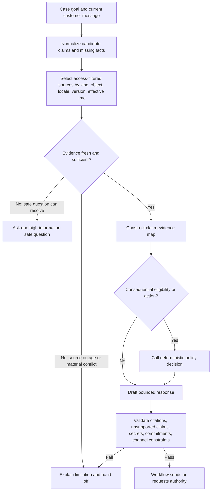
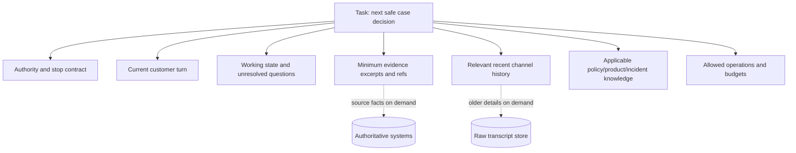

# Grounded Resolution, Context, Memory, and Planning

**Status:** Research-backed Pass-1 draft  
**Research current through:** 2026-08-31  
**Prerequisite:** [Authenticated intake, case state, and channel continuity](03-authenticated-intake-case-state-and-channel-continuity.md)

The resolver should behave like a careful evidence analyst with a small, safe action catalog—not like an omniscient service representative. It receives a purpose-built view of the case, gathers only missing evidence, and returns a structured next step. Retrieval, summaries, sentiment, and past outcomes remain fallible inputs.

## Evidence classes and precedence

Each claim must point to an evidence record with source, object identity, version, effective time, retrieval time, access decision, locale, classification, and freshness status.

| Evidence class | Examples | What it may establish | Important limitation |
|---|---|---|---|
| Current authoritative customer state | Account, subscription, entitlement, order, invoice | What the provider currently records for the bound object | May lag asynchronous effects; access is tenant/object-specific |
| Versioned policy decision | Eligibility output and obligations from policy service | Whether exact current facts qualify under a retained policy version | Does not establish customer intent or provider completion |
| Versioned policy source | Approved refund, cancellation, warranty, and exception policy | Explanation and inputs required by the decision service | Natural language can conflict or have effective-date/locale scope |
| Product source | Versioned help article, release note, supported diagnostic catalog | Supported behavior and safe steps | Article may be draft, stale, inaccessible, or wrong for the customer's version |
| Incident source | Status service or incident record | Known impact, start time, affected scope, approved messaging | Broad incident may not prove this customer is affected |
| Customer statement | Current and prior messages | Reported symptoms, preferences, and requested outcome | Not proof of identity, provider state, or eligibility |
| Model inference | Intent, hypothesis, sentiment, summary | What to investigate next | Never authoritative; must carry uncertainty |

Suggested precedence is not a universal “latest wins” rule. Current provider state usually outranks an old transcript for current status; a policy service decision outranks a retrieved paraphrase for eligibility; a current incident scope may explain telemetry. When authoritative sources conflict, stop the affected claim or effect, surface the conflict, and route to the owning team. Do not ask the model to adjudicate hidden business truth.

## Evidence contract

```json
{
  "evidence_id": "evidence_01K...",
  "kind": "policy_decision",
  "tenant_id": "tenant_1",
  "subject_refs": ["case_123", "subscription_456"],
  "source": "refund-policy-service",
  "source_object_id": "decision_88",
  "source_version": "refund-policy-2026-08-15",
  "effective_from": "2026-08-15T00:00:00Z",
  "effective_to": null,
  "retrieved_at": "2026-08-31T10:01:00Z",
  "fresh_until": "2026-08-31T10:06:00Z",
  "locale": "en-IN",
  "access_decision_id": "access_72",
  "classification": ["customer_financial", "restricted"],
  "content_digest": "sha256:...",
  "payload_ref": "evidence://policy/decision_88",
  "contradicts": []
}
```

The resolver sees the minimum fields or excerpt allowed for this task. The immutable record holds enough metadata to reproduce or explain the decision without copying prohibited data into every prompt.

## Grounded answer algorithm



Answer validation should check that every outcome-changing claim has a supporting evidence ID, cited evidence was accessible to the bound customer and effective at decision time, contradictions are surfaced, monetary values come from deterministic calculations, and the language does not create an unauthorized promise.

## Knowledge selection

Filter before ranking. A high semantic score cannot override tenant, role, customer segment, product version, locale, publication, effective date, or confidentiality constraints. The knowledge adapter should return:

- source object and immutable version or digest;
- publication state and effective interval;
- locale and fallback chain;
- applicable product/version/plan/region/customer segment;
- access decision and principal;
- last reviewed time and owning team;
- extracted passage or structured fact with location;
- staleness and contradiction flags.

When no source applies, say so and route rather than interpolating. When several apply, deterministic scoping filters first; then prefer the narrower applicable source. If two applicable authorities conflict on an outcome-changing point, open a knowledge-quality incident and prevent automated D3 action. Retrieval confidence is not conflict resolution.

## Safe troubleshooting loop

The model may choose only from a versioned diagnostic-step registry. Each iteration should maximize information gain while minimizing customer effort and risk:

1. state the current hypothesis and what evidence would distinguish it;
2. read safe telemetry or ask one focused question;
3. select an approved reversible step applicable to the exact product/version;
4. explain expected observation and risk in the customer's language;
5. record the observation, not merely whether the customer said “done”;
6. update or discard the hypothesis;
7. stop on success, risk, contradiction, repetition, budget, or unsupported state.

```yaml
diagnostic_step:
  step_id: "mobile.sync.refresh_v4"
  applies_when:
    product: "mobile-app"
    versions: ">=12.4 <13"
    platforms: ["android"]
  required_evidence: ["sync_status", "network_reachable"]
  customer_action: "refresh_sync_state"
  risk: "low"
  side_effect: "none"
  expected_observation: "last_sync_at advances within 60 seconds"
  timeout_seconds: 90
  repeat_limit: 1
  stop_if: ["data_loss_warning", "account_mismatch", "security_alert"]
  escalation_queue: "mobile-tier-2"
  source_version: "support-runbook-2026-08-10"
```

The sample is illustrative. Never fabricate device commands or suppress security controls. If a step becomes state-changing, classify it as an effect and route it through the appropriate gate.

## Context layers

Build context from the case goal outward, not from the entire data estate inward:



Recommended ordering is task and authority first, then current turn and working state, then selected evidence, then only relevant history. Explicitly label untrusted customer/provider text. Keep tool descriptions narrow; excessive tools consume attention and create false affordances. Fetch bulky or old content just in time by opaque reference.

Persist a context manifest with each model call so omission and overexposure can be evaluated:

```yaml
context_manifest:
  case_id: "case_123"
  case_version: 18
  task: "diagnose_duplicate_charge"
  compiler_version: "support-context-v7"
  authority_contract: "support-billing-d2-v4"
  included_evidence: ["charge_list_4", "policy_decision_88"]
  included_event_range: [188, 204]
  excluded_classes: ["payment_credential", "other_customer", "raw_voice_recording"]
  unresolved_conflicts: []
  source_revisions: {"billing_customer": "cus-v31", "case": 18}
  budgets: {"remaining_tool_calls": 4, "remaining_model_turns": 2}
  compiled_at: "2026-08-31T10:02:00Z"
```

The compiler enforces tenant, customer/account/object, field, purpose, channel, sensitivity, publication, product/version, locale, freshness and budget constraints before ranking. The resolver can ask for one named missing fact; it cannot widen these constraints.

## Memory taxonomy

“Memory” is too vague for a control decision. Use the following explicit classes:

| Class | Lifetime | Contents | Authority | Default persistence |
|---|---|---|---|---|
| Turn/scratch memory | One model call | Current request, exact task, allowed operations, selected evidence | None by itself | Provider/runtime transient under configured policy |
| Working/run memory | Active resolution episode | Hypotheses, open questions, attempted steps, next safe action | Derived and replaceable | Versioned case working-state record |
| Session memory | One authenticated channel session | Recent exchanges, locale, current assurance, delivery state | Session service owns assurance; transcript is evidence only | Until session/retention expiry |
| Durable workflow/task memory | Case lifecycle | Case version, owner, deadlines, approvals, effects, waits, receipts | Authoritative application records | Required by retention and audit policy |
| Domain knowledge memory | Governed support knowledge | Policies, product docs, incidents, diagnostic steps | Source system owns content/version | Per knowledge governance |
| Long-term/customer-preference memory | Cross-case structured preference | Approved locale, accessibility or contact preference, consented stable fact | Customer/profile system, never model free text | Off by default; purpose/consent/deletion required |
| Episodic/outcome memory | Curated historical patterns | Deidentified reviewed failure/resolution patterns and eval cases | Quality/evaluation system | Offline by default; no raw cross-customer retrieval |

Do not create an ungoverned “customer memory” paragraph from tickets. It can fossilize mistakes, leak other people's data, bias future service, and evade correction/deletion. Eligibility, identity, fraud flags, and effect history must be read from their authoritative domain systems. If a stable customer preference is useful, store a typed field with provenance, purpose, consent where required, owner, expiry, and delete path.

Exactly these seven lifetimes must appear in the data inventory and tests: **turn, working/run, session, durable workflow/task, domain knowledge, long-term/customer preference, and episodic/outcome**. Provider-hidden conversation state is an implementation cache associated with turn/session continuity, not an eighth authoritative memory class.

Apply promotion rules:

| From | To | Allowed only when |
|---|---|---|
| Turn/model output | Working state | Schema validates; case version is current; statements remain hypotheses or cited facts |
| Working/session | Durable task | A workflow transition, human decision or provider receipt establishes the authoritative field |
| Customer message | Long-term preference | Purpose is explicit, field is suitable, customer/profile policy allows it, provenance/expiry/delete path exist |
| Production case | Episodic/outcome | Outcome is verified, sample is minimized/deidentified as approved, reviewer labels root cause, eval governance accepts it |
| Any untrusted content | Domain knowledge | Never directly; named content owner reviews, versions, publishes and makes it retractable |

Poisoning controls include source trust labels, immutable provenance, author/reviewer separation for domain publication, anomaly/retraction signals, no automatic reviewer-edit promotion, and invalidation of every derived summary/eval fixture when its source is corrected or deleted. Similarity and repetition do not establish truth.

## Working-state contract

```json
{
  "working_state_version": 6,
  "case_id": "case_123",
  "case_version": 18,
  "goal": "determine whether a duplicate charge occurred and resolve it",
  "customer_intent": {"value": "refund_duplicate", "confidence": 0.88, "evidence_ids": ["msg_19"]},
  "hypotheses": [
    {"id": "h1", "statement": "authorization and settled charge are being confused", "status": "open", "evidence_for": [], "evidence_against": []}
  ],
  "known_facts": [
    {"claim": "two ledger entries are visible", "evidence_id": "charge_list_4", "fresh_until": "2026-08-31T10:06:00Z"}
  ],
  "open_questions": ["Are both entries settled?"],
  "attempted_steps": [{"step_id": "billing.read_charges", "result_ref": "charge_list_4"}],
  "pending_effect_ids": [],
  "next_safe_action": "read_settlement_status",
  "stops": [],
  "created_by": "resolver-model-snapshot-and-prompt-manifest",
  "created_at": "2026-08-31T10:02:00Z"
}
```

Confidence is a routing hint, never authorization. The workflow rejects working state built against a stale case version and regenerates it from authoritative evidence.

## Compaction and continuity

Compaction is a lossy context optimization. Provider-managed compaction may produce opaque items suitable for continuing a model conversation, but it cannot replace the readable case, event, evidence, approval, or effect records. Before the context budget is crossed, create a schema-validated continuation package:

```yaml
continuation_package:
  schema_version: 2
  case_id: "case_123"
  case_version: 18
  input_context_digest: "sha256:..."
  source_event_range: [188, 204]
  goal: "resolve duplicate charge"
  identity_binding_ref: "identity://binding_8"
  customer_intent_evidence: ["message://19"]
  verified_fact_refs: ["evidence://charge_list_4"]
  unresolved_questions: ["settlement status of charge_2"]
  attempted_step_refs: ["step://billing.read_charges/1"]
  active_approval_refs: []
  active_effect_refs: []
  delivery_refs: ["delivery://message_20"]
  deadlines: {"next_action_due_at": "2026-08-31T10:20:00Z"}
  next_safe_action: "read_settlement_status"
  prohibited_assumptions: ["do not infer both entries settled"]
  source_event_high_watermark: 204
  retained_invariants:
    - "do not create a second refund intent"
    - "no protected disclosure after identity expiry"
  omitted:
    - class: "raw_channel_history"
      recoverable_ref: "conversation://conv_2"
    - class: "voice_recording"
      recoverable_ref: null
  active_source_versions:
    case: 18
    policy: "refund-policy-2026-08-15"
    connector: "billing-adapter-11"
  compactor: "support-compactor-v3"
  output_digest: "sha256:..."
  created_at: "2026-08-31T10:03:00Z"
```

This is a **loss-aware continuity receipt**. It identifies what input range and versions were compacted, which safety invariants survived, what was omitted, where recoverable material remains, and the digest of the result. `null` means the content is intentionally unavailable and must not be invented.

On resume, verify case version, identity/session freshness, policy/evidence freshness, active approvals/effects, delivery state, ownership, source versions, deletion/retraction events, and all events since the watermark. If any changed—or the receipt/digest is unavailable—rebuild rather than trusting the summary. Repeated-compaction tests must preserve customer intent, identity limitations, active effects and `unknown` outcomes, deadlines, attempted-step repeat limits, source conflicts, prohibited assumptions and the next safe action.

Deletion and correction propagate by reference. Remove or tombstone the affected long-term preference, episode, transcript/excerpt, embedding/cache and eval sample; invalidate continuations and derived summaries; preserve only the minimum control evidence required by retention/legal-hold policy. A deletion must not cause the system to recreate the same field from an older transcript on the next case.

## Bounded planning and orchestration

Use a small plan within deterministic phases:

1. **Understand:** identify the support-owned goal and protected facts required.
2. **Bind:** confirm identity, tenant, account, provider objects, and authority envelope.
3. **Gather:** fetch the smallest evidence set; parallelize only independent D1 reads through the broker.
4. **Diagnose:** choose a safe step or determine an answer from evidence.
5. **Propose:** return a grounded response, handoff, or exact effect proposal.
6. **Verify:** let the workflow validate claims, commit through gates if authorized, confirm delivery/effect state, and update the case.

Set maximum model turns, tool calls, retrieved bytes, elapsed time, and cost. Replan only when an observation falsifies a hypothesis, a case/provider version changes, a customer clarifies intent, or an approved dependency returns. Repeated identical calls, circular questions, missing sources, policy conflicts, tool errors beyond budget, and effect uncertainty are stop conditions.

## Resolution output schema

```json
{
  "kind": "propose_effect",
  "case_id": "case_123",
  "case_expected_version": 18,
  "customer_intent_evidence_ids": ["msg_19"],
  "claim_evidence": [
    {"claim": "charge_2 is a duplicate settled charge", "evidence_ids": ["charge_7", "charge_8"]}
  ],
  "policy_decision_id": "decision_88",
  "effect_preview": {
    "type": "refund",
    "provider_object_id": "charge_2",
    "amount_minor": 129900,
    "currency": "INR",
    "reason_code": "duplicate_charge"
  },
  "customer_message_draft": "...",
  "uncertainties": [],
  "requested_next_state": "approval_pending"
}
```

The amount and eligibility must come from tools, not model arithmetic. The validator rejects unknown fields, missing evidence, stale versions, unsupported commitments, or a requested operation absent from the authority contract.

## Reasoning-layer failure modes

| Failure | Preventive control | Runtime response |
|---|---|---|
| Stale article wins over current policy | Effective-time/type filters and deterministic policy service | Block affected claim/effect; fetch current source |
| Retrieved text contains instructions | Treat all content as data; isolate control instructions; tool broker enforces operations | Ignore embedded instruction; audit injection signal |
| Summary drops an active refund | Active effect list loaded from ledger, not summary | Rebuild continuation; block closure |
| Model repeats burdensome step | Step IDs and repeat limits in working state | Stop and hand off |
| Wrong locale or plan article | Deterministic applicability filters before retrieval rank | Fetch correct source or disclose limitation |
| Hallucinated policy exception | Exact claim-evidence and policy-decision requirement | Reject response and route review |
| Cross-case memory leak | No raw episodic retrieval; tenant/customer filters; privacy tests | Stop, contain, investigate, notify per policy |
| Large context hides authority boundary | Authority contract first; budgets; just-in-time retrieval | Compact/rebuild or deterministic fallback |
| Corrected/deleted fact returns from an old summary or embedding | Source revision/tombstone index and derivation lineage | Invalidate all derived artifacts; rebuild from current allowed sources |
| Repeated compaction drops an unknown refund or customer intent | Receipt invariants plus round-trip and multi-compaction tests | Block resume/closure and reconstruct from ledger/events |
| Reviewer edit poisons long-term behavior | Offline curation and authoritative outcome verification | Quarantine sample; root-cause review before any eval or release change |

## Stage 2–3 reasoning exit gate

- [ ] Outcome-changing claims carry immutable evidence references and freshness.
- [ ] Access, applicability, publication, locale, version, and effective time filter knowledge before semantic rank.
- [ ] Policy eligibility comes from a versioned deterministic decision service.
- [ ] Troubleshooting uses a reviewed step catalog with observations, risks, repeat limits, and stops.
- [ ] Turn, working, session, durable task, domain, long-term customer, and episodic memory have separate owners and retention.
- [ ] Ungoverned cross-case free-form memory is disabled.
- [ ] Compaction produces a readable continuation package and never replaces authoritative records.
- [ ] Resume verifies versions, identity, ownership, effects, freshness, and missed events.
- [ ] Plans have hard budgets, replan triggers, and loop detection.
- [ ] Output is structured, evidence-bound, and independently validated.

## Related guides

- [Actions, approvals, effects, and reconciliation](05-actions-approvals-effects-and-reconciliation.md)
- [Reliability, SLA routing, handoffs, and quality](06-reliability-sla-routing-handoffs-and-quality.md)
- [Context engineering](../../context-memory/context-engineering.md)
- [Memory architecture](../../context-memory/memory-architecture.md)
- [Compaction and continuity](../../context-memory/compaction-and-continuity.md)
