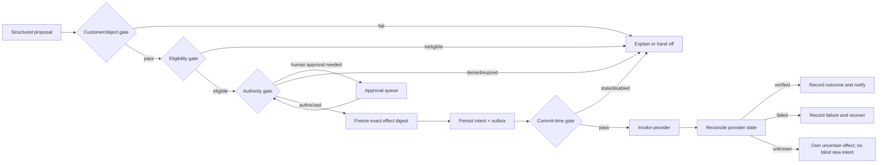
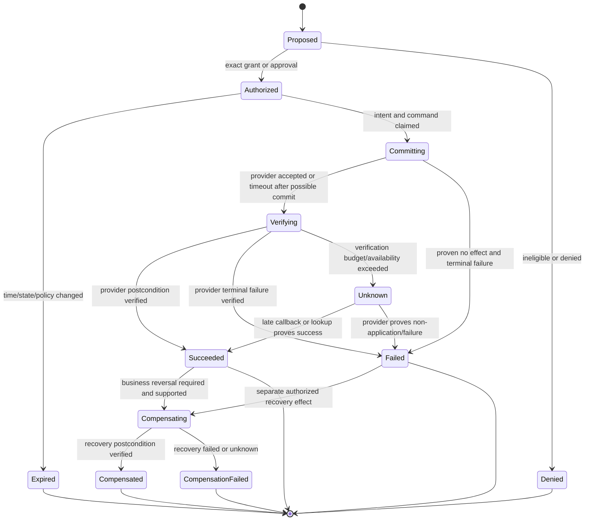

# Actions, Approvals, Effects, and Reconciliation

**Status:** Research-backed Pass-1 draft  
**Research current through:** 2026-08-31  
**Prerequisites:** [Scope and authority](01-scope-workload-fit-and-authority.md), [grounded resolution and planning](04-grounded-resolution-context-memory-and-planning.md)

Refunds, credits, cancellations, replacements, entitlement changes, shipment changes, and binding service commitments are effects, not chat responses. Their correctness depends on exact authority, provider semantics, durable intent, idempotency, and reconciliation. A model may assemble the proposal and explanation; an independent deterministic path decides and commits it.

## Effect catalog

Maintain one catalog entry per operation and provider version:

| Effect | Typical consequence | Required provider facts | Verification postcondition |
|---|---|---|---|
| Refund | Money moves back to a payment method; partial/pending/failed states possible | Captured/settled amount, prior refunds, currency, refundability, provider account | Exact provider refund object reaches acceptable terminal state and amount/currency match |
| Service credit | Creates financial or usage liability; may affect invoice/tax handling | Account, credit type, cap, currency/unit, expiry, prior credits | Ledger/credit object exists once with exact terms |
| Subscription cancellation | Stops future service immediately or at period end; proration/invoice behavior varies | Subscription version/status, effective mode/date, pending invoice/schedule | Subscription has exact target state/date and dependent invoice behavior is known |
| Order cancellation | May be irreversible and start asynchronous refund/restock/notification jobs | Fulfillment/cancelability, inventory/refund rules, current order version | Order and every spawned job reach expected state or explicit exception |
| Replacement/return | Creates logistics, inventory, and communication effects | Eligible items, address, fulfillment status, inventory capability | Return/replacement record and fulfillment state verified |
| Entitlement/configuration change | Alters customer access or product behavior | Current entitlements, ownership, target value, dependencies | Read-after-write equals authorized target and no forbidden dependent change |
| Outbound binding notice | Customer may rely on promised dates, amounts, or exceptions | Verified effect/policy state, approved wording, destination consent | Provider delivery state reaches the channel's defined success or alternate workflow begins |

Provider operations with the same name do not have identical semantics. For example, refund APIs may return pending, failed, canceled, or action-required states; subscription cancellation may be immediate or deferred and may change invoice behavior; an order cancellation may return an asynchronous job. Pin API versions, certify these semantics, and store them in the connector registry.

## Four-gate commit model

Every D3 action passes four independent gates:

1. **Customer and object gate:** current tenant/customer/account binding, sufficient assurance, object ownership, and exact customer intent or confirmation where required.
2. **Eligibility gate:** current authoritative facts evaluated by the retained policy version; calculations use integer minor units or domain-safe numeric types.
3. **Organizational authority gate:** exact operation is inside a deterministic grant or approved by a permitted human who is not the model/effect worker.
4. **Commit gate:** current case/provider state, unexpired approval, unchanged request digest, effect kill-switch state, rate/risk controls, and stable intent identity all pass immediately before invocation.



## Exact effect intent

```json
{
  "effect_id": "effect_01K...",
  "intent_key": "tenant_1:case_123:refund:duplicate_charge:charge_456:v1",
  "effect_type": "refund",
  "tenant_id": "tenant_1",
  "case_id": "case_123",
  "case_expected_version": 18,
  "customer_id": "customer_9",
  "account_id": "account_5",
  "provider": "payment-provider",
  "provider_account_id": "provider_account_2",
  "provider_object_id": "charge_456",
  "request": {
    "amount_minor": 129900,
    "currency": "INR",
    "reason_code": "duplicate_charge"
  },
  "customer_intent_evidence_ids": ["message_19"],
  "identity_binding_id": "binding_8",
  "policy_decision_id": "decision_88",
  "policy_version": "refund-policy-2026-08-15",
  "authority_record_id": "grant_or_approval_91",
  "request_digest": "sha256:canonicalized-exact-request",
  "idempotency_key": "effect_01K...",
  "state": "authorized",
  "created_at": "2026-08-31T10:04:00Z",
  "authorization_expires_at": "2026-08-31T10:14:00Z"
}
```

The `intent_key` expresses semantic identity at the application level; the `idempotency_key` is what the certified provider operation receives. A retry reuses both. A materially different amount, object, currency, effective date, reason, or mode is a new proposal and authorization—not a retry.

## Approval record

```yaml
approval_record:
  approval_id: "approval_91"
  tenant_id: "tenant_1"
  case_id: "case_123"
  effect_id: "effect_01K..."
  request_digest: "sha256:..."
  policy_version: "refund-policy-2026-08-15"
  provider_state_version: "charge-version-7"
  identity_binding_id: "binding_8"
  decision: "approved"
  decision_basis: "support_lead_review"
  approver_principal: "employee_42"
  approver_roles_at_decision: ["refund_approver"]
  obligations: ["notify_customer_after_verified_success"]
  decided_at: "2026-08-31T10:05:00Z"
  expires_at: "2026-08-31T10:15:00Z"
```

Approval UX must show the customer/account, provider object, exact amount/currency or cancellation timing, consequences, evidence, policy decision, prior related effects, and what will be communicated. “Approve the agent's plan” is not an exact approval. The approver cannot edit hidden fields after approval; edits create a new digest and decision. Absence, timeout, or tool-level “approved” annotation is not approval.

## Pre-authorization versus human approval

A human click is not automatically safer than a tested deterministic grant. Low-risk, high-volume actions may use narrow pre-authorization when all of these are true:

- exact eligibility and amount are deterministic;
- identity and object ownership are current;
- blast radius, per-case/customer/time limits, currencies, reasons, regions, and provider accounts are bounded;
- the customer has explicitly confirmed irreversible or consequential intent where required;
- the operation is independently verified and reversible or compensable enough for the risk;
- fraud/abuse/safety signals and duplicate related effects are checked outside the model;
- a separate kill switch, audit, sampling, and post-effect review exist;
- exceptions cannot be self-approved.

Otherwise require an authorized human or specialist. “The model is confident” is never a substitute.

## Commit protocol

The smallest reliable protocol is:

1. canonicalize and hash the exact request;
2. in one transaction, create the authorized effect intent, reserve any internal limit or balance, transition the case, and append an outbox command;
3. worker claims the command and re-checks kill switch, approval expiry/digest, current policy if required, identity freshness, case version/ownership, provider object version, related effects, and limits;
4. invoke the dedicated provider adapter with the stable idempotency key;
5. record raw status only in protected evidence; project normalized receipt and provider object ID into the effect record;
6. reconcile by provider lookup and authenticated callbacks until verified terminal state or escalation threshold;
7. emit an outcome event and only then send the corresponding customer commitment or closure notice;
8. release reservations or create an explicit compensation workflow on failure.

Approval captures an allowed decision at a point in time. The commit gate applies current safety policy and kill switches. If policy changed materially or facts no longer match, do not silently execute under the old approval; expire/review it while retaining the historical policy and decision for audit.

## Effect lifecycle



`Unknown` is a first-class operational state, not a generic error. It means the system cannot yet prove whether an effect occurred. It blocks blind retry under a new intent, may block related effects and closure, and has an owner, deadline, reconciliation strategy, and customer communication policy.

## Idempotency rules

- Generate the application intent identity before any external call.
- Reuse the same provider idempotency key for the same exact semantic intent.
- Reject reuse with different canonical parameters.
- Persist provider response identifiers and normalized result even when the call reports a server error, because provider behavior varies.
- Treat provider retention windows and conflict behavior as certified, versioned facts—not permanent guarantees.
- Do not assume HTTP method idempotence proves business idempotence, nor that a durable workflow makes an external provider exactly once.
- For providers without adequate idempotency, use a unique business reference if supported, query for prior effect before commit, serialize by provider object, and require stronger reconciliation/human review.
- Use an inbox/outbox or equivalent atomic boundary for local messages, but still reconcile external state.

## Reconciliation contract

```yaml
reconciliation_job:
  effect_id: "effect_01K..."
  intent_key: "tenant_1:case_123:refund:duplicate_charge:charge_456:v1"
  provider_object_id: "refund_789"
  expected_postcondition:
    status_in: ["succeeded"]
    amount_minor: 129900
    currency: "INR"
    source_object_id: "charge_456"
  observations:
    - source: "provider_api"
      observed_at: "2026-08-31T10:05:10Z"
      status: "pending"
      evidence_ref: "provider://refund_789/v1"
  next_check_at: "2026-08-31T10:06:10Z"
  deadline_at: "2026-08-31T10:35:00Z"
  retry_count: 1
  on_deadline: "payments-operations"
```

The reconciler must compare exact postconditions, not just existence. A refund for the wrong amount, a cancellation on the wrong date, or a credit in the wrong unit is not success. Provider events can duplicate or arrive out of order, so reduce observations using documented provider semantics and confirm with a current lookup for high-impact effects.

## Cancellation and interruption

User cancellation of an agent run is not necessarily cancellation of an external effect. Handle by phase:

| Phase | Stop behavior |
|---|---|
| Before proposal | Cancel model/tools and leave an audited case note if needed |
| Proposed or approval pending | Withdraw proposal; mark approval unusable |
| Authorized, command not claimed | Atomically cancel the command and reservation if policy permits |
| Committing or verifying | Do not claim cancellation; reconcile provider state first |
| Succeeded | A reversal is a separate effect with separate eligibility and authority |
| Unknown | Preserve evidence, block conflicting action, continue reconciliation or specialist handoff |

Likewise, a customer changing their mind must be evaluated against current provider state. An immediate subscription cancellation that has committed may not be undoable; a scheduled end-of-period cancellation may have a distinct resume operation. Never describe compensation as rollback unless the provider truly offers transactional rollback.

## Provider-specific certification questions

| Topic | Questions the connector owner must answer |
|---|---|
| Refund | Are partial/multiple refunds allowed? What caps them? Which states are terminal? Can it require customer action? How are fees and currency handled? |
| Credit | Is it ledger money, invoice adjustment, store credit, or usage? Does it expire? Is it transferable or reversible? |
| Subscription cancellation | Immediate or period-end? What happens to invoices, prorations, pending updates, access, schedules, and reactivation? |
| Order cancellation | Is it reversible? Does it trigger refund, restock, notification, or an asynchronous job? Which fulfillment states block it? |
| Webhook | How are signatures verified? Are events retried, duplicated, reordered, delayed, or versioned? How are secrets rotated? |
| Idempotency | What identifies sameness, how long is it retained, are failures cached, what does mismatch return, and can late requests appear? |
| Read-after-write | Which endpoint proves the postcondition and how long can projections lag? |
| Rate limiting | Which headers/backoff are authoritative, and can reconciliation be prioritized over new effects? |

See [integration qualification and provider semantics](09-integration-qualification-and-provider-semantics.md) for the full admission path across helpdesk, channel/voice, identity, knowledge/status, commerce/shipment and billing providers.

## Worked effect examples

### Duplicate-charge refund

1. Bind the authenticated customer to the provider customer and both charge objects.
2. Read current charge/payment state and prior refunds; distinguish authorization, pending, settled, reversed and disputed records.
3. Ask the model only to explain the evidence or identify a missing fact. A deterministic service determines duplicate eligibility and exact refundable amount/currency.
4. Show one immutable preview with source charge, amount, destination description, expected timeline and limitations.
5. Authorize, persist and commit one semantic refund intent.
6. If the response is lost, enter `verifying`; query by provider object/idempotency evidence and never create a second intent.
7. Notify the customer using the verified provider state (`pending` is described as pending) and track notification separately.

**Exercise gate:** inject a timeout after provider acceptance and duplicate callbacks. Exactly one refund exists, the audit links its amount/currency/source, and the case cannot close while effect truth is unknown.

### Period-end subscription cancellation

1. Clarify immediate versus period-end intent; do not infer from “stop my plan.”
2. Read subscription version/status, period boundary, schedule, pending update, open invoice, entitlement dependency and organization-specific proration/cancellation decision.
3. Produce the provider-calculated preview; the model does not calculate dates or money.
4. Bind customer confirmation and organizational authority to the exact mode/date/consequence digest.
5. Re-read provider state at commit; if a schedule, invoice or version changed, expire the approval and preview again.
6. Verify subscription plus dependent invoice/schedule/entitlement postconditions. A top-level `canceled` label alone may be insufficient.

**Exercise gate:** change the billing schedule after approval. Commit stops with a typed conflict, no cancellation occurs, and the customer receives an accurate re-preview rather than a promise.

### Shipment replacement after non-delivery

1. Bind order, fulfillment, package/tracking event, item/quantity and customer/address.
2. Distinguish carrier scan, platform projection, delivery promise and customer statement; a delivered scan does not resolve a dispute automatically.
3. Let the policy service determine investigation/replacement/refund eligibility and any waiting period.
4. Reserve inventory or create a back-office/commerce request before promising shipment; model prose cannot allocate stock.
5. Verify replacement order/fulfillment and outbound delivery notice independently.

**Exercise gate:** split shipment, delayed carrier callback and unavailable replacement stock. No wrong line item is replaced, no unsupported arrival promise is sent, and the accepted handoff names one owner/deadline.

## Effect failure matrix

| Failure | Unsafe response | Required response |
|---|---|---|
| Timeout after request bytes sent | Retry with a new key | Mark verifying/unknown and query using same intent identity |
| Provider returns asynchronous job | Tell customer cancellation/refund completed | Track job and dependent objects to verified terminal state |
| Approval expires while queued | Execute because it was once approved | Re-evaluate policy/state and request new authorization |
| Case changes after approval | Ignore stale case version | Stop, reload, regenerate digest, reauthorize |
| Duplicate webhook | Apply effect outcome twice or send duplicate notice | Deduplicate event; idempotently project same outcome |
| Refund succeeds, message delivery fails | Retry refund | Preserve success; retry/alternate only the notification under channel policy |
| Effect fails after internal reservation | Leave balance consumed | Release reservation or start explicit repair transaction |
| Wrong successful effect | Delete audit or relabel it | Freeze related actions; incident; separately authorize compensation if possible |
| Provider idempotency semantics change | Assume prior behavior | Disable affected operation until recertified |
| Currency or amount generated by model | Commit likely value | Reject; obtain deterministic domain value |

## Effect audit requirements

For every D3 attempt, retain according to policy:

- tenant, customer/account/object bindings and identity assurance reference;
- customer intent evidence and exact preview shown;
- current provider facts, related effects, policy decision and version;
- organizational grant or approver identity/roles, exact digest, decision, obligations, and expiry;
- case and provider versions at proposal and commit;
- effect/intent/idempotency identities, connector and API versions;
- every provider attempt, receipt, callback, lookup, normalized observation, and reconciliation decision;
- customer notification content reference and delivery state;
- terminal outcome or named owner/deadline for unknown/compensation state.

This audit is unsampled control evidence. Diagnostic traces may reference these records but are not their substitute.

## Stage 3–4 effect exit gate

- [ ] Every consequential operation has a provider-versioned effect catalog entry and postcondition.
- [ ] Customer/object, eligibility, organizational authority, and commit gates are independent.
- [ ] Exact effect requests use deterministic values and a canonical digest.
- [ ] Human approval UI shows the complete consequence; edits invalidate approval.
- [ ] Pre-authorization is narrow, risk-reviewed, rate-limited, independently enforced, and kill-switchable.
- [ ] Intent and outbox command persist before the provider call.
- [ ] Retry reuses semantic and provider idempotency identities; parameter mismatch is rejected.
- [ ] Async, duplicate, late, reordered, partial, pending, failed, and unknown provider outcomes are tested.
- [ ] Reconciliation verifies exact postconditions and owns an age/deadline.
- [ ] Cancellation by customer, operator, or runtime respects the current effect phase.
- [ ] Compensation is a new authorized effect, never an audit rewrite.
- [ ] Case closure and customer commitments wait for required effect and delivery postconditions.

## Related guides

- [Reliability, SLA routing, handoffs, and quality](06-reliability-sla-routing-handoffs-and-quality.md)
- [Security, privacy, tenancy, and abuse resistance](07-security-privacy-tenancy-and-abuse-resistance.md)
- [Idempotency and side effects](../../reliability/idempotency-and-side-effects.md)
- [Durable execution](../../runtime/durable-execution.md)
- [Run controls](../../runtime/run-controls.md)
