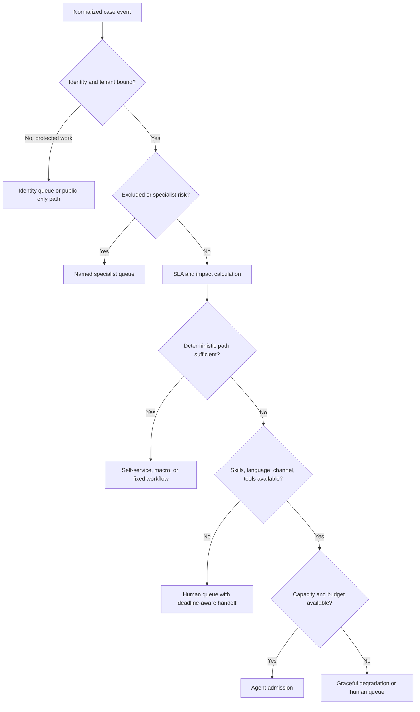
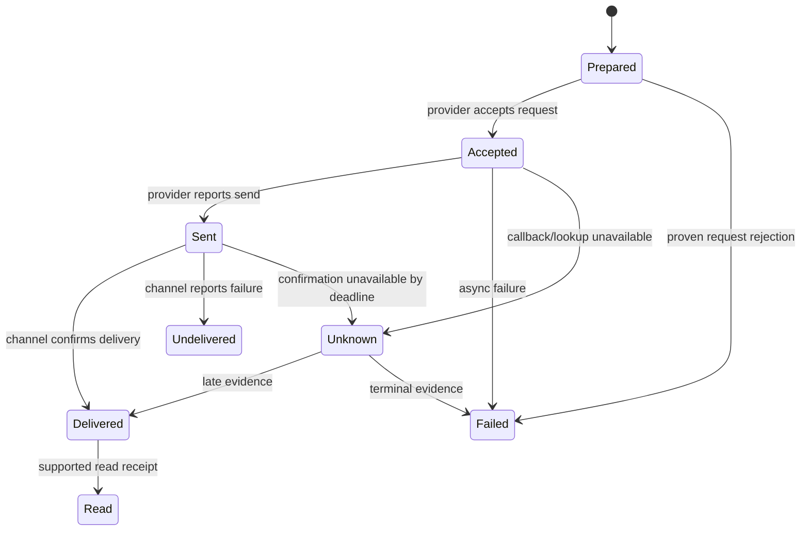

# Reliability, SLA Routing, Handoffs, and Quality

**Status:** Research-backed Pass-1 draft  
**Research current through:** 2026-08-31  
**Prerequisites:** [Case state and channel continuity](03-authenticated-intake-case-state-and-channel-continuity.md), [actions and reconciliation](05-actions-approvals-effects-and-reconciliation.md)

Support reliability is the ability to preserve one correct customer outcome across duplicated events, process crashes, provider delays, channel changes, human intervention, and long waits. A fast answer is not reliable if it breaches policy, loses a refund, misses a service deadline, or cannot tell whether the customer received the result.

## Separate SLA, SLO, priority, and sentiment

- A **customer SLA** is a contractual or policy target such as first response or resolution time, often conditional on plan, priority, channel, calendar, and pause state.
- An **internal SLO** is a reliability target for the agent system, such as admission availability or the age of unknown effects.
- **Priority** is an operational decision derived from impact, urgency, customer contract, safety, deadlines, and queue policy.
- **Sentiment** is a fallible language signal useful for tone or review sampling; it does not create identity, eligibility, urgency, or entitlement.

Some support platforms apply only the first matching SLA policy, require a priority field, distinguish calendar/business hours, and expose separate reply/work/wait/resolution metrics. Vendor behavior may exclude or treat automated tickets differently. Maintain an application-owned, versioned deadline calculation for the agent workflow and reconcile it with platform metric events; do not assume a platform's human-ticket clock automatically covers AI-contained cases.

## SLA record and clock transitions

```yaml
sla_record:
  case_id: "case_123"
  contract_id: "support-plan-enterprise"
  policy_version: "sla-2026-07"
  matched_rule_id: "sev2-billing"
  priority: "high"
  calendar_id: "india-business-hours-v3"
  timezone: "Asia/Kolkata"
  targets:
    first_response_due_at: "2026-08-31T10:10:00Z"
    next_action_due_at: "2026-08-31T10:20:00Z"
    resolution_target_at: "2026-09-01T10:00:00Z"
  clocks:
    requester_wait_seconds: 42
    agent_work_seconds: 75
    dependency_wait_seconds: 0
  pause_state: null
  source_fact_refs: ["account_plan_7", "issue_class_4"]
  calculated_at: "2026-08-31T10:01:00Z"
```

Pause only under explicit contract semantics. A model choosing `waiting_customer` must not automatically stop a contractual clock. Recompute after priority, plan, issue classification, calendar, or state changes; retain earlier calculations to explain routing decisions.

## Admission and routing



Route using authoritative attributes: tenant/plan, issue class, affected scope, safety/fraud/legal markers, deadline, language, accessibility, channel capability, required connector, active incident, effect state, and human skill. Model classification may propose a class but deterministic routing validates it. Use per-tenant fairness and reserved capacity for reconciliation, safety, and near-breach work so a large customer or incident cannot starve others.

### Queue classes and backpressure

Do not put every job in one priority queue. Separate admission from scheduling and reserve capacity by control need:

| Queue class | Examples | Scheduling rule | May be shed? |
|---|---|---|---|
| Safety and identity protection | Account takeover, safety/legal intake, identity dispute | Reserved capacity; named specialist deadline | No silent drop; degrade to minimum safe receipt/handoff |
| Effect reconciliation | Unknown refund/cancel, compensation, provider drift | Reserved independently from new effects | No; pause new low-risk effects first |
| Near-SLA-breach case work | First safe action or owned follow-up near deadline | Earliest deadline within fair tenant/skill class | Route human if agent capacity unavailable |
| Active customer interaction | Bounded synchronous web/chat/voice turn | Short deadline and concurrency cap | Fall back to deterministic/human queue |
| New asynchronous resolution | Email/ticket research and proposals | Weighted fair queue by tenant/plan without starvation | Delay transparently within SLA |
| Offline quality/evolution | Eval replay, mining, embedding/index refresh | Lowest priority and separate quotas | Yes; never compete with production controls |

Apply per-tenant weighted fairness plus a starvation bound. Cap active work, request size, attachments, model/tool budget and outstanding waits. Admission returns `accepted`, `deterministic_path`, `queued_with_deadline`, `human_route`, `retry_later`, or `rejected_by_policy`; it never accepts work that the downstream system cannot start before its safe deadline. Backpressure must reach the channel rather than accumulating invisible work in nested SDK/provider retries.

Measure arrival/service time and queue age by class, tenant, region, connector and language. A large incident may justify incident-specific lanes and approved common notices, but it must not starve unrelated identity, safety or reconciliation work.

## Durable waiting

Customers, approvers, providers, and back-office dependencies may respond hours or days later. Do not hold model context, worker threads, connections, or locks while waiting. Persist:

- case and workflow version;
- wait type, expected event, correlation keys, and deadline;
- current identity/session implications;
- continuation package and source-event watermark;
- active approvals/effects and reconciliation schedule;
- timer events for reminders, SLA escalation, expiry, and abandonment;
- allowed resume transitions.

On wake, deduplicate the event, verify it matches the expected tenant/case/object, reload current state, and rebuild context. A durable workflow engine can simplify timers and crash recovery, but replay determinism and workflow version compatibility must be tested. A relational state machine, queue, and scheduler are sufficient for an early bounded system if they provide the same invariants.

## Retry ownership

Only one layer retries a failure class:

| Failure | Retry owner | Rule |
|---|---|---|
| Model transient error | Case workflow | Bounded retry with same task and no D3 duplication; then fallback/handoff |
| Read connector rate limit | Connector | Respect provider backoff and deadline; return freshness/availability result |
| Local event delivery | Queue consumer | Idempotent inbox/outbox processing |
| Effect request timeout | Reconciler/effect worker | Query existing intent; reuse same idempotency key only when safe |
| Outbound message transport | Delivery adapter | Reuse provider message identity when supported; do not duplicate effect |
| Human/dependency wait | Workflow timer | Reminder/escalation policy, not request spam |

Disable nested automatic retries that multiply attempts invisibly. Include retry count, total elapsed time, prior outcome, and next deadline in the control record.

## Channel delivery truth

Track a channel-specific state machine instead of a boolean `sent`:



Not every provider exposes every state. Declare the highest observable assurance per channel. A transport provider's `delivered` may mean delivery to a device or downstream channel, not that the intended person read or understood the message. For a legally or operationally required notice, define acceptable destinations, alternate channels, consent, retries, and human follow-up. Do not repeat a financial effect because its notification failed.

## Human handoff contract

A warm handoff is a state transition with structured evidence, not a transcript dump.

```yaml
handoff_package:
  handoff_id: "handoff_..."
  case_id: "case_123"
  case_version: 21
  from_owner: "support_resolver_v4"
  to_queue: "payments-operations"
  reason_code: "refund_outcome_unknown"
  customer:
    identity_binding_ref: "identity://binding_8"
    assurance_status: "step_up_expired"
    preferred_channel_ref: "preference://channel_2"
  intent:
    requested_outcome: "refund duplicate settled charge"
    evidence_refs: ["message://19"]
  verified_fact_refs: ["evidence://charge_7", "evidence://policy_decision_88"]
  attempted_step_refs: ["tool://billing.refund.create/effect_01K"]
  active_effects:
    - effect_id: "effect_01K"
      state: "unknown"
      request_digest: "sha256:..."
      provider_receipt_ref: "provider://refund_789"
  active_approvals: []
  deadlines:
    next_action_due_at: "2026-08-31T10:20:00Z"
    reconciliation_deadline_at: "2026-08-31T10:35:00Z"
  customer_message_status: "pending_verification_notice_delivered"
  next_safe_action: "query provider refund object; do not create another refund"
  prohibited_actions: ["new_refund_intent", "case_close"]
```

The receiver acknowledges ownership through a conditional case transition. Until accepted, the sending workflow retains deadline responsibility. The human UI should distinguish verified facts, customer statements, model hypotheses, pending effects, and prohibited actions. If the human changes the resolution, the same policy, approval, event, and effect contracts apply.

## Handoff destinations

| Trigger | Destination | Minimum additional control |
|---|---|---|
| Identity recovery/dispute | Identity specialist | No protected account disclosure in handoff preview |
| Fraud, abuse, or payment anomaly | Fraud/payments operations | Freeze ordinary compensation; preserve evidence |
| Safety, legal, regulatory, or vulnerability report | Named specialist queue | Approved acknowledgment; need-to-know disclosure |
| Unsupported technical problem | Product Tier 2/engineering intake | Version, reproducible observations, safe steps already tried |
| Legacy page-only task | Browser-automation adapter or trained human | Exact bounded operation; support retains policy/case ownership |
| Generic fulfillment dependency | Back-office workflow | Typed request and result contract; no full-case authority |
| Revenue/opportunity request | Sales/revenue operations | Customer consent/context limits; no support effect masquerading as discount |
| Unknown financial or cancellation effect | Provider operations | Existing intent/receipt and prohibition on blind duplicate |

## Closure and outcome reconciliation

A case can resolve only when its case-type postconditions pass. Example closure predicate:

```text
identity binding was sufficient for every protected disclosure and action
AND no required evidence conflict remains
AND every effect is terminal or transferred to an explicitly owned exception workflow
AND the verified provider outcome matches the promised outcome
AND required customer notice reached the channel's defined delivery state
AND no approval, timer, or dependency remains orphaned
AND the customer-facing summary cites the actual outcome without unsupported promise
AND reopen/appeal path and retention classification are recorded
```

Do not force `unknown` into `failed` merely to close metrics. If policy allows the support case to resolve while a specialist exception remains open, create a linked authoritative exception record, name its owner/SLA, tell the customer the status accurately, and preserve correlation.

Outcome reconciliation also detects downstream drift: refund succeeded but case says pending, case says canceled but provider remains active, response says delivered but transport failed, or a human closed the ticket while a workflow still owns it. Run periodic sweeps based on provider state and invariant queries, not only callbacks.

## Quality review

Use three layers:

1. **Automatic invariant review:** identity/tenant binding, evidence presence, policy version, unauthorized claims, effect lifecycle, delivery, case transition, audit completeness.
2. **Risk-based human review:** D3 actions, exceptions, vulnerable customers, low-confidence language, repeat contact, escalations, complaints, safety/fraud markers, novel model/tool versions, and random controls.
3. **Outcome review:** provider postconditions, reopen/repeat-contact rate, customer effort, handoff acceptance, and defects found after resolution.

Reviewers need the same evidence separation as operators. They should never grade only the fluency of the last reply. Calibrate rubric-based empathy, clarity, and tone judgments across languages and channels; combine them with deterministic outcome and compliance graders. Do not feed reviewer edits directly into live prompts or memory without redaction, root-cause classification, evaluation, approval, and release controls.

## Quality decision table

| Observation | Case quality result | Engineering response |
|---|---|---|
| Polite answer, wrong provider outcome | Critical failure | Effect/grounding root-cause analysis and gate regression test |
| Correct outcome, missing identity proof | Critical control failure | Security incident assessment; disable affected path |
| Correct and safe, avoidable human handoff | Capability opportunity | Add an eval case; improve only if boundaries remain safe |
| Agent abstains on conflicting policy | Correct safe behavior | Repair source conflict; do not penalize abstention |
| Customer recontacts after “resolution” | Outcome failure or new issue | Link episodes; classify cause rather than hiding reopen |
| High CSAT with unauthorized exception | Policy failure | Never offset with satisfaction metric |
| Low CSAT after correct policy denial | Review clarity/empathy and policy ownership separately | Do not relax eligibility through prompt tuning |

## Recovery and reconciliation runbooks

| Incident | Immediate containment | Recovery evidence |
|---|---|---|
| Duplicate outbound replies | Pause channel sender; retain inbound processing | Message IDs, delivery states, deduplication fix, affected cases |
| Reconciliation backlog | Reserve capacity; pause new low-priority effects if needed | Oldest unknown age, provider health, catch-up rate, sampled postconditions |
| Support-platform outage | Admit only safe public/deterministic paths; queue signed events durably | Event replay, case version comparison, no lost deadlines |
| Knowledge/policy outage | Disable definitive affected answers and effects; use approved notice/handoff | Source availability and current-version verification |
| Provider callback loss | Poll high-impact active effects; check webhook health | Provider object lookup and audit completeness |
| Human/bot ownership race | Stop bot writes; freeze active effect if safe | Case versions, assignment events, effect state, corrected owner |
| SLA calculator defect | Route conservatively; preserve prior/current versions | Recomputed deadlines, breach analysis, customer remediation process |

## Recovery load is production load

Recovery can exceed normal traffic: signed channel backlog, support-platform replay, callback redelivery, missed timers, stale projections, effect reconciliation, human reassignments and customers retrying simultaneously. Capacity plans and disaster-recovery exercises must model this amplification.

Use this restore order unless organizational risk requires a stricter one:

1. identity, tenant mapping, kill switches and control-audit durability;
2. active/unknown effect ledger and reconciliation workers;
3. inbound event deduplication, case ownership and SLA deadlines;
4. required customer notices and human handoffs;
5. current policy/knowledge/product projections;
6. new adaptive model work;
7. offline quality and analytics.

Do not replay effects from a restored outbox until each intent is reconciled against the provider. Rate-limit catch-up below provider limits, preserve per-tenant fairness, and keep new safety/reconciliation traffic ahead of old low-risk work. Track backlog size, oldest age, duplicate suppression, reconciliation convergence, missed deadlines, provider saturation, human capacity and estimated catch-up time.

**Recovery exercise:** restore from a backup taken before a refund succeeded, while its provider callback exists only in the channel backlog. Pass only if the system discovers the existing provider effect, applies one idempotent case transition, sends at most one notice, preserves the original approval/audit, and returns queue/SLA risk to normal without starving another tenant.

## Reliability exit gate

- [ ] Customer SLA, internal SLO, priority, and sentiment are separate inputs and records.
- [ ] SLA calculation is versioned, calendar-aware, and tested against platform metrics and automated-ticket behavior.
- [ ] Routing uses authoritative impact, contract, skill, risk, channel, and capacity facts.
- [ ] Queue classes, weighted fairness, starvation bounds, reserved safety/reconciliation capacity and end-to-end backpressure are load-tested.
- [ ] Long waits release compute and resume from durable, version-checked state.
- [ ] Each retry class has one owner and a bounded budget.
- [ ] Delivery states reflect channel capabilities; acceptance is not universal delivery.
- [ ] Handoff is conditional, evidence-structured, deadline-aware, and accepted by a named owner.
- [ ] Closure predicates verify provider, effect, delivery, approval, dependency, and audit state.
- [ ] Reconciliation sweeps detect drift even when callbacks are missing.
- [ ] Quality review prioritizes authoritative outcomes and hard controls over fluency, deflection, handle time, or CSAT.
- [ ] Recovery runbooks are exercised with duplicate, loss, reorder, lag, concurrency, and backlog faults.
- [ ] Restore/catch-up tests include customer retry amplification and reconcile external effects before replay.

## Related guides

- [Security, privacy, tenancy, and abuse resistance](07-security-privacy-tenancy-and-abuse-resistance.md)
- [Evaluation, observability, deployment, and roadmap](08-evaluation-observability-deployment-and-roadmap.md)
- [Failure taxonomy](../../reliability/failure-taxonomy.md)
- [Scaling, capacity, and SLOs](../../operations/scaling-capacity-and-slos.md)
