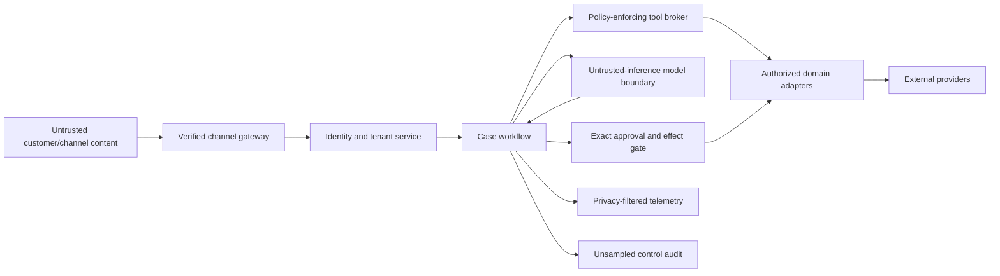

# Security, Privacy, Tenancy, and Abuse Resistance

**Status:** Research-backed Pass-1 draft  
**Research current through:** 2026-08-31  
**Prerequisites:** [Scope and authority](01-scope-workload-fit-and-authority.md), [actions and effects](05-actions-approvals-effects-and-reconciliation.md)

Customer support sits on an adversarial boundary. It receives untrusted text and files, handles identity recovery and private account facts, and may control money, service, orders, or entitlements. Friendly conversation, possession of case history, caller ID, an email address, or a convincing explanation must never expand authority.

## Threat model

| Threat actor or source | Objective | Common path | Required boundary |
|---|---|---|---|
| Account attacker | Learn account facts, recover access, redirect value, cancel service | Social engineering, prior-ticket details, spoofed channel, urgency | Independent identity/ownership checks and step-up; recovery outside model |
| Fraudulent customer | Obtain duplicate/exception compensation | Repeated contacts, channel hopping, ambiguous provider state | Related-effect lookup, stable case/customer identity, deterministic limits, specialist route |
| Prompt injector | Change agent instructions or trigger tools | Ticket text, signature, attachment, article, CRM note, provider field, fetched web page | Treat all retrieved content as data; typed broker and external policy enforcement |
| Malicious or compromised employee | Cross-tenant access, unauthorized exception, audit suppression | Broad support role, approval abuse, exported transcript | Least privilege, separation of duties, exact approval, immutable audit, review |
| Compromised connector/provider | Exfiltrate context or forge outcomes | Tool response, webhook, dependency update | Pinned/versioned connectors, signatures, allowlisted schemas, reconciliation |
| Accidental insider or model | Leak personal data or secrets | Prompts, traces, handoffs, screenshots, cross-case memory | Minimum fields, redaction, content-off telemetry, retention/deletion, isolation |
| Denial-of-service actor | Exhaust tokens, queues, humans, or provider limits | Long/repeated messages, attachments, recursive demands, event flood | Admission limits, quotas, budgets, deduplication, per-tenant fairness, degradation |
| Supply-chain attacker | Alter model/runtime/tool behavior | Dependency, prompt, model alias, MCP server, diagnostic content | Pinning, provenance, eval gates, canary, scopes, kill switches, rollback |

Threat-model the full lifecycle: channel intake, identity binding, retrieval, model context, tool call, approval, provider effect, delivery, tracing, quality review, memory, export, deletion, and incident response.

## Trust boundaries



The model is inside the application but outside the authority boundary. Model output, retrieved instructions, tool annotations, confidence, and safety classifications are untrusted until the application validates them. External provider responses are authenticated observations, but high-impact postconditions still require semantic verification.

## Identity and social-engineering controls

- Use the identity service's authenticated session, object ownership, authenticator event, recovery, and step-up result. Never let the support model invent proofing factors.
- Bind the exact tenant, account, order/subscription, and effect target. Authentication to one account does not authorize another.
- Set assurance freshness by risk and re-check it before protected disclosure or D3 commit.
- Do not accept secrets, one-time codes, full payment credentials, recovery keys, or passwords in conversation. If received, minimize display, suppress propagation, and follow the incident/data-handling procedure.
- Avoid knowledge-based authentication from data that attackers can buy or infer. Do not reveal whether a guessed account, address, order, or recovery factor is correct.
- Route identity disputes, SIM/email compromise, account takeover signals, recovery, and vulnerable-customer scenarios to trained specialists.
- Rate-limit proofing and compensation across case, customer, account, channel, device/session, payment object, and time windows using privacy-reviewed signals.

Behavioral fraud scoring and sentiment can prioritize review but must not silently deny legitimate support or substitute for evidence. Document appeal and human review paths for impactful decisions.

## Prompt-injection defense

All customer messages, attachments, OCR, email signatures, knowledge articles, case comments, provider descriptions, web pages, and tool outputs may contain adversarial instructions. Apply layered controls:

1. keep system task, authority, operations, and stops structurally separate from data;
2. filter retrieval by tenant/access/applicability before it reaches the model;
3. expose only operations needed for the current state and authority class;
4. validate every tool request against case/tenant/object bindings and schema;
5. prevent model text from selecting credentials, destinations, scopes, approval principals, or idempotency identities;
6. independently revalidate all D3 proposals at commit;
7. inspect outputs for secrets, unsupported protected claims, unauthorized commitments, and cross-customer references;
8. log structured injection/security signals without copying unnecessary malicious content;
9. test direct, indirect, multilingual, encoded, fragmented, and tool-output injection.

Content filters and model guardrails can reduce risk but are not the security boundary. They can fail, be scoped only to certain turns, or miss side effects. Enforcement belongs at the tool and effect boundary.

## Permission architecture

```yaml
runtime_principal:
  service: "customer-support-agent"
  tenant_id: "tenant_1"
  case_id: "case_123"
  session_id: "session_8"
  subject_id: "customer_subject_9"
  allowed_operations:
    - "case.read"
    - "knowledge.search"
    - "billing.charge.list"
    - "resolution.propose"
  field_policy: "support-billing-read-v5"
  object_bindings:
    customer_id: "customer_9"
    account_ids: ["account_5"]
  expires_at: "2026-08-31T10:10:00Z"
  effect_grants: []
```

Issue short-lived, case-scoped capabilities where practical. Separate read, draft, delivery, effect, reconciliation, and administrative principals. Store credentials in the platform's secret manager, never prompts, cases, memory, traces, source control, or browser storage. Rotate and revoke without redeploying prompts. A write connector should not be usable from the model process; the effect worker receives one exact authorized command.

For human approvals, record the approver's current principal and roles, enforce separation of duties for higher risks, prevent the requester from editing approved fields, and re-check permissions at decision/commit as policy requires. Emergency access is time-limited, separately reviewed, and never hidden in normal agent tools.

## Tenant isolation

Enforce tenant isolation at every layer:

- derive tenant from authenticated control context, never model/customer-provided tool arguments;
- use tenant-scoped credentials, provider accounts, encryption keys, storage partitions, indexes, caches, queues, and quotas where risk requires;
- include tenant in every case, event, evidence, approval, effect, delivery, audit, and idempotency lookup key;
- filter before retrieval rank and again before context construction;
- bind asynchronous callbacks to the expected provider account and tenant;
- prohibit cross-tenant tool result caching and unkeyed model/context caches;
- test identifiers, logs, exports, handoffs, memory, and failure paths for isolation;
- make bulk or cross-tenant administration a separate D4 control plane unavailable to the resolver.

A globally unique-looking object ID is not an isolation control. A signed webhook proves the provider sent it, not that the event belongs to the currently selected tenant; validate provider account and object mapping.

## Privacy and data lifecycle

Map data by purpose rather than collecting a universal transcript:

| Data | Purpose | Model exposure | Retention/control direction |
|---|---|---|---|
| Identity assurance and bindings | Authorize disclosure/action | Minimal status and opaque refs | Identity policy; no secret authenticators |
| Customer messages | Understand and document case | Relevant excerpts only | Channel/case retention, access, export, correction/deletion process as applicable |
| Account/order/billing facts | Diagnose and resolve | Minimum permitted fields | Domain-system retention; evidence refs in case |
| Payment credentials or passwords | None in agent reasoning | Prohibited | Divert to approved secure flow; incident handling if received |
| Policy/product knowledge | Ground decisions | Applicable excerpts with versions | Knowledge governance and effective dates |
| Model inputs/outputs | Produce proposal/response | Intrinsic, minimized | Provider configuration, regional/contract controls, explicit retention decision |
| Traces/logs | Diagnose service | Structured metadata by default | Content off by default; shorter access and retention where possible |
| Control audit | Prove identity/policy/approval/effect | Opaque refs and normalized decisions | Unsampled, integrity-protected, policy-defined retention |
| Quality/eval samples | Improve system | Redacted/pseudonymized fixtures preferred | Selection purpose, reviewer access, expiry, deletion and provenance |
| Long-term preference | Accessibility/locale/contact preference | Typed value only when needed | Opt-in/purpose-limited where applicable; customer control and expiry |

Apply data minimization, purpose limitation, access control, retention, deletion, and regional processing according to the organization's legal and privacy assessment. Regulations differ; this blueprint does not determine whether a specific law or consent basis applies. Preserve legally/audit-required records while still supporting deletion or de-identification of unnecessary content through referenced, separately governed stores.

Model-provider retention and storage settings are not interchangeable. For example, an API may offer stored response/conversation state with different lifetimes from stateless calls. Configure them deliberately, verify contracts and regional controls, and keep authoritative records in application systems. Previous-turn context can also increase token cost and data exposure even when conveniently referenced.

## Sensitive-content handling

Before model context or telemetry:

- allowlist fields by task and authority class;
- tokenize or redact secrets, full payment credentials, government identifiers, health data, and other prohibited classes according to policy;
- retain an evidence reference and digest when raw content must remain in a protected domain store;
- prevent customer-supplied URLs or attachments from automatic fetch/execution outside a sandboxed, content-scanning path;
- limit image, audio, and transcript processing to approved providers, locales, and purposes;
- test redaction for Unicode, OCR, speech transcription, quoted messages, attachments, and structured tool output;
- deny or route when safe redaction fails rather than sending raw data by fallback.

Never ask a customer to paste card numbers, passwords, one-time codes, private keys, session cookies, recovery codes, or secret support tokens. Payments should use the organization's approved hosted or otherwise compliant payment flow, outside the model conversation.

### Voice recording and transcript protection

Telephone support, call recording, transcription, translation, sentiment/quality analysis and training reuse are separate purposes. Before recording, a deterministic policy must evaluate participant locations, channel, notice/consent evidence, customer refusal, employee/workforce notice, product/provider configuration and applicable organizational legal guidance. Service-message or channel consent does not imply recording consent.

Keep call progress, recording availability, transcript availability, delivery to storage and deletion as separate states. Store raw audio/video in a restricted artifact store; expose only necessary time-coded utterances with speaker/channel confidence to the resolver. Mask or pause approved recording paths before collection of payment/authentication secrets where provider and policy require it. Never enable a raw-media fallback when redaction, consent or storage controls fail.

Recording/transcript poisoning tests include spoken prompt injection, malicious hold music/IVR, participant impersonation, mixed or swapped channels, mistranscription of negation/amounts, translated meaning drift, late correction, missing tail audio and deleted media referenced by an old summary. No transcript statement can establish identity, policy eligibility, effect success or customer confirmation without the owning evidence/control.

## Abuse and misuse controls

| Abuse pattern | Control | Customer-safe handling |
|---|---|---|
| Repeated refund attempts across channels | Related-case/effect query, semantic intent key, per-policy limits | Explain review status without revealing anti-fraud logic |
| Prompt/token exhaustion | Size limits, attachment quotas, summarization in isolated read path, hard budgets | Ask for focused information or hand off |
| Harassment or harmful content | Workforce safety policy, channel limits, human review | Maintain service access consistent with policy; protect staff/model context |
| Bulk automated submissions | Admission quotas, bot/rate signals, tenant fairness, proof-of-work/auth where appropriate | Preserve urgent/safety and legitimate accessibility paths |
| Malicious attachment/link | No automatic execution; scanning/sandbox; typed evidence extraction | Request safe alternative or specialist review |
| Insider bulk export | Separate admin plane, least privilege, just-in-time access, immutable audit | Not available to the resolver |
| Model coerced to reveal policy thresholds | Output and source-access rules | Give customer-facing policy, not internal control details |

Rate limits must not strand active high-impact reconciliation or required safety contacts. Reserve separate budgets and design appeals/accommodations.

## Audit versus diagnostic telemetry

Maintain two planes:

- **Control audit:** unsampled, integrity-protected records of identity binding, access decision, policy version/decision, approval, effect intent/attempt/receipt/reconciliation, case transition, delivery outcome, release manifest, and operator intervention.
- **Diagnostic telemetry:** metrics and sampled traces for latency, errors, model/tool behavior, and cost. Use opaque case/evidence/effect references; prompt/tool content is off by default and enabled only through an approved, time-bounded diagnostic mode.

Trace headers must not contain personal or sensitive data. Access to audits and diagnostic content is itself audited. Redaction at the UI is insufficient if raw content already reached exporters or vendor storage.

## Security incident controls

Independent controls must be able to:

1. stop new agent admission;
2. disable one effect type/provider/tenant without disabling read-only support;
3. revoke/rotate model, channel, support-platform, knowledge, and effect credentials;
4. switch to deterministic public information, draft-only, or human-only mode;
5. freeze long-term memory writes and quality-sample promotion;
6. preserve case, audit, trace-reference, connector-version, and release evidence;
7. enumerate and reconcile active/unknown effects and undelivered notices;
8. quarantine affected cases, tenants, connectors, knowledge versions, or model manifests;
9. roll back runtime/model/prompt/tool configuration and drain old workers;
10. notify customers, regulators, providers, or internal owners according to the approved incident plan.

Do not depend on the same model loop, connector, or policy path being investigated to execute containment.

## Security failure matrix

| Failure | Severity | Immediate action |
|---|---:|---|
| Cross-tenant evidence in context or response | Critical | Stop affected path, preserve evidence, revoke access, incident and notification assessment |
| Unauthorized refund/cancellation | Critical | Disable effect class, reconcile all recent intents, assess compensation and credential/policy compromise |
| Prompt injection reaches blocked tool | High near miss | Retain structured attempt, verify no effect, add eval and review broker coverage |
| Sensitive content exported to traces | High | Stop exporter/content capture, restrict access, delete where permitted, rotate exposed secrets, assess scope |
| Identity recovery handled by model | Critical design defect | Disable recovery route; move to identity service/specialist |
| Approval reused after edit/expiry | Critical control defect | Stop operation, reconcile affected effects, invalidate approval mechanism |
| Webhook signature validation regression | High | Quarantine events, restore validated verifier, replay authenticated backlog |
| Customer memory contains unsupported allegation | High privacy/quality defect | Freeze memory, remove/correct through governed path, assess affected decisions |
| Call recorded without required notice/consent or after withdrawal | Critical privacy defect | Stop recording path, restrict/delete where required, preserve control evidence, assess notification and provider configuration |
| Deleted/corrected content reappears from summary, embedding or eval sample | High lifecycle defect | Freeze affected retrieval/memory, follow derivation lineage, invalidate and delete/tombstone, regression test |

## Stage 4 security exit gate

- [ ] The full lifecycle threat model includes customers, insiders, models, content, connectors, providers, and supply chain.
- [ ] Identity proofing/recovery and organizational authorization remain outside the model.
- [ ] Tenant is derived from authenticated context and enforced in storage, retrieval, tools, callbacks, caches, effects, and telemetry.
- [ ] Untrusted content is structurally separated from instructions and cannot expand operations.
- [ ] Read, delivery, effect, reconciliation, and administration principals are separated and short-lived where practical.
- [ ] Secrets and prohibited payment/authentication data never enter prompts, memory, cases, or telemetry.
- [ ] Every data class has purpose, field policy, model exposure, location, retention, access, deletion, and incident handling.
- [ ] Voice recording/transcription has independent notice/consent, secret-handling, storage, retention, deletion and reuse controls.
- [ ] Control audit is unsampled; diagnostic content is off by default and privacy-filtered.
- [ ] Cross-tenant, injection, social-engineering, approval-bypass, redaction, replay, and provider-compromise tests pass.
- [ ] Independent containment can stop admission/effects, revoke credentials, freeze memory, preserve evidence, and reconcile outcomes.

## Related guides

- [Evaluation, observability, deployment, and roadmap](08-evaluation-observability-deployment-and-roadmap.md)
- [Agent threat model](../../security/agent-threat-model.md)
- [Prompt injection and untrusted data](../../security/prompt-injection-and-untrusted-data.md)
- [Permissions, sandboxing, and secrets](../../security/permissions-sandboxing-and-secrets.md)
- [Observability and tracing](../../evaluation/observability-and-tracing.md)
