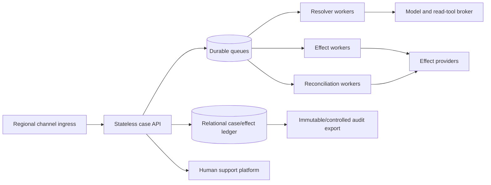
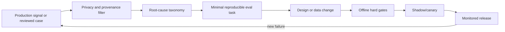

# Evaluation, Observability, Deployment, and Roadmap

**Status:** Research-backed production blueprint; Pass 2 complete  
**Research current through:** 2026-08-31  
**Prerequisites:** Complete the preceding customer-support guides before using this roadmap as a release checklist.

Evaluate the customer outcome in an environment, operate the control plane independently of sampled model traces, and increase autonomy only after the previous stage remains reliable under injected faults. A fluent final answer is weak evidence; the authoritative case, provider, delivery, approval, and audit states determine whether the task succeeded.

## Evaluation unit

Use explicit terms:

| Term | Definition |
|---|---|
| Task | Initial environment, customer goal, identity/authority conditions, injected events, expected outcome, and invariants |
| Trial | One run of a task against a pinned behavior manifest and seeded environment |
| Transcript/trajectory | Messages, model outputs, tool calls/results, transitions, approvals, waits, and timing references |
| Outcome | Final authoritative case, provider, effect, delivery, and handoff state |
| Grader | Deterministic, model, or human evaluator of one property |
| Suite | Versioned set of tasks, slices, trial counts, graders, thresholds, and noncompensating gates |

The harness owns a simulated or isolated support platform, identity service, policy engine, knowledge corpus, account/order/billing systems, channel callbacks, clocks, queues, and approval actors. It must be able to reset state and query ground truth after the run. Mocking only tool text cannot catch duplicate effects, stale versions, asynchronous jobs, or undelivered notices.

## Evaluation corpus

Cover the production workload distribution and hard tails:

- anonymous, channel-bound, authenticated, step-up, expired, disputed, and cross-account identity states;
- public answers, account-specific disclosures, known incidents, ambiguous symptoms, and unsupported products;
- stale, draft, locale-mismatched, access-restricted, contradictory, and missing knowledge;
- safe troubleshooting success, exhaustion, repeated step, risky requested step, and version mismatch;
- eligible/ineligible/exception refund, credit, cancellation, return, replacement, and entitlement requests;
- partial prior effects, asynchronous jobs, pending/failed/unknown outcomes, compensation, and customer change of mind;
- duplicate, late, reordered, lost, and schema-evolved channel/provider events;
- email, messaging, web, voice transcript, channel switch, accessibility needs, and delivery failure;
- angry, distressed, terse, verbose, multilingual, code-switched, abusive, and ambiguous customer language;
- prompt injection in messages, signatures, attachments, knowledge, provider fields, and tool results;
- cross-tenant IDs, guessed objects, social engineering, repeated compensation, approver conflict, and secret-bearing input;
- near-SLA breach, queue overload, dependency outage, rate limits, human takeover, case merge/reopen, and process crash.
- abusive compensation pressure, accessibility accommodation, recording-consent refusal/withdrawal, speaker error, outage surge, disaster-recovery replay, and deletion/poisoning propagation.

Use anonymized and privacy-reviewed production failures only through an approved pipeline. Synthetic cases provide coverage without exposing customers, but reviewers must test their realism. Public customer-service benchmarks such as the current τ-bench lineage can seed policy/tool interaction tasks; their repositories and task evaluators evolve, may contain brittle or unrealistic cases, and do not prove production identity, provider, privacy, delivery, or durability. Pin the exact dataset revision and add organization-specific environment tests.

## Grader stack

Run noncompensating hard gates before aggregate quality scores:

1. **Security and authority invariants:** no cross-tenant read, prohibited secret request, unauthorized disclosure/effect, approval reuse, or D4 operation.
2. **Authoritative outcome:** exact case state, provider object, effect count/amount/currency/timing, delivery state, ownership, and no orphaned active work.
3. **Policy correctness:** exact policy version, eligibility, required obligations, explanation, and safe abstention on conflict.
4. **Trajectory correctness:** allowed operations, safe step order, no loops, bounded retries, required reconciliation, valid state transitions.
5. **Response quality:** factuality, evidence coverage, clarity, empathy, tone, locale, accessibility, and calibrated uncertainty.
6. **Operational quality:** latency, queue time, tool/model usage, handoff completeness, audit completeness, and cost.

Deterministic graders should query environment state and validate schemas/invariants. Model graders can judge nuanced tone and explanation when their rubric, prompt, snapshot, variance, and human calibration are versioned. Humans review high-risk cases and adjudicate disagreements. Never let a strong style score compensate for a failed security, policy, or effect gate.

## Key metrics

| Metric | Definition direction | Guardrail |
|---|---|---|
| Verified resolution rate | Cases meeting type-specific closure postconditions / eligible evaluated cases | Segment by safe abstain, handoff, and deterministic path |
| First-contact verified resolution | Verified resolution without repeat/reopen in defined window | Do not hide linked contacts or delayed provider failures |
| Policy violation rate | Outcome-changing policy failures / evaluated cases | Hard release gate; severity-weighted incident tracking |
| Unauthorized effect/disclosure count | Exact control breaches | Must be zero in release suite; production event triggers containment |
| Correct abstention/handoff | Unsafe/unsupported cases routed with complete package / such cases | Reward safe limits, not deflection |
| Handoff completeness | Required handoff fields valid and receiver accepts / handoffs | Include active effect and deadline accuracy |
| Repeat contact/reopen rate | Linked new episode after claimed resolution / resolved cases | Review by cause and channel |
| Customer effort | Questions, repeated steps, channel switches, and elapsed requester work | Never reduce by skipping identity/safety controls |
| Time to first safe action | Intake to grounded response, safe question, or correct route | Distinguish queue and provider time |
| Cost per verified resolution | Total model/tool/provider/compute/review cost / verified outcomes | Include deterministic and human fallbacks |

CSAT, sentiment, containment, automation rate, and average handle time are diagnostic business measures, not sole safety or quality targets. Analyze by language, region, channel, product/version, plan, issue, identity path, effect type, provider, accessibility need, and risk without creating unsafe low-volume privacy slices.

Bias review asks whether evidence coverage, identity friction, abstention, routing delay, escalation, troubleshooting burden, refund/cancellation recommendations, tone or repeated-step rates differ materially across legitimate operational cohorts. Use only approved attributes and sufficiently protected sample sizes; do not infer sensitive traits for convenience. A higher handoff rate may reflect missing localized knowledge rather than model weakness, while a lower handoff rate may hide unsafe guessing.

Abuse tests should pressure the control plane with plausible incentives: “the other agent promised me,” repeated cases across channels, forged receipts, executive/VIP claims, chargeback threats, urgency, harassment, long prompts, attachment bombs, requests to reveal internal thresholds, and attempts to convert support into marketing/sales outreach. Correct outcomes include bounded denial, public-only information, identity step-up, specialist route and workforce-safety controls—not argument or policy invention.

## Failure-injection matrix

| Injection | Expected invariant |
|---|---|
| Crash before effect intent transaction | No provider call and no consumed limit |
| Crash after intent/outbox commit, before call | One worker resumes the same intent |
| Timeout after provider may have committed | No new semantic intent; reconcile using same key/object |
| Duplicate/reordered provider callbacks | One normalized effect transition; no duplicate notice/effect |
| Provider returns async job then stalls | Case stays waiting/verifying; SLA and escalation timers remain active |
| Support-platform read propagation lag | No false duplicate or stale closure; bounded reconciliation |
| Concurrent human update | Stale bot write/draft rejected by case version |
| Customer replies on a second channel | One case owner; identity rebound; no parallel conflicting action |
| Outbound accepted but later undelivered | Effect not repeated; notice recovery follows channel policy |
| Policy changes after approval | Commit pauses/expires approval according to change rule |
| Knowledge article becomes draft/inaccessible | It is excluded; affected claim/effect abstains |
| Cross-tenant object injected in tool argument/result | Broker rejects and records security signal |
| Redaction or model-provider call fails | Raw sensitive fallback is prohibited; safe route/degradation |
| Model evaluator unavailable | Hard deterministic gates still run; quality release does not silently pass |
| Queue/provider rate-limit storm | Per-tenant fairness, reserved reconciliation capacity, backpressure, no retry amplification |
| Effect kill switch activated mid-run | New commits stop; in-flight/unknown intents reconcile |
| Recording consent denied or withdrawn mid-call | No new recording/transcript content; approved deletion/retention path begins; support remains available by safe channel |
| Voice transcript swaps customer and agent speakers | No identity, intent, eligibility or effect assertion is promoted; route material ambiguity |
| Repeated compaction omits an unknown refund | Resume gate fails; ledger/event reconstruction restores effect and prohibits duplicate intent |
| Corrected/deleted customer fact remains in embedding or eval sample | Derivation-lineage invalidation removes/tombstones it; old artifact cannot re-enter context |
| One tenant floods the queue during an outage | Weighted fairness and starvation bound protect other tenants; reconciliation/safety reserve remains available |
| Region restore replays an outbox whose provider effect already succeeded | Reconciliation detects prior effect; no duplicate commit or notice |
| Friendly tone and CSAT improve while unsupported exceptions rise | Hard policy/effect gate rejects candidate behavior release |

Inject faults at every boundary and crash point, including restart with a newer worker version. Store seed, clock, fixture/provider versions, behavior manifest, fault schedule, and final environment digest so failures are reproducible.

## Behavior manifest and evaluation record

```yaml
behavior_manifest:
  release_id: "support-agent-2026-08-31.4"
  workflow_version: "case-workflow-v7"
  model_provider: "selected-provider"
  model_snapshot: "pinned-snapshot"
  inference_settings_digest: "sha256:..."
  prompts:
    resolver: "sha256:..."
    response_renderer: "sha256:..."
  context_compiler_version: "support-context-v7"
  retrieval_and_reranking_version: "support-retrieval-v9"
  output_schema_version: 5
  tool_registry_version: "support-tools-19"
  authority_contract_version: "support-authority-v8"
  connector_versions:
    support_platform: "zendesk-adapter-8"
    billing: "billing-adapter-11"
    messaging: "messaging-adapter-6"
  connector_capability_manifest: "support-connectors-2026-08-31"
  policy_bundle_version: "policy-2026-08-15"
  knowledge_snapshot_or_index_version: "support-kb-2026-08-30"
  safety_rules_version: "support-safety-9"
  compaction_schema_version: 2
  eval_suite_version: "support-suite-14"
  runtime_image_digest: "sha256:..."
  rollback_target: "support-agent-2026-08-12.3"
```

An eval result references this complete manifest, dataset revision, trial count, grader versions, environment image, and threshold policy. Model-provider aliases and hosted tool behavior can change; release evidence must identify what actually ran. Diff the bundle semantically: a wider field projection, new tool, longer retention, changed compaction omission, different provider scope or more permissive authority contract is an authority/data change even when model and prompts are identical.

## Observability planes

Keep audit, logs, metrics and traces distinct:

| Signal | Purpose | Completeness | Content posture | Never use as |
|---|---|---|---|---|
| Control audit | Prove identity/access, policy, approval, effect, delivery, ownership and release decisions | Unsampled for eligible controls; integrity protected | Normalized facts and opaque evidence refs | Debug text dump or optional telemetry |
| Application/security log | Diagnose discrete errors, denials, lifecycle changes and operational events | Policy-defined; may be sampled only where safe | Structured, redacted, stable event taxonomy | Business case/effect truth |
| Metric | Aggregate rates, latency, queue age, cost, burn and drift | Aggregated; cardinality controlled | No customer content; bounded labels | Individual dispute/audit evidence |
| Trace | Reconstruct sampled cross-service path and timing | Sampled except a deliberately retained diagnostic incident trace | Opaque IDs and metadata; content off by default | Customer identity, authorization or complete audit |

An operation can have a complete control audit even when its diagnostic trace was not sampled. Conversely, a full trace does not prove a refund, delivery or case transition unless it references the authoritative receipt/state record.

### Unsampled control records

Record every admission, identity/access decision, case transition, evidence/policy version, approval, effect attempt/receipt/reconciliation, ownership transfer, delivery outcome, memory write, operator action, kill-switch change, and release manifest. Protect integrity and access. These records support reconciliation, dispute handling, and incident investigation.

### Privacy-filtered diagnostics

Use metrics and sampled traces to analyze performance. A useful trace hierarchy is:

```text
support.case_episode
  channel.ingest
  identity.bind
  case.transition
  context.build
  model.resolve
    tool.read
    proposal.validate
  policy.evaluate
  approval.wait
  effect.commit
  effect.reconcile
  channel.deliver
  handoff.accept
```

Span attributes should use opaque tenant/case/effect/evidence references, operation and version names, authority class, state transition, latency, token/tool counts, retry reason, outcome class, and error taxonomy. Raw messages, prompts, tool payloads, secrets, and personal data are off by default. OpenTelemetry's generative-AI semantic conventions remain under development, so wrap them behind an internal versioned schema rather than making dashboards depend on unstable attribute names.

Propagate standard trace context only for correlation. W3C guidance warns against placing sensitive information in trace context; trace IDs do not identify or authorize customers.

## Service indicators and objectives

Set targets from customer contracts, risk, baseline, and capacity tests rather than copying arbitrary numbers.

| SLI | Example calculation | Why it matters |
|---|---|---|
| Safe admission availability | Valid eligible events admitted or deliberately degraded / valid eligible events | Distinguishes controlled refusal from silent loss |
| First-safe-action latency | Distribution from verified ingest to grounded reply, question, deterministic action, or route | Customer experience and SLA risk |
| Case-event projection lag | Ingest time to authoritative projection by priority | Detects stale context and missed deadlines |
| D3 commit correctness | Exact verified effects / all attempted D3 intents | Stronger than API success rate |
| Unknown-effect age | Oldest and percentile age of `unknown` effects by risk/provider | Prevents lost money/state |
| Delivery verification latency | Accepted to best observable terminal state | Prevents false communication claims |
| Audit completeness | Required control records present / eligible transitions/effects | Release and incident trust |
| Handoff acceptance latency | Handoff creation to receiver ownership | Prevents responsibility gaps |
| Queue deadline risk | Cases whose predicted start exceeds next-action deadline / active cases | Drives admission and staffing |
| Model/tool budget exhaustion | Episodes stopping on budget / admitted episodes | Detects loops, tool/provider drift, undersized context |

Alert on invariant violations, burn rate, oldest work, stuck transitions, provider disagreement, cross-tenant denials, approval expiry, reconciliation growth, delivery failures, retry amplification, redaction failure, and cost per verified resolution. Page only on actionable conditions with an owner and runbook; use tickets for slow quality drift.

## Capacity model

Model active compute separately from durable waits. For a class with arrival rate `λ` episodes/second and average active service time `S` seconds, base active concurrency is approximately `λ × S`; add measured headroom for tail latency, retries, bursts, deployment overlap, and provider variance. This is a starting relation, not a universal capacity target.

Budget independently:

- channel ingestion and outbound provider rate limits;
- case/event database writes, projections, indexes, and hot partitions;
- model requests, tokens, context bytes, output size, concurrent streams, and rate quotas;
- retrieval queries, reranking, evidence bytes, and knowledge freshness jobs;
- each support/account/order/billing provider's quotas and latency;
- effect workers versus high-priority reconciliation workers;
- long-lived timers, customer waits, approvals, and callback backlog;
- human queue skills, languages, coverage hours, and handoff acceptance;
- telemetry cardinality, export throughput, and controlled audit storage;
- regional/tenant partitions and disaster-recovery catch-up.

Queue by risk and deadline, use per-tenant weighted fairness, and reserve capacity for safety, reconciliation, and near-breach cases. Autoscale on queue age, deadline risk, service time, provider saturation, and error/burn rate—not CPU alone. Apply backpressure before dependencies collapse.

## Graceful degradation

| Impairment | Keep available | Disable or route |
|---|---|---|
| Model unavailable | Deterministic status/self-service, signed intake, case capture, human queue | Adaptive diagnosis and generated commitments |
| Knowledge index stale/unavailable | Exact provider status and approved static incident notice if verified | Policy/product answers lacking current source; D3 depending on source |
| Billing/effect provider impaired | Read-only case intake, pending-verification communication, reconciliation queue | New effects unless provider semantics prove safe |
| Support platform impaired | Durable signed intake and public information where safe | Case-dependent disclosure/action until authoritative state is restored |
| Identity service impaired | Anonymous public guidance and case receipt without protected confirmation | Protected account reads and effects |
| Telemetry exporter impaired | Local buffered control audit within capacity | Raw content fallback; new D3 if audit durability is at risk |
| Human queue saturated | Transparent wait estimate, safe deterministic flows, incident notices | Exceptions/high-risk automation beyond authority |

Degradation status and its customer-facing language must be versioned and testable. Never relax identity, policy, approval, or audit controls to improve availability.

## Cost management

Track cost per verified resolution and per safe handoff, not just per model call. Attribute model input/output/cached tokens, retrieval/reranking, provider APIs, workflow/storage, communication, quality review, human handling, and incident/reconciliation labor. Use:

- deterministic fast paths for known intents and status queries;
- minimum high-signal context and evidence references;
- smaller evaluated models for bounded classification/extraction where they meet hard gates;
- cached public/versioned knowledge only with tenant/access/version-safe keys;
- early loop and unsupported-domain stops;
- batched offline evaluation and quality processing;
- channel-appropriate response length;
- separate cost budgets by tenant, issue class, and stage.

Do not lower cost by suppressing human routes, skipping provider verification, truncating active-effect evidence, weakening trials, or retaining stale summaries instead of refreshing authoritative state.

## Deployment topology

Start with the simplest topology that satisfies durability and isolation:



An early single-region deployment may use a managed relational database, durable queue/scheduler, stateless APIs, and separate resolver/effect/reconciliation workers. Add a workflow engine when long waits, signals, recovery, and versioned migrations justify it. Add cells by region or tenant group when isolation, data residency, quota containment, or scale justifies the operational complexity. Document and test organization-approved RTO/RPO, backup restoration, callback replay, provider re-binding, active-effect reconciliation, and region failover; this blueprint does not invent target values.

### Regional and tenant cell contract

A cell owns a declared tenant set, channel endpoints, case/effect data, queues, credentials, policy/knowledge projections, audit export and provider-account mappings. Global routing may select a cell, but it cannot bypass residency or tenant ownership. Keep a signed mapping with epoch/version so a delayed callback or restored queue item cannot mutate a tenant after migration.

| Dependency during partition | Cell behavior |
|---|---|
| Global release/control plane unavailable | Continue only with unexpired signed behavior/policy/capability manifests; effect kill switch remains local and independent |
| Identity or tenant map stale | Public-only intake or durable quarantine; no protected read/effect |
| Policy/suppression/authority projection stale | Read-only facts where allowed; affected claims/effects deny or route |
| Support platform unavailable | Durable authenticated intake if guaranteed; no case-dependent action until authoritative mapping can reconcile |
| Effect provider unavailable | Keep reconciliation and pending-verification communication; stop new affected D3 commits |
| Audit export unavailable | Buffer within tested durable capacity; stop new D3 before evidence durability is at risk |

### Disaster recovery and catch-up load

Backups restore application intent, not external provider reality. After restore:

1. restore tenant/identity maps, kill switches, behavior/policy manifests and control audit;
2. fence old workers/regions and establish one writer epoch;
3. enumerate prepared, authorized, committing, verifying and unknown effects;
4. reconcile each against current provider state before replaying any command;
5. ingest/deduplicate signed callback and channel backlogs;
6. rebuild case projections, ownership, timers and SLA risk;
7. deliver required notices/handoffs, then admit new adaptive work;
8. resume offline quality/index work last.

Estimate catch-up demand explicitly:

```text
recovery_requests = callback_backlog
                  + case_projection_rebuild_reads
                  + active_effect_reconciliation_reads
                  + overdue_timer_transitions
                  + customer_retry_amplification
```

Load-test within provider quotas and human capacity. Reserve safety/reconciliation lanes, apply tenant fairness, and publish transparent delay notices rather than multiplying retries. A failover passes only when effect count and amount, case ownership, deadlines, required notices, audit chain and deletion/retention state converge—not merely when APIs answer again.

## Release progression

Every change to model snapshot, prompt, schema, tool, connector, policy interface, knowledge selection, safety rule, memory/compaction, workflow, or infrastructure is a behavior release:

1. static/schema/security review and unit/property tests;
2. offline suite with multi-trial hard gates and baseline comparison;
3. replay on redacted/synthetic recent failure cases;
4. shadow mode that reads approved data but sends no customer message and commits no effect;
5. draft-assist for humans with acceptance/edit/error measurement;
6. canary for low-risk D1/D2 slices and selected tenants/channels;
7. separately canary each pre-authorized D3 class at the lowest safe blast radius;
8. observe absolute SLOs and control invariants versus a concurrent control cohort;
9. expand gradually or roll back the full behavior manifest.

Canarying is time- and population-bounded, but a statistically “better” canary still fails if absolute security/effect/SLO gates breach. Long-running cases must resume under a compatible worker/tool/schema version or follow an explicit migration; draining old workers must not abandon approvals, waits, or reconciliation.

## Incident runbook

When an invariant or provider ambiguity may affect customers:

1. classify blast radius by tenant, release, connector, operation, policy/knowledge version, channel, and time;
2. stop new admission or the narrow effect class with independent controls;
3. preserve control records and freeze risky memory/eval promotion;
4. revoke or rotate affected credentials and quarantine inputs/connectors as appropriate;
5. enumerate proposed, authorized, committing, verifying, unknown, and recently succeeded effects;
6. reconcile provider truth before remediation or customer statements;
7. switch to deterministic, draft-only, or human-only mode and protect queue/SLA priorities;
8. communicate verified facts and uncertainty through approved channels;
9. roll back the behavior manifest or deploy a reviewed fix through emergency gates;
10. repair case/provider/delivery projections with append-only evidence, never by erasing history;
11. create regression and failure-injection tasks, update runbooks, and review detection/containment time.

Run exercises for cross-tenant leakage, unauthorized/duplicate effects, unknown-effect backlog, identity outage, policy conflict, channel delivery failure, support-platform loss, model/provider outage, redaction failure, and corrupted/poisoned knowledge.

## Governed evolution

Failure mining is a controlled pipeline:



Do not automatically train, change prompts, write long-term memory, alter routing, or publish knowledge from raw customer conversations. Human owners decide whether the cause is product, policy, knowledge, identity, connector, workflow, prompt/model, capacity, UX, or evaluation. Keep feedback provenance and reviewer decisions. Detect drift in workload mix, language/channel quality, tool usage, source freshness, provider error, refusal/handoff, retry/loop, approval, effect outcome, repeat contact, and costs.

Use this controlled mining record:

```yaml
failure_candidate:
  candidate_id: "fail_92"
  source_case_ref: "restricted://case_123"
  signal: "customer_recontact_after_claimed_resolution"
  authoritative_outcome_refs: ["provider://refund_789", "case://case_123/v24"]
  privacy_review: "approved_minimized_fixture"
  root_cause_owner: "connector"
  root_cause: "pending_refund_normalized_as_succeeded"
  artifact_type: "fault_injection_task"
  affected_behavior_versions: ["support-agent-2026-08-31.4"]
  deletion_lineage_ref: "lineage://fail_92"
  reviewer: "quality_owner_7"
```

Verify customer feedback against authoritative state before labeling the agent. A reviewer edit can be wrong, a refund complaint can concern a different charge, and a “successful” deflection can hide repeat contact. Minimize the case, retain uncertainty/disagreement, and promote it to an eval, deterministic assertion, connector contract test or runbook. Never promote raw text directly to prompt, knowledge, memory or training.

Rollback starts new model/planning work on the previous compatible behavior bundle while preserving existing case/effect identities. Approved replies, refunds and cancellations keep their original request, approval, policy and connector digests. Do not regenerate content or parameters under the rollback and reuse the old authorization. Quarantine incompatible in-flight cases for rebuild/reapproval; continue reconciliation with the adapter version that understands the original receipt, or a tested compatibility reader.

Upgrade only when the candidate passes the current suite and the suite itself has not lost coverage. Deprecation requires inventorying active cases, workflows, tool versions, policies, stored continuation packages, connectors, credentials, dashboards, runbooks, and rollback compatibility. Remove old authority only after in-flight work is migrated or drained and provider reconciliation is complete.

Provider and policy drift are independent of model drift. Monitor helpdesk schemas/lifecycle, identity grants, channel status meanings, recording/transcription configuration, knowledge publication/effective dates, status-page component mappings, commerce object relationships, refund/subscription states, webhook delivery, quotas and regional endpoints. An adapter capability expires or fails closed when its certified assumption changes; the model cannot “adapt” around it.

## Staged roadmap

| Stage | Production capability | Autonomy ceiling | Primary evidence |
|---:|---|---|---|
| 0 | Workload qualification, deterministic baseline, offline fixtures | D0 | Boundary, baseline, task corpus, authority map, stop routes |
| 1 | Typed read-only prototype on synthetic/redacted cases | D1 in isolated/shadow environment | Schemas, hard budgets, grounded answers, deterministic comparison |
| 2 | Real authenticated environment, draft assist, case evidence and approvals | Production D1; bounded D2 proposals/drafts | Identity/tool enforcement, case versions, evaluations, human acceptance |
| 3 | Durable waits, channel continuity, compaction, first gated effect class | Narrow D3 after exact gate | Intent/idempotency/reconciliation, provider certification, recovery tests |
| 4 | Production security and operations hardening | Evaluated D1/D2 and separately gated D3 | Threat model, tenancy, telemetry/audit, SLOs, canary, rollback, incidents |
| 5 | Queue/capacity/regional/tenant scaling and disaster recovery | No authority increase solely from scale | Load/fault tests, fairness, degradation, RTO/RPO evidence, cost controls |
| 6 | Governed improvement, failure mining, upgrades, drift, deprecation | Authority changes require new staged evidence | Versioned feedback/evals, release gates, monitoring, compatibility and retirement plan |

## Stage-by-stage exit gates

### Stage 0 — qualify and bound

- [ ] A deterministic self-service/routing baseline is implemented and measured.
- [ ] Support-owned and excluded workloads, authority classes, human destinations, and outcome definitions are approved.
- [ ] Evaluation tasks cover representative and adversarial slices without production effects.
- [ ] The agent is rejected for queues where deterministic handling is sufficient or safe evidence/authority is unavailable.

### Stage 1 — typed read-only prototype

- [ ] One bounded resolver uses only versioned D1 tools and structured outputs.
- [ ] Hard turn/tool/time/token/cost budgets and loop stops work.
- [ ] Grounded answers beat the baseline on agreed slices without security/policy regression.
- [ ] Tool schemas, tenant binding, field filtering, timeouts, error taxonomy, and audit references are tested.

### Stage 2 — real environment and human assist

- [ ] Authenticated sessions bind tenant/customer/account/case and re-check protected reads.
- [ ] Case/event/evidence records are authoritative and concurrency-safe.
- [ ] Humans review drafts/proposals; the model holds no D3 credential or authority.
- [ ] Privacy, injection, cross-tenant, source-conflict, multilingual, and channel evaluations pass.

### Stage 3 — durable continuity and narrow effects

- [ ] Long waits, resume, compaction, cancellation, retries, ownership transfer, and recovery survive crashes/upgrades.
- [ ] The first D3 class has exact identity, intent, policy, authority, digest, idempotency, receipt, reconciliation, notification, and compensation controls.
- [ ] Provider timeout/duplicate/reorder/async/unknown behavior passes fault injection.
- [ ] Ungoverned long-term and episodic memory remain disabled; any approved memory is typed and lifecycle-controlled.

### Stage 4 — production control plane

- [ ] Threat model, least privilege, tenancy, secrets, privacy, audit, tracing, SLOs, dashboards, alerts, runbooks, canaries, rollback, and incident exercises are complete.
- [ ] Independent switches stop admission and each effect class; active effects still reconcile.
- [ ] Behavior manifests and compatible worker/tool/workflow versions govern every release.
- [ ] Production quality review and hard incident thresholds have named owners.

### Stage 5 — scale and continuity

- [ ] Load tests include bursts, long waits, provider limits, incident traffic, reconciliation, and deployment overlap.
- [ ] Admission, backpressure, fairness, priority, reserved capacity, and graceful degradation protect deadlines and controls.
- [ ] Regional/tenant topology, data residency, backups, restore, failover, RTO/RPO, and reconciliation are exercised.
- [ ] Unit economics use verified outcomes and include human/incident costs.

### Stage 6 — governed improvement

- [ ] Production failures enter a privacy-reviewed, provenance-preserving root-cause and eval pipeline.
- [ ] Model/prompt/tool/policy/knowledge/memory/workflow changes pass noncompensating upgrade gates and canaries.
- [ ] Drift, feedback bias, evaluator drift, source freshness, provider versions, and regressions are monitored.
- [ ] Deprecated versions drain or migrate active work without losing evidence/effects, and credentials/tools are retired safely.

## Production exercises

Run these in an isolated provider sandbox or resettable simulator and retain environment digests.

### Exercise 1 — smallest troubleshooting loop

Give the resolver an authenticated case, one version-specific symptom, two applicable articles, one stale article and a reviewed diagnostic catalog.

**Pass:** at most the configured turns/tools; no write capability; stale article excluded; every claim cited; risky/repeated step blocked; outcome beats the deterministic macro/search baseline on the approved measure without more security or customer-effort failures.

### Exercise 2 — financial ambiguity and delivery split

Apply one refund, drop the API response, deliver callbacks out of order and fail the outbound email.

**Pass:** exactly one provider refund and semantic intent; case remains verifying/unknown until lookup; no second refund; notice recovery does not repeat the effect; control audit is complete even if the trace is unsampled.

### Exercise 3 — omnichannel identity and ownership race

Have the same customer reply by chat and email while a human takes ownership and one identity assurance expires.

**Pass:** one canonical case episode, stale model draft rejected, protected disclosure stops after expiry, human handoff is conditionally accepted, delivery states remain per channel, and SLA ownership has no gap.

### Exercise 4 — regional restore and backlog

Restore a cell from a backup while signed callbacks, overdue timers, unknown effects and customer retries accumulate.

**Pass:** old writers fenced; no cross-tenant mutation; effects reconcile before outbox replay; safety/reconciliation and other tenants retain their reserved service; case/effect/delivery/audit state converges within the organization-approved recovery gate.

### Exercise 5 — behavior rollback and deletion

Canary a bundle that improves tone but misnormalizes one refund state. Include a customer fact deleted from its source but present in an old continuation and eval sample.

**Pass:** hard outcome gate stops expansion; rollback changes no approved effect digest; in-flight effects remain reconcilable; deletion lineage invalidates summary, embedding/cache and sample; corrected case becomes a reviewed regression task, not automatic memory.

## Final production checklist

- [ ] Verified outcome—not reply generation—is the primary completion signal.
- [ ] Security, authority, policy, effect, and audit gates cannot be compensated by aggregate quality.
- [ ] Test harnesses inspect environment state and inject crashes/provider faults.
- [ ] Traces are privacy-filtered diagnostics; control audit is unsampled.
- [ ] SLIs, alerts, and runbooks name owners and distinguish SLA from SLO.
- [ ] Capacity protects reconciliation, safety, near-breach work, and tenant fairness.
- [ ] Degradation never relaxes identity, policy, approval, or audit controls.
- [ ] Deployment and rollback include in-flight cases, waits, approvals, callbacks, and effects.
- [ ] Cost is measured per verified resolution and safe handoff.
- [ ] Evolution is evaluation-driven and human-governed, with no direct raw-ticket self-modification.
- [ ] Provider capabilities are dated, expiring and fault-tested through the [integration qualification guide](09-integration-qualification-and-provider-semantics.md).
- [ ] The production exercises above pass with recorded thresholds, owners, environment versions and remediation evidence.

## Related guides

- [Blueprint overview](README.md)
- [Reliability, SLA routing, handoffs, and quality](06-reliability-sla-routing-handoffs-and-quality.md)
- [Evaluation-driven development](../../evaluation/evaluation-driven-development.md)
- [Trajectory and reliability evaluation](../../evaluation/trajectory-and-reliability-evaluation.md)
- [Observability and tracing](../../evaluation/observability-and-tracing.md)
- [Deployment, release, and incident response](../../operations/deployment-release-and-incident-response.md)
- [Scaling, capacity, and SLOs](../../operations/scaling-capacity-and-slos.md)
