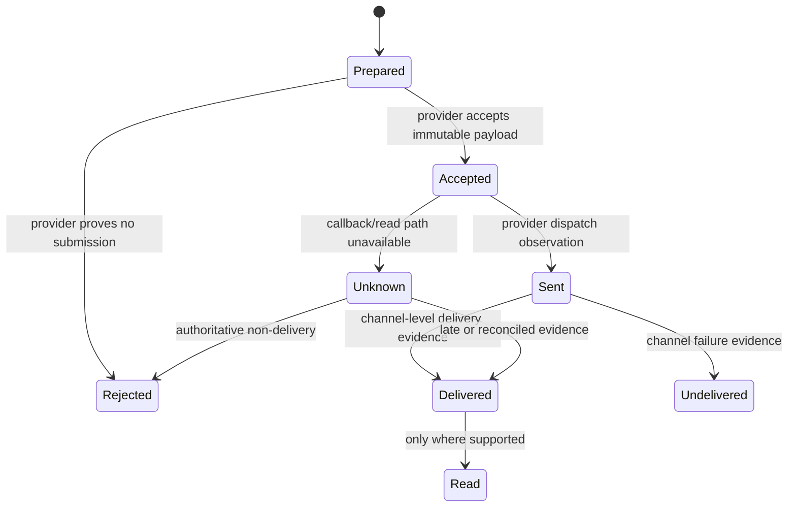
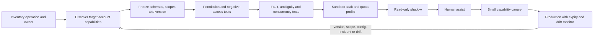

# Integration Qualification and Provider Semantics

**Status:** Research-backed Pass 2 guide  
**Research current through:** 2026-08-31  
**Prerequisites:** [Reference architecture](02-reference-architecture-runtime-and-integrations.md), [actions and reconciliation](05-actions-approvals-effects-and-reconciliation.md)

An adapter is not production-ready because authentication succeeded and a sample request returned `2xx`. It is qualified only when its exact operation, tenant/account, principal, object and field visibility, API/schema version, state model, limits, callbacks, idempotency, reconciliation, privacy lifecycle, and degraded behavior have been tested against the target provider configuration.

Qualify capabilities, not vendor logos. `zendesk.ticket.read`, `zendesk.ticket.comment.create`, and `zendesk.ticket.status.change` have different authority and failure consequences. A provider-wide “support tool” hides precisely the semantics the workflow needs to preserve.

## Capability declaration

Every operation enters the tool registry through a dated declaration backed by test evidence:

```yaml
adapter_capability:
  id: "shopify.fulfillment.read.v1"
  provider_product: "Admin GraphQL API"
  provider_api_version: "pinned-dated-version"
  certified_tenant_class: "direct-commerce-standard"
  authority_class: "D1"
  source_role: "authoritative_provider_projection"
  principal_mode: "tenant_workload_identity"
  required_scopes: ["read_orders"]
  object_bindings: ["tenant_id", "customer_id", "order_id", "fulfillment_id"]
  allowed_fields:
    - "status"
    - "updatedAt"
    - "trackingInfo"
    - "estimatedDeliveryAt"
  request_schema: "fulfillment_read_v3"
  response_schema: "fulfillment_projection_v4"
  revision_signal: "updatedAt"
  callback_or_change_signal: "provider-specific"
  reconciliation_query: "shopify.fulfillment.read"
  timeout_ms: 5000
  rate_budget: "shopify-read-standard"
  retention_and_deletion: "commerce-evidence-policy-6"
  evidence_suite: "adapter-shopify-fulfillment-12"
  certified_at: "2026-08-31T00:00:00Z"
  expires_at: "2026-11-29T00:00:00Z"
```

The declaration is server-owned. The model cannot choose tenant, credential, provider account, API version, destination, callback, query, idempotency key, or scope. A capability expires on schedule and immediately after an incompatible changelog, scope change, incident, unexplained drift, or provider-account reconfiguration.

## Qualification questions shared by every adapter

| Area | Required proof |
|---|---|
| Business ownership | Support-owned outcome, named adapter owner, incident owner, kill switch, re-enable authority |
| Identity and tenancy | Effective principal, tenant/provider-account binding, positive and negative object/field tests, step-up or delegation requirements |
| Source role | Authoritative current state, cached projection, customer statement, attributed evidence, or derived model result |
| Version | API path/header/date, SDK and schema build, plan/edition/license, regional endpoint, deprecation and changelog monitor |
| State and time | Native IDs, revisions/ETags, event and ingestion time, terminal/transient states, propagation and read-after-write lag |
| Effects | Exact request fields, preconditions, semantic intent, provider idempotency, asynchronous jobs, partial results, cancellation and compensation |
| Events | Raw-body authentication, event identity, duplicate/retry/order/loss behavior, schema evolution, gap recovery and authoritative lookup |
| Limits | Request, concurrency, pagination, batch, export, payload, attachment, callback, retention and per-account rate limits |
| Privacy and security | Purpose, scopes, data classes, model-visible fields, recording consent, location, retention, deletion, export, subprocessors and revocation |
| Operations | Sandboxes, fault tests, health probes, SLOs, quotas, dashboards, audit fields, runbook, outage mode and recovery-load estimate |

If a D3 provider has no stable intent identity and no query that can prove whether the effect occurred, keep that capability human-executed or draft-only. Do not paper over an unreconcilable effect with a prompt.

## Helpdesk, CRM, and case platforms

The support platform usually owns the business case, requester, assignee, public/internal comments, and provider lifecycle. The local workflow owns model runs, approvals, effects, delivery and reconciliation. Version and test the mapping between them.

| Provider surface | Qualification focus | Important current evidence |
|---|---|---|
| Zendesk ticket/audit/SLA APIs | Ticket status mapping, requester/submitter, audits, optimistic update conflicts, propagation lag, cursor exports, automation/SLA treatment, webhook signature and best-effort delivery | Official ticket, audit, SLA and webhook documentation; behavior is plan/configuration dependent |
| Intercom conversations/tickets/webhooks | REST version header, contact/workspace binding, resolved versus closed semantics, payload shape, body representation, permissions, webhook response deadline/retries/throttling, deletion/redaction events | Intercom documents version-dependent webhook changes; v2.15+ changed several timestamp/body shapes and distinguishes ticket resolution from conversation closure |
| Salesforce Service/Enhanced Messaging | Org/user/record/field security, on-platform versus off-platform objects, messaging session versus conversation, voice association timing, entry schemas, API choice and export behavior | Salesforce documents separate access paths and notes voice entries may associate only after a call ends; new entry types can appear |

Minimum helpdesk tests:

- human and workflow update the same case concurrently;
- an internal note is never exposed as a public reply;
- a requester changes while the workflow is active;
- “resolved” and “closed” map correctly for the pinned provider version;
- webhook duplicates, loss, delay, reorder, signature rotation and unknown fields;
- a case is visible but one customer/profile field is not;
- platform search/index lags behind an accepted update;
- support platform is unavailable during an inbound message, SLA deadline and active refund.

Use conditional writes or compare-and-reconcile. A provider status label is not automatically the application's verified closure predicate.

## Identity and customer/account systems

An identity adapter returns an assurance decision and opaque binding; it does not expose authenticators to the model. Qualify authentication session, customer/account ownership, delegated/household/business roles, step-up, freshness, recovery/dispute route, revoke/logout events, unavailable mode, and audit evidence. Email, phone, caller ID, ticket number, order number and familiar history are lookup hints, not authenticators.

Keep four independent facts:

1. who controls the current session or channel;
2. which customer/account/object it is bound to;
3. what the customer currently requests or confirms;
4. what the organization authorizes under current policy.

Test swapped account IDs, shared email/phone, recycled address, compromised session, expired step-up, delegated user with partial rights, deleted customer, recovery-in-progress and cross-tenant provider IDs. Recovery remains an identity-service or trained-specialist workflow.

## Knowledge, product telemetry, and status systems

Knowledge adapters must expose publication state, locale, audience/permission, product/version applicability, effective interval, owner, revision, correction/retraction, and retrieval time. Filter those fields before semantic ranking. An article being searchable does not make it current or allowed.

Status and product telemetry are separate evidence:

- a public status page reports published incidents and component states, not proof that a particular tenant is affected;
- tenant-safe health/feature telemetry may show actual configuration or errors but is not customer identity or policy;
- an internal incident record may be more authoritative but more restricted than the public notice;
- status text and provider error descriptions are untrusted content and cannot grant tools.

Atlassian Statuspage exposes separate page-level read APIs and authenticated management APIs. The support resolver should normally receive a read-only incident/component projection. Creating or changing a public incident is an SRE/incident-communications effect outside this blueprint. Retain page/component/incident/update IDs, provider update time, retrieval time, affected scope and publication audience; refresh before telling the customer an incident is resolved.

## Email, chat, messaging, and delivery

Separate inbound ingestion, case comment, response draft, channel send and delivery observation. Qualify sender identity, recipient binding, service-message consent/preferences, templates, locale, attachment limits, redaction, thread/conversation IDs, provider message ID, callback authentication, state transitions, retry behavior, alternate channel, quiet/accessibility rules and retention.



Map only states the provider actually exposes. Twilio messaging, Zendesk messaging and similar systems use provider-specific status vocabularies and may not prove that the intended human read a message. Intercom webhook serialization and ticket lifecycle can vary by API version. Salesforce conversation data can span on- and off-platform storage and different APIs. Persist raw provider state as protected evidence and project a small normalized state without deleting the detail required for incidents.

For required notices, define the minimum acceptable delivery evidence, wait deadline, alternate destination/channel, identity/consent recheck, and human follow-up. Notification failure never retries the underlying refund or cancellation.

## Voice, recording, and transcript controls

Voice participation, call completion, recording, recording availability, transcription, transcript association and support resolution are different states. Recording and transcription require a separately approved purpose and jurisdiction-aware notice/consent policy. Permission to provide telephone support does not automatically authorize recording, analysis, long retention or reuse for training/employee evaluation.

Twilio's official voice documentation illustrates the asynchronous boundary: call-progress callbacks can arrive out of order, recording processing has its own status callbacks, and recording availability is later than the call action callback. Its recording documentation explicitly calls out legal consent obligations and provider/configuration-specific media, PCI and transcription behavior. Salesforce likewise documents that voice entries may not associate with the voice-call record until the call ends.

```yaml
conversation_artifact:
  tenant_id: "tenant_1"
  case_id: "case_123"
  provider_call_id: "call_77"
  participant_binding_refs: ["identity://customer_9", "workforce://agent_4"]
  recording_notice_or_consent_ref: "consent://recording_12"
  recording_state: "completed"
  recording_provider_id: "recording_8"
  recording_digest: "sha256:..."
  transcript_state: "completed"
  transcript_provider_and_model: "provider-transcriber-version"
  channels: ["customer", "support_agent"]
  utterance_time_basis: "recording_offset_ms"
  retention_policy: "support-recording-3"
  delete_or_hold_state: "retained"
  retrieved_at: "2026-08-31T10:00:00Z"
```

Expose only necessary time-coded utterances to the resolver. Preserve speaker confidence, channel mapping, language, transcription/translation version, corrections and gaps. Treat spoken instructions as untrusted. A transcript can establish what the provider captured; it cannot prove identity, eligibility, account state, customer understanding, or correct speaker attribution.

Stop or route when recording consent is absent/withdrawn, participant location is unresolved under the policy, sensitive authentication/payment data enters media, speaker attribution affects a material decision, transcript quality is insufficient, retention/deletion cannot be enforced, or the provider loses the artifact. The safe fallback is an unrecorded human interaction or another approved channel—not covert recording.

## Commerce, orders, shipments, and fulfillment

Order, fulfillment order, fulfillment, package, tracking event, carrier estimate, return, replacement, inventory and refund are distinct objects. A tracking number or platform display status alone may be stale or mapped to the wrong package. Bind every read/action to the authenticated order and exact line/quantity.

Shopify's current Admin GraphQL documentation illustrates several non-obvious semantics: one order can have multiple fulfillments; tracking information and events are separate; carrier inference can be wrong if company/URL data is incomplete; cancellation may create replacement fulfillment orders; and a requested cancellation can race with work still being completed by a fulfillment service. Therefore a shipment adapter must retain native object relationships and verify dependent objects, not reduce everything to `shipped: true`.

Qualification cases include split shipments, partial fulfillment, carrier reassignment, invalid tracking URL, delayed event, delivered scan disputed by customer, fulfillment cancellation still processing, replacement stock unavailable, address change after dispatch, order cancellation spawning refund/restock/notification work, and cross-currency or tax implications. Support may propose or initiate a policy-qualified operation; inventory allocation and general fulfillment workflow remain commerce/back-office-owned.

## Subscription, billing, credit, and refund

Read and effect capabilities must be separate. Qualify invoice, charge/payment intent, settled versus authorized/pending entry, prior refunds/credits, subscription schedule, pending updates, proration, taxes, currency, provider/customer account, disputes, async states and webhook/read-after-write behavior.

Stripe and Shopify are useful provider-specific examples, not universal contracts. Stripe documents idempotency-key and refund/subscription state behavior; Shopify's dated Admin GraphQL versions expose refund, cancellation, restock, store-credit and asynchronous-job semantics. Pin the actual version and configuration, then test:

- duplicate refund request across channels and cases;
- full, partial and already-partially-refunded amounts;
- validation failure versus timeout after provider acceptance;
- refund pending, failed, canceled or requiring further action;
- subscription immediate versus period-end cancellation;
- open invoice, proration, schedule or pending update changed after preview;
- approval expires in queue;
- provider succeeds while callback and customer notification fail;
- wrong successful effect and separately authorized compensation.

The reconciliation query and exact postcondition are designed before the write is enabled. A support message promising a refund/cancellation is sent only after the policy-defined provider state is verified or clearly described as pending.

## Qualification pipeline



Promotion gates are noncompensating:

1. **Visibility:** zero unauthorized tenant/customer/object/field disclosures in positive and negative tests.
2. **Schema:** unknown fields/types quarantine or are safely ignored; no new provider data becomes model-visible automatically.
3. **Concurrency:** stale case/provider writes conflict or replan; no last-write-wins loss.
4. **Effects:** every intent has exact authorization, stable identity, receipt and provider lookup; ambiguous outcomes never create a blind new intent.
5. **Events/delivery:** duplicates, reorder, gaps, callback loss and late events converge to current provider truth.
6. **Privacy:** purpose, recording consent, field minimization, retention, deletion, legal hold, region and vendor termination are exercised.
7. **Operations:** limits, backpressure, outage mode, owner, SLO, dashboard, runbook, kill switch and catch-up load are measured.

Use safe canary records and noncustomer destinations. A canary write must never refund, cancel, disclose or message a real customer by accident.

## Hands-on exercises

### Exercise A — certify a read adapter

Choose one helpdesk or commerce read. Write the capability declaration, then test an authorized object, wrong tenant, wrong customer, hidden field, missing object, stale projection, provider `429`, timeout, schema addition and credential revocation.

**Pass:** all authorized reads preserve provider ID/revision/freshness; every negative case denies or returns a typed unavailable result; no raw secret or unauthorized field reaches model context or traces.

### Exercise B — reconcile an ambiguous refund

Make the sandbox provider apply a refund and drop the response. Restart the worker, replay the local command, and deliver duplicate/out-of-order callbacks.

**Pass:** one semantic intent and provider key exist; no second refund is created; reconciliation finds the exact amount/currency/source object; the customer gets no false failure/success claim; audit reconstructs every attempt.

### Exercise C — preserve a voice case

Simulate call completion before recording availability, delayed transcript, misattributed speaker, consent withdrawal and transcript deletion.

**Pass:** recording/transcript states remain separate; missing consent blocks recording; transcript uncertainty cannot authorize disclosure/effect; deletion propagates to context, memory and eval stores while required control evidence remains appropriately minimized.

### Exercise D — survive a provider upgrade

Change a webhook timestamp type, introduce an unknown event, split `resolved` from `closed`, and alter one rate limit.

**Pass:** old/new versions can coexist during migration; unknown events do not mutate state; drift alert stops the affected capability; backlog recovery meets the measured deadline without starving reconciliation or other tenants.

## Final adapter checklist

- [ ] Capability boundary and source/effect authority are explicit.
- [ ] Target product, account, plan, region, API/SDK/schema version and scopes are pinned.
- [ ] Tenant, customer, object and field visibility have negative tests.
- [ ] Native states, revisions, timestamps, relationships, async jobs and partial results are preserved.
- [ ] Webhooks/callbacks are authenticated, deduplicated, reorder-tolerant and backed by gap recovery.
- [ ] Effects have semantic identity, exact authorization, provider idempotency where available, and a reconciliation query.
- [ ] Delivery and recording/transcript states use only provider-observable assurance.
- [ ] Privacy, recording consent, retention, deletion, export, region and subprocessors are approved and tested.
- [ ] Outage/degradation, rate limits, backpressure, catch-up load and kill switches are exercised.
- [ ] Certification expires and has changelog/config/incident-driven refresh triggers.

## Sources

- [Zendesk Tickets API](https://developer.zendesk.com/api-reference/ticketing/tickets/tickets/)
- [Zendesk webhook operations](https://developer.zendesk.com/documentation/webhooks/creating-and-monitoring-webhooks/)
- [Intercom webhook topics and version behavior](https://developers.intercom.com/docs/references/webhooks/webhook-models)
- [Intercom REST API](https://developers.intercom.com/docs/references/rest-api/api.intercom.io)
- [Salesforce messaging conversation data access](https://developer.salesforce.com/docs/service/messaging-object-model/guide/messaging-object-model-access-data.html)
- [Salesforce Enhanced Chat server-sent event structure](https://developer.salesforce.com/docs/service/messaging-api/references/about/server-sent-events-structure.html)
- [NIST SP 800-63B-4](https://pages.nist.gov/800-63-4/sp800-63b.html)
- [Atlassian Statuspage APIs](https://support.atlassian.com/statuspage/docs/what-are-the-different-apis-under-statuspage/)
- [Twilio Voice webhooks and recording status](https://www.twilio.com/docs/usage/webhooks/voice-webhooks)
- [Twilio recording resource and legal considerations](https://www.twilio.com/docs/voice/api/recording)
- [Twilio Message resource](https://www.twilio.com/docs/messaging/api/message-resource)
- [Stripe idempotent requests](https://docs.stripe.com/api/idempotent_requests)
- [Stripe refunds](https://docs.stripe.com/api/refunds/create)
- [Stripe subscription cancellation](https://docs.stripe.com/billing/subscriptions/cancel)
- [Shopify fulfillment object](https://shopify.dev/docs/api/admin-graphql/latest/objects/Fulfillment)
- [Shopify fulfillment-order cancellation](https://shopify.dev/docs/api/admin-graphql/latest/mutations/fulfillmentOrderCancel)

