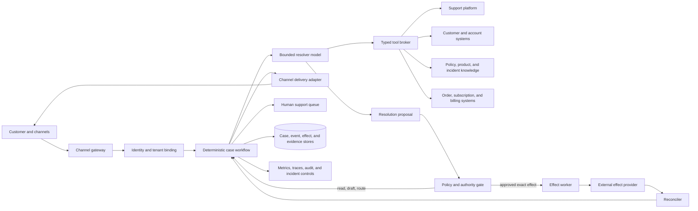

# Customer Support and Service Resolution Agent Blueprint

**Status:** Research-backed production blueprint; Pass 2 complete  
**Research current through:** 2026-08-31  
**Category:** 29 — Customer support and service resolution  
**Primary boundary:** Authenticated customer cases, policy-grounded resolution, safe customer actions, channel continuity, SLA routing, quality review, and verified outcomes

This learning path describes a production customer-support agent, not a conversational FAQ bot. Its useful unit of work is an authenticated case with authoritative state, evidence, deadlines, and sometimes consequential effects such as a refund, credit, cancellation, or entitlement change. The safest practical design is a deterministic case workflow around one bounded model-directed resolver. The model interprets language, gathers evidence, chooses safe diagnostic steps, and proposes a resolution; application services own identity, policy, authorization, side-effect commit, reconciliation, and closure.

## Scope and ownership

This blueprint owns:

- binding a customer conversation to the correct tenant, customer, account, and case;
- preserving ticket and conversation state across supported channels;
- retrieving access-controlled, versioned policy, product, incident, and account evidence;
- troubleshooting customer-facing product or service problems without unsafe guessing;
- proposing and, when explicitly authorized, executing refunds, credits, cancellations, and comparable customer-account actions;
- routing by contractual SLA, issue severity, customer impact, capability, language, and risk;
- creating a complete human handoff and resuming after a human or dependency responds;
- reconciling provider outcomes, outbound delivery, case state, and financial or entitlement effects;
- measuring policy compliance, verified resolution, repeat contact, quality, latency, cost, and operational health.

It does **not** own:

- generic page manipulation or arbitrary computer use; use the [browser-automation blueprint](../browser-automation-agent/README.md) behind a typed support connector when an API is unavailable;
- employee endpoint, workforce account, fleet, or corporate access support; use the [IT service-desk blueprint](../it-service-desk-agent/README.md);
- generic organizational case processing unrelated to a customer-support resolution; use the [back-office workflow blueprint](../back-office-workflow-agent/README.md);
- leads, opportunities, quotes, pipeline, upsell, or revenue communications; use the [sales and revenue-operations blueprint](../sales-revenue-operations-agent/README.md);
- campaign audiences, acquisition journeys, bulk messaging, promotions, advertising, or attribution; use the [marketing-operations blueprint](../marketing-operations-agent/README.md);
- the general enterprise search platform; consume the governed retrieval capabilities owned by the [enterprise-knowledge blueprint](../enterprise-knowledge-agent/README.md);
- authoring refund policy, changing approval thresholds, granting connector scopes, bulk compensation, or domain-specific regulated decisions.

Support may hand work to these systems and must reconcile their returned outcome, but it must not absorb their control planes.

## When an agent is justified

Use a model-directed agent only when the case requires several of the following at once:

- ambiguous natural-language intent or incomplete problem descriptions;
- evidence gathering across case, account, product, order, billing, status, and policy systems;
- adaptive selection among safe troubleshooting questions or steps;
- policy interpretation that still ends in a deterministic eligibility decision;
- multi-turn continuity across customer replies, provider callbacks, approvals, and handoffs;
- a response whose explanation must be tailored to the evidence and channel.

Prefer a deterministic alternative when the next action is already known. Examples include password-reset links, shipping-status lookup, a fixed cancellation form, a policy eligibility calculator, a refund status page, outage banners, routing rules, and well-scoped macros. These are cheaper, faster, easier to audit, and less vulnerable to prompt injection. A good service operation combines them: deterministic self-service handles the known path, while the agent handles bounded ambiguity and exceptions.

Do not deploy the agent when identity cannot be established for the requested disclosure or action, authoritative sources are unavailable or contradictory, the provider effect cannot be verified, applicable policy cannot be encoded and tested, or safe human escalation is unavailable.

## Reader paths

| Reader | Start here | Then read |
|---|---|---|
| Product and support operations | [Scope, workload fit, and authority](01-scope-workload-fit-and-authority.md) | [SLA routing, handoffs, and quality](06-reliability-sla-routing-handoffs-and-quality.md), then the staged roadmap |
| Agent and platform engineer | [Reference architecture and integrations](02-reference-architecture-runtime-and-integrations.md) | [Case state and channel continuity](03-authenticated-intake-case-state-and-channel-continuity.md), [resolution and memory](04-grounded-resolution-context-memory-and-planning.md) |
| Integration owner | [Integration qualification and provider semantics](09-integration-qualification-and-provider-semantics.md) | [Actions and reconciliation](05-actions-approvals-effects-and-reconciliation.md), then the fault exercises in the roadmap |
| Payments or commerce engineer | [Actions, approvals, and effects](05-actions-approvals-effects-and-reconciliation.md) | [Reliability and reconciliation](06-reliability-sla-routing-handoffs-and-quality.md) |
| Security, privacy, and risk | [Security and privacy](07-security-privacy-tenancy-and-abuse-resistance.md) | [Authority](01-scope-workload-fit-and-authority.md), then the effect lifecycle |
| SRE, QA, and release owner | [Evaluation, observability, deployment, and roadmap](08-evaluation-observability-deployment-and-roadmap.md) | [Reliability](06-reliability-sla-routing-handoffs-and-quality.md) |
| Researcher or future maintainer | [Research packet](../../research/packets/customer-support-agent-blueprint.md) | This complete learning path and its refresh triggers |

## Learning path

1. [Scope, workload fit, and authority](01-scope-workload-fit-and-authority.md) — workload decomposition, deterministic baseline, authority classes, and stops.
2. [Reference architecture, runtime, and integrations](02-reference-architecture-runtime-and-integrations.md) — hybrid control architecture, connector contracts, model boundary, orchestration, and third-party choices.
3. [Authenticated intake, case state, and channel continuity](03-authenticated-intake-case-state-and-channel-continuity.md) — identity binding, authoritative records, event schemas, concurrency, and omnichannel continuity.
4. [Grounded resolution, context, memory, and planning](04-grounded-resolution-context-memory-and-planning.md) — evidence precedence, safe diagnostics, context construction, compaction, memory classes, and bounded planning.
5. [Actions, approvals, effects, and reconciliation](05-actions-approvals-effects-and-reconciliation.md) — exact authority gates, idempotency, ambiguous outcomes, compensation, cancellation, and provider-specific effects.
6. [Reliability, SLA routing, handoffs, and quality](06-reliability-sla-routing-handoffs-and-quality.md) — routing clocks, delivery truth, retry and recovery, human handoff, closure, and quality review.
7. [Security, privacy, tenancy, and abuse resistance](07-security-privacy-tenancy-and-abuse-resistance.md) — threats, least privilege, data controls, prompt injection, fraud and social engineering, and incident containment.
8. [Evaluation, observability, deployment, and roadmap](08-evaluation-observability-deployment-and-roadmap.md) — environment-backed evaluation, failure injection, traces and SLOs, capacity and cost, releases, incidents, and Stages 0–6.
9. [Integration qualification and provider semantics](09-integration-qualification-and-provider-semantics.md) — helpdesk/CRM, contact-center, email/chat/voice, identity, knowledge/status, commerce, subscription/billing/refund, and shipment connector admission.

## Smallest useful build

Start with one authenticated web or in-app support channel and one read-only problem class:

1. Bind the session to one tenant, customer, account, product instance, and case.
2. Route obvious status and fixed-flow intents to deterministic self-service.
3. For one ambiguous troubleshooting intent, compile only current case facts, product/version, known incidents, and approved diagnostic steps.
4. Let one bounded resolver choose a read or one safe question; no write, refund, cancellation, outbound voice, or generic browser tool exists.
5. Validate every factual claim against evidence and return a draft to a human support agent.
6. Record case/evidence versions, decision, latency, tool/model budget, reviewer edit, verified outcome, and repeat contact.

Compare this with the strongest macro/search checklist on the same cases. Proceed only when the bounded resolver improves verified resolution or operator effort without worsening identity, grounding, security, customer effort, latency, or cost. This Stage 1 loop should be buildable without a workflow engine or multiple agents; a relational case record, queue, strict broker, and model API are enough.

## Representative end-to-end cases

| Case | Agent contribution | Deterministic authority | Verified completion |
|---|---|---|---|
| Mobile app fails after an upgrade | Identify version/symptoms, choose one catalogued diagnostic, explain evidence, stop on risk | Product applicability, safe-step catalog, incident scope, account visibility | Customer reports the observed check or Tier 2 accepts a reproducible handoff |
| Duplicate settled charge | Distinguish reported symptom from hypotheses, request charge facts, draft explanation/proposal | Identity, settled/authorization state, duplicate rule, exact amount/currency, refund authority | Existing or new refund object reconciles to exact terminal state and notice delivery is tracked |
| Cancel subscription at period end | Clarify immediate versus deferred intent and consequences | Ownership, current subscription/invoice/schedule state, policy, proration, exact cancellation mode | Provider subscription and dependent invoice/schedule state match preview; no false promise |
| Shipment has not arrived | Summarize order, fulfillment and carrier evidence; ask a useful question; propose route | Order ownership, carrier events, delivery promise, replacement/refund eligibility | Delivery is verified, or a logistics/back-office handoff is accepted with one owned next action |
| Fraud, legal threat, safety issue, or identity dispute | Minimum safe acknowledgment and evidence-preserving route | Specialist policy, disclosure limits, freeze controls and queue priority | Named specialist accepts ownership before the sending workflow releases responsibility |

Each case begins with authenticated truth and ends with provider/handoff truth. A fluent reply, support-platform “solved” label, model confidence, or customer sentiment is never the completion signal by itself.

## Reference architecture



The model never receives raw provider credentials or directly decides whether an effect is authorized. It asks typed read tools for the minimum evidence needed and emits structured proposals. The workflow re-evaluates current policy and state before commit, writes a durable intent, invokes a narrowly scoped effect adapter, records the receipt, and verifies the provider state. The support platform remains the authoritative business case where feasible; the local workflow ledger is authoritative for run, approval, effect, and reconciliation state. Explicit versioned projections prevent silent dual truth.

## Control declaration

This declaration is the design baseline. A deployment must replace placeholders with its real systems, classifications, retention rules, and owners.

```yaml
control_declaration:
  task_boundary:
    owns: authenticated_customer_support_cases
    excludes:
      - generic_browser_automation
      - employee_endpoint_support
      - generic_back_office_cases
      - sales_opportunity_operations
  identity:
    tenant_source: application_identity_service
    customer_binding: channel_session_plus_step_up_when_required
    trace_ids_are_identity: false
  authority:
    d0: evaluate_on_synthetic_or_redacted_fixtures
    d1: read_authorized_case_account_order_policy_and_product_state
    d2: draft_response_update_working_state_and_propose_route
    d3: exact_gated_customer_effect_or_external_commitment
    d4: proposal_only_or_prohibited
  execution:
    pattern: deterministic_workflow_with_one_bounded_resolver
    model_loop_budgeted: true
    direct_model_credentials: false
  effects:
    commit_gate: deterministic_and_independent_of_model
    durable_intent_before_commit: true
    idempotency_and_reconciliation_required: true
    provider_receipt_required_for_verified_completion: true
  durability:
    business_case_system: support_platform
    workflow_system: case_effect_ledger
    optimistic_concurrency: required
  data:
    default_context: references_and_minimum_necessary_fields
    raw_sensitive_content_in_traces: false
    ungoverned_cross_case_memory: prohibited
  evidence:
    audit_plane: unsampled_control_records
    diagnostic_plane: sampled_privacy_filtered_telemetry
  release:
    behavior_manifest: required
    shadow_then_canary: required
    independent_effect_kill_switch: required
```

## Core records and invariants

The application owns five durable records:

| Record | Purpose | Required invariant |
|---|---|---|
| `case` | Customer problem, state, owner, priority, SLA, channel, and customer binding | Every write uses an expected version; one active owner or explicit shared state |
| `evidence` | Immutable reference to a policy, product, incident, account, order, or provider fact | Source, version, retrieval time, access decision, and classification are retained |
| `resolution_proposal` | Model-produced diagnosis, questions, answer, route, or effect request | Proposal is not authority; claims cite evidence and declare uncertainty |
| `effect` | Exact requested customer-impacting operation and its lifecycle | Stable intent key; authorization digest; no terminal success without verification |
| `event` | Versioned transition or external observation | Globally unique event ID; tenant/case binding; deduplicated and replay-safe consumer |

Global invariants:

- No customer disclosure or effect is authorized by possession of a ticket number, email address, caller ID, or conversation transcript alone.
- No model-generated summary, compacted context, retrieval score, sentiment label, or trace ID is authoritative state.
- No refund, credit, cancellation, entitlement change, or binding promise commits without current state, current policy, exact scope, and an independent authority decision.
- No provider request acceptance is treated as completion; delivery and effects reach a verified terminal state or an explicit `unknown` state owned by reconciliation.
- No closed case has an unresolved high-impact effect, undelivered required notice, expired approval, or missing audit chain.

## Autonomy boundary

| Class | Typical support operations | Default treatment |
|---|---|---|
| D0 | Synthetic case simulation, offline response grading | Allowed in isolated evaluation |
| D1 | Read authorized customer, case, order, subscription, policy, known-issue, and provider state | Allowed after tenant/customer binding and field filtering |
| D2 | Ask a safe diagnostic question, draft a reply, add an internal note, propose a route, prepare an exact effect preview | Allowed within workflow and channel policy; reversible writes still audited |
| D3 | Send a binding resolution, refund, credit, cancel, change an entitlement, alter a shipment, or make another external commitment | Exact approval or narrow deterministic pre-authorization, plus commit-time policy and state checks |
| D4 | Change policies or limits, grant scopes, bulk-compensate customers, suppress audit, or train directly on raw cases | Proposal only or prohibited |

Customer confirmation and organizational authorization are separate facts. A customer can clearly request cancellation without being authorized to cancel a different account; an organization can allow a small policy-qualified refund without a human approver, but only through a narrow deterministic grant with exact limits, freshness, identity, and audit requirements.

## Definition of done

A production release is not done until all of the following are true:

- ownership and exclusions are encoded in tools, routing, prompts, tests, and operations—not only prose;
- a deterministic baseline exists and the agent beats it on agreed outcome and safety measures;
- identity, tenant, consent, and step-up rules are enforced outside the model;
- policy and product answers retain source, version, effective time, access decision, and contradiction handling;
- every D3 effect uses exact authorization, stable intent identity, commit-time revalidation, receipt capture, and reconciliation;
- event consumers tolerate duplicates, late delivery, and reordering;
- compaction preserves a versioned continuation package but never replaces raw evidence or the case/effect ledger;
- human handoff preserves identity status, customer intent, evidence, attempted steps, policy basis, effect state, deadlines, and next safe action;
- evaluation covers environment outcomes, security invariants, multi-trial reliability, language/channel slices, and injected provider failures;
- control audit is complete without relying on sampled traces or raw sensitive content;
- admission, queueing, rate limits, tenant fairness, cost budgets, graceful degradation, rollback, and independent effect shutdown are tested;
- incident runbooks can stop new work, disable effect classes, revoke connector access, preserve evidence, and reconcile uncertain outcomes;
- model, prompt, tool, policy, retrieval, and workflow changes have versioned manifests, eval gates, canaries, and rollback criteria.

## Evidence and canonical dependencies

The dated evidence, contradictions, and refresh triggers are in the [research packet](../../research/packets/customer-support-agent-blueprint.md). Cross-cutting invariants come from the [agent blueprint control packet](../../research/packets/agent-blueprint-cross-cutting-controls.md). This guide applies rather than duplicates the repository's canonical guidance:

- [Agent state and event contracts](../../runtime/agent-state-and-event-contracts.md)
- [Durable execution](../../runtime/durable-execution.md)
- [Execution boundaries](../../runtime/execution-boundaries.md)
- [Run controls](../../runtime/run-controls.md)
- [Idempotency and side effects](../../reliability/idempotency-and-side-effects.md)
- [Tool contracts](../../tools/tool-contracts.md)
- [Memory architecture](../../context-memory/memory-architecture.md)
- [Context engineering](../../context-memory/context-engineering.md)
- [Compaction and continuity](../../context-memory/compaction-and-continuity.md)
- [Evaluation-driven development](../../evaluation/evaluation-driven-development.md)
- [Observability and tracing](../../evaluation/observability-and-tracing.md)
- [Deployment, release, and incident response](../../operations/deployment-release-and-incident-response.md)
- [Scaling, capacity, and SLOs](../../operations/scaling-capacity-and-slos.md)

## Immediate stop conditions

Stop or route to a human when identity strength is insufficient, sources conflict on an outcome-changing fact, the requested action exceeds authority, a fraud or safety signal requires specialist review, the case crosses an excluded domain, required evidence is unavailable, the provider outcome is ambiguous and cannot be safely reconciled, the customer requests a channel or accessibility accommodation the system cannot meet, or the safe time budget is exhausted. A warm handoff with a complete evidence package is a successful outcome; confident guessing is not.
