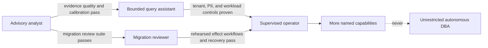

# Operating Models, Requirements, and Risk

> **Status:** Research-backed production blueprint  
> **Last researched:** 2026-08-31  
> **Scope:** Product boundary, operating modes, requirements, risk classification, and trust model  
> **Evidence:** [Research packet](../../research/packets/database-operations-agent-blueprint.md)  
> **Blueprint index:** [README](README.md)

The first architecture decision is not which model or framework to use. It is which database authority the product actually needs. A smaller authority surface is easier to secure, evaluate, operate, and explain.

## Four distinct products

| Dimension | Advisory analyst | Query assistant | Migration reviewer | Supervised operator |
|---|---|---|---|---|
| Main job | Diagnose and recommend | Answer a data question safely | Assess and shape a proposed change | Execute a rehearsed operational workflow |
| Input | Redacted telemetry and metadata | User question plus approved schema context | Migration artifact and target snapshot | Approved typed run request |
| Output | Evidence-linked finding | Parameterized query, plan, bounded result | Risk report, staged plan, verification and recovery | Effect receipts and verified outcome |
| Database privileges | Catalog/telemetry read, often via exported artifacts | Dedicated read role, preferably replica | Catalog and plan inspection; no DDL | Short-lived capability-specific role |
| Typical approval | None for analysis | Policy-gated; human for sensitive/high-cost reads | Human accepts proposal in CI/change process | Separate qualified approver binds exact effect |
| Failure blast radius | Misleading recommendation | Data exposure or workload degradation | Unsafe change reaches a human pipeline | Direct availability, integrity, or confidentiality loss |
| Production default | Enable first | Enable selectively | Keep execution outside the model path | Restrict to named, tested workflows |

These modes should have different identities, tools, budgets, user interfaces, audit events, and evaluation suites. A mode flag in a prompt is not isolation.

### Recommended progression

Promotion means enabling one capability, such as “cancel an approved runaway query,” not granting a general write role. Each new capability has its own threat model, preconditions, approval policy, test scenarios, and kill switch.

## When not to use an agent

An agent is justified only when evidence must be interpreted under uncertainty. Prefer a smaller deterministic product whenever the decision can already be specified.

| Situation | Better mechanism | Why the agent is rejected |
|---|---|---|
| A known metric threshold maps to one rehearsed response | Alert, rule, or operator runbook | Model variability adds no useful judgment and complicates incident proof |
| A fixed report or data product answers the question | Curated view, parameterized query, dashboard, or API | A stable contract is cheaper, faster, easier to authorize, and easier to test |
| A migration has a reviewed artifact and deterministic rollout | Existing CI/CD migration tool with human change control | The agent may review evidence, but it should not become a parallel deployment authority |
| An emergency needs rapid destructive action while identity, loss, or fencing is uncertain | Qualified incident commander using break-glass controls | Uncertainty raises the need for accountable human command; it does not justify autonomy |
| The organization cannot independently verify the effect or exercise recovery | Do not deploy the writable capability | Approval without outcome proof and recovery evidence is only optimism |
| Database evidence cannot be minimized enough for the model/provider boundary | Offline deterministic analysis or an approved isolated environment | Confidentiality and residency requirements take precedence over model convenience |
| The same outcome is available from a provider-native guardrail or database-native policy | Use the native mechanism and observe it | Native enforcement is closer to the resource and remains effective if the planner fails |

A rules engine and an agent may coexist: deterministic detection, admission, authorization, and response selection can surround model-assisted diagnosis. Do not route every database event through the model merely because a model is present.

## Functional requirements

### Discovery and analysis

- Resolve an immutable target identity and engine capability profile.
- Inventory schemas, objects, privileges, policies, topology, extensions, versions, and configuration through bounded catalog reads.
- Collect query fingerprints, plans, waits, locks, replication state, storage trends, backup evidence, and recent changes with provenance and freshness.
- Distinguish observed facts from inferred causes and proposed experiments.
- Produce engine-specific queries and avoid invented objects, columns, settings, or provider operations.
- Treat database comments, object names, stored text, sampled rows, logs, and tickets as untrusted content, never as agent instructions.

### Query assistance

- Parse with the target dialect; reject multiple statements, ambiguous parameters, unsupported constructs, and side-effecting functions according to policy.
- Enforce a dedicated database identity, transaction/read-only setting, tenant policy, statement and lock timeouts, row and byte limits, concurrency limit, and cancellation path.
- Prefer estimated plans. Permit actual execution only when the target, statement class, data access, and resource budget explicitly allow it.
- Return redacted, bounded results with source and snapshot metadata; never silently widen a query after an empty result.

### Change proposals and supervised effects

- Convert intent into a typed effect proposal with exact target, normalized operations, preconditions, expected effects, health gates, abort thresholds, and recovery path.
- Forecast lock, table rewrite, log/WAL, replication, storage, cache, and connection impact.
- Re-resolve target and relevant state immediately before execution; invalidate approval on material drift.
- Serialize conflicting effects and reconcile ambiguous outcomes before retrying.
- Verify database, workload, security, tenant, and application postconditions independently of the planner.

### Recovery and continuity

- Maintain evidence about backup scope, retention, encryption, dependency chains, and restore prerequisites.
- Schedule isolated restore drills and measure achieved recovery point and recovery time.
- Separate planned switchover, unplanned failover, and disaster restore workflows.
- Require fencing, routing validation, downstream service checks, and explicit data-loss acknowledgement for role transitions.

## Non-functional requirements

| Property | Minimum production requirement |
|---|---|
| Safety | Fail closed on unknown target, unknown capability, stale approval, topology drift, or failed invariant |
| Security | Separate identities by mode/environment; least privilege; short leases for effects; no credentials in model context |
| Reliability | Durable state for long workflows; idempotency/reconciliation; bounded retries; deterministic cancellation and escalation |
| Auditability | Append-only intent, proposal, approval, target fingerprint, attempts, engine receipts, verification, and artifact hashes |
| Explainability | Evidence references and confidence language; no unsupported causal certainty |
| Performance | Explicit database-load budgets; admission control; backpressure; read replica lag awareness |
| Privacy | Purpose-bound access, minimization, redaction, retention, and deletion for prompts, results, traces, and artifacts |
| Portability | Stable effect vocabulary with explicit engine/provider capability discovery—not lowest-common-denominator SQL |
| Operability | Named owner, SLOs, dashboards, runbooks, kill switch, credential revocation, incident handoff |
| Changeability | Versioned prompts, policies, schemas, adapters, eval datasets, and migration workflows with controlled rollout |

## Trust boundaries and threat model

The system handles two kinds of untrusted input at once: human or service requests and database-derived content. Either can attempt to redirect the agent, leak data, or trigger an over-broad action.

| Boundary | Representative threat | Required control |
|---|---|---|
| Request → planner | Prompt injection, hidden target ambiguity, social engineering | Authenticated caller, explicit target selector, structured intent, policy before context retrieval |
| Database → planner | Malicious table comment or row text says to reveal secrets or run SQL | Mark provenance, isolate instructions from data, minimize raw content, content scanning, no authority from retrieved text |
| Planner → policy | Fabricated confidence, obfuscated DDL, omitted side effects | Schema validation, dialect parse, normalized AST/effect diff, deterministic risk rules |
| Policy → approval | Vague approval summary hides exact target or change | Human-readable diff plus canonical artifact hash and target fingerprint |
| Approval → executor | Time-of-check/time-of-use drift | Short TTL, change window, topology epoch, commit-time preflight |
| Executor → database | Credential escape, unsafe retry, wrong target | JIT scoped credential, TLS, target attestation, idempotency key, effect lease, deny generic raw SQL |
| Database → logs/model | PII or secrets in results, plans, errors, query text | Field classification, parameter/literal scrubbing, bounded samples, encrypted artifacts, retention policy |
| Verifier → completion | Planner declares its own work successful | Independent postconditions and health monitors; no self-certification |

OWASP recommends treating external content as untrusted, applying least privilege, separating decision and execution, using structured validation, and making human approval specific to the action. Those are architecture requirements here, not prompt-writing advice. See the [OWASP AI Agent Security Cheat Sheet](https://cheatsheetseries.owasp.org/cheatsheets/AI_Agent_Security_Cheat_Sheet.html).

## Risk classification

Risk is computed from the proposed effect and current target state. The model may supply evidence, but it cannot lower the class.

### Impact dimensions

- **Integrity:** rows or schema can change, truncate, disappear, duplicate, or become inconsistent.
- **Availability:** locks, rewrites, log growth, failover, cache invalidation, or resource consumption can affect service.
- **Confidentiality:** query or observability output can cross tenant, purpose, geography, or PII boundaries.
- **Recoverability:** backup chains, replication slots, retention, recovery point, or restore capacity can be weakened.
- **Scope:** one session, tenant, table, database, cluster, region, or global service.
- **Reversibility:** transactional rollback, tested compensating change, forward-only repair, or restore required.
- **Uncertainty:** stale statistics, unknown engine support, untested plan, topology drift, or weak outcome signal.

### Example policy tiers

| Tier | Examples | Execution policy |
|---|---|---|
| R0: exported analysis | Analyze a saved plan or redacted incident bundle | No live database credential |
| R1: bounded observation | Catalog lookup, estimated plan, allowlisted metrics | Pre-authorized read tool with strict budgets |
| R2: sensitive or expensive observation | PII-bearing sample, actual-plan execution, broad scan | Purpose check; often human approval; isolated target preferred |
| R3: reversible local effect | Cancel one verified session, adjust a session-scoped setting | Qualified approval until a narrow workflow earns pre-authorization |
| R4: production change | Index build, schema migration, batch correction | Separation of duties, change window, recovery plan, live health gates |
| R5: continuity/destructive effect | Drop/truncate, restore, promote/fail over, disable protection | Incident/change commander, multi-party or break-glass policy, explicit fencing and data-loss decision |

Rules can only raise risk. Examples: an R3 action becomes R4 if it touches a primary during peak load; an R1 query becomes R2 if it accesses restricted columns or its estimated scan exceeds budget; any effect becomes R5 when target identity or recoverability is uncertain.

## Explicit non-goals

- Replacing database ownership, on-call, change management, or incident command.
- Making arbitrary production SQL safe through prompt instructions or a “read-only” prefix.
- Automatically optimizing every slow query or applying every index recommendation.
- Providing one portable abstraction that hides engine-specific DDL, locks, replication, or security behavior.
- Treating backups, replicas, snapshots, or provider guardrails as interchangeable.
- Storing a long-term privileged credential so the agent can respond quickly.
- Using model confidence, a second model, or majority voting as a substitute for authorization and verification.

## Go/no-go checklist for a new capability

- [ ] The exact business need cannot be met with a lower-authority mode.
- [ ] Target and tenant identity are machine-verifiable at commit time.
- [ ] The engine adapter explicitly supports this version, edition, and topology.
- [ ] Inputs, output, preconditions, effect, postconditions, timeout, and cancellation are typed.
- [ ] Worst-case locks, load, replication, storage, and data exposure are bounded.
- [ ] Approval and separation-of-duties policy are defined.
- [ ] Rollback or forward-recovery steps were rehearsed on production-like data.
- [ ] Ambiguous success can be reconciled without repeating the effect.
- [ ] Independent outcome and workload-health checks exist.
- [ ] Engine-specific golden, adversarial, concurrency, and failure-injection tests pass.
- [ ] Monitoring, kill switch, credential revocation, and human handoff are exercised.
- [ ] An owner accepts the residual risk and expiration/refresh date.

## Related guides

- [Agent threat model](../../security/agent-threat-model.md)
- [Prompt injection and untrusted data](../../security/prompt-injection-and-untrusted-data.md)
- [Permissions, sandboxing, and secrets](../../security/permissions-sandboxing-and-secrets.md)
- [Production agent control plane](../../architectures/production-agent-control-plane.md)

## Selected sources

- [NIST SP 800-53 Rev. 5, including separation of duties and least privilege](https://csrc.nist.gov/pubs/sp/800/53/r5/upd1/final)
- [OWASP Database Security Cheat Sheet](https://cheatsheetseries.owasp.org/cheatsheets/Database_Security_Cheat_Sheet.html)
- [OWASP Multi-Tenant Security Cheat Sheet](https://cheatsheetseries.owasp.org/cheatsheets/Multi_Tenant_Security_Cheat_Sheet.html)
- [NIST SP 800-122: Protecting the Confidentiality of PII](https://csrc.nist.gov/pubs/sp/800/122/final)
- [DBA-Bench preprint](https://arxiv.org/abs/2607.22165)
