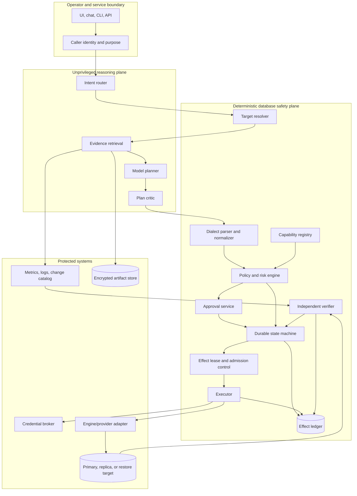

# Reference Architecture, Runtime, and Control

> **Status:** Research-backed production blueprint  
> **Last researched:** 2026-08-31  
> **Scope:** Components, execution boundaries, runtime choices, state machine, and control flow  
> **Evidence:** [Research packet](../../research/packets/database-operations-agent-blueprint.md)  
> **Blueprint index:** [README](README.md)

Use a small deterministic application as the authority boundary. An agent framework can help the model choose evidence or draft a plan, and a durable workflow engine can persist long-running work, but neither removes the need for database-specific policy, approval, execution, and verification code.

## Component architecture



The reasoning plane should be able to fail without obtaining a database credential. The safety plane accepts only schema-valid proposals and treats every planner field as untrusted until re-derived or validated.

## Stable core, explicit adapters

Keep these concepts engine-neutral:

- immutable target reference and topology epoch;
- capability name and version;
- proposal, risk, approval, execution attempt, effect receipt, and verification result;
- workflow states and transition rules;
- artifact references and provenance;
- idempotency, lease, timeout, cancellation, and escalation semantics.

Keep these engine- or provider-specific:

- SQL parsing and identifier normalization;
- privilege and read-only semantics;
- plan acquisition and cost signals;
- DDL transaction, lock, and online-operation behavior;
- replication positions, lag, promotion, and fencing;
- backup dependency chains and validation commands;
- tenant isolation primitives and managed-service guardrails.

An adapter reports a capability document such as `postgresql.create_index_concurrently.v2`, including version range, prerequisites, prohibited contexts, preflight checks, observable effect, cancellation behavior, and verification steps. Unsupported is a normal result; silently falling back to ordinary DDL is not.

### Adapter qualification, not logo compatibility

Qualify the exact deployed surface before it enters the capability registry. A successful connection or happy-path API call is not qualification.

| Adapter family | Pin and attest | Required contract tests | Deployment-specific rejection examples |
|---|---|---|---|
| Engine/driver | Engine build, edition, compatibility level, driver/parser version, extensions, session defaults | Identity, types, transactions, errors, timeout/cancel, ambiguous commit, TLS/auth, plan and catalog semantics | Unsupported online DDL, changed error classification, proxy-emulated dialect, missing telemetry privilege |
| Managed service | Provider API/SDK version, resource type/tier, region, topology, maintenance and backup settings | Async operation IDs, retry/reconciliation, quotas, failover/restore states, endpoint change, IAM, provider outage | RDS versus Aurora differences; Cloud SQL edition limits; Azure SQL Database versus Managed Instance; Autonomous Serverless versus Dedicated |
| Migration tool | Exact binary/container digest, changelog format/version, database support matrix, history/lock behavior | Validate/dry-run, transactional and non-transactional statements, checksum drift, concurrent runner, cancel/resume, rollback/forward fix | Flyway mixed transaction constraints; Liquibase change types without automatic rollback; `gh-ost` foreign keys/triggers or binlog prerequisites |
| Secrets broker | Product/plugin version, database plugin, credential type, issuer role, TTL/revocation behavior | Issue, renew, expire, revoke, broker outage, orphan cleanup, long-session behavior, audit attribution | A lease expires but the live DB session persists; revocation plugin fails; root rotation breaks the broker connection |
| Workflow engine | Server/cloud and SDK versions, retry/timeout policy, history limits, worker routing/version | Crash-before/after-effect, replay, duplicate Activity/task, cancellation, long wait, version coexistence | Activity arguments expose sensitive data in history; retry repeats a non-idempotent DDL; incompatible worker consumes old state |
| Observability pipeline | Semantic-convention and instrumentation versions, collector/exporter configuration, backend retention | Literal/parameter scrubbing, cardinality, dropped telemetry, audit independence, outage behavior | Legacy and stable OpenTelemetry DB attributes mix; SQL comments alter cache behavior; restricted results reach traces |

The acceptance artifact records the tested matrix, evidence hashes, known unsupported cases, owner, expiry, and refresh triggers. Provider documentation is capability evidence, not permission to merge products behind one contract. For example, Amazon RDS resource IDs change across blue/green production environments, Cloud SQL PITR and DR behavior varies by edition and log-storage mode, Azure planned and forced failover have different loss semantics, and Oracle Autonomous behavior differs by Serverless/Dedicated and local/cross-region standby.

## Runtime choices

### Language

Choose the language the operating team can review and run safely.

| Choice | Strong fit | Watch-outs |
|---|---|---|
| TypeScript | API/UI integration, typed contracts, model SDK ecosystem, shared web tooling | CPU-heavy parsing or provider libraries may require native helpers |
| Python | Database/data tooling, model experimentation, evaluation harnesses | Enforce types and async cancellation carefully; isolate exploratory code from executor |
| Go | Small hardened service, concurrency, static deployment, operational tooling | Less convenient for fast model experimentation and some vendor SDKs |

The simplest default is one application in the organization’s standard backend language. A small separate executor is justified only when it materially strengthens network, dependency, or privilege isolation. Do not create one microservice per database capability.

### Custom controller, framework, or workflow engine

| Need | Small custom controller | Agent framework | Durable workflow engine |
|---|---:|---:|---:|
| Typed request and tool dispatch | Strong | Often available | Available through activities/tasks |
| Model planning and retrieval | Implement selectively | Strong convenience | Not its purpose |
| Authorization and approval binding | Must implement | Must still implement | Must still implement |
| Engine-specific safety | Must implement | Must still implement | Must still implement |
| Hours-long approval/change window | Awkward without persistence | Usually insufficient alone | Strong |
| Crash recovery and timers | Implement explicitly | Varies | Strong |
| Replay-safe external effects | Must design | Must design | Activities can retry; effects still need idempotency |

Start with a small custom controller for advisory and bounded query modes. Add a durable workflow engine when workflows span restarts or people—scheduled change windows, large migrations, restore drills, or failover. Temporal, for example, persists workflow history, but its Activities may execute more than once; the database effect must still be idempotent or reconciled. Inputs and results also enter workflow history, so store sensitive payloads as protected artifact references. See [Temporal Activity semantics](https://docs.temporal.io/activity-definition) and [Workflow execution](https://docs.temporal.io/workflow-execution).

## End-to-end request flow

```mermaid
sequenceDiagram
    actor O as Operator
    participant C as Controller
    participant E as Evidence collector
    participant M as Model
    participant P as Policy/approval
    participant X as Executor
    participant D as Database
    participant V as Verifier

    O->>C: Intent + explicit target + purpose
    C->>C: Authenticate; resolve target fingerprint
    C->>E: Collect bounded snapshot
    E-->>C: Redacted evidence + provenance + TTL
    C->>M: Intent + capability catalog + evidence
    M-->>C: Typed proposal, assumptions, alternatives
    C->>C: Parse, normalize, derive risk
    C->>P: Canonical proposal + target + risk
    P-->>O: Exact diff, impact, gates, recovery
    O->>P: Approve canonical hash with expiry
    P-->>C: Signed approval grant
    C->>C: Wait for window; acquire target/effect lease
    C->>D: Re-resolve topology and preconditions
    alt material drift
        C-->>O: Invalidate approval; produce new proposal
    else invariant match
        C->>X: Approved effect envelope
        X->>X: Resolve short-lived credential
        X->>D: Execute bounded steps
        D-->>X: Engine receipts or ambiguous timeout
        X-->>C: Effect receipt
        C->>V: Verify postconditions and health independently
        V->>D: Bounded checks
        V-->>C: Pass, fail, or unknown
        C-->>O: Outcome, evidence, residual risk, next owner
    end
```

## Planning and control

Use bounded plan-and-execute, not an open-ended autonomous loop.

1. **Classify the requested capability.** Unknown or mixed intents return to the caller.
2. **Collect the minimum evidence.** Each observation tool has a budget and provenance.
3. **Draft one or more typed proposals.** Include assumptions and an evidence gap list.
4. **Critique against engine constraints.** A second model can find mistakes but cannot approve.
5. **Normalize and risk-score deterministically.** The controller derives effect scope from the AST and adapter.
6. **Choose:** reject, request more evidence, seek approval, or execute a pre-authorized observation.
7. **Execute a fixed plan.** The executor may stop on a gate; it may not improvise a broader operation.
8. **Verify independently.** On failure or ambiguity, enter containment/reconciliation—not free-form replanning.

Limit reasoning iterations, evidence bytes, database observations, wall time, and model spend. A budget exhaustion produces an incomplete finding, not permission to skip checks.

## Target identity and topology epoch

A production target reference should include at least:

```json
{
  "environment": "production",
  "provider_account": "acct-immutable-id",
  "region": "ap-south-1",
  "engine": "postgresql",
  "engine_version": "18.6",
  "cluster_id": "cluster-uuid",
  "database": "orders",
  "role": "primary",
  "topology_epoch": "promotion-counter-or-config-revision",
  "tenant_scope": ["tenant-123"]
}
```

The executor compares the requested fingerprint with database-native identity and provider control-plane data. DNS names, UI labels, and connection-string aliases are informational only. Promotion, restore, blue/green switch, replica replacement, or relevant policy change advances the topology epoch and invalidates outstanding approvals.

### Domain identity and version semantics

Every artifact and event names both a logical subject and the observed incarnation. Names are for people; commit-time policy uses immutable provider/native identifiers where available, scope, generation, and definition hashes. Restores, clones, swaps, and failovers create new incarnations even when an endpoint or friendly name is reused.

| Domain entity | Canonical identity | Version or generation that matters | Invalidating change |
|---|---|---|---|
| Cluster/server | Provider account/project/subscription, region, immutable resource ID, engine family | Engine build, edition/tier, parameter/config revision, topology epoch | Restore/clone replacement, blue/green switch, engine upgrade, failover, relevant configuration change |
| Database/catalog | Cluster incarnation plus native database ID where stable and database name | Catalog/schema epoch, compatibility level/character set/collation, migration high-watermark | Drop/recreate, restore over target, rename when IDs are not stable, compatibility or collation change |
| Schema/namespace | Database incarnation, tenant scope, native ID if meaningful, normalized namespace | Migration-set digest plus ownership/search-path/security-policy revision | Rename/recreate, owner or search-path change, policy deployment |
| Object | Database/schema incarnation, object type, native object ID when available, normalized qualified name | Canonical definition hash, dependency hash, owner/grant/policy revision | Recreate under same name, `CREATE OR REPLACE`, partition exchange, ownership/security change |
| Query | Dialect/version, normalized AST or engine fingerprint, parameter type signature, database and session context | Plan ID/hash plus statistics/config snapshot and observation window | Text/AST/type change, statistics/parameter/config change, reset or plan eviction; a telemetry fingerprint is not a permanent global ID |
| Transaction | Target/topology epoch, database session identity, native transaction/request ID where exposed | Isolation/read-only state, begin timestamp, current attempt and commit/recovery position | Reconnect, retry, failover, commit/rollback; a new attempt receives a new identity |
| Lock/wait | Observation ID, target epoch, blocker/waiter transaction or session, resource and lock mode | Snapshot timestamp/sequence and collector version | Any new snapshot; never treat a previous lock graph as a durable lock handle |
| Migration | Repository, migration-tool namespace, immutable artifact digest, ordered migration ID | Tool/schema version, applied-history checksum/high-watermark, application compatibility phase | Artifact checksum drift, history repair, reordered dependency, target schema drift |
| Backup set | Source cluster/database incarnation, provider/native backup ID, immutable manifest digest | Tool/format version, recovery position, full/incremental/log dependency graph, key version | Chain deletion, key revocation, format incompatibility, source-incarnation ambiguity |
| Restore | Restore request/effect key, source backup manifest, destination resource ID | Requested and achieved recovery point, restore tool/engine version, verification revision | Retry without reconciliation, destination reuse, later recovery replay; the restore is not the source database |
| Replica | Topology epoch, immutable member/resource ID, source lineage, region/zone | Receive/persist/replay positions, configuration and eligibility revision | Rebuild/reseed, promotion/demotion, source change, slot/channel recreation |
| Failover/switchover | Transition/effect ID, old and candidate member IDs, previous topology epoch | Fencing receipt, loss decision, achieved positions, new topology epoch | Any role ambiguity or subsequent transition; old approvals and leases are invalid |

Keep logical continuity and physical incarnation separate. An application may continue to use `orders.example` after failover, but the executor must see a new writer member and topology epoch. A restored database may contain the same object IDs as its source; those IDs are scoped to the restored database incarnation and cannot prove it is the original target.

## Model strategy

- Use a capable model for cross-evidence diagnosis, dialect-aware explanation, and change decomposition.
- Use cheaper models or deterministic code for routing, redaction checks, classification, and formatting only after task-specific evaluations show equivalence.
- Pin model and prompt versions. Roll out through offline replay, shadowing, then a small advisory cohort.
- Require structured output against a versioned schema such as [JSON Schema 2020-12](https://json-schema.org/draft/2020-12).
- Never map a self-reported confidence score directly to privilege or approval policy.
- Keep full result sets, secrets, credentials, and unrestricted logs outside model context. Send bounded, purpose-selected summaries and artifact references.

## Failure containment boundaries

| Failure | Boundary response |
|---|---|
| Model outage or malformed proposal | No effect; retry model or hand off with evidence |
| Evidence source stale | Mark stale, refuse effect, recollect |
| Policy service unavailable | Fail closed for new effects; allow safe observation only if explicitly designed |
| Approval service unavailable | Keep workflow waiting; never infer approval from chat text |
| Worker crash during effect | Reconcile using effect key and database state before any retry |
| Credential broker unavailable | No effect; do not fall back to static privileged secret |
| Verifier unavailable | Effect remains unverified; contain or escalate according to capability |
| Audit sink unavailable | For writes, stop before commit unless a durable local/outbox record is guaranteed |

## Deployment topology

Run the reasoning and safety planes in separate security contexts even if they share one deployable initially. Only the executor network identity reaches database control endpoints. Use outbound allowlists, TLS identity verification, per-environment credential brokers, and separate production policy. Avoid a central “god” executor spanning unrelated security domains; deploy an executor per trust boundary or region and keep the controller logically centralized only where governance permits.

## Related guides

- [Tool, effect, state, and approval contracts](04-tool-effect-state-and-approval-contracts.md)
- [Execution boundaries](../../runtime/execution-boundaries.md)
- [Durable execution](../../runtime/durable-execution.md)
- [Custom loop vs. framework vs. workflow engine](../../comparisons/custom-loop-vs-framework-vs-workflow-engine.md)
- [Tool contracts](../../tools/tool-contracts.md)

## Selected sources

- [Temporal Workflow execution](https://docs.temporal.io/workflow-execution)
- [Temporal worker versioning](https://docs.temporal.io/production-deployment/worker-deployments/worker-versioning)
- [JSON Schema Draft 2020-12](https://json-schema.org/draft/2020-12)
- [OpenTelemetry database client span conventions](https://opentelemetry.io/docs/specs/semconv/db/database-spans/)
- [OWASP AI Agent Security Cheat Sheet](https://cheatsheetseries.owasp.org/cheatsheets/AI_Agent_Security_Cheat_Sheet.html)
- [Flyway migration transaction handling](https://documentation.red-gate.com/fd/migration-transaction-handling-273973399.html)
- [Liquibase automatic rollback matrix](https://docs.liquibase.com/community/user-guide-5-0-3/what-automatic-rollbacks-does-liquibase-support)
- [`gh-ost` requirements and limitations](https://github.com/github/gh-ost/blob/master/doc/requirements-and-limitations.md)
- [Vault database secrets engine](https://developer.hashicorp.com/vault/docs/secrets/databases)
- [Amazon RDS Blue/Green limitations](https://docs.aws.amazon.com/AmazonRDS/latest/UserGuide/blue-green-deployments-considerations.html)
- [Cloud SQL advanced disaster recovery](https://docs.cloud.google.com/sql/docs/postgres/use-advanced-disaster-recovery)
- [Azure SQL Database failover groups](https://learn.microsoft.com/en-us/azure/azure-sql/database/failover-group-configure-sql-db?view=azuresql)
- [Oracle Autonomous Data Guard transitions](https://docs.oracle.com/en-us/iaas/autonomous-database-serverless/doc/autonomous-data-guard-switchover-failover.html)
