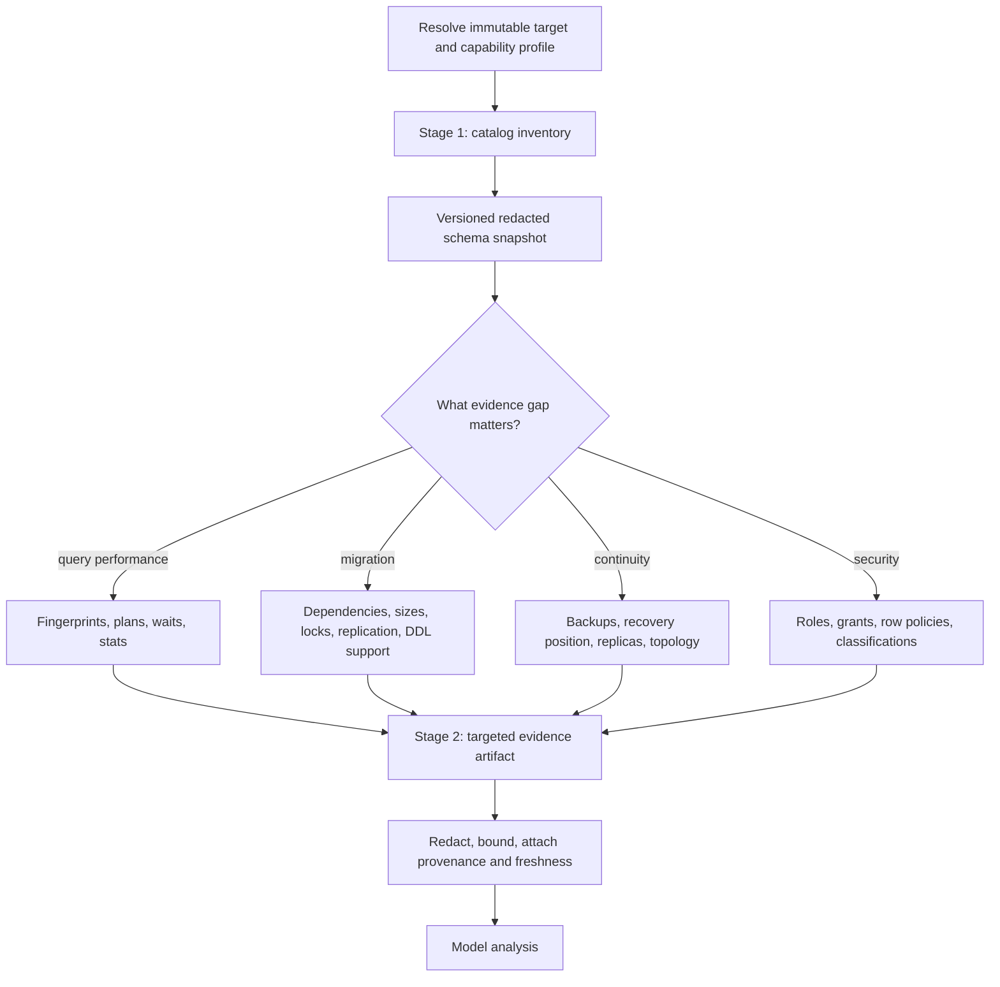

# Discovery, Analysis, and Query Safety

> **Status:** Research-backed production blueprint  
> **Last researched:** 2026-08-31  
> **Scope:** Catalog discovery, workload analysis, query generation, plan inspection, and bounded read execution  
> **Evidence:** [Research packet](../../research/packets/database-operations-agent-blueprint.md)  
> **Blueprint index:** [README](README.md)

Read-only analysis is lower risk than mutation, not risk-free. A query can expose restricted data, scan terabytes, saturate a replica, hold locks, call a side-effecting routine, or prevent log retention from advancing. The query assistant therefore needs several independent controls; a prompt that says “only SELECT” is not one of them.

## A two-stage discovery model

Do not dump an entire production catalog, plan cache, or dataset into model context. Discover broadly but shallowly, then retrieve narrowly.



### Stage 1: inventory

Collect only what is needed to route later evidence requests:

- engine, version, edition, provider, extensions/plugins, relevant settings, and feature capabilities;
- databases/schemas, object identifiers and types, columns and types, keys, indexes, approximate sizes, dependencies, and classifications;
- sanitized role and policy structure without credential material;
- topology roles and high-level replication/backup status;
- snapshot time, collection tool version, target fingerprint, topology epoch, catalog transaction or consistency method, and TTL.

Use stable object identifiers where the engine provides them. Names alone are ambiguous under renames, search paths, case rules, synonyms, and multi-database deployments.

### Stage 2: targeted evidence

Retrieve a small evidence bundle for one question. Examples include a PostgreSQL `pg_stat_statements` fingerprint plus estimated plan, MySQL Performance Schema statement digest plus lock waits, SQL Server Query Store plan/runtime history, or Oracle cursor/plan evidence. The bundle records query parameters separately or redacts them, and includes time range, sampling, reset/restart boundaries, role/replica context, and known gaps.

Statistics are observations, not ground truth. Counters may reset; plans may change with binds, configuration, statistics, cache state, or replica lag; an aggregate fingerprint can hide skew. The agent should state what evidence supports a conclusion and what experiment would discriminate competing causes.

## Capability-scoped observation tools

Prefer semantic tools over arbitrary SQL:

| Tool | Bounded input | Output |
|---|---|---|
| `catalog.describe_object` | Target, stable object ID, fields allowlist | Versioned metadata artifact |
| `workload.top_fingerprints` | Time range, metric, limit, database/tenant scope | Redacted query fingerprints and aggregates |
| `plan.estimate` | One parsed statement, typed parameters, target or approved clone | Estimated plan and engine warnings |
| `locks.snapshot` | Object/session scope, row limit | Blocker/wait graph with hashed principals |
| `replication.observe` | Topology epoch, member allowlist | Positions, lag dimensions, slot/queue health |
| `query.preview` | Parsed read statement, budget, purpose, tenant | Bounded rows plus execution receipt |
| `query.cancel` | Exact session/request identity and reason | Cancellation receipt and follow-up status |

A raw diagnostic SQL escape hatch, if it exists, belongs to a separate human-only break-glass path with an independent identity. It should not be advertised in the model tool catalog.

## Query admission pipeline

1. **Resolve purpose and scope.** Identify caller, target, tenant, permitted classifications, and result destination.
2. **Parse with the exact dialect/version.** Require one statement. Normalize identifiers and derive referenced objects, functions, and statement effects from an AST—not regex.
3. **Apply semantic policy.** Deny writes, DDL, transaction control, locks, file/network functions, unsafe routines, dynamic SQL, cross-database access, and unsupported constructs. Allowlisting is safer than trying to enumerate every dangerous feature.
4. **Enforce database-native authority.** Use a dedicated read identity; database/schema/table/column/row policies remain the real boundary.
5. **Set a bounded session envelope.** Read-only transaction where meaningful, statement and lock timeout, idle-transaction timeout, resource group/governor, query tag, application name, row/byte cap, and cancellation token.
6. **Estimate impact.** Acquire a non-executing plan when possible. Compare estimated rows/bytes/cost and target health with budgets. Treat missing or implausible estimates as uncertainty that raises risk.
7. **Choose target deliberately.** A replica reduces primary CPU pressure but may be stale, may cancel long reads during recovery, and can fall behind further under load. Sensitive policy and schema must match.
8. **Execute and stream defensively.** Stop at byte/row/deadline budgets, close cursors, roll back/close transactions, and do not let a slow consumer retain resources.
9. **Redact and account.** Apply column classifications and output policy before model/UI delivery. Record fingerprint, plan identity, budgets, actual resource/time signals, truncation, and result artifact hash.

Do not silently add a tenant predicate and assume the result is safe. Query rewriting can be defeated by joins, views, routines, session context, or dialect details. Enforce tenant isolation in database policy or physically isolated credentials/databases; parsing and predicate validation are supplementary.

## Engine-specific plan safety

| Engine | Non-executing/default inspection | Executing inspection hazard | Production guidance |
|---|---|---|---|
| PostgreSQL 18 | `EXPLAIN` without `ANALYZE` | `EXPLAIN ANALYZE` actually executes the statement; write side effects occur unless safely rolled back, and some effects are not appropriate for a dry run | Default to plain `EXPLAIN`; use `ANALYZE` only on an approved safe target and statement class |
| MySQL 8.4 | `EXPLAIN` for supported statements | `EXPLAIN ANALYZE` executes and times the statement | Treat it as a real query with full admission controls |
| SQL Server 2025 | Estimated execution plan does not execute | Actual execution plan is collected after execution | Prefer estimated; actual plan only in bounded execution or from Query Store/runtime history |
| Oracle 26ai | `EXPLAIN PLAN` populates a plan table | The explained plan may differ from the actual plan because binds and execution environment matter | Correlate with actual cursor/plan statistics from approved telemetry; do not claim exact runtime behavior from `EXPLAIN PLAN` alone |

Primary references: [PostgreSQL EXPLAIN](https://www.postgresql.org/docs/18/sql-explain.html), [MySQL EXPLAIN](https://dev.mysql.com/doc/refman/8.4/en/explain.html), [SQL Server execution plans](https://learn.microsoft.com/en-us/sql/relational-databases/performance/display-and-save-execution-plans?view=sql-server-ver17), and [Oracle execution plans](https://docs.oracle.com/en/database/oracle/oracle-database/26/tgsql/generating-and-displaying-execution-plans.html).

## “Read-only” differences that matter

| Engine | Important qualification |
|---|---|
| PostgreSQL | A read-only transaction prohibits many writes to non-temporary tables, but temporary tables are an exception and “read only” is a high-level SQL restriction, not a promise of zero disk or system activity. |
| MySQL | `START TRANSACTION READ ONLY` optimizes/limits InnoDB data changes but may still permit changes to `TEMPORARY` tables. |
| SQL Server | `READ COMMITTED` is an isolation level, not a read-only mode; depending on `READ_COMMITTED_SNAPSHOT`, reads may acquire shared locks. Use privileges and workload controls separately. |
| Oracle | `SET TRANSACTION READ ONLY` gives transaction-level read consistency, but transaction/DDL behavior and packages require Oracle-specific policy; it is not a generic sandbox for arbitrary PL/SQL. |

Consequently, the safe query tool should allow an intentionally narrow expression subset, trusted views/routines, or known AST patterns. It should not accept arbitrary stored procedure calls merely because the call begins with `SELECT` or returns rows.

## Workload and lock analysis

Correlate at least four views before recommending a change:

- **Demand:** normalized fingerprints, frequency, concurrency, tail latency, rows, CPU/I/O/log impact.
- **Plan:** chosen access path, cardinality estimates, parameter/bind behavior, spills, parallelism, and plan changes.
- **Contention:** blockers, wait classes, lock duration, transaction age, connection pools, and background work.
- **Data shape:** table/index size, growth, skew, stale statistics, partitions, bloat/fragmentation, and tenant distribution.

An index suggestion based only on one plan is incomplete. The proposal must consider write amplification, storage, cache, build locks, replication/log volume, redundant indexes, selectivity, and whether a query or data-model change is better. Similarly, canceling a blocker requires identifying transaction ownership, business operation, rollback cost, failover role, and whether the apparent blocker is the victim of a deeper dependency.

## Evidence provenance contract

Every evidence item should carry:

```yaml
evidence_id: ev_01J...
target_fingerprint: sha256:...
topology_epoch: '42'
collector: postgresql.pg_stat_statements.v3
collected_at: 2026-08-31T08:15:00Z
valid_until: 2026-08-31T08:20:00Z
consistency: catalog-transaction
filters:
  database: orders
  time_range: 15m
redactions:
  literals: removed
  principals: hashed
limitations:
  - statistics reset time unknown
artifact_ref: artifact://encrypted/ev_01J...
content_hash: sha256:...
```

The model sees the redacted projection. The verifier and auditor may access the protected artifact subject to purpose and retention policy. Evidence past its TTL can inform discussion but cannot satisfy an execution precondition.

## Result and telemetry privacy

OpenTelemetry’s database span conventions recommend sanitizing query text and do not enable parameter capture by default because values may contain sensitive data. Prefer a low-cardinality query summary or fingerprint; protect any full query artifact separately. Trace-comment injection can change prepared-statement or query-cache behavior on MySQL, Oracle, and SQL Server, so do not enable it casually. See [OpenTelemetry database spans](https://opentelemetry.io/docs/specs/semconv/db/database-spans/).

For query results:

- select named columns instead of `*`;
- reject restricted classifications unless the caller’s purpose permits them;
- aggregate or tokenize where possible;
- cap rows, bytes, cells, and per-field size;
- suppress or hash unique identifiers where not necessary;
- never echo secrets discovered in data or error text;
- apply output policy before data reaches the model, logs, tracing, or approval UI;
- expire result artifacts independently of audit metadata.

## Query-assistant acceptance checklist

- [ ] Target dialect, version, edition, and provider capability are detected.
- [ ] One-statement AST parsing and an allowlist replace keyword filtering.
- [ ] Database privilege and tenant isolation survive a compromised planner.
- [ ] Session, cost, row, byte, concurrency, and time budgets are enforced outside the model.
- [ ] Estimated and actual plan modes cannot be confused.
- [ ] Replica staleness and cancellation behavior are visible to the caller.
- [ ] Side-effecting functions/routines and unsafe system access are denied.
- [ ] Cancellation closes the cursor and transaction and verifies resource release.
- [ ] Outputs, errors, traces, and artifacts follow PII and retention policy.
- [ ] An adversarial suite tests comments, identifiers, stored text, cross-tenant joins, expensive plans, and ambiguous dialect constructs.

## Related guides

- [Security, identity, tenancy, and PII](07-security-identity-tenancy-and-pii.md)
- [Tool contracts](../../tools/tool-contracts.md)
- [Tool results, artifacts, and provenance](../../tools/tool-results-artifacts-and-provenance.md)
- [Prompt injection and untrusted data](../../security/prompt-injection-and-untrusted-data.md)

## Selected sources

- [PostgreSQL `pg_stat_statements`](https://www.postgresql.org/docs/current/pgstatstatements.html)
- [PostgreSQL lock monitoring](https://www.postgresql.org/docs/current/view-pg-locks.html)
- [MySQL Performance Schema statement digests](https://dev.mysql.com/doc/refman/8.4/en/performance-schema-statement-digests.html)
- [MySQL InnoDB lock-wait inspection](https://dev.mysql.com/doc/refman/8.4/en/innodb-information-schema-understanding-innodb-locking.html)
- [SQL Server Query Store](https://learn.microsoft.com/en-us/sql/relational-databases/performance/monitoring-performance-by-using-the-query-store?view=sql-server-ver17)
- [BIRD benchmark paper](https://proceedings.neurips.cc/paper_files/paper/2023/file/83fc8fab1710363050bbd1d4b8cc0021-Paper-Datasets_and_Benchmarks.pdf)
- [Spider 2.0 benchmark](https://spider2-sql.github.io/)
