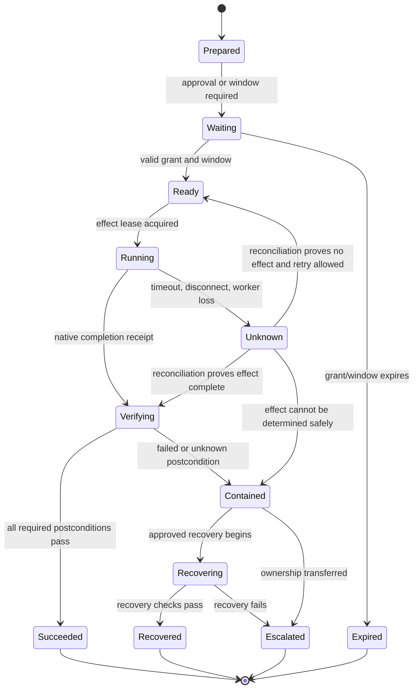

# Tool, Effect, State, and Approval Contracts

> **Status:** Research-backed production blueprint  
> **Last researched:** 2026-08-31  
> **Scope:** Capability tools, proposal schemas, approval binding, durable state, idempotency, and outcome contracts  
> **Evidence:** [Research packet](../../research/packets/database-operations-agent-blueprint.md)  
> **Blueprint index:** [README](README.md)

Tool names and JSON schemas are part of the security boundary. A generic `execute_sql(sql, connection)` asks policy code to rediscover every possible effect after the model has already chosen arbitrary syntax. Prefer a small catalog of versioned semantic capabilities whose inputs, side effects, limits, and verification are explicit.

## Tool design rules

Each callable tool declares:

- whether it is observation, proposal-only, reversible effect, or continuity/destructive effect;
- caller roles and environments where it exists;
- exact target and tenant fields, never an unvalidated connection string;
- typed inputs with closed schemas and bounded lengths/counts;
- database and provider prerequisites;
- possible locks, writes, network calls, and result classifications;
- timeout and safe cancellation behavior;
- idempotency or reconciliation strategy;
- success, partial, rejected, ambiguous, and failed result forms;
- evidence and audit fields;
- independent postconditions.

The model receives tools for the current mode and risk envelope only. Tool discovery is authorization-filtered before it reaches the prompt.

### Typed contract family

Do not overload “plan,” “tool call,” and “effect.” They cross different trust boundaries and require different evolution rules.

| Contract | Authoritative contents | Forbidden shortcut |
|---|---|---|
| `DbRequest` | Authenticated caller, purpose, explicit target selector, tenant/data scope, requested capability, deadlines | Treating conversational target text as resolved identity |
| `DbState` | Workflow state/version, target/topology epoch, evidence and source high-watermarks, approvals, leases, attempts, pending effects, owner | Reconstructing operational truth from the latest model message |
| `DbEvent` | Event ID, workflow ID, monotonic sequence, source, type/schema version, occurred/recorded time, causation/correlation IDs, actor, target epoch, payload/artifact hash | Mutating state without an append-only transition event or accepting duplicate/out-of-order events silently |
| `DbPlan` | Ordered semantic operations, dependencies, preconditions, budgets, abort gates, verification, recovery, assumptions, evidence references | Executable prose, model-selected credentials, or free-form steps added after approval |
| `DbTool` | Capability/version, closed input/output schemas, authority class, timeout/cancel, side-effect declaration, adapter support | Generic SQL/provider command hidden behind a safe-sounding tool name |
| `DbEffect` | Canonical operation, target incarnation, effect/idempotency key, approval binding, executor/credential class, attempt number | Equating dispatch or transport success with completion |
| `DbReceipt` | Native transaction/operation ID, normalized status, observed positions/objects, reconciliation evidence, verifier result, residual unknowns | Planner self-certification or a boolean `success` without outcome evidence |

Reducers accept a state version plus one valid event and emit the next state version. They reject sequence gaps, duplicate event IDs with different hashes, unknown event/schema versions, illegal transitions, target-epoch changes, and terminal-state mutation. Model output can propose a `DbPlan`; it cannot emit authoritative `DbEvent`, `DbEffect`, approval, or terminal `DbReceipt` records.

### Bad and better surfaces

| Avoid | Prefer |
|---|---|
| `execute_sql(sql)` | `query.preview(read_query, budgets, tenant_scope)` |
| `run_migration(script)` | `migration.propose(artifact)` then `migration.apply_approved(proposal_id, approval_id)` |
| `manage_replica(command)` | `replication.switchover_preflight(target_pair)` and `replication.commit_approved(transition_id)` |
| `restore(backup, target)` | `restore.create_isolated_drill(backup_set_id, destination_class, expiry)` |
| `get_logs(filter)` | `evidence.query_activity(fingerprint, time_range, fields_allowlist)` |
| Free-form “approve” message | Signed grant over canonical effect and target hash |

## Canonical effect proposal

Use a versioned schema and canonical serialization. The following shortened example shows the necessary shape, not a universal field set:

```json
{
  "schema_version": "db-effect-proposal/1.0",
  "proposal_id": "prop_01J...",
  "capability": "postgresql.create_index_concurrently.v2",
  "target": {
    "environment": "production",
    "cluster_id": "cluster-uuid",
    "database": "orders",
    "role": "primary",
    "topology_epoch": "42",
    "fingerprint": "sha256:..."
  },
  "intent": "Support tenant-scoped pending-order lookup",
  "operations": [{
    "operation_id": "op-1",
    "normalized_effect": {
      "object_id": "pg_class:18492",
      "index_name": "orders_tenant_status_created_idx",
      "columns": ["tenant_id", "status", "created_at"],
      "predicate": "status = 'pending'",
      "mode": "concurrently"
    }
  }],
  "evidence": [{"id": "ev_01J...", "hash": "sha256:...", "valid_until": "..."}],
  "preconditions": [
    {"kind": "object_definition_hash", "expected": "sha256:..."},
    {"kind": "replication_lag_below", "seconds": 10},
    {"kind": "free_space_above", "bytes": 50000000000}
  ],
  "budgets": {
    "lock_wait": "2s",
    "wall_time": "45m",
    "replication_lag_abort": "30s"
  },
  "verification": [
    {"kind": "index_valid"},
    {"kind": "target_plan_uses_index_on_sampled_clone"},
    {"kind": "workload_error_rate_below", "value": 0.01}
  ],
  "recovery": {
    "strategy": "drop_invalid_or_regressing_index_concurrently",
    "artifact_hash": "sha256:..."
  },
  "risk": {"derived_class": "R4", "reasons": ["production DDL", "log and lock impact"]},
  "expires_at": "2026-09-01T02:30:00Z"
}
```

Policy reconstructs risk-relevant fields from the adapter and normalized operation. It does not trust the planner’s `risk` or recovery prose.

## Prepare, approve, commit

```mermaid
sequenceDiagram
    participant M as Model/planner
    participant C as Controller
    participant A as Approver
    participant X as Executor
    participant D as Database

    M->>C: Typed proposal
    C->>C: Normalize; calculate effect/risk
    C->>D: Read prepare-time preconditions
    C->>C: Canonicalize proposal and hash
    C->>A: Exact target, diff, impact, gates, recovery
    A-->>C: Signed approval over hash + TTL + window
    C->>D: Commit-time target and precondition read
    alt state changed materially
        C-->>A: Approval invalidated; no effect
    else exact envelope still valid
        C->>X: Effect envelope + grant
        X->>D: Execute fixed steps with effect key
        D-->>X: Native receipts/status
        X-->>C: Effect receipt
    end
```

The approval grant binds:

- canonical proposal hash and schema version;
- immutable target fingerprint and topology epoch;
- normalized effect and artifact hashes;
- allowed credential class and executor identity;
- risk class and policy version;
- approved change window and expiry;
- maximum budgets, abort gates, and recovery strategy;
- approving principal, role, authentication context, and separation-of-duties decision.

Changing a statement, object, tenant set, target role, timeout, batch size, risk, or recovery path requires a new grant. A cosmetic explanation change does not if it is excluded from the canonical effect and clearly labeled non-authoritative.

## Durable workflow state

Keep durable operational state outside model conversation memory.



Persist only state needed to resume safely:

- request and proposal references;
- target fingerprint/topology epoch;
- evidence hashes and expiry;
- policy decision and approval grant;
- current state, transition version, lease, heartbeat, and deadlines;
- per-step attempt numbers, idempotency keys, native operation IDs, and receipts;
- verification results, artifacts, and current human owner.

Do not depend on a chat transcript to know whether a migration executed. Do not persist raw secrets or unrestricted query results in workflow history.

## Context, compaction, and memory decisions

These are exactly seven memory lifetimes. “Cache,” “history,” and “knowledge” must map to one of them rather than becoming an ungoverned eighth store.

| Named lifetime | Use | Reject | Retention/deletion | Required tests |
|---|---|---|---|---|
| **Turn/scratch memory** | One model call: resolved target/role/topology, intent/risk, current plan step, selected redacted evidence, applicable approvals/effects, budgets | Secrets, unrestricted rows/logs, stale observations, authority-bearing state that exists only in the prompt | Delete after the call except for policy-approved prompt/audit metadata; restricted captures use a separate short-lived artifact | Token/byte budget, PII/secret canaries, injection boundary, stale-evidence refusal, no authority loss when omitted |
| **Working/run memory** | Typed hypotheses, open evidence gaps, rejected options, plan progress, evidence IDs, current safe action | Raw credentials/results, planner prose as fact, unversioned mutable summaries, effect truth not backed by ledger/event | Workflow lifetime plus short investigation window; delete derived sensitive content independently | Crash/restart, concurrent reducer, compaction/recompaction, hypothesis-versus-observation separation |
| **Session memory** | Operator UX such as explicit display preferences and links to active workflows | Target, tenant, approval, credential, risk, recovery, or effect decisions; inferred preference from sensitive data | Short idle/absolute TTL; user-visible deletion; never required for safe resume | New-session reconstruction, cross-user/tenant isolation, deletion propagation, poisoned prior-turn tests |
| **Durable workflow/task memory** | Authoritative plan, event log, target epoch, evidence/source high-watermarks, policy/approval, lease, effect, receipt, verification, recovery, owner, terminal record | Chat transcript as execution state, raw secrets, large results, mutable overwrite without state/event version | Operations/audit policy and legal hold; sensitive artifacts referenced separately; terminal compaction cannot remove effect proof | Replay, duplicate/out-of-order event, crash at every effect boundary, schema migration, DR restore, tamper evidence |
| **Domain knowledge memory** | Governed schemas, migration history, engine/provider capability profiles, topology, runbooks, SLOs, ownership, classifications | Uncited model-generated facts, provider behavior copied across products, stale snapshots presented as live state | Source-system policy; version, owner, freshness, provenance, supersession and deletion rules | Source revocation, freshness/contradiction checks, engine/provider version matrix, access-control tests |
| **Long-term/preference memory** | Explicit, low-risk, deletable presentation/accessibility preferences only | Tenant/data scope, privileged target aliases, approval style, risk tolerance, credentials, inferred behavioral profile | Opt-in with purpose and expiry; user view/edit/delete; no silent indefinite retention | Consent/expiry/deletion, no privilege influence, cross-user isolation, export and correction |
| **Episodic/outcome memory** | Human-reviewed incidents, bad plans, engine surprises, restore gaps, and operator corrections converted into eval fixtures or proposed runbook changes | Raw model conclusions, production rows, unresolved blame, automatic self-promotion into prompts/policy | Curated corpus with provenance, redaction, owner, review/refresh date and deletion propagation | Holdout leakage, sensitive-data scan, label agreement, stale-policy replay, provenance and deletion tests |

### Restart-safe compaction receipt

Compaction changes only the model's working projection. It never replaces `Durable workflow/task` state, source artifacts, or the effect ledger. Persist and validate a receipt such as:

```yaml
receipt_version: 1
receipt_schema: db-compaction-receipt/1.0
workflow_id: wf_01J...
state_version: 37
source_event_high_watermark:
  event: 184
  database_catalog: 'snapshot:991/hash:sha256:...'
  workload_window: '2026-08-31T08:00:00Z/2026-08-31T08:15:00Z'
  provider_topology: 'revision:42'
target_fingerprint: sha256:...
topology_epoch: '42'
versions:
  model: provider/model-snapshot
  prompt: db-ops/7
  controller: 3.4.1
  policy: prod-db/19
  adapter: postgresql/18-v5
  schemas: db-state/2,db-event/1,db-plan/3,db-effect/2
retained_plan: {plan_id: plan_01J..., hash: 'sha256:...', next_step: verify-preconditions}
retained_evidence: [{id: ev_01J..., hash: 'sha256:...', valid_until: '...'}]
approvals: [{approval_id: apr_01J..., plan_hash: 'sha256:...', status: granted, expires_at: '...'}]
pending_effects:
  - {effect_id: eff_01J..., status: UNKNOWN, native_operation_id: '...', reconciliation: required}
pending_effect_ids: [eff_01J...]
unknown_effect_ids: [eff_01J...]
active_clocks: [{clock_id: lock-wait-budget, due_at: '...', owner: database-operator}]
budgets_and_stop_conditions: {lock_wait: 2s, lag_abort: 30s, wall_deadline: '...'}
engine_warnings: [concurrent-index-may-leave-invalid-object]
omitted_items: [raw-query-results, secrets, full-lock-graph]
next_safe_action: reconcile-effect-eff_01J-before-any-retry
invariant_hash: sha256:...
compactor: {version: db-context-4.2, input_digest: 'sha256:...', output_digest: 'sha256:...'}
```

The `invariant_hash` covers canonical target/database/tenant/role, destructive scope, approved plan/effect, transaction/lock/replication risks, recovery requirements, budgets, and stop conditions. Resume loads durable state, verifies receipt/state/event/source high-watermarks and all hashes, refreshes volatile observations, and obeys `next_safe_action`. A gap, stale approval, target-epoch change, pending or `UNKNOWN` effect, unknown schema/version, or hash mismatch blocks ordinary planning and enters reconciliation/containment. Repeated-compaction tests must prove that no required identity, approval, pending effect, uncertainty, recovery requirement, or stop condition disappears.

## Effect identity, idempotency, and reconciliation

At-least-once task runners can repeat an executor call after a timeout or crash. Some database operations are naturally conditional; many are not.

Construct an effect key from the capability version, target fingerprint/topology epoch, canonical operation, and proposal ID. Store it in an external effect ledger before execution and, where possible, correlate it with database-native metadata or a controlled bookkeeping table.

```text
begin_effect(effect_key):
    acquire per-target/per-object lease
    if ledger says VERIFIED_SUCCESS: return previous receipt
    if ledger says STARTED or UNKNOWN: reconcile database/native operation
    if reconciliation cannot prove NOT_STARTED: stop and escalate
    record STARTED durably
    execute fixed operation with native operation tag/id
    record native receipt
    verify postconditions independently
    record VERIFIED_SUCCESS or CONTAINED
```

Never label an operation idempotent merely because its SQL contains `IF EXISTS` or `IF NOT EXISTS`. The prior attempt may have partially completed, used a different definition, advanced replication, or left an invalid object. Reconciliation compares the intended semantic definition and health state.

Database advisory/application locks can coordinate cooperating executors but are not universal safety locks:

- PostgreSQL advisory locks are application-defined; session and transaction scopes differ.
- MySQL `GET_LOCK()` is session-scoped, not transaction-scoped, applies only to one server, and has replication caveats.
- SQL Server `sp_getapplock` has session or transaction ownership and database/principal scope.
- A failover or non-cooperating client can bypass these mechanisms.

Use the orchestration lease as the durable authority and the database lock as a local race-reduction mechanism. Include topology epoch so a lease from an old primary cannot authorize a new topology.

## Result contract

Every effect returns one of five authoritative statuses:

| Status | Meaning | Next action |
|---|---|---|
| `REJECTED` | No execution began; policy/precondition denied | Revise or close |
| `NO_EFFECT` | Reconciliation proves target already satisfied or execution never began | Verify and close or seek new proposal |
| `EFFECT_RECORDED` | Native engine says effect completed; independent verification pending | Verify; never call complete yet |
| `VERIFIED_SUCCESS` | Required postconditions and workload/security gates passed | Close and retain audit evidence |
| `UNKNOWN_OR_UNSAFE` | Effect or outcome cannot be proven safe | Stop retries, contain, revoke, page owner |

Tool transport success is not database success. A 200 response can carry `UNKNOWN_OR_UNSAFE`; a network error may follow a committed effect.

## Independent verification

Verification should be authored and executed separately from the planner’s success narrative. It can reuse declared postconditions but cannot accept planner prose as evidence.

Verify multiple layers as appropriate:

- **Object:** expected definition, validity, ownership, privileges, policy, and dependencies.
- **Data:** counts/checksums/invariants, tenant boundaries, null/uniqueness, application-visible semantics.
- **Workload:** latency, error rate, waits, blocking, CPU/I/O/log, cache, storage, connection pressure.
- **Replication/recovery:** lag, queue/slot growth, recovery point, replica health, backup schedule unaffected.
- **Application:** critical probes and representative transactions.
- **Security:** no privilege broadening, policy bypass, logging leak, or restricted-data result.

A verification timeout yields unknown, not success. Recovery should itself use a new approved effect unless it is a pre-authorized automatic abort within the original immutable envelope.

## Contract versioning

- Version proposal, capability, policy, adapter, and result schemas independently.
- Preserve the exact schema and code versions used by in-flight workflows.
- Make additive fields explicit; default-deny unknown effect fields.
- Migrate durable state with tested replay fixtures.
- Route old workflow histories to compatible workers where a workflow engine supports versioning.
- Retire capabilities by removing them from discovery first, waiting for active grants to expire, then disabling execution.

## Related guides

- [Reference architecture, runtime, and control](02-reference-architecture-runtime-and-control.md)
- [Idempotency and side effects](../../reliability/idempotency-and-side-effects.md)
- [Agent state and event contracts](../../runtime/agent-state-and-event-contracts.md)
- [Tool registries, versioning, and lifecycle](../../tools/tool-registries-versioning-and-lifecycle.md)
- [Run controls](../../runtime/run-controls.md)

## Selected sources

- [JSON Schema Draft 2020-12](https://json-schema.org/draft/2020-12)
- [Temporal Activity definition and retry semantics](https://docs.temporal.io/activity-definition)
- [PostgreSQL advisory lock functions](https://www.postgresql.org/docs/18/functions-admin.html)
- [MySQL locking functions](https://dev.mysql.com/doc/refman/8.4/en/locking-functions.html)
- [SQL Server `sp_getapplock`](https://learn.microsoft.com/en-us/sql/relational-databases/system-stored-procedures/sp-getapplock-transact-sql?view=sql-server-ver17)
- [NIST SP 800-53 Rev. 5](https://csrc.nist.gov/pubs/sp/800/53/r5/upd1/final)
