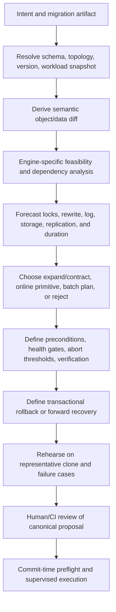
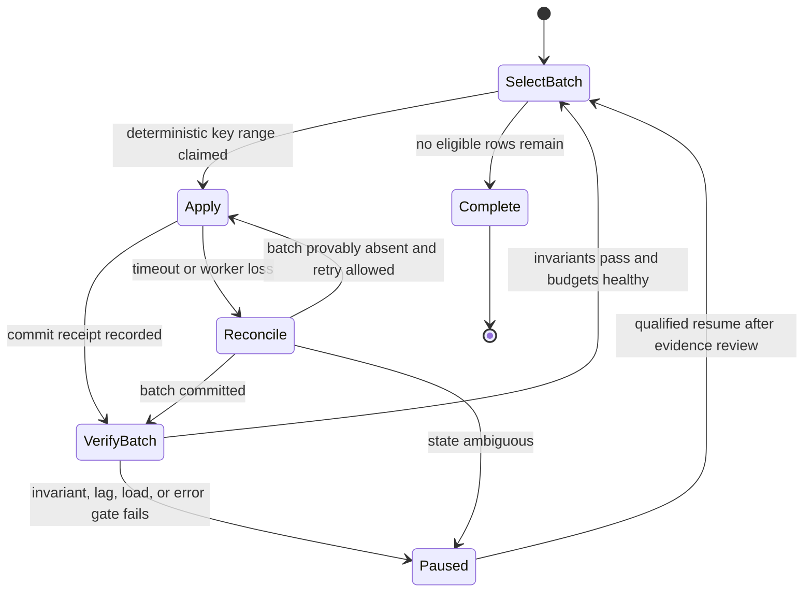

# Migrations, Transactions, Locks, and Rollback

> **Status:** Research-backed production blueprint  
> **Last researched:** 2026-08-31  
> **Scope:** Schema/data change proposals, online operations, transaction semantics, lock safety, change windows, and rollback/recovery  
> **Evidence:** [Research packet](../../research/packets/database-operations-agent-blueprint.md)  
> **Blueprint index:** [README](README.md)

A migration reviewer should produce an operational change plan, not just lint DDL. The same statement can be cheap on an empty development table and service-threatening on a multi-terabyte primary with long transactions, replica lag, and tight storage.

## The change proposal lifecycle

The reviewer must identify uncertainty. If table size, write rate, longest transaction, free space, replica behavior, engine support, or application compatibility is unknown, it should request evidence or reject execution—not substitute a confident duration estimate.

## Prefer expand/contract

For application-visible schema changes, default to compatibility phases:

1. **Expand:** add a backward-compatible object or nullable field; introduce new index/table/view/policy.
2. **Backfill:** copy/derive data in resumable, rate-limited batches with explicit checkpoints.
3. **Dual compatibility:** deploy code that tolerates both versions; dual-write only when consistency and repair are designed.
4. **Validate:** compare data invariants and application behavior; enable constraints using engine-appropriate staged validation where available.
5. **Switch:** move reads/writes through a feature flag or routing change.
6. **Observe:** hold for a defined soak period with regression and replication gates.
7. **Contract:** remove old behavior in a later separately approved change.

This costs time and temporary complexity but reduces coupled deployment risk. Direct in-place mutation is reasonable only when evidence shows the operation is truly low-impact and compatible.

## Engine differences cannot be abstracted away

| Concern | PostgreSQL 18 | MySQL 8.4 LTS | SQL Server 2025 | Oracle 26ai |
|---|---|---|---|---|
| DDL transaction model | Many DDL statements participate in transactions, but concurrent index build cannot run inside a transaction block | Migration transactionality is operation-dependent; DDL commonly causes implicit commits | Many schema changes are transactional, but operational behavior and online/resumable options vary by operation/edition/platform | DDL implicitly commits before and after execution; do not promise transaction rollback |
| Online index/build | `CREATE INDEX CONCURRENTLY`; two scans, waits for transactions, extra work; failure may leave `INVALID`; one concurrent build per table | `ALGORITHM=INSTANT`, `INPLACE`, or `COPY`; `LOCK=NONE` rejects unsupported concurrency but operations may rebuild and consume resources | `ONLINE`, resumable operations, and `WAIT_AT_LOW_PRIORITY` where supported; brief schema locks still occur | Online operations and `DBMS_REDEFINITION` exist with restrictions and policy/VPD caveats |
| Lock timeout | `lock_timeout` per lock acquisition; combine with statement/transaction limits | Metadata locking can wait behind transactions; set appropriate session limits and observe blockers | `LOCK_TIMEOUT`; online index low-priority wait options need careful `ABORT_AFTER_WAIT` choice | `DDL_LOCK_TIMEOUT` controls how long DDL waits in a queue |
| Failed/paused state | Invalid concurrent index may require drop/retry; cannot assume no effect | Algorithm may fail or leave operational cleanup depending on operation/tool | Resumable operations have state and limitations; resume/abort explicitly | Online redefinition has restart/rollback procedures but not universal applicability |
| Generic rollback claim | Unsafe | Unsafe | Unsafe | Definitely false for ordinary DDL |

Primary references: [PostgreSQL `CREATE INDEX`](https://www.postgresql.org/docs/18/sql-createindex.html), [MySQL online DDL](https://dev.mysql.com/doc/refman/8.4/en/innodb-online-ddl.html), [SQL Server `CREATE INDEX`](https://learn.microsoft.com/en-us/sql/t-sql/statements/create-index-transact-sql?view=sql-server-ver17), [Oracle table redefinition](https://docs.oracle.com/en/database/oracle/oracle-database/26/admin/managing-tables.html), and [Oracle `SET TRANSACTION`/implicit DDL commits](https://docs.oracle.com/en/database/oracle/oracle-database/26/sqlrf/SET-TRANSACTION.html).

### “Online” does not mean “no impact”

An online or concurrent operation can still:

- require short metadata/schema locks at start or finish;
- wait behind old transactions and build a queue of blocked work;
- scan or rewrite large objects;
- amplify CPU, I/O, log/WAL, storage, cache churn, and replication lag;
- fail late and leave resumable/invalid/intermediate objects;
- conflict with another maintenance operation;
- be unavailable for this engine version, edition, object type, partitioning, or provider.

The adapter must request the concurrency mode explicitly and fail if unsupported. It must never silently downgrade from `CONCURRENTLY`, `LOCK=NONE`, or `ONLINE` to a blocking alternative.

## Lock and transaction preflight

Before approval, and again immediately before execution, collect:

- target object identity and definition hash;
- current transactions and maximum age;
- blockers/wait graph and maintenance conflicts;
- connection count/pool pressure and request rate;
- object and index size, growth, write rate, and recent plan use;
- free storage with safety margin for temporary and log/WAL growth;
- replica/slot/queue lag and retention risk;
- backup/recovery readiness and current topology epoch;
- application versions and compatibility flags;
- engine feature/edition/provider support.

At commit time, acquire a short database advisory/application lock for cooperating tools plus a durable orchestration lease. Set a small lock-acquisition budget so the change fails fast rather than joining a blocking convoy. A waiting DDL statement can itself become the head blocker for later work; observe queue behavior, not only its current lock.

### Timeout policy

Use distinct budgets:

- **lock acquisition:** short and fail-fast;
- **statement/operation:** long enough for the rehearsed case, with progress and abort gates;
- **transaction:** prevent forgotten long transactions;
- **idle-in-transaction:** close abandoned sessions;
- **workflow:** approval/window/deadline and human escalation;
- **cancellation:** time allowed to confirm cleanup before fencing/escalating.

PostgreSQL notes that a `lock_timeout` equal to or above `statement_timeout` is ineffective because the statement timeout fires first. Similar relationships should be tested per adapter rather than copied blindly. See [PostgreSQL client connection defaults](https://www.postgresql.org/docs/18/runtime-config-client.html).

## Batch data changes

Large backfills and corrections should be resumable workflows, not one model-generated transaction.

Use stable primary-key/keyset ranges; record boundaries and semantic transformation version. Bound rows, bytes, transaction time, log generation, and concurrency. Sleep or dynamically throttle from measured replica lag and workload health, but use deterministic rules. Verify each batch and global invariants. Avoid offset pagination under concurrent mutation. Decide how new/changed rows are handled during the backfill.

## Migration tooling

Existing migration tools should remain the source of truth for ordering and deployment history. The agent can review and generate artifacts for them.

- Flyway documents database-specific transaction handling and warns that some statements cannot participate in transactions; do not wrap every migration uniformly. See [Flyway migration transaction handling](https://documentation.red-gate.com/fd/migration-transaction-handling-273973399.html).
- Liquibase can generate rollback for some change types, while formatted SQL and certain changes require custom rollback. Generated rollback must still be reviewed and rehearsed. See [Liquibase Community 5.0.3 automatic rollback support](https://docs.liquibase.com/community/user-guide-5-0-3/what-automatic-rollbacks-does-liquibase-support).
- `gh-ost` provides binlog-driven online MySQL schema migration with throttle/pause and postponed cutover controls. It adds operational prerequisites and failure modes; use it only when the team already operates and tests it for the target topology. See the [official `gh-ost` repository](https://github.com/github/gh-ost).

Do not have the agent invent a parallel schema-history table or bypass the project’s established tool.

## Rollback versus recovery

Classify the response before execution:

| Strategy | Use when | Required proof |
|---|---|---|
| Transaction rollback | Adapter proves all effects are in one still-open transaction and rollback cost is acceptable | Engine/version-specific rehearsal, including locks and log behavior |
| Compensating DDL | New object can be safely removed or previous compatible definition restored | Dependency and application compatibility checks |
| Forward fix | New schema is committed and reverse would be riskier | Pre-reviewed next migration, continued compatibility, sufficient headroom |
| Traffic switchback | Blue/green or expand/contract old path remains valid | Replication/data divergence policy and switchback window |
| Restore/PITR | Data is destructively or silently corrupted | Validated backup chain, isolated restore process, RPO/RTO, application reconciliation |

Rollback can be more dangerous than leaving a compatible expansion in place. For example, dropping a newly created index under peak load creates more log and cache work; reverting a column after new writes can lose data; forcing rollback of a huge transaction can extend recovery time. Define objective abort gates and the safest response for each stage.

## Change window and live gates

An approved window is necessary but not sufficient. The executor starts only when live preconditions match and continuously evaluates:

- error and latency budget consumption;
- lock waiters/blocker age;
- CPU, I/O, log/WAL, temp, storage, and connection pressure;
- replication lag/queue/slot growth;
- operation-native progress and estimated remaining headroom;
- application canaries and critical transaction probes.

Possible responses are continue, throttle, pause, cancel safely, contain, or escalate. The model may summarize why a gate fired; deterministic thresholds choose the response already authorized by the proposal.

## Review checklist

- [ ] Semantic diff and stable object identities are recorded.
- [ ] Engine/version/edition/provider behavior is verified from primary documentation and a rehearsal.
- [ ] Application compatibility is staged with expand/contract where needed.
- [ ] Lock queue, longest transaction, write rate, storage, log/WAL, and replication impact are measured.
- [ ] The requested online/concurrent mode fails closed if unsupported.
- [ ] Timeout, cancellation, pause/resume, and cleanup semantics are tested.
- [ ] Each backfill batch is bounded, checkpointed, and reconcilable.
- [ ] Rollback is not claimed across implicit commits or irreversible effects.
- [ ] Forward recovery or restore is ready when transactional rollback is unavailable.
- [ ] Approval binds the exact artifact, target, window, budgets, gates, and recovery.
- [ ] Postconditions include data, security, workload, replication, and application checks.

## Related guides

- [Tool, effect, state, and approval contracts](04-tool-effect-state-and-approval-contracts.md)
- [Backup, restore, replication, and failover](06-backup-restore-replication-and-failover.md)
- [Idempotency and side effects](../../reliability/idempotency-and-side-effects.md)
- [Deployment, release, and incident response](../../operations/deployment-release-and-incident-response.md)

## Selected sources

- [PostgreSQL `CREATE INDEX`](https://www.postgresql.org/docs/18/sql-createindex.html)
- [MySQL online DDL operations](https://dev.mysql.com/doc/refman/8.4/en/innodb-online-ddl-operations.html)
- [MySQL metadata locking](https://dev.mysql.com/doc/refman/8.4/en/metadata-locking.html)
- [SQL Server online index operation guidelines](https://learn.microsoft.com/en-us/sql/relational-databases/indexes/guidelines-for-online-index-operations?view=sql-server-ver17)
- [Oracle `DDL_LOCK_TIMEOUT`](https://docs.oracle.com/en/database/oracle/oracle-database/26/refrn/DDL_LOCK_TIMEOUT.html)
- [Meta’s MySQL 8 migration lessons](https://engineering.fb.com/2021/07/22/core-infra/mysql/)
